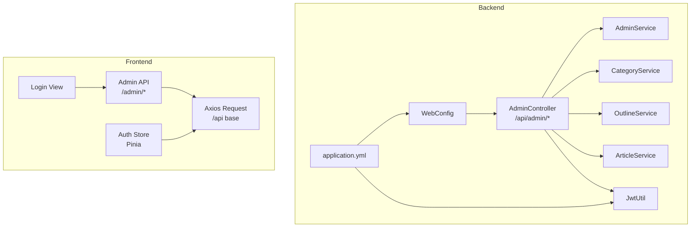
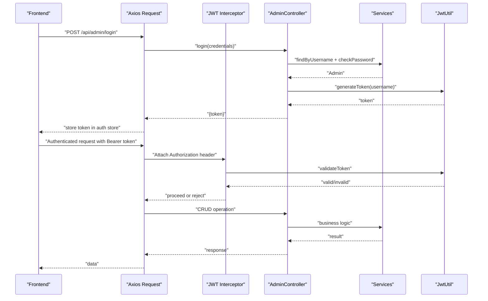
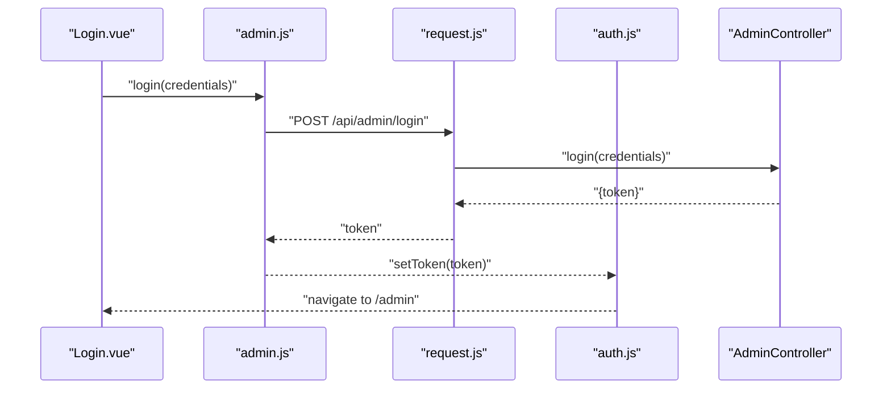
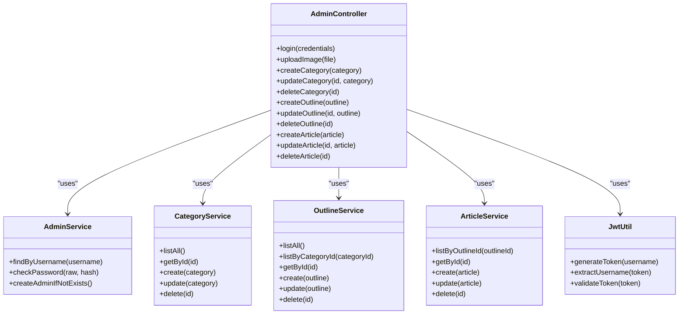

# Admin API Reference

<cite>
**Referenced Files in This Document**
- [AdminController.java](file://blog-backend/src/main/java/com/blog/controller/AdminController.java)
- [WebConfig.java](file://blog-backend/src/main/java/com/blog/config/WebConfig.java)
- [JwtUtil.java](file://blog-backend/src/main/java/com/blog/util/JwtUtil.java)
- [AdminService.java](file://blog-backend/src/main/java/com/blog/service/AdminService.java)
- [CategoryService.java](file://blog-backend/src/main/java/com/blog/service/CategoryService.java)
- [OutlineService.java](file://blog-backend/src/main/java/com/blog/service/OutlineService.java)
- [ArticleService.java](file://blog-backend/src/main/java/com/blog/service/ArticleService.java)
- [Category.java](file://blog-backend/src/main/java/com/blog/entity/Category.java)
- [Outline.java](file://blog-backend/src/main/java/com/blog/entity/Outline.java)
- [Article.java](file://blog-backend/src/main/java/com/blog/entity/Article.java)
- [application.yml](file://blog-backend/src/main/resources/application.yml)
- [admin.js](file://blog-frontend/src/api/admin.js)
- [request.js](file://blog-frontend/src/api/request.js)
- [auth.js](file://blog-frontend/src/stores/auth.js)
- [Login.vue](file://blog-frontend/src/views/admin/Login.vue)
</cite>

## Table of Contents
1. [Introduction](#introduction)
2. [Project Structure](#project-structure)
3. [Core Components](#core-components)
4. [Architecture Overview](#architecture-overview)
5. [Detailed Component Analysis](#detailed-component-analysis)
6. [Dependency Analysis](#dependency-analysis)
7. [Performance Considerations](#performance-considerations)
8. [Troubleshooting Guide](#troubleshooting-guide)
9. [Conclusion](#conclusion)
10. [Appendices](#appendices)

## Introduction
This document describes the Admin REST API used by the administrative interface. It covers authentication, file uploads, and CRUD operations for categories, outlines, and articles. It includes endpoint specifications, request/response schemas, authentication requirements, error handling, status codes, and practical curl examples. It also documents rate-limiting considerations, security headers, and integration patterns for the admin interface components.

## Project Structure
The Admin API is implemented in the Spring Boot backend under the package com.blog.controller and supported by services, mappers, and entities. The frontend integrates via Axios interceptors and Pinia stores.

**Diagram sources**
- [AdminController.java:19-121](file://blog-backend/src/main/java/com/blog/controller/AdminController.java#L19-L121)
- [WebConfig.java:10-39](file://blog-backend/src/main/java/com/blog/config/WebConfig.java#L10-L39)
- [JwtUtil.java:13-57](file://blog-backend/src/main/java/com/blog/util/JwtUtil.java#L13-L57)
- [application.yml:27-33](file://blog-backend/src/main/resources/application.yml#L27-L33)
- [admin.js:1-12](file://blog-frontend/src/api/admin.js#L1-L12)
- [request.js:1-33](file://blog-frontend/src/api/request.js#L1-L33)
- [auth.js:1-19](file://blog-frontend/src/stores/auth.js#L1-L19)
- [Login.vue:1-83](file://blog-frontend/src/views/admin/Login.vue#L1-L83)

**Section sources**
- [AdminController.java:19-121](file://blog-backend/src/main/java/com/blog/controller/AdminController.java#L19-L121)
- [WebConfig.java:10-39](file://blog-backend/src/main/java/com/blog/config/WebConfig.java#L10-L39)
- [application.yml:27-33](file://blog-backend/src/main/resources/application.yml#L27-L33)

## Core Components
- AdminController: Exposes /api/admin endpoints for login, file upload, and CRUD operations for categories, outlines, and articles.
- Services: AdminService, CategoryService, OutlineService, ArticleService encapsulate business logic and persistence.
- Entities: Category, Outline, Article define the data models.
- Security: JwtUtil generates and validates tokens; WebConfig registers JWT interceptor for protected routes.
- Frontend: Axios request module injects Authorization header; Pinia auth store persists token; Admin API helpers wrap multipart uploads.

**Section sources**
- [AdminController.java:25-29](file://blog-backend/src/main/java/com/blog/controller/AdminController.java#L25-L29)
- [AdminService.java:11-34](file://blog-backend/src/main/java/com/blog/service/AdminService.java#L11-L34)
- [CategoryService.java:12-42](file://blog-backend/src/main/java/com/blog/service/CategoryService.java#L12-L42)
- [OutlineService.java:12-47](file://blog-backend/src/main/java/com/blog/service/OutlineService.java#L12-L47)
- [ArticleService.java:16-72](file://blog-backend/src/main/java/com/blog/service/ArticleService.java#L16-L72)
- [JwtUtil.java:13-57](file://blog-backend/src/main/java/com/blog/util/JwtUtil.java#L13-L57)
- [WebConfig.java:10-39](file://blog-backend/src/main/java/com/blog/config/WebConfig.java#L10-L39)
- [Category.java:6-13](file://blog-backend/src/main/java/com/blog/entity/Category.java#L6-L13)
- [Outline.java:6-14](file://blog-backend/src/main/java/com/blog/entity/Outline.java#L6-L14)
- [Article.java:6-15](file://blog-backend/src/main/java/com/blog/entity/Article.java#L6-L15)
- [admin.js:1-12](file://blog-frontend/src/api/admin.js#L1-L12)
- [request.js:1-33](file://blog-frontend/src/api/request.js#L1-L33)
- [auth.js:1-19](file://blog-frontend/src/stores/auth.js#L1-L19)

## Architecture Overview
The admin API follows a layered architecture:
- Presentation: AdminController exposes REST endpoints.
- Application: Services orchestrate domain operations and coordinate persistence.
- Persistence: MyBatis mappers and repositories manage data access.
- Security: JWT-based authentication enforced by an interceptor for /api/admin/** except /login.
- Frontend: Axios interceptors attach Authorization headers; Pinia manages token lifecycle.

**Diagram sources**
- [AdminController.java:34-44](file://blog-backend/src/main/java/com/blog/controller/AdminController.java#L34-L44)
- [AdminService.java:16-22](file://blog-backend/src/main/java/com/blog/service/AdminService.java#L16-L22)
- [JwtUtil.java:25-47](file://blog-backend/src/main/java/com/blog/util/JwtUtil.java#L25-L47)
- [WebConfig.java:18-22](file://blog-backend/src/main/java/com/blog/config/WebConfig.java#L18-L22)
- [request.js:9-18](file://blog-frontend/src/api/request.js#L9-L18)
- [auth.js:4-15](file://blog-frontend/src/stores/auth.js#L4-L15)

## Detailed Component Analysis

### Authentication Endpoints
- Endpoint: POST /api/admin/login
- Purpose: Authenticate administrator and return a JWT bearer token.
- Authentication: No prior authentication required.
- Request body:
  - username: string (required)
  - password: string (required)
- Response:
  - token: string (JWT)
- Error responses:
  - 401 Unauthorized: Invalid credentials
- Example curl:
  - curl -X POST http://localhost:8080/api/admin/login -H "Content-Type: application/json" -d '{"username":"admin","password":"admin123"}'

Notes:
- Token expiration and secret are configured in application.yml.
- The frontend stores the token and attaches Authorization: Bearer <token> to subsequent requests.

**Section sources**
- [AdminController.java:34-44](file://blog-backend/src/main/java/com/blog/controller/AdminController.java#L34-L44)
- [AdminService.java:16-22](file://blog-backend/src/main/java/com/blog/service/AdminService.java#L16-L22)
- [JwtUtil.java:25-34](file://blog-backend/src/main/java/com/blog/util/JwtUtil.java#L25-L34)
- [application.yml:27-30](file://blog-backend/src/main/resources/application.yml#L27-L30)
- [request.js:12-14](file://blog-frontend/src/api/request.js#L12-L14)
- [auth.js:4-10](file://blog-frontend/src/stores/auth.js#L4-L10)
- [Login.vue:32-41](file://blog-frontend/src/views/admin/Login.vue#L32-L41)

### File Upload Endpoints
- Endpoint: POST /api/admin/upload
- Purpose: Upload an image file and return a URL to access the uploaded resource.
- Authentication: Required (Authorization: Bearer <token>).
- Request:
  - Content-Type: multipart/form-data
  - Body field: file (binary)
- Response:
  - url: string (relative path /upload/<filename>)
- Error responses:
  - 400 Bad Request: Upload failed
- Example curl:
  - curl -X POST "http://localhost:8080/api/admin/upload" -H "Authorization: Bearer $TOKEN" -F "file=@/path/to/image.jpg"

Notes:
- Uploaded files are stored under the configured upload path and served via /upload/**.
- The frontend helper constructs multipart/form-data and sets appropriate headers.

**Section sources**
- [AdminController.java:46-59](file://blog-backend/src/main/java/com/blog/controller/AdminController.java#L46-L59)
- [WebConfig.java:24-28](file://blog-backend/src/main/java/com/blog/config/WebConfig.java#L24-L28)
- [application.yml:31-33](file://blog-backend/src/main/resources/application.yml#L31-L33)
- [admin.js:5-11](file://blog-frontend/src/api/admin.js#L5-L11)

### Category Management CRUD
- Base path: /api/admin/categories
- Authentication: Required (Authorization: Bearer <token>)

1) Create Category
- Method: POST
- Path: /api/admin/categories
- Request body: Category object
  - name: string (required)
  - sortOrder: integer (optional)
- Response: Category object (with generated id)
- Status codes: 200 OK

2) Update Category
- Method: PUT
- Path: /api/admin/categories/{id}
- Path variable: id (integer)
- Request body: Category object (id set to path)
- Response: Category object
- Status codes: 200 OK

3) Delete Category
- Method: DELETE
- Path: /api/admin/categories/{id}
- Path variable: id (integer)
- Response: { message: "Deleted" }
- Status codes: 200 OK

Entity model: Category
- id: integer
- name: string
- sortOrder: integer
- createdAt: datetime (auto-generated)

Example curl:
- Create: curl -X POST http://localhost:8080/api/admin/categories -H "Authorization: Bearer $TOKEN" -H "Content-Type: application/json" -d '{"name":"Tech","sortOrder":1}'
- Update: curl -X PUT http://localhost:8080/api/admin/categories/1 -H "Authorization: Bearer $TOKEN" -H "Content-Type: application/json" -d '{"id":1,"name":"Technology","sortOrder":1}'
- Delete: curl -X DELETE http://localhost:8080/api/admin/categories/1 -H "Authorization: Bearer $TOKEN"

**Section sources**
- [AdminController.java:62-79](file://blog-backend/src/main/java/com/blog/controller/AdminController.java#L62-L79)
- [CategoryService.java:18-40](file://blog-backend/src/main/java/com/blog/service/CategoryService.java#L18-L40)
- [Category.java:6-13](file://blog-backend/src/main/java/com/blog/entity/Category.java#L6-L13)

### Outline Management CRUD
- Base path: /api/admin/outlines
- Authentication: Required (Authorization: Bearer <token>)

1) Create Outline
- Method: POST
- Path: /api/admin/outlines
- Request body: Outline object
  - categoryId: integer (required)
  - title: string (required)
  - sortOrder: integer (optional)
- Response: Outline object (with generated id)
- Status codes: 200 OK

2) Update Outline
- Method: PUT
- Path: /api/admin/outlines/{id}
- Path variable: id (integer)
- Request body: Outline object (id set to path)
- Response: Outline object
- Status codes: 200 OK

3) Delete Outline
- Method: DELETE
- Path: /api/admin/outlines/{id}
- Path variable: id (integer)
- Response: { message: "Deleted" }
- Status codes: 200 OK

Entity model: Outline
- id: integer
- categoryId: integer
- title: string
- sortOrder: integer
- createdAt: datetime (auto-generated)

Example curl:
- Create: curl -X POST http://localhost:8080/api/admin/outlines -H "Authorization: Bearer $TOKEN" -H "Content-Type: application/json" -d '{"categoryId":1,"title":"Getting Started","sortOrder":1}'
- Update: curl -X PUT http://localhost:8080/api/admin/outlines/1 -H "Authorization: Bearer $TOKEN" -H "Content-Type: application/json" -d '{"id":1,"categoryId":1,"title":"Intro","sortOrder":1}'
- Delete: curl -X DELETE http://localhost:8080/api/admin/outlines/1 -H "Authorization: Bearer $TOKEN"

**Section sources**
- [AdminController.java:82-99](file://blog-backend/src/main/java/com/blog/controller/AdminController.java#L82-L99)
- [OutlineService.java:18-45](file://blog-backend/src/main/java/com/blog/service/OutlineService.java#L18-L45)
- [Outline.java:6-14](file://blog-backend/src/main/java/com/blog/entity/Outline.java#L6-L14)

### Article Management CRUD
- Base path: /api/admin/articles
- Authentication: Required (Authorization: Bearer <token>)

1) Create Article
- Method: POST
- Path: /api/admin/articles
- Request body: Article object
  - outlineId: integer (required)
  - title: string (required)
  - content: string (required)
- Response: Article object (with generated id)
- Status codes: 200 OK
- Notes: On create/update, the service attempts to index the article in Elasticsearch; failures are logged but do not fail the request.

2) Update Article
- Method: PUT
- Path: /api/admin/articles/{id}
- Path variable: id (integer)
- Request body: Article object (id set to path)
- Response: Article object
- Status codes: 200 OK

3) Delete Article
- Method: DELETE
- Path: /api/admin/articles/{id}
- Path variable: id (integer)
- Response: { message: "Deleted" }
- Status codes: 200 OK

Entity model: Article
- id: integer
- outlineId: integer
- title: string
- content: string
- createdAt: datetime (auto-generated)
- updatedAt: datetime (auto-generated)

Example curl:
- Create: curl -X POST http://localhost:8080/api/admin/articles -H "Authorization: Bearer $TOKEN" -H "Content-Type: application/json" -d '{"outlineId":1,"title":"Welcome","content":"..."}'
- Update: curl -X PUT http://localhost:8080/api/admin/articles/1 -H "Authorization: Bearer $TOKEN" -H "Content-Type: application/json" -d '{"id":1,"outlineId":1,"title":"Hello","content":"..."}'
- Delete: curl -X DELETE http://localhost:8080/api/admin/articles/1 -H "Authorization: Bearer $TOKEN"

**Section sources**
- [AdminController.java:102-119](file://blog-backend/src/main/java/com/blog/controller/AdminController.java#L102-L119)
- [ArticleService.java:32-70](file://blog-backend/src/main/java/com/blog/service/ArticleService.java#L32-L70)
- [Article.java:6-15](file://blog-backend/src/main/java/com/blog/entity/Article.java#L6-L15)

### Request/Response Schemas

- Authentication
  - Request: { username: string, password: string }
  - Response: { token: string }

- Upload
  - Request: multipart/form-data with field file
  - Response: { url: string }

- Category
  - Request/Response: Category object
    - id: integer
    - name: string
    - sortOrder: integer
    - createdAt: datetime

- Outline
  - Request/Response: Outline object
    - id: integer
    - categoryId: integer
    - title: string
    - sortOrder: integer
    - createdAt: datetime

- Article
  - Request/Response: Article object
    - id: integer
    - outlineId: integer
    - title: string
    - content: string
    - createdAt: datetime
    - updatedAt: datetime

**Section sources**
- [AdminController.java:34-59](file://blog-backend/src/main/java/com/blog/controller/AdminController.java#L34-L59)
- [Category.java:6-13](file://blog-backend/src/main/java/com/blog/entity/Category.java#L6-L13)
- [Outline.java:6-14](file://blog-backend/src/main/java/com/blog/entity/Outline.java#L6-L14)
- [Article.java:6-15](file://blog-backend/src/main/java/com/blog/entity/Article.java#L6-L15)

### Error Handling and Status Codes
- 400 Bad Request
  - Upload failure
- 401 Unauthorized
  - Invalid or missing JWT token
  - Frontend automatically clears token and redirects to login
- 200 OK
  - Successful create/update/delete operations return the persisted entity or { message: "Deleted" }

Security behavior:
- Interceptor enforces JWT validation for /api/admin/** excluding /api/admin/login.
- On 401, the frontend clears the token and navigates to /admin/login.

**Section sources**
- [AdminController.java:40-41](file://blog-backend/src/main/java/com/blog/controller/AdminController.java#L40-L41)
- [AdminController.java:56-58](file://blog-backend/src/main/java/com/blog/controller/AdminController.java#L56-L58)
- [WebConfig.java:18-22](file://blog-backend/src/main/java/com/blog/config/WebConfig.java#L18-L22)
- [request.js:20-29](file://blog-frontend/src/api/request.js#L20-L29)

### Rate Limiting Considerations
- The backend does not implement explicit rate limiting for admin endpoints.
- Recommendations:
  - Deploy a reverse proxy or API gateway with rate limiting rules for /api/admin/.
  - Apply per-IP or per-token limits for login and upload endpoints.
  - Consider circuit breakers and health checks for Elasticsearch indexing retries.

[No sources needed since this section provides general guidance]

### Security Headers and Best Practices
- CORS: Configured to allow all origins and methods; restrict origins in production.
- CSRF: Not applicable for stateless JWT bearer tokens.
- TLS: Enforce HTTPS in production.
- Token storage: Frontend stores token in localStorage; consider HttpOnly cookies if using server-rendered pages.
- Least privilege: Restrict admin roles and rotate secrets regularly.

**Section sources**
- [WebConfig.java:31-37](file://blog-backend/src/main/java/com/blog/config/WebConfig.java#L31-L37)
- [application.yml:27-30](file://blog-backend/src/main/resources/application.yml#L27-L30)
- [auth.js:4-15](file://blog-frontend/src/stores/auth.js#L4-L15)

### Integration Patterns for Admin Interface Components
- Axios interceptors:
  - Automatically attach Authorization: Bearer <token> when present.
  - On 401, clear token and redirect to login.
- Admin API helpers:
  - login(): POST /api/admin/login
  - uploadImage(): POST /api/admin/upload with multipart/form-data
- Auth store:
  - Persist token in localStorage and expose getter/setter/logout.
- Login view:
  - Collects credentials and invokes login(), then navigates to admin dashboard.

**Diagram sources**
- [Login.vue:32-41](file://blog-frontend/src/views/admin/Login.vue#L32-L41)
- [admin.js:3](file://blog-frontend/src/api/admin.js#L3)
- [request.js:9-18](file://blog-frontend/src/api/request.js#L9-L18)
- [auth.js:7-10](file://blog-frontend/src/stores/auth.js#L7-L10)
- [AdminController.java:34-44](file://blog-backend/src/main/java/com/blog/controller/AdminController.java#L34-L44)

**Section sources**
- [admin.js:1-12](file://blog-frontend/src/api/admin.js#L1-L12)
- [request.js:1-33](file://blog-frontend/src/api/request.js#L1-L33)
- [auth.js:1-19](file://blog-frontend/src/stores/auth.js#L1-L19)
- [Login.vue:1-83](file://blog-frontend/src/views/admin/Login.vue#L1-L83)

## Dependency Analysis

**Diagram sources**
- [AdminController.java:25-29](file://blog-backend/src/main/java/com/blog/controller/AdminController.java#L25-L29)
- [AdminService.java:11-34](file://blog-backend/src/main/java/com/blog/service/AdminService.java#L11-L34)
- [CategoryService.java:12-42](file://blog-backend/src/main/java/com/blog/service/CategoryService.java#L12-L42)
- [OutlineService.java:12-47](file://blog-backend/src/main/java/com/blog/service/OutlineService.java#L12-L47)
- [ArticleService.java:16-72](file://blog-backend/src/main/java/com/blog/service/ArticleService.java#L16-L72)
- [JwtUtil.java:13-57](file://blog-backend/src/main/java/com/blog/util/JwtUtil.java#L13-L57)

**Section sources**
- [AdminController.java:19-121](file://blog-backend/src/main/java/com/blog/controller/AdminController.java#L19-L121)

## Performance Considerations
- Caching:
  - CategoryService caches listAll() results; cache is evicted on create/update/delete.
  - OutlineService caches listAll() and listByCategoryId(); cache is evicted on changes.
  - ArticleService caches getById(); cache is evicted on changes.
- Elasticsearch indexing:
  - Article create/update attempts to index; failures are logged but do not block the request.
- Recommendations:
  - Monitor cache hit rates and tune eviction policies.
  - Batch or debounce frequent updates to reduce cache churn.
  - Consider async indexing for high-throughput scenarios.

**Section sources**
- [CategoryService.java:18-40](file://blog-backend/src/main/java/com/blog/service/CategoryService.java#L18-L40)
- [OutlineService.java:18-45](file://blog-backend/src/main/java/com/blog/service/OutlineService.java#L18-L45)
- [ArticleService.java:27-70](file://blog-backend/src/main/java/com/blog/service/ArticleService.java#L27-L70)

## Troubleshooting Guide
- 401 Unauthorized after login:
  - Verify token presence in localStorage and Authorization header injection.
  - Confirm JWT secret and expiration match backend configuration.
- Upload fails (400):
  - Ensure multipart/form-data is used and file field name is file.
  - Check upload path permissions and existence.
- CORS errors:
  - Origins are configured to allow all; adjust allowedOrigins in production.
- Elasticsearch indexing failures:
  - Check connectivity to Elasticsearch; review logs for warnings.

**Section sources**
- [request.js:12-14](file://blog-frontend/src/api/request.js#L12-L14)
- [application.yml:27-33](file://blog-backend/src/main/resources/application.yml#L27-L33)
- [WebConfig.java:31-37](file://blog-backend/src/main/java/com/blog/config/WebConfig.java#L31-L37)
- [ArticleService.java:35-44](file://blog-backend/src/main/java/com/blog/service/ArticleService.java#L35-L44)

## Conclusion
The Admin API provides a compact, JWT-secured set of endpoints for managing categories, outlines, and articles, plus image uploads. The frontend integrates seamlessly via Axios interceptors and a simple auth store. Production deployments should enforce stricter CORS, implement rate limiting, and secure token storage appropriately.

## Appendices

### Endpoint Summary
- Authentication
  - POST /api/admin/login
- Upload
  - POST /api/admin/upload
- Categories
  - POST /api/admin/categories
  - PUT /api/admin/categories/{id}
  - DELETE /api/admin/categories/{id}
- Outlines
  - POST /api/admin/outlines
  - PUT /api/admin/outlines/{id}
  - DELETE /api/admin/outlines/{id}
- Articles
  - POST /api/admin/articles
  - PUT /api/admin/articles/{id}
  - DELETE /api/admin/articles/{id}

**Section sources**
- [AdminController.java:34-119](file://blog-backend/src/main/java/com/blog/controller/AdminController.java#L34-L119)