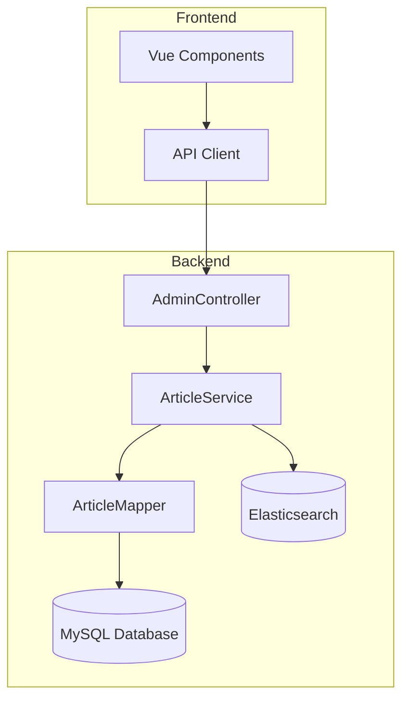
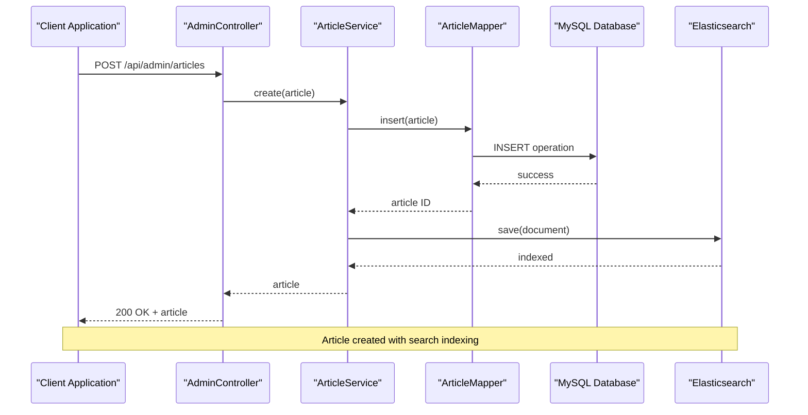
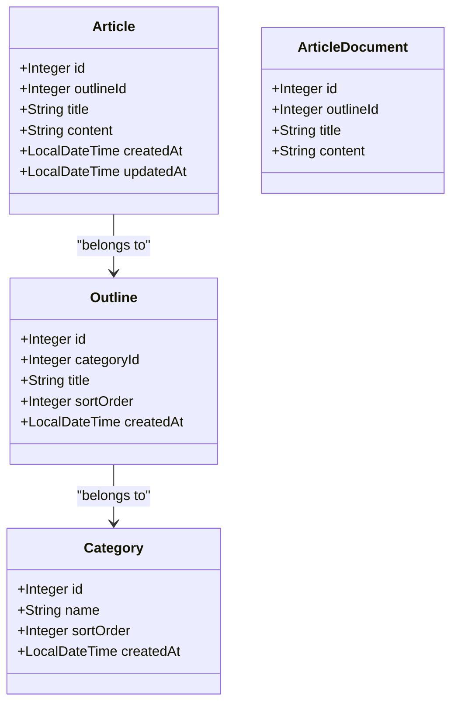
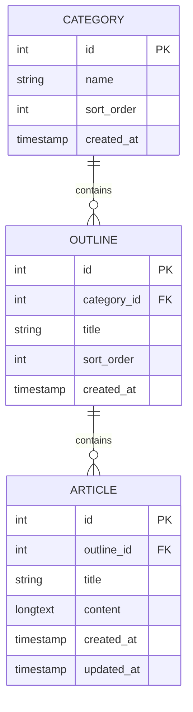
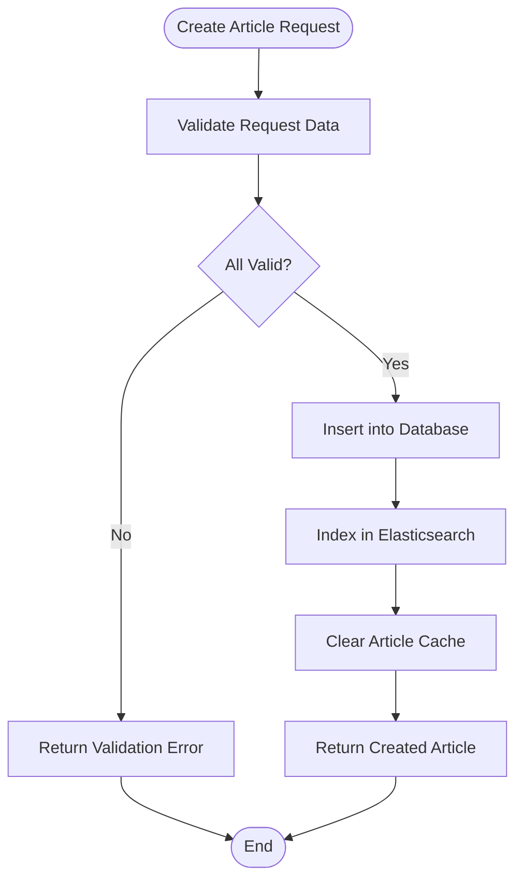
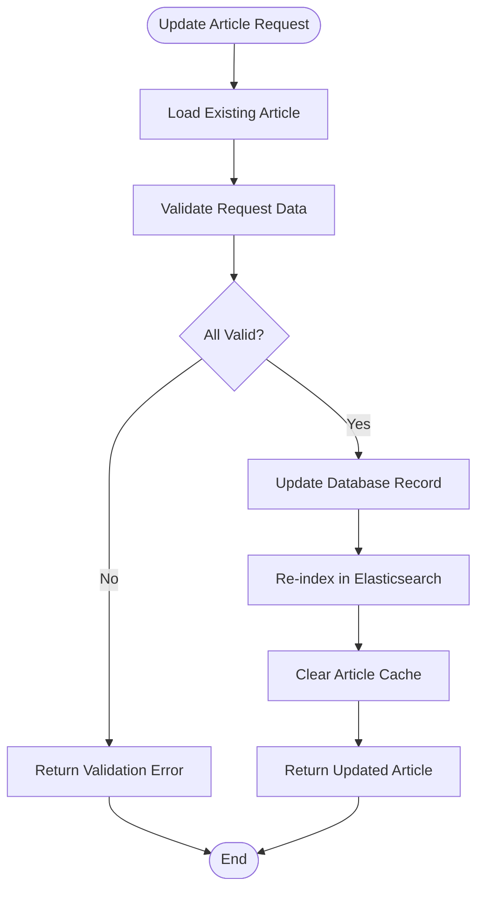
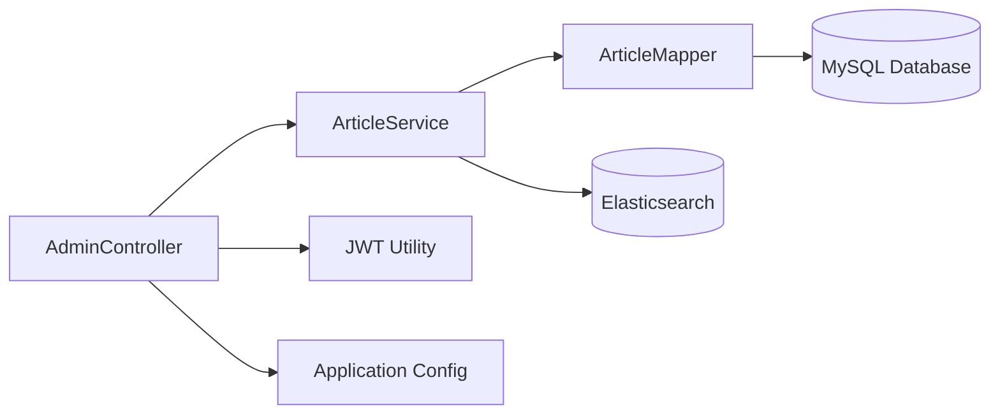

# Article Management API

<cite>
**Referenced Files in This Document**
- [AdminController.java](file://blog-backend/src/main/java/com/blog/controller/AdminController.java)
- [ArticleService.java](file://blog-backend/src/main/java/com/blog/service/ArticleService.java)
- [ArticleMapper.java](file://blog-backend/src/main/java/com/blog/mapper/ArticleMapper.java)
- [Article.java](file://blog-backend/src/main/java/com/blog/entity/Article.java)
- [ArticleDocument.java](file://blog-backend/src/main/java/com/blog/entity/ArticleDocument.java)
- [schema.sql](file://blog-backend/src/main/resources/schema.sql)
- [application.yml](file://blog-backend/src/main/resources/application.yml)
- [article.js](file://blog-frontend/src/api/article.js)
- [ArticleEdit.vue](file://blog-frontend/src/views/admin/ArticleEdit.vue)
- [request.js](file://blog-frontend/src/api/request.js)
</cite>

## Table of Contents
1. [Introduction](#introduction)
2. [Project Structure](#project-structure)
3. [Core Components](#core-components)
4. [Architecture Overview](#architecture-overview)
5. [Detailed Component Analysis](#detailed-component-analysis)
6. [API Reference](#api-reference)
7. [Content Validation Rules](#content-validation-rules)
8. [Article Publishing Workflows](#article-publishing-workflows)
9. [Practical Examples](#practical-examples)
10. [Dependency Analysis](#dependency-analysis)
11. [Performance Considerations](#performance-considerations)
12. [Troubleshooting Guide](#troubleshooting-guide)
13. [Conclusion](#conclusion)

## Introduction
This document provides comprehensive API documentation for article management CRUD operations in the blog system. It covers the creation, updating, and deletion of articles, including their relationships with outlines and categories, content validation rules, and practical usage examples with curl commands and JSON payloads.

## Project Structure
The article management functionality spans three main layers:
- **Presentation Layer**: REST controller handling HTTP requests
- **Service Layer**: Business logic and data coordination
- **Persistence Layer**: Database mapping and storage



**Diagram sources**
- [AdminController.java:19-121](file://blog-backend/src/main/java/com/blog/controller/AdminController.java#L19-L121)
- [ArticleService.java:15-72](file://blog-backend/src/main/java/com/blog/service/ArticleService.java#L15-L72)
- [ArticleMapper.java:8-27](file://blog-backend/src/main/java/com/blog/mapper/ArticleMapper.java#L8-L27)

**Section sources**
- [AdminController.java:19-121](file://blog-backend/src/main/java/com/blog/controller/AdminController.java#L19-L121)
- [ArticleService.java:15-72](file://blog-backend/src/main/java/com/blog/service/ArticleService.java#L15-L72)
- [ArticleMapper.java:8-27](file://blog-backend/src/main/java/com/blog/mapper/ArticleMapper.java#L8-L27)

## Core Components
The article management system consists of several key components working together:

### Entity Model
The Article entity represents individual blog posts with essential metadata and content fields.

### Service Layer
The ArticleService coordinates between the controller, mapper, and search repository, handling caching and Elasticsearch indexing.

### Data Access Layer
ArticleMapper provides SQL operations for CRUD functionality with proper parameter binding.

**Section sources**
- [Article.java:6-14](file://blog-backend/src/main/java/com/blog/entity/Article.java#L6-L14)
- [ArticleService.java:18-71](file://blog-backend/src/main/java/com/blog/service/ArticleService.java#L18-L71)
- [ArticleMapper.java:9-26](file://blog-backend/src/main/java/com/blog/mapper/ArticleMapper.java#L9-L26)

## Architecture Overview
The system follows a layered architecture pattern with clear separation of concerns:



**Diagram sources**
- [AdminController.java:102-106](file://blog-backend/src/main/java/com/blog/controller/AdminController.java#L102-L106)
- [ArticleService.java:32-45](file://blog-backend/src/main/java/com/blog/service/ArticleService.java#L32-L45)
- [ArticleMapper.java:17-19](file://blog-backend/src/main/java/com/blog/mapper/ArticleMapper.java#L17-L19)

## Detailed Component Analysis

### Article Entity Analysis
The Article entity defines the core structure for blog posts with essential relationships and metadata.



**Diagram sources**
- [Article.java:7-14](file://blog-backend/src/main/java/com/blog/entity/Article.java#L7-L14)
- [ArticleDocument.java:11-24](file://blog-backend/src/main/java/com/blog/entity/ArticleDocument.java#L11-L24)
- [Outline.java:7-13](file://blog-backend/src/main/java/com/blog/entity/Outline.java#L7-L13)
- [Category.java:7-12](file://blog-backend/src/main/java/com/blog/entity/Category.java#L7-L12)

### Database Schema Relationships
The database enforces referential integrity through foreign key constraints:



**Diagram sources**
- [schema.sql:1-33](file://blog-backend/src/main/resources/schema.sql#L1-L33)

**Section sources**
- [Article.java:7-14](file://blog-backend/src/main/java/com/blog/entity/Article.java#L7-L14)
- [ArticleDocument.java:11-24](file://blog-backend/src/main/java/com/blog/entity/ArticleDocument.java#L11-L24)
- [schema.sql:8-25](file://blog-backend/src/main/resources/schema.sql#L8-L25)

## API Reference

### POST /api/admin/articles
Creates a new article with the provided details.

**Request Body:**
```json
{
  "outlineId": 1,
  "title": "Sample Article Title",
  "content": "<p>Rich text content goes here</p>"
}
```

**Response:**
- Status: 200 OK
- Body: Complete article object with generated ID

**Section sources**
- [AdminController.java:102-106](file://blog-backend/src/main/java/com/blog/controller/AdminController.java#L102-L106)
- [ArticleService.java:32-45](file://blog-backend/src/main/java/com/blog/service/ArticleService.java#L32-L45)

### PUT /api/admin/articles/{id}
Updates an existing article identified by ID.

**Path Parameters:**
- `id` (integer): Article identifier

**Request Body:**
```json
{
  "outlineId": 2,
  "title": "Updated Article Title",
  "content": "<p>Updated rich text content</p>"
}
```

**Response:**
- Status: 200 OK
- Body: Updated article object

**Section sources**
- [AdminController.java:108-113](file://blog-backend/src/main/java/com/blog/controller/AdminController.java#L108-L113)
- [ArticleService.java:47-60](file://blog-backend/src/main/java/com/blog/service/ArticleService.java#L47-L60)

### DELETE /api/admin/articles/{id}
Removes an article and its associated search index.

**Path Parameters:**
- `id` (integer): Article identifier

**Response:**
- Status: 200 OK
- Body: `{ "message": "Deleted" }`

**Section sources**
- [AdminController.java:115-119](file://blog-backend/src/main/java/com/blog/controller/AdminController.java#L115-L119)
- [ArticleService.java:62-70](file://blog-backend/src/main/java/com/blog/service/ArticleService.java#L62-L70)

## Content Validation Rules
The system implements the following validation rules:

### Required Fields
- `outlineId`: Must be a positive integer referencing existing outline
- `title`: Non-empty string, max length 255 characters
- `content`: Accepts rich text HTML content

### Relationship Constraints
- `outlineId` must reference an existing outline record
- Foreign key constraint ensures data integrity
- Cascade deletion maintains referential integrity

### Data Types and Constraints
- Auto-generated timestamps for creation and updates
- Rich text content stored as HTML in LONGTEXT field
- UUID generation for uploaded media files

**Section sources**
- [schema.sql:17-25](file://blog-backend/src/main/resources/schema.sql#L17-L25)
- [Article.java:8-13](file://blog-backend/src/main/java/com/blog/entity/Article.java#L8-L13)

## Article Publishing Workflows

### Creation Workflow


**Diagram sources**
- [ArticleService.java:32-45](file://blog-backend/src/main/java/com/blog/service/ArticleService.java#L32-L45)
- [ArticleMapper.java:17-19](file://blog-backend/src/main/java/com/blog/mapper/ArticleMapper.java#L17-L19)

### Update Workflow


**Diagram sources**
- [ArticleService.java:47-60](file://blog-backend/src/main/java/com/blog/service/ArticleService.java#L47-L60)
- [ArticleMapper.java:21](file://blog-backend/src/main/java/com/blog/mapper/ArticleMapper.java#L21)

**Section sources**
- [ArticleService.java:32-70](file://blog-backend/src/main/java/com/blog/service/ArticleService.java#L32-L70)

## Practical Examples

### Creating an Article
```bash
curl -X POST "http://localhost:8080/api/admin/articles" \
  -H "Content-Type: application/json" \
  -d '{
    "outlineId": 1,
    "title": "Getting Started with Blogging",
    "content": "<p>Welcome to your new blogging platform!</p><p>This is the beginning of your journey.</p>"
  }'
```

### Updating an Article
```bash
curl -X PUT "http://localhost:8080/api/admin/articles/1" \
  -H "Content-Type: application/json" \
  -d '{
    "outlineId": 2,
    "title": "Enhanced Blogging Guide",
    "content": "<p>Updated content with new insights and tips.</p>"
  }'
```

### Deleting an Article
```bash
curl -X DELETE "http://localhost:8080/api/admin/articles/1"
```

### Frontend Integration Example
The frontend components demonstrate proper API usage:

**Section sources**
- [article.js:9-13](file://blog-frontend/src/api/article.js#L9-L13)
- [ArticleEdit.vue:73-80](file://blog-frontend/src/views/admin/ArticleEdit.vue#L73-L80)

## Dependency Analysis

### Component Dependencies


**Diagram sources**
- [AdminController.java:25-29](file://blog-backend/src/main/java/com/blog/controller/AdminController.java#L25-L29)
- [ArticleService.java:20-21](file://blog-backend/src/main/java/com/blog/service/ArticleService.java#L20-L21)
- [ArticleMapper.java:3](file://blog-backend/src/main/java/com/blog/mapper/ArticleMapper.java#L3)

### External Dependencies
- **MySQL**: Primary data storage with foreign key constraints
- **Elasticsearch**: Full-text search capabilities
- **Redis**: Application cache (configured but not used for articles)
- **JWT**: Authentication tokens

**Section sources**
- [application.yml:4-33](file://blog-backend/src/main/resources/application.yml#L4-L33)

## Performance Considerations
The system implements several performance optimizations:

### Caching Strategy
- Article retrieval uses cache eviction on write operations
- Prevents stale data while maintaining performance
- Cache invalidation occurs on create/update/delete operations

### Search Optimization
- Elasticsearch indexing for fast content search
- Automatic re-indexing on article updates
- Fail-safe error handling for search operations

### Database Efficiency
- Parameterized queries prevent SQL injection
- Generated keys for auto-increment fields
- Proper indexing through foreign key constraints

**Section sources**
- [ArticleService.java:27-30](file://blog-backend/src/main/java/com/blog/service/ArticleService.java#L27-L30)
- [ArticleService.java:32-45](file://blog-backend/src/main/java/com/blog/service/ArticleService.java#L32-L45)

## Troubleshooting Guide

### Common Issues and Solutions

**401 Unauthorized Errors**
- Verify JWT token in Authorization header
- Check token validity and expiration
- Ensure proper authentication flow

**Foreign Key Constraint Violations**
- Validate outlineId exists in outline table
- Check category relationships are intact
- Ensure referential integrity

**Elasticsearch Indexing Failures**
- Verify Elasticsearch service is running
- Check network connectivity
- Review application logs for detailed errors

**Database Connection Issues**
- Verify MySQL server is accessible
- Check connection credentials
- Ensure database schema is properly initialized

**Section sources**
- [request.js:20-30](file://blog-frontend/src/api/request.js#L20-L30)
- [ArticleService.java:42-44](file://blog-backend/src/main/java/com/blog/service/ArticleService.java#L42-L44)

## Conclusion
The article management API provides a robust foundation for content creation and management with proper validation, relationships, and performance optimizations. The system supports rich text content, integrates with Elasticsearch for search capabilities, and maintains data integrity through foreign key constraints. The documented workflows and examples enable developers to effectively implement article management functionality in their applications.