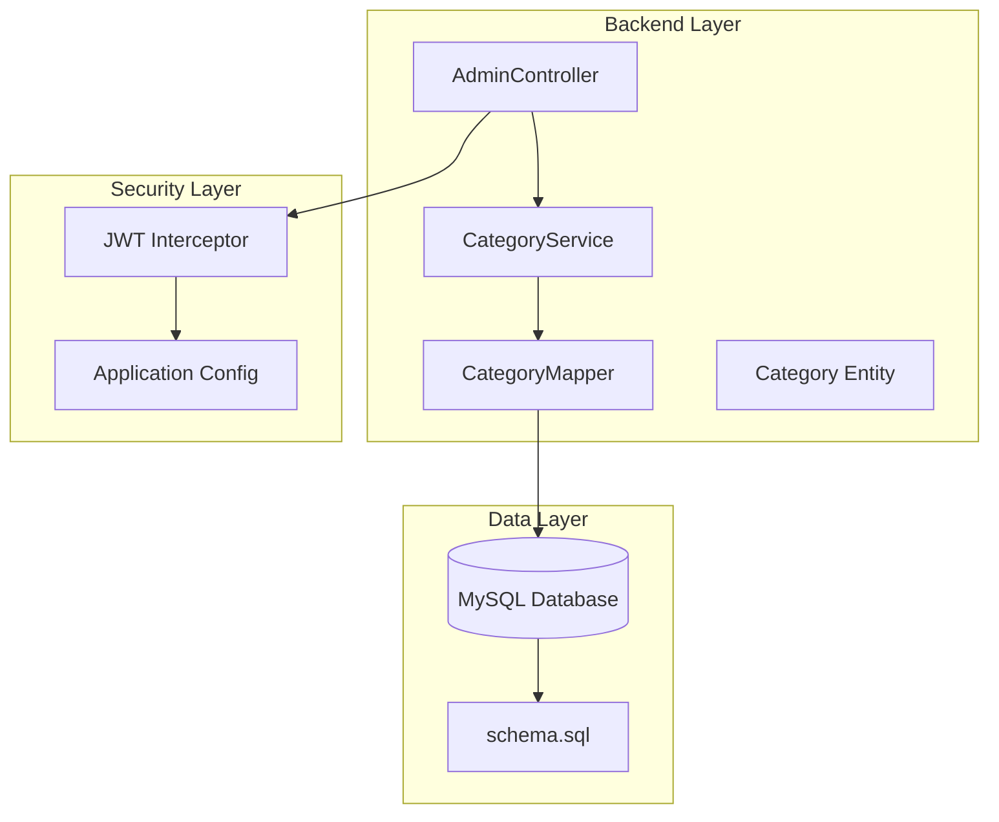
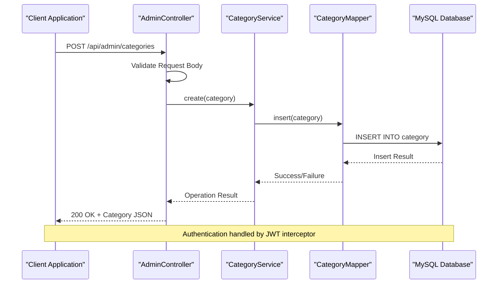
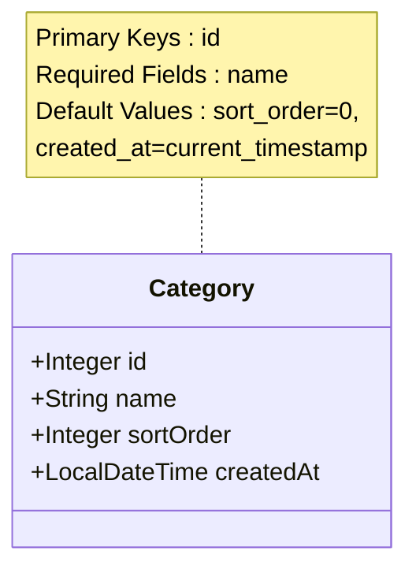
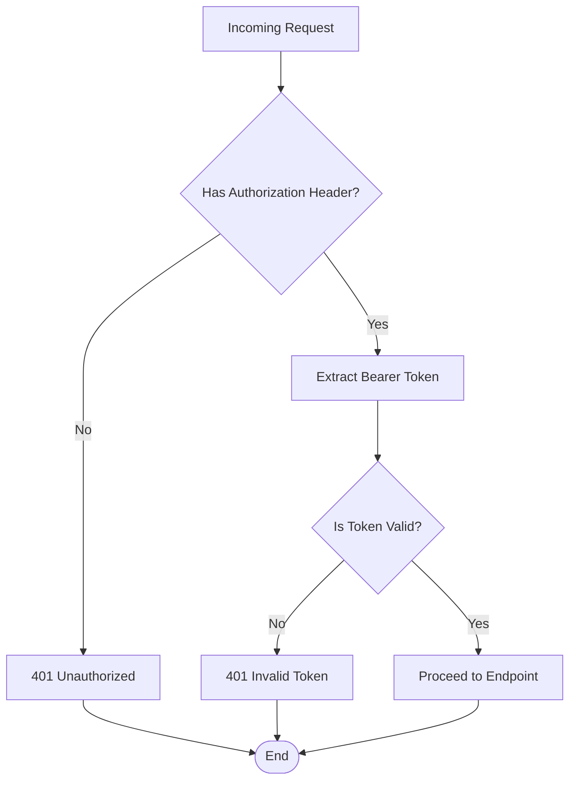
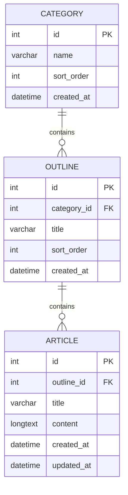

# Category Management API

<cite>
**Referenced Files in This Document**
- [AdminController.java](file://blog-backend/src/main/java/com/blog/controller/AdminController.java)
- [Category.java](file://blog-backend/src/main/java/com/blog/entity/Category.java)
- [CategoryService.java](file://blog-backend/src/main/java/com/blog/service/CategoryService.java)
- [CategoryMapper.java](file://blog-backend/src/main/java/com/blog/mapper/CategoryMapper.java)
- [schema.sql](file://blog-backend/src/main/resources/schema.sql)
- [application.yml](file://blog-backend/src/main/resources/application.yml)
- [JwtInterceptor.java](file://blog-backend/src/main/java/com/blog/config/JwtInterceptor.java)
- [category.js](file://blog-frontend/src/api/category.js)
</cite>

## Table of Contents
1. [Introduction](#introduction)
2. [Project Structure](#project-structure)
3. [Core Components](#core-components)
4. [Architecture Overview](#architecture-overview)
5. [Detailed Component Analysis](#detailed-component-analysis)
6. [API Specifications](#api-specifications)
7. [Entity Schema](#entity-schema)
8. [Validation Rules](#validation-rules)
9. [Error Handling](#error-handling)
10. [Cascading Effects](#cascading-effects)
11. [Practical Examples](#practical-examples)
12. [Performance Considerations](#performance-considerations)
13. [Troubleshooting Guide](#troubleshooting-guide)
14. [Conclusion](#conclusion)

## Introduction
This document provides comprehensive API documentation for category management CRUD operations in the blog backend system. The API enables administrators to create, update, and delete categories that serve as organizational units for outlines and articles. The implementation follows a layered architecture with clear separation between presentation, business logic, and data access layers.

## Project Structure
The category management functionality is implemented within a Spring Boot application following a standard Maven project structure:



**Diagram sources**
- [AdminController.java:19-23](file://blog-backend/src/main/java/com/blog/controller/AdminController.java#L19-L23)
- [CategoryService.java:12-14](file://blog-backend/src/main/java/com/blog/service/CategoryService.java#L12-L14)
- [CategoryMapper.java:8](file://blog-backend/src/main/java/com/blog/mapper/CategoryMapper.java#L8)

**Section sources**
- [AdminController.java:19-23](file://blog-backend/src/main/java/com/blog/controller/AdminController.java#L19-L23)
- [CategoryService.java:12-14](file://blog-backend/src/main/java/com/blog/service/CategoryService.java#L12-L14)
- [CategoryMapper.java:8](file://blog-backend/src/main/java/com/blog/mapper/CategoryMapper.java#L8)

## Core Components
The category management system consists of four primary components working together:

### Controller Layer
The AdminController handles HTTP requests for category operations, providing endpoints for creation, updates, and deletion with proper authentication enforcement.

### Service Layer
The CategoryService manages business logic, caching, and coordinates between the controller and data access layers while maintaining transaction boundaries.

### Data Access Layer
The CategoryMapper provides database operations using MyBatis annotations for SQL queries and maintains the persistence contract.

### Entity Model
The Category entity defines the data structure with essential fields for category identification, naming, ordering, and timestamps.

**Section sources**
- [AdminController.java:61-79](file://blog-backend/src/main/java/com/blog/controller/AdminController.java#L61-L79)
- [CategoryService.java:14-41](file://blog-backend/src/main/java/com/blog/service/CategoryService.java#L14-L41)
- [CategoryMapper.java:9-26](file://blog-backend/src/main/java/com/blog/mapper/CategoryMapper.java#L9-L26)
- [Category.java:7-12](file://blog-backend/src/main/java/com/blog/entity/Category.java#L7-L12)

## Architecture Overview
The category management system follows a clean architecture pattern with clear separation of concerns:



**Diagram sources**
- [AdminController.java:62-66](file://blog-backend/src/main/java/com/blog/controller/AdminController.java#L62-L66)
- [CategoryService.java:28-30](file://blog-backend/src/main/java/com/blog/service/CategoryService.java#L28-L30)
- [CategoryMapper.java:17-19](file://blog-backend/src/main/java/com/blog/mapper/CategoryMapper.java#L17-L19)

## Detailed Component Analysis

### AdminController - Category Endpoints
The controller provides three primary endpoints for category management:

#### POST /api/admin/categories
Creates a new category with automatic ID generation and returns the created entity.

#### PUT /api/admin/categories/{id}
Updates an existing category identified by path parameter with the provided category data.

#### DELETE /api/admin/categories/{id}
Removes a category by ID and returns a confirmation message.

**Section sources**
- [AdminController.java:62-79](file://blog-backend/src/main/java/com/blog/controller/AdminController.java#L62-L79)

### CategoryService - Business Logic
The service layer implements caching strategies and coordinates database operations:

- Uses `@Cacheable` annotation for listing all categories
- Employs `@CacheEvict` for cache invalidation on create/update/delete operations
- Provides centralized business logic for category operations

**Section sources**
- [CategoryService.java:18-40](file://blog-backend/src/main/java/com/blog/service/CategoryService.java#L18-L40)

### CategoryMapper - Data Operations
The mapper implements CRUD operations with SQL injection prevention through parameterized queries:

- `findAll()`: Retrieves all categories ordered by sort order and ID
- `findById()`: Fetches a specific category by ID
- `insert()`: Creates new categories with generated keys
- `update()`: Updates existing categories
- `deleteById()`: Removes categories by ID

**Section sources**
- [CategoryMapper.java:11-25](file://blog-backend/src/main/java/com/blog/mapper/CategoryMapper.java#L11-L25)

## API Specifications

### POST /api/admin/categories
Creates a new category with the provided data.

**Request:**
- Method: POST
- Headers: Content-Type: application/json
- Body: Category object (see Entity Schema)

**Response:**
- Status: 200 OK
- Body: Complete Category object including auto-generated ID

**Section sources**
- [AdminController.java:62-66](file://blog-backend/src/main/java/com/blog/controller/AdminController.java#L62-L66)

### PUT /api/admin/categories/{id}
Updates an existing category identified by path parameter.

**Request:**
- Method: PUT
- Path Parameters: id (Integer)
- Headers: Content-Type: application/json
- Body: Category object (excluding ID field)

**Response:**
- Status: 200 OK
- Body: Updated Category object

**Section sources**
- [AdminController.java:68-73](file://blog-backend/src/main/java/com/blog/controller/AdminController.java#L68-L73)

### DELETE /api/admin/categories/{id}
Deletes a category by ID.

**Request:**
- Method: DELETE
- Path Parameters: id (Integer)

**Response:**
- Status: 200 OK
- Body: {"message": "Deleted"}

**Section sources**
- [AdminController.java:75-79](file://blog-backend/src/main/java/com/blog/controller/AdminController.java#L75-L79)

## Entity Schema

### Category Entity Structure
The Category entity defines the data model for category management:



**Diagram sources**
- [Category.java:8-12](file://blog-backend/src/main/java/com/blog/entity/Category.java#L8-L12)

**Field Definitions:**
- `id`: Auto-generated primary key (Integer)
- `name`: Category name (String, required)
- `sortOrder`: Display ordering (Integer, default: 0)
- `createdAt`: Creation timestamp (DateTime, auto-generated)

**Section sources**
- [Category.java:8-12](file://blog-backend/src/main/java/com/blog/entity/Category.java#L8-L12)
- [schema.sql:1-6](file://blog-backend/src/main/resources/schema.sql#L1-L6)

## Validation Rules

### Database-Level Constraints
The MySQL schema enforces the following constraints:

- `name`: VARCHAR(255) NOT NULL - Required field with maximum length
- `sort_order`: INT DEFAULT 0 - Numeric ordering with zero default
- `created_at`: DATETIME DEFAULT CURRENT_TIMESTAMP - Automatic timestamp

### Application-Level Validation
The current implementation relies on database constraints for validation. No explicit application-level validation is implemented in the category management code.

**Section sources**
- [schema.sql:3-5](file://blog-backend/src/main/resources/schema.sql#L3-L5)

## Error Handling

### Authentication and Authorization
The system implements JWT-based authentication for admin endpoints:



**Diagram sources**
- [JwtInterceptor.java:17-32](file://blog-backend/src/main/java/com/blog/config/JwtInterceptor.java#L17-L32)

### Database Constraint Violations
The current implementation does not handle specific constraint violation errors. Database-level constraints will cause standard SQL exceptions that propagate up the call stack.

**Section sources**
- [JwtInterceptor.java:18-31](file://blog-backend/src/main/java/com/blog/config/JwtInterceptor.java#L18-L31)

## Cascading Effects

### Database-Level Cascading
The MySQL schema defines cascading relationships that automatically handle dependent record cleanup:



**Diagram sources**
- [schema.sql:14](file://blog-backend/src/main/resources/schema.sql#L14)
- [schema.sql:24](file://blog-backend/src/main/resources/schema.sql#L24)

### Automatic Cleanup Behavior
When a category is deleted, the database automatically removes:
1. All associated outlines (CASCADE DELETE)
2. All articles within those outlines (CASCADE DELETE)

This ensures referential integrity and prevents orphaned records.

**Section sources**
- [schema.sql:14](file://blog-backend/src/main/resources/schema.sql#L14)
- [schema.sql:24](file://blog-backend/src/main/resources/schema.sql#L24)

## Practical Examples

### Creating a Category
```bash
curl -X POST "http://localhost:8080/api/admin/categories" \
  -H "Content-Type: application/json" \
  -H "Authorization: Bearer YOUR_JWT_TOKEN" \
  -d '{
    "name": "Technology",
    "sortOrder": 1
  }'
```

### Updating a Category
```bash
curl -X PUT "http://localhost:8080/api/admin/categories/1" \
  -H "Content-Type: application/json" \
  -H "Authorization: Bearer YOUR_JWT_TOKEN" \
  -d '{
    "name": "Programming",
    "sortOrder": 2
  }'
```

### Deleting a Category
```bash
curl -X DELETE "http://localhost:8080/api/admin/categories/1" \
  -H "Authorization: Bearer YOUR_JWT_TOKEN"
```

### Expected Response Formats

**Successful Creation Response:**
```json
{
  "id": 1,
  "name": "Technology",
  "sortOrder": 1,
  "createdAt": "2024-01-15T10:30:00"
}
```

**Successful Update Response:**
```json
{
  "id": 1,
  "name": "Programming",
  "sortOrder": 2,
  "createdAt": "2024-01-15T10:30:00"
}
```

**Successful Deletion Response:**
```json
{
  "message": "Deleted"
}
```

**Section sources**
- [category.js:5-9](file://blog-frontend/src/api/category.js#L5-L9)

## Performance Considerations

### Caching Strategy
The CategoryService implements intelligent caching:
- `@Cacheable` on `listAll()` method for efficient category listing
- `@CacheEvict` on write operations to maintain cache consistency
- Automatic cache invalidation reduces database load for frequently accessed data

### Database Optimization
- Index-friendly queries with ORDER BY clauses on frequently filtered columns
- Parameterized queries prevent SQL injection and improve query plan reuse
- Efficient cascade operations minimize orphaned record cleanup overhead

**Section sources**
- [CategoryService.java:18-40](file://blog-backend/src/main/java/com/blog/service/CategoryService.java#L18-L40)

## Troubleshooting Guide

### Common Issues and Solutions

**Authentication Failures:**
- Verify JWT token format: "Bearer YOUR_TOKEN"
- Ensure token hasn't expired
- Check server-side JWT configuration in application.yml

**Database Connection Issues:**
- Verify MySQL server is running
- Check connection string in application.yml
- Ensure database schema is properly initialized

**Constraint Violation Errors:**
- Ensure category names are unique (database constraint)
- Validate numeric values for sortOrder
- Check character limits for name fields

**Cascading Deletion Concerns:**
- Understand that deleting a category will remove all associated outlines and articles
- Consider backup procedures before bulk deletions
- Monitor database logs for cascade operation performance

**Section sources**
- [application.yml:5-9](file://blog-backend/src/main/resources/application.yml#L5-L9)
- [schema.sql:14](file://blog-backend/src/main/resources/schema.sql#L14)

## Conclusion
The category management API provides a robust foundation for organizing content within the blog system. The implementation demonstrates clean architectural separation, proper security enforcement through JWT authentication, and automatic data integrity maintenance through database cascading relationships. The system efficiently handles CRUD operations while maintaining referential integrity and providing caching for improved performance.

Future enhancements could include application-level validation, custom error handling for constraint violations, and additional administrative controls for category management operations.