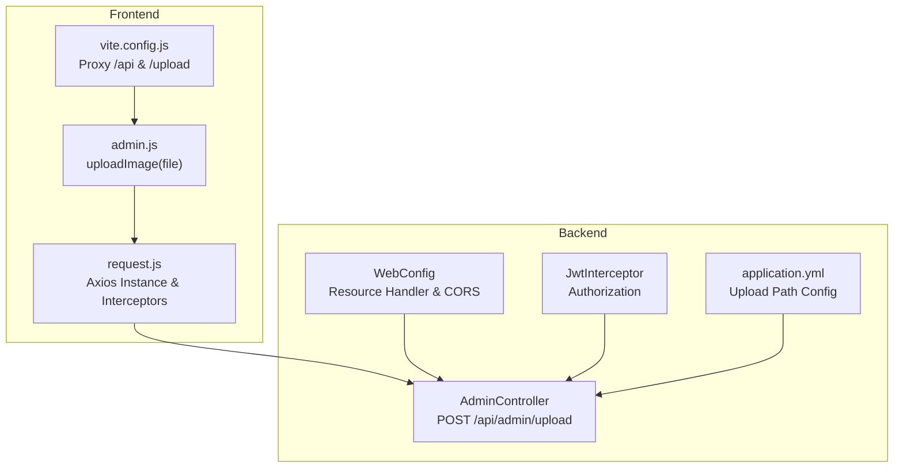
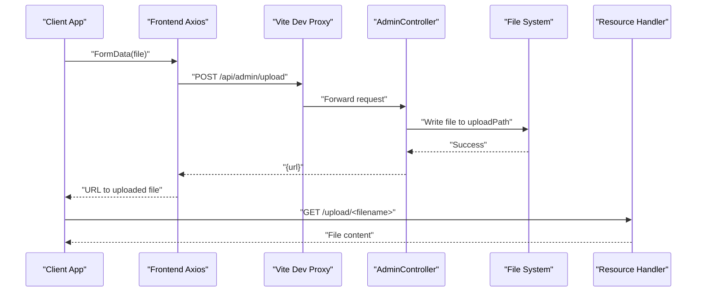
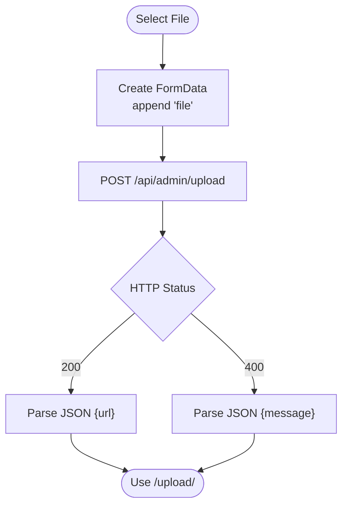
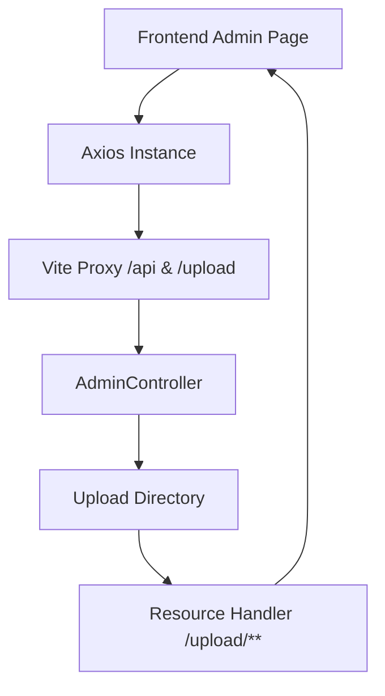
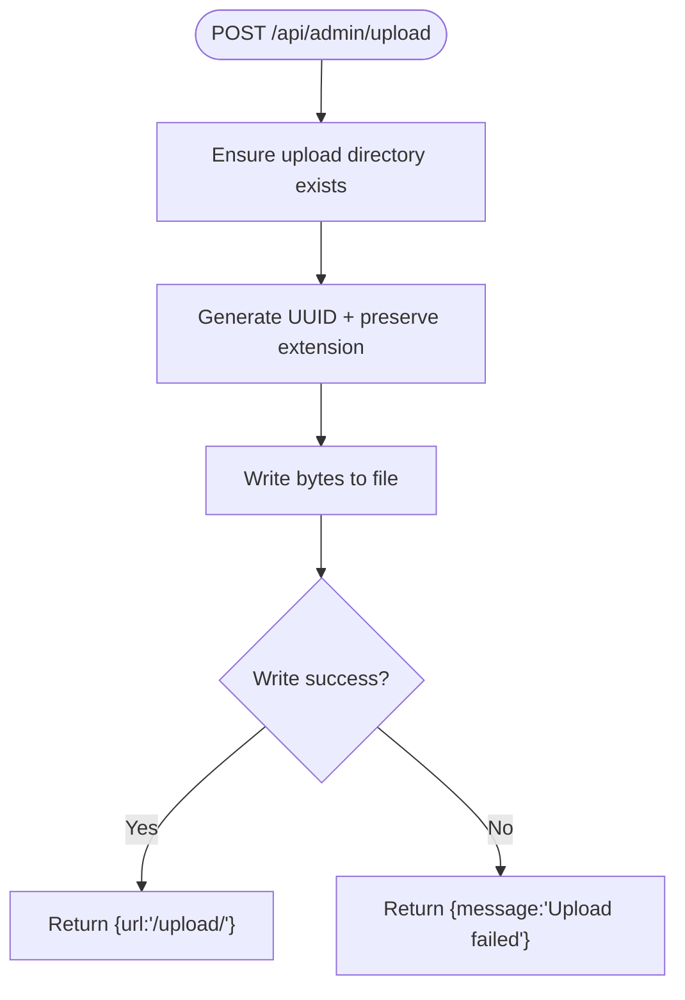
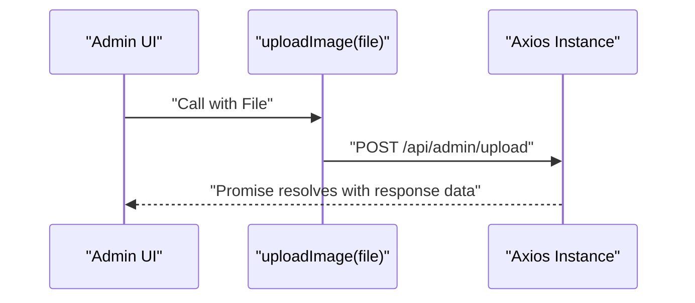
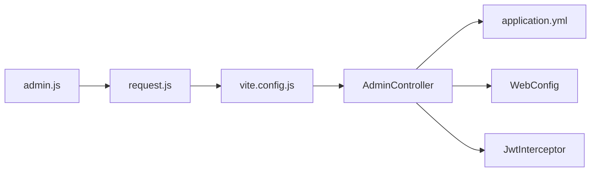

# File Upload Endpoints

<cite>
**Referenced Files in This Document**
- [AdminController.java](file://blog-backend/src/main/java/com/blog/controller/AdminController.java)
- [WebConfig.java](file://blog-backend/src/main/java/com/blog/config/WebConfig.java)
- [JwtInterceptor.java](file://blog-backend/src/main/java/com/blog/config/JwtInterceptor.java)
- [application.yml](file://blog-backend/src/main/resources/application.yml)
- [admin.js](file://blog-frontend/src/api/admin.js)
- [request.js](file://blog-frontend/src/api/request.js)
- [vite.config.js](file://blog-frontend/vite.config.js)
</cite>

## Table of Contents
1. [Introduction](#introduction)
2. [Project Structure](#project-structure)
3. [Core Components](#core-components)
4. [Architecture Overview](#architecture-overview)
5. [Detailed Component Analysis](#detailed-component-analysis)
6. [Dependency Analysis](#dependency-analysis)
7. [Performance Considerations](#performance-considerations)
8. [Troubleshooting Guide](#troubleshooting-guide)
9. [Conclusion](#conclusion)
10. [Appendices](#appendices)

## Introduction
This document provides comprehensive API documentation for the file upload endpoint located at POST /api/admin/upload. It covers the multipart/form-data request format, supported file types, file size limitations, upload path configuration, response schema, error handling, practical curl examples, validation rules, and security considerations. The backend is implemented in Java using Spring Boot, while the frontend demonstrates how to construct and send multipart/form-data requests.

## Project Structure
The upload functionality spans the backend controller and configuration, along with frontend helpers that prepare and submit the request.

**Diagram sources**
- [AdminController.java:46-59](file://blog-backend/src/main/java/com/blog/controller/AdminController.java#L46-L59)
- [WebConfig.java:24-28](file://blog-backend/src/main/java/com/blog/config/WebConfig.java#L24-L28)
- [JwtInterceptor.java:16-34](file://blog-backend/src/main/java/com/blog/config/JwtInterceptor.java#L16-L34)
- [application.yml:31-32](file://blog-backend/src/main/resources/application.yml#L31-L32)
- [admin.js:5-11](file://blog-frontend/src/api/admin.js#L5-L11)
- [request.js:4-18](file://blog-frontend/src/api/request.js#L4-L18)
- [vite.config.js:9-18](file://blog-frontend/vite.config.js#L9-L18)

**Section sources**
- [AdminController.java:46-59](file://blog-backend/src/main/java/com/blog/controller/AdminController.java#L46-L59)
- [WebConfig.java:24-28](file://blog-backend/src/main/java/com/blog/config/WebConfig.java#L24-L28)
- [JwtInterceptor.java:16-34](file://blog-backend/src/main/java/com/blog/config/JwtInterceptor.java#L16-L34)
- [application.yml:31-32](file://blog-backend/src/main/resources/application.yml#L31-L32)
- [admin.js:5-11](file://blog-frontend/src/api/admin.js#L5-L11)
- [request.js:4-18](file://blog-frontend/src/api/request.js#L4-L18)
- [vite.config.js:9-18](file://blog-frontend/vite.config.js#L9-L18)

## Core Components
- Backend controller endpoint: Handles multipart/form-data uploads and writes files to a configured directory.
- Resource handler: Exposes uploaded files under /upload/** for direct access.
- Interceptor: Enforces JWT-based authentication for admin endpoints except login.
- Frontend helper: Constructs FormData and posts to the backend.
- Configuration: Defines the upload directory path.

**Section sources**
- [AdminController.java:46-59](file://blog-backend/src/main/java/com/blog/controller/AdminController.java#L46-L59)
- [WebConfig.java:24-28](file://blog-backend/src/main/java/com/blog/config/WebConfig.java#L24-L28)
- [JwtInterceptor.java:16-34](file://blog-backend/src/main/java/com/blog/config/JwtInterceptor.java#L16-L34)
- [application.yml:31-32](file://blog-backend/src/main/resources/application.yml#L31-L32)
- [admin.js:5-11](file://blog-frontend/src/api/admin.js#L5-L11)

## Architecture Overview
The upload flow integrates frontend, backend, and static resource serving:

**Diagram sources**
- [admin.js:5-11](file://blog-frontend/src/api/admin.js#L5-L11)
- [request.js:4-18](file://blog-frontend/src/api/request.js#L4-L18)
- [vite.config.js:9-18](file://blog-frontend/vite.config.js#L9-L18)
- [AdminController.java:46-59](file://blog-backend/src/main/java/com/blog/controller/AdminController.java#L46-L59)
- [WebConfig.java:24-28](file://blog-backend/src/main/java/com/blog/config/WebConfig.java#L24-L28)

## Detailed Component Analysis

### Endpoint Definition
- Method: POST
- Path: /api/admin/upload
- Consumes: multipart/form-data
- Produces: JSON

Request body:
- Field: file (MultipartFile)
- Content-Type: multipart/form-data (must be set by client)

Response:
- On success: 200 OK with JSON containing url
- On failure: 400 Bad Request with JSON containing message

Security:
- Requires Authorization: Bearer <token> for all /api/admin endpoints except /api/admin/login

Upload path:
- Configured via blog.upload.path in application.yml
- Defaults to ${user.dir}/blog-backend/src/main/resources/upload/

File naming:
- Original extension preserved
- Filename is a UUID to prevent collisions and preserve extension

Direct access:
- Uploaded files are served under /upload/<filename> using a resource handler

**Section sources**
- [AdminController.java:46-59](file://blog-backend/src/main/java/com/blog/controller/AdminController.java#L46-L59)
- [application.yml:31-32](file://blog-backend/src/main/resources/application.yml#L31-L32)
- [WebConfig.java:24-28](file://blog-backend/src/main/java/com/blog/config/WebConfig.java#L24-L28)
- [JwtInterceptor.java:16-34](file://blog-backend/src/main/java/com/blog/config/JwtInterceptor.java#L16-L34)

### Request Schema
- Body: multipart/form-data
- Part name: file
- Example part:
  - Name: file
  - Content-Disposition: form-data; name="file"; filename="<any-filename>"
  - Content-Type: varies by file type

Supported file types:
- No explicit type filtering is enforced in the backend; any file type can be uploaded.

File size limitations:
- No explicit size limits are configured in the backend; defaults apply based on the servlet container.

Upload path configuration:
- Property: blog.upload.path
- Default: ${user.dir}/blog-backend/src/main/resources/upload/
- Must be writable by the application process.

**Section sources**
- [AdminController.java:46-59](file://blog-backend/src/main/java/com/blog/controller/AdminController.java#L46-L59)
- [application.yml:31-32](file://blog-backend/src/main/resources/application.yml#L31-L32)

### Response Schema
Success response:
- Status: 200 OK
- Body: JSON object with url field
- Example: {"url":"/upload/123e4567-e89b-12d3-a456-426614174000.png"}

Failure response:
- Status: 400 Bad Request
- Body: JSON object with message field
- Example: {"message":"Upload failed"}

**Section sources**
- [AdminController.java:55-58](file://blog-backend/src/main/java/com/blog/controller/AdminController.java#L55-L58)

### Frontend Integration
Frontend helper constructs FormData and posts to /api/admin/upload. The Axios instance adds Authorization header if present and handles 401 responses by redirecting to /admin/login.

**Diagram sources**
- [admin.js:5-11](file://blog-frontend/src/api/admin.js#L5-L11)
- [request.js:4-18](file://blog-frontend/src/api/request.js#L4-L18)

**Section sources**
- [admin.js:5-11](file://blog-frontend/src/api/admin.js#L5-L11)
- [request.js:4-18](file://blog-frontend/src/api/request.js#L4-L18)

### Security Considerations
- Authentication: All /api/admin endpoints require a valid Bearer token except /api/admin/login.
- Authorization: The interceptor validates tokens and rejects unauthorized requests.
- CORS: Enabled globally for development; origins allow any.
- File access: Static resource handler serves files from the configured upload directory.

Recommendations:
- Add explicit file type validation on the backend.
- Configure max file size limits.
- Sanitize filenames and restrict extensions.
- Store uploads outside the web root for production deployments.
- Add virus scanning and content validation.

**Section sources**
- [JwtInterceptor.java:16-34](file://blog-backend/src/main/java/com/blog/config/JwtInterceptor.java#L16-L34)
- [WebConfig.java:30-37](file://blog-backend/src/main/java/com/blog/config/WebConfig.java#L30-L37)

## Architecture Overview
The upload pipeline connects frontend, backend, and static resources:

**Diagram sources**
- [admin.js:5-11](file://blog-frontend/src/api/admin.js#L5-L11)
- [request.js:4-18](file://blog-frontend/src/api/request.js#L4-L18)
- [vite.config.js:9-18](file://blog-frontend/vite.config.js#L9-L18)
- [AdminController.java:46-59](file://blog-backend/src/main/java/com/blog/controller/AdminController.java#L46-L59)
- [WebConfig.java:24-28](file://blog-backend/src/main/java/com/blog/config/WebConfig.java#L24-L28)

## Detailed Component Analysis

### Backend Controller Behavior
- Validates and creates upload directory if missing.
- Extracts original file extension and generates a UUID-based filename.
- Writes bytes to disk and returns a URL pointing to the uploaded file.

**Diagram sources**
- [AdminController.java:46-59](file://blog-backend/src/main/java/com/blog/controller/AdminController.java#L46-L59)

**Section sources**
- [AdminController.java:46-59](file://blog-backend/src/main/java/com/blog/controller/AdminController.java#L46-L59)

### Frontend Upload Helper
- Creates FormData with a single part named file.
- Posts to /api/admin/upload with Content-Type multipart/form-data.
- Uses Axios instance to handle auth and interceptors.

**Diagram sources**
- [admin.js:5-11](file://blog-frontend/src/api/admin.js#L5-L11)
- [request.js:4-18](file://blog-frontend/src/api/request.js#L4-L18)

**Section sources**
- [admin.js:5-11](file://blog-frontend/src/api/admin.js#L5-L11)
- [request.js:4-18](file://blog-frontend/src/api/request.js#L4-L18)

### Upload Directory Structure and Naming
- Location: Configured by blog.upload.path (default: ${user.dir}/blog-backend/src/main/resources/upload/)
- Access: Served via /upload/** resource handler
- Naming: UUID-based filename preserving original extension
- Example: /upload/123e4567-e89b-12d3-a456-426614174000.png

**Section sources**
- [application.yml:31-32](file://blog-backend/src/main/resources/application.yml#L31-L32)
- [WebConfig.java:24-28](file://blog-backend/src/main/java/com/blog/config/WebConfig.java#L24-L28)
- [AdminController.java:51-52](file://blog-backend/src/main/java/com/blog/controller/AdminController.java#L51-L52)

## Dependency Analysis
- AdminController depends on:
  - Upload path property from application.yml
  - File system write operations
  - Resource handler for serving files
- Frontend depends on:
  - Axios instance for HTTP requests
  - Vite proxy for /api and /upload routes
- Interceptor enforces JWT validation for admin endpoints.

**Diagram sources**
- [admin.js:5-11](file://blog-frontend/src/api/admin.js#L5-L11)
- [request.js:4-18](file://blog-frontend/src/api/request.js#L4-L18)
- [vite.config.js:9-18](file://blog-frontend/vite.config.js#L9-L18)
- [AdminController.java:46-59](file://blog-backend/src/main/java/com/blog/controller/AdminController.java#L46-L59)
- [application.yml:31-32](file://blog-backend/src/main/resources/application.yml#L31-L32)
- [WebConfig.java:24-28](file://blog-backend/src/main/java/com/blog/config/WebConfig.java#L24-L28)
- [JwtInterceptor.java:16-34](file://blog-backend/src/main/java/com/blog/config/JwtInterceptor.java#L16-L34)

**Section sources**
- [AdminController.java:46-59](file://blog-backend/src/main/java/com/blog/controller/AdminController.java#L46-L59)
- [WebConfig.java:24-28](file://blog-backend/src/main/java/com/blog/config/WebConfig.java#L24-L28)
- [JwtInterceptor.java:16-34](file://blog-backend/src/main/java/com/blog/config/JwtInterceptor.java#L16-L34)
- [application.yml:31-32](file://blog-backend/src/main/resources/application.yml#L31-L32)
- [admin.js:5-11](file://blog-frontend/src/api/admin.js#L5-L11)
- [request.js:4-18](file://blog-frontend/src/api/request.js#L4-L18)
- [vite.config.js:9-18](file://blog-frontend/vite.config.js#L9-L18)

## Performance Considerations
- Current implementation streams file bytes to disk synchronously; consider asynchronous writes for large files.
- No built-in rate limiting or concurrency controls; add throttling if needed.
- Serving static files from the configured directory is efficient; ensure filesystem permissions and disk I/O are adequate.

[No sources needed since this section provides general guidance]

## Troubleshooting Guide
Common issues and resolutions:
- 401 Unauthorized: Ensure Authorization header with a valid Bearer token is included for /api/admin endpoints.
- 400 Upload failed: Verify upload directory exists and is writable; check server logs for IOException details.
- File not accessible via /upload/<filename>: Confirm resource handler mapping and that the file exists at the configured path.
- CORS errors: Confirm browser requests are proxied via /api and /upload as configured.

**Section sources**
- [JwtInterceptor.java:16-34](file://blog-backend/src/main/java/com/blog/config/JwtInterceptor.java#L16-L34)
- [WebConfig.java:24-28](file://blog-backend/src/main/java/com/blog/config/WebConfig.java#L24-L28)
- [AdminController.java:55-58](file://blog-backend/src/main/java/com/blog/controller/AdminController.java#L55-L58)

## Conclusion
The POST /api/admin/upload endpoint provides a straightforward multipart/form-data upload mechanism with UUID-based filenames and direct static access via /upload/<filename>. While flexible, it currently lacks explicit file type and size validations. Production deployments should add validation, size limits, secure storage, and additional security measures.

[No sources needed since this section summarizes without analyzing specific files]

## Appendices

### Practical Examples

curl (success):
- Command: curl -X POST http://localhost:8080/api/admin/upload -H "Authorization: Bearer YOUR_TOKEN" -F "file=@/path/to/image.png"
- Expected response: {"url":"/upload/123e4567-e89b-12d3-a456-426614174000.png"}

curl (failure - invalid token):
- Command: curl -X POST http://localhost:8080/api/admin/upload -H "Authorization: Bearer INVALID" -F "file=@/path/to/image.png"
- Expected response: 401 Unauthorized

curl (failure - upload error):
- Command: curl -X POST http://localhost:8080/api/admin/upload -H "Authorization: Bearer VALID_TOKEN" -F "file=@/path/to/image.png"
- If upload fails, response: {"message":"Upload failed"}

Notes:
- Replace YOUR_TOKEN with a valid JWT token obtained from /api/admin/login.
- Ensure the upload directory is writable by the server process.

**Section sources**
- [AdminController.java:46-59](file://blog-backend/src/main/java/com/blog/controller/AdminController.java#L46-L59)
- [JwtInterceptor.java:16-34](file://blog-backend/src/main/java/com/blog/config/JwtInterceptor.java#L16-L34)

### Validation Rules
Current behavior:
- No explicit file type filtering
- No explicit file size limits
- Extension preserved; filename is UUID

Recommended additions (not implemented):
- Allowed file types (e.g., image/*)
- Max file size (e.g., 10MB)
- Filename sanitization
- Virus scanning hook

**Section sources**
- [AdminController.java:46-59](file://blog-backend/src/main/java/com/blog/controller/AdminController.java#L46-L59)