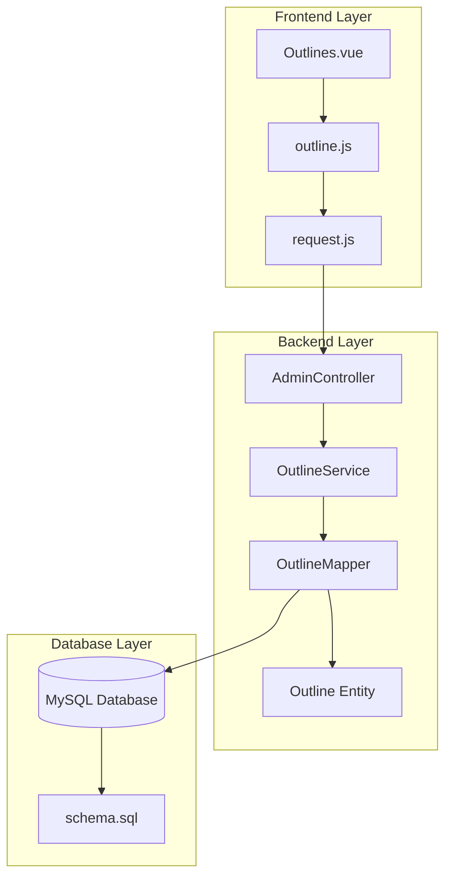
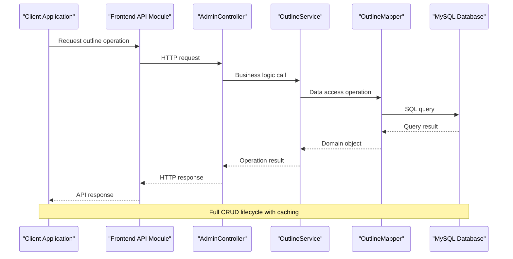
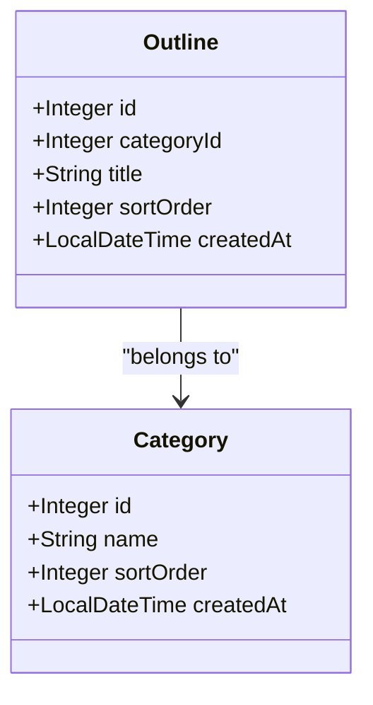
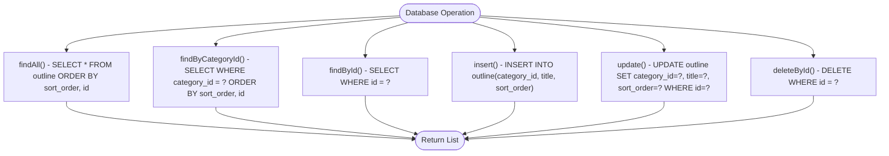
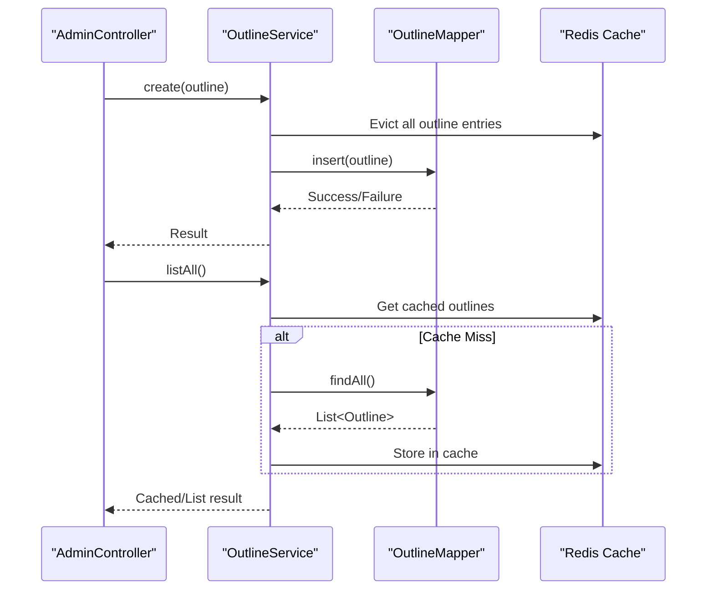
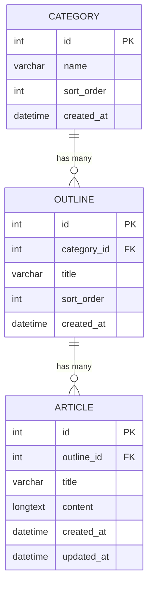
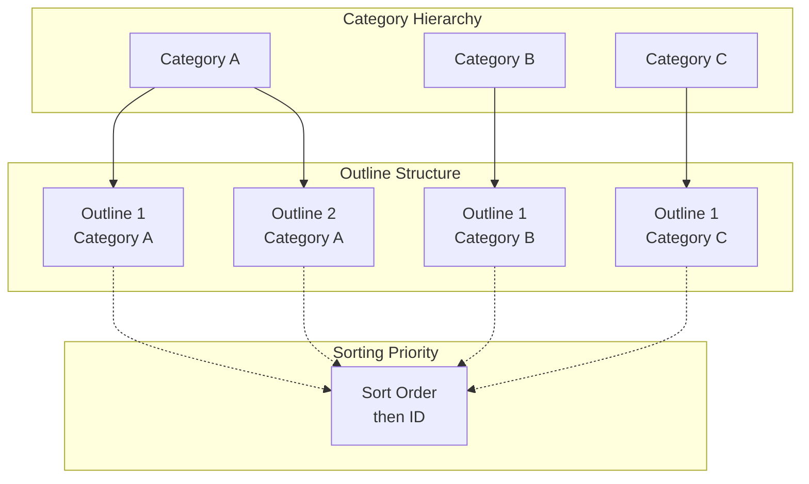
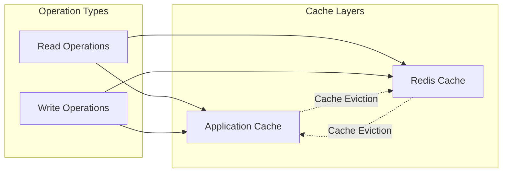

# Outline Management API

<cite>
**Referenced Files in This Document**
- [AdminController.java](file://blog-backend/src/main/java/com/blog/controller/AdminController.java)
- [OutlineService.java](file://blog-backend/src/main/java/com/blog/service/OutlineService.java)
- [OutlineMapper.java](file://blog-backend/src/main/java/com/blog/mapper/OutlineMapper.java)
- [Outline.java](file://blog-backend/src/main/java/com/blog/entity/Outline.java)
- [schema.sql](file://blog-backend/src/main/resources/schema.sql)
- [application.yml](file://blog-backend/src/main/resources/application.yml)
- [outline.js](file://blog-frontend/src/api/outline.js)
- [Outlines.vue](file://blog-frontend/src/views/admin/Outlines.vue)
- [request.js](file://blog-frontend/src/api/request.js)
</cite>

## Table of Contents
1. [Introduction](#introduction)
2. [Project Structure](#project-structure)
3. [Core Components](#core-components)
4. [Architecture Overview](#architecture-overview)
5. [Detailed Component Analysis](#detailed-component-analysis)
6. [API Reference](#api-reference)
7. [Validation Rules](#validation-rules)
8. [Hierarchical Organization](#hierarchical-organization)
9. [Practical Examples](#practical-examples)
10. [Performance Considerations](#performance-considerations)
11. [Troubleshooting Guide](#troubleshooting-guide)
12. [Conclusion](#conclusion)

## Introduction
This document provides comprehensive API documentation for outline management CRUD operations in the blog system. It covers the creation, modification, and deletion of outlines with detailed attention to hierarchical organization, category relationships, and validation rules. The documentation includes practical examples using curl commands and JSON payloads to demonstrate real-world usage scenarios.

## Project Structure
The outline management functionality spans both backend and frontend components with clear separation of concerns:



**Diagram sources**
- [AdminController.java:19-121](file://blog-backend/src/main/java/com/blog/controller/AdminController.java#L19-L121)
- [OutlineService.java:12-47](file://blog-backend/src/main/java/com/blog/service/OutlineService.java#L12-L47)
- [OutlineMapper.java:8-30](file://blog-backend/src/main/java/com/blog/mapper/OutlineMapper.java#L8-L30)
- [schema.sql:1-33](file://blog-backend/src/main/resources/schema.sql#L1-L33)

**Section sources**
- [AdminController.java:19-121](file://blog-backend/src/main/java/com/blog/controller/AdminController.java#L19-L121)
- [OutlineService.java:12-47](file://blog-backend/src/main/java/com/blog/service/OutlineService.java#L12-L47)
- [OutlineMapper.java:8-30](file://blog-backend/src/main/java/com/blog/mapper/OutlineMapper.java#L8-L30)
- [schema.sql:1-33](file://blog-backend/src/main/resources/schema.sql#L1-L33)

## Core Components
The outline management system consists of four primary components working together to provide full CRUD functionality:

### Backend Components
- **AdminController**: REST controller handling outline management endpoints
- **OutlineService**: Business logic layer managing outline operations
- **OutlineMapper**: Data access layer implementing SQL operations
- **Outline Entity**: Data transfer object representing outline records

### Frontend Components
- **outline.js**: API client module for outline operations
- **Outlines.vue**: Administrative interface for outline management
- **request.js**: HTTP client configuration with authentication

**Section sources**
- [AdminController.java:25-29](file://blog-backend/src/main/java/com/blog/controller/AdminController.java#L25-L29)
- [OutlineService.java:14-16](file://blog-backend/src/main/java/com/blog/service/OutlineService.java#L14-L16)
- [OutlineMapper.java:9-18](file://blog-backend/src/main/java/com/blog/mapper/OutlineMapper.java#L9-L18)
- [Outline.java:7-13](file://blog-backend/src/main/java/com/blog/entity/Outline.java#L7-L13)

## Architecture Overview
The system follows a layered architecture pattern with clear separation between presentation, business logic, data access, and persistence layers:



**Diagram sources**
- [AdminController.java:82-99](file://blog-backend/src/main/java/com/blog/controller/AdminController.java#L82-L99)
- [OutlineService.java:32-45](file://blog-backend/src/main/java/com/blog/service/OutlineService.java#L32-L45)
- [OutlineMapper.java:20-28](file://blog-backend/src/main/java/com/blog/mapper/OutlineMapper.java#L20-L28)

**Section sources**
- [AdminController.java:82-99](file://blog-backend/src/main/java/com/blog/controller/AdminController.java#L82-L99)
- [OutlineService.java:32-45](file://blog-backend/src/main/java/com/blog/service/OutlineService.java#L32-L45)
- [OutlineMapper.java:20-28](file://blog-backend/src/main/java/com/blog/mapper/OutlineMapper.java#L20-L28)

## Detailed Component Analysis

### Outline Entity Model
The Outline entity represents the core data structure for outline management with essential attributes for hierarchical organization:



**Diagram sources**
- [Outline.java:7-13](file://blog-backend/src/main/java/com/blog/entity/Outline.java#L7-L13)
- [schema.sql:1-15](file://blog-backend/src/main/resources/schema.sql#L1-L15)

The entity includes:
- **Primary Key**: Auto-generated integer identifier
- **Foreign Key**: Category association for hierarchical organization
- **Display Properties**: Title and sort order for UI presentation
- **Metadata**: Creation timestamp for audit trails

**Section sources**
- [Outline.java:7-13](file://blog-backend/src/main/java/com/blog/entity/Outline.java#L7-L13)
- [schema.sql:8-15](file://blog-backend/src/main/resources/schema.sql#L8-L15)

### Data Access Layer
The OutlineMapper implements all CRUD operations with proper SQL injection prevention and result mapping:



**Diagram sources**
- [OutlineMapper.java:11-28](file://blog-backend/src/main/java/com/blog/mapper/OutlineMapper.java#L11-L28)

**Section sources**
- [OutlineMapper.java:11-28](file://blog-backend/src/main/java/com/blog/mapper/OutlineMapper.java#L11-L28)

### Business Logic Layer
The OutlineService provides caching mechanisms and orchestrates operations between the controller and data access layers:



**Diagram sources**
- [OutlineService.java:18-26](file://blog-backend/src/main/java/com/blog/service/OutlineService.java#L18-L26)
- [OutlineService.java:32-45](file://blog-backend/src/main/java/com/blog/service/OutlineService.java#L32-L45)

**Section sources**
- [OutlineService.java:18-26](file://blog-backend/src/main/java/com/blog/service/OutlineService.java#L18-L26)
- [OutlineService.java:32-45](file://blog-backend/src/main/java/com/blog/service/OutlineService.java#L32-L45)

## API Reference

### Endpoint Definitions

#### Create Outline
**POST** `/api/admin/outlines`

Creates a new outline associated with a category and returns the created outline with generated ID.

**Request Body Schema:**
```json
{
  "categoryId": "integer",
  "title": "string",
  "sortOrder": "integer"
}
```

**Response:** Created outline object with auto-generated ID

#### Update Outline
**PUT** `/api/admin/outlines/{id}`

Updates an existing outline identified by ID.

**Path Parameters:**
- `id` (integer): Outline identifier

**Request Body Schema:**
```json
{
  "categoryId": "integer",
  "title": "string",
  "sortOrder": "integer"
}
```

**Response:** Updated outline object

#### Delete Outline
**DELETE** `/api/admin/outlines/{id}`

Deletes an outline by ID and cascades related article deletions.

**Path Parameters:**
- `id` (integer): Outline identifier

**Response:** Deletion confirmation message

**Section sources**
- [AdminController.java:82-99](file://blog-backend/src/main/java/com/blog/controller/AdminController.java#L82-L99)

## Validation Rules

### Database-Level Constraints
The database enforces strict validation through foreign key relationships and column constraints:



**Diagram sources**
- [schema.sql:1-33](file://blog-backend/src/main/resources/schema.sql#L1-L33)

### Foreign Key Relationships
- **Category Association**: Each outline must belong to a valid category
- **Cascade Deletion**: Deleting a category automatically deletes all associated outlines
- **Cascade Deletion**: Deleting an outline automatically deletes all associated articles

### Column Constraints
- **Title**: Non-null string with maximum 255 characters
- **Sort Order**: Integer with default value 0
- **Category ID**: Non-null integer referencing category table

**Section sources**
- [schema.sql:8-15](file://blog-backend/src/main/resources/schema.sql#L8-L15)

## Hierarchical Organization

### Category-Based Organization
Outlines are organized hierarchically through category relationships:



### Sorting Mechanism
Outlines are sorted using a composite key system:
1. **Primary Sort**: `sort_order` ascending
2. **Secondary Sort**: `id` ascending for ties

This ensures predictable ordering while allowing flexible reordering through the sort_order field.

**Section sources**
- [OutlineMapper.java:11-15](file://blog-backend/src/main/java/com/blog/mapper/OutlineMapper.java#L11-L15)

## Practical Examples

### Creating Outlines

#### Basic Outline Creation
```bash
curl -X POST "http://localhost:8080/api/admin/outlines" \
  -H "Content-Type: application/json" \
  -d '{
    "categoryId": 1,
    "title": "Getting Started",
    "sortOrder": 1
  }'
```

#### Outline with Default Sort Order
```bash
curl -X POST "http://localhost:8080/api/admin/outlines" \
  -H "Content-Type: application/json" \
  -d '{
    "categoryId": 2,
    "title": "Advanced Topics"
  }'
```

### Updating Outlines

#### Moving Outline to Different Category
```bash
curl -X PUT "http://localhost:8080/api/admin/outlines/5" \
  -H "Content-Type: application/json" \
  -d '{
    "categoryId": 3,
    "title": "Updated Advanced Topics",
    "sortOrder": 2
  }'
```

#### Reordering Within Same Category
```bash
curl -X PUT "http://localhost:8080/api/admin/outlines/3" \
  -H "Content-Type: application/json" \
  -d '{
    "categoryId": 1,
    "title": "Getting Started",
    "sortOrder": 10
  }'
```

### Deleting Outlines
```bash
curl -X DELETE "http://localhost:8080/api/admin/outlines/7"
```

### Frontend Integration Examples

#### Using Vue.js Implementation
The frontend provides a complete administrative interface for outline management:

```javascript
// Create new outline
await createOutline({
  categoryId: selectedCategory.id,
  title: "New Outline Title",
  sortOrder: 0
})

// Update existing outline
await updateOutline(outlineId, {
  categoryId: updatedCategory.id,
  title: "Updated Title",
  sortOrder: 5
})

// Delete outline with confirmation
if (confirm('Delete this outline?')) {
  await deleteOutline(outlineId)
}
```

**Section sources**
- [outline.js:5-9](file://blog-frontend/src/api/outline.js#L5-L9)
- [Outlines.vue:84-98](file://blog-frontend/src/views/admin/Outlines.vue#L84-L98)

## Performance Considerations

### Caching Strategy
The system implements intelligent caching to optimize performance:



**Cache Behavior:**
- **Read Operations**: Cached for improved response times
- **Write Operations**: Automatic cache eviction to maintain consistency
- **Category-Specific**: Separate cache keys for category-scoped queries

### Database Optimization
- **Indexing**: Composite index on `(category_id, sort_order, id)` for optimal query performance
- **Connection Pooling**: Configured through Spring Boot application properties
- **Lazy Loading**: Category relationships loaded only when needed

**Section sources**
- [OutlineService.java:18-26](file://blog-backend/src/main/java/com/blog/service/OutlineService.java#L18-L26)
- [OutlineMapper.java:11-15](file://blog-backend/src/main/java/com/blog/mapper/OutlineMapper.java#L11-L15)
- [application.yml:4-26](file://blog-backend/src/main/resources/application.yml#L4-L26)

## Troubleshooting Guide

### Common Issues and Solutions

#### 400 Bad Request - Invalid Category ID
**Symptoms**: Database constraint violation when creating/updating outlines
**Cause**: Non-existent category ID or missing category association
**Solution**: Verify category exists before creating outlines

#### 404 Not Found - Outline Not Found
**Symptoms**: Attempting to update/delete non-existent outline
**Cause**: Invalid outline ID
**Solution**: Ensure outline exists before performing operations

#### 500 Internal Server Error - Database Connection
**Symptoms**: Database connectivity issues
**Cause**: Incorrect database configuration
**Solution**: Verify database connection settings in application properties

### Debugging Tips
1. **Enable SQL Logging**: Add logging configuration to see executed queries
2. **Check Cache Status**: Monitor Redis cache health for performance issues
3. **Validate Payloads**: Ensure JSON payload matches entity schema exactly

**Section sources**
- [schema.sql:14](file://blog-backend/src/main/resources/schema.sql#L14)
- [application.yml:4-17](file://blog-backend/src/main/resources/application.yml#L4-L17)

## Conclusion
The outline management API provides a robust foundation for hierarchical content organization with comprehensive CRUD operations, proper validation through foreign key constraints, and optimized performance through caching and efficient database design. The system supports flexible categorization, sortable outline ordering, and seamless integration with both backend services and frontend administrative interfaces.

The implementation demonstrates best practices in layered architecture, data validation, and performance optimization while maintaining simplicity and extensibility for future enhancements.