# Admin Articles Management

<cite>
**Referenced Files in This Document**
- [Articles.vue](file://blog-frontend/src/views/admin/Articles.vue)
- [ArticleEdit.vue](file://blog-frontend/src/views/admin/ArticleEdit.vue)
- [admin.js](file://blog-frontend/src/api/admin.js)
- [article.js](file://blog-frontend/src/api/article.js)
- [category.js](file://blog-frontend/src/api/category.js)
- [outline.js](file://blog-frontend/src/api/outline.js)
- [request.js](file://blog-frontend/src/api/request.js)
- [auth.js](file://blog-frontend/src/stores/auth.js)
- [index.js](file://blog-frontend/src/router/index.js)
- [AdminController.java](file://blog-backend/src/main/java/com/blog/controller/AdminController.java)
- [ArticleService.java](file://blog-backend/src/main/java/com/blog/service/ArticleService.java)
- [Article.java](file://blog-backend/src/main/java/com/blog/entity/Article.java)
- [application.yml](file://blog-backend/src/main/resources/application.yml)
</cite>

## Table of Contents
1. [Introduction](#introduction)
2. [Project Structure](#project-structure)
3. [Core Components](#core-components)
4. [Architecture Overview](#architecture-overview)
5. [Detailed Component Analysis](#detailed-component-analysis)
6. [Dependency Analysis](#dependency-analysis)
7. [Performance Considerations](#performance-considerations)
8. [Troubleshooting Guide](#troubleshooting-guide)
9. [Conclusion](#conclusion)

## Introduction
This document provides comprehensive documentation for the admin articles management system. It covers the articles list interface, article creation/editing workflow, filtering and sorting capabilities, pagination handling, rich text editing interface, form validation, file upload handling, and real-time article status updates. The system integrates Vue.js frontend components with Spring Boot backend services through RESTful APIs, providing a complete content management solution for administrators.

## Project Structure
The admin articles management system follows a clear separation of concerns with distinct frontend and backend components:

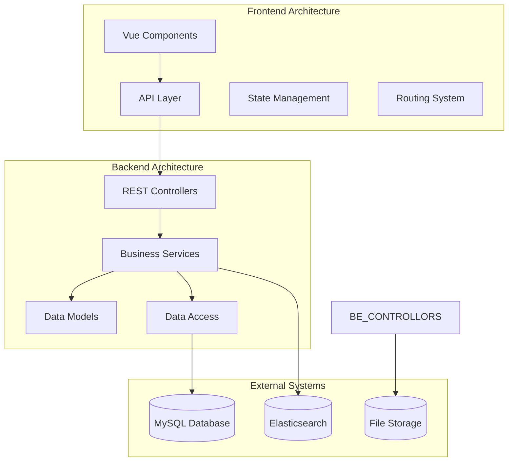

**Diagram sources**
- [Articles.vue:1-138](file://blog-frontend/src/views/admin/Articles.vue#L1-L138)
- [ArticleEdit.vue:1-111](file://blog-frontend/src/views/admin/ArticleEdit.vue#L1-L111)
- [AdminController.java:1-121](file://blog-backend/src/main/java/com/blog/controller/AdminController.java#L1-L121)

**Section sources**
- [Articles.vue:1-138](file://blog-frontend/src/views/admin/Articles.vue#L1-L138)
- [ArticleEdit.vue:1-111](file://blog-frontend/src/views/admin/ArticleEdit.vue#L1-L111)
- [AdminController.java:1-121](file://blog-backend/src/main/java/com/blog/controller/AdminController.java#L1-L121)

## Core Components

### Articles List Component
The Articles component serves as the primary interface for managing articles, featuring filtering capabilities and basic CRUD operations.

**Key Features:**
- Category-based filtering with dynamic outline selection
- Bulk loading of articles from multiple outlines
- Delete operation with confirmation dialog
- Responsive card-based layout

**Data Flow:**
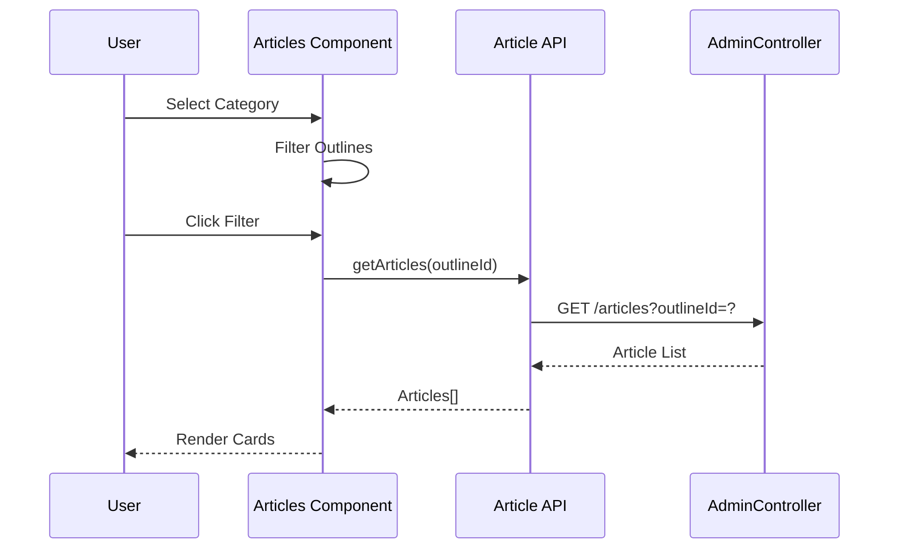

**Diagram sources**
- [Articles.vue:61-72](file://blog-frontend/src/views/admin/Articles.vue#L61-L72)
- [article.js:3](file://blog-frontend/src/api/article.js#L3)
- [AdminController.java:102-113](file://blog-backend/src/main/java/com/blog/controller/AdminController.java#L102-L113)

**Section sources**
- [Articles.vue:35-84](file://blog-frontend/src/views/admin/Articles.vue#L35-L84)

### Article Edit Component
The ArticleEdit component provides a comprehensive rich text editing interface with form validation and media upload capabilities.

**Rich Text Editor Features:**
- WYSIWYG editor with toolbar controls
- Custom image upload integration
- Real-time content validation
- Form state management

**Form Validation:**
- Required field validation for title and outline
- Automatic form binding with reactive data
- Conditional rendering for edit/new modes

**Section sources**
- [ArticleEdit.vue:34-81](file://blog-frontend/src/views/admin/ArticleEdit.vue#L34-L81)

### API Integration Layer
The frontend API layer abstracts backend communication with centralized request handling and authentication.

**Authentication Flow:**
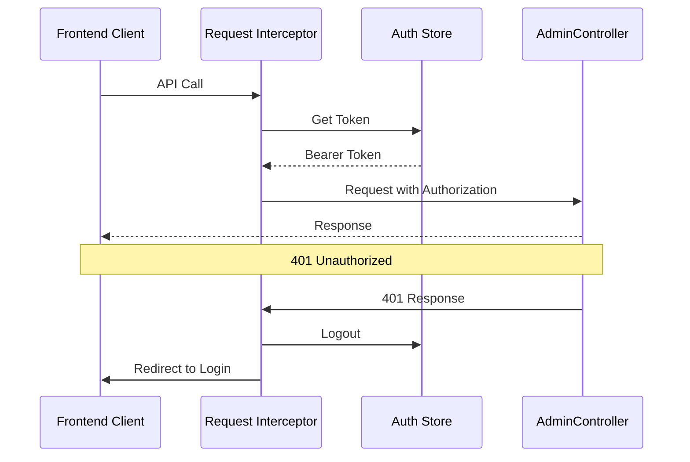

**Diagram sources**
- [request.js:9-29](file://blog-frontend/src/api/request.js#L9-L29)
- [auth.js:4-18](file://blog-frontend/src/stores/auth.js#L4-L18)

**Section sources**
- [request.js:1-33](file://blog-frontend/src/api/request.js#L1-L33)
- [admin.js:1-12](file://blog-frontend/src/api/admin.js#L1-L12)

## Architecture Overview

### Backend Service Architecture
The backend implements a layered architecture with clear separation between presentation, business logic, and data access layers.

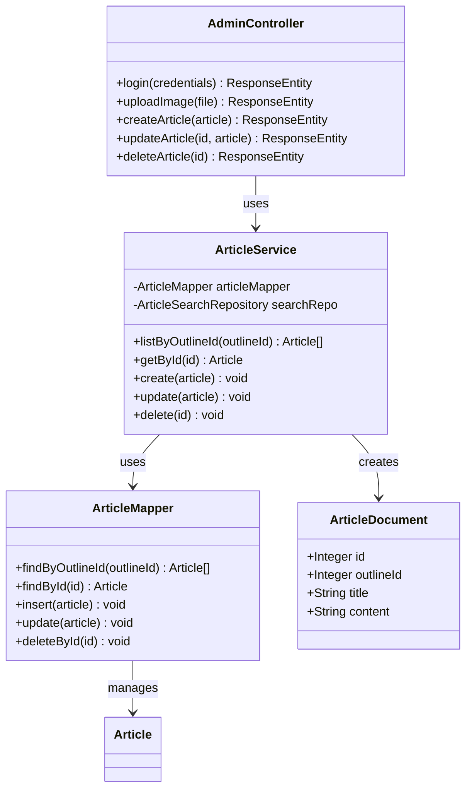

**Diagram sources**
- [AdminController.java:23-120](file://blog-backend/src/main/java/com/blog/controller/AdminController.java#L23-L120)
- [ArticleService.java:18-71](file://blog-backend/src/main/java/com/blog/service/ArticleService.java#L18-L71)
- [Article.java:7-14](file://blog-backend/src/main/java/com/blog/entity/Article.java#L7-L14)

### Data Flow Architecture
The system implements a robust data flow architecture with caching and search capabilities.

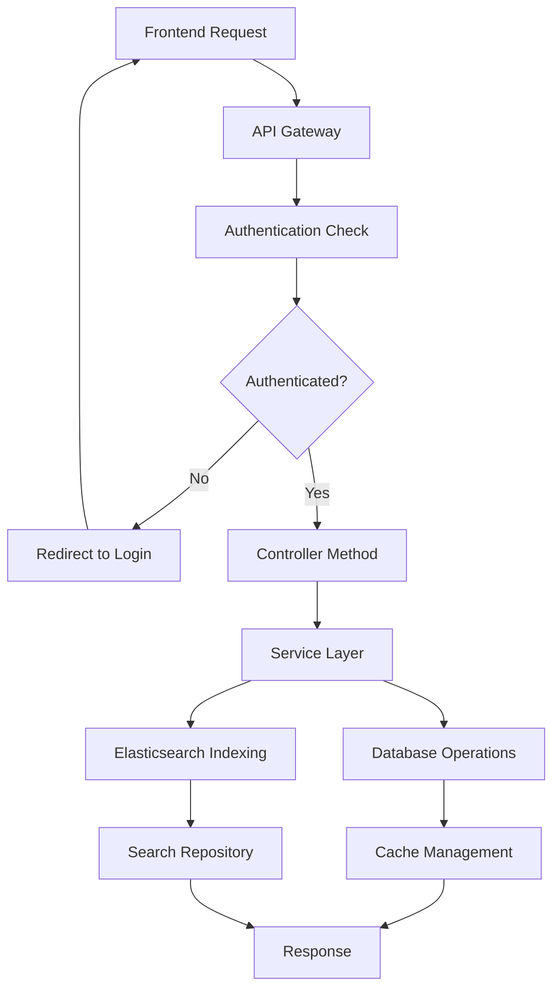

**Diagram sources**
- [request.js:9-29](file://blog-frontend/src/api/request.js#L9-L29)
- [AdminController.java:34-44](file://blog-backend/src/main/java/com/blog/controller/AdminController.java#L34-L44)
- [ArticleService.java:32-45](file://blog-backend/src/main/java/com/blog/service/ArticleService.java#L32-L45)

**Section sources**
- [AdminController.java:1-121](file://blog-backend/src/main/java/com/blog/controller/AdminController.java#L1-L121)
- [ArticleService.java:1-72](file://blog-backend/src/main/java/com/blog/service/ArticleService.java#L1-L72)

## Detailed Component Analysis

### Articles Component Implementation

#### Filtering and Sorting Capabilities
The Articles component implements sophisticated filtering mechanisms with category-dependent outline filtering.

**Filtering Logic:**
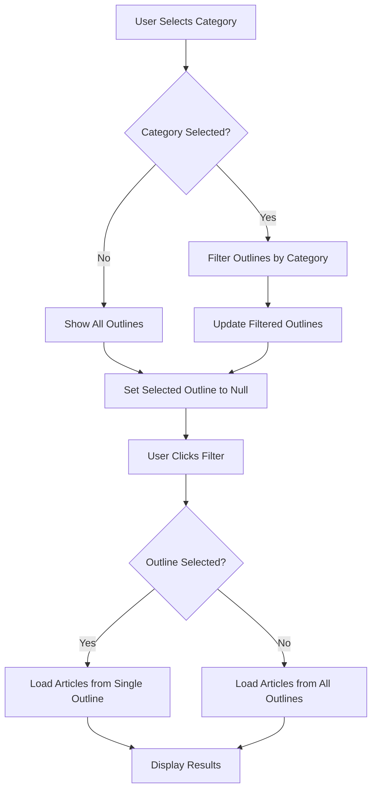

**Diagram sources**
- [Articles.vue:47-72](file://blog-frontend/src/views/admin/Articles.vue#L47-L72)

**Pagination Handling:**
The current implementation loads all articles for the selected outlines without pagination. For large datasets, consider implementing server-side pagination with limit/offset parameters.

**Section sources**
- [Articles.vue:35-84](file://blog-frontend/src/views/admin/Articles.vue#L35-L84)

#### Data Table Implementation
The component uses a card-based layout instead of a traditional data table, which provides better mobile responsiveness but lacks advanced table features.

**Card Layout Features:**
- Responsive two-column layout on desktop
- Single-column stacked layout on mobile
- Glass-morphism design aesthetic
- Action buttons for edit/delete operations

### ArticleEdit Component Analysis

#### Rich Text Editing Interface
The ArticleEdit component integrates with WangEditor for rich text editing with custom image upload functionality.

**Editor Configuration:**
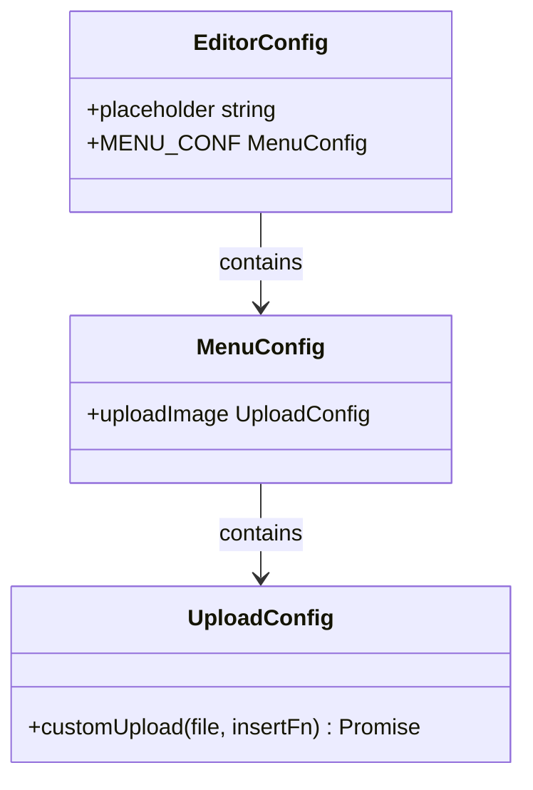

**Diagram sources**
- [ArticleEdit.vue:49-59](file://blog-frontend/src/views/admin/ArticleEdit.vue#L49-L59)
- [admin.js:5-11](file://blog-frontend/src/api/admin.js#L5-L11)

**Form Handling Patterns:**
- Reactive form state with Vue 3 Composition API
- Computed property for edit/new mode detection
- Two-way data binding with v-model
- Form submission with preventDefault

**Section sources**
- [ArticleEdit.vue:34-81](file://blog-frontend/src/views/admin/ArticleEdit.vue#L34-L81)

#### File Upload Integration
The system implements custom image upload functionality integrated directly with the rich text editor.

**Upload Workflow:**
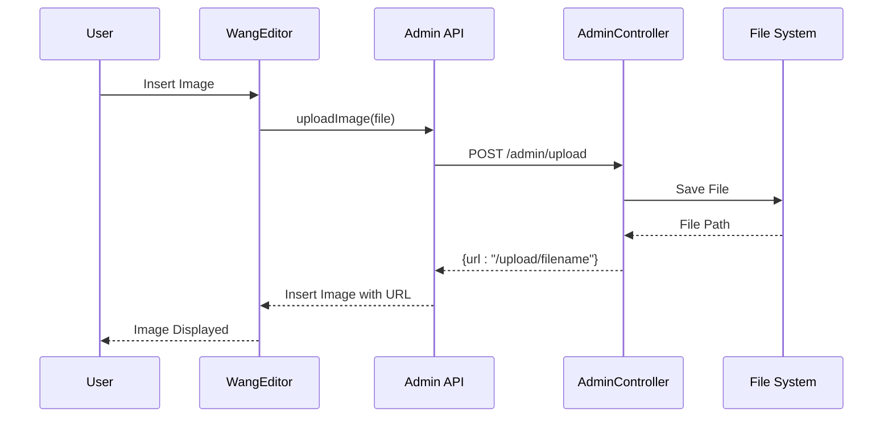

**Diagram sources**
- [ArticleEdit.vue:52-56](file://blog-frontend/src/views/admin/ArticleEdit.vue#L52-L56)
- [admin.js:5-11](file://blog-frontend/src/api/admin.js#L5-L11)
- [AdminController.java:46-59](file://blog-backend/src/main/java/com/blog/controller/AdminController.java#L46-L59)

**Section sources**
- [admin.js:1-12](file://blog-frontend/src/api/admin.js#L1-L12)
- [AdminController.java:46-59](file://blog-backend/src/main/java/com/blog/controller/AdminController.java#L46-L59)

### State Management and Authentication

#### Authentication Store
The system uses Pinia for state management with localStorage persistence for JWT tokens.

**Authentication Flow:**
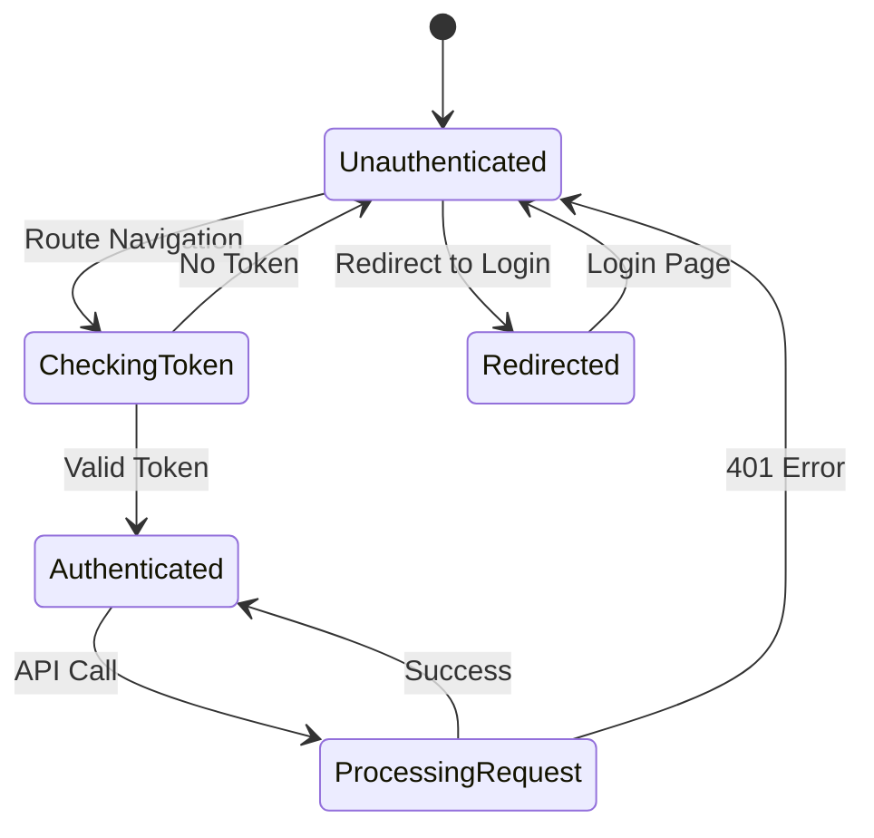

**Diagram sources**
- [auth.js:4-18](file://blog-frontend/src/stores/auth.js#L4-L18)
- [request.js:20-29](file://blog-frontend/src/api/request.js#L20-L29)

**Section sources**
- [auth.js:1-19](file://blog-frontend/src/stores/auth.js#L1-L19)
- [request.js:1-33](file://blog-frontend/src/api/request.js#L1-L33)

## Dependency Analysis

### Component Dependencies
The system exhibits clear dependency relationships with minimal coupling between components.

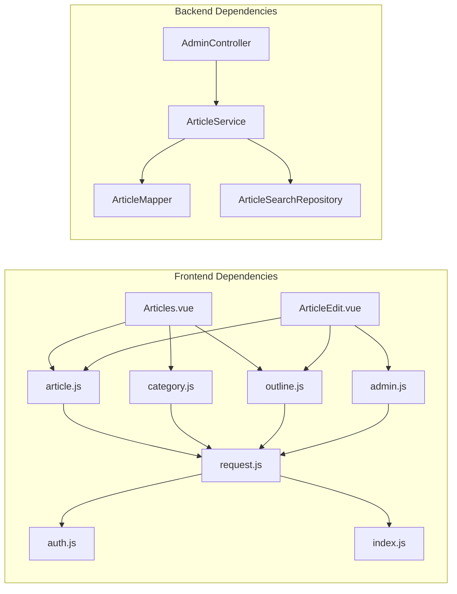

**Diagram sources**
- [Articles.vue:37-39](file://blog-frontend/src/views/admin/Articles.vue#L37-L39)
- [ArticleEdit.vue:39-40](file://blog-frontend/src/views/admin/ArticleEdit.vue#L39-L40)
- [request.js:1-33](file://blog-frontend/src/api/request.js#L1-L33)

### External Dependencies
The system integrates with several external services and libraries:

**Frontend Libraries:**
- Vue 3 Composition API for reactive state management
- WangEditor for rich text editing
- Axios for HTTP client functionality
- Pinia for state management

**Backend Dependencies:**
- Spring Boot for REST API framework
- MySQL for primary data storage
- Elasticsearch for search indexing
- Redis for caching (configured but not actively used in article service)

**Section sources**
- [application.yml:14-20](file://blog-backend/src/main/resources/application.yml#L14-L20)

## Performance Considerations

### Current Limitations
The system currently has several performance considerations:

1. **No Pagination**: Articles are loaded without pagination, potentially causing performance issues with large datasets
2. **No Caching**: Article data is not cached on the frontend
3. **Single Request Loading**: Multiple API requests for bulk loading could be optimized

### Recommended Optimizations
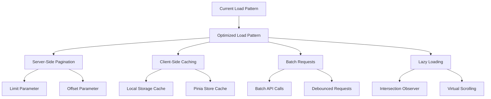

**Potential Performance Improvements:**
- Implement server-side pagination with limit/offset parameters
- Add client-side caching for frequently accessed data
- Optimize bulk loading with batch requests
- Implement virtual scrolling for large article lists
- Add debounced search functionality

## Troubleshooting Guide

### Common Issues and Solutions

#### Authentication Problems
**Issue**: Users redirected to login page despite having valid tokens
**Solution**: Check token expiration and localStorage persistence

**Section sources**
- [request.js:20-29](file://blog-frontend/src/api/request.js#L20-L29)
- [auth.js:4-18](file://blog-frontend/src/stores/auth.js#L4-L18)

#### API Communication Errors
**Issue**: 401 Unauthorized responses during API calls
**Solution**: Verify JWT token presence and validity

**Section sources**
- [request.js:9-18](file://blog-frontend/src/api/request.js#L9-L18)

#### File Upload Failures
**Issue**: Image upload errors in rich text editor
**Solution**: Check upload path configuration and file permissions

**Section sources**
- [AdminController.java:46-59](file://blog-backend/src/main/java/com/blog/controller/AdminController.java#L46-L59)
- [application.yml:31-33](file://blog-backend/src/main/resources/application.yml#L31-L33)

#### Data Synchronization Issues
**Issue**: Elasticsearch indexing failures affecting search functionality
**Solution**: Monitor Elasticsearch connectivity and handle exceptions gracefully

**Section sources**
- [ArticleService.java:42-44](file://blog-backend/src/main/java/com/blog/service/ArticleService.java#L42-L44)

## Conclusion

The admin articles management system provides a comprehensive content management solution with modern frontend and backend architectures. The system successfully implements:

**Strengths:**
- Clean separation of concerns between frontend and backend
- Robust authentication and authorization mechanisms
- Rich text editing with custom media upload integration
- Responsive design with mobile-first approach
- Comprehensive API coverage for article management

**Areas for Enhancement:**
- Implement pagination for improved performance with large datasets
- Add comprehensive form validation and error handling
- Implement bulk operations for efficient article management
- Add real-time updates for collaborative editing scenarios
- Enhance search functionality with advanced filtering options

The system demonstrates good architectural practices with clear component boundaries, proper state management, and scalable backend services. Future enhancements should focus on performance optimization, user experience improvements, and expanded functionality for enterprise-grade content management.