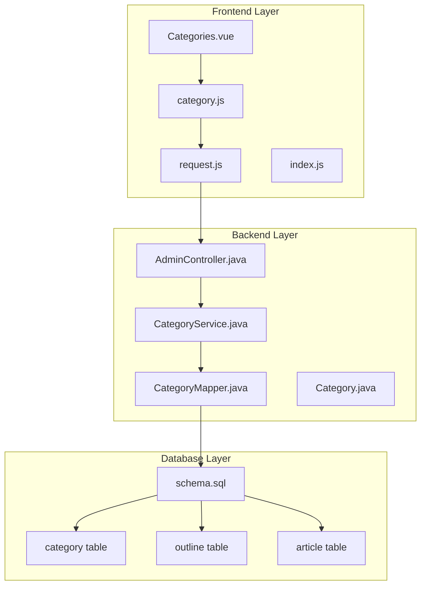
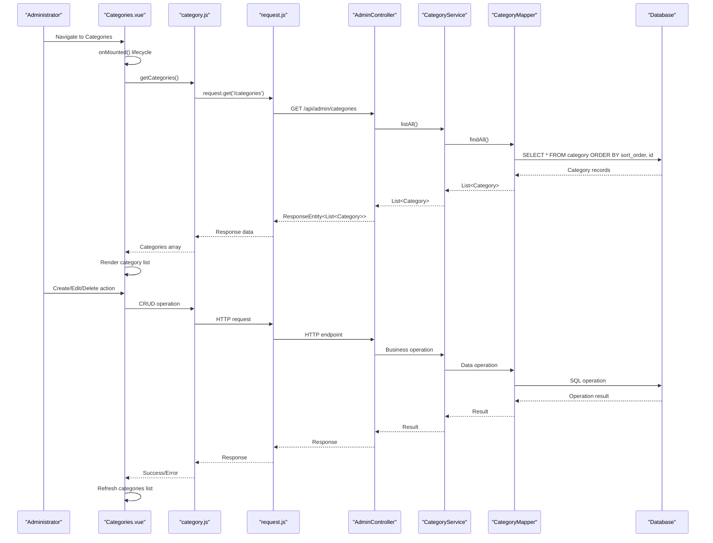
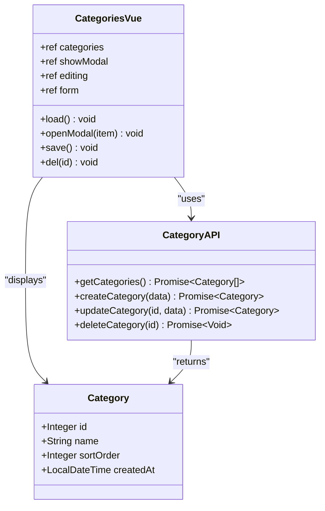
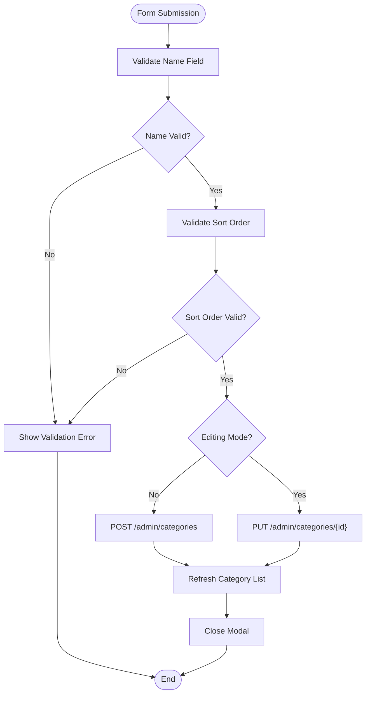
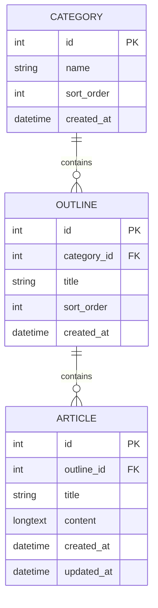
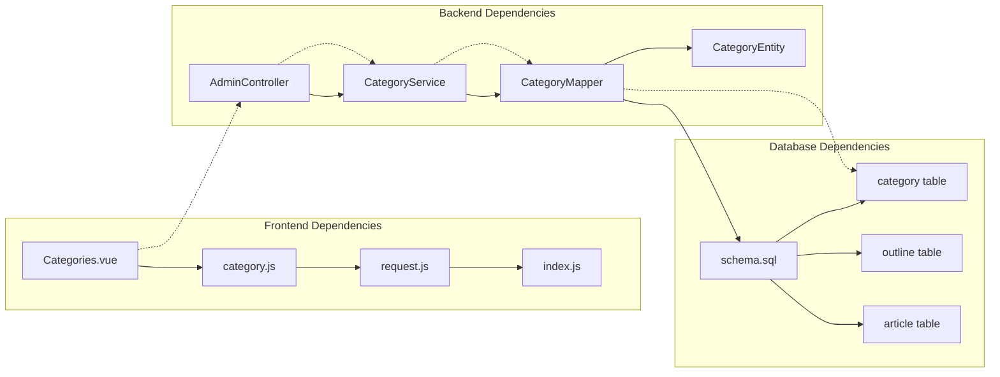

# Admin Categories Management

<cite>
**Referenced Files in This Document**
- [Categories.vue](file://blog-frontend/src/views/admin/Categories.vue)
- [category.js](file://blog-frontend/src/api/category.js)
- [request.js](file://blog-frontend/src/api/request.js)
- [index.js](file://blog-frontend/src/router/index.js)
- [AdminController.java](file://blog-backend/src/main/java/com/blog/controller/AdminController.java)
- [CategoryService.java](file://blog-backend/src/main/java/com/blog/service/CategoryService.java)
- [CategoryMapper.java](file://blog-backend/src/main/java/com/blog/mapper/CategoryMapper.java)
- [Category.java](file://blog-backend/src/main/java/com/blog/entity/Category.java)
- [schema.sql](file://blog-backend/src/main/resources/schema.sql)
- [application.yml](file://blog-backend/src/main/resources/application.yml)
</cite>

## Table of Contents
1. [Introduction](#introduction)
2. [Project Structure](#project-structure)
3. [Core Components](#core-components)
4. [Architecture Overview](#architecture-overview)
5. [Detailed Component Analysis](#detailed-component-analysis)
6. [Dependency Analysis](#dependency-analysis)
7. [Performance Considerations](#performance-considerations)
8. [Troubleshooting Guide](#troubleshooting-guide)
9. [Conclusion](#conclusion)

## Introduction
The Admin Categories Management component provides administrators with a comprehensive interface for managing content categories. This system enables hierarchical content organization through category creation, editing, deletion, and sorting capabilities. The component integrates seamlessly with the backend API to provide real-time updates and maintains strong relationships with the outline and article management systems for cohesive content organization.

The component serves as a foundational element for content management, allowing administrators to organize articles into logical groupings while maintaining flexible sorting mechanisms and hierarchical relationships that support scalable content architectures.

## Project Structure
The categories management system follows a clear separation of concerns with frontend Vue.js components and backend Spring Boot services:

**Diagram sources**
- [Categories.vue:1-154](file://blog-frontend/src/views/admin/Categories.vue#L1-L154)
- [category.js:1-10](file://blog-frontend/src/api/category.js#L1-L10)
- [request.js:1-33](file://blog-frontend/src/api/request.js#L1-L33)
- [AdminController.java:1-121](file://blog-backend/src/main/java/com/blog/controller/AdminController.java#L1-L121)
- [CategoryService.java:1-42](file://blog-backend/src/main/java/com/blog/service/CategoryService.java#L1-L42)
- [CategoryMapper.java:1-27](file://blog-backend/src/main/java/com/blog/mapper/CategoryMapper.java#L1-L27)
- [schema.sql:1-33](file://blog-backend/src/main/resources/schema.sql#L1-L33)

**Section sources**
- [Categories.vue:1-154](file://blog-frontend/src/views/admin/Categories.vue#L1-L154)
- [category.js:1-10](file://blog-frontend/src/api/category.js#L1-L10)
- [request.js:1-33](file://blog-frontend/src/api/request.js#L1-L33)
- [AdminController.java:1-121](file://blog-backend/src/main/java/com/blog/controller/AdminController.java#L1-L121)
- [CategoryService.java:1-42](file://blog-backend/src/main/java/com/blog/service/CategoryService.java#L1-L42)
- [CategoryMapper.java:1-27](file://blog-backend/src/main/java/com/blog/mapper/CategoryMapper.java#L1-L27)
- [schema.sql:1-33](file://blog-backend/src/main/resources/schema.sql#L1-L33)

## Core Components
The categories management system consists of several interconnected components that work together to provide a seamless administrative experience:

### Frontend Components
- **Categories.vue**: Main administrative interface for category management
- **category.js**: API client module for category operations
- **request.js**: HTTP request wrapper with authentication and error handling
- **Router Configuration**: Vue Router integration for admin navigation

### Backend Services
- **AdminController**: REST API endpoints for category CRUD operations
- **CategoryService**: Business logic layer with caching support
- **CategoryMapper**: Data access layer using MyBatis
- **Category Entity**: Domain model representation

### Database Schema
- **Category Table**: Stores category metadata with sorting capabilities
- **Outline Table**: Hierarchical organization under categories
- **Article Table**: Content items organized within outlines

**Section sources**
- [Categories.vue:43-81](file://blog-frontend/src/views/admin/Categories.vue#L43-L81)
- [category.js:3-9](file://blog-frontend/src/api/category.js#L3-L9)
- [request.js:4-30](file://blog-frontend/src/api/request.js#L4-L30)
- [AdminController.java:61-79](file://blog-backend/src/main/java/com/blog/controller/AdminController.java#L61-L79)
- [CategoryService.java:18-40](file://blog-backend/src/main/java/com/blog/service/CategoryService.java#L18-L40)
- [CategoryMapper.java:11-25](file://blog-backend/src/main/java/com/blog/mapper/CategoryMapper.java#L11-L25)
- [schema.sql:1-6](file://blog-backend/src/main/resources/schema.sql#L1-L6)

## Architecture Overview
The categories management system implements a layered architecture with clear separation between presentation, business logic, and data access layers:

**Diagram sources**
- [Categories.vue:55-80](file://blog-frontend/src/views/admin/Categories.vue#L55-L80)
- [category.js:3-9](file://blog-frontend/src/api/category.js#L3-L9)
- [request.js:4-30](file://blog-frontend/src/api/request.js#L4-L30)
- [AdminController.java:61-79](file://blog-backend/src/main/java/com/blog/controller/AdminController.java#L61-L79)
- [CategoryService.java:18-40](file://blog-backend/src/main/java/com/blog/service/CategoryService.java#L18-L40)
- [CategoryMapper.java:11-25](file://blog-backend/src/main/java/com/blog/mapper/CategoryMapper.java#L11-L25)

The architecture ensures that:
- **Real-time Updates**: Category lists refresh automatically after CRUD operations
- **Caching Strategy**: Category data is cached to improve performance
- **Error Handling**: Comprehensive error handling at both frontend and backend levels
- **Security**: JWT-based authentication for admin access
- **Scalability**: Hierarchical organization supporting unlimited nesting levels

## Detailed Component Analysis

### Category List Interface
The category list interface provides a clean, glass-morphism inspired design with intuitive controls:

**Diagram sources**
- [Categories.vue:43-81](file://blog-frontend/src/views/admin/Categories.vue#L43-L81)
- [Category.java:7-12](file://blog-backend/src/main/java/com/blog/entity/Category.java#L7-L12)
- [category.js:3-9](file://blog-frontend/src/api/category.js#L3-L9)

**Section sources**
- [Categories.vue:8-19](file://blog-frontend/src/views/admin/Categories.vue#L8-L19)
- [Categories.vue:47-57](file://blog-frontend/src/views/admin/Categories.vue#L47-L57)

### Category Creation and Editing Forms
The form system supports both creation and editing modes with comprehensive validation:

**Diagram sources**
- [Categories.vue:24-74](file://blog-frontend/src/views/admin/Categories.vue#L24-L74)
- [category.js:5-7](file://blog-frontend/src/api/category.js#L5-L7)

**Section sources**
- [Categories.vue:23-37](file://blog-frontend/src/views/admin/Categories.vue#L23-L37)
- [Categories.vue:59-64](file://blog-frontend/src/views/admin/Categories.vue#L59-L64)

### Hierarchical Category Organization
The system supports hierarchical organization through foreign key relationships:

**Diagram sources**
- [schema.sql:1-25](file://blog-backend/src/main/resources/schema.sql#L1-L25)
- [Category.java:7-12](file://blog-backend/src/main/java/com/blog/entity/Category.java#L7-L12)
- [Outline.java:7-13](file://blog-backend/src/main/java/com/blog/entity/Outline.java#L7-L13)
- [Article.java:7-14](file://blog-backend/src/main/java/com/blog/entity/Article.java#L7-L14)

**Section sources**
- [schema.sql:8-25](file://blog-backend/src/main/resources/schema.sql#L8-L25)
- [Outline.java:8-12](file://blog-backend/src/main/java/com/blog/entity/Outline.java#L8-L12)
- [Article.java:8-13](file://blog-backend/src/main/java/com/blog/entity/Article.java#L8-L13)

### Drag-and-Drop Functionality
The current implementation focuses on numeric sort order management. While direct drag-and-drop is not implemented, the system supports flexible sorting through the sortOrder field:

**Section sources**
- [Categories.vue:12](file://blog-frontend/src/views/admin/Categories.vue#L12)
- [CategoryMapper.java:11](file://blog-backend/src/main/java/com/blog/mapper/CategoryMapper.java#L11)

### Form Validation Patterns
The form validation follows Vue.js reactive patterns with HTML5 validation attributes:

**Section sources**
- [Categories.vue:27](file://blog-frontend/src/views/admin/Categories.vue#L27)
- [Categories.vue:31](file://blog-frontend/src/views/admin/Categories.vue#L31)

### Bulk Operations
The current implementation supports individual category operations. Bulk operations could be implemented by extending the API endpoints to handle arrays of category IDs.

**Section sources**
- [category.js:3-9](file://blog-frontend/src/api/category.js#L3-L9)
- [AdminController.java:61-79](file://blog-backend/src/main/java/com/blog/controller/AdminController.java#L61-L79)

### API Integration and Real-time Updates
The component integrates with backend endpoints through a well-structured API layer:

**Section sources**
- [category.js:3-9](file://blog-frontend/src/api/category.js#L3-L9)
- [AdminController.java:61-79](file://blog-backend/src/main/java/com/blog/controller/AdminController.java#L61-L79)

### Error Handling
Comprehensive error handling is implemented at multiple levels:

**Section sources**
- [request.js:20-29](file://blog-frontend/src/api/request.js#L20-L29)
- [CategoryService.java:18-40](file://blog-backend/src/main/java/com/blog/service/CategoryService.java#L18-L40)

## Dependency Analysis
The categories management system exhibits strong modularity with clear dependency relationships:

**Diagram sources**
- [Categories.vue:45](file://blog-frontend/src/views/admin/Categories.vue#L45)
- [category.js:1](file://blog-frontend/src/api/category.js#L1)
- [request.js:1](file://blog-frontend/src/api/request.js#L1)
- [index.js:1](file://blog-frontend/src/router/index.js#L1)
- [AdminController.java:26](file://blog-backend/src/main/java/com/blog/controller/AdminController.java#L26)
- [CategoryService.java:16](file://blog-backend/src/main/java/com/blog/service/CategoryService.java#L16)
- [CategoryMapper.java:9](file://blog-backend/src/main/java/com/blog/mapper/CategoryMapper.java#L9)
- [schema.sql:1-33](file://blog-backend/src/main/resources/schema.sql#L1-L33)

**Section sources**
- [Categories.vue:45](file://blog-frontend/src/views/admin/Categories.vue#L45)
- [category.js:1](file://blog-frontend/src/api/category.js#L1)
- [request.js:1](file://blog-frontend/src/api/request.js#L1)
- [index.js:1](file://blog-frontend/src/router/index.js#L1)
- [AdminController.java:26](file://blog-backend/src/main/java/com/blog/controller/AdminController.java#L26)
- [CategoryService.java:16](file://blog-backend/src/main/java/com/blog/service/CategoryService.java#L16)
- [CategoryMapper.java:9](file://blog-backend/src/main/java/com/blog/mapper/CategoryMapper.java#L9)
- [schema.sql:1-33](file://blog-backend/src/main/resources/schema.sql#L1-L33)

## Performance Considerations
The system implements several performance optimization strategies:

### Caching Strategy
- **Category Listing Cache**: Results cached using `@Cacheable("categories")`
- **Cache Invalidation**: Automatic cache clearing on create/update/delete operations
- **Cache Eviction**: `@CacheEvict(value = "categories", allEntries = true)` ensures data consistency

### Database Optimization
- **Indexing**: Primary key on category ID, foreign keys on outline and article tables
- **Sorting**: Database-level ordering by `sort_order` and `id`
- **Efficient Queries**: Single query for category listing with ORDER BY clause

### Frontend Performance
- **Lazy Loading**: Vue components loaded on demand
- **Minimal Re-renders**: Reactive updates only when data changes
- **Modal Optimization**: Overlay only rendered when active

**Section sources**
- [CategoryService.java:18](file://blog-backend/src/main/java/com/blog/service/CategoryService.java#L18)
- [CategoryService.java:27](file://blog-backend/src/main/java/com/blog/service/CategoryService.java#L27)
- [CategoryMapper.java:11](file://blog-backend/src/main/java/com/blog/mapper/CategoryMapper.java#L11)

## Troubleshooting Guide

### Common Issues and Solutions

#### Authentication Problems
- **Issue**: 401 Unauthorized errors after login
- **Cause**: Missing or expired JWT token
- **Solution**: Verify token storage in auth store and check JWT configuration

#### API Connectivity Issues
- **Issue**: Network errors when loading categories
- **Cause**: CORS configuration or backend unavailability
- **Solution**: Check `/api` proxy configuration and backend server status

#### Data Consistency Issues
- **Issue**: Stale category data after operations
- **Cause**: Cache not being invalidated properly
- **Solution**: Verify cache eviction annotations are triggered

#### Database Schema Issues
- **Issue**: Foreign key constraint violations
- **Cause**: Missing or incorrect foreign key relationships
- **Solution**: Validate schema.sql and ensure proper table creation order

**Section sources**
- [request.js:20-29](file://blog-frontend/src/api/request.js#L20-L29)
- [application.yml:1-33](file://blog-backend/src/main/resources/application.yml#L1-L33)
- [schema.sql:1-33](file://blog-backend/src/main/resources/schema.sql#L1-L33)

## Conclusion
The Admin Categories Management component provides a robust foundation for content organization within the blogging platform. Its layered architecture ensures maintainability, scalability, and performance while providing administrators with intuitive tools for managing content hierarchies.

Key strengths of the implementation include:
- **Clean Separation of Concerns**: Clear boundaries between frontend and backend layers
- **Comprehensive Error Handling**: Multi-level error management from API to UI
- **Performance Optimization**: Strategic caching and efficient database queries
- **Extensible Design**: Foundation for future enhancements like drag-and-drop sorting
- **Security Integration**: JWT-based authentication for admin access

The component successfully integrates with the broader content management ecosystem, supporting the relationship between categories, outlines, and articles while maintaining data integrity and providing real-time updates for administrative efficiency.

Future enhancements could include drag-and-drop sorting functionality, bulk operations, and advanced filtering capabilities to further improve the administrative experience.