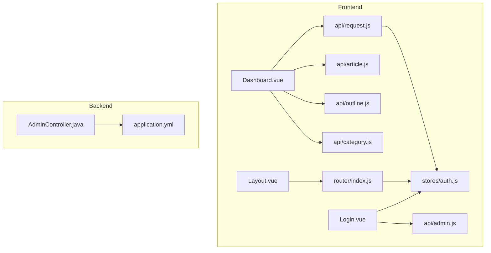
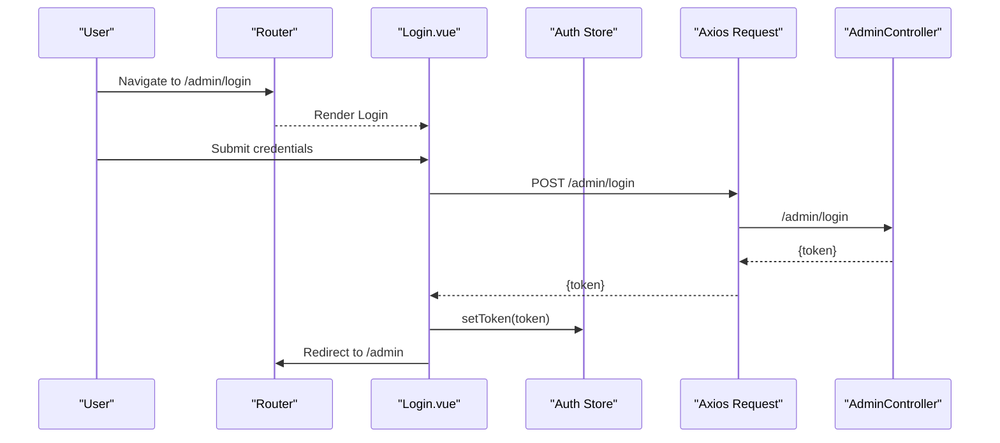
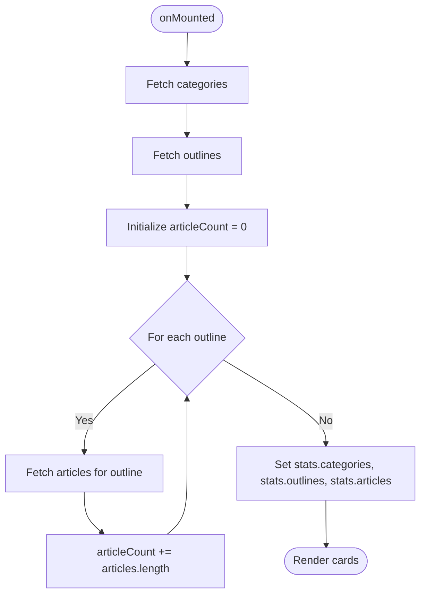
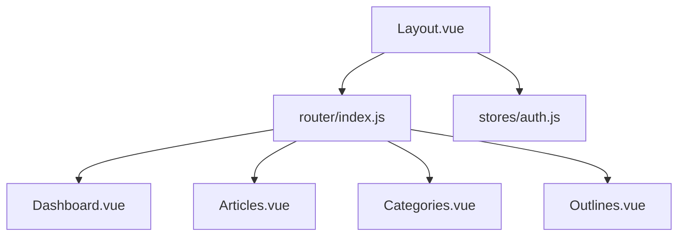
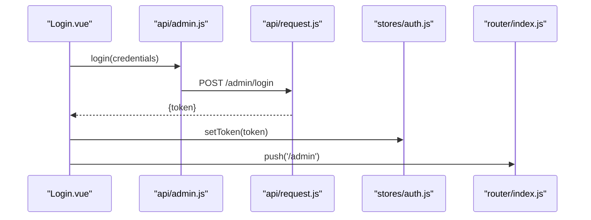
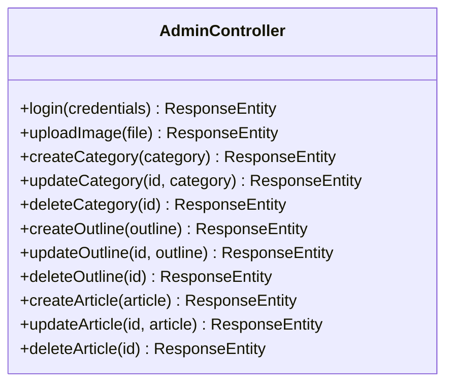
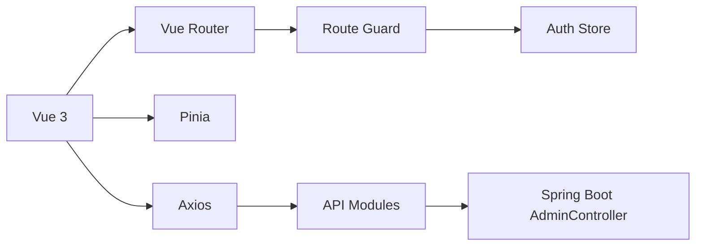

# Admin Dashboard

<cite>
**Referenced Files in This Document**
- [Dashboard.vue](file://blog-frontend/src/views/admin/Dashboard.vue)
- [Layout.vue](file://blog-frontend/src/views/admin/Layout.vue)
- [Login.vue](file://blog-frontend/src/views/admin/Login.vue)
- [index.js](file://blog-frontend/src/router/index.js)
- [auth.js](file://blog-frontend/src/stores/auth.js)
- [request.js](file://blog-frontend/src/api/request.js)
- [admin.js](file://blog-frontend/src/api/admin.js)
- [category.js](file://blog-frontend/src/api/category.js)
- [outline.js](file://blog-frontend/src/api/outline.js)
- [article.js](file://blog-frontend/src/api/article.js)
- [AdminController.java](file://blog-backend/src/main/java/com/blog/controller/AdminController.java)
- [application.yml](file://blog-backend/src/main/resources/application.yml)
- [vite.config.js](file://blog-frontend/vite.config.js)
</cite>

## Table of Contents
1. [Introduction](#introduction)
2. [Project Structure](#project-structure)
3. [Core Components](#core-components)
4. [Architecture Overview](#architecture-overview)
5. [Detailed Component Analysis](#detailed-component-analysis)
6. [Dependency Analysis](#dependency-analysis)
7. [Performance Considerations](#performance-considerations)
8. [Troubleshooting Guide](#troubleshooting-guide)
9. [Conclusion](#conclusion)

## Introduction
This document describes the admin dashboard component of the blog project. It covers the dashboard layout, statistics cards, data fetching mechanisms, state management integration, responsive grid layout, and the dashboard’s role in providing an admin overview. It also explains how the frontend integrates with backend endpoints for admin operations and authentication.

## Project Structure
The admin dashboard resides in the frontend under the admin views. It is integrated into the admin layout and protected by authentication guards. The backend exposes admin endpoints for login and media uploads, while the frontend communicates via a shared Axios instance with interceptors for authentication and error handling.

**Diagram sources**
- [Dashboard.vue:1-73](file://blog-frontend/src/views/admin/Dashboard.vue#L1-L73)
- [Layout.vue:1-164](file://blog-frontend/src/views/admin/Layout.vue#L1-L164)
- [Login.vue:1-83](file://blog-frontend/src/views/admin/Login.vue#L1-L83)
- [index.js:1-74](file://blog-frontend/src/router/index.js#L1-L74)
- [auth.js:1-19](file://blog-frontend/src/stores/auth.js#L1-L19)
- [request.js:1-33](file://blog-frontend/src/api/request.js#L1-L33)
- [admin.js:1-12](file://blog-frontend/src/api/admin.js#L1-L12)
- [category.js:1-10](file://blog-frontend/src/api/category.js#L1-L10)
- [outline.js:1-10](file://blog-frontend/src/api/outline.js#L1-L10)
- [article.js:1-14](file://blog-frontend/src/api/article.js#L1-L14)
- [AdminController.java:1-121](file://blog-backend/src/main/java/com/blog/controller/AdminController.java#L1-L121)
- [application.yml:1-33](file://blog-backend/src/main/resources/application.yml#L1-L33)

**Section sources**
- [Dashboard.vue:1-73](file://blog-frontend/src/views/admin/Dashboard.vue#L1-L73)
- [Layout.vue:1-164](file://blog-frontend/src/views/admin/Layout.vue#L1-L164)
- [Login.vue:1-83](file://blog-frontend/src/views/admin/Login.vue#L1-L83)
- [index.js:1-74](file://blog-frontend/src/router/index.js#L1-L74)
- [auth.js:1-19](file://blog-frontend/src/stores/auth.js#L1-L19)
- [request.js:1-33](file://blog-frontend/src/api/request.js#L1-L33)
- [admin.js:1-12](file://blog-frontend/src/api/admin.js#L1-L12)
- [category.js:1-10](file://blog-frontend/src/api/category.js#L1-L10)
- [outline.js:1-10](file://blog-frontend/src/api/outline.js#L1-L10)
- [article.js:1-14](file://blog-frontend/src/api/article.js#L1-L14)
- [AdminController.java:1-121](file://blog-backend/src/main/java/com/blog/controller/AdminController.java#L1-L121)
- [application.yml:1-33](file://blog-backend/src/main/resources/application.yml#L1-L33)
- [vite.config.js:1-20](file://blog-frontend/vite.config.js#L1-L20)

## Core Components
- Dashboard layout and statistics cards:
  - The dashboard displays three summary cards: categories count, outlines count, and total articles count. The counts are computed client-side after fetching related collections.
  - The layout uses a responsive CSS Grid to arrange cards and applies scoped styles for visual emphasis.
- Data fetching:
  - The dashboard fetches categories and outlines, then iterates outlines to fetch articles per outline and aggregates the total.
  - API modules encapsulate HTTP requests for categories, outlines, and articles.
- Authentication and routing:
  - The admin area is protected by a route guard that checks for a stored token.
  - Login stores the returned JWT token and redirects to the admin panel.
  - An Axios interceptor attaches the Authorization header for protected routes and handles 401 responses by clearing the token and redirecting to the login page.
- Backend integration:
  - Admin endpoints include login and image upload. The upload endpoint writes files to a configured path and returns a URL.

**Section sources**
- [Dashboard.vue:1-73](file://blog-frontend/src/views/admin/Dashboard.vue#L1-L73)
- [category.js:1-10](file://blog-frontend/src/api/category.js#L1-L10)
- [outline.js:1-10](file://blog-frontend/src/api/outline.js#L1-L10)
- [article.js:1-14](file://blog-frontend/src/api/article.js#L1-L14)
- [request.js:1-33](file://blog-frontend/src/api/request.js#L1-L33)
- [auth.js:1-19](file://blog-frontend/src/stores/auth.js#L1-L19)
- [index.js:64-71](file://blog-frontend/src/router/index.js#L64-L71)
- [Login.vue:32-41](file://blog-frontend/src/views/admin/Login.vue#L32-L41)
- [admin.js:1-12](file://blog-frontend/src/api/admin.js#L1-L12)
- [AdminController.java:34-59](file://blog-backend/src/main/java/com/blog/controller/AdminController.java#L34-L59)
- [application.yml:27-33](file://blog-backend/src/main/resources/application.yml#L27-L33)

## Architecture Overview
The admin dashboard follows a clean separation of concerns:
- Frontend Vue components render the UI and orchestrate data fetching.
- API modules centralize HTTP calls and expose domain-specific functions.
- Axios interceptors manage authentication and error handling.
- Backend controllers expose admin endpoints for login and media operations.
- Routing enforces authentication and organizes admin pages.

**Diagram sources**
- [index.js:16-24](file://blog-frontend/src/router/index.js#L16-L24)
- [Login.vue:32-41](file://blog-frontend/src/views/admin/Login.vue#L32-L41)
- [auth.js:7-10](file://blog-frontend/src/stores/auth.js#L7-L10)
- [request.js:9-18](file://blog-frontend/src/api/request.js#L9-L18)
- [admin.js](file://blog-frontend/src/api/admin.js#L3)
- [AdminController.java:34-44](file://blog-backend/src/main/java/com/blog/controller/AdminController.java#L34-L44)

## Detailed Component Analysis

### Dashboard Component
- Purpose: Present an overview of content counts (categories, outlines, articles).
- Data fetching:
  - Fetch categories and outlines.
  - For each outline, fetch articles and sum the counts.
- State management:
  - Uses a reactive object to store counts and update the DOM upon completion.
- Responsive layout:
  - CSS Grid with auto-fit columns ensures cards reflow on smaller screens.

**Diagram sources**
- [Dashboard.vue:29-40](file://blog-frontend/src/views/admin/Dashboard.vue#L29-L40)

**Section sources**
- [Dashboard.vue:1-73](file://blog-frontend/src/views/admin/Dashboard.vue#L1-L73)
- [category.js](file://blog-frontend/src/api/category.js#L3)
- [outline.js](file://blog-frontend/src/api/outline.js#L3)
- [article.js](file://blog-frontend/src/api/article.js#L3)

### Admin Layout and Navigation
- Provides a sidebar navigation and topbar toggle for mobile.
- Defines admin routes and a logout action that clears the token and navigates to the login page.
- Integrates with the router and auth store.

**Diagram sources**
- [Layout.vue:1-164](file://blog-frontend/src/views/admin/Layout.vue#L1-L164)
- [index.js:20-56](file://blog-frontend/src/router/index.js#L20-L56)
- [auth.js:12-15](file://blog-frontend/src/stores/auth.js#L12-L15)

**Section sources**
- [Layout.vue:1-164](file://blog-frontend/src/views/admin/Layout.vue#L1-L164)
- [index.js:20-56](file://blog-frontend/src/router/index.js#L20-L56)
- [auth.js:12-15](file://blog-frontend/src/stores/auth.js#L12-L15)

### Authentication and Token Management
- Login component posts credentials to the backend and stores the returned token.
- Axios interceptor attaches Authorization headers for protected routes.
- On 401, the interceptor clears the token and redirects to the login page.

**Diagram sources**
- [Login.vue:32-41](file://blog-frontend/src/views/admin/Login.vue#L32-L41)
- [admin.js](file://blog-frontend/src/api/admin.js#L3)
- [request.js:9-18](file://blog-frontend/src/api/request.js#L9-L18)
- [auth.js:7-10](file://blog-frontend/src/stores/auth.js#L7-L10)
- [index.js:64-71](file://blog-frontend/src/router/index.js#L64-L71)

**Section sources**
- [Login.vue:1-83](file://blog-frontend/src/views/admin/Login.vue#L1-L83)
- [request.js:1-33](file://blog-frontend/src/api/request.js#L1-L33)
- [auth.js:1-19](file://blog-frontend/src/stores/auth.js#L1-L19)
- [index.js:64-71](file://blog-frontend/src/router/index.js#L64-L71)

### Backend Admin Endpoints
- Login endpoint validates credentials and returns a JWT token.
- Upload endpoint saves images to a configured path and returns a URL.
- These endpoints support the admin dashboard’s authentication and media workflows.

**Diagram sources**
- [AdminController.java:19-121](file://blog-backend/src/main/java/com/blog/controller/AdminController.java#L19-L121)

**Section sources**
- [AdminController.java:34-59](file://blog-backend/src/main/java/com/blog/controller/AdminController.java#L34-L59)
- [application.yml:27-33](file://blog-backend/src/main/resources/application.yml#L27-L33)

## Dependency Analysis
- Frontend dependencies:
  - Vue 3, Vue Router, Pinia, Axios.
  - Vite dev server with proxy to backend.
- Backend dependencies:
  - Spring Boot application with MySQL, Redis, and Elasticsearch configuration.
- Inter-module dependencies:
  - Dashboard depends on API modules for data retrieval.
  - Router guards depend on the auth store.
  - Axios interceptors depend on the auth store.

**Diagram sources**
- [package.json:11-22](file://blog-frontend/package.json#L11-L22)
- [vite.config.js:9-18](file://blog-frontend/vite.config.js#L9-L18)
- [request.js:1-33](file://blog-frontend/src/api/request.js#L1-L33)
- [index.js:64-71](file://blog-frontend/src/router/index.js#L64-L71)
- [auth.js:1-19](file://blog-frontend/src/stores/auth.js#L1-L19)
- [AdminController.java:19-121](file://blog-backend/src/main/java/com/blog/controller/AdminController.java#L19-L121)

**Section sources**
- [package.json:1-24](file://blog-frontend/package.json#L1-L24)
- [vite.config.js:1-20](file://blog-frontend/vite.config.js#L1-L20)
- [request.js:1-33](file://blog-frontend/src/api/request.js#L1-L33)
- [index.js:64-71](file://blog-frontend/src/router/index.js#L64-L71)
- [auth.js:1-19](file://blog-frontend/src/stores/auth.js#L1-L19)
- [AdminController.java:19-121](file://blog-backend/src/main/java/com/blog/controller/AdminController.java#L19-L121)

## Performance Considerations
- Current dashboard fetches outlines and then performs a series of article queries per outline. This can lead to multiple network requests and potential delays.
- Optimization opportunities:
  - Introduce a backend endpoint that returns aggregated counts for categories, outlines, and articles in a single request.
  - Add caching at the frontend to avoid repeated fetches during the session.
  - Debounce or throttle route transitions to prevent redundant mounts.
- Real-time updates:
  - The current implementation does not include real-time updates. To add real-time capabilities, integrate WebSocket connections or periodic polling to refresh metrics.

[No sources needed since this section provides general guidance]

## Troubleshooting Guide
- 401 Unauthorized:
  - Symptom: Automatic logout and redirect to the login page.
  - Cause: Missing or invalid Authorization header.
  - Resolution: Ensure the login flow completes successfully and the token is persisted.
- Network errors:
  - Symptom: Requests fail due to CORS or proxy misconfiguration.
  - Cause: Proxy settings or backend origin mismatch.
  - Resolution: Verify Vite proxy targets and backend origins.
- Upload failures:
  - Symptom: Image upload returns an error.
  - Cause: Incorrect upload path or permissions.
  - Resolution: Confirm the upload path exists and is writable.

**Section sources**
- [request.js:20-30](file://blog-frontend/src/api/request.js#L20-L30)
- [vite.config.js:9-18](file://blog-frontend/vite.config.js#L9-L18)
- [application.yml:31-33](file://blog-backend/src/main/resources/application.yml#L31-L33)

## Conclusion
The admin dashboard provides a concise overview of content statistics by aggregating counts from categories, outlines, and articles. It leverages a clean frontend architecture with Vue components, API modules, and centralized state management. While the current implementation focuses on static counts, future enhancements can include backend aggregation endpoints, caching, and real-time updates to improve responsiveness and user experience.