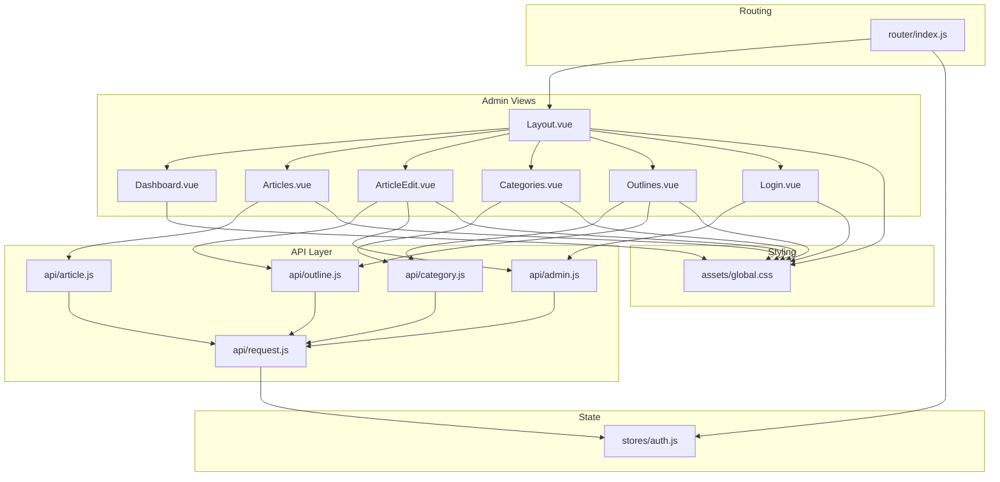
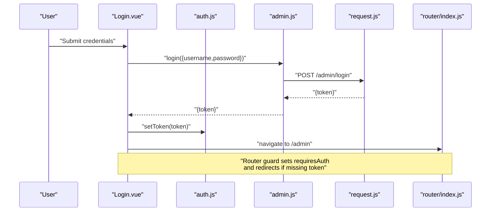
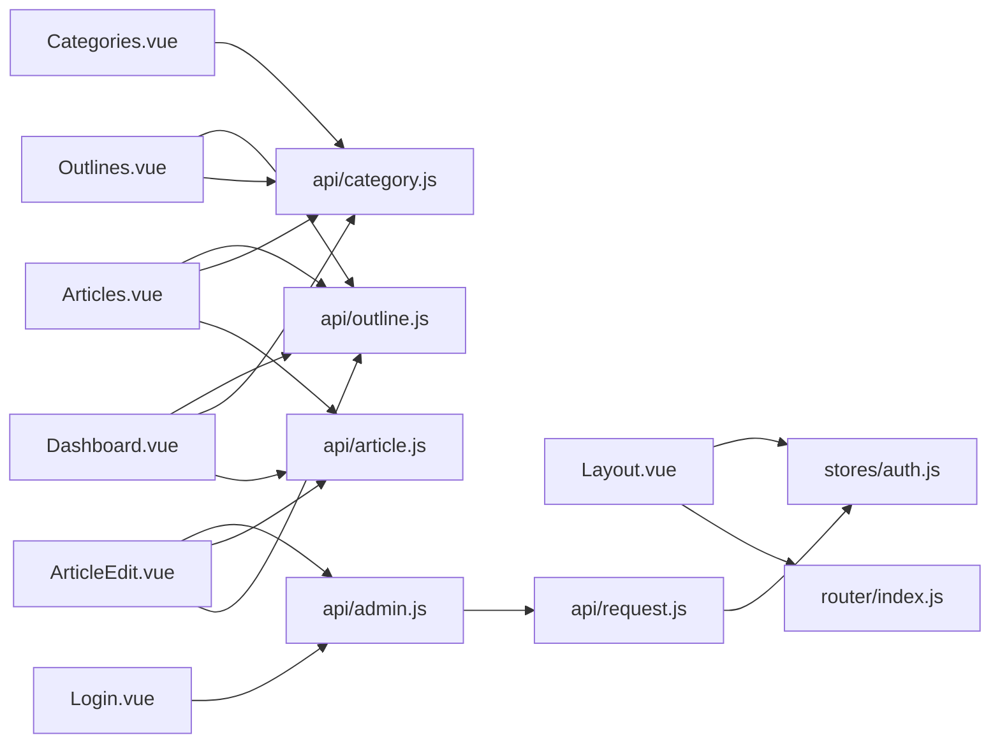

# Admin Interface Components

<cite>
**Referenced Files in This Document**
- [Layout.vue](file://blog-frontend/src/views/admin/Layout.vue)
- [Dashboard.vue](file://blog-frontend/src/views/admin/Dashboard.vue)
- [Login.vue](file://blog-frontend/src/views/admin/Login.vue)
- [Articles.vue](file://blog-frontend/src/views/admin/Articles.vue)
- [Categories.vue](file://blog-frontend/src/views/admin/Categories.vue)
- [Outlines.vue](file://blog-frontend/src/views/admin/Outlines.vue)
- [ArticleEdit.vue](file://blog-frontend/src/views/admin/ArticleEdit.vue)
- [admin.js](file://blog-frontend/src/api/admin.js)
- [request.js](file://blog-frontend/src/api/request.js)
- [auth.js](file://blog-frontend/src/stores/auth.js)
- [index.js](file://blog-frontend/src/router/index.js)
- [article.js](file://blog-frontend/src/api/article.js)
- [category.js](file://blog-frontend/src/api/category.js)
- [outline.js](file://blog-frontend/src/api/outline.js)
- [global.css](file://blog-frontend/src/assets/global.css)
</cite>

## Table of Contents
1. [Introduction](#introduction)
2. [Project Structure](#project-structure)
3. [Core Components](#core-components)
4. [Architecture Overview](#architecture-overview)
5. [Detailed Component Analysis](#detailed-component-analysis)
6. [Dependency Analysis](#dependency-analysis)
7. [Performance Considerations](#performance-considerations)
8. [Troubleshooting Guide](#troubleshooting-guide)
9. [Conclusion](#conclusion)
10. [Appendices](#appendices)

## Introduction
This document describes the admin interface Vue.js components for a blog management system. It covers the layout structure, dashboard statistics, article management, category management, outline management, and login component. It documents component props, events, state management, user interaction patterns, and integration with admin API services. It also provides guidelines for customization, responsive design, accessibility, lifecycle hooks, data binding, form handling, real-time updates, dark theme implementation, and UX design.

## Project Structure
The admin interface is organized under the admin views folder and integrates with shared API services, a Pinia authentication store, and Vue Router. The global styles define a cohesive dark theme with glass-morphism cards and gradient buttons.

**Diagram sources**
- [Layout.vue:1-164](file://blog-frontend/src/views/admin/Layout.vue#L1-L164)
- [Dashboard.vue:1-73](file://blog-frontend/src/views/admin/Dashboard.vue#L1-L73)
- [Articles.vue:1-138](file://blog-frontend/src/views/admin/Articles.vue#L1-L138)
- [ArticleEdit.vue:1-111](file://blog-frontend/src/views/admin/ArticleEdit.vue#L1-L111)
- [Categories.vue:1-154](file://blog-frontend/src/views/admin/Categories.vue#L1-L154)
- [Outlines.vue:1-172](file://blog-frontend/src/views/admin/Outlines.vue#L1-L172)
- [Login.vue:1-83](file://blog-frontend/src/views/admin/Login.vue#L1-L83)
- [index.js:1-74](file://blog-frontend/src/router/index.js#L1-L74)
- [auth.js:1-19](file://blog-frontend/src/stores/auth.js#L1-L19)
- [article.js:1-14](file://blog-frontend/src/api/article.js#L1-L14)
- [category.js:1-10](file://blog-frontend/src/api/category.js#L1-L10)
- [outline.js:1-10](file://blog-frontend/src/api/outline.js#L1-L10)
- [admin.js:1-12](file://blog-frontend/src/api/admin.js#L1-L12)
- [request.js:1-33](file://blog-frontend/src/api/request.js#L1-L33)
- [global.css:1-76](file://blog-frontend/src/assets/global.css#L1-L76)

**Section sources**
- [index.js:1-74](file://blog-frontend/src/router/index.js#L1-L74)
- [Layout.vue:1-164](file://blog-frontend/src/views/admin/Layout.vue#L1-L164)
- [global.css:1-76](file://blog-frontend/src/assets/global.css#L1-L76)

## Core Components
- Layout: Provides the sidebar navigation, topbar, and outlet for child views. Manages mobile menu toggle and logout via the auth store.
- Dashboard: Renders summary statistics for categories, outlines, and articles.
- Login: Handles admin authentication and redirects on success.
- Articles: Lists articles with filtering by category and outline, supports edit and delete actions.
- Categories: CRUD for categories with modal form and inline actions.
- Outlines: CRUD for outlines with category association and modal form.
- ArticleEdit: Rich text editor for creating/editing articles with image upload integration.

Key integration points:
- Router guards enforce authentication for admin routes.
- Axios request client injects Authorization header and handles 401 globally.
- Pinia auth store persists token and exposes logout.

**Section sources**
- [Layout.vue:28-47](file://blog-frontend/src/views/admin/Layout.vue#L28-L47)
- [Dashboard.vue:21-41](file://blog-frontend/src/views/admin/Dashboard.vue#L21-L41)
- [Login.vue:21-42](file://blog-frontend/src/views/admin/Login.vue#L21-L42)
- [Articles.vue:35-84](file://blog-frontend/src/views/admin/Articles.vue#L35-L84)
- [Categories.vue:43-81](file://blog-frontend/src/views/admin/Categories.vue#L43-L81)
- [Outlines.vue:49-99](file://blog-frontend/src/views/admin/Outlines.vue#L49-L99)
- [ArticleEdit.vue:34-81](file://blog-frontend/src/views/admin/ArticleEdit.vue#L34-L81)
- [index.js:64-71](file://blog-frontend/src/router/index.js#L64-L71)
- [request.js:9-30](file://blog-frontend/src/api/request.js#L9-L30)
- [auth.js:4-18](file://blog-frontend/src/stores/auth.js#L4-L18)
- [admin.js:3-11](file://blog-frontend/src/api/admin.js#L3-L11)

## Architecture Overview
The admin UI follows a routed layout pattern with protected routes. Components communicate with backend APIs through typed service modules. Authentication state drives routing and request headers.

**Diagram sources**
- [Login.vue:32-41](file://blog-frontend/src/views/admin/Login.vue#L32-L41)
- [admin.js:3-3](file://blog-frontend/src/api/admin.js#L3-L3)
- [request.js:1-33](file://blog-frontend/src/api/request.js#L1-L33)
- [auth.js:7-10](file://blog-frontend/src/stores/auth.js#L7-L10)
- [index.js:64-71](file://blog-frontend/src/router/index.js#L64-L71)

## Detailed Component Analysis

### Layout Component
Responsibilities:
- Render sidebar with navigation items and logout action.
- Toggle mobile sidebar visibility.
- Provide topbar with menu toggle and title.
- Host child routes via router-view.

Props and events:
- None (manages internal state for menuOpen).
- Emits no events; uses router-link and programmatic navigation.

State management:
- Reactive boolean flag for menuOpen.
- Menu items array defines navigation targets.

User interaction patterns:
- Clicking menu items collapses the sidebar on mobile.
- Logout clears auth token and navigates to login.

Integration:
- Uses auth store for logout and router for navigation.
- Scoped styles implement dark theme and responsive behavior.

Customization guidelines:
- Add/remove menu items by updating the menu array.
- Adjust breakpoints and sidebar widths in media queries.

Responsive design:
- Sidebar slides out on small screens; topbar becomes visible.
- Close button appears only on mobile.

Accessibility:
- Ensure focus management after menu toggle.
- Provide keyboard navigation support for sidebar links.

**Section sources**
- [Layout.vue:28-47](file://blog-frontend/src/views/admin/Layout.vue#L28-L47)
- [Layout.vue:50-163](file://blog-frontend/src/views/admin/Layout.vue#L50-L163)

### Dashboard Component
Responsibilities:
- Display summary statistics for categories, outlines, and articles.

Lifecycle and data binding:
- onMounted fetches category and outline counts.
- Computes total article count by iterating outlines and fetching articles per outline.

API integration:
- getCategories, getOutlines, getArticles from respective API modules.

Real-time updates:
- No polling; data refreshed on mount.

Customization:
- Extend stats object to include additional metrics.
- Add charts or widgets by integrating chart libraries.

**Section sources**
- [Dashboard.vue:21-41](file://blog-frontend/src/views/admin/Dashboard.vue#L21-L41)
- [Dashboard.vue:43-72](file://blog-frontend/src/views/admin/Dashboard.vue#L43-L72)

### Login Component
Responsibilities:
- Authenticate admin users and persist token.

Form handling:
- Two-way binding for username and password.
- Submission handler calls login API and sets token.

Error handling:
- Displays user-friendly error message on failure.

Navigation:
- On success, navigates to admin base path.

Integration:
- Uses admin API login endpoint.
- Persists token via auth store.

**Section sources**
- [Login.vue:21-42](file://blog-frontend/src/views/admin/Login.vue#L21-L42)
- [admin.js:3-3](file://blog-frontend/src/api/admin.js#L3-L3)
- [auth.js:7-10](file://blog-frontend/src/stores/auth.js#L7-L10)
- [index.js:16-18](file://blog-frontend/src/router/index.js#L16-L18)

### Articles Component
Responsibilities:
- List articles with filtering by category and outline.
- Provide actions to edit or delete articles.

State and computed:
- Reactive arrays for categories, outlines, and articles.
- Computed filteredOutlines based on selected category.

Filtering logic:
- Selecting a category resets outline selection.
- If outline selected, fetch articles for that outline.
- Otherwise, iterate filtered outlines and concatenate results.

Actions:
- Edit: navigate to ArticleEdit with id.
- Delete: confirm and call delete API, then refresh list.

Date formatting:
- Converts ISO date strings to localized date strings.

**Section sources**
- [Articles.vue:35-84](file://blog-frontend/src/views/admin/Articles.vue#L35-L84)
- [article.js:3-13](file://blog-frontend/src/api/article.js#L3-L13)
- [outline.js:3-3](file://blog-frontend/src/api/outline.js#L3-L3)
- [category.js:3-3](file://blog-frontend/src/api/category.js#L3-L3)

### Categories Component
Responsibilities:
- Manage categories (list, create, update, delete).

UI pattern:
- Modal overlay for create/edit forms.
- Inline actions per list item.

Form handling:
- Two-way binding for name and sort order.
- Save creates or updates depending on editing flag.

CRUD operations:
- Uses category API module for all operations.
- Reloads list after successful mutation.

**Section sources**
- [Categories.vue:43-81](file://blog-frontend/src/views/admin/Categories.vue#L43-L81)
- [category.js:5-9](file://blog-frontend/src/api/category.js#L5-L9)

### Outlines Component
Responsibilities:
- Manage outlines (list, create, update, delete).

UI pattern:
- Modal overlay for create/edit forms.
- Inline actions per list item.
- Displays associated category name.

Form handling:
- Two-way binding for title, category ID, and sort order.
- Prefills category from loaded categories on new outline creation.

CRUD operations:
- Uses outline API module for all operations.
- Loads categories and outlines on mount.

**Section sources**
- [Outlines.vue:49-99](file://blog-frontend/src/views/admin/Outlines.vue#L49-L99)
- [outline.js:5-9](file://blog-frontend/src/api/outline.js#L5-L9)
- [category.js:3-3](file://blog-frontend/src/api/category.js#L3-L3)

### ArticleEdit Component
Responsibilities:
- Create or edit an article with rich text content.

Rich text editor:
- Uses WangEditor with configured uploadImage callback.
- Uploads images via admin upload endpoint and inserts URLs.

Routing:
- Detects edit mode via route param presence.
- Navigates back to articles list on save.

Lifecycle:
- Fetches outlines on mount.
- Loads existing article data when editing.

**Section sources**
- [ArticleEdit.vue:34-81](file://blog-frontend/src/views/admin/ArticleEdit.vue#L34-L81)
- [admin.js:5-11](file://blog-frontend/src/api/admin.js#L5-L11)
- [outline.js:3-3](file://blog-frontend/src/api/outline.js#L3-L3)
- [article.js:9-13](file://blog-frontend/src/api/article.js#L9-L13)

## Dependency Analysis
Component and module relationships:

**Diagram sources**
- [Layout.vue:28-47](file://blog-frontend/src/views/admin/Layout.vue#L28-L47)
- [Dashboard.vue:21-41](file://blog-frontend/src/views/admin/Dashboard.vue#L21-L41)
- [Articles.vue:35-84](file://blog-frontend/src/views/admin/Articles.vue#L35-L84)
- [ArticleEdit.vue:34-81](file://blog-frontend/src/views/admin/ArticleEdit.vue#L34-L81)
- [Categories.vue:43-81](file://blog-frontend/src/views/admin/Categories.vue#L43-L81)
- [Outlines.vue:49-99](file://blog-frontend/src/views/admin/Outlines.vue#L49-L99)
- [Login.vue:21-42](file://blog-frontend/src/views/admin/Login.vue#L21-L42)
- [index.js:1-74](file://blog-frontend/src/router/index.js#L1-L74)
- [auth.js:1-19](file://blog-frontend/src/stores/auth.js#L1-L19)
- [admin.js:1-12](file://blog-frontend/src/api/admin.js#L1-L12)
- [request.js:1-33](file://blog-frontend/src/api/request.js#L1-L33)
- [article.js:1-14](file://blog-frontend/src/api/article.js#L1-L14)
- [category.js:1-10](file://blog-frontend/src/api/category.js#L1-L10)
- [outline.js:1-10](file://blog-frontend/src/api/outline.js#L1-L10)

**Section sources**
- [index.js:64-71](file://blog-frontend/src/router/index.js#L64-L71)
- [request.js:9-30](file://blog-frontend/src/api/request.js#L9-L30)
- [auth.js:4-18](file://blog-frontend/src/stores/auth.js#L4-L18)

## Performance Considerations
- Dashboard loops through outlines to compute article counts; consider caching or server-side aggregation to reduce client work.
- Articles list loads multiple article lists when no outline is selected; consider debouncing filters or pagination.
- Image uploads occur during editor save; ensure upload progress feedback and error handling.
- Global axios interceptor adds Authorization header on every request; keep token small and avoid unnecessary requests.

## Troubleshooting Guide
Common issues and resolutions:
- Unauthorized access: 401 responses trigger automatic logout and redirect to login. Verify token persistence and expiration.
- Form submission errors: Ensure required fields are present and types match expectations (e.g., numeric sort order).
- Navigation guards: Protected routes redirect unauthenticated users to login; confirm token exists in storage.
- Mobile sidebar: If menu does not close after navigation, verify click handlers and reactive state updates.

**Section sources**
- [request.js:20-30](file://blog-frontend/src/api/request.js#L20-L30)
- [index.js:64-71](file://blog-frontend/src/router/index.js#L64-L71)
- [auth.js:12-15](file://blog-frontend/src/stores/auth.js#L12-L15)

## Conclusion
The admin interface components provide a cohesive, dark-themed, and responsive management experience. They integrate tightly with router guards, a centralized auth store, and typed API services. The layout is modular, allowing straightforward extension for additional features while maintaining consistent UX and accessibility.

## Appendices

### Dark Theme Implementation
- Background and text colors defined globally for dark palette.
- Glass card effect achieved via semi-transparent backgrounds, backdrop blur, and subtle borders.
- Buttons and inputs use gradient accents and low-opacity borders for depth.

**Section sources**
- [global.css:7-76](file://blog-frontend/src/assets/global.css#L7-L76)

### Accessibility Guidelines
- Ensure labels are associated with form controls.
- Provide keyboard navigation for modals and menus.
- Maintain sufficient color contrast for text and interactive elements.
- Announce dynamic content changes (e.g., after save/delete).

### Real-Time Updates
- Current components rely on manual refresh after mutations.
- To enable real-time updates, integrate WebSocket connections or periodic polling for affected lists.

### Component Composition Patterns
- Use router-view for nested layouts.
- Encapsulate CRUD operations in dedicated API modules.
- Centralize authentication logic in the auth store and interceptors.