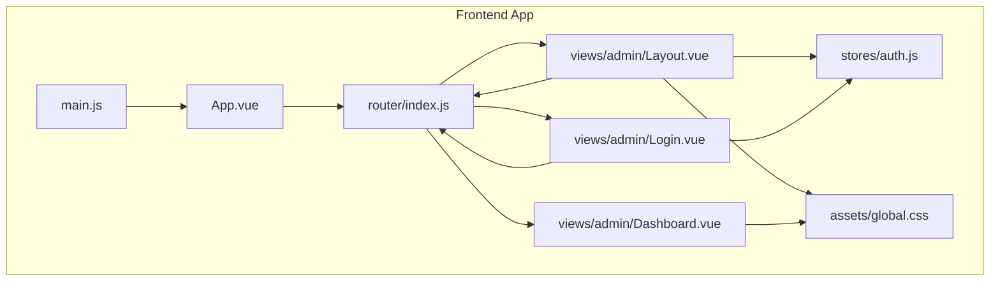
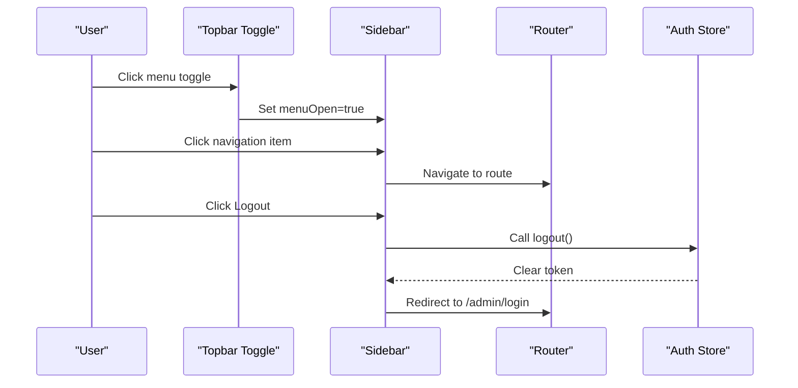
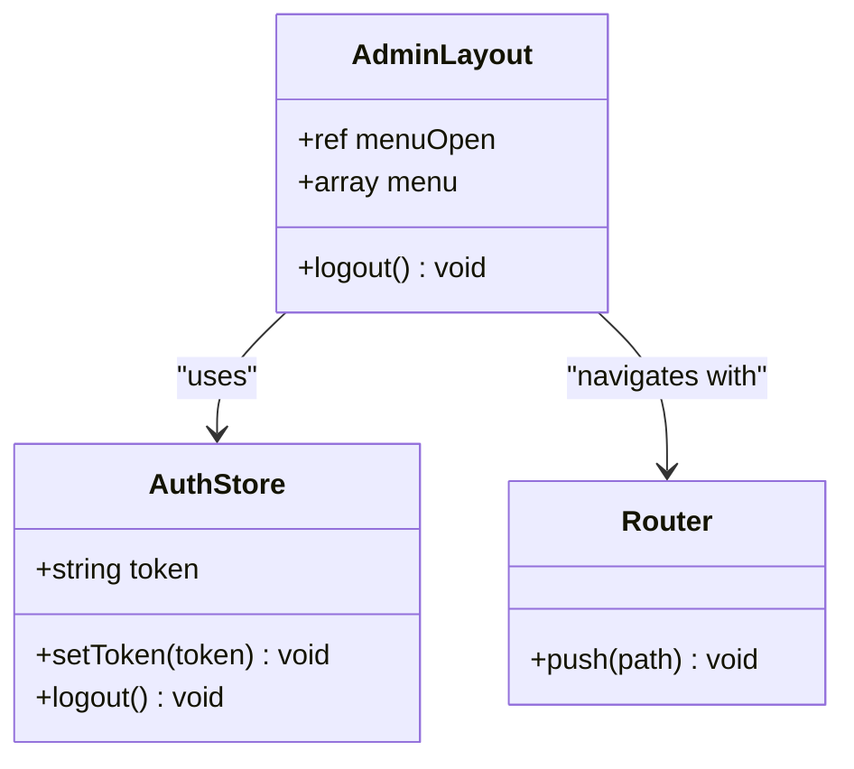
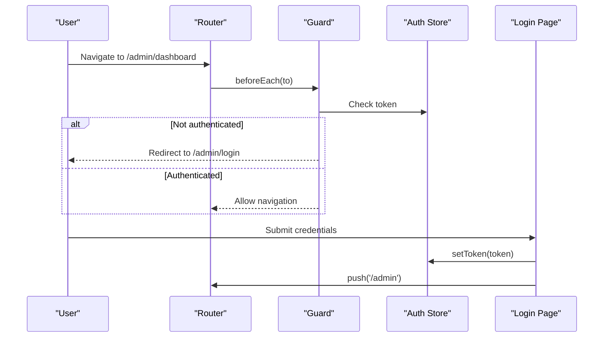
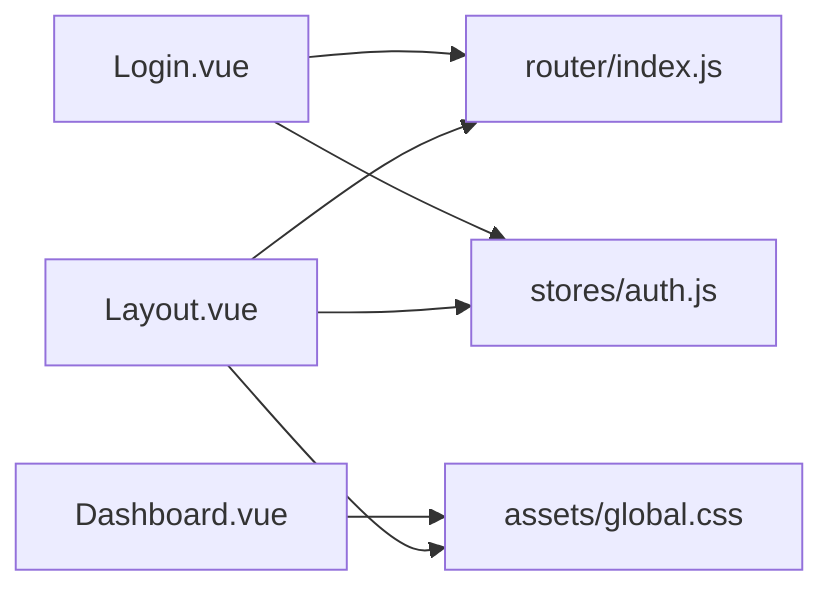

# Admin Layout and Navigation

<cite>
**Referenced Files in This Document**
- [Layout.vue](file://blog-frontend/src/views/admin/Layout.vue)
- [index.js](file://blog-frontend/src/router/index.js)
- [auth.js](file://blog-frontend/src/stores/auth.js)
- [global.css](file://blog-frontend/src/assets/global.css)
- [Dashboard.vue](file://blog-frontend/src/views/admin/Dashboard.vue)
- [Login.vue](file://blog-frontend/src/views/admin/Login.vue)
- [App.vue](file://blog-frontend/src/App.vue)
- [main.js](file://blog-frontend/src/main.js)
- [admin.js](file://blog-frontend/src/api/admin.js)
</cite>

## Table of Contents
1. [Introduction](#introduction)
2. [Project Structure](#project-structure)
3. [Core Components](#core-components)
4. [Architecture Overview](#architecture-overview)
5. [Detailed Component Analysis](#detailed-component-analysis)
6. [Dependency Analysis](#dependency-analysis)
7. [Performance Considerations](#performance-considerations)
8. [Troubleshooting Guide](#troubleshooting-guide)
9. [Conclusion](#conclusion)

## Introduction
This document describes the admin layout component and navigation system used in the blog administration interface. It covers the responsive sidebar layout, mobile-friendly navigation toggle, dark theme implementation, component structure, menu state management, Vue 3 Composition API usage, router integration, authentication-driven navigation, and CSS styling patterns including glass-morphism effects, responsive breakpoints, and mobile-first design.

## Project Structure
The admin layout is part of a Vue 3 application using Pinia for state management and Vue Router for navigation. The admin area is protected by route guards and uses a shared layout component for consistent navigation and theming.

**Diagram sources**
- [main.js:1-9](file://blog-frontend/src/main.js#L1-L9)
- [App.vue:1-12](file://blog-frontend/src/App.vue#L1-L12)
- [index.js:1-74](file://blog-frontend/src/router/index.js#L1-L74)
- [auth.js:1-19](file://blog-frontend/src/stores/auth.js#L1-L19)
- [Layout.vue:1-164](file://blog-frontend/src/views/admin/Layout.vue#L1-L164)
- [Login.vue:1-83](file://blog-frontend/src/views/admin/Login.vue#L1-L83)
- [Dashboard.vue:1-73](file://blog-frontend/src/views/admin/Dashboard.vue#L1-L73)
- [global.css:1-76](file://blog-frontend/src/assets/global.css#L1-L76)

**Section sources**
- [main.js:1-9](file://blog-frontend/src/main.js#L1-L9)
- [App.vue:1-12](file://blog-frontend/src/App.vue#L1-L12)
- [index.js:1-74](file://blog-frontend/src/router/index.js#L1-L74)
- [auth.js:1-19](file://blog-frontend/src/stores/auth.js#L1-L19)
- [Layout.vue:1-164](file://blog-frontend/src/views/admin/Layout.vue#L1-L164)
- [Login.vue:1-83](file://blog-frontend/src/views/admin/Login.vue#L1-L83)
- [Dashboard.vue:1-73](file://blog-frontend/src/views/admin/Dashboard.vue#L1-L73)
- [global.css:1-76](file://blog-frontend/src/assets/global.css#L1-L76)

## Core Components
- Admin Layout: Provides the sidebar navigation, topbar, and content area with responsive behavior.
- Authentication Store: Manages the admin session token and logout actions.
- Router: Defines admin routes, nested children, and a route guard requiring authentication.
- Global Styles: Implements dark theme and glass-morphism styles used across admin pages.

Key responsibilities:
- Layout manages menu open/close state and renders navigation items.
- Router integrates with the authentication store to protect admin routes.
- Global styles provide consistent dark theme and glass effects.

**Section sources**
- [Layout.vue:28-48](file://blog-frontend/src/views/admin/Layout.vue#L28-L48)
- [auth.js:4-18](file://blog-frontend/src/stores/auth.js#L4-L18)
- [index.js:4-71](file://blog-frontend/src/router/index.js#L4-L71)
- [global.css:7-21](file://blog-frontend/src/assets/global.css#L7-L21)

## Architecture Overview
The admin layout composes a fixed sidebar and a main content area. On small screens, the sidebar slides in from the left behind a topbar toggle button. Navigation links are generated from a static menu definition and use Vue Router’s router-link. The layout integrates with the authentication store to support logout and redirects.

**Diagram sources**
- [Layout.vue:16-47](file://blog-frontend/src/views/admin/Layout.vue#L16-L47)
- [index.js:64-71](file://blog-frontend/src/router/index.js#L64-L71)
- [auth.js:12-15](file://blog-frontend/src/stores/auth.js#L12-L15)

## Detailed Component Analysis

### Admin Layout Component
Responsibilities:
- Render a fixed sidebar with navigation items and a logout link.
- Provide a topbar with a mobile-friendly menu toggle.
- Manage menu open/close state using reactive state.
- Integrate with Vue Router for navigation and with the authentication store for logout.
- Apply responsive styles for desktop and mobile.

Menu state management:
- Reactive boolean flag controls sidebar visibility.
- Toggle button sets the flag to open; close button sets it to closed.
- Navigation items automatically close the menu on click.

Navigation items:
- Static menu array defines the available admin pages.
- Uses router-link to navigate to each page.
- Active link highlighting is handled by router-link-active class.

Styling highlights:
- Glass-morphism sidebar and topbar using backdrop-filter and rgba backgrounds.
- Responsive breakpoint at 768px switches sidebar to slide-in mode and enables topbar.
- Smooth transitions for sidebar transform.

Accessibility considerations:
- Close button and toggle buttons are keyboard focusable and clickable.
- Navigation items are standard anchor elements styled appropriately.

**Section sources**
- [Layout.vue:1-26](file://blog-frontend/src/views/admin/Layout.vue#L1-L26)
- [Layout.vue:28-48](file://blog-frontend/src/views/admin/Layout.vue#L28-L48)
- [Layout.vue:50-163](file://blog-frontend/src/views/admin/Layout.vue#L50-L163)

#### Class Diagram: Layout Component

**Diagram sources**
- [Layout.vue:28-48](file://blog-frontend/src/views/admin/Layout.vue#L28-L48)
- [auth.js:4-18](file://blog-frontend/src/stores/auth.js#L4-L18)
- [index.js:59-71](file://blog-frontend/src/router/index.js#L59-L71)

### Router Integration and Authentication Guard
- Admin routes are nested under /admin with a parent layout component.
- Route guard checks the requiresAuth meta field and redirects unauthenticated users to /admin/login.
- After successful login, the app navigates to /admin.

Route structure:
- Parent route mounts the admin layout.
- Children include dashboard, articles, categories, outlines, and article edit pages.
- Redirects to dashboard when accessing the admin base path.

**Section sources**
- [index.js:4-56](file://blog-frontend/src/router/index.js#L4-L56)
- [index.js:64-71](file://blog-frontend/src/router/index.js#L64-L71)

#### Sequence Diagram: Navigation and Authentication Flow

**Diagram sources**
- [index.js:64-71](file://blog-frontend/src/router/index.js#L64-L71)
- [auth.js:7-10](file://blog-frontend/src/stores/auth.js#L7-L10)
- [Login.vue:32-41](file://blog-frontend/src/views/admin/Login.vue#L32-L41)

### Dark Theme and Glass-Morphism Styling
- Dark theme body background and text colors provide contrast for glass surfaces.
- Glass-morphism classes (.glass-card) apply backdrop-filter blur, semi-transparent backgrounds, and subtle borders.
- Sidebar and topbar use rgba backgrounds with blur to achieve the glass effect.
- Responsive adjustments reduce border radius on smaller screens.

Responsive behavior:
- Sidebar translates off-screen on small screens and slides in when opened.
- Topbar becomes visible on small screens and includes the toggle button.
- Content area margins adjust to accommodate the sidebar on larger screens.

**Section sources**
- [global.css:7-21](file://blog-frontend/src/assets/global.css#L7-L21)
- [Layout.vue:50-163](file://blog-frontend/src/views/admin/Layout.vue#L50-L163)
- [global.css:71-75](file://blog-frontend/src/assets/global.css#L71-L75)

### Mobile-First Design Strategy
- Base styles assume mobile-first layout.
- Media query at 768px introduces desktop-specific behavior.
- Sidebar transforms horizontally on small screens; main content area adapts accordingly.
- Topbar toggle appears only on small screens.

Accessibility:
- Buttons use native button elements for better semantics.
- Navigation items are anchors styled as buttons.
- Focus states and hover effects improve usability.

**Section sources**
- [Layout.vue:142-162](file://blog-frontend/src/views/admin/Layout.vue#L142-L162)

### Component Styling Approach
- Scoped styles keep layout-specific styles encapsulated.
- Flexbox and grid are used for layout composition.
- CSS custom properties could be introduced for consistent spacing and colors.
- Transition durations and easing are defined for smooth animations.

**Section sources**
- [Layout.vue:50-163](file://blog-frontend/src/views/admin/Layout.vue#L50-L163)

## Dependency Analysis
The admin layout depends on:
- Vue Router for navigation and route guards.
- Pinia for authentication state management.
- Global CSS for dark theme and glass-morphism styles.

**Diagram sources**
- [Layout.vue:28-48](file://blog-frontend/src/views/admin/Layout.vue#L28-L48)
- [index.js:1-74](file://blog-frontend/src/router/index.js#L1-L74)
- [auth.js:1-19](file://blog-frontend/src/stores/auth.js#L1-L19)
- [global.css:1-76](file://blog-frontend/src/assets/global.css#L1-L76)
- [Login.vue:21-41](file://blog-frontend/src/views/admin/Login.vue#L21-L41)
- [Dashboard.vue:21-41](file://blog-frontend/src/views/admin/Dashboard.vue#L21-L41)

**Section sources**
- [Layout.vue:28-48](file://blog-frontend/src/views/admin/Layout.vue#L28-L48)
- [index.js:1-74](file://blog-frontend/src/router/index.js#L1-L74)
- [auth.js:1-19](file://blog-frontend/src/stores/auth.js#L1-L19)
- [global.css:1-76](file://blog-frontend/src/assets/global.css#L1-L76)
- [Login.vue:21-41](file://blog-frontend/src/views/admin/Login.vue#L21-L41)
- [Dashboard.vue:21-41](file://blog-frontend/src/views/admin/Dashboard.vue#L21-L41)

## Performance Considerations
- Keep the menu array small and static to minimize reactivity overhead.
- Use lazy-loaded components for child routes to reduce initial bundle size.
- Avoid heavy backdrop-filter blur on low-end devices; consider adjusting blur intensity.
- Debounce or throttle resize handlers if adding dynamic layout calculations.
- Prefer CSS transitions over JavaScript animations for smoother performance.

## Troubleshooting Guide
Common issues and resolutions:
- Sidebar does not open on mobile:
  - Verify media query breakpoint and transform classes are applied.
  - Ensure the menuOpen reactive state toggles correctly on button click.
- Navigation items do not highlight:
  - Confirm router-link-active class is present on active routes.
  - Check that the menu array paths match the route paths.
- Logout does not redirect:
  - Ensure the auth store clears the token and router pushes to /admin/login.
  - Verify the route guard redirects unauthenticated users to /admin/login.
- Glass effect looks too intense:
  - Adjust rgba alpha values and backdrop-filter blur in the sidebar and topbar styles.
- Topbar toggle not visible:
  - Confirm the media query applies at 768px and the toggle button is inside the topbar.

**Section sources**
- [Layout.vue:16-47](file://blog-frontend/src/views/admin/Layout.vue#L16-L47)
- [index.js:64-71](file://blog-frontend/src/router/index.js#L64-L71)
- [auth.js:12-15](file://blog-frontend/src/stores/auth.js#L12-L15)
- [Layout.vue:142-162](file://blog-frontend/src/views/admin/Layout.vue#L142-L162)

## Conclusion
The admin layout component implements a modern, responsive, and accessible navigation system with a dark theme and glass-morphism styling. It leverages Vue 3 Composition API for reactive state, integrates tightly with Vue Router for navigation and authentication protection, and follows a mobile-first design strategy. The component structure, menu state management, and styling approach provide a solid foundation for the admin interface while maintaining performance and usability across devices.