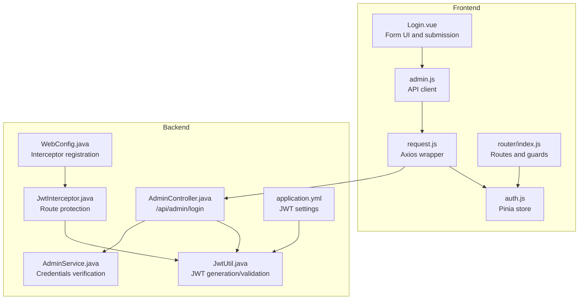
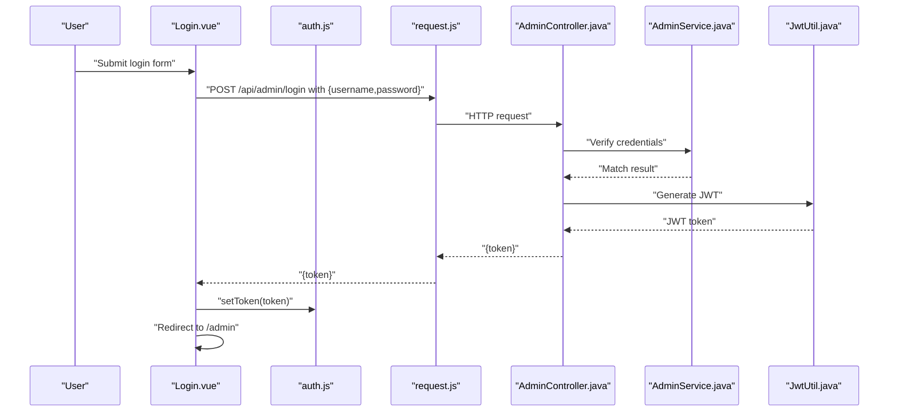
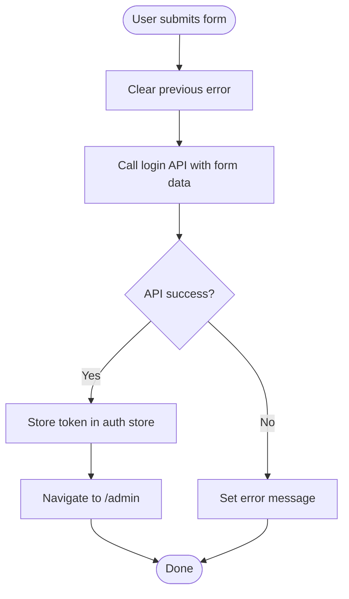
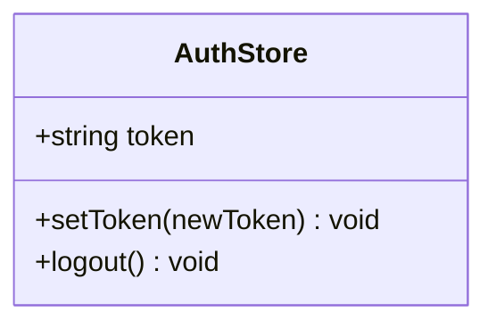
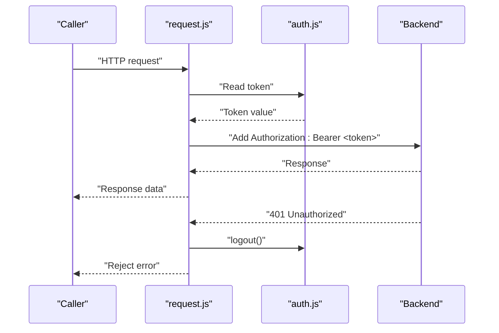
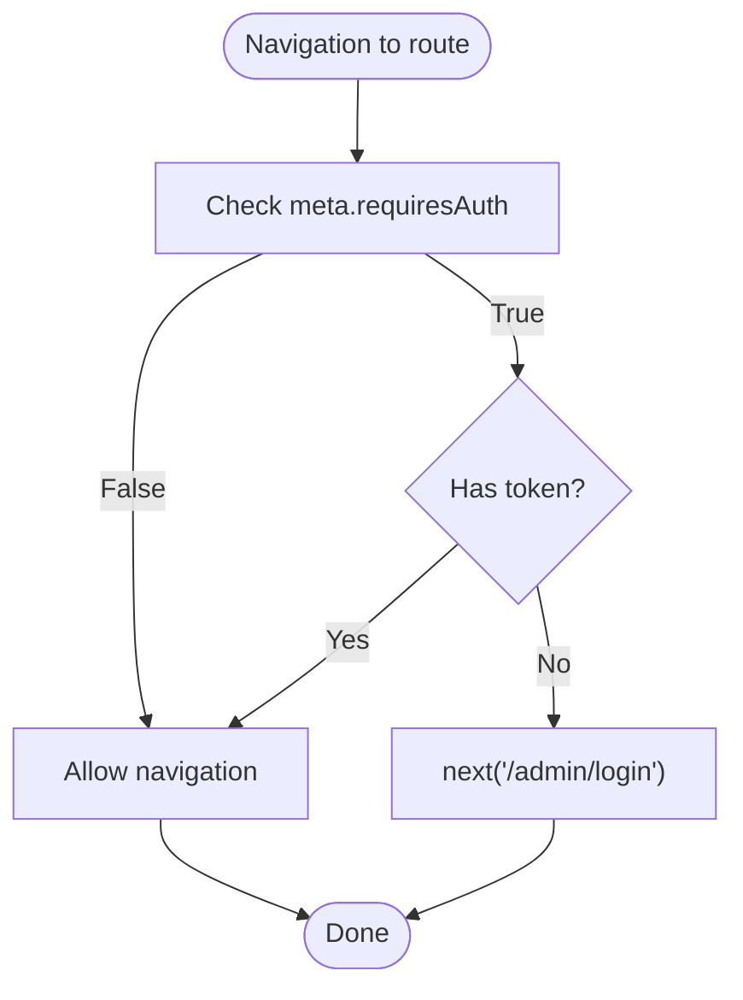
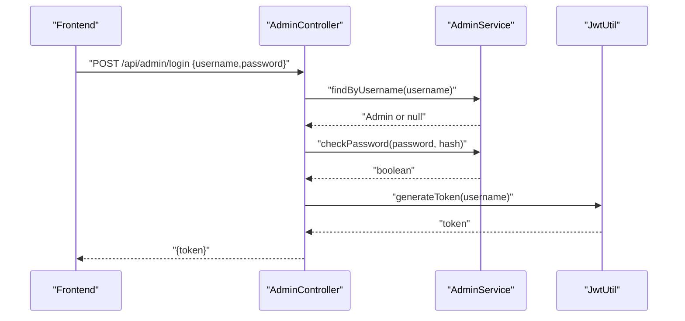
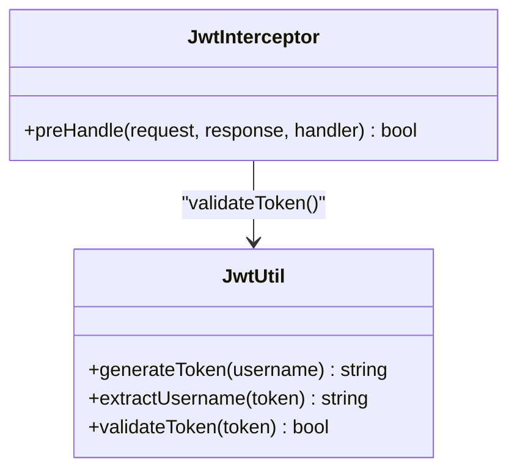
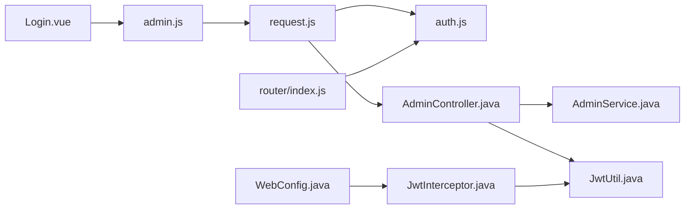

# Admin Login Interface

<cite>
**Referenced Files in This Document**
- [Login.vue](file://blog-frontend/src/views/admin/Login.vue)
- [auth.js](file://blog-frontend/src/stores/auth.js)
- [admin.js](file://blog-frontend/src/api/admin.js)
- [request.js](file://blog-frontend/src/api/request.js)
- [index.js](file://blog-frontend/src/router/index.js)
- [AdminController.java](file://blog-backend/src/main/java/com/blog/controller/AdminController.java)
- [JwtUtil.java](file://blog-backend/src/main/java/com/blog/util/JwtUtil.java)
- [JwtInterceptor.java](file://blog-backend/src/main/java/com/blog/config/JwtInterceptor.java)
- [WebConfig.java](file://blog-backend/src/main/java/com/blog/config/WebConfig.java)
- [AdminService.java](file://blog-backend/src/main/java/com/blog/service/AdminService.java)
- [application.yml](file://blog-backend/src/main/resources/application.yml)
</cite>

## Table of Contents
1. [Introduction](#introduction)
2. [Project Structure](#project-structure)
3. [Core Components](#core-components)
4. [Architecture Overview](#architecture-overview)
5. [Detailed Component Analysis](#detailed-component-analysis)
6. [Dependency Analysis](#dependency-analysis)
7. [Performance Considerations](#performance-considerations)
8. [Troubleshooting Guide](#troubleshooting-guide)
9. [Conclusion](#conclusion)

## Introduction
This document provides comprehensive documentation for the admin login component. It covers the authentication form interface, input validation, login submission workflow, integration with the authentication store, JWT token handling, and route protection mechanisms. It also explains form validation patterns, error handling, user feedback systems, security considerations, input sanitization, and integration with backend authentication API endpoints.

## Project Structure
The admin login feature spans the frontend Vue application and the Spring Boot backend:
- Frontend: Vue Single File Component (SFC) for the login page, Pinia store for authentication state, Axios wrapper for API requests, and Vue Router for navigation and route guards.
- Backend: REST controller for admin endpoints, JWT utility for token generation/validation, interceptor for protecting admin routes, and service for admin authentication logic.

**Diagram sources**
- [Login.vue:1-83](file://blog-frontend/src/views/admin/Login.vue#L1-L83)
- [auth.js:1-19](file://blog-frontend/src/stores/auth.js#L1-L19)
- [admin.js:1-12](file://blog-frontend/src/api/admin.js#L1-L12)
- [request.js:1-33](file://blog-frontend/src/api/request.js#L1-L33)
- [index.js:1-74](file://blog-frontend/src/router/index.js#L1-L74)
- [AdminController.java:1-121](file://blog-backend/src/main/java/com/blog/controller/AdminController.java#L1-L121)
- [JwtUtil.java:1-57](file://blog-backend/src/main/java/com/blog/util/JwtUtil.java#L1-L57)
- [JwtInterceptor.java:1-36](file://blog-backend/src/main/java/com/blog/config/JwtInterceptor.java#L1-L36)
- [WebConfig.java:1-39](file://blog-backend/src/main/java/com/blog/config/WebConfig.java#L1-L39)
- [AdminService.java:1-34](file://blog-backend/src/main/java/com/blog/service/AdminService.java#L1-L34)
- [application.yml:1-33](file://blog-backend/src/main/resources/application.yml#L1-L33)

**Section sources**
- [Login.vue:1-83](file://blog-frontend/src/views/admin/Login.vue#L1-L83)
- [index.js:1-74](file://blog-frontend/src/router/index.js#L1-L74)
- [admin.js:1-12](file://blog-frontend/src/api/admin.js#L1-L12)
- [request.js:1-33](file://blog-frontend/src/api/request.js#L1-L33)
- [auth.js:1-19](file://blog-frontend/src/stores/auth.js#L1-L19)
- [AdminController.java:1-121](file://blog-backend/src/main/java/com/blog/controller/AdminController.java#L1-L121)
- [JwtUtil.java:1-57](file://blog-backend/src/main/java/com/blog/util/JwtUtil.java#L1-L57)
- [JwtInterceptor.java:1-36](file://blog-backend/src/main/java/com/blog/config/JwtInterceptor.java#L1-L36)
- [WebConfig.java:1-39](file://blog-backend/src/main/java/com/blog/config/WebConfig.java#L1-L39)
- [AdminService.java:1-34](file://blog-backend/src/main/java/com/blog/service/AdminService.java#L1-L34)
- [application.yml:1-33](file://blog-backend/src/main/resources/application.yml#L1-L33)

## Core Components
- Admin Login View: Renders the login form, binds inputs to a reactive form object, handles submission via async API call, displays user feedback, and redirects on success.
- Authentication Store: Manages the JWT token lifecycle (set, persist, clear) using local storage.
- API Client: Encapsulates HTTP requests to backend endpoints with a base URL and shared interceptors.
- Router Guards: Protect admin routes by checking token presence and redirecting unauthenticated users to the login page.
- Backend Admin Controller: Validates credentials, generates JWT tokens, and returns them to the client.
- JWT Utility and Interceptor: Generate tokens on successful login and enforce token validation for protected admin endpoints.
- Admin Service: Handles credential verification against stored hashed passwords.

**Section sources**
- [Login.vue:21-42](file://blog-frontend/src/views/admin/Login.vue#L21-L42)
- [auth.js:4-18](file://blog-frontend/src/stores/auth.js#L4-L18)
- [admin.js:1-12](file://blog-frontend/src/api/admin.js#L1-L12)
- [request.js:4-33](file://blog-frontend/src/api/request.js#L4-L33)
- [index.js:64-71](file://blog-frontend/src/router/index.js#L64-L71)
- [AdminController.java:34-44](file://blog-backend/src/main/java/com/blog/controller/AdminController.java#L34-L44)
- [JwtUtil.java:25-47](file://blog-backend/src/main/java/com/blog/util/JwtUtil.java#L25-L47)
- [JwtInterceptor.java:16-34](file://blog-backend/src/main/java/com/blog/config/JwtInterceptor.java#L16-L34)
- [AdminService.java:16-22](file://blog-backend/src/main/java/com/blog/service/AdminService.java#L16-L22)

## Architecture Overview
The login flow integrates frontend and backend components to authenticate administrators and secure subsequent admin-area navigation.

**Diagram sources**
- [Login.vue:32-41](file://blog-frontend/src/views/admin/Login.vue#L32-L41)
- [request.js](file://blog-frontend/src/api/request.js#L3)
- [admin.js](file://blog-frontend/src/api/admin.js#L3)
- [AdminController.java:34-44](file://blog-backend/src/main/java/com/blog/controller/AdminController.java#L34-L44)
- [AdminService.java:16-22](file://blog-backend/src/main/java/com/blog/service/AdminService.java#L16-L22)
- [JwtUtil.java:25-34](file://blog-backend/src/main/java/com/blog/util/JwtUtil.java#L25-L34)

## Detailed Component Analysis

### Admin Login Form Interface
- Purpose: Present a minimal login form with username and password fields.
- Inputs:
  - Username: bound to a reactive field, marked as required.
  - Password: bound to a reactive field, masked input, marked as required.
- Submission:
  - Prevents default form submission.
  - Clears previous errors.
  - Calls the login API with current form data.
  - On success, stores the returned token and navigates to the admin area.
  - On failure, sets a user-visible error message.
- Styling: Scoped styles provide responsive layout and visual feedback.

**Diagram sources**
- [Login.vue:32-41](file://blog-frontend/src/views/admin/Login.vue#L32-L41)

**Section sources**
- [Login.vue:1-83](file://blog-frontend/src/views/admin/Login.vue#L1-L83)

### Authentication Store and Token Lifecycle
- State: Holds the current JWT token value.
- Persistence: Saves token to local storage upon setting and clears it on logout.
- Integration: Provides token to the Axios interceptor for Authorization headers.

**Diagram sources**
- [auth.js:4-18](file://blog-frontend/src/stores/auth.js#L4-L18)

**Section sources**
- [auth.js:1-19](file://blog-frontend/src/stores/auth.js#L1-L19)

### API Client and Request Interceptors
- Base URL: Requests target /api.
- Request Interceptor: Adds Authorization header with Bearer token when present.
- Response Interceptor: On 401 Unauthorized, clears token and redirects to login.

**Diagram sources**
- [request.js:9-30](file://blog-frontend/src/api/request.js#L9-L30)
- [auth.js:12-15](file://blog-frontend/src/stores/auth.js#L12-L15)

**Section sources**
- [request.js:1-33](file://blog-frontend/src/api/request.js#L1-L33)

### Route Protection and Navigation Guards
- Routes: Define admin area with nested children under /admin.
- Guard: beforeEach checks if a route requires authentication and whether a token exists.
- Behavior: Redirects to /admin/login if authentication is required but missing.

**Diagram sources**
- [index.js:64-71](file://blog-frontend/src/router/index.js#L64-L71)

**Section sources**
- [index.js:1-74](file://blog-frontend/src/router/index.js#L1-L74)

### Backend Authentication Endpoint
- Endpoint: POST /api/admin/login
- Validation:
  - Retrieves username and password from request body.
  - Loads admin by username and verifies password hash.
  - Returns 401 with a message on invalid credentials.
- Token Generation:
  - On success, generates a JWT using JwtUtil.
  - Returns the token in a JSON object.

**Diagram sources**
- [AdminController.java:34-44](file://blog-backend/src/main/java/com/blog/controller/AdminController.java#L34-L44)
- [AdminService.java:16-22](file://blog-backend/src/main/java/com/blog/service/AdminService.java#L16-L22)
- [JwtUtil.java:25-34](file://blog-backend/src/main/java/com/blog/util/JwtUtil.java#L25-L34)

**Section sources**
- [AdminController.java:34-44](file://blog-backend/src/main/java/com/blog/controller/AdminController.java#L34-L44)
- [AdminService.java:16-22](file://blog-backend/src/main/java/com/blog/service/AdminService.java#L16-L22)

### JWT Token Handling and Route Protection
- Token Generation: Uses HMAC-SHA with a configured secret and expiration.
- Token Validation: Parses and validates signatures; catches exceptions for invalid tokens.
- Interceptor Protection:
  - Applies to /api/admin/** excluding /api/admin/login.
  - Requires Authorization header starting with Bearer.
  - Rejects requests with missing or invalid tokens.

**Diagram sources**
- [JwtUtil.java:25-47](file://blog-backend/src/main/java/com/blog/util/JwtUtil.java#L25-L47)
- [JwtInterceptor.java:16-34](file://blog-backend/src/main/java/com/blog/config/JwtInterceptor.java#L16-L34)

**Section sources**
- [JwtUtil.java:1-57](file://blog-backend/src/main/java/com/blog/util/JwtUtil.java#L1-L57)
- [JwtInterceptor.java:1-36](file://blog-backend/src/main/java/com/blog/config/JwtInterceptor.java#L1-L36)
- [WebConfig.java:18-22](file://blog-backend/src/main/java/com/blog/config/WebConfig.java#L18-L22)

### Form Validation Patterns and Error Handling
- Frontend:
  - Reactive form model ensures immediate binding of user input.
  - Minimal validation via HTML required attributes on inputs.
  - Error message display for invalid credentials.
- Backend:
  - Explicit credential checks with early exit on mismatch.
  - Standardized 401 response for invalid credentials.
- User Feedback:
  - Immediate inline error message on login failure.
  - Automatic logout and redirect on 401 responses.

**Section sources**
- [Login.vue:29-41](file://blog-frontend/src/views/admin/Login.vue#L29-L41)
- [AdminController.java:39-41](file://blog-backend/src/main/java/com/blog/controller/AdminController.java#L39-L41)
- [request.js:20-30](file://blog-frontend/src/api/request.js#L20-L30)

### Security Considerations and Input Sanitization
- Transport Security: Backend enables CORS broadly; consider scoping origins in production.
- Credentials Handling:
  - Password comparison uses a secure hashing scheme.
  - Token secret and expiration are configurable.
- Token Storage:
  - Frontend stores token in local storage; consider HttpOnly cookies for higher security.
- CSRF Protection: Not implemented; consider adding anti-CSRF measures for forms.
- Input Validation: Basic HTML required attributes; consider server-side validation and sanitization for broader inputs.

**Section sources**
- [application.yml:27-30](file://blog-backend/src/main/resources/application.yml#L27-L30)
- [AdminService.java:20-22](file://blog-backend/src/main/java/com/blog/service/AdminService.java#L20-L22)
- [request.js:19-30](file://blog-frontend/src/api/request.js#L19-L30)
- [WebConfig.java:31-37](file://blog-backend/src/main/java/com/blog/config/WebConfig.java#L31-L37)

### Redirect Handling After Successful Login
- On successful login, the frontend:
  - Stores the token via the auth store.
  - Navigates to the admin area (/admin).
- Route protection ensures unauthenticated users are redirected to the login page when accessing admin routes.

**Section sources**
- [Login.vue:36-37](file://blog-frontend/src/views/admin/Login.vue#L36-L37)
- [index.js:64-71](file://blog-frontend/src/router/index.js#L64-L71)

## Dependency Analysis
The login component depends on the API client, authentication store, and router. The backend depends on the admin service and JWT utility, with the interceptor enforcing route protection.

**Diagram sources**
- [Login.vue:24-25](file://blog-frontend/src/views/admin/Login.vue#L24-L25)
- [admin.js:1-12](file://blog-frontend/src/api/admin.js#L1-L12)
- [request.js:1-33](file://blog-frontend/src/api/request.js#L1-L33)
- [auth.js:1-19](file://blog-frontend/src/stores/auth.js#L1-L19)
- [index.js:1-74](file://blog-frontend/src/router/index.js#L1-L74)
- [AdminController.java:1-121](file://blog-backend/src/main/java/com/blog/controller/AdminController.java#L1-L121)
- [AdminService.java:1-34](file://blog-backend/src/main/java/com/blog/service/AdminService.java#L1-L34)
- [JwtUtil.java:1-57](file://blog-backend/src/main/java/com/blog/util/JwtUtil.java#L1-L57)
- [JwtInterceptor.java:1-36](file://blog-backend/src/main/java/com/blog/config/JwtInterceptor.java#L1-L36)
- [WebConfig.java:1-39](file://blog-backend/src/main/java/com/blog/config/WebConfig.java#L1-L39)

**Section sources**
- [Login.vue:21-42](file://blog-frontend/src/views/admin/Login.vue#L21-L42)
- [admin.js:1-12](file://blog-frontend/src/api/admin.js#L1-L12)
- [request.js:1-33](file://blog-frontend/src/api/request.js#L1-L33)
- [auth.js:1-19](file://blog-frontend/src/stores/auth.js#L1-L19)
- [index.js:1-74](file://blog-frontend/src/router/index.js#L1-L74)
- [AdminController.java:1-121](file://blog-backend/src/main/java/com/blog/controller/AdminController.java#L1-L121)
- [AdminService.java:1-34](file://blog-backend/src/main/java/com/blog/service/AdminService.java#L1-L34)
- [JwtUtil.java:1-57](file://blog-backend/src/main/java/com/blog/util/JwtUtil.java#L1-L57)
- [JwtInterceptor.java:1-36](file://blog-backend/src/main/java/com/blog/config/JwtInterceptor.java#L1-L36)
- [WebConfig.java:1-39](file://blog-backend/src/main/java/com/blog/config/WebConfig.java#L1-L39)

## Performance Considerations
- Token Expiration: Configure appropriate expiration to balance security and UX.
- Request Timeout: Axios timeout is set; ensure it fits network conditions.
- Local Storage Access: Frequent reads/writes are lightweight but consider caching strategies for repeated access.
- Interceptor Overhead: Keep interceptors minimal to avoid slowing down requests.

## Troubleshooting Guide
- Login fails with invalid credentials:
  - Verify username/password match backend records.
  - Confirm the backend returns 401 with a message on mismatch.
- 401 Unauthorized after login:
  - Ensure the Authorization header is added by the request interceptor.
  - Check that the token is stored and readable by the auth store.
- Redirect loop to login:
  - Confirm the token is present and valid.
  - Verify the route guard logic and meta.requiresAuth flag.
- CORS or origin issues:
  - Review CORS configuration in the backend and ensure frontend base URL matches deployment.

**Section sources**
- [AdminController.java:39-41](file://blog-backend/src/main/java/com/blog/controller/AdminController.java#L39-L41)
- [request.js:19-30](file://blog-frontend/src/api/request.js#L19-L30)
- [index.js:64-71](file://blog-frontend/src/router/index.js#L64-L71)
- [WebConfig.java:31-37](file://blog-backend/src/main/java/com/blog/config/WebConfig.java#L31-L37)

## Conclusion
The admin login component provides a straightforward authentication flow integrating a Vue-based frontend with a Spring Boot backend. It leverages reactive forms, a centralized auth store, Axios interceptors, and route guards to manage authentication state and protect admin routes. The backend enforces secure credential verification and JWT-based session management. While functional, enhancements such as stricter CORS policies, improved token storage, and server-side input validation would further strengthen security and robustness.