# Admin Outlines Management

<cite>
**Referenced Files in This Document**
- [Outline.java](file://blog-backend/src/main/java/com/blog/entity/Outline.java)
- [OutlineService.java](file://blog-backend/src/main/java/com/blog/service/OutlineService.java)
- [OutlineMapper.java](file://blog-backend/src/main/java/com/blog/mapper/OutlineMapper.java)
- [AdminController.java](file://blog-backend/src/main/java/com/blog/controller/AdminController.java)
- [PublicController.java](file://blog-backend/src/main/java/com/blog/controller/PublicController.java)
- [schema.sql](file://blog-backend/src/main/resources/schema.sql)
- [Outlines.vue](file://blog-frontend/src/views/admin/Outlines.vue)
- [outline.js](file://blog-frontend/src/api/outline.js)
- [request.js](file://blog-frontend/src/api/request.js)
- [Category.java](file://blog-backend/src/main/java/com/blog/entity/Category.java)
- [Article.java](file://blog-backend/src/main/java/com/blog/entity/Article.java)
</cite>

## Table of Contents
1. [Introduction](#introduction)
2. [Project Structure](#project-structure)
3. [Core Components](#core-components)
4. [Architecture Overview](#architecture-overview)
5. [Detailed Component Analysis](#detailed-component-analysis)
6. [Dependency Analysis](#dependency-analysis)
7. [Performance Considerations](#performance-considerations)
8. [Troubleshooting Guide](#troubleshooting-guide)
9. [Conclusion](#conclusion)

## Introduction

The Admin Outlines Management component is a critical part of the blog organization system that enables administrators to manage content outlines hierarchically. This component provides a comprehensive interface for creating, editing, organizing, and maintaining outlines that serve as structural containers for articles within specific categories. The system implements a robust three-tier architecture with clear separation of concerns between presentation, business logic, and data persistence layers.

The component plays a pivotal role in content structuring by establishing the hierarchical relationship between categories and outlines, where each outline belongs to exactly one category and can contain multiple articles. This design ensures organized content delivery while maintaining referential integrity through database constraints.

## Project Structure

The outlines management system follows a clean, layered architecture with distinct responsibilities across the frontend Vue.js application and backend Spring Boot service:

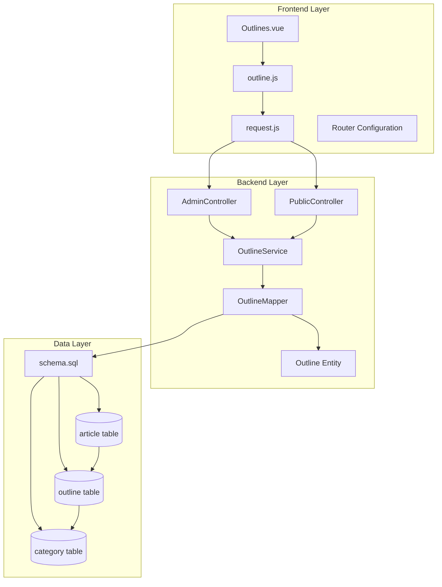

**Diagram sources**
- [Outlines.vue:1-172](file://blog-frontend/src/views/admin/Outlines.vue#L1-L172)
- [outline.js:1-10](file://blog-frontend/src/api/outline.js#L1-L10)
- [request.js:1-33](file://blog-frontend/src/api/request.js#L1-L33)
- [AdminController.java:1-121](file://blog-backend/src/main/java/com/blog/controller/AdminController.java#L1-L121)
- [PublicController.java:1-62](file://blog-backend/src/main/java/com/blog/controller/PublicController.java#L1-L62)
- [OutlineService.java:1-47](file://blog-backend/src/main/java/com/blog/service/OutlineService.java#L1-L47)
- [OutlineMapper.java:1-30](file://blog-backend/src/main/java/com/blog/mapper/OutlineMapper.java#L1-L30)
- [schema.sql:1-33](file://blog-backend/src/main/resources/schema.sql#L1-L33)

**Section sources**
- [Outlines.vue:1-172](file://blog-frontend/src/views/admin/Outlines.vue#L1-L172)
- [outline.js:1-10](file://blog-frontend/src/api/outline.js#L1-L10)
- [request.js:1-33](file://blog-frontend/src/api/request.js#L1-L33)
- [AdminController.java:1-121](file://blog-backend/src/main/java/com/blog/controller/AdminController.java#L1-L121)
- [PublicController.java:1-62](file://blog-backend/src/main/java/com/blog/controller/PublicController.java#L1-L62)
- [OutlineService.java:1-47](file://blog-backend/src/main/java/com/blog/service/OutlineService.java#L1-L47)
- [OutlineMapper.java:1-30](file://blog-backend/src/main/java/com/blog/mapper/OutlineMapper.java#L1-L30)
- [schema.sql:1-33](file://blog-backend/src/main/resources/schema.sql#L1-L33)

## Core Components

### Backend Data Model

The system implements a straightforward yet powerful data model centered around the Outline entity, which serves as the primary organizational unit for content:

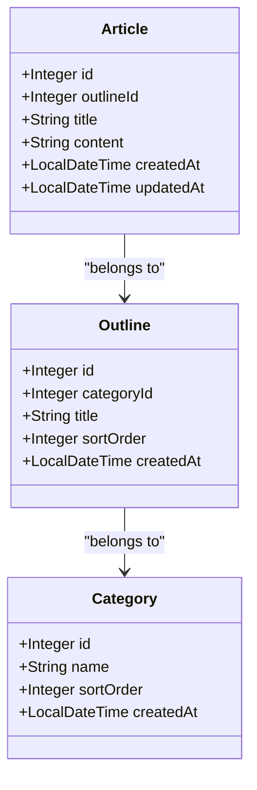

**Diagram sources**
- [Outline.java:1-14](file://blog-backend/src/main/java/com/blog/entity/Outline.java#L1-L14)
- [Category.java:1-13](file://blog-backend/src/main/java/com/blog/entity/Category.java#L1-L13)
- [Article.java:1-15](file://blog-backend/src/main/java/com/blog/entity/Article.java#L1-L15)

The Outline entity maintains four essential properties:
- **id**: Unique identifier for each outline
- **categoryId**: Foreign key linking to the parent category
- **title**: Display name for the outline
- **sortOrder**: Priority value determining outline ordering
- **createdAt**: Timestamp for record creation

### Frontend Interface Components

The Vue.js implementation provides a responsive, user-friendly interface with comprehensive form handling and real-time feedback mechanisms. The component utilizes reactive data binding to ensure immediate updates when users modify outline properties.

**Section sources**
- [Outline.java:1-14](file://blog-backend/src/main/java/com/blog/entity/Outline.java#L1-L14)
- [Outlines.vue:1-172](file://blog-frontend/src/views/admin/Outlines.vue#L1-L172)

## Architecture Overview

The outlines management system implements a RESTful architecture with clear separation between administrative operations and public content access:

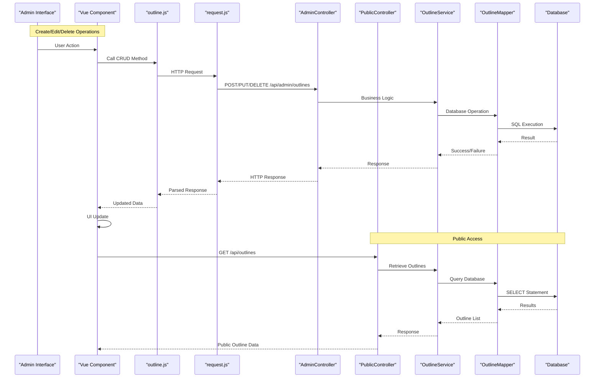

**Diagram sources**
- [Outlines.vue:49-98](file://blog-frontend/src/views/admin/Outlines.vue#L49-L98)
- [outline.js:1-10](file://blog-frontend/src/api/outline.js#L1-L10)
- [request.js:1-33](file://blog-frontend/src/api/request.js#L1-L33)
- [AdminController.java:81-99](file://blog-backend/src/main/java/com/blog/controller/AdminController.java#L81-L99)
- [PublicController.java:34-40](file://blog-backend/src/main/java/com/blog/controller/PublicController.java#L34-L40)
- [OutlineService.java:18-45](file://blog-backend/src/main/java/com/blog/service/OutlineService.java#L18-L45)
- [OutlineMapper.java:11-28](file://blog-backend/src/main/java/com/blog/mapper/OutlineMapper.java#L11-L28)

**Section sources**
- [AdminController.java:81-99](file://blog-backend/src/main/java/com/blog/controller/AdminController.java#L81-L99)
- [PublicController.java:34-40](file://blog-backend/src/main/java/com/blog/controller/PublicController.java#L34-L40)
- [OutlineService.java:18-45](file://blog-backend/src/main/java/com/blog/service/OutlineService.java#L18-L45)
- [OutlineMapper.java:11-28](file://blog-backend/src/main/java/com/blog/mapper/OutlineMapper.java#L11-L28)

## Detailed Component Analysis

### Outline List Interface

The admin interface presents outlines in a clean, card-based layout with essential information display and action controls:

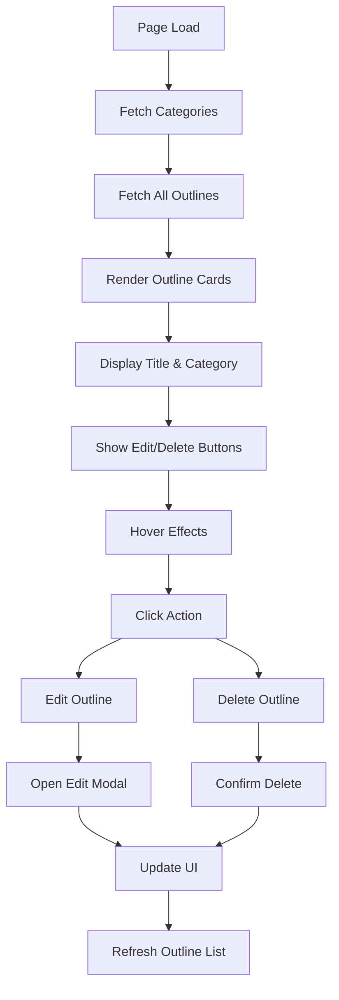

**Diagram sources**
- [Outlines.vue:8-19](file://blog-frontend/src/views/admin/Outlines.vue#L8-L19)
- [Outlines.vue:14-17](file://blog-frontend/src/views/admin/Outlines.vue#L14-L17)

The interface displays three key pieces of information for each outline:
- **Title**: Primary identifier for the outline
- **Category**: Human-readable category name via lookup
- **Sort Order**: Numeric priority indicator

**Section sources**
- [Outlines.vue:8-19](file://blog-frontend/src/views/admin/Outlines.vue#L8-L19)
- [Outlines.vue:70-73](file://blog-frontend/src/views/admin/Outlines.vue#L70-L73)

### Outline Creation and Editing Workflows

The form handling system provides comprehensive validation and user feedback:

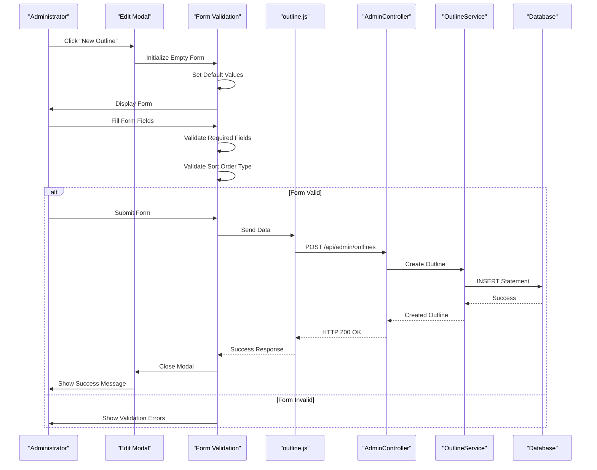

**Diagram sources**
- [Outlines.vue:75-92](file://blog-frontend/src/views/admin/Outlines.vue#L75-L92)
- [outline.js:5-9](file://blog-frontend/src/api/outline.js#L5-L9)
- [AdminController.java:82-86](file://blog-backend/src/main/java/com/blog/controller/AdminController.java#L82-L86)

The form validation enforces:
- **Title**: Required field ensuring outline identification
- **Category**: Required dropdown selection from available categories
- **Sort Order**: Numeric input with automatic type conversion

**Section sources**
- [Outlines.vue:24-42](file://blog-frontend/src/views/admin/Outlines.vue#L24-L42)
- [Outlines.vue:75-92](file://blog-frontend/src/views/admin/Outlines.vue#L75-L92)

### Hierarchical Outline Organization

The system maintains strict hierarchical relationships through foreign key constraints:

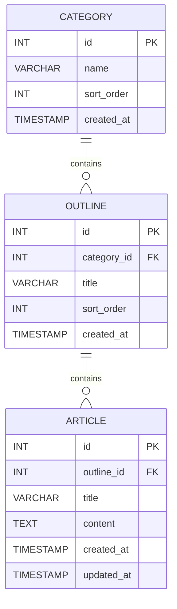

**Diagram sources**
- [schema.sql:1-33](file://blog-backend/src/main/resources/schema.sql#L1-L33)

The hierarchical structure ensures:
- **Category-Level Organization**: Categories group related outlines
- **Outline-Level Detail**: Individual outlines represent specific topics
- **Article-Level Content**: Articles provide detailed content within outlines

**Section sources**
- [schema.sql:8-15](file://blog-backend/src/main/resources/schema.sql#L8-L15)
- [Outline.java:9](file://blog-backend/src/main/java/com/blog/entity/Outline.java#L9)

### Category Relationship Integration

The component integrates seamlessly with the category management system:

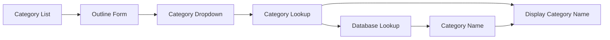

**Diagram sources**
- [Outlines.vue:31-33](file://blog-frontend/src/views/admin/Outlines.vue#L31-L33)
- [Outlines.vue:70-73](file://blog-frontend/src/views/admin/Outlines.vue#L70-L73)

The integration provides:
- **Real-time Category Lookup**: Immediate category name resolution
- **Dynamic Category Loading**: Categories loaded on component mount
- **Validation Integration**: Category selection required for outline creation

**Section sources**
- [Outlines.vue:51-64](file://blog-frontend/src/views/admin/Outlines.vue#L51-L64)
- [Outlines.vue:70-73](file://blog-frontend/src/views/admin/Outlines.vue#L70-L73)

### Outline Sorting Mechanisms

The system implements a dual-sorting mechanism for precise outline ordering:

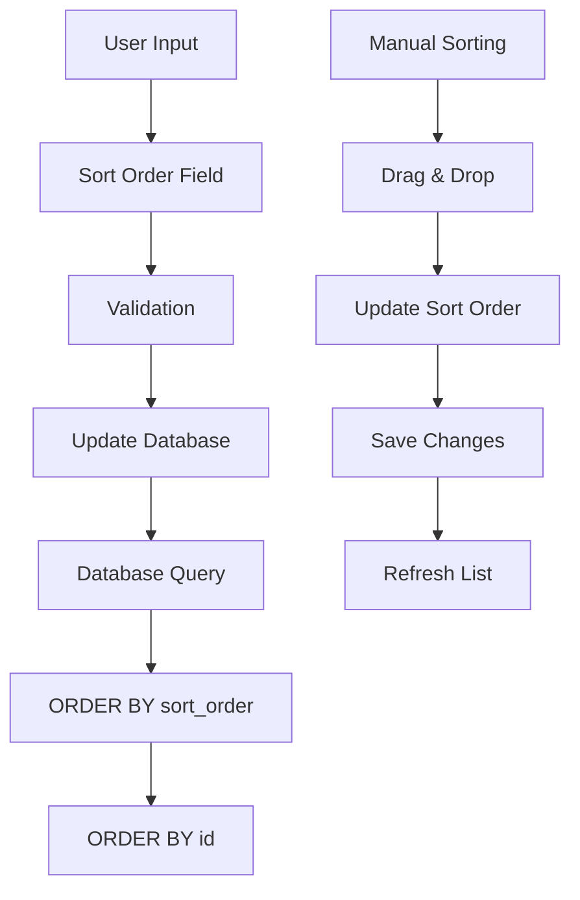

**Diagram sources**
- [OutlineMapper.java:11](file://blog-backend/src/main/java/com/blog/mapper/OutlineMapper.java#L11)
- [OutlineMapper.java:14](file://blog-backend/src/main/java/com/blog/mapper/OutlineMapper.java#L14)

The sorting mechanism ensures:
- **Primary Sort**: Numeric sort order priority
- **Secondary Sort**: ID-based tiebreaker for consistency
- **Category-Specific Ordering**: Separate ordering per category

**Section sources**
- [OutlineMapper.java:11-15](file://blog-backend/src/main/java/com/blog/mapper/OutlineMapper.java#L11-L15)

### Bulk Operations and Data Flow

The system supports efficient bulk operations through caching and batch processing:

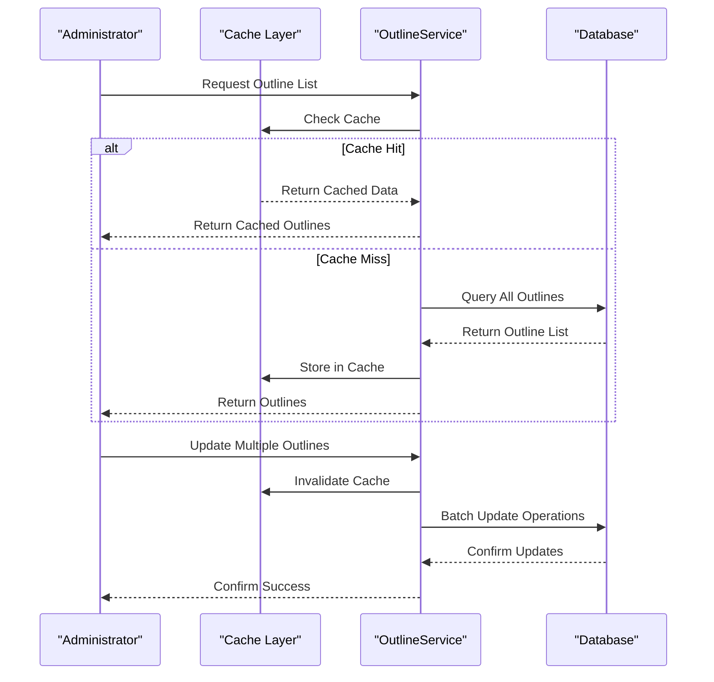

**Diagram sources**
- [OutlineService.java:18-26](file://blog-backend/src/main/java/com/blog/service/OutlineService.java#L18-L26)
- [OutlineService.java:32-45](file://blog-backend/src/main/java/com/blog/service/OutlineService.java#L32-L45)

**Section sources**
- [OutlineService.java:18-26](file://blog-backend/src/main/java/com/blog/service/OutlineService.java#L18-L26)
- [OutlineService.java:32-45](file://blog-backend/src/main/java/com/blog/service/OutlineService.java#L32-L45)

## Dependency Analysis

The outlines management component exhibits excellent modularity with clear dependency boundaries:

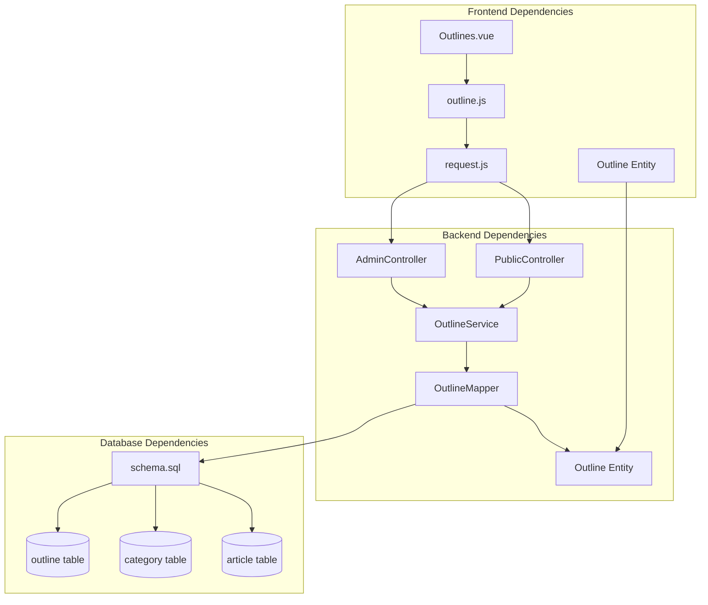

**Diagram sources**
- [Outlines.vue:50-52](file://blog-frontend/src/views/admin/Outlines.vue#L50-L52)
- [outline.js:1](file://blog-frontend/src/api/outline.js#L1)
- [request.js:1](file://blog-frontend/src/api/request.js#L1)
- [AdminController.java:27](file://blog-backend/src/main/java/com/blog/controller/AdminController.java#L27)
- [PublicController.java:25](file://blog-backend/src/main/java/com/blog/controller/PublicController.java#L25)
- [OutlineService.java:16](file://blog-backend/src/main/java/com/blog/service/OutlineService.java#L16)
- [OutlineMapper.java:4](file://blog-backend/src/main/java/com/blog/mapper/OutlineMapper.java#L4)
- [schema.sql:8](file://blog-backend/src/main/resources/schema.sql#L8)

The dependency analysis reveals:
- **Frontend-to-Backend Coupling**: Minimal coupling through well-defined APIs
- **Service Layer Cohesion**: High cohesion within the OutlineService
- **Database Integrity**: Strong referential integrity through foreign keys
- **Caching Strategy**: Effective cache invalidation for data consistency

**Section sources**
- [AdminController.java:27](file://blog-backend/src/main/java/com/blog/controller/AdminController.java#L27)
- [PublicController.java:25](file://blog-backend/src/main/java/com/blog/controller/PublicController.java#L25)
- [OutlineService.java:16](file://blog-backend/src/main/java/com/blog/service/OutlineService.java#L16)
- [OutlineMapper.java:4](file://blog-backend/src/main/java/com/blog/mapper/OutlineMapper.java#L4)

## Performance Considerations

The system implements several performance optimization strategies:

### Caching Strategy
The OutlineService employs a caching layer to minimize database queries:
- **Cache Key Strategy**: Separate caches for category-specific and global outline lists
- **Cache Invalidation**: Automatic cache clearing on create/update/delete operations
- **Cache Configuration**: Dedicated cache region for outline data

### Database Optimization
- **Indexing Strategy**: Natural indexing through primary keys and foreign keys
- **Query Optimization**: Efficient ORDER BY clauses using sort_order and id fields
- **Constraint Enforcement**: Database-level referential integrity prevents orphaned records

### Frontend Performance
- **Lazy Loading**: Categories loaded only when needed
- **Minimal Re-renders**: Reactive updates trigger only necessary DOM changes
- **Form Validation**: Client-side validation reduces server round trips

## Troubleshooting Guide

### Common Issues and Solutions

**Issue**: Outlines not displaying after category change
- **Cause**: Cache not invalidated after category update
- **Solution**: Verify cache eviction configuration in OutlineService

**Issue**: Duplicate outline titles within same category
- **Cause**: Missing unique constraint enforcement
- **Solution**: Consider adding unique constraint on (category_id, title)

**Issue**: Deleted outlines still visible in UI
- **Cause**: Frontend cache not refreshed after deletion
- **Solution**: Ensure load() function called after successful delete operations

**Issue**: Sort order not persisting
- **Cause**: Missing sort_order field in form submission
- **Solution**: Verify form binding for sort_order field

**Section sources**
- [OutlineService.java:32-45](file://blog-backend/src/main/java/com/blog/service/OutlineService.java#L32-L45)
- [Outlines.vue:84-98](file://blog-frontend/src/views/admin/Outlines.vue#L84-L98)

### Error Handling Patterns

The system implements comprehensive error handling across all layers:

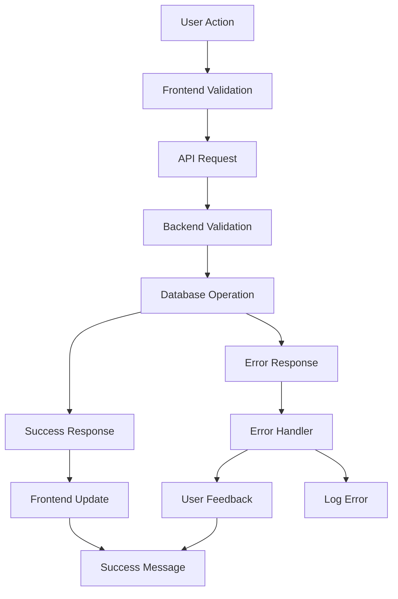

**Diagram sources**
- [request.js:20-30](file://blog-frontend/src/api/request.js#L20-L30)
- [AdminController.java:34-44](file://blog-backend/src/main/java/com/blog/controller/AdminController.java#L34-L44)

**Section sources**
- [request.js:20-30](file://blog-frontend/src/api/request.js#L20-L30)
- [AdminController.java:34-44](file://blog-backend/src/main/java/com/blog/controller/AdminController.java#L34-L44)

## Conclusion

The Admin Outlines Management component represents a well-architected solution for content organization within the blog system. Its design successfully balances simplicity with functionality, providing administrators with intuitive tools for managing content hierarchies while maintaining strong data integrity and performance characteristics.

Key strengths of the implementation include:
- **Clear Separation of Concerns**: Well-defined layers with specific responsibilities
- **Robust Data Model**: Properly normalized structure with referential integrity
- **User-Friendly Interface**: Intuitive form handling with comprehensive validation
- **Performance Optimization**: Strategic caching and efficient database queries
- **Extensible Design**: Modular architecture supporting future enhancements

The component's role in content structuring extends beyond simple CRUD operations, serving as the foundation for the entire blog organization system. By establishing clear relationships between categories, outlines, and articles, it enables sophisticated content management capabilities while maintaining system reliability and performance.

Future enhancements could include drag-and-drop reordering, bulk operations, and advanced filtering capabilities, all while preserving the current architectural strengths and design principles.