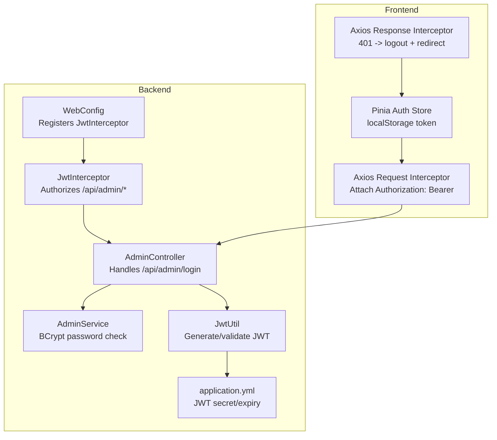
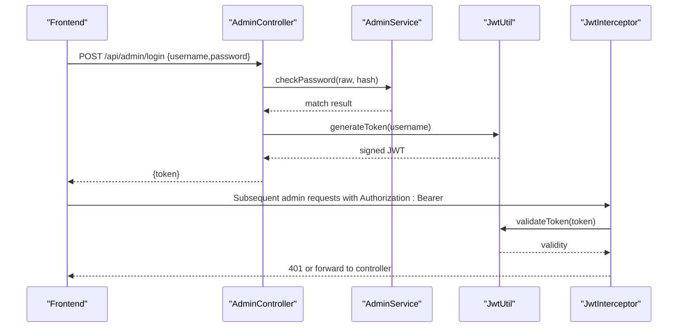
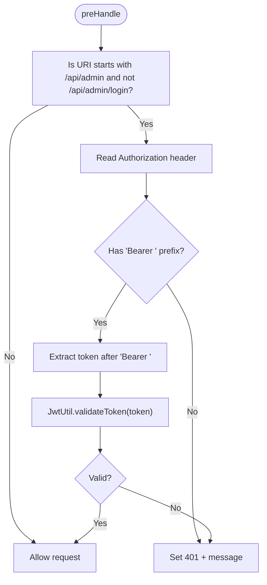
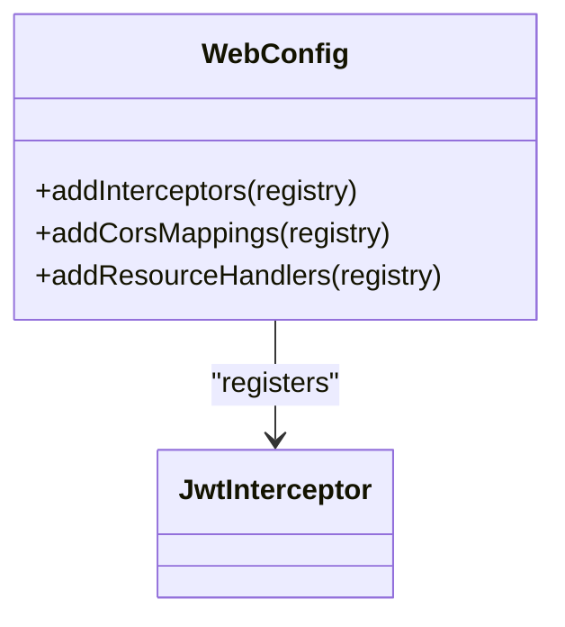
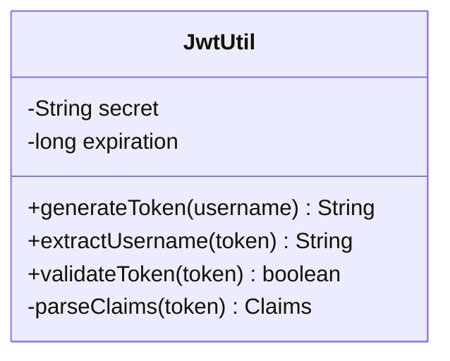
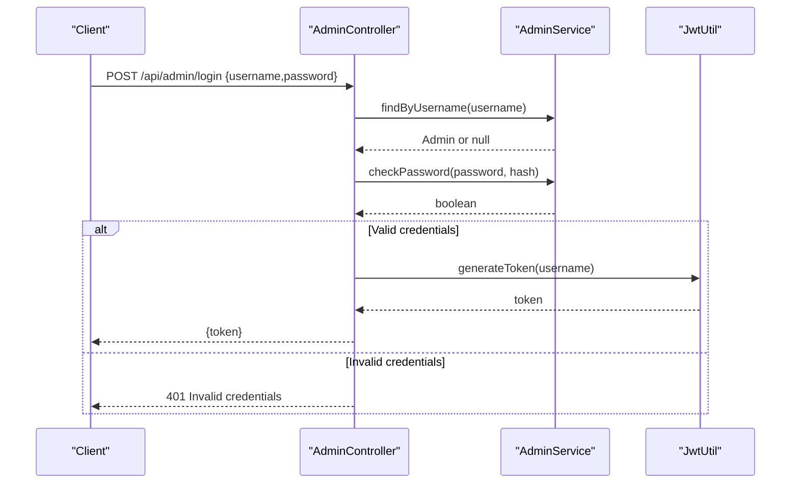
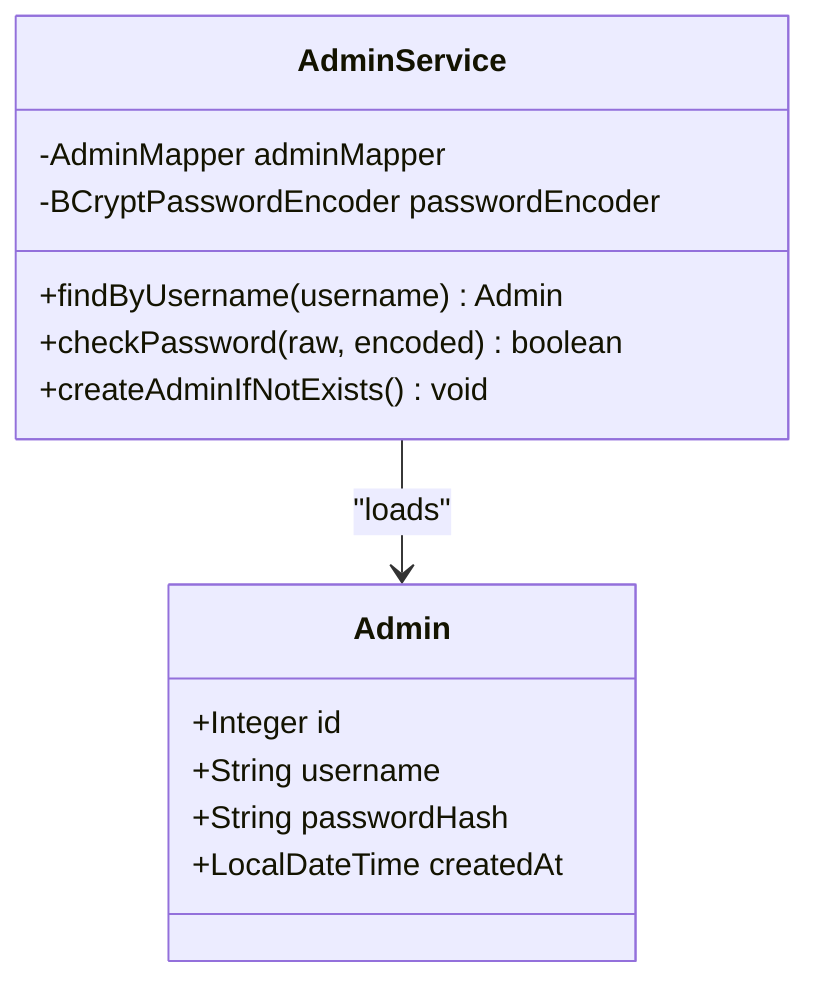
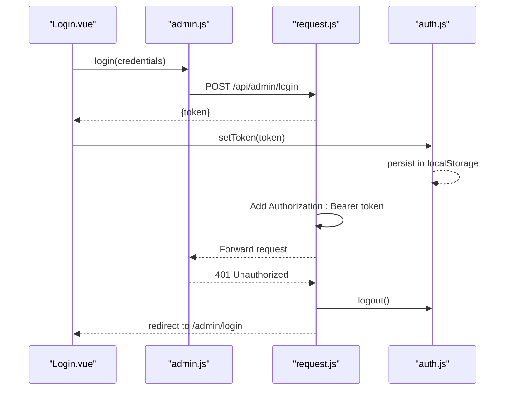
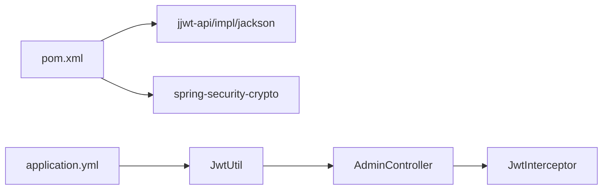

# Authentication & Security

<cite>
**Referenced Files in This Document**
- [JwtInterceptor.java](file://blog-backend/src/main/java/com/blog/config/JwtInterceptor.java)
- [WebConfig.java](file://blog-backend/src/main/java/com/blog/config/WebConfig.java)
- [JwtUtil.java](file://blog-backend/src/main/java/com/blog/util/JwtUtil.java)
- [AdminController.java](file://blog-backend/src/main/java/com/blog/controller/AdminController.java)
- [AdminService.java](file://blog-backend/src/main/java/com/blog/service/AdminService.java)
- [Admin.java](file://blog-backend/src/main/java/com/blog/entity/Admin.java)
- [application.yml](file://blog-backend/src/main/resources/application.yml)
- [pom.xml](file://blog-backend/pom.xml)
- [auth.js](file://blog-frontend/src/stores/auth.js)
- [request.js](file://blog-frontend/src/api/request.js)
- [admin.js](file://blog-frontend/src/api/admin.js)
- [Login.vue](file://blog-frontend/src/views/admin/Login.vue)
</cite>

## Table of Contents
1. [Introduction](#introduction)
2. [Project Structure](#project-structure)
3. [Core Components](#core-components)
4. [Architecture Overview](#architecture-overview)
5. [Detailed Component Analysis](#detailed-component-analysis)
6. [Dependency Analysis](#dependency-analysis)
7. [Performance Considerations](#performance-considerations)
8. [Security Best Practices](#security-best-practices)
9. [Troubleshooting Guide](#troubleshooting-guide)
10. [Conclusion](#conclusion)

## Introduction
This document explains the JWT-based authentication and security system implemented in the blog backend. It covers the complete authentication flow from login to token generation and validation, the JWT token structure and claims, password hashing and verification, session management, interceptor-based authorization, CORS configuration, and security headers. Practical examples demonstrate login requests and admin API usage, along with security best practices, token expiration handling, and protection against common vulnerabilities. Troubleshooting guidance and debugging techniques are included to help diagnose authentication issues.

## Project Structure
The authentication and security system spans backend Spring Boot components and frontend Axios interceptors:
- Backend: Interceptor-based authorization, JWT utilities, admin controller, and service layer with BCrypt password hashing.
- Frontend: Axios request/response interceptors that attach Authorization headers and handle 401 responses.

**Diagram sources**
- [WebConfig.java:18-22](file://blog-backend/src/main/java/com/blog/config/WebConfig.java#L18-L22)
- [JwtInterceptor.java:17-34](file://blog-backend/src/main/java/com/blog/config/JwtInterceptor.java#L17-L34)
- [AdminController.java:34-44](file://blog-backend/src/main/java/com/blog/controller/AdminController.java#L34-L44)
- [AdminService.java:20-22](file://blog-backend/src/main/java/com/blog/service/AdminService.java#L20-L22)
- [JwtUtil.java:25-47](file://blog-backend/src/main/java/com/blog/util/JwtUtil.java#L25-L47)
- [application.yml:27-32](file://blog-backend/src/main/resources/application.yml#L27-L32)
- [request.js:9-18](file://blog-frontend/src/api/request.js#L9-L18)
- [request.js:20-30](file://blog-frontend/src/api/request.js#L20-L30)
- [auth.js:5-15](file://blog-frontend/src/stores/auth.js#L5-L15)

**Section sources**
- [WebConfig.java:18-37](file://blog-backend/src/main/java/com/blog/config/WebConfig.java#L18-L37)
- [JwtInterceptor.java:17-34](file://blog-backend/src/main/java/com/blog/config/JwtInterceptor.java#L17-L34)
- [AdminController.java:34-44](file://blog-backend/src/main/java/com/blog/controller/AdminController.java#L34-L44)
- [AdminService.java:20-22](file://blog-backend/src/main/java/com/blog/service/AdminService.java#L20-L22)
- [JwtUtil.java:25-47](file://blog-backend/src/main/java/com/blog/util/JwtUtil.java#L25-L47)
- [application.yml:27-32](file://blog-backend/src/main/resources/application.yml#L27-L32)
- [request.js:9-18](file://blog-frontend/src/api/request.js#L9-L18)
- [request.js:20-30](file://blog-frontend/src/api/request.js#L20-L30)
- [auth.js:5-15](file://blog-frontend/src/stores/auth.js#L5-L15)

## Core Components
- JwtInterceptor: Enforces authorization for admin endpoints by validating Bearer tokens.
- WebConfig: Registers the interceptor and configures CORS globally.
- JwtUtil: Generates and validates JWT tokens using HMAC-SHA with a configurable secret and expiration.
- AdminController: Handles admin login, verifies credentials, and issues JWT tokens.
- AdminService: Uses BCrypt to verify passwords against stored hashes.
- Frontend Axios interceptors: Attach Authorization headers and handle 401 responses by clearing local storage and redirecting to login.

**Section sources**
- [JwtInterceptor.java:17-34](file://blog-backend/src/main/java/com/blog/config/JwtInterceptor.java#L17-L34)
- [WebConfig.java:18-37](file://blog-backend/src/main/java/com/blog/config/WebConfig.java#L18-L37)
- [JwtUtil.java:25-47](file://blog-backend/src/main/java/com/blog/util/JwtUtil.java#L25-L47)
- [AdminController.java:34-44](file://blog-backend/src/main/java/com/blog/controller/AdminController.java#L34-L44)
- [AdminService.java:20-22](file://blog-backend/src/main/java/com/blog/service/AdminService.java#L20-L22)
- [request.js:9-18](file://blog-frontend/src/api/request.js#L9-L18)
- [request.js:20-30](file://blog-frontend/src/api/request.js#L20-L30)

## Architecture Overview
The authentication flow integrates backend and frontend components:
- Login: Client submits credentials to /api/admin/login. Backend verifies with BCrypt and returns a signed JWT.
- Authorization: Frontend attaches Authorization: Bearer <token> to subsequent admin API calls.
- Interception: Backend enforces token validation for /api/admin/* except /api/admin/login.

**Diagram sources**
- [AdminController.java:34-44](file://blog-backend/src/main/java/com/blog/controller/AdminController.java#L34-L44)
- [AdminService.java:20-22](file://blog-backend/src/main/java/com/blog/service/AdminService.java#L20-L22)
- [JwtUtil.java:25-47](file://blog-backend/src/main/java/com/blog/util/JwtUtil.java#L25-L47)
- [JwtInterceptor.java:17-34](file://blog-backend/src/main/java/com/blog/config/JwtInterceptor.java#L17-L34)
- [request.js:9-18](file://blog-frontend/src/api/request.js#L9-L18)

## Detailed Component Analysis

### JwtInterceptor Implementation
Purpose:
- Protects admin endpoints under /api/admin/.
- Rejects requests without a proper Bearer token header.
- Validates token signature and expiration via JwtUtil.

Behavior:
- Skips validation for /api/admin/login.
- Requires Authorization header starting with "Bearer ".
- Extracts token and delegates validation to JwtUtil.
- Returns 401 with JSON message on failure.

**Diagram sources**
- [JwtInterceptor.java:17-34](file://blog-backend/src/main/java/com/blog/config/JwtInterceptor.java#L17-L34)
- [JwtUtil.java:40-47](file://blog-backend/src/main/java/com/blog/util/JwtUtil.java#L40-L47)

**Section sources**
- [JwtInterceptor.java:17-34](file://blog-backend/src/main/java/com/blog/config/JwtInterceptor.java#L17-L34)

### WebConfig: Interceptor Registration and CORS
- Registers JwtInterceptor for /api/admin/** and excludes /api/admin/login.
- Adds CORS allowing all origins, methods, headers, and a max age of 3600 seconds.

**Diagram sources**
- [WebConfig.java:18-37](file://blog-backend/src/main/java/com/blog/config/WebConfig.java#L18-L37)
- [JwtInterceptor.java:17-34](file://blog-backend/src/main/java/com/blog/config/JwtInterceptor.java#L17-L34)

**Section sources**
- [WebConfig.java:18-37](file://blog-backend/src/main/java/com/blog/config/WebConfig.java#L18-L37)

### JwtUtil: Token Generation and Validation
- Secret and expiration configured via application.yml.
- Generates tokens with subject (username), issued-at, and expiration.
- Validates tokens by parsing and verifying the signature.

**Diagram sources**
- [JwtUtil.java:25-47](file://blog-backend/src/main/java/com/blog/util/JwtUtil.java#L25-L47)
- [application.yml:27-32](file://blog-backend/src/main/resources/application.yml#L27-L32)

**Section sources**
- [JwtUtil.java:25-47](file://blog-backend/src/main/java/com/blog/util/JwtUtil.java#L25-L47)
- [application.yml:27-32](file://blog-backend/src/main/resources/application.yml#L27-L32)

### AdminController: Login and Admin APIs
- POST /api/admin/login: Verifies credentials and issues JWT.
- Other endpoints (/categories, /outlines, /articles): Protected by JwtInterceptor.

**Diagram sources**
- [AdminController.java:34-44](file://blog-backend/src/main/java/com/blog/controller/AdminController.java#L34-L44)
- [AdminService.java:16-22](file://blog-backend/src/main/java/com/blog/service/AdminService.java#L16-L22)
- [JwtUtil.java:25-34](file://blog-backend/src/main/java/com/blog/util/JwtUtil.java#L25-L34)

**Section sources**
- [AdminController.java:34-44](file://blog-backend/src/main/java/com/blog/controller/AdminController.java#L34-L44)
- [AdminService.java:16-22](file://blog-backend/src/main/java/com/blog/service/AdminService.java#L16-L22)

### AdminService: Password Hashing and Verification
- Uses BCryptPasswordEncoder to verify raw passwords against stored hashes.
- Provides convenience methods for finding admins and creating default admin if missing.

**Diagram sources**
- [AdminService.java:16-32](file://blog-backend/src/main/java/com/blog/service/AdminService.java#L16-L32)
- [Admin.java:8-12](file://blog-backend/src/main/java/com/blog/entity/Admin.java#L8-L12)

**Section sources**
- [AdminService.java:16-32](file://blog-backend/src/main/java/com/blog/service/AdminService.java#L16-L32)
- [Admin.java:8-12](file://blog-backend/src/main/java/com/blog/entity/Admin.java#L8-L12)

### Frontend Authentication Flow
- Axios request interceptor attaches Authorization: Bearer <token> when present.
- Axios response interceptor handles 401 by clearing token and redirecting to login.
- Pinia auth store persists token in localStorage.

**Diagram sources**
- [Login.vue:32-41](file://blog-frontend/src/views/admin/Login.vue#L32-L41)
- [admin.js:3](file://blog-frontend/src/api/admin.js#L3)
- [request.js:9-18](file://blog-frontend/src/api/request.js#L9-L18)
- [request.js:20-30](file://blog-frontend/src/api/request.js#L20-L30)
- [auth.js:5-15](file://blog-frontend/src/stores/auth.js#L5-L15)

**Section sources**
- [Login.vue:32-41](file://blog-frontend/src/views/admin/Login.vue#L32-L41)
- [admin.js:3](file://blog-frontend/src/api/admin.js#L3)
- [request.js:9-18](file://blog-frontend/src/api/request.js#L9-L18)
- [request.js:20-30](file://blog-frontend/src/api/request.js#L20-L30)
- [auth.js:5-15](file://blog-frontend/src/stores/auth.js#L5-L15)

## Dependency Analysis
External libraries and configuration:
- jjwt-api/impl/jackson for JWT signing and parsing.
- spring-security-crypto for BCrypt password encoding.
- application.yml defines JWT secret and expiration.

**Diagram sources**
- [pom.xml:58-79](file://blog-backend/pom.xml#L58-L79)
- [application.yml:27-32](file://blog-backend/src/main/resources/application.yml#L27-L32)
- [JwtUtil.java:25-47](file://blog-backend/src/main/java/com/blog/util/JwtUtil.java#L25-L47)
- [AdminController.java:34-44](file://blog-backend/src/main/java/com/blog/controller/AdminController.java#L34-L44)
- [JwtInterceptor.java:17-34](file://blog-backend/src/main/java/com/blog/config/JwtInterceptor.java#L17-L34)

**Section sources**
- [pom.xml:58-79](file://blog-backend/pom.xml#L58-L79)
- [application.yml:27-32](file://blog-backend/src/main/resources/application.yml#L27-L32)

## Performance Considerations
- Token validation occurs per request; keep JWT payload minimal to reduce overhead.
- Consider short-lived tokens with refresh token mechanisms for enhanced security.
- Avoid excessive logging of sensitive token data.
- Ensure CORS allows only trusted origins in production.

[No sources needed since this section provides general guidance]

## Security Best Practices
- Use HTTPS in production to protect tokens in transit.
- Rotate JWT secrets regularly and store them securely (environment variables).
- Limit token lifetime and implement refresh token rotation.
- Sanitize and validate all inputs; enforce strong password policies.
- Avoid exposing sensitive endpoints; restrict CORS origins.
- Monitor and log authentication failures without leaking sensitive details.

[No sources needed since this section provides general guidance]

## Troubleshooting Guide
Common issues and resolutions:
- 401 Unauthorized on admin endpoints:
  - Verify Authorization header format: Bearer <token>.
  - Confirm token is not expired and was generated with the same secret.
  - Ensure interceptor is registered for /api/admin/** and excluded for /api/admin/login.
- Invalid credentials during login:
  - Confirm username exists and password matches BCrypt hash.
  - Check application.yml for correct JWT secret and expiration values.
- CORS errors:
  - Review allowed origins, methods, and headers in WebConfig.
- Frontend token handling:
  - Ensure Authorization header is attached by request interceptor.
  - On 401, verify auth store clears token and redirects to login.

Debugging techniques:
- Log token validation outcomes in JwtInterceptor and JwtUtil.
- Inspect request headers on backend to confirm Authorization presence.
- Check localStorage for token persistence in the browser.
- Temporarily enable verbose logging for interceptors and controllers.

**Section sources**
- [JwtInterceptor.java:17-34](file://blog-backend/src/main/java/com/blog/config/JwtInterceptor.java#L17-L34)
- [JwtUtil.java:40-47](file://blog-backend/src/main/java/com/blog/util/JwtUtil.java#L40-L47)
- [WebConfig.java:31-37](file://blog-backend/src/main/java/com/blog/config/WebConfig.java#L31-L37)
- [request.js:9-18](file://blog-frontend/src/api/request.js#L9-L18)
- [request.js:20-30](file://blog-frontend/src/api/request.js#L20-L30)
- [auth.js:5-15](file://blog-frontend/src/stores/auth.js#L5-L15)

## Conclusion
The system implements a straightforward JWT-based authentication flow with interceptor-driven authorization, BCrypt password verification, and frontend Axios interceptors for seamless token handling. By configuring secure secrets, enforcing strict CORS, and following best practices for token lifecycle and transport security, the system provides a solid foundation for admin access control. Use the troubleshooting steps and debugging techniques to diagnose and resolve common authentication issues efficiently.