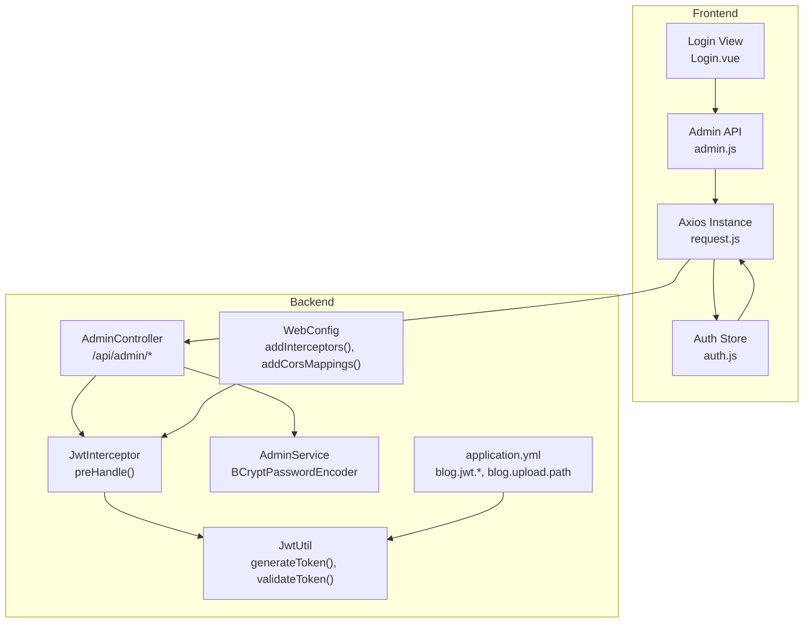
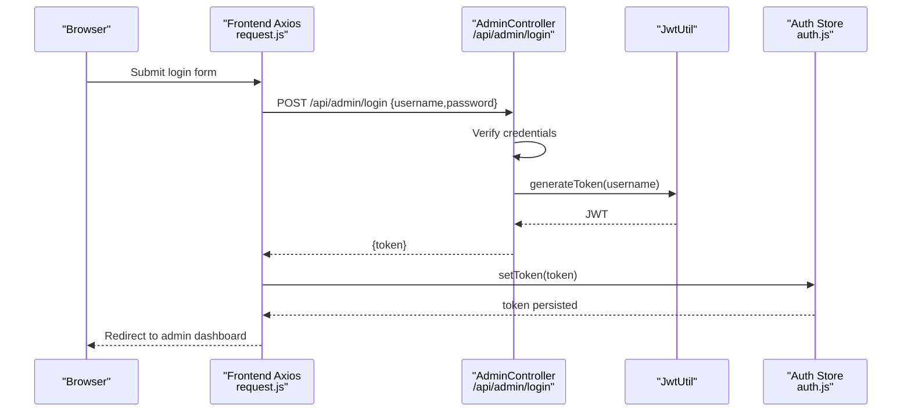
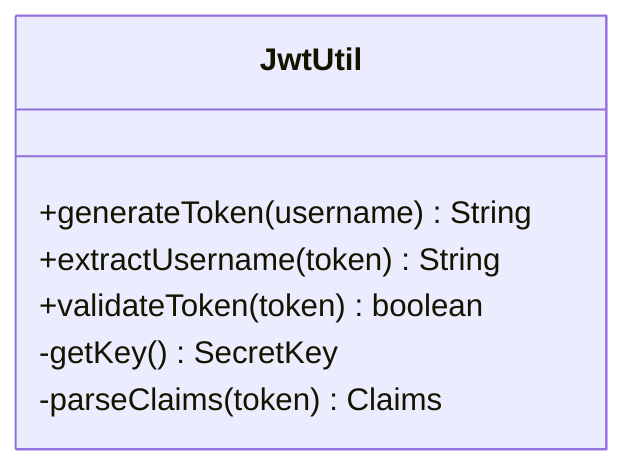
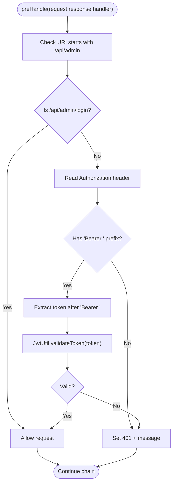
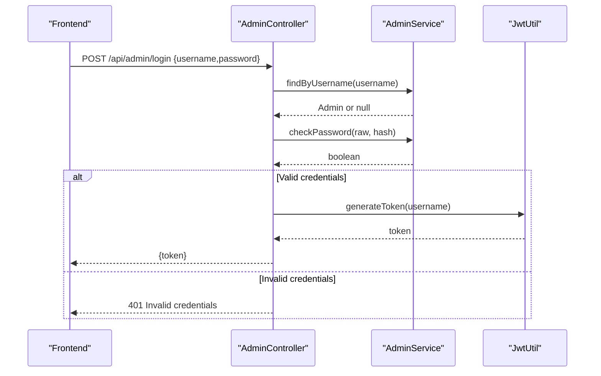
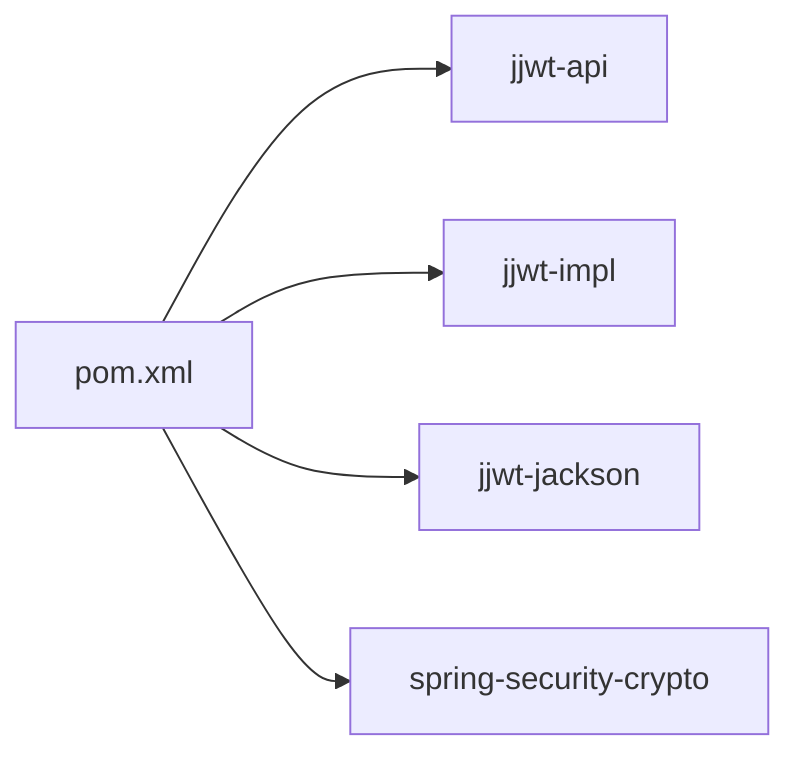

# Authentication and Security Configuration

<cite>
**Referenced Files in This Document**
- [JwtUtil.java](file://blog-backend/src/main/java/com/blog/util/JwtUtil.java)
- [JwtInterceptor.java](file://blog-backend/src/main/java/com/blog/config/JwtInterceptor.java)
- [WebConfig.java](file://blog-backend/src/main/java/com/blog/config/WebConfig.java)
- [AdminController.java](file://blog-backend/src/main/java/com/blog/controller/AdminController.java)
- [AdminService.java](file://blog-backend/src/main/java/com/blog/service/AdminService.java)
- [application.yml](file://blog-backend/src/main/resources/application.yml)
- [request.js](file://blog-frontend/src/api/request.js)
- [auth.js](file://blog-frontend/src/stores/auth.js)
- [Login.vue](file://blog-frontend/src/views/admin/Login.vue)
- [admin.js](file://blog-frontend/src/api/admin.js)
- [pom.xml](file://blog-backend/pom.xml)
</cite>

## Table of Contents
1. [Introduction](#introduction)
2. [Project Structure](#project-structure)
3. [Core Components](#core-components)
4. [Architecture Overview](#architecture-overview)
5. [Detailed Component Analysis](#detailed-component-analysis)
6. [Dependency Analysis](#dependency-analysis)
7. [Performance Considerations](#performance-considerations)
8. [Troubleshooting Guide](#troubleshooting-guide)
9. [Conclusion](#conclusion)

## Introduction
This document explains the JWT-based authentication and security system implemented in the blog backend. It covers token generation and validation, the interceptor-based authorization mechanism, CORS configuration, and the end-to-end authentication flow from login to protected resource access. It also highlights security best practices, common considerations, and potential vulnerabilities.

## Project Structure
The authentication and security system spans backend utilities, interceptors, configuration, controllers, and frontend integration:
- Backend utilities: JWT token generation and validation
- Interceptor: Request authorization enforcement
- Web configuration: Interceptor registration, CORS, and resource handlers
- Controllers: Login endpoint and protected admin endpoints
- Services: Password hashing using BCrypt
- Frontend: Token storage, Authorization header injection, and 401 handling

**Diagram sources**
- [request.js:1-33](file://blog-frontend/src/api/request.js#L1-L33)
- [auth.js:1-19](file://blog-frontend/src/stores/auth.js#L1-L19)
- [Login.vue:1-83](file://blog-frontend/src/views/admin/Login.vue#L1-L83)
- [admin.js:1-12](file://blog-frontend/src/api/admin.js#L1-L12)
- [AdminController.java:1-121](file://blog-backend/src/main/java/com/blog/controller/AdminController.java#L1-L121)
- [JwtInterceptor.java:1-36](file://blog-backend/src/main/java/com/blog/config/JwtInterceptor.java#L1-L36)
- [WebConfig.java:1-39](file://blog-backend/src/main/java/com/blog/config/WebConfig.java#L1-L39)
- [JwtUtil.java:1-57](file://blog-backend/src/main/java/com/blog/util/JwtUtil.java#L1-L57)
- [AdminService.java:1-34](file://blog-backend/src/main/java/com/blog/service/AdminService.java#L1-L34)
- [application.yml:1-33](file://blog-backend/src/main/resources/application.yml#L1-L33)

**Section sources**
- [JwtUtil.java:1-57](file://blog-backend/src/main/java/com/blog/util/JwtUtil.java#L1-L57)
- [JwtInterceptor.java:1-36](file://blog-backend/src/main/java/com/blog/config/JwtInterceptor.java#L1-L36)
- [WebConfig.java:1-39](file://blog-backend/src/main/java/com/blog/config/WebConfig.java#L1-L39)
- [AdminController.java:1-121](file://blog-backend/src/main/java/com/blog/controller/AdminController.java#L1-L121)
- [AdminService.java:1-34](file://blog-backend/src/main/java/com/blog/service/AdminService.java#L1-L34)
- [application.yml:1-33](file://blog-backend/src/main/resources/application.yml#L1-L33)
- [request.js:1-33](file://blog-frontend/src/api/request.js#L1-L33)
- [auth.js:1-19](file://blog-frontend/src/stores/auth.js#L1-L19)
- [Login.vue:1-83](file://blog-frontend/src/views/admin/Login.vue#L1-L83)
- [admin.js:1-12](file://blog-frontend/src/api/admin.js#L1-L12)

## Core Components
- JwtUtil: Generates signed JWT tokens with HMAC using a configurable secret and expiration, and validates tokens by parsing claims.
- JwtInterceptor: Enforces authorization for admin endpoints by checking the Authorization header and validating the JWT.
- WebConfig: Registers the JWT interceptor for admin routes, excludes login, and configures CORS and static resource serving.
- AdminController: Provides the login endpoint that authenticates administrators and returns a JWT upon successful credentials verification.
- AdminService: Uses BCrypt to verify passwords against stored hashes.
- Frontend request module: Automatically attaches Authorization headers for admin requests and handles 401 responses by clearing the token and redirecting to login.

**Section sources**
- [JwtUtil.java:25-47](file://blog-backend/src/main/java/com/blog/util/JwtUtil.java#L25-L47)
- [JwtInterceptor.java:16-34](file://blog-backend/src/main/java/com/blog/config/JwtInterceptor.java#L16-L34)
- [WebConfig.java:17-37](file://blog-backend/src/main/java/com/blog/config/WebConfig.java#L17-L37)
- [AdminController.java:34-44](file://blog-backend/src/main/java/com/blog/controller/AdminController.java#L34-L44)
- [AdminService.java:20-22](file://blog-backend/src/main/java/com/blog/service/AdminService.java#L20-L22)
- [request.js:9-30](file://blog-frontend/src/api/request.js#L9-L30)

## Architecture Overview
The authentication flow integrates frontend token management with backend authorization and validation:

**Diagram sources**
- [Login.vue:32-41](file://blog-frontend/src/views/admin/Login.vue#L32-L41)
- [admin.js:3](file://blog-frontend/src/api/admin.js#L3)
- [AdminController.java:34-44](file://blog-backend/src/main/java/com/blog/controller/AdminController.java#L34-L44)
- [JwtUtil.java:25-34](file://blog-backend/src/main/java/com/blog/util/JwtUtil.java#L25-L34)
- [auth.js:7-10](file://blog-frontend/src/stores/auth.js#L7-L10)

## Detailed Component Analysis

### JWT Utilities: JwtUtil
Responsibilities:
- Load secret and expiration from configuration
- Generate signed JWT with subject (username), issued-at, and expiration
- Extract username from token
- Validate token by attempting to parse claims

Key behaviors:
- Secret key derived via HMAC-SHA from UTF-8 bytes of configured secret
- Expiration is added as a future timestamp
- Validation catches JWT exceptions and returns false for invalid tokens

**Diagram sources**
- [JwtUtil.java:12-56](file://blog-backend/src/main/java/com/blog/util/JwtUtil.java#L12-L56)

**Section sources**
- [JwtUtil.java:15-19](file://blog-backend/src/main/java/com/blog/util/JwtUtil.java#L15-L19)
- [JwtUtil.java:25-34](file://blog-backend/src/main/java/com/blog/util/JwtUtil.java#L25-L34)
- [JwtUtil.java:36-47](file://blog-backend/src/main/java/com/blog/util/JwtUtil.java#L36-L47)
- [JwtUtil.java:49-55](file://blog-backend/src/main/java/com/blog/util/JwtUtil.java#L49-L55)

### Interceptor: JwtInterceptor
Responsibilities:
- Intercept admin requests under /api/admin/**
- Require Authorization header with Bearer scheme
- Validate JWT via JwtUtil
- Return 401 Unauthorized on missing/invalid token

Behavioral flow:

**Diagram sources**
- [JwtInterceptor.java:16-34](file://blog-backend/src/main/java/com/blog/config/JwtInterceptor.java#L16-L34)
- [JwtUtil.java:40-47](file://blog-backend/src/main/java/com/blog/util/JwtUtil.java#L40-L47)

**Section sources**
- [JwtInterceptor.java:16-34](file://blog-backend/src/main/java/com/blog/config/JwtInterceptor.java#L16-L34)

### Web Configuration: WebConfig
Responsibilities:
- Register JwtInterceptor for /api/admin/** excluding /api/admin/login
- Configure CORS allowing all origins/methods/headers with a 1-hour max age
- Serve uploaded files from configured upload path

**Section sources**
- [WebConfig.java:17-22](file://blog-backend/src/main/java/com/blog/config/WebConfig.java#L17-L22)
- [WebConfig.java:31-37](file://blog-backend/src/main/java/com/blog/config/WebConfig.java#L31-L37)
- [application.yml:31-32](file://blog-backend/src/main/resources/application.yml#L31-L32)

### Admin Controller: Login Flow
Responsibilities:
- Accept credentials via POST /api/admin/login
- Authenticate administrator using AdminService
- Generate JWT via JwtUtil and return token

**Diagram sources**
- [AdminController.java:34-44](file://blog-backend/src/main/java/com/blog/controller/AdminController.java#L34-L44)
- [AdminService.java:16-22](file://blog-backend/src/main/java/com/blog/service/AdminService.java#L16-L22)
- [JwtUtil.java:25-34](file://blog-backend/src/main/java/com/blog/util/JwtUtil.java#L25-L34)

**Section sources**
- [AdminController.java:34-44](file://blog-backend/src/main/java/com/blog/controller/AdminController.java#L34-L44)
- [AdminService.java:16-22](file://blog-backend/src/main/java/com/blog/service/AdminService.java#L16-L22)

### Password Hashing: AdminService
Responsibilities:
- Find administrator by username
- Verify password against stored hash using BCrypt
- Initialize default admin account with hashed password if not exists

**Section sources**
- [AdminService.java:14-22](file://blog-backend/src/main/java/com/blog/service/AdminService.java#L14-L22)
- [AdminService.java:24-32](file://blog-backend/src/main/java/com/blog/service/AdminService.java#L24-L32)

### Frontend Authorization Header Injection
Responsibilities:
- Attach Authorization: Bearer <token> to outgoing admin requests
- On 401 response, clear token and redirect to login

**Section sources**
- [request.js:9-18](file://blog-frontend/src/api/request.js#L9-L18)
- [request.js:20-30](file://blog-frontend/src/api/request.js#L20-L30)
- [auth.js:5-15](file://blog-frontend/src/stores/auth.js#L5-L15)

### Configuration Properties
Responsibilities:
- Define JWT secret and expiration
- Define upload path for static resources

**Section sources**
- [application.yml:27-32](file://blog-backend/src/main/resources/application.yml#L27-L32)

## Dependency Analysis
External libraries and their roles:
- jjwt-api, jjwt-impl, jjwt-jackson: JWT creation and parsing
- spring-security-crypto: BCryptPasswordEncoder for password hashing
- Spring MVC: HandlerInterceptor and WebMvcConfigurer for request interception and CORS

**Diagram sources**
- [pom.xml:58-74](file://blog-backend/pom.xml#L58-L74)

**Section sources**
- [pom.xml:58-74](file://blog-backend/pom.xml#L58-L74)

## Performance Considerations
- Token validation occurs per request; keep secret and expiration reasonably sized to minimize overhead.
- Consider caching validated tokens server-side (e.g., Redis) for high-throughput scenarios to reduce CPU usage from signature verification.
- Use short-lived access tokens with a refresh mechanism if needed; current implementation does not include a dedicated refresh endpoint.

## Troubleshooting Guide
Common issues and resolutions:
- 401 Unauthorized on admin endpoints:
  - Ensure Authorization header is present and prefixed with "Bearer ".
  - Verify token was generated with the same secret and has not expired.
- Invalid token errors:
  - Confirm the token is unmodified and not tampered with.
  - Check that the configured JWT secret matches the one used during signing.
- CORS failures:
  - Confirm that the frontend base URL and backend CORS configuration align.
  - Review allowed origins, methods, and headers in WebConfig.
- Upload failures:
  - Verify upload path exists and is writable.
  - Ensure multipart/form-data headers are correctly set when uploading.

**Section sources**
- [JwtInterceptor.java:20-31](file://blog-backend/src/main/java/com/blog/config/JwtInterceptor.java#L20-L31)
- [WebConfig.java:31-37](file://blog-backend/src/main/java/com/blog/config/WebConfig.java#L31-L37)
- [application.yml:31-32](file://blog-backend/src/main/resources/application.yml#L31-L32)

## Conclusion
The system implements a straightforward JWT-based authentication flow with a dedicated interceptor enforcing authorization for admin endpoints. Tokens are generated with a configurable secret and expiration, validated on each protected request, and managed client-side via an Authorization header. While functional, enhancements such as token refresh, secure cookie storage, CSRF protection, and rate limiting would strengthen the security posture for production use.