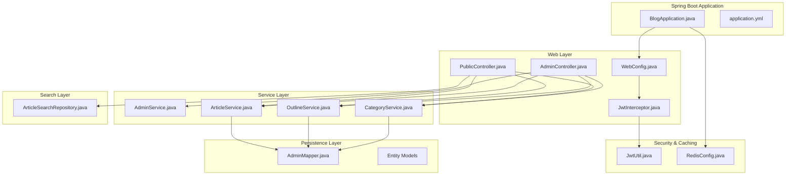
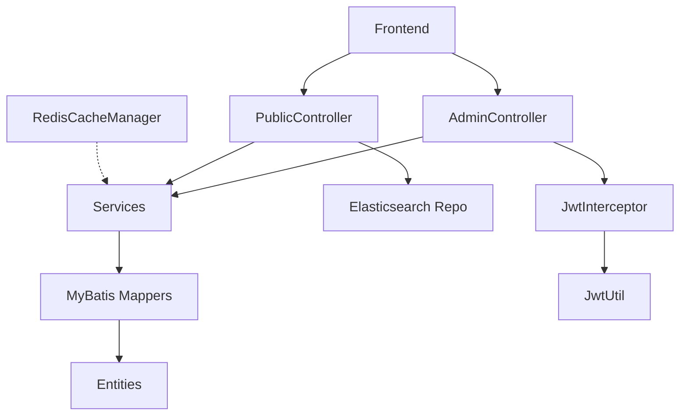
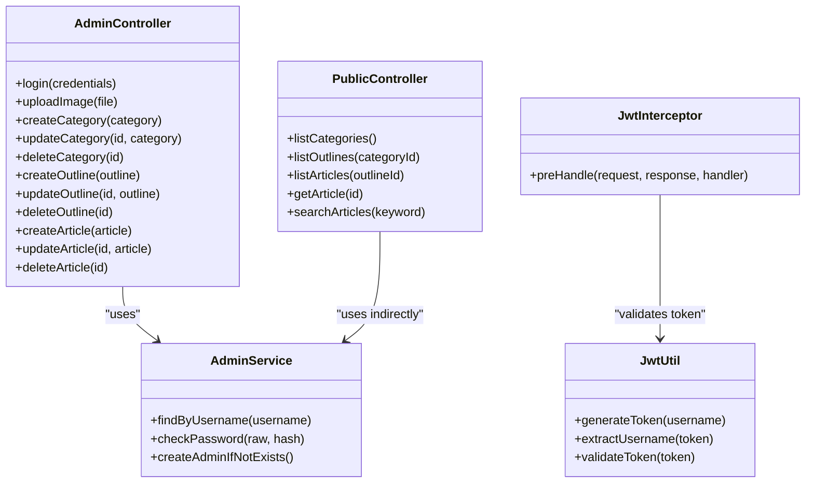
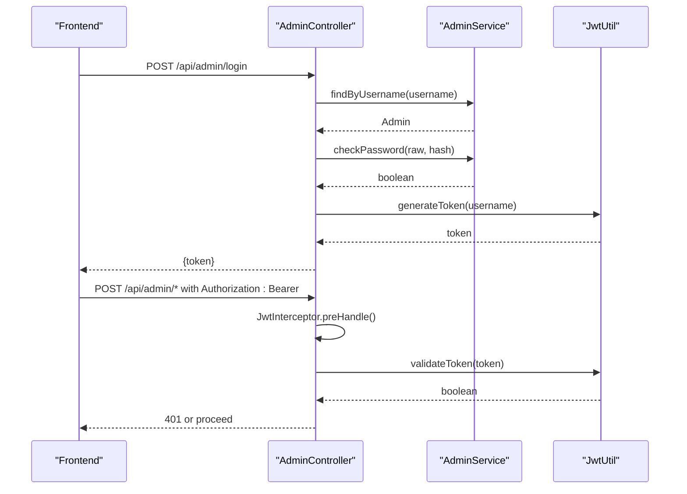
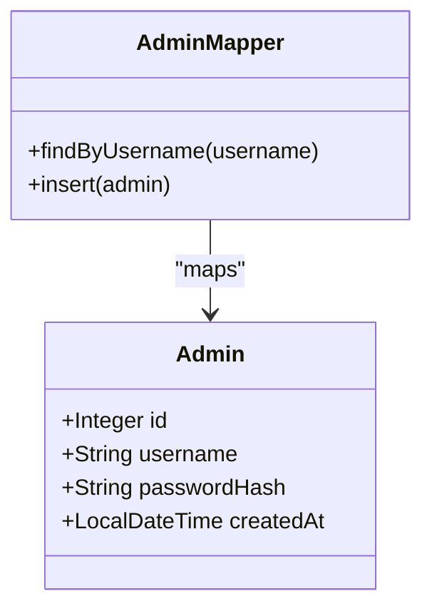
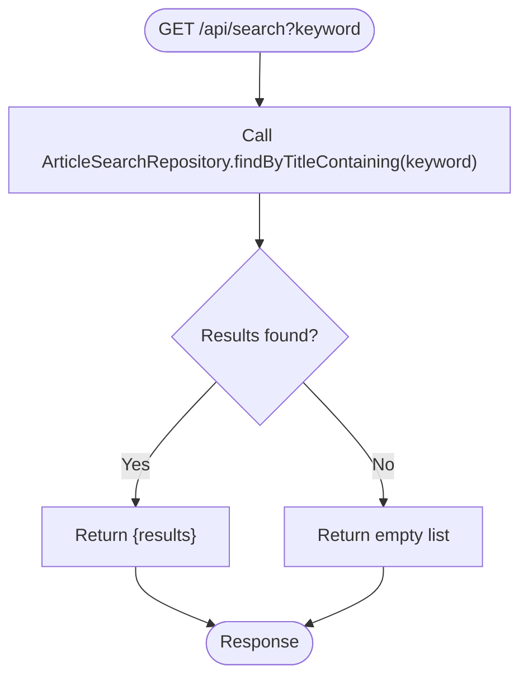
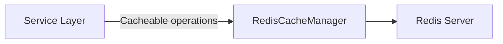
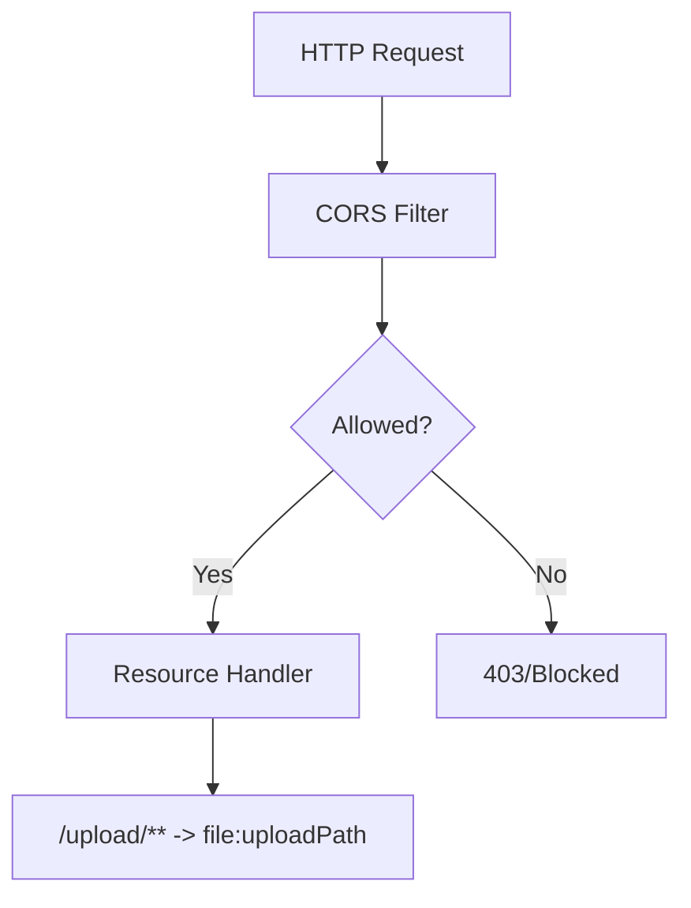
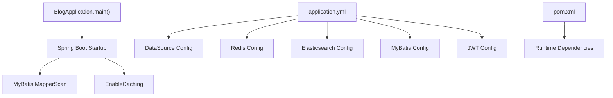
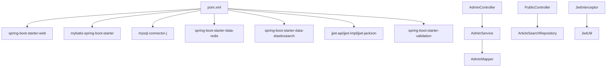

# Backend Architecture

<cite>
**Referenced Files in This Document**
- [BlogApplication.java](file://blog-backend/src/main/java/com/blog/BlogApplication.java)
- [application.yml](file://blog-backend/src/main/resources/application.yml)
- [pom.xml](file://blog-backend/pom.xml)
- [WebConfig.java](file://blog-backend/src/main/java/com/blog/config/WebConfig.java)
- [JwtInterceptor.java](file://blog-backend/src/main/java/com/blog/config/JwtInterceptor.java)
- [RedisConfig.java](file://blog-backend/src/main/java/com/blog/config/RedisConfig.java)
- [AdminController.java](file://blog-backend/src/main/java/com/blog/controller/AdminController.java)
- [PublicController.java](file://blog-backend/src/main/java/com/blog/controller/PublicController.java)
- [AdminService.java](file://blog-backend/src/main/java/com/blog/service/AdminService.java)
- [JwtUtil.java](file://blog-backend/src/main/java/com/blog/util/JwtUtil.java)
- [ArticleSearchRepository.java](file://blog-backend/src/main/java/com/blog/repository/ArticleSearchRepository.java)
- [Admin.java](file://blog-backend/src/main/java/com/blog/entity/Admin.java)
- [Article.java](file://blog-backend/src/main/java/com/blog/entity/Article.java)
- [AdminMapper.java](file://blog-backend/src/main/java/com/blog/mapper/AdminMapper.java)
</cite>

## Table of Contents
1. [Introduction](#introduction)
2. [Project Structure](#project-structure)
3. [Core Components](#core-components)
4. [Architecture Overview](#architecture-overview)
5. [Detailed Component Analysis](#detailed-component-analysis)
6. [Dependency Analysis](#dependency-analysis)
7. [Performance Considerations](#performance-considerations)
8. [Troubleshooting Guide](#troubleshooting-guide)
9. [Conclusion](#conclusion)
10. [Appendices](#appendices)

## Introduction
This document describes the backend architecture of a Spring Boot blog system. It focuses on the layered architecture with Model-View-Controller (MVC) patterns, component interactions, data flows, and integration patterns. The system employs MyBatis for ORM, a repository pattern for search, a service layer for business logic, and JWT-based authentication via a servlet interceptor. It also documents admin and public API boundaries, Redis caching configuration, CORS setup, and application initialization. Cross-cutting concerns include authentication, authorization, and request validation.

## Project Structure
The backend follows a conventional Maven layout with Java source under src/main/java and resources under src/main/resources. Key packages:
- config: Spring configuration, interceptors, and web MVC customization
- controller: REST endpoints for admin and public APIs
- service: business logic and orchestration
- repository: search repository for Elasticsearch
- mapper: MyBatis mappers for database access
- entity: domain models
- util: JWT utilities
- resources: application.yml, SQL scripts, and MyBatis XML files

**Diagram sources**
- [BlogApplication.java:1-16](file://blog-backend/src/main/java/com/blog/BlogApplication.java#L1-L16)
- [application.yml:1-33](file://blog-backend/src/main/resources/application.yml#L1-L33)
- [WebConfig.java:1-39](file://blog-backend/src/main/java/com/blog/config/WebConfig.java#L1-L39)
- [JwtInterceptor.java:1-36](file://blog-backend/src/main/java/com/blog/config/JwtInterceptor.java#L1-L36)
- [AdminController.java:1-121](file://blog-backend/src/main/java/com/blog/controller/AdminController.java#L1-L121)
- [PublicController.java:1-62](file://blog-backend/src/main/java/com/blog/controller/PublicController.java#L1-L62)
- [AdminService.java:1-34](file://blog-backend/src/main/java/com/blog/service/AdminService.java#L1-L34)
- [JwtUtil.java:1-57](file://blog-backend/src/main/java/com/blog/util/JwtUtil.java#L1-L57)
- [RedisConfig.java:1-27](file://blog-backend/src/main/java/com/blog/config/RedisConfig.java#L1-L27)
- [ArticleSearchRepository.java:1-12](file://blog-backend/src/main/java/com/blog/repository/ArticleSearchRepository.java#L1-L12)
- [AdminMapper.java:1-16](file://blog-backend/src/main/java/com/blog/mapper/AdminMapper.java#L1-L16)

**Section sources**
- [BlogApplication.java:1-16](file://blog-backend/src/main/java/com/blog/BlogApplication.java#L1-L16)
- [application.yml:1-33](file://blog-backend/src/main/resources/application.yml#L1-L33)
- [pom.xml:1-111](file://blog-backend/pom.xml#L1-L111)

## Core Components
- Application bootstrap: enables MyBatis mappers scanning, caching, and starts the Spring Boot application.
- Configuration: web MVC customization, CORS, resource handlers, and JWT interceptor registration.
- Controllers: AdminController for administrative CRUD operations and authentication; PublicController for read-only public queries and search.
- Services: Business logic for admin, categories, outlines, and articles; includes password hashing and token generation.
- Persistence: MyBatis mappers for admin data access; entities define domain models.
- Search: Elasticsearch repository for full-text search on article titles.
- Security: JWT utilities and servlet interceptor enforcing bearer tokens for admin endpoints.
- Caching: Redis cache manager configured with JSON serialization and TTL.

**Section sources**
- [BlogApplication.java:8-16](file://blog-backend/src/main/java/com/blog/BlogApplication.java#L8-L16)
- [WebConfig.java:10-39](file://blog-backend/src/main/java/com/blog/config/WebConfig.java#L10-L39)
- [JwtInterceptor.java:12-36](file://blog-backend/src/main/java/com/blog/config/JwtInterceptor.java#L12-L36)
- [AdminController.java:19-121](file://blog-backend/src/main/java/com/blog/controller/AdminController.java#L19-L121)
- [PublicController.java:18-62](file://blog-backend/src/main/java/com/blog/controller/PublicController.java#L18-L62)
- [AdminService.java:9-34](file://blog-backend/src/main/java/com/blog/service/AdminService.java#L9-L34)
- [JwtUtil.java:12-57](file://blog-backend/src/main/java/com/blog/util/JwtUtil.java#L12-L57)
- [RedisConfig.java:13-27](file://blog-backend/src/main/java/com/blog/config/RedisConfig.java#L13-L27)
- [ArticleSearchRepository.java:8-12](file://blog-backend/src/main/java/com/blog/repository/ArticleSearchRepository.java#L8-L12)
- [AdminMapper.java:6-16](file://blog-backend/src/main/java/com/blog/mapper/AdminMapper.java#L6-L16)

## Architecture Overview
The system follows a layered MVC architecture:
- Presentation layer: REST controllers handle HTTP requests and responses.
- Application layer: services encapsulate business logic and coordinate between persistence and external systems.
- Persistence layer: MyBatis mappers and entities manage relational data; Elasticsearch repository supports search.
- Cross-cutting concerns: JWT interceptor enforces authentication for admin endpoints; Redis cache manager provides caching; CORS and resource handlers enable frontend integration.

**Diagram sources**
- [AdminController.java:19-121](file://blog-backend/src/main/java/com/blog/controller/AdminController.java#L19-L121)
- [PublicController.java:18-62](file://blog-backend/src/main/java/com/blog/controller/PublicController.java#L18-L62)
- [JwtInterceptor.java:12-36](file://blog-backend/src/main/java/com/blog/config/JwtInterceptor.java#L12-L36)
- [JwtUtil.java:12-57](file://blog-backend/src/main/java/com/blog/util/JwtUtil.java#L12-L57)
- [RedisConfig.java:13-27](file://blog-backend/src/main/java/com/blog/config/RedisConfig.java#L13-L27)
- [AdminMapper.java:6-16](file://blog-backend/src/main/java/com/blog/mapper/AdminMapper.java#L6-L16)
- [ArticleSearchRepository.java:8-12](file://blog-backend/src/main/java/com/blog/repository/ArticleSearchRepository.java#L8-L12)

## Detailed Component Analysis

### MVC and Layered Architecture
- Controllers expose endpoints under /api/admin (admin-only) and /api (public). They delegate to services and return ResponseEntity objects.
- Services encapsulate business rules, coordinate data access, and integrate with external systems (Elasticsearch).
- MyBatis mappers define SQL operations mapped to entities.
- Interceptor enforces JWT validation for admin endpoints.

**Diagram sources**
- [AdminController.java:19-121](file://blog-backend/src/main/java/com/blog/controller/AdminController.java#L19-L121)
- [PublicController.java:18-62](file://blog-backend/src/main/java/com/blog/controller/PublicController.java#L18-L62)
- [AdminService.java:9-34](file://blog-backend/src/main/java/com/blog/service/AdminService.java#L9-L34)
- [JwtInterceptor.java:12-36](file://blog-backend/src/main/java/com/blog/config/JwtInterceptor.java#L12-L36)
- [JwtUtil.java:12-57](file://blog-backend/src/main/java/com/blog/util/JwtUtil.java#L12-L57)

**Section sources**
- [AdminController.java:19-121](file://blog-backend/src/main/java/com/blog/controller/AdminController.java#L19-L121)
- [PublicController.java:18-62](file://blog-backend/src/main/java/com/blog/controller/PublicController.java#L18-L62)
- [AdminService.java:9-34](file://blog-backend/src/main/java/com/blog/service/AdminService.java#L9-L34)
- [JwtInterceptor.java:12-36](file://blog-backend/src/main/java/com/blog/config/JwtInterceptor.java#L12-L36)
- [JwtUtil.java:12-57](file://blog-backend/src/main/java/com/blog/util/JwtUtil.java#L12-L57)

### Authentication and Authorization Flow
- Admin login endpoint validates credentials against stored hashed passwords and issues a signed JWT.
- JwtInterceptor checks Authorization header for Bearer token on /api/admin endpoints (excluding login).
- Token validation uses HMAC signature verification.

**Diagram sources**
- [AdminController.java:34-44](file://blog-backend/src/main/java/com/blog/controller/AdminController.java#L34-L44)
- [AdminService.java:16-22](file://blog-backend/src/main/java/com/blog/service/AdminService.java#L16-L22)
- [JwtUtil.java:25-47](file://blog-backend/src/main/java/com/blog/util/JwtUtil.java#L25-L47)
- [JwtInterceptor.java:17-34](file://blog-backend/src/main/java/com/blog/config/JwtInterceptor.java#L17-L34)

**Section sources**
- [AdminController.java:34-44](file://blog-backend/src/main/java/com/blog/controller/AdminController.java#L34-L44)
- [AdminService.java:16-22](file://blog-backend/src/main/java/com/blog/service/AdminService.java#L16-L22)
- [JwtUtil.java:25-47](file://blog-backend/src/main/java/com/blog/util/JwtUtil.java#L25-L47)
- [JwtInterceptor.java:17-34](file://blog-backend/src/main/java/com/blog/config/JwtInterceptor.java#L17-L34)

### Data Access and ORM with MyBatis
- MyBatis is enabled via @MapperScan and configured with mapper locations and type aliases package.
- Entities are mapped to database tables via annotations in mappers.
- Password hashing uses BCrypt encoder.

**Diagram sources**
- [AdminMapper.java:6-16](file://blog-backend/src/main/java/com/blog/mapper/AdminMapper.java#L6-L16)
- [Admin.java:7-13](file://blog-backend/src/main/java/com/blog/entity/Admin.java#L7-L13)

**Section sources**
- [application.yml:21-26](file://blog-backend/src/main/resources/application.yml#L21-L26)
- [AdminMapper.java:6-16](file://blog-backend/src/main/java/com/blog/mapper/AdminMapper.java#L6-L16)
- [Admin.java:7-13](file://blog-backend/src/main/java/com/blog/entity/Admin.java#L7-L13)
- [AdminService.java:14](file://blog-backend/src/main/java/com/blog/service/AdminService.java#L14)

### Search Integration with Elasticsearch
- PublicController exposes a /search endpoint delegating to ArticleSearchRepository.
- Repository extends ElasticsearchRepository and defines a method to find documents by title substring.

**Diagram sources**
- [PublicController.java:56-60](file://blog-backend/src/main/java/com/blog/controller/PublicController.java#L56-L60)
- [ArticleSearchRepository.java:8-12](file://blog-backend/src/main/java/com/blog/repository/ArticleSearchRepository.java#L8-L12)

**Section sources**
- [PublicController.java:56-60](file://blog-backend/src/main/java/com/blog/controller/PublicController.java#L56-L60)
- [ArticleSearchRepository.java:8-12](file://blog-backend/src/main/java/com/blog/repository/ArticleSearchRepository.java#L8-L12)

### Caching Strategy with Redis
- Redis cache manager is configured with JSON serialization and a default TTL.
- EnableCaching is active at the application level.

**Diagram sources**
- [BlogApplication.java:6](file://blog-backend/src/main/java/com/blog/BlogApplication.java#L6)
- [RedisConfig.java:17-25](file://blog-backend/src/main/java/com/blog/config/RedisConfig.java#L17-L25)

**Section sources**
- [BlogApplication.java:6](file://blog-backend/src/main/java/com/blog/BlogApplication.java#L6)
- [RedisConfig.java:13-27](file://blog-backend/src/main/java/com/blog/config/RedisConfig.java#L13-L27)

### CORS and Resource Handling
- Global CORS allows all origins/methods/headers with a max age.
- Static file serving for uploaded images under /upload/** mapped to a filesystem path.

**Diagram sources**
- [WebConfig.java:31-37](file://blog-backend/src/main/java/com/blog/config/WebConfig.java#L31-L37)
- [WebConfig.java:25-28](file://blog-backend/src/main/java/com/blog/config/WebConfig.java#L25-L28)

**Section sources**
- [WebConfig.java:10-39](file://blog-backend/src/main/java/com/blog/config/WebConfig.java#L10-L39)

### Application Initialization and Dependencies
- BlogApplication bootstraps the app, enables MyBatis mappers, and caching.
- application.yml defines server port, datasource, Redis, Elasticsearch, MyBatis, and JWT configuration.
- pom.xml declares Spring Web, MyBatis, MySQL, Redis, Elasticsearch, JWT, and validation starters.

**Diagram sources**
- [BlogApplication.java:12-15](file://blog-backend/src/main/java/com/blog/BlogApplication.java#L12-L15)
- [application.yml:1-33](file://blog-backend/src/main/resources/application.yml#L1-33)
- [pom.xml:25-91](file://blog-backend/pom.xml#L25-L91)

**Section sources**
- [BlogApplication.java:8-16](file://blog-backend/src/main/java/com/blog/BlogApplication.java#L8-L16)
- [application.yml:1-33](file://blog-backend/src/main/resources/application.yml#L1-L33)
- [pom.xml:1-111](file://blog-backend/pom.xml#L1-L111)

## Dependency Analysis
External dependencies include Spring Web, MyBatis, MySQL, Redis, Elasticsearch, JWT, and validation. Internal components depend on:
- Controllers depend on services and interceptors.
- Services depend on mappers and utilities.
- Repositories depend on Elasticsearch.
- Configuration depends on environment properties.

**Diagram sources**
- [pom.xml:25-91](file://blog-backend/pom.xml#L25-L91)
- [AdminController.java:25-29](file://blog-backend/src/main/java/com/blog/controller/AdminController.java#L25-L29)
- [PublicController.java:24-27](file://blog-backend/src/main/java/com/blog/controller/PublicController.java#L24-L27)
- [JwtInterceptor.java:14](file://blog-backend/src/main/java/com/blog/config/JwtInterceptor.java#L14)
- [JwtUtil.java:15-19](file://blog-backend/src/main/java/com/blog/util/JwtUtil.java#L15-L19)
- [AdminService.java:13](file://blog-backend/src/main/java/com/blog/service/AdminService.java#L13)
- [AdminMapper.java:6](file://blog-backend/src/main/java/com/blog/mapper/AdminMapper.java#L6)

**Section sources**
- [pom.xml:25-91](file://blog-backend/pom.xml#L25-L91)

## Performance Considerations
- Caching: Enable @Cacheable on frequently accessed read operations in services to reduce database load.
- Indexing: Ensure Elasticsearch indices are optimized for title-based queries.
- Upload handling: Validate file types and sizes before writing to disk; consider streaming uploads for large files.
- Database: Use pagination for listing endpoints; add database indexes on foreign keys and frequently queried columns.
- Interceptor overhead: Keep token parsing lightweight; avoid unnecessary logging in hot paths.

## Troubleshooting Guide
- 401 Unauthorized on admin endpoints:
  - Verify Authorization header format and presence.
  - Confirm token validity and expiration.
- Upload failures:
  - Check upload directory permissions and path configuration.
  - Validate file size limits and supported types.
- CORS errors:
  - Confirm allowed origins and methods in WebConfig.
- JWT token issues:
  - Validate secret and expiration settings in application.yml.
  - Ensure consistent time zone and clock synchronization.

**Section sources**
- [JwtInterceptor.java:17-34](file://blog-backend/src/main/java/com/blog/config/JwtInterceptor.java#L17-L34)
- [WebConfig.java:31-37](file://blog-backend/src/main/java/com/blog/config/WebConfig.java#L31-L37)
- [application.yml:28-32](file://blog-backend/src/main/resources/application.yml#L28-L32)

## Conclusion
The backend employs a clean layered architecture with explicit separation between controllers, services, persistence, and search. MyBatis provides straightforward SQL mapping, while Elasticsearch powers efficient text search. JWT-based authentication secures admin endpoints via a servlet interceptor, and Redis caching is configured for improved performance. CORS and resource handlers facilitate frontend integration. The design balances simplicity and scalability, with clear boundaries between admin and public APIs.

## Appendices
- Infrastructure requirements:
  - Database: MySQL instance reachable by JDBC URL.
  - Redis: Local Redis server for caching.
  - Elasticsearch: Local Elasticsearch instance for search.
- Environment variables:
  - Configure datasource credentials, Redis host/port, Elasticsearch URIs, JWT secret, and upload path via application.yml.