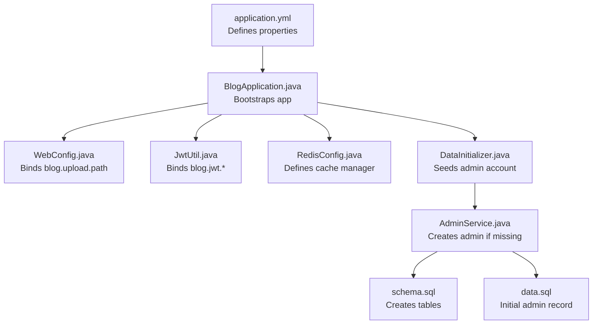
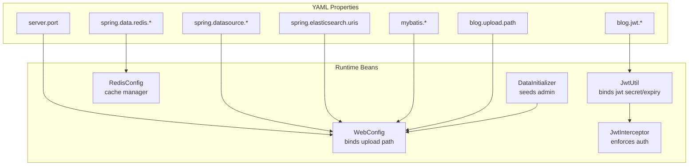
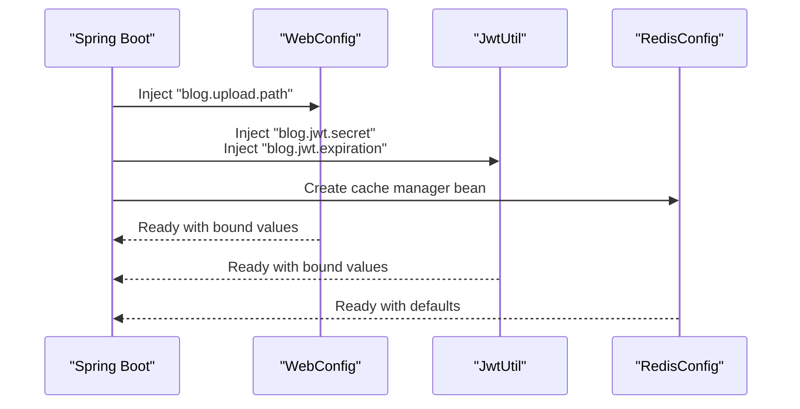
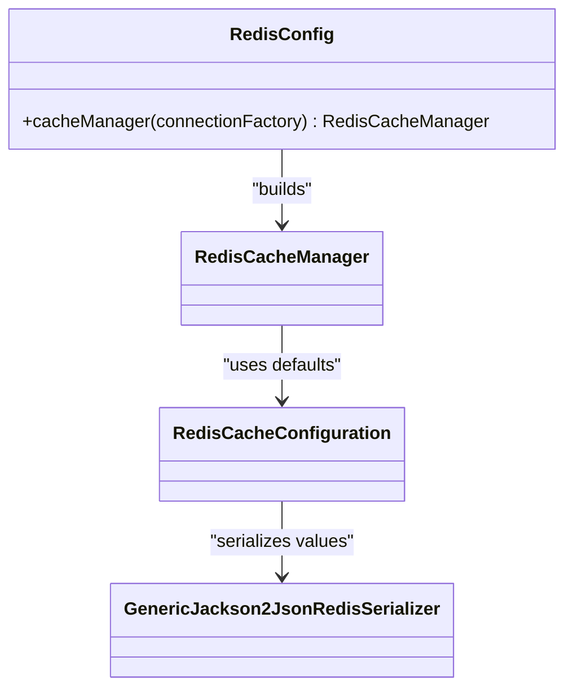
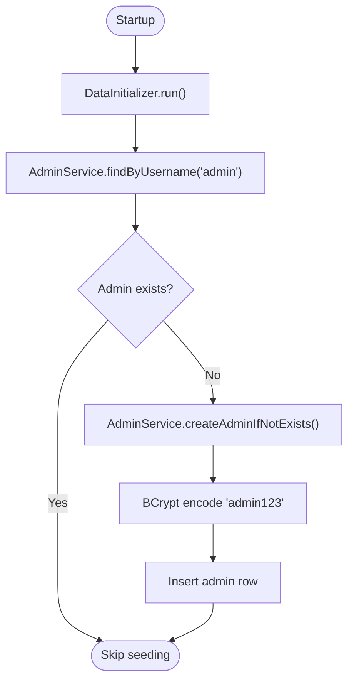
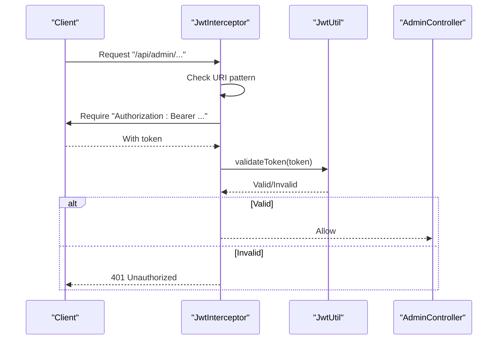
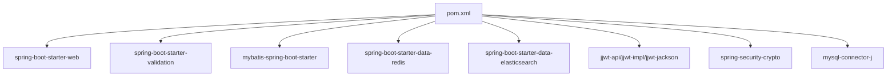

# Configuration and Environment Management

<cite>
**Referenced Files in This Document**
- [application.yml](file://blog-backend/src/main/resources/application.yml)
- [RedisConfig.java](file://blog-backend/src/main/java/com/blog/config/RedisConfig.java)
- [WebConfig.java](file://blog-backend/src/main/java/com/blog/config/WebConfig.java)
- [JwtInterceptor.java](file://blog-backend/src/main/java/com/blog/config/JwtInterceptor.java)
- [JwtUtil.java](file://blog-backend/src/main/java/com/blog/util/JwtUtil.java)
- [DataInitializer.java](file://blog-backend/src/main/java/com/blog/config/DataInitializer.java)
- [BlogApplication.java](file://blog-backend/src/main/java/com/blog/BlogApplication.java)
- [AdminService.java](file://blog-backend/src/main/java/com/blog/service/AdminService.java)
- [schema.sql](file://blog-backend/src/main/resources/schema.sql)
- [data.sql](file://blog-backend/src/main/resources/data.sql)
- [pom.xml](file://blog-backend/pom.xml)
</cite>

## Table of Contents
1. [Introduction](#introduction)
2. [Project Structure](#project-structure)
3. [Core Components](#core-components)
4. [Architecture Overview](#architecture-overview)
5. [Detailed Component Analysis](#detailed-component-analysis)
6. [Dependency Analysis](#dependency-analysis)
7. [Performance Considerations](#performance-considerations)
8. [Troubleshooting Guide](#troubleshooting-guide)
9. [Conclusion](#conclusion)
10. [Appendices](#appendices)

## Introduction
This document explains how the application manages configuration and environments. It covers the YAML configuration structure, property binding, externalized configuration, environment-specific overrides, and runtime behavior. It also documents Redis caching configuration, database initialization via DataInitializer, JWT authentication configuration, and production deployment considerations.

## Project Structure
The configuration system centers around a single YAML file for property definitions and several Java configuration classes that bind and apply these properties at runtime. Supporting SQL scripts initialize the database schema and seed default administrative credentials.

**Diagram sources**
- [application.yml:1-33](file://blog-backend/src/main/resources/application.yml#L1-L33)
- [BlogApplication.java:1-16](file://blog-backend/src/main/java/com/blog/BlogApplication.java#L1-L16)
- [WebConfig.java:14-15](file://blog-backend/src/main/java/com/blog/config/WebConfig.java#L14-L15)
- [JwtUtil.java:15-19](file://blog-backend/src/main/java/com/blog/util/JwtUtil.java#L15-L19)
- [RedisConfig.java:13-26](file://blog-backend/src/main/java/com/blog/config/RedisConfig.java#L13-L26)
- [DataInitializer.java:8-18](file://blog-backend/src/main/java/com/blog/config/DataInitializer.java#L8-L18)
- [AdminService.java:24-32](file://blog-backend/src/main/java/com/blog/service/AdminService.java#L24-L32)
- [schema.sql:1-33](file://blog-backend/src/main/resources/schema.sql#L1-L33)
- [data.sql:1-2](file://blog-backend/src/main/resources/data.sql#L1-L2)

**Section sources**
- [application.yml:1-33](file://blog-backend/src/main/resources/application.yml#L1-L33)
- [BlogApplication.java:1-16](file://blog-backend/src/main/java/com/blog/BlogApplication.java#L1-L16)

## Core Components
- Application configuration file defines server, Spring datasource, SQL initialization mode, Redis, Elasticsearch, MyBatis, and application-specific properties.
- Property binding occurs via annotation-based injection in Java classes.
- Externalized configuration supports environment variable overrides and profile-specific files.
- Redis cache manager is configured programmatically.
- DataInitializer seeds the admin account during startup.
- JWT utilities bind secret and expiration from properties.

**Section sources**
- [application.yml:1-33](file://blog-backend/src/main/resources/application.yml#L1-L33)
- [WebConfig.java:14-15](file://blog-backend/src/main/java/com/blog/config/WebConfig.java#L14-L15)
- [JwtUtil.java:15-19](file://blog-backend/src/main/java/com/blog/util/JwtUtil.java#L15-L19)
- [RedisConfig.java:13-26](file://blog-backend/src/main/java/com/blog/config/RedisConfig.java#L13-L26)
- [DataInitializer.java:8-18](file://blog-backend/src/main/java/com/blog/config/DataInitializer.java#L8-L18)

## Architecture Overview
The configuration architecture links YAML-defined properties to runtime beans and interceptors. Properties flow from application.yml into Java components through value binding, while programmatic configuration defines caching behavior.

**Diagram sources**
- [application.yml:1-33](file://blog-backend/src/main/resources/application.yml#L1-L33)
- [WebConfig.java:14-15](file://blog-backend/src/main/java/com/blog/config/WebConfig.java#L14-L15)
- [JwtUtil.java:15-19](file://blog-backend/src/main/java/com/blog/util/JwtUtil.java#L15-L19)
- [RedisConfig.java:13-26](file://blog-backend/src/main/java/com/blog/config/RedisConfig.java#L13-L26)
- [JwtInterceptor.java:10-36](file://blog-backend/src/main/java/com/blog/config/JwtInterceptor.java#L10-L36)
- [DataInitializer.java:8-18](file://blog-backend/src/main/java/com/blog/config/DataInitializer.java#L8-L18)

## Detailed Component Analysis

### YAML Configuration Structure
The YAML file organizes properties under logical namespaces:
- Server: port definition for the HTTP server.
- Spring datasource: JDBC URL, credentials, driver class, and SQL initialization mode.
- Spring data: Redis host, port, and database index.
- Spring data: Elasticsearch URIs.
- MyBatis: mapper locations, type aliases package, and underscore-to-camel mapping.
- Application-specific: JWT secret and expiration, and upload path with environment variable substitution.

Practical usage examples:
- Override server port via environment variable or command-line argument.
- Switch datasource URL and credentials per environment using externalized properties.
- Adjust Redis host/port/database and Elasticsearch URIs for different environments.
- Tune JWT expiration and secret per environment.

Environment variable override example:
- Set the upload path using an environment variable that replaces the placeholder in the YAML.

Production deployment considerations:
- Store secrets (database passwords, JWT secret) in secure vaults or environment variables.
- Use separate YAML profiles for environments (dev, test, prod) and activate via spring.profiles.active.
- Disable SQL initialization in production; rely on controlled migrations.

**Section sources**
- [application.yml:1-33](file://blog-backend/src/main/resources/application.yml#L1-L33)

### Property Binding and Externalized Configuration
- Value binding: Java classes annotate fields with property keys to receive values from YAML.
- Interceptor binding: WebConfig binds the upload path value for resource serving.
- JWT binding: JwtUtil binds JWT secret and expiration for token generation/validation.
- Programmatic binding: RedisConfig creates a cache manager bean with TTL and serialization settings.

**Diagram sources**
- [WebConfig.java:14-15](file://blog-backend/src/main/java/com/blog/config/WebConfig.java#L14-L15)
- [JwtUtil.java:15-19](file://blog-backend/src/main/java/com/blog/util/JwtUtil.java#L15-L19)
- [RedisConfig.java:13-26](file://blog-backend/src/main/java/com/blog/config/RedisConfig.java#L13-L26)

**Section sources**
- [WebConfig.java:14-15](file://blog-backend/src/main/java/com/blog/config/WebConfig.java#L14-L15)
- [JwtUtil.java:15-19](file://blog-backend/src/main/java/com/blog/util/JwtUtil.java#L15-L19)
- [RedisConfig.java:13-26](file://blog-backend/src/main/java/com/blog/config/RedisConfig.java#L13-L26)

### Redis Configuration for Caching
Redis is configured programmatically to define cache defaults:
- Default TTL for cached entries.
- JSON serialization for cached values.
- Factory-based creation of the cache manager.

**Diagram sources**
- [RedisConfig.java:13-26](file://blog-backend/src/main/java/com/blog/config/RedisConfig.java#L13-L26)

Operational notes:
- Enable caching at the application level.
- Configure Redis host/port/database via YAML for environment-specific deployments.
- Consider cluster or sentinel setups in production by adjusting connection factory configuration.

**Section sources**
- [RedisConfig.java:13-26](file://blog-backend/src/main/java/com/blog/config/RedisConfig.java#L13-L26)
- [application.yml:14-18](file://blog-backend/src/main/resources/application.yml#L14-L18)

### DataInitializer for Database Seeding
DataInitializer runs at startup to ensure a default administrative account exists:
- Implements CommandLineRunner to execute after application context initialization.
- Delegates to AdminService to create the admin if not present.
- Uses BCrypt to hash passwords securely.

**Diagram sources**
- [DataInitializer.java:8-18](file://blog-backend/src/main/java/com/blog/config/DataInitializer.java#L8-L18)
- [AdminService.java:24-32](file://blog-backend/src/main/java/com/blog/service/AdminService.java#L24-L32)

Security and operational considerations:
- The initial password is set to a default value; administrators must change it immediately.
- The schema script defines the admin table structure and constraints.
- The data script inserts a default admin record if not present.

**Section sources**
- [DataInitializer.java:8-18](file://blog-backend/src/main/java/com/blog/config/DataInitializer.java#L8-L18)
- [AdminService.java:24-32](file://blog-backend/src/main/java/com/blog/service/AdminService.java#L24-L32)
- [schema.sql:27-32](file://blog-backend/src/main/resources/schema.sql#L27-L32)
- [data.sql:1-2](file://blog-backend/src/main/resources/data.sql#L1-L2)

### JWT Properties and Authentication Flow
JWT configuration is driven by YAML properties and enforced by an interceptor:
- JwtUtil binds JWT secret and expiration to generate and validate tokens.
- JwtInterceptor enforces Authorization header checks for protected admin endpoints.
- Token validation uses the configured secret and expiration.

**Diagram sources**
- [JwtInterceptor.java:16-34](file://blog-backend/src/main/java/com/blog/config/JwtInterceptor.java#L16-L34)
- [JwtUtil.java:40-47](file://blog-backend/src/main/java/com/blog/util/JwtUtil.java#L40-L47)

Best practices:
- Rotate JWT secrets regularly and manage them via environment variables or secret managers.
- Use HTTPS in production to protect tokens in transit.
- Keep expiration short for admin endpoints and refresh tokens if needed.

**Section sources**
- [JwtUtil.java:15-19](file://blog-backend/src/main/java/com/blog/util/JwtUtil.java#L15-L19)
- [JwtInterceptor.java:16-34](file://blog-backend/src/main/java/com/blog/config/JwtInterceptor.java#L16-L34)

### Elasticsearch Configuration
Elasticsearch URIs are defined in YAML and can be overridden per environment. In a production environment:
- Use multiple hosts for high availability.
- Secure endpoints with authentication and TLS.
- Monitor indices and shard allocation.

Note: The current YAML defines a single URI; expand to a list for clustered deployments if needed.

**Section sources**
- [application.yml:18-19](file://blog-backend/src/main/resources/application.yml#L18-L19)

### MyBatis Configuration
MyBatis is configured to:
- Load mappers from XML files.
- Map database columns to camelCase POJOs.
- Apply underscore-to-camel-case mapping globally.

Operational tips:
- Keep mapper XMLs organized under the configured location.
- Use type aliases to simplify result mapping.

**Section sources**
- [application.yml:21-25](file://blog-backend/src/main/resources/application.yml#L21-L25)

### CORS Configuration
Global CORS is enabled with permissive settings for development. For production:
- Restrict allowed origins to trusted domains.
- Limit exposed headers and methods.
- Set appropriate max age and credential policies.

**Section sources**
- [WebConfig.java:31-37](file://blog-backend/src/main/java/com/blog/config/WebConfig.java#L31-L37)

## Dependency Analysis
External dependencies supporting configuration and environment management:
- Spring Boot starters for web, validation, MyBatis, Redis, and Elasticsearch.
- jjwt for JWT support.
- Spring Security Crypto for password encoding.
- MySQL Connector/J for database connectivity.

**Diagram sources**
- [pom.xml:25-91](file://blog-backend/pom.xml#L25-L91)

**Section sources**
- [pom.xml:25-91](file://blog-backend/pom.xml#L25-L91)

## Performance Considerations
- Redis TTL: Default cache TTL is set to minutes; tune based on data volatility and query patterns.
- JWT validation: Keep secret size and hashing reasonable; avoid excessive token lifetimes.
- Database initialization: Avoid repeated seeding in production; rely on migrations.
- Elasticsearch: Use bulk indexing and monitor shard health in production.

## Troubleshooting Guide
Common issues and resolutions:
- Unauthorized errors on admin endpoints: Verify Authorization header format and token validity.
- Upload path not found: Confirm the bound upload path value and filesystem permissions.
- Cache not working: Ensure Redis is reachable and cache manager bean is active.
- Database initialization failures: Check schema and data scripts; confirm SQL initialization mode.
- CORS blocked requests: Review allowed origins and methods in WebConfig.

**Section sources**
- [JwtInterceptor.java:16-34](file://blog-backend/src/main/java/com/blog/config/JwtInterceptor.java#L16-L34)
- [WebConfig.java:25-27](file://blog-backend/src/main/java/com/blog/config/WebConfig.java#L25-L27)
- [RedisConfig.java:17-24](file://blog-backend/src/main/java/com/blog/config/RedisConfig.java#L17-L24)
- [schema.sql:1-33](file://blog-backend/src/main/resources/schema.sql#L1-L33)
- [data.sql:1-2](file://blog-backend/src/main/resources/data.sql#L1-L2)

## Conclusion
The application’s configuration system combines YAML-defined properties with annotation-driven binding and programmatic configuration. It supports environment-specific overrides, secure defaults for development, and practical patterns for caching, authentication, and database initialization. Adopting strict security practices and environment-specific profiles ensures safe and reliable production deployments.

## Appendices

### Configuration Validation Checklist
- Validate YAML syntax and required properties.
- Test property overrides via environment variables.
- Confirm Redis connectivity and cache TTL behavior.
- Verify JWT secret and expiration alignment across services.
- Ensure CORS policy matches frontend origin.
- Run schema/data scripts in staging before production.

### Security Best Practices
- Store secrets in environment variables or secret managers.
- Use HTTPS and secure cookies.
- Enforce least privilege for database accounts.
- Regularly rotate JWT secrets and invalidate compromised tokens.
- Limit admin endpoint exposure and monitor access logs.