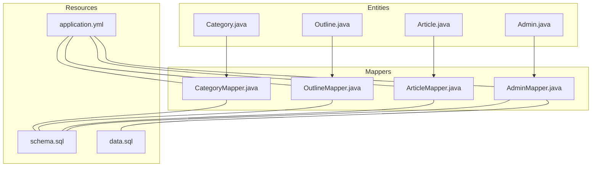
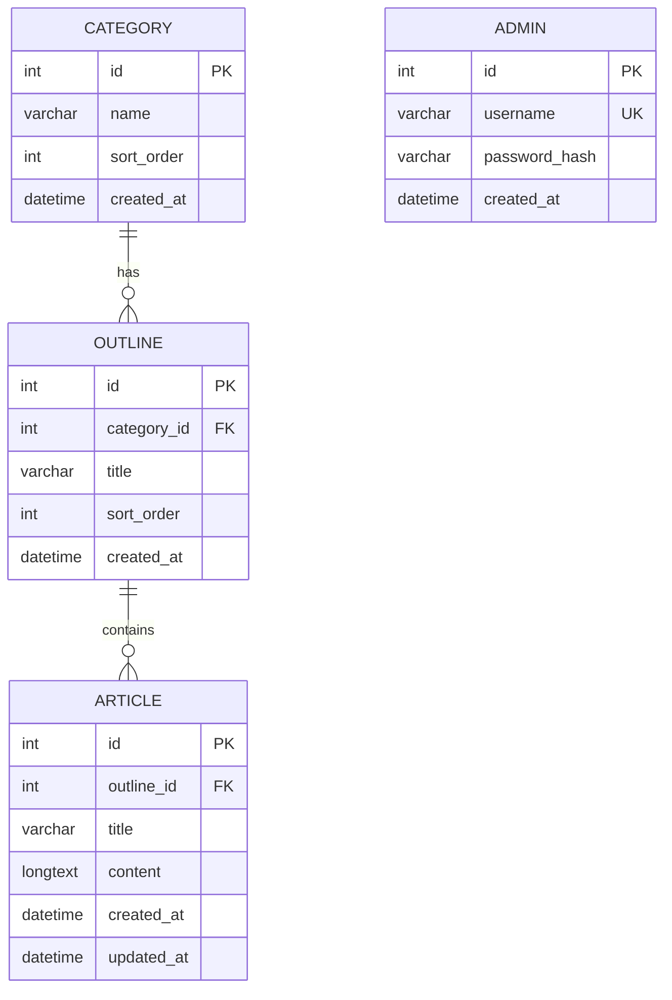
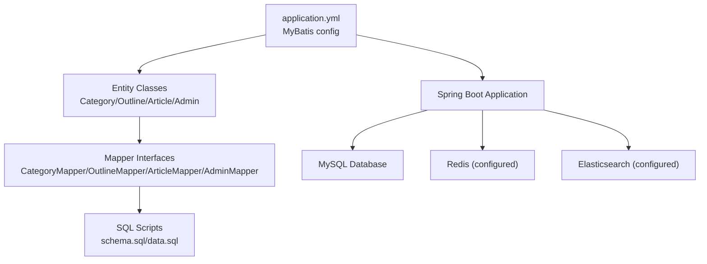
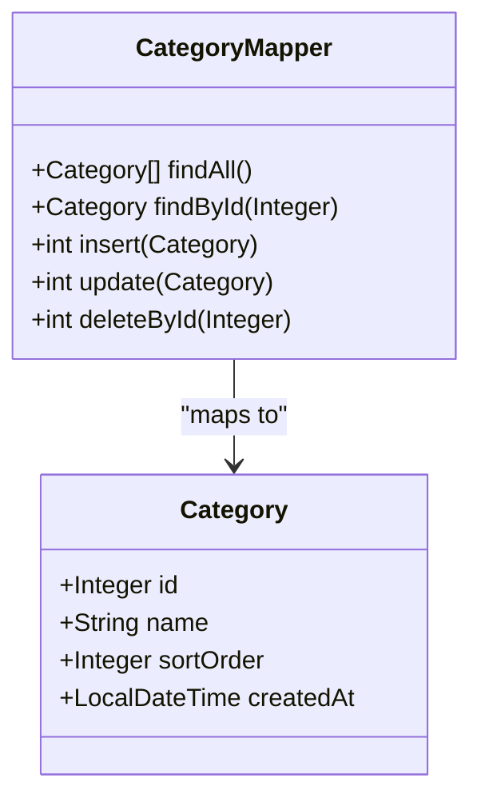
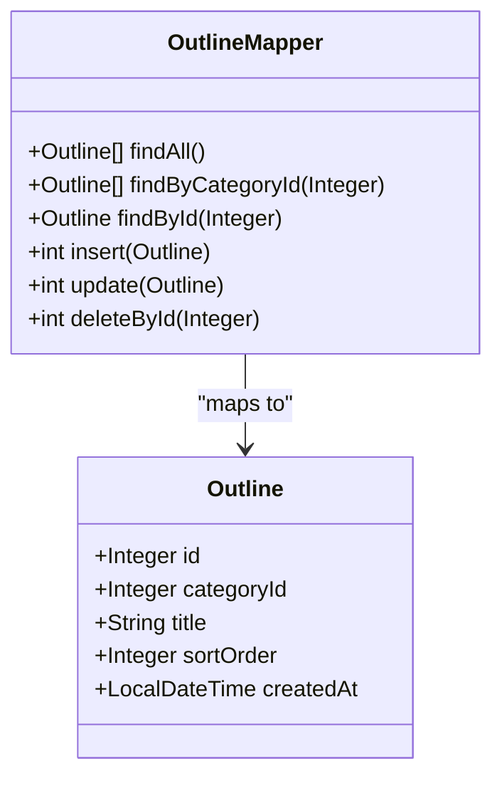
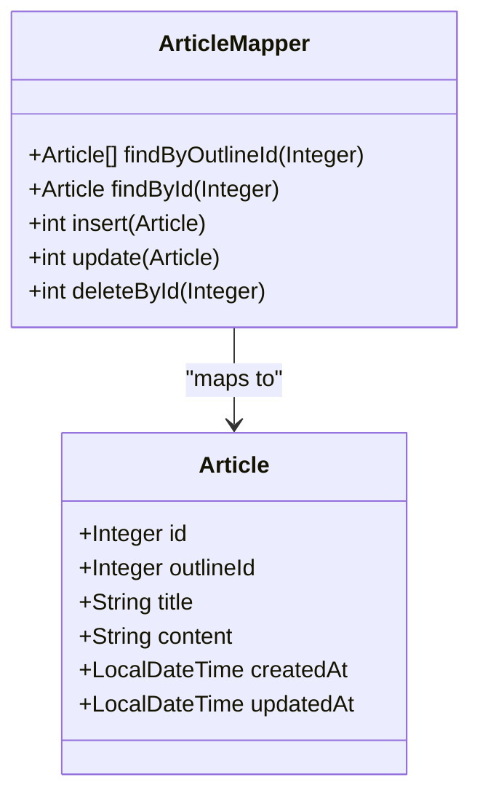
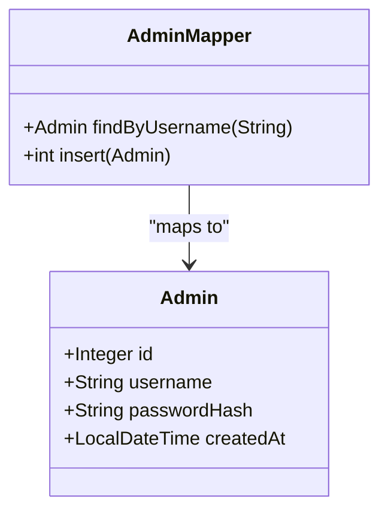
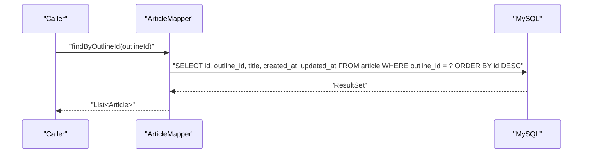
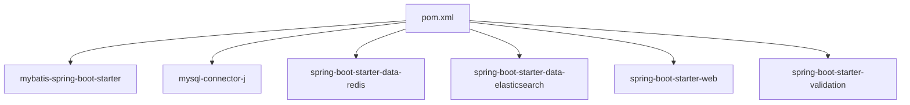

# Database Design and ORM Configuration

<cite>
**Referenced Files in This Document**
- [schema.sql](file://blog-backend/src/main/resources/schema.sql)
- [data.sql](file://blog-backend/src/main/resources/data.sql)
- [application.yml](file://blog-backend/src/main/resources/application.yml)
- [Category.java](file://blog-backend/src/main/java/com/blog/entity/Category.java)
- [Outline.java](file://blog-backend/src/main/java/com/blog/entity/Outline.java)
- [Article.java](file://blog-backend/src/main/java/com/blog/entity/Article.java)
- [Admin.java](file://blog-backend/src/main/java/com/blog/entity/Admin.java)
- [CategoryMapper.java](file://blog-backend/src/main/java/com/blog/mapper/CategoryMapper.java)
- [OutlineMapper.java](file://blog-backend/src/main/java/com/blog/mapper/OutlineMapper.java)
- [ArticleMapper.java](file://blog-backend/src/main/java/com/blog/mapper/ArticleMapper.java)
- [AdminMapper.java](file://blog-backend/src/main/java/com/blog/mapper/AdminMapper.java)
- [pom.xml](file://blog-backend/pom.xml)
</cite>

## Table of Contents
1. [Introduction](#introduction)
2. [Project Structure](#project-structure)
3. [Core Components](#core-components)
4. [Architecture Overview](#architecture-overview)
5. [Detailed Component Analysis](#detailed-component-analysis)
6. [Dependency Analysis](#dependency-analysis)
7. [Performance Considerations](#performance-considerations)
8. [Troubleshooting Guide](#troubleshooting-guide)
9. [Conclusion](#conclusion)

## Introduction
This document provides comprehensive data model documentation for the blog database schema and MyBatis ORM configuration. It explains the entity relationships among Category, Outline, Article, and Admin, details field definitions, data types, constraints, and foreign keys. It also documents the MyBatis mapper configuration, SQL query implementations, and data access patterns. The goal is to help developers understand how the backend persists and retrieves data efficiently while maintaining referential integrity.

## Project Structure
The backend follows a layered architecture:
- Entities represent domain objects mapped to database tables.
- Mappers define SQL operations for each entity.
- Resources define database schema, initial data, and MyBatis configuration.
- Dependencies include Spring Boot, MyBatis, MySQL connector, Redis, and Elasticsearch.

**Diagram sources**
- [Category.java:1-13](file://blog-backend/src/main/java/com/blog/entity/Category.java#L1-L13)
- [Outline.java:1-14](file://blog-backend/src/main/java/com/blog/entity/Outline.java#L1-L14)
- [Article.java:1-15](file://blog-backend/src/main/java/com/blog/entity/Article.java#L1-L15)
- [Admin.java:1-13](file://blog-backend/src/main/java/com/blog/entity/Admin.java#L1-L13)
- [CategoryMapper.java:1-27](file://blog-backend/src/main/java/com/blog/mapper/CategoryMapper.java#L1-L27)
- [OutlineMapper.java:1-30](file://blog-backend/src/main/java/com/blog/mapper/OutlineMapper.java#L1-L30)
- [ArticleMapper.java:1-27](file://blog-backend/src/main/java/com/blog/mapper/ArticleMapper.java#L1-L27)
- [AdminMapper.java:1-16](file://blog-backend/src/main/java/com/blog/mapper/AdminMapper.java#L1-L16)
- [schema.sql:1-33](file://blog-backend/src/main/resources/schema.sql#L1-L33)
- [data.sql:1-2](file://blog-backend/src/main/resources/data.sql#L1-L2)
- [application.yml:1-33](file://blog-backend/src/main/resources/application.yml#L1-L33)

**Section sources**
- [schema.sql:1-33](file://blog-backend/src/main/resources/schema.sql#L1-L33)
- [application.yml:1-33](file://blog-backend/src/main/resources/application.yml#L1-L33)

## Core Components
This section defines the database schema and entity mappings.

- Category
  - Fields: id (primary key, auto-increment), name (non-null), sort_order (default 0), created_at (default current timestamp).
  - Constraints: Primary key on id; created_at defaults to current timestamp.
  - Access pattern: Ordered retrieval by sort_order and id.

- Outline
  - Fields: id (primary key, auto-increment), category_id (foreign key to Category.id, cascade delete), title (non-null), sort_order (default 0), created_at (default current timestamp).
  - Constraints: Primary key on id; foreign key constraint on category_id referencing Category(id); cascade delete on Category(id).
  - Access pattern: Retrieve by category_id; ordered by sort_order and id.

- Article
  - Fields: id (primary key, auto-increment), outline_id (foreign key to Outline.id, cascade delete), title (non-null), content (longtext), created_at (default current timestamp), updated_at (default current timestamp on update).
  - Constraints: Primary key on id; foreign key constraint on outline_id referencing Outline(id); cascade delete on Outline(id); updated_at updates on modification.
  - Access pattern: Retrieve by outline_id; ordered by id descending.

- Admin
  - Fields: id (primary key, auto-increment), username (non-null, unique), password_hash (non-null), created_at (default current timestamp).
  - Constraints: Primary key on id; unique constraint on username; created_at defaults to current timestamp.
  - Access pattern: Retrieve by username; insert new admin.

**Diagram sources**
- [schema.sql:1-33](file://blog-backend/src/main/resources/schema.sql#L1-L33)

**Section sources**
- [schema.sql:1-33](file://blog-backend/src/main/resources/schema.sql#L1-L33)
- [Category.java:1-13](file://blog-backend/src/main/java/com/blog/entity/Category.java#L1-L13)
- [Outline.java:1-14](file://blog-backend/src/main/java/com/blog/entity/Outline.java#L1-L14)
- [Article.java:1-15](file://blog-backend/src/main/java/com/blog/entity/Article.java#L1-L15)
- [Admin.java:1-13](file://blog-backend/src/main/java/com/blog/entity/Admin.java#L1-L13)

## Architecture Overview
The system uses MyBatis annotations to map Java entities to database tables. The application configuration enables underscore-to-camel-case mapping and loads mappers from XML files located under the mapper resource directory. Data initialization uses schema.sql and data.sql.

**Diagram sources**
- [application.yml:21-26](file://blog-backend/src/main/resources/application.yml#L21-L26)
- [Category.java:1-13](file://blog-backend/src/main/java/com/blog/entity/Category.java#L1-L13)
- [Outline.java:1-14](file://blog-backend/src/main/java/com/blog/entity/Outline.java#L1-L14)
- [Article.java:1-15](file://blog-backend/src/main/java/com/blog/entity/Article.java#L1-L15)
- [Admin.java:1-13](file://blog-backend/src/main/java/com/blog/entity/Admin.java#L1-L13)
- [CategoryMapper.java:1-27](file://blog-backend/src/main/java/com/blog/mapper/CategoryMapper.java#L1-L27)
- [OutlineMapper.java:1-30](file://blog-backend/src/main/java/com/blog/mapper/OutlineMapper.java#L1-L30)
- [ArticleMapper.java:1-27](file://blog-backend/src/main/java/com/blog/mapper/ArticleMapper.java#L1-L27)
- [AdminMapper.java:1-16](file://blog-backend/src/main/java/com/blog/mapper/AdminMapper.java#L1-L16)
- [schema.sql:1-33](file://blog-backend/src/main/resources/schema.sql#L1-L33)
- [data.sql:1-2](file://blog-backend/src/main/resources/data.sql#L1-L2)

**Section sources**
- [application.yml:21-26](file://blog-backend/src/main/resources/application.yml#L21-L26)

## Detailed Component Analysis

### Category Entity and Mapper
- Entity fields: id, name, sortOrder, createdAt.
- Mapper operations:
  - Find all categories ordered by sort_order and id.
  - Find by id.
  - Insert with generated key mapping to id.
  - Update by id.
  - Delete by id.

**Diagram sources**
- [Category.java:1-13](file://blog-backend/src/main/java/com/blog/entity/Category.java#L1-L13)
- [CategoryMapper.java:1-27](file://blog-backend/src/main/java/com/blog/mapper/CategoryMapper.java#L1-L27)

**Section sources**
- [Category.java:1-13](file://blog-backend/src/main/java/com/blog/entity/Category.java#L1-L13)
- [CategoryMapper.java:1-27](file://blog-backend/src/main/java/com/blog/mapper/CategoryMapper.java#L1-L27)

### Outline Entity and Mapper
- Entity fields: id, categoryId, title, sortOrder, createdAt.
- Mapper operations:
  - Find all outlines ordered by sort_order and id.
  - Find by categoryId with ordering.
  - Find by id.
  - Insert with generated key mapping to id.
  - Update by id.
  - Delete by id.

**Diagram sources**
- [Outline.java:1-14](file://blog-backend/src/main/java/com/blog/entity/Outline.java#L1-L14)
- [OutlineMapper.java:1-30](file://blog-backend/src/main/java/com/blog/mapper/OutlineMapper.java#L1-L30)

**Section sources**
- [Outline.java:1-14](file://blog-backend/src/main/java/com/blog/entity/Outline.java#L1-L14)
- [OutlineMapper.java:1-30](file://blog-backend/src/main/java/com/blog/mapper/OutlineMapper.java#L1-L30)

### Article Entity and Mapper
- Entity fields: id, outlineId, title, content, createdAt, updatedAt.
- Mapper operations:
  - Find by outlineId with ordering by id descending.
  - Find by id.
  - Insert with generated key mapping to id.
  - Update by id; updated_at is refreshed via SQL function.
  - Delete by id.

**Diagram sources**
- [Article.java:1-15](file://blog-backend/src/main/java/com/blog/entity/Article.java#L1-L15)
- [ArticleMapper.java:1-27](file://blog-backend/src/main/java/com/blog/mapper/ArticleMapper.java#L1-L27)

**Section sources**
- [Article.java:1-15](file://blog-backend/src/main/java/com/blog/entity/Article.java#L1-L15)
- [ArticleMapper.java:1-27](file://blog-backend/src/main/java/com/blog/mapper/ArticleMapper.java#L1-L27)

### Admin Entity and Mapper
- Entity fields: id, username, passwordHash, createdAt.
- Mapper operations:
  - Find by username.
  - Insert with generated key mapping to id.

**Diagram sources**
- [Admin.java:1-13](file://blog-backend/src/main/java/com/blog/entity/Admin.java#L1-L13)
- [AdminMapper.java:1-16](file://blog-backend/src/main/java/com/blog/mapper/AdminMapper.java#L1-L16)

**Section sources**
- [Admin.java:1-13](file://blog-backend/src/main/java/com/blog/entity/Admin.java#L1-L13)
- [AdminMapper.java:1-16](file://blog-backend/src/main/java/com/blog/mapper/AdminMapper.java#L1-L16)

### Data Access Patterns and SQL Queries
- Category
  - Select all ordered by sort_order, id.
  - Select by id.
  - Insert with name and sort_order; generated key mapped to id.
  - Update name and sort_order by id.
  - Delete by id.

- Outline
  - Select all ordered by sort_order, id.
  - Select by category_id ordered by sort_order, id.
  - Select by id.
  - Insert with category_id, title, sort_order; generated key mapped to id.
  - Update category_id, title, sort_order by id.
  - Delete by id.

- Article
  - Select by outline_id ordered by id descending.
  - Select by id.
  - Insert with outline_id, title, content; generated key mapped to id.
  - Update with outline_id, title, content; updated_at refreshed via SQL function.
  - Delete by id.

- Admin
  - Select by username.
  - Insert with username and password_hash; generated key mapped to id.

**Diagram sources**
- [ArticleMapper.java:11-12](file://blog-backend/src/main/java/com/blog/mapper/ArticleMapper.java#L11-L12)

**Section sources**
- [CategoryMapper.java:11-25](file://blog-backend/src/main/java/com/blog/mapper/CategoryMapper.java#L11-L25)
- [OutlineMapper.java:11-28](file://blog-backend/src/main/java/com/blog/mapper/OutlineMapper.java#L11-L28)
- [ArticleMapper.java:11-25](file://blog-backend/src/main/java/com/blog/mapper/ArticleMapper.java#L11-L25)
- [AdminMapper.java:9-14](file://blog-backend/src/main/java/com/blog/mapper/AdminMapper.java#L9-L14)

### Sample Data Structures
- Category
  - Example fields: id, name, sortOrder, createdAt.
- Outline
  - Example fields: id, categoryId, title, sortOrder, createdAt.
- Article
  - Example fields: id, outlineId, title, content, createdAt, updatedAt.
- Admin
  - Example fields: id, username, passwordHash, createdAt.

These structures align with the entity classes and reflect the database schema.

**Section sources**
- [Category.java:1-13](file://blog-backend/src/main/java/com/blog/entity/Category.java#L1-L13)
- [Outline.java:1-14](file://blog-backend/src/main/java/com/blog/entity/Outline.java#L1-L14)
- [Article.java:1-15](file://blog-backend/src/main/java/com/blog/entity/Article.java#L1-L15)
- [Admin.java:1-13](file://blog-backend/src/main/java/com/blog/entity/Admin.java#L1-L13)

## Dependency Analysis
External dependencies relevant to database and ORM:
- MyBatis Spring Boot Starter: Provides MyBatis integration with Spring Boot.
- MySQL Connector/J: JDBC driver for MySQL connectivity.
- Spring Boot starters for Redis and Elasticsearch: Enable Redis and Elasticsearch integrations configured in application.yml.

**Diagram sources**
- [pom.xml:36-74](file://blog-backend/pom.xml#L36-L74)

**Section sources**
- [pom.xml:25-91](file://blog-backend/pom.xml#L25-L91)

## Performance Considerations
- Indexing strategy
  - Consider adding composite indexes on frequently filtered columns:
    - Category: sort_order for ordering and grouping.
    - Outline: category_id for parent-child queries.
    - Article: outline_id for article listing per outline.
  - Unique constraints are already enforced for username on Admin.
- Query patterns
  - Ordering by sort_order and id ensures consistent presentation order for Category and Outline.
  - Article queries filter by outline_id and order by id descending to show latest articles first.
- Timestamp handling
  - created_at and updated_at defaults reduce application-side overhead.
  - updated_at is refreshed via SQL function on update to ensure accurate timestamps.
- Caching and search
  - Redis and Elasticsearch configurations are present in application.yml; consider caching frequently accessed categories/outlines and enabling article search indexing for improved responsiveness.

[No sources needed since this section provides general guidance]

## Troubleshooting Guide
- Schema initialization
  - Ensure schema.sql is executed to create tables with correct constraints and foreign keys.
  - Verify data.sql inserts initial admin credentials if authentication is required during development.
- MyBatis configuration
  - Confirm application.yml includes proper mapper locations and type aliases package.
  - Enable underscore-to-camel-case mapping to align column names with entity fields.
- Foreign key constraints
  - Deleting a Category cascades to Outline; deleting an Outline cascades to Article. Validate deletion sequences to avoid orphaned records.
- Authentication
  - Admin username must be unique; ensure no duplicates are inserted.

**Section sources**
- [schema.sql:1-33](file://blog-backend/src/main/resources/schema.sql#L1-L33)
- [data.sql:1-2](file://blog-backend/src/main/resources/data.sql#L1-L2)
- [application.yml:21-26](file://blog-backend/src/main/resources/application.yml#L21-L26)

## Conclusion
The blog database schema establishes a clear hierarchy: Category → Outline → Article, with Admin managing authentication. MyBatis annotations provide straightforward SQL mappings aligned with the entity classes. The application configuration supports underscore-to-camel-case mapping and integrates Redis and Elasticsearch. By following the documented access patterns and considering the suggested performance improvements, the system can maintain efficient and reliable data operations.