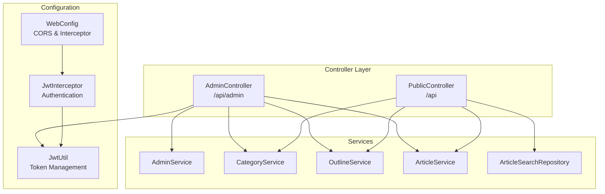
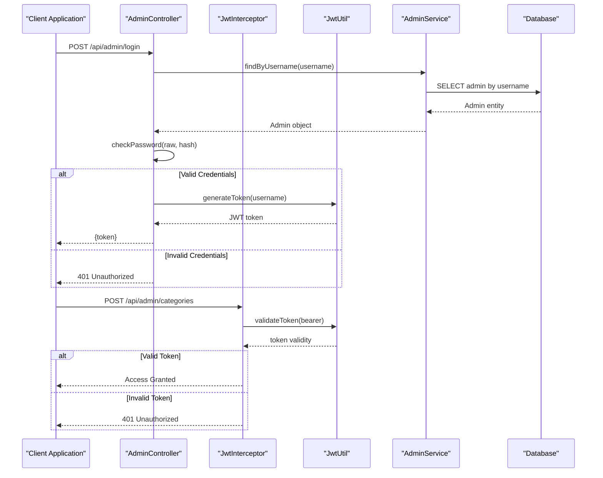
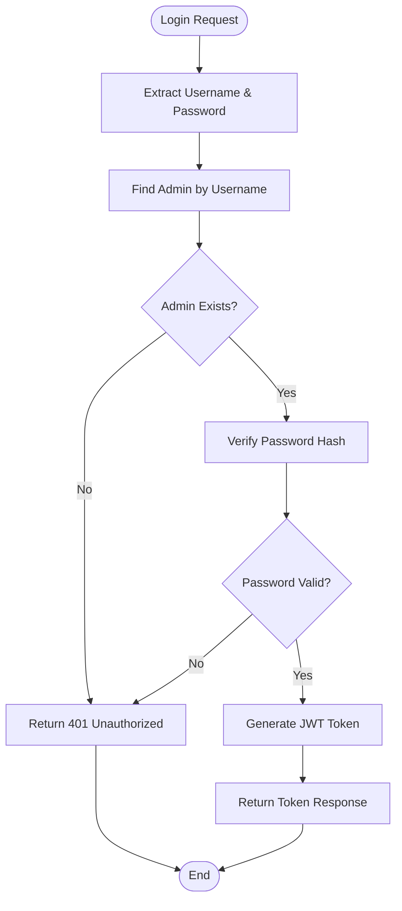
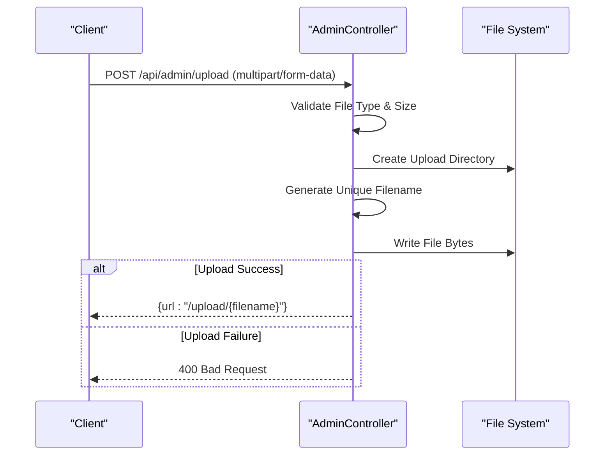
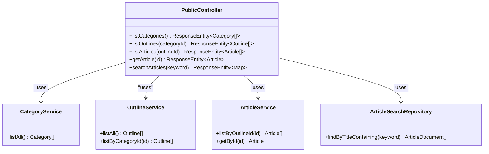
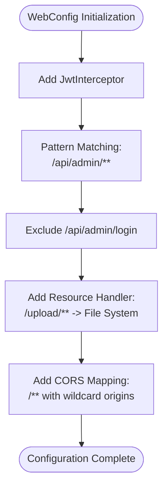
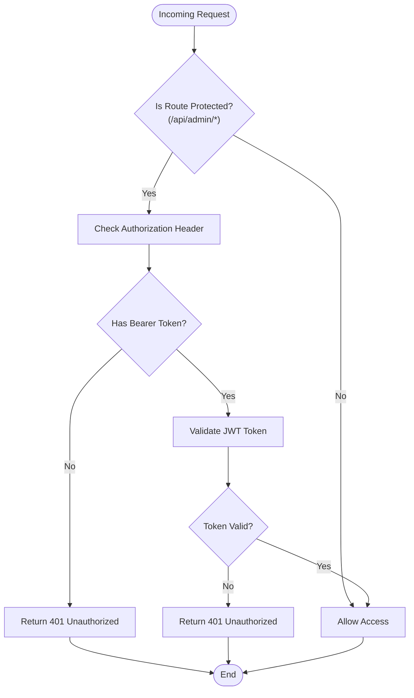
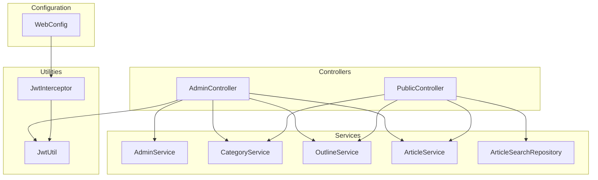

# Controller Layer Implementation

<cite>
**Referenced Files in This Document**
- [AdminController.java](file://blog-backend/src/main/java/com/blog/controller/AdminController.java)
- [PublicController.java](file://blog-backend/src/main/java/com/blog/controller/PublicController.java)
- [WebConfig.java](file://blog-backend/src/main/java/com/blog/config/WebConfig.java)
- [JwtInterceptor.java](file://blog-backend/src/main/java/com/blog/config/JwtInterceptor.java)
- [JwtUtil.java](file://blog-backend/src/main/java/com/blog/util/JwtUtil.java)
- [AdminService.java](file://blog-backend/src/main/java/com/blog/service/AdminService.java)
- [application.yml](file://blog-backend/src/main/resources/application.yml)
</cite>

## Table of Contents
1. [Introduction](#introduction)
2. [Project Structure](#project-structure)
3. [Core Components](#core-components)
4. [Architecture Overview](#architecture-overview)
5. [Detailed Component Analysis](#detailed-component-analysis)
6. [Dependency Analysis](#dependency-analysis)
7. [Performance Considerations](#performance-considerations)
8. [Troubleshooting Guide](#troubleshooting-guide)
9. [Conclusion](#conclusion)

## Introduction
This document provides comprehensive documentation for the Spring Boot controller layer implementation. It focuses on the AdminController and PublicController classes, detailing their RESTful endpoint design, HTTP method mappings, request/response handling patterns, and integration with WebConfig for CORS configuration and JwtInterceptor for authentication middleware. The documentation covers controller responsibilities including request validation, parameter binding, exception handling, and response formatting, along with examples of endpoint implementations, parameter handling, file upload processing, and error response patterns. Security considerations, performance optimization techniques, and controller best practices are also addressed.

## Project Structure
The controller layer is organized under the `com.blog.controller` package with two primary controllers:
- AdminController: Handles administrative operations including authentication, file uploads, and CRUD operations for categories, outlines, and articles.
- PublicController: Exposes read-only endpoints for categories, outlines, articles, and search functionality.

Both controllers utilize Spring MVC annotations for RESTful endpoint definition and leverage dependency injection for service layer integration. The controllers are configured with cross-origin support and integrate with a JWT interceptor for authentication enforcement.

**Diagram sources**
- [AdminController.java:19-23](file://blog-backend/src/main/java/com/blog/controller/AdminController.java#L19-L23)
- [PublicController.java:18-22](file://blog-backend/src/main/java/com/blog/controller/PublicController.java#L18-L22)
- [WebConfig.java:10-38](file://blog-backend/src/main/java/com/blog/config/WebConfig.java#L10-L38)
- [JwtInterceptor.java:12-35](file://blog-backend/src/main/java/com/blog/config/JwtInterceptor.java#L12-L35)

**Section sources**
- [AdminController.java:19-23](file://blog-backend/src/main/java/com/blog/controller/AdminController.java#L19-L23)
- [PublicController.java:18-22](file://blog-backend/src/main/java/com/blog/controller/PublicController.java#L18-L22)
- [WebConfig.java:10-38](file://blog-backend/src/main/java/com/blog/config/WebConfig.java#L10-L38)

## Core Components
The controller layer consists of two primary components with distinct responsibilities:

### AdminController Responsibilities
- Authentication management with JWT token generation
- File upload handling with secure storage
- Administrative CRUD operations for categories, outlines, and articles
- Request validation and error response formatting
- Cross-origin resource sharing configuration

### PublicController Responsibilities
- Public read-only data access
- Content discovery through outlines and categories
- Article retrieval and search functionality
- Parameter validation and response formatting

### Configuration Integration
- WebConfig manages CORS policies and interceptor registration
- JwtInterceptor enforces authentication for protected routes
- JwtUtil handles JWT token creation, validation, and extraction

**Section sources**
- [AdminController.java:25-29](file://blog-backend/src/main/java/com/blog/controller/AdminController.java#L25-L29)
- [PublicController.java:24-27](file://blog-backend/src/main/java/com/blog/controller/PublicController.java#L24-L27)
- [WebConfig.java:12-22](file://blog-backend/src/main/java/com/blog/config/WebConfig.java#L12-L22)
- [JwtInterceptor.java:14-34](file://blog-backend/src/main/java/com/blog/config/JwtInterceptor.java#L14-L34)

## Architecture Overview
The controller layer follows a layered architecture pattern with clear separation of concerns:

**Diagram sources**
- [AdminController.java:34-44](file://blog-backend/src/main/java/com/blog/controller/AdminController.java#L34-L44)
- [JwtInterceptor.java:16-34](file://blog-backend/src/main/java/com/blog/config/JwtInterceptor.java#L16-L34)
- [JwtUtil.java:25-47](file://blog-backend/src/main/java/com/blog/util/JwtUtil.java#L25-L47)

The architecture demonstrates clear request-response flows with authentication enforcement and proper error handling throughout the system.

**Section sources**
- [AdminController.java:34-44](file://blog-backend/src/main/java/com/blog/controller/AdminController.java#L34-L44)
- [JwtInterceptor.java:16-34](file://blog-backend/src/main/java/com/blog/config/JwtInterceptor.java#L16-L34)
- [JwtUtil.java:25-47](file://blog-backend/src/main/java/com/blog/util/JwtUtil.java#L25-L47)

## Detailed Component Analysis

### AdminController Analysis
The AdminController serves as the primary administrative interface, handling sensitive operations requiring authentication and authorization.

#### Authentication Endpoint
The `/api/admin/login` endpoint implements credential verification and JWT token generation:

**Diagram sources**
- [AdminController.java:34-44](file://blog-backend/src/main/java/com/blog/controller/AdminController.java#L34-L44)
- [AdminService.java:16-22](file://blog-backend/src/main/java/com/blog/service/AdminService.java#L16-L22)

#### File Upload Processing
The `/api/admin/upload` endpoint handles multipart file uploads with secure storage:

**Diagram sources**
- [AdminController.java:46-59](file://blog-backend/src/main/java/com/blog/controller/AdminController.java#L46-L59)

#### CRUD Operations
The controller implements comprehensive CRUD operations for administrative entities:

| Entity | Operations | HTTP Methods |
|--------|------------|--------------|
| Categories | Create, Update, Delete | POST, PUT, DELETE |
| Outlines | Create, Update, Delete | POST, PUT, DELETE |
| Articles | Create, Update, Delete | POST, PUT, DELETE |

Each operation follows consistent patterns:
- Request body validation through constructor-based binding
- Path variable extraction for ID-based operations
- Service layer delegation for business logic
- Standardized response formatting

**Section sources**
- [AdminController.java:62-119](file://blog-backend/src/main/java/com/blog/controller/AdminController.java#L62-L119)

### PublicController Analysis
The PublicController provides read-only access to blog content for anonymous users.

#### Content Discovery Endpoints
The controller implements several content discovery mechanisms:

**Diagram sources**
- [PublicController.java:29-60](file://blog-backend/src/main/java/com/blog/controller/PublicController.java#L29-L60)

#### Search Functionality
The `/api/search` endpoint provides Elasticsearch-backed article search with flexible keyword matching.

**Section sources**
- [PublicController.java:29-60](file://blog-backend/src/main/java/com/blog/controller/PublicController.java#L29-L60)

### WebConfig Integration
The WebConfig class manages cross-origin policies and interceptor registration:

**Diagram sources**
- [WebConfig.java:18-37](file://blog-backend/src/main/java/com/blog/config/WebConfig.java#L18-L37)

**Section sources**
- [WebConfig.java:18-37](file://blog-backend/src/main/java/com/blog/config/WebConfig.java#L18-L37)

### JwtInterceptor Authentication Flow
The JwtInterceptor enforces authentication for protected routes:

**Diagram sources**
- [JwtInterceptor.java:16-34](file://blog-backend/src/main/java/com/blog/config/JwtInterceptor.java#L16-L34)
- [JwtUtil.java:40-47](file://blog-backend/src/main/java/com/blog/util/JwtUtil.java#L40-L47)

**Section sources**
- [JwtInterceptor.java:16-34](file://blog-backend/src/main/java/com/blog/config/JwtInterceptor.java#L16-L34)
- [JwtUtil.java:40-47](file://blog-backend/src/main/java/com/blog/util/JwtUtil.java#L40-L47)

## Dependency Analysis
The controller layer exhibits strong dependency management with clear separation of concerns:

**Diagram sources**
- [AdminController.java:25-29](file://blog-backend/src/main/java/com/blog/controller/AdminController.java#L25-L29)
- [PublicController.java:24-27](file://blog-backend/src/main/java/com/blog/controller/PublicController.java#L24-L27)
- [WebConfig.java:12](file://blog-backend/src/main/java/com/blog/config/WebConfig.java#L12)
- [JwtInterceptor.java:14](file://blog-backend/src/main/java/com/blog/config/JwtInterceptor.java#L14)

### Key Dependencies
- **AdminController**: Depends on AdminService, CategoryService, OutlineService, ArticleService, and JwtUtil
- **PublicController**: Depends on CategoryService, OutlineService, ArticleService, and ArticleSearchRepository
- **JwtInterceptor**: Depends on JwtUtil for token validation
- **WebConfig**: Integrates JwtInterceptor and manages CORS policies

**Section sources**
- [AdminController.java:25-29](file://blog-backend/src/main/java/com/blog/controller/AdminController.java#L25-L29)
- [PublicController.java:24-27](file://blog-backend/src/main/java/com/blog/controller/PublicController.java#L24-L27)
- [WebConfig.java:12](file://blog-backend/src/main/java/com/blog/config/WebConfig.java#L12)

## Performance Considerations
Several performance optimization techniques are implemented throughout the controller layer:

### Response Optimization
- **Consistent Response Formatting**: Both controllers use ResponseEntity for standardized HTTP responses
- **Selective Data Loading**: PublicController endpoints return only necessary data for read operations
- **Efficient Parameter Binding**: Direct parameter binding reduces unnecessary object creation

### Security Performance
- **Early Validation**: JwtInterceptor performs token validation before service layer invocation
- **Minimal Dependencies**: Controllers maintain minimal dependencies to reduce overhead
- **Secure File Handling**: Upload processing validates file types and generates unique filenames

### Configuration Optimizations
- **CORS Caching**: Max age configuration reduces preflight request overhead
- **Resource Handler Optimization**: Direct file system mapping bypasses unnecessary processing
- **Interceptor Scope**: Targeted interceptor application minimizes authentication checks

**Section sources**
- [WebConfig.java:30-37](file://blog-backend/src/main/java/com/blog/config/WebConfig.java#L30-L37)
- [JwtInterceptor.java:16-34](file://blog-backend/src/main/java/com/blog/config/JwtInterceptor.java#L16-L34)

## Troubleshooting Guide

### Common Authentication Issues
- **401 Unauthorized Responses**: Verify Authorization header format (Bearer token)
- **Invalid Token Errors**: Check JWT secret configuration and expiration settings
- **Token Validation Failures**: Ensure proper token signing and verification keys

### File Upload Problems
- **Upload Directory Creation**: Verify upload path permissions and existence
- **File Extension Handling**: Check file type validation and extension extraction
- **Storage Path Configuration**: Confirm upload path matches WebConfig resource handler

### Endpoint Debugging
- **Parameter Binding Issues**: Validate request body structure matches entity expectations
- **Path Variable Extraction**: Ensure ID parameters are correctly formatted integers
- **Response Format Verification**: Check ResponseEntity usage for consistent HTTP status codes

### Configuration Troubleshooting
- **CORS Policy Conflicts**: Review allowed origins and methods configuration
- **Interceptor Registration**: Verify protected route patterns and exclusions
- **Resource Handler Mapping**: Confirm file system path accessibility

**Section sources**
- [AdminController.java:34-44](file://blog-backend/src/main/java/com/blog/controller/AdminController.java#L34-L44)
- [JwtInterceptor.java:16-34](file://blog-backend/src/main/java/com/blog/config/JwtInterceptor.java#L16-L34)
- [WebConfig.java:18-28](file://blog-backend/src/main/java/com/blog/config/WebConfig.java#L18-L28)

## Conclusion
The controller layer implementation demonstrates robust RESTful design principles with clear separation of concerns, comprehensive authentication enforcement, and efficient resource management. The AdminController provides secure administrative capabilities with proper validation and error handling, while the PublicController offers streamlined access to published content. The integration with WebConfig and JwtInterceptor ensures consistent security policies across protected routes. The architecture supports scalability through modular design, maintains performance through optimized configurations, and provides maintainability through clear dependency management and standardized response patterns.