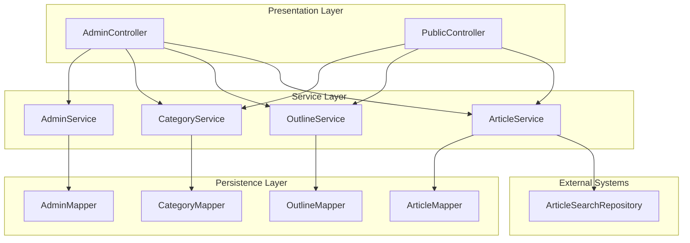
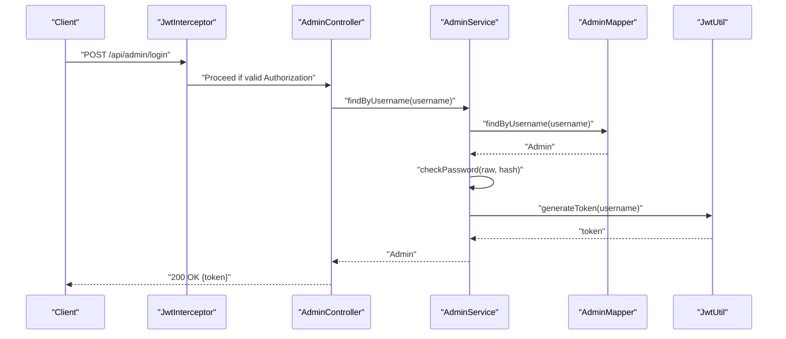
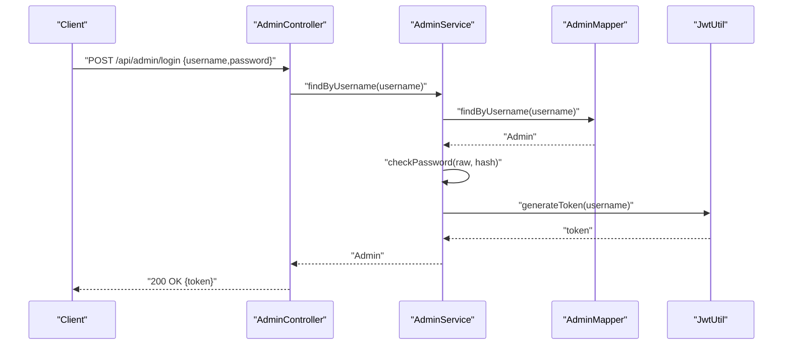
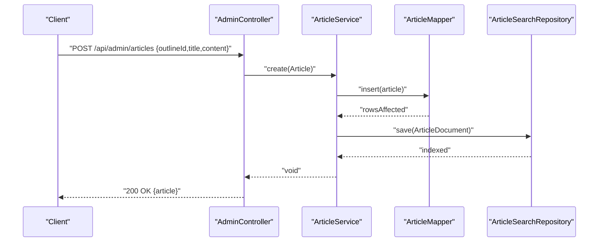
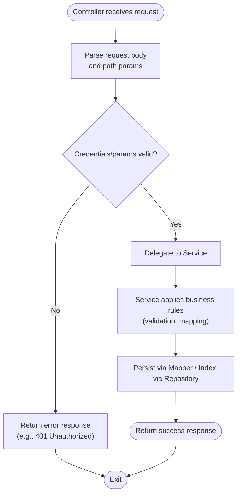
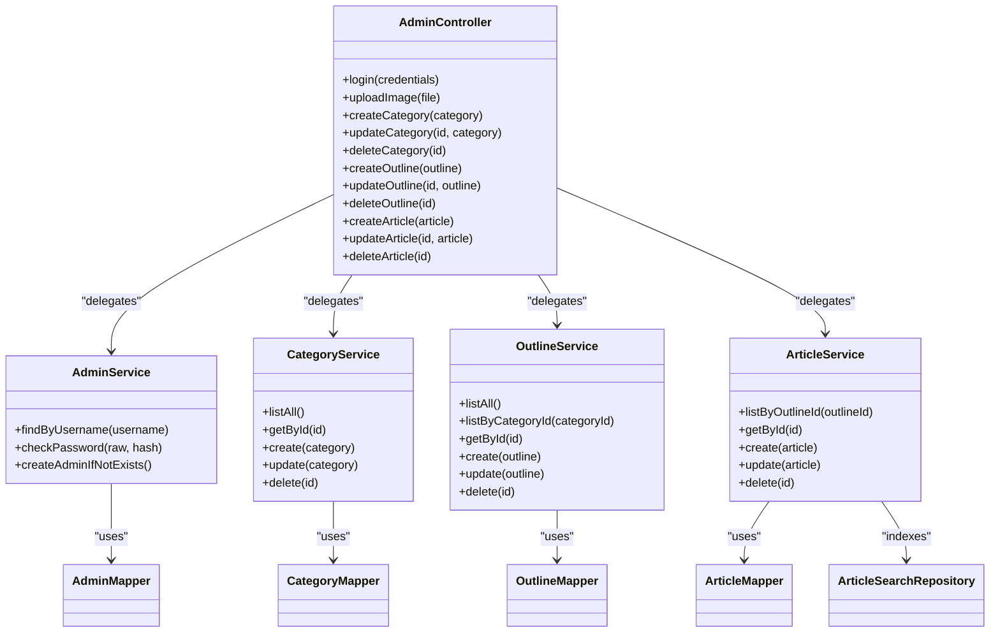
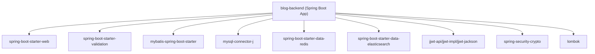

# Layer Interaction and Data Flow

<cite>
**Referenced Files in This Document**
- [BlogApplication.java](file://blog-backend/src/main/java/com/blog/BlogApplication.java)
- [WebConfig.java](file://blog-backend/src/main/java/com/blog/config/WebConfig.java)
- [JwtInterceptor.java](file://blog-backend/src/main/java/com/blog/config/JwtInterceptor.java)
- [AdminController.java](file://blog-backend/src/main/java/com/blog/controller/AdminController.java)
- [PublicController.java](file://blog-backend/src/main/java/com/blog/controller/PublicController.java)
- [AdminService.java](file://blog-backend/src/main/java/com/blog/service/AdminService.java)
- [ArticleService.java](file://blog-backend/src/main/java/com/blog/service/ArticleService.java)
- [CategoryService.java](file://blog-backend/src/main/java/com/blog/service/CategoryService.java)
- [OutlineService.java](file://blog-backend/src/main/java/com/blog/service/OutlineService.java)
- [AdminMapper.java](file://blog-backend/src/main/java/com/blog/mapper/AdminMapper.java)
- [ArticleMapper.java](file://blog-backend/src/main/java/com/blog/mapper/ArticleMapper.java)
- [CategoryMapper.java](file://blog-backend/src/main/java/com/blog/mapper/CategoryMapper.java)
- [OutlineMapper.java](file://blog-backend/src/main/java/com/blog/mapper/OutlineMapper.java)
- [ArticleSearchRepository.java](file://blog-backend/src/main/java/com/blog/repository/ArticleSearchRepository.java)
- [application.yml](file://blog-backend/src/main/resources/application.yml)
- [pom.xml](file://blog-backend/pom.xml)
</cite>

## Table of Contents
1. [Introduction](#introduction)
2. [Project Structure](#project-structure)
3. [Core Components](#core-components)
4. [Architecture Overview](#architecture-overview)
5. [Detailed Component Analysis](#detailed-component-analysis)
6. [Dependency Analysis](#dependency-analysis)
7. [Performance Considerations](#performance-considerations)
8. [Troubleshooting Guide](#troubleshooting-guide)
9. [Conclusion](#conclusion)

## Introduction
This document explains the interaction patterns and data flow across the MVC layers of the backend service. It traces how HTTP requests enter via controllers, pass through services for business logic and caching, and reach repositories and mappers for persistence and search. It also documents object mapping, validation, error propagation, dependency injection, service composition, and transaction boundaries. Concrete examples illustrate typical request-response cycles, validation flows, and error handling. Finally, it covers performance characteristics, logging strategies, and debugging techniques for layered architectures.

## Project Structure
The backend follows a layered Spring Boot architecture:
- Controllers expose REST endpoints under /api and /api/admin.
- Services encapsulate business logic, caching, and orchestrate persistence/search operations.
- Mappers define SQL operations via MyBatis.
- Repositories integrate with external systems (Elasticsearch).
- Configuration wires interceptors, CORS, resource handlers, and caches.

**Diagram sources**
- [AdminController.java:19-121](file://blog-backend/src/main/java/com/blog/controller/AdminController.java#L19-L121)
- [PublicController.java:18-62](file://blog-backend/src/main/java/com/blog/controller/PublicController.java#L18-L62)
- [AdminService.java:9-34](file://blog-backend/src/main/java/com/blog/service/AdminService.java#L9-L34)
- [CategoryService.java:12-42](file://blog-backend/src/main/java/com/blog/service/CategoryService.java#L12-L42)
- [OutlineService.java:12-47](file://blog-backend/src/main/java/com/blog/service/OutlineService.java#L12-L47)
- [ArticleService.java:15-72](file://blog-backend/src/main/java/com/blog/service/ArticleService.java#L15-L72)
- [AdminMapper.java:6-16](file://blog-backend/src/main/java/com/blog/mapper/AdminMapper.java#L6-L16)
- [CategoryMapper.java:8-27](file://blog-backend/src/main/java/com/blog/mapper/CategoryMapper.java#L8-L27)
- [OutlineMapper.java:8-30](file://blog-backend/src/main/java/com/blog/mapper/OutlineMapper.java#L8-L30)
- [ArticleMapper.java:8-27](file://blog-backend/src/main/java/com/blog/mapper/ArticleMapper.java#L8-L27)
- [ArticleSearchRepository.java:8-12](file://blog-backend/src/main/java/com/blog/repository/ArticleSearchRepository.java#L8-L12)

**Section sources**
- [BlogApplication.java:8-16](file://blog-backend/src/main/java/com/blog/BlogApplication.java#L8-L16)
- [WebConfig.java:10-39](file://blog-backend/src/main/java/com/blog/config/WebConfig.java#L10-L39)
- [pom.xml:25-91](file://blog-backend/pom.xml#L25-L91)

## Core Components
- Controllers: Expose endpoints for admin operations (/api/admin/*) and public queries (/api/*). They accept DTO-like bodies, handle multipart uploads, and return ResponseEntity responses.
- Services: Implement business logic, enforce cache policies, and coordinate persistence and search updates. They use MyBatis mappers and Spring Data Elasticsearch repositories.
- Mappers: Define SQL operations for CRUD on domain entities.
- Repositories: Integrate with Elasticsearch for article search indexing and retrieval.
- Configuration: Registers interceptors, CORS, and resource handlers; enables caching and MyBatis scanning.

**Section sources**
- [AdminController.java:34-121](file://blog-backend/src/main/java/com/blog/controller/AdminController.java#L34-L121)
- [PublicController.java:29-61](file://blog-backend/src/main/java/com/blog/controller/PublicController.java#L29-L61)
- [AdminService.java:16-32](file://blog-backend/src/main/java/com/blog/service/AdminService.java#L16-L32)
- [ArticleService.java:23-71](file://blog-backend/src/main/java/com/blog/service/ArticleService.java#L23-L71)
- [CategoryService.java:18-41](file://blog-backend/src/main/java/com/blog/service/CategoryService.java#L18-L41)
- [OutlineService.java:18-46](file://blog-backend/src/main/java/com/blog/service/OutlineService.java#L18-L46)
- [AdminMapper.java:9-14](file://blog-backend/src/main/java/com/blog/mapper/AdminMapper.java#L9-L14)
- [ArticleMapper.java:11-25](file://blog-backend/src/main/java/com/blog/mapper/ArticleMapper.java#L11-L25)
- [CategoryMapper.java:11-25](file://blog-backend/src/main/java/com/blog/mapper/CategoryMapper.java#L11-L25)
- [OutlineMapper.java:11-28](file://blog-backend/src/main/java/com/blog/mapper/OutlineMapper.java#L11-L28)
- [ArticleSearchRepository.java:8-11](file://blog-backend/src/main/java/com/blog/repository/ArticleSearchRepository.java#L8-L11)
- [WebConfig.java:17-38](file://blog-backend/src/main/java/com/blog/config/WebConfig.java#L17-L38)
- [application.yml:4-33](file://blog-backend/src/main/resources/application.yml#L4-L33)

## Architecture Overview
The system integrates Spring MVC, MyBatis, Spring Data Redis, and Spring Data Elasticsearch. Controllers receive requests and delegate to services. Services apply validation, transform domain objects, and persist or index data. Mappers execute SQL; repositories manage Elasticsearch documents. Interceptors enforce JWT-based authentication for admin endpoints.

**Diagram sources**
- [JwtInterceptor.java:16-34](file://blog-backend/src/main/java/com/blog/config/JwtInterceptor.java#L16-L34)
- [AdminController.java:34-44](file://blog-backend/src/main/java/com/blog/controller/AdminController.java#L34-L44)
- [AdminService.java:16-22](file://blog-backend/src/main/java/com/blog/service/AdminService.java#L16-L22)
- [AdminMapper.java:9-10](file://blog-backend/src/main/java/com/blog/mapper/AdminMapper.java#L9-L10)
- [application.yml:27-30](file://blog-backend/src/main/resources/application.yml#L27-L30)

## Detailed Component Analysis

### Request Lifecycle: Admin Login
This flow demonstrates controller delegation, service validation, and token generation.

**Diagram sources**
- [AdminController.java:34-44](file://blog-backend/src/main/java/com/blog/controller/AdminController.java#L34-L44)
- [AdminService.java:16-22](file://blog-backend/src/main/java/com/blog/service/AdminService.java#L16-L22)
- [AdminMapper.java:9-10](file://blog-backend/src/main/java/com/blog/mapper/AdminMapper.java#L9-L10)
- [application.yml:27-30](file://blog-backend/src/main/resources/application.yml#L27-L30)

**Section sources**
- [AdminController.java:34-44](file://blog-backend/src/main/java/com/blog/controller/AdminController.java#L34-L44)
- [AdminService.java:16-22](file://blog-backend/src/main/java/com/blog/service/AdminService.java#L16-L22)
- [AdminMapper.java:9-10](file://blog-backend/src/main/java/com/blog/mapper/AdminMapper.java#L9-L10)

### Request Lifecycle: Create Article with Search Indexing
This flow shows service composition, object mapping, and search indexing.

**Diagram sources**
- [AdminController.java:102-106](file://blog-backend/src/main/java/com/blog/controller/AdminController.java#L102-L106)
- [ArticleService.java:32-45](file://blog-backend/src/main/java/com/blog/service/ArticleService.java#L32-L45)
- [ArticleMapper.java:17-19](file://blog-backend/src/main/java/com/blog/mapper/ArticleMapper.java#L17-L19)
- [ArticleSearchRepository.java:8-11](file://blog-backend/src/main/java/com/blog/repository/ArticleSearchRepository.java#L8-L11)

**Section sources**
- [ArticleService.java:32-45](file://blog-backend/src/main/java/com/blog/service/ArticleService.java#L32-L45)
- [ArticleMapper.java:17-19](file://blog-backend/src/main/java/com/blog/mapper/ArticleMapper.java#L17-L19)
- [ArticleSearchRepository.java:8-11](file://blog-backend/src/main/java/com/blog/repository/ArticleSearchRepository.java#L8-L11)

### Validation and Error Propagation
- Controller-level validation: The admin login endpoint reads fields from the request body and returns explicit 401 responses for invalid credentials.
- Service-level validation: Password verification uses a secure encoder; failures propagate as unauthorized responses.
- Repository-level resilience: Elasticsearch indexing is wrapped in try/catch with warnings logged; persistence continues unaffected.

**Diagram sources**
- [AdminController.java:34-44](file://blog-backend/src/main/java/com/blog/controller/AdminController.java#L34-L44)
- [AdminService.java:20-22](file://blog-backend/src/main/java/com/blog/service/AdminService.java#L20-L22)
- [ArticleService.java:40-44](file://blog-backend/src/main/java/com/blog/service/ArticleService.java#L40-L44)

**Section sources**
- [AdminController.java:34-44](file://blog-backend/src/main/java/com/blog/controller/AdminController.java#L34-L44)
- [AdminService.java:20-22](file://blog-backend/src/main/java/com/blog/service/AdminService.java#L20-L22)
- [ArticleService.java:40-44](file://blog-backend/src/main/java/com/blog/service/ArticleService.java#L40-L44)

### Data Transformation Between Layers
- Object mapping: Services construct ArticleDocument from Article for indexing; mappers map SQL rows to entities.
- Validation: Services validate passwords and enforce cache policies; controllers validate presence of credentials.
- Error propagation: Exceptions during indexing are caught and logged; persistence operations continue.

**Diagram sources**
- [AdminController.java:25-29](file://blog-backend/src/main/java/com/blog/controller/AdminController.java#L25-L29)
- [AdminService.java:13-14](file://blog-backend/src/main/java/com/blog/service/AdminService.java#L13-L14)
- [CategoryService.java:16](file://blog-backend/src/main/java/com/blog/service/CategoryService.java#L16)
- [OutlineService.java:16](file://blog-backend/src/main/java/com/blog/service/OutlineService.java#L16)
- [ArticleService.java:20-21](file://blog-backend/src/main/java/com/blog/service/ArticleService.java#L20-L21)
- [AdminMapper.java:6-16](file://blog-backend/src/main/java/com/blog/mapper/AdminMapper.java#L6-L16)
- [CategoryMapper.java:8-27](file://blog-backend/src/main/java/com/blog/mapper/CategoryMapper.java#L8-L27)
- [OutlineMapper.java:8-30](file://blog-backend/src/main/java/com/blog/mapper/OutlineMapper.java#L8-L30)
- [ArticleMapper.java:8-27](file://blog-backend/src/main/java/com/blog/mapper/ArticleMapper.java#L8-L27)
- [ArticleSearchRepository.java:8-12](file://blog-backend/src/main/java/com/blog/repository/ArticleSearchRepository.java#L8-L12)

**Section sources**
- [ArticleService.java:36-41](file://blog-backend/src/main/java/com/blog/service/ArticleService.java#L36-L41)
- [ArticleMapper.java:11-19](file://blog-backend/src/main/java/com/blog/mapper/ArticleMapper.java#L11-L19)
- [ArticleSearchRepository.java:8-11](file://blog-backend/src/main/java/com/blog/repository/ArticleSearchRepository.java#L8-L11)

### Transaction Boundary Management
- Persistence transactions: Managed by MyBatis/Spring within service methods. There is no explicit transaction demarcation; defaults apply per operation.
- Search indexing: Performed outside strict transactional boundaries; failures are logged and do not rollback persistence.

**Section sources**
- [ArticleService.java:32-45](file://blog-backend/src/main/java/com/blog/service/ArticleService.java#L32-L45)
- [ArticleService.java:62-70](file://blog-backend/src/main/java/com/blog/service/ArticleService.java#L62-L70)

## Dependency Analysis
The application leverages Spring Boot starters and third-party libraries for web, validation, MyBatis, MySQL, Redis, Elasticsearch, JWT, and security crypto.

**Diagram sources**
- [pom.xml:25-91](file://blog-backend/pom.xml#L25-L91)

**Section sources**
- [pom.xml:25-91](file://blog-backend/pom.xml#L25-L91)

## Performance Considerations
- Caching: Services use cacheable and evict annotations to reduce database load. Configure cache providers and TTL appropriately.
- Asynchronous indexing: Elasticsearch indexing occurs after persistence; consider async indexing for improved latency.
- Connection pooling: Ensure datasource pool sizing matches workload; monitor slow SQL via MyBatis logging.
- Interceptor overhead: JWT checks occur per admin request; keep token validation lightweight.
- Resource serving: Static uploads are served via configured resource handlers; ensure upload path permissions and disk I/O are optimized.

[No sources needed since this section provides general guidance]

## Troubleshooting Guide
- Authentication failures: Verify Authorization header format and token validity; inspect interceptor logs and JWT configuration.
- Upload failures: Confirm upload path exists and is writable; check file size limits and content type restrictions.
- Search indexing errors: Review Elasticsearch connectivity and repository save/delete operations; note that failures are logged but do not block persistence.
- CORS issues: Confirm CORS configuration allows expected origins/methods/headers.
- Logging: Enable appropriate log levels for controllers, services, and repositories to trace request flow and exceptions.

**Section sources**
- [WebConfig.java:17-38](file://blog-backend/src/main/java/com/blog/config/WebConfig.java#L17-L38)
- [JwtInterceptor.java:16-34](file://blog-backend/src/main/java/com/blog/config/JwtInterceptor.java#L16-L34)
- [application.yml:4-33](file://blog-backend/src/main/resources/application.yml#L4-L33)
- [ArticleService.java:40-44](file://blog-backend/src/main/java/com/blog/service/ArticleService.java#L40-L44)

## Conclusion
The backend enforces a clean separation of concerns across MVC layers. Controllers focus on transport and basic validation, services encapsulate business logic and caching, and mappers/repositories handle persistence and search. Dependency injection wires components seamlessly, while interceptors and configuration support security and cross-cutting concerns. The documented flows, transformations, and error-handling patterns provide a blueprint for extending and maintaining the system reliably.