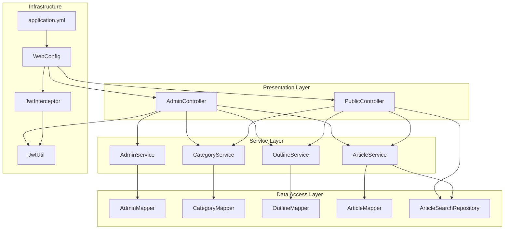
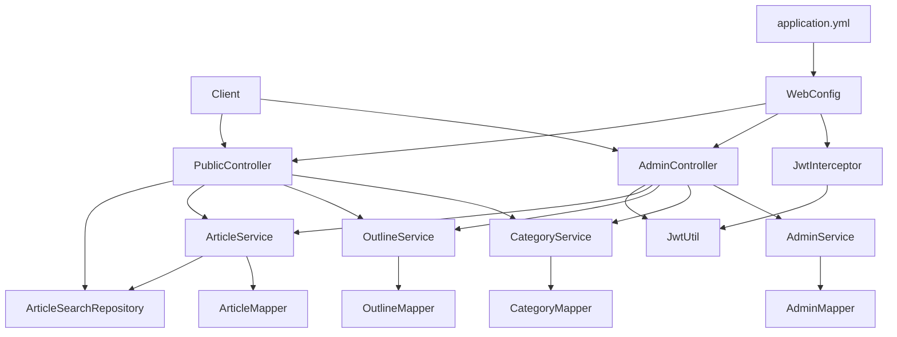
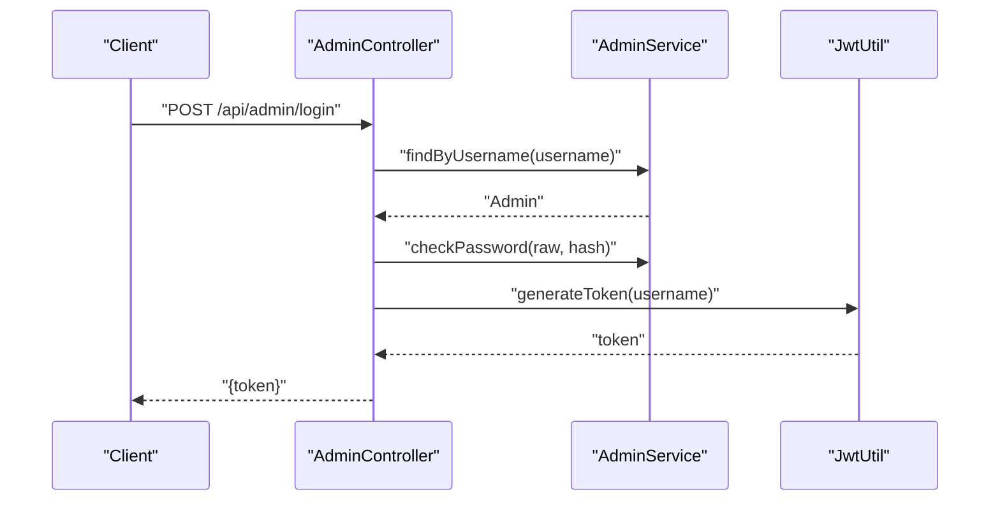
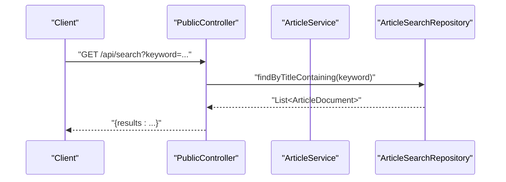
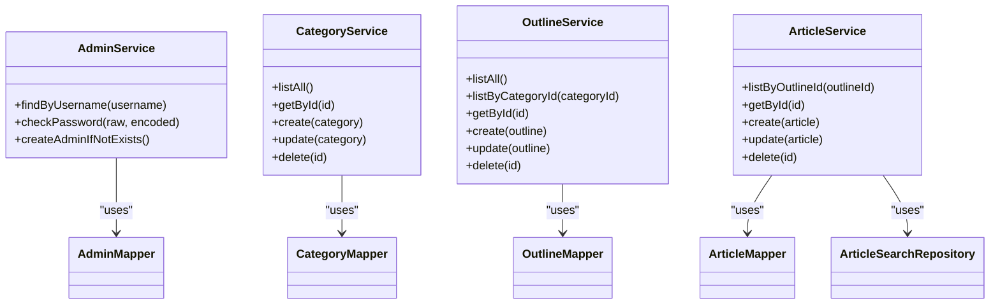
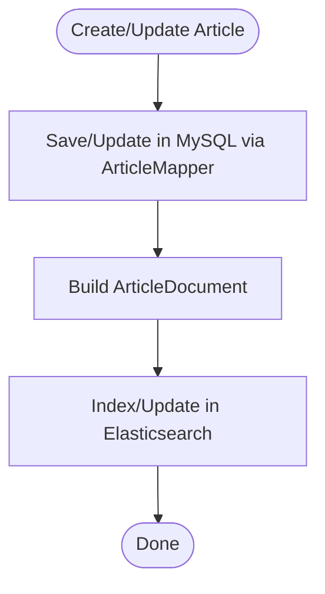
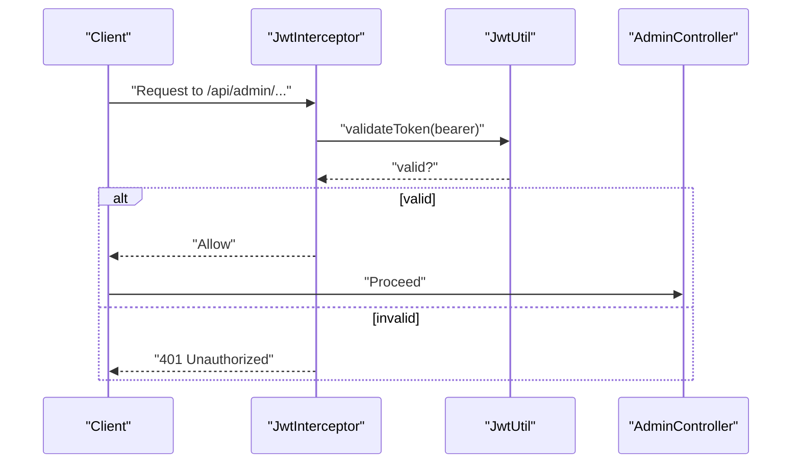
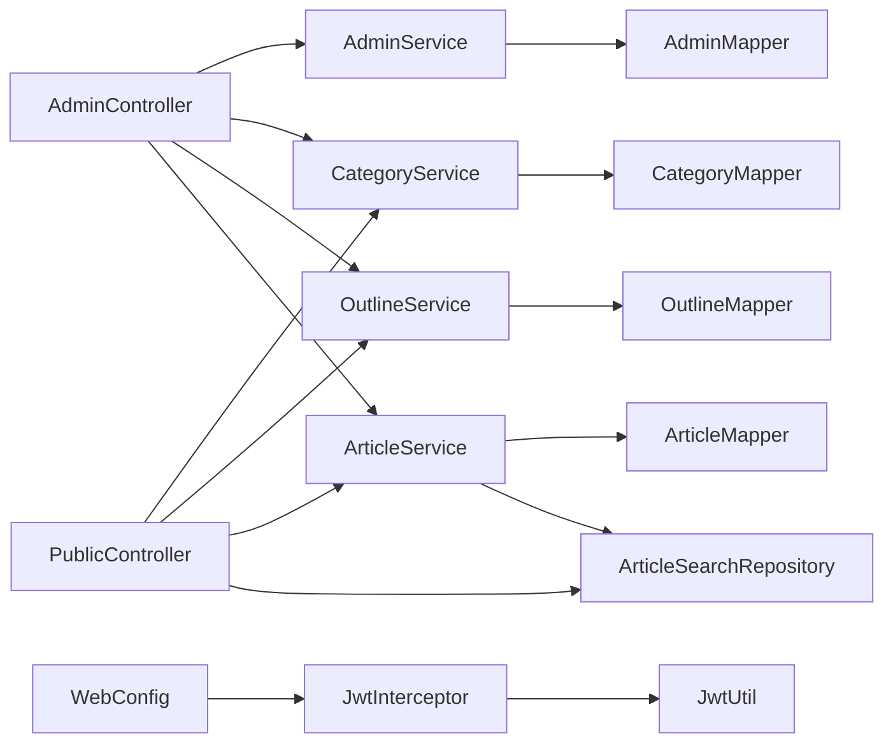

# MVC Architecture and Layered Design

<cite>
**Referenced Files in This Document**
- [AdminController.java](file://blog-backend/src/main/java/com/blog/controller/AdminController.java)
- [PublicController.java](file://blog-backend/src/main/java/com/blog/controller/PublicController.java)
- [AdminService.java](file://blog-backend/src/main/java/com/blog/service/AdminService.java)
- [ArticleService.java](file://blog-backend/src/main/java/com/blog/service/ArticleService.java)
- [CategoryService.java](file://blog-backend/src/main/java/com/blog/service/CategoryService.java)
- [OutlineService.java](file://blog-backend/src/main/java/com/blog/service/OutlineService.java)
- [ArticleSearchRepository.java](file://blog-backend/src/main/java/com/blog/repository/ArticleSearchRepository.java)
- [AdminMapper.java](file://blog-backend/src/main/java/com/blog/mapper/AdminMapper.java)
- [ArticleMapper.java](file://blog-backend/src/main/java/com/blog/mapper/ArticleMapper.java)
- [CategoryMapper.java](file://blog-backend/src/main/java/com/blog/mapper/CategoryMapper.java)
- [OutlineMapper.java](file://blog-backend/src/main/java/com/blog/mapper/OutlineMapper.java)
- [JwtUtil.java](file://blog-backend/src/main/java/com/blog/util/JwtUtil.java)
- [WebConfig.java](file://blog-backend/src/main/java/com/blog/config/WebConfig.java)
- [JwtInterceptor.java](file://blog-backend/src/main/java/com/blog/config/JwtInterceptor.java)
- [application.yml](file://blog-backend/src/main/resources/application.yml)
</cite>

## Table of Contents
1. [Introduction](#introduction)
2. [Project Structure](#project-structure)
3. [Core Components](#core-components)
4. [Architecture Overview](#architecture-overview)
5. [Detailed Component Analysis](#detailed-component-analysis)
6. [Dependency Analysis](#dependency-analysis)
7. [Performance Considerations](#performance-considerations)
8. [Troubleshooting Guide](#troubleshooting-guide)
9. [Conclusion](#conclusion)

## Introduction
This document explains the Model-View-Controller (MVC) architecture and layered design implemented in the blog backend. The system separates concerns across three primary layers:
- Controllers: Handle HTTP requests and responses, coordinate cross-layer operations, and enforce security policies.
- Services: Encapsulate business logic, orchestrate domain operations, and manage caching and search indexing.
- Repositories/Mappers: Define data access contracts and implement persistence operations.

The backend integrates Spring MVC for web handling, MyBatis for SQL mapping, Spring Cache for caching, and Spring Data Elasticsearch for search indexing. Security is enforced via JWT tokens handled by an interceptor.

## Project Structure
The backend follows a conventional Maven layout with packages organized by layer:
- com.blog.controller: REST endpoints for admin and public APIs
- com.blog.service: Business logic and cache/search coordination
- com.blog.repository: Elasticsearch repository interface
- com.blog.mapper: MyBatis mapper interfaces for SQL operations
- com.blog.util: JWT utilities
- com.blog.config: Web configuration and interceptors
- resources: Application configuration and SQL scripts

**Diagram sources**
- [AdminController.java:19-121](file://blog-backend/src/main/java/com/blog/controller/AdminController.java#L19-L121)
- [PublicController.java:18-62](file://blog-backend/src/main/java/com/blog/controller/PublicController.java#L18-L62)
- [AdminService.java:9-34](file://blog-backend/src/main/java/com/blog/service/AdminService.java#L9-L34)
- [CategoryService.java:12-42](file://blog-backend/src/main/java/com/blog/service/CategoryService.java#L12-L42)
- [OutlineService.java:12-47](file://blog-backend/src/main/java/com/blog/service/OutlineService.java#L12-L47)
- [ArticleService.java:15-72](file://blog-backend/src/main/java/com/blog/service/ArticleService.java#L15-L72)
- [AdminMapper.java:6-16](file://blog-backend/src/main/java/com/blog/mapper/AdminMapper.java#L6-L16)
- [CategoryMapper.java:8-27](file://blog-backend/src/main/java/com/blog/mapper/CategoryMapper.java#L8-L27)
- [OutlineMapper.java:8-30](file://blog-backend/src/main/java/com/blog/mapper/OutlineMapper.java#L8-L30)
- [ArticleMapper.java:8-27](file://blog-backend/src/main/java/com/blog/mapper/ArticleMapper.java#L8-L27)
- [ArticleSearchRepository.java:1-12](file://blog-backend/src/main/java/com/blog/repository/ArticleSearchRepository.java#L1-L12)
- [JwtUtil.java:12-57](file://blog-backend/src/main/java/com/blog/util/JwtUtil.java#L12-L57)
- [JwtInterceptor.java:10-36](file://blog-backend/src/main/java/com/blog/config/JwtInterceptor.java#L10-L36)
- [WebConfig.java:8-39](file://blog-backend/src/main/java/com/blog/config/WebConfig.java#L8-L39)
- [application.yml:1-33](file://blog-backend/src/main/resources/application.yml#L1-L33)

**Section sources**
- [application.yml:1-33](file://blog-backend/src/main/resources/application.yml#L1-L33)

## Core Components
This section documents the responsibilities and interactions among controllers, services, and repositories/mappers.

- Controllers
  - AdminController: Exposes admin endpoints for login, image upload, and CRUD operations on categories, outlines, and articles. It delegates business logic to services and manages file uploads and JWT token generation.
  - PublicController: Provides read-only endpoints for categories, outlines, articles, article retrieval by ID, and article search using Elasticsearch.

- Services
  - AdminService: Handles admin authentication by finding admins and validating passwords using BCrypt. Also seeds an initial admin account if missing.
  - CategoryService: Manages categories with caching for listing and CRUD operations.
  - OutlineService: Manages outlines with caching for listing and filtering by category, plus CRUD operations.
  - ArticleService: Orchestrates article CRUD, caching, and Elasticsearch indexing/updating/deletion.

- Repositories/Mappers
  - AdminMapper: SQL operations for admin lookup and creation.
  - CategoryMapper: SQL operations for categories.
  - OutlineMapper: SQL operations for outlines.
  - ArticleMapper: SQL operations for articles.
  - ArticleSearchRepository: Elasticsearch repository for article search.

**Section sources**
- [AdminController.java:19-121](file://blog-backend/src/main/java/com/blog/controller/AdminController.java#L19-L121)
- [PublicController.java:18-62](file://blog-backend/src/main/java/com/blog/controller/PublicController.java#L18-L62)
- [AdminService.java:9-34](file://blog-backend/src/main/java/com/blog/service/AdminService.java#L9-L34)
- [CategoryService.java:12-42](file://blog-backend/src/main/java/com/blog/service/CategoryService.java#L12-L42)
- [OutlineService.java:12-47](file://blog-backend/src/main/java/com/blog/service/OutlineService.java#L12-L47)
- [ArticleService.java:15-72](file://blog-backend/src/main/java/com/blog/service/ArticleService.java#L15-L72)
- [AdminMapper.java:6-16](file://blog-backend/src/main/java/com/blog/mapper/AdminMapper.java#L6-L16)
- [CategoryMapper.java:8-27](file://blog-backend/src/main/java/com/blog/mapper/CategoryMapper.java#L8-L27)
- [OutlineMapper.java:8-30](file://blog-backend/src/main/java/com/blog/mapper/OutlineMapper.java#L8-L30)
- [ArticleMapper.java:8-27](file://blog-backend/src/main/java/com/blog/mapper/ArticleMapper.java#L8-L27)
- [ArticleSearchRepository.java:1-12](file://blog-backend/src/main/java/com/blog/repository/ArticleSearchRepository.java#L1-L12)

## Architecture Overview
The system enforces a strict layered architecture:
- Presentation: Controllers accept HTTP requests, validate inputs, and return structured responses.
- Business: Services encapsulate domain logic, handle caching, and coordinate data/index updates.
- Persistence: Mappers define SQL operations; Elasticsearch repository defines search operations.
- Infrastructure: WebConfig registers interceptors and resource handlers; JwtInterceptor enforces JWT validation; JwtUtil generates and validates tokens.

**Diagram sources**
- [AdminController.java:19-121](file://blog-backend/src/main/java/com/blog/controller/AdminController.java#L19-L121)
- [PublicController.java:18-62](file://blog-backend/src/main/java/com/blog/controller/PublicController.java#L18-L62)
- [AdminService.java:9-34](file://blog-backend/src/main/java/com/blog/service/AdminService.java#L9-L34)
- [CategoryService.java:12-42](file://blog-backend/src/main/java/com/blog/service/CategoryService.java#L12-L42)
- [OutlineService.java:12-47](file://blog-backend/src/main/java/com/blog/service/OutlineService.java#L12-L47)
- [ArticleService.java:15-72](file://blog-backend/src/main/java/com/blog/service/ArticleService.java#L15-L72)
- [AdminMapper.java:6-16](file://blog-backend/src/main/java/com/blog/mapper/AdminMapper.java#L6-L16)
- [CategoryMapper.java:8-27](file://blog-backend/src/main/java/com/blog/mapper/CategoryMapper.java#L8-L27)
- [OutlineMapper.java:8-30](file://blog-backend/src/main/java/com/blog/mapper/OutlineMapper.java#L8-L30)
- [ArticleMapper.java:8-27](file://blog-backend/src/main/java/com/blog/mapper/ArticleMapper.java#L8-L27)
- [ArticleSearchRepository.java:1-12](file://blog-backend/src/main/java/com/blog/repository/ArticleSearchRepository.java#L1-L12)
- [JwtUtil.java:12-57](file://blog-backend/src/main/java/com/blog/util/JwtUtil.java#L12-L57)
- [JwtInterceptor.java:10-36](file://blog-backend/src/main/java/com/blog/config/JwtInterceptor.java#L10-L36)
- [WebConfig.java:8-39](file://blog-backend/src/main/java/com/blog/config/WebConfig.java#L8-L39)
- [application.yml:1-33](file://blog-backend/src/main/resources/application.yml#L1-L33)

## Detailed Component Analysis

### Controllers: AdminController and PublicController
- AdminController responsibilities
  - Authentication: Validates credentials against stored hashes and issues JWT tokens.
  - File upload: Saves uploaded images to a configured directory and returns a public URL.
  - CRUD operations: Delegates category, outline, and article management to respective services.
- PublicController responsibilities
  - Lists categories and outlines (optionally filtered by category).
  - Retrieves articles by outline and individual article by ID.
  - Performs article search using Elasticsearch.

**Diagram sources**
- [AdminController.java:34-44](file://blog-backend/src/main/java/com/blog/controller/AdminController.java#L34-L44)
- [AdminService.java:16-22](file://blog-backend/src/main/java/com/blog/service/AdminService.java#L16-L22)
- [JwtUtil.java:25-34](file://blog-backend/src/main/java/com/blog/util/JwtUtil.java#L25-L34)

**Diagram sources**
- [PublicController.java:56-60](file://blog-backend/src/main/java/com/blog/controller/PublicController.java#L56-L60)
- [ArticleSearchRepository.java:10](file://blog-backend/src/main/java/com/blog/repository/ArticleSearchRepository.java#L10)

**Section sources**
- [AdminController.java:19-121](file://blog-backend/src/main/java/com/blog/controller/AdminController.java#L19-L121)
- [PublicController.java:18-62](file://blog-backend/src/main/java/com/blog/controller/PublicController.java#L18-L62)

### Services: Business Logic Encapsulation
- AdminService
  - Finds admin by username and checks password using BCrypt.
  - Seeds an initial admin account if none exists.
- CategoryService
  - Lists categories with caching; CRUD operations evict caches.
- OutlineService
  - Lists outlines with caching; supports category-filtered lists; CRUD operations evict caches.
- ArticleService
  - Lists articles by outline; retrieves by ID with cache.
  - Creates/updates articles and synchronizes Elasticsearch index; deletes remove index entries.

**Diagram sources**
- [AdminService.java:9-34](file://blog-backend/src/main/java/com/blog/service/AdminService.java#L9-L34)
- [CategoryService.java:12-42](file://blog-backend/src/main/java/com/blog/service/CategoryService.java#L12-L42)
- [OutlineService.java:12-47](file://blog-backend/src/main/java/com/blog/service/OutlineService.java#L12-L47)
- [ArticleService.java:15-72](file://blog-backend/src/main/java/com/blog/service/ArticleService.java#L15-L72)
- [AdminMapper.java:6-16](file://blog-backend/src/main/java/com/blog/mapper/AdminMapper.java#L6-L16)
- [CategoryMapper.java:8-27](file://blog-backend/src/main/java/com/blog/mapper/CategoryMapper.java#L8-L27)
- [OutlineMapper.java:8-30](file://blog-backend/src/main/java/com/blog/mapper/OutlineMapper.java#L8-L30)
- [ArticleMapper.java:8-27](file://blog-backend/src/main/java/com/blog/mapper/ArticleMapper.java#L8-L27)
- [ArticleSearchRepository.java:1-12](file://blog-backend/src/main/java/com/blog/repository/ArticleSearchRepository.java#L1-L12)

**Section sources**
- [AdminService.java:9-34](file://blog-backend/src/main/java/com/blog/service/AdminService.java#L9-L34)
- [CategoryService.java:12-42](file://blog-backend/src/main/java/com/blog/service/CategoryService.java#L12-L42)
- [OutlineService.java:12-47](file://blog-backend/src/main/java/com/blog/service/OutlineService.java#L12-L47)
- [ArticleService.java:15-72](file://blog-backend/src/main/java/com/blog/service/ArticleService.java#L15-L72)

### Repository/Data Access Patterns
- AdminMapper: SQL queries for admin lookup and insertion.
- CategoryMapper: SQL queries for listing, single record, and CRUD operations.
- OutlineMapper: SQL queries for listing, category-filtered listing, and CRUD operations.
- ArticleMapper: SQL queries for listing by outline, single record, and CRUD operations.
- ArticleSearchRepository: Extends ElasticsearchRepository to support text search.

**Diagram sources**
- [ArticleService.java:32-60](file://blog-backend/src/main/java/com/blog/service/ArticleService.java#L32-L60)
- [ArticleMapper.java:17-22](file://blog-backend/src/main/java/com/blog/mapper/ArticleMapper.java#L17-L22)
- [ArticleSearchRepository.java:1-12](file://blog-backend/src/main/java/com/blog/repository/ArticleSearchRepository.java#L1-L12)

**Section sources**
- [AdminMapper.java:6-16](file://blog-backend/src/main/java/com/blog/mapper/AdminMapper.java#L6-L16)
- [CategoryMapper.java:8-27](file://blog-backend/src/main/java/com/blog/mapper/CategoryMapper.java#L8-L27)
- [OutlineMapper.java:8-30](file://blog-backend/src/main/java/com/blog/mapper/OutlineMapper.java#L8-L30)
- [ArticleMapper.java:8-27](file://blog-backend/src/main/java/com/blog/mapper/ArticleMapper.java#L8-L27)
- [ArticleSearchRepository.java:1-12](file://blog-backend/src/main/java/com/blog/repository/ArticleSearchRepository.java#L1-L12)

### Security and Interceptors
- JwtInterceptor validates Authorization headers for admin endpoints, excluding login.
- JwtUtil generates and validates JWT tokens using a configured secret and expiration.
- WebConfig registers the interceptor for admin paths and serves uploaded files from a static location.

**Diagram sources**
- [JwtInterceptor.java:16-34](file://blog-backend/src/main/java/com/blog/config/JwtInterceptor.java#L16-L34)
- [JwtUtil.java:40-47](file://blog-backend/src/main/java/com/blog/util/JwtUtil.java#L40-L47)
- [WebConfig.java:17-22](file://blog-backend/src/main/java/com/blog/config/WebConfig.java#L17-L22)

**Section sources**
- [JwtInterceptor.java:10-36](file://blog-backend/src/main/java/com/blog/config/JwtInterceptor.java#L10-L36)
- [JwtUtil.java:12-57](file://blog-backend/src/main/java/com/blog/util/JwtUtil.java#L12-L57)
- [WebConfig.java:8-39](file://blog-backend/src/main/java/com/blog/config/WebConfig.java#L8-L39)

## Dependency Analysis
Layered dependencies:
- Controllers depend on Services.
- Services depend on Mappers and Repositories.
- Mappers depend on the database; Repositories depend on Elasticsearch.
- WebConfig depends on JwtInterceptor; JwtInterceptor depends on JwtUtil.

**Diagram sources**
- [AdminController.java:25-29](file://blog-backend/src/main/java/com/blog/controller/AdminController.java#L25-L29)
- [PublicController.java:24-27](file://blog-backend/src/main/java/com/blog/controller/PublicController.java#L24-L27)
- [AdminService.java:13](file://blog-backend/src/main/java/com/blog/service/AdminService.java#L13)
- [CategoryService.java:16](file://blog-backend/src/main/java/com/blog/service/CategoryService.java#L16)
- [OutlineService.java:16](file://blog-backend/src/main/java/com/blog/service/OutlineService.java#L16)
- [ArticleService.java:20-21](file://blog-backend/src/main/java/com/blog/service/ArticleService.java#L20-L21)
- [AdminMapper.java:6](file://blog-backend/src/main/java/com/blog/mapper/AdminMapper.java#L6)
- [CategoryMapper.java:8](file://blog-backend/src/main/java/com/blog/mapper/CategoryMapper.java#L8)
- [OutlineMapper.java:8](file://blog-backend/src/main/java/com/blog/mapper/OutlineMapper.java#L8)
- [ArticleMapper.java:8](file://blog-backend/src/main/java/com/blog/mapper/ArticleMapper.java#L8)
- [ArticleSearchRepository.java:1](file://blog-backend/src/main/java/com/blog/repository/ArticleSearchRepository.java#L1)
- [JwtInterceptor.java:14](file://blog-backend/src/main/java/com/blog/config/JwtInterceptor.java#L14)
- [JwtUtil.java:15-19](file://blog-backend/src/main/java/com/blog/util/JwtUtil.java#L15-L19)
- [WebConfig.java:12](file://blog-backend/src/main/java/com/blog/config/WebConfig.java#L12)

**Section sources**
- [AdminController.java:25-29](file://blog-backend/src/main/java/com/blog/controller/AdminController.java#L25-L29)
- [PublicController.java:24-27](file://blog-backend/src/main/java/com/blog/controller/PublicController.java#L24-L27)
- [AdminService.java:13](file://blog-backend/src/main/java/com/blog/service/AdminService.java#L13)
- [CategoryService.java:16](file://blog-backend/src/main/java/com/blog/service/CategoryService.java#L16)
- [OutlineService.java:16](file://blog-backend/src/main/java/com/blog/service/OutlineService.java#L16)
- [ArticleService.java:20-21](file://blog-backend/src/main/java/com/blog/service/ArticleService.java#L20-L21)
- [JwtInterceptor.java:14](file://blog-backend/src/main/java/com/blog/config/JwtInterceptor.java#L14)
- [JwtUtil.java:15-19](file://blog-backend/src/main/java/com/blog/util/JwtUtil.java#L15-L19)
- [WebConfig.java:12](file://blog-backend/src/main/java/com/blog/config/WebConfig.java#L12)

## Performance Considerations
- Caching: Services use cacheable and cache-evict annotations to reduce database load for frequently accessed data (categories, outlines, articles).
- Asynchronous indexing: Elasticsearch indexing occurs after write operations; failures are logged but do not block the main transaction path.
- Static file serving: Uploaded images are served as static files to minimize server overhead.
- SQL efficiency: Mappers use targeted queries with appropriate ordering and filtering.

[No sources needed since this section provides general guidance]

## Troubleshooting Guide
- Authentication failures
  - Verify credentials match stored hash; ensure the admin seed runs during startup.
  - Check JWT secret and expiration configuration.
- Upload failures
  - Confirm upload path exists and is writable; verify static resource mapping.
- Cache inconsistencies
  - Ensure cache eviction annotations are triggered on create/update/delete.
- Search not returning results
  - Confirm Elasticsearch is reachable and indexed documents exist.

**Section sources**
- [AdminService.java:24-32](file://blog-backend/src/main/java/com/blog/service/AdminService.java#L24-L32)
- [JwtUtil.java:15-19](file://blog-backend/src/main/java/com/blog/util/JwtUtil.java#L15-L19)
- [WebConfig.java:25-28](file://blog-backend/src/main/java/com/blog/config/WebConfig.java#L25-L28)
- [ArticleService.java:32-70](file://blog-backend/src/main/java/com/blog/service/ArticleService.java#L32-L70)
- [application.yml:18-19](file://blog-backend/src/main/resources/application.yml#L18-L19)

## Conclusion
The backend implements a clean MVC and layered architecture:
- Controllers focus on HTTP concerns and delegation.
- Services encapsulate business logic, caching, and search integration.
- Mappers and Elasticsearch repositories provide focused data access.
- Security and configuration are centralized via interceptors and configuration classes.

This design promotes maintainability, testability, and scalability while keeping responsibilities clearly separated across layers.