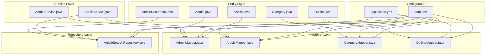
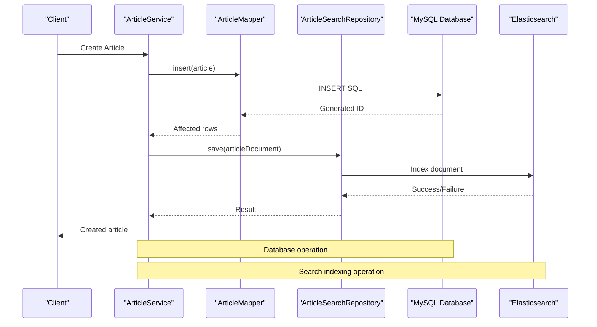
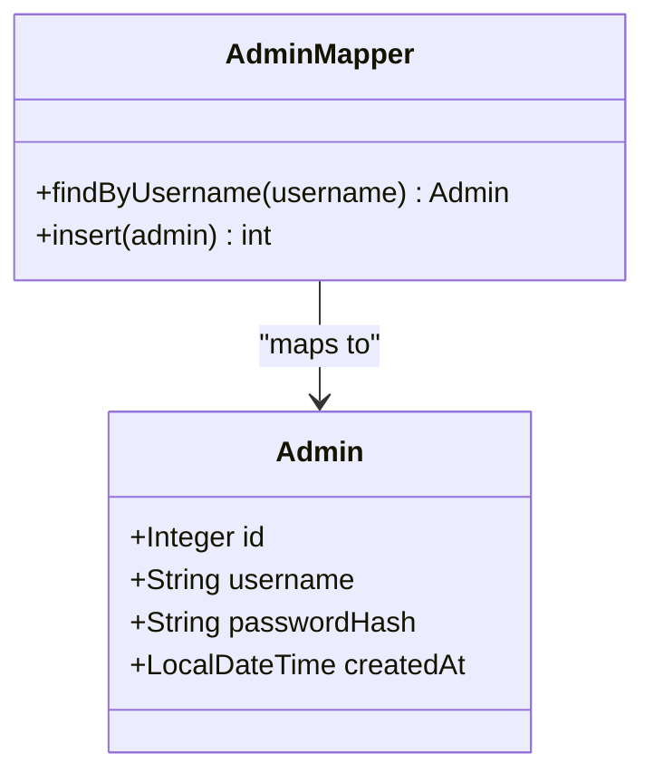
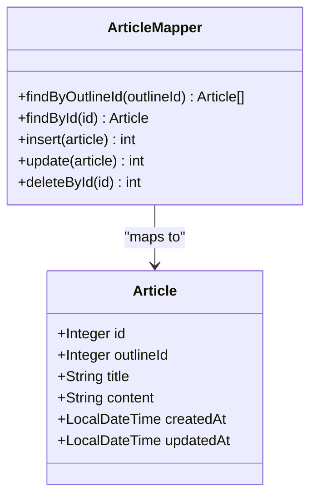
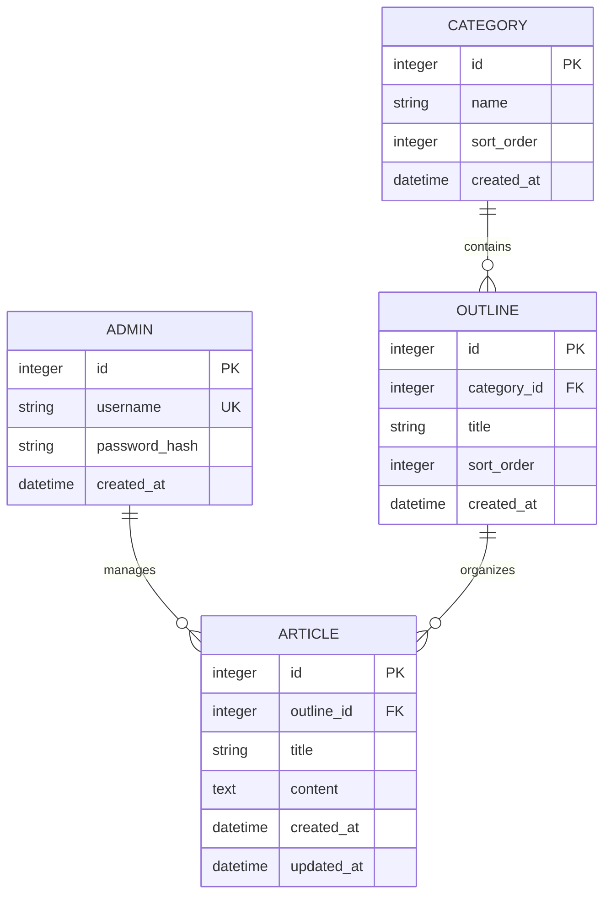
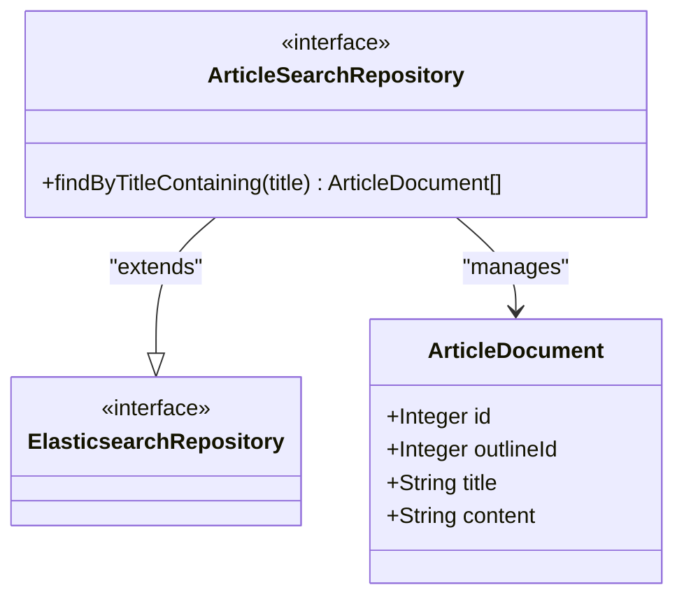
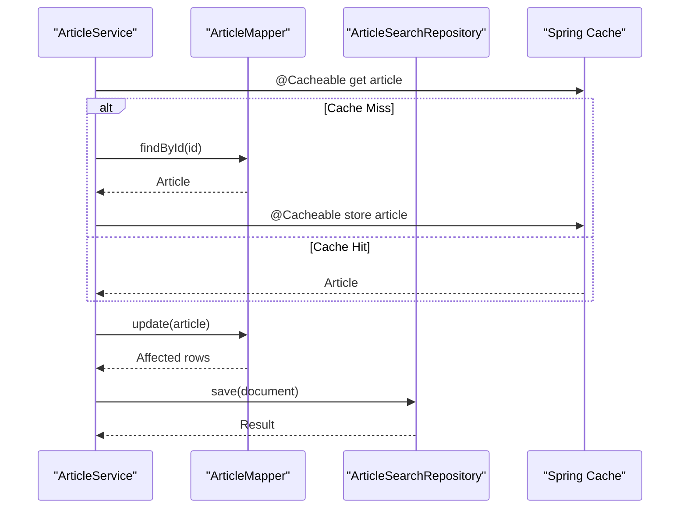
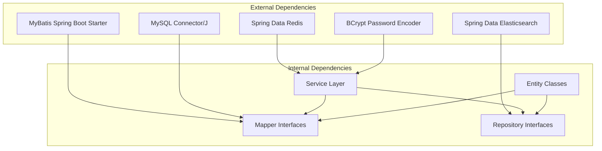

# Repository Layer and Data Access

<cite>
**Referenced Files in This Document**
- [AdminMapper.java](file://blog-backend/src/main/java/com/blog/mapper/AdminMapper.java)
- [ArticleMapper.java](file://blog-backend/src/main/java/com/blog/mapper/ArticleMapper.java)
- [CategoryMapper.java](file://blog-backend/src/main/java/com/blog/mapper/CategoryMapper.java)
- [OutlineMapper.java](file://blog-backend/src/main/java/com/blog/mapper/OutlineMapper.java)
- [ArticleSearchRepository.java](file://blog-backend/src/main/java/com/blog/repository/ArticleSearchRepository.java)
- [Admin.java](file://blog-backend/src/main/java/com/blog/entity/Admin.java)
- [Article.java](file://blog-backend/src/main/java/com/blog/entity/Article.java)
- [Category.java](file://blog-backend/src/main/java/com/blog/entity/Category.java)
- [Outline.java](file://blog-backend/src/main/java/com/blog/entity/Outline.java)
- [ArticleDocument.java](file://blog-backend/src/main/java/com/blog/entity/ArticleDocument.java)
- [AdminService.java](file://blog-backend/src/main/java/com/blog/service/AdminService.java)
- [ArticleService.java](file://blog-backend/src/main/java/com/blog/service/ArticleService.java)
- [application.yml](file://blog-backend/src/main/resources/application.yml)
- [pom.xml](file://blog-backend/pom.xml)
</cite>

## Table of Contents
1. [Introduction](#introduction)
2. [Project Structure](#project-structure)
3. [Core Components](#core-components)
4. [Architecture Overview](#architecture-overview)
5. [Detailed Component Analysis](#detailed-component-analysis)
6. [Dependency Analysis](#dependency-analysis)
7. [Performance Considerations](#performance-considerations)
8. [Troubleshooting Guide](#troubleshooting-guide)
9. [Conclusion](#conclusion)

## Introduction
This document provides comprehensive documentation for the repository layer and data access patterns in the blog backend. It focuses on MyBatis mapper implementations, SQL query mappings, and database interaction strategies. The repository responsibilities include data retrieval, persistence operations, and query optimization. The integration between mappers and entities, result mapping configurations, and dynamic SQL generation are explained. Examples of CRUD operations, complex queries, batch processing, and search functionality are included. Best practices, performance optimization techniques, and database connection management are addressed.

## Project Structure
The data access layer follows a layered architecture:
- Entity layer: Plain Java objects representing database tables
- Mapper layer: MyBatis interfaces defining SQL operations
- Service layer: Business logic orchestrating data access and caching
- Repository layer: Elasticsearch repository for search functionality
- Configuration: MyBatis and Spring Boot configuration

**Diagram sources**
- [AdminMapper.java:1-16](file://blog-backend/src/main/java/com/blog/mapper/AdminMapper.java#L1-L16)
- [ArticleMapper.java:1-27](file://blog-backend/src/main/java/com/blog/mapper/ArticleMapper.java#L1-L27)
- [CategoryMapper.java:1-27](file://blog-backend/src/main/java/com/blog/mapper/CategoryMapper.java#L1-L27)
- [OutlineMapper.java:1-30](file://blog-backend/src/main/java/com/blog/mapper/OutlineMapper.java#L1-L30)
- [ArticleSearchRepository.java:1-12](file://blog-backend/src/main/java/com/blog/repository/ArticleSearchRepository.java#L1-L12)
- [AdminService.java:1-34](file://blog-backend/src/main/java/com/blog/service/AdminService.java#L1-L34)
- [ArticleService.java:1-72](file://blog-backend/src/main/java/com/blog/service/ArticleService.java#L1-L72)
- [application.yml:1-33](file://blog-backend/src/main/resources/application.yml#L1-L33)
- [pom.xml:1-111](file://blog-backend/pom.xml#L1-L111)

**Section sources**
- [application.yml:1-33](file://blog-backend/src/main/resources/application.yml#L1-L33)
- [pom.xml:1-111](file://blog-backend/pom.xml#L1-L111)

## Core Components
The repository layer consists of three primary components:
- MyBatis Mapper Interfaces: Define SQL operations for CRUD and queries
- Entity Classes: Represent database records with Lombok annotations
- Elasticsearch Repository: Provides search capabilities with automatic method derivation

Key characteristics:
- MyBatis mappers use annotation-based SQL definitions
- Entities use Lombok's @Data for getter/setter generation
- Elasticsearch repository extends Spring Data interface for search operations
- Service layer coordinates between mappers and repositories

**Section sources**
- [AdminMapper.java:1-16](file://blog-backend/src/main/java/com/blog/mapper/AdminMapper.java#L1-L16)
- [ArticleMapper.java:1-27](file://blog-backend/src/main/java/com/blog/mapper/ArticleMapper.java#L1-L27)
- [CategoryMapper.java:1-27](file://blog-backend/src/main/java/com/blog/mapper/CategoryMapper.java#L1-L27)
- [OutlineMapper.java:1-30](file://blog-backend/src/main/java/com/blog/mapper/OutlineMapper.java#L1-L30)
- [ArticleSearchRepository.java:1-12](file://blog-backend/src/main/java/com/blog/repository/ArticleSearchRepository.java#L1-L12)
- [Admin.java:1-13](file://blog-backend/src/main/java/com/blog/entity/Admin.java#L1-L13)
- [Article.java:1-15](file://blog-backend/src/main/java/com/blog/entity/Article.java#L1-L15)
- [Category.java:1-13](file://blog-backend/src/main/java/com/blog/entity/Category.java#L1-L13)
- [Outline.java:1-14](file://blog-backend/src/main/java/com/blog/entity/Outline.java#L1-L14)
- [ArticleDocument.java:1-25](file://blog-backend/src/main/java/com/blog/entity/ArticleDocument.java#L1-L25)

## Architecture Overview
The data access architecture implements a clean separation of concerns:
- MyBatis handles traditional SQL database operations
- Elasticsearch manages full-text search functionality
- Spring Cache provides transparent caching for improved performance
- Service layer encapsulates business logic and coordinates operations

**Diagram sources**
- [ArticleService.java:32-45](file://blog-backend/src/main/java/com/blog/service/ArticleService.java#L32-L45)
- [ArticleMapper.java:17-19](file://blog-backend/src/main/java/com/blog/mapper/ArticleMapper.java#L17-L19)
- [ArticleSearchRepository.java:8-11](file://blog-backend/src/main/java/com/blog/repository/ArticleSearchRepository.java#L8-L11)

**Section sources**
- [ArticleService.java:1-72](file://blog-backend/src/main/java/com/blog/service/ArticleService.java#L1-L72)
- [ArticleMapper.java:1-27](file://blog-backend/src/main/java/com/blog/mapper/ArticleMapper.java#L1-L27)
- [ArticleSearchRepository.java:1-12](file://blog-backend/src/main/java/com/blog/repository/ArticleSearchRepository.java#L1-L12)

## Detailed Component Analysis

### MyBatis Mapper Implementations
Each mapper interface defines standardized CRUD operations with optimized queries:

#### AdminMapper Analysis
The AdminMapper provides authentication-focused operations:
- Username-based lookup for authentication
- Insert operation with auto-generated keys
- Password hashing handled in service layer

**Diagram sources**
- [AdminMapper.java:6-15](file://blog-backend/src/main/java/com/blog/mapper/AdminMapper.java#L6-L15)
- [Admin.java:7-12](file://blog-backend/src/main/java/com/blog/entity/Admin.java#L7-L12)

#### ArticleMapper Analysis
The ArticleMapper implements comprehensive content management:
- Outline-based filtering for hierarchical content
- Full CRUD operations with timestamp management
- Optimized SELECT statements with specific column projection

**Diagram sources**
- [ArticleMapper.java:8-26](file://blog-backend/src/main/java/com/blog/mapper/ArticleMapper.java#L8-L26)
- [Article.java:7-14](file://blog-backend/src/main/java/com/blog/entity/Article.java#L7-L14)

#### CategoryMapper Analysis
Category operations support content organization:
- Full CRUD operations for categories
- Sort order preservation for consistent ordering
- Automatic timestamp management

#### OutlineMapper Analysis
Outline management enables hierarchical content structure:
- Category-based filtering for organized content
- Comprehensive CRUD operations
- Sort order maintenance for presentation

**Section sources**
- [AdminMapper.java:1-16](file://blog-backend/src/main/java/com/blog/mapper/AdminMapper.java#L1-L16)
- [ArticleMapper.java:1-27](file://blog-backend/src/main/java/com/blog/mapper/ArticleMapper.java#L1-L27)
- [CategoryMapper.java:1-27](file://blog-backend/src/main/java/com/blog/mapper/CategoryMapper.java#L1-L27)
- [OutlineMapper.java:1-30](file://blog-backend/src/main/java/com/blog/mapper/OutlineMapper.java#L1-L30)

### Entity Model Integration
The entity classes define the data model with consistent patterns:
- Lombok @Data annotation for automatic getter/setter generation
- LocalDateTime fields for audit trail and temporal data
- Consistent naming conventions matching database schema

**Diagram sources**
- [Admin.java:8-12](file://blog-backend/src/main/java/com/blog/entity/Admin.java#L8-L12)
- [Article.java:8-13](file://blog-backend/src/main/java/com/blog/entity/Article.java#L8-L13)
- [Category.java:8-12](file://blog-backend/src/main/java/com/blog/entity/Category.java#L8-L12)
- [Outline.java:8-12](file://blog-backend/src/main/java/com/blog/entity/Outline.java#L8-L12)

**Section sources**
- [Admin.java:1-13](file://blog-backend/src/main/java/com/blog/entity/Admin.java#L1-L13)
- [Article.java:1-15](file://blog-backend/src/main/java/com/blog/entity/Article.java#L1-L15)
- [Category.java:1-13](file://blog-backend/src/main/java/com/blog/entity/Category.java#L1-L13)
- [Outline.java:1-14](file://blog-backend/src/main/java/com/blog/entity/Outline.java#L1-L14)

### Elasticsearch Repository Implementation
The ArticleSearchRepository provides advanced search capabilities:
- Extends Spring Data ElasticsearchRepository for automatic method derivation
- Custom query method for title-based content search
- Document mapping with full-text analysis using ik_max_word tokenizer

**Diagram sources**
- [ArticleSearchRepository.java:8-11](file://blog-backend/src/main/java/com/blog/repository/ArticleSearchRepository.java#L8-L11)
- [ArticleDocument.java:13-24](file://blog-backend/src/main/java/com/blog/entity/ArticleDocument.java#L13-L24)

**Section sources**
- [ArticleSearchRepository.java:1-12](file://blog-backend/src/main/java/com/blog/repository/ArticleSearchRepository.java#L1-L12)
- [ArticleDocument.java:1-25](file://blog-backend/src/main/java/com/blog/entity/ArticleDocument.java#L1-L25)

### Service Layer Coordination
The service layer orchestrates data access operations with caching and error handling:

**Diagram sources**
- [ArticleService.java:27-30](file://blog-backend/src/main/java/com/blog/service/ArticleService.java#L27-L30)
- [ArticleService.java:47-60](file://blog-backend/src/main/java/com/blog/service/ArticleService.java#L47-L60)

**Section sources**
- [AdminService.java:1-34](file://blog-backend/src/main/java/com/blog/service/AdminService.java#L1-L34)
- [ArticleService.java:1-72](file://blog-backend/src/main/java/com/blog/service/ArticleService.java#L1-L72)

## Dependency Analysis
The data access layer exhibits loose coupling with clear dependency relationships:

**Diagram sources**
- [pom.xml:25-91](file://blog-backend/pom.xml#L25-L91)

**Section sources**
- [pom.xml:1-111](file://blog-backend/pom.xml#L1-L111)

## Performance Considerations
Several optimization techniques are implemented throughout the data access layer:

### Query Optimization
- Column-specific SELECT statements to minimize data transfer
- Indexed field usage (username, outline_id, category_id)
- Efficient ORDER BY clauses with appropriate indexes

### Caching Strategy
- Transparent caching for frequently accessed articles
- Cache eviction on write operations to maintain consistency
- Application-level cache invalidation for search results

### Connection Management
- Spring Boot auto-configures connection pooling
- MyBatis manages statement lifecycle efficiently
- Elasticsearch client handles connection pooling automatically

### Batch Operations
While individual CRUD operations are supported, batch processing can be implemented by:
- Using MyBatis batch executor for bulk inserts/updates
- Implementing transactional batch operations in service layer
- Leveraging Elasticsearch bulk indexing for search data

## Troubleshooting Guide

### Common Issues and Solutions

#### MyBatis Configuration Problems
- Verify mapper locations in application.yml
- Ensure entity package configuration matches actual package structure
- Check underscore-to-camel case mapping for proper field binding

#### Database Connection Issues
- Validate JDBC URL format and credentials
- Confirm MySQL server availability and network connectivity
- Check timezone configuration for consistent datetime handling

#### Elasticsearch Integration Problems
- Verify Elasticsearch service availability at configured URI
- Check index creation and mapping configuration
- Monitor search performance and adjust analyzers as needed

#### Caching Issues
- Validate Redis connectivity for cache operations
- Monitor cache hit ratios and tune cache configuration
- Implement cache failure fallback mechanisms

**Section sources**
- [application.yml:4-26](file://blog-backend/src/main/resources/application.yml#L4-L26)
- [ArticleService.java:35-44](file://blog-backend/src/main/java/com/blog/service/ArticleService.java#L35-L44)
- [ArticleService.java:65-69](file://blog-backend/src/main/java/com/blog/service/ArticleService.java#L65-L69)

## Conclusion
The repository layer demonstrates a well-architected data access pattern combining traditional SQL operations with modern search capabilities. The MyBatis mappers provide efficient database interactions with optimized queries, while the Elasticsearch integration enables powerful search functionality. The service layer coordinates operations with caching for improved performance, and the entity model ensures consistent data representation. The architecture supports scalability through proper separation of concerns, efficient query patterns, and robust error handling mechanisms.