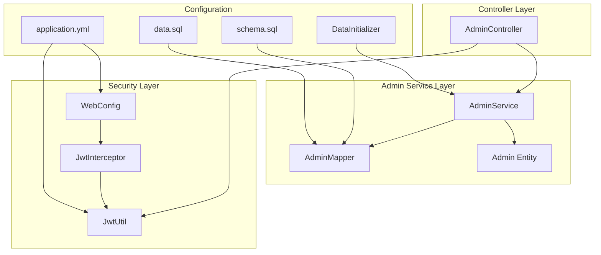
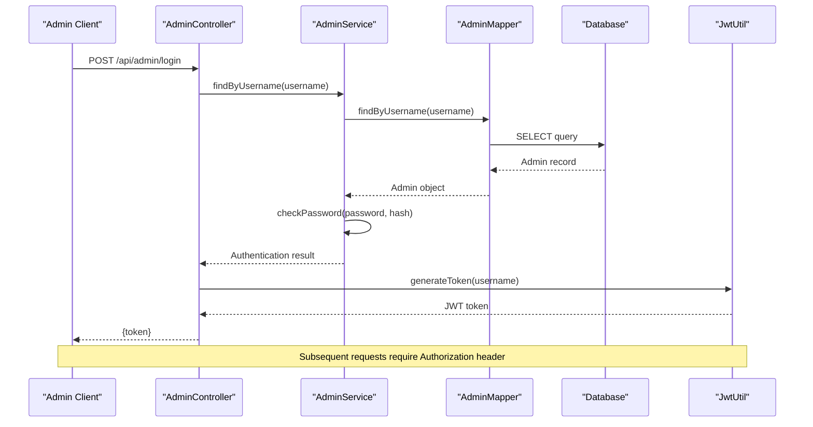
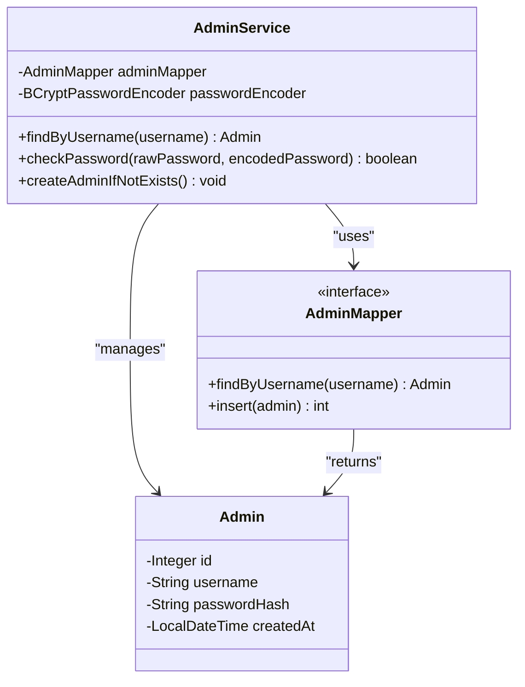
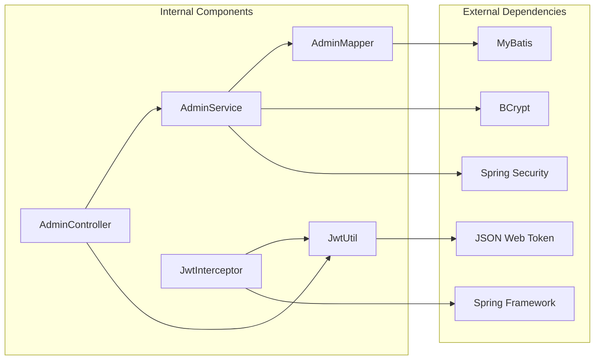

# Admin Service - Authentication and Authorization

<cite>
**Referenced Files in This Document**
- [AdminService.java](file://blog-backend/src/main/java/com/blog/service/AdminService.java)
- [AdminMapper.java](file://blog-backend/src/main/java/com/blog/mapper/AdminMapper.java)
- [Admin.java](file://blog-backend/src/main/java/com/blog/entity/Admin.java)
- [AdminController.java](file://blog-backend/src/main/java/com/blog/controller/AdminController.java)
- [JwtUtil.java](file://blog-backend/src/main/java/com/blog/util/JwtUtil.java)
- [WebConfig.java](file://blog-backend/src/main/java/com/blog/config/WebConfig.java)
- [JwtInterceptor.java](file://blog-backend/src/main/java/com/blog/config/JwtInterceptor.java)
- [DataInitializer.java](file://blog-backend/src/main/java/com/blog/config/DataInitializer.java)
- [application.yml](file://blog-backend/src/main/resources/application.yml)
- [schema.sql](file://blog-backend/src/main/resources/schema.sql)
- [data.sql](file://blog-backend/src/main/resources/data.sql)
</cite>

## Table of Contents
1. [Introduction](#introduction)
2. [Project Structure](#project-structure)
3. [Core Components](#core-components)
4. [Architecture Overview](#architecture-overview)
5. [Detailed Component Analysis](#detailed-component-analysis)
6. [Dependency Analysis](#dependency-analysis)
7. [Performance Considerations](#performance-considerations)
8. [Security Implementation](#security-implementation)
9. [Troubleshooting Guide](#troubleshooting-guide)
10. [Best Practices](#best-practices)
11. [Conclusion](#conclusion)

## Introduction

The Admin Service is a critical component of the blog management system responsible for authentication and authorization functionality. This service manages admin user accounts, handles secure password verification using BCrypt encryption, and provides automatic account initialization during application startup. The service integrates seamlessly with the JWT-based authentication system to secure administrative endpoints and ensure only authorized users can access sensitive management operations.

The system follows modern security practices by implementing industry-standard password hashing, token-based authentication, and comprehensive error handling for authentication failures. The Admin Service serves as the foundation for the entire administrative interface, enabling secure content management and user administration capabilities.

## Project Structure

The Admin Service is organized within a well-structured Spring Boot application following standard Maven conventions:

**Diagram sources**
- [AdminService.java:1-34](file://blog-backend/src/main/java/com/blog/service/AdminService.java#L1-L34)
- [AdminController.java:1-121](file://blog-backend/src/main/java/com/blog/controller/AdminController.java#L1-L121)
- [JwtUtil.java:1-57](file://blog-backend/src/main/java/com/blog/util/JwtUtil.java#L1-L57)
- [JwtInterceptor.java:1-36](file://blog-backend/src/main/java/com/blog/config/JwtInterceptor.java#L1-L36)

**Section sources**
- [AdminService.java:1-34](file://blog-backend/src/main/java/com/blog/service/AdminService.java#L1-L34)
- [AdminController.java:1-121](file://blog-backend/src/main/java/com/blog/controller/AdminController.java#L1-L121)
- [application.yml:1-33](file://blog-backend/src/main/resources/application.yml#L1-L33)

## Core Components

### Admin Service Implementation

The Admin Service is the central component responsible for managing administrative authentication and authorization operations. It provides three primary functions:

1. **Username Lookup**: Retrieves admin user information by username for authentication verification
2. **Password Validation**: Compares plaintext passwords against stored BCrypt hashes
3. **Automatic Account Creation**: Initializes the default admin account during application startup

### Database Integration

The service integrates with the AdminMapper interface to handle all database operations through MyBatis annotations. The Admin entity represents the database schema with essential fields for authentication and audit trail.

### Security Infrastructure

The service leverages Spring Security's BCryptPasswordEncoder for secure password hashing and verification. Passwords are never stored in plaintext; instead, they are hashed using BCrypt with a configurable cost factor for enhanced security.

**Section sources**
- [AdminService.java:9-34](file://blog-backend/src/main/java/com/blog/service/AdminService.java#L9-L34)
- [AdminMapper.java:6-16](file://blog-backend/src/main/java/com/blog/mapper/AdminMapper.java#L6-L16)
- [Admin.java:6-13](file://blog-backend/src/main/java/com/blog/entity/Admin.java#L6-L13)

## Architecture Overview

The Admin Service operates within a layered architecture that separates concerns between presentation, business logic, data access, and security:

**Diagram sources**
- [AdminController.java:34-44](file://blog-backend/src/main/java/com/blog/controller/AdminController.java#L34-L44)
- [AdminService.java:16-22](file://blog-backend/src/main/java/com/blog/service/AdminService.java#L16-L22)
- [JwtUtil.java:25-34](file://blog-backend/src/main/java/com/blog/util/JwtUtil.java#L25-L34)

The architecture ensures that authentication flows are handled securely while maintaining separation of concerns between different functional areas of the application.

## Detailed Component Analysis

### AdminService Component

The AdminService class implements the core authentication logic with three primary methods:

#### Username Lookup Method
The `findByUsername` method provides efficient admin user retrieval by username, enabling the authentication process to locate user accounts quickly.

#### Password Verification Method
The `checkPassword` method uses BCryptPasswordEncoder to securely compare plaintext passwords against stored hashed passwords. This method ensures that password verification occurs without exposing the original password or hash.

#### Automatic Account Initialization
The `createAdminIfNotExists` method performs a safety check to prevent duplicate admin accounts while ensuring that at least one administrative account exists for system access.

**Diagram sources**
- [AdminService.java:11-34](file://blog-backend/src/main/java/com/blog/service/AdminService.java#L11-L34)
- [AdminMapper.java:7-15](file://blog-backend/src/main/java/com/blog/mapper/AdminMapper.java#L7-L15)
- [Admin.java:7-12](file://blog-backend/src/main/java/com/blog/entity/Admin.java#L7-L12)

**Section sources**
- [AdminService.java:16-32](file://blog-backend/src/main/java/com/blog/service/AdminService.java#L16-L32)

### AdminMapper Database Operations

The AdminMapper interface defines the data access layer operations using MyBatis annotations:

#### Username Query Operation
The `findByUsername` method executes a SQL SELECT query to retrieve admin records by username, utilizing the unique constraint for efficient lookups.

#### Account Insertion Operation
The `insert` method handles new admin account creation with auto-generated ID assignment and proper field mapping.

**Section sources**
- [AdminMapper.java:9-14](file://blog-backend/src/main/java/com/blog/mapper/AdminMapper.java#L9-L14)

### Admin Entity Model

The Admin entity represents the database schema with four essential fields:

#### Core Identity Fields
- **id**: Auto-incrementing primary key for unique identification
- **username**: Unique identifier for admin authentication
- **passwordHash**: BCrypt-encoded password storage
- **createdAt**: Timestamp for account creation audit

**Section sources**
- [Admin.java:8-12](file://blog-backend/src/main/java/com/blog/entity/Admin.java#L8-L12)

### Authentication Controller

The AdminController handles external authentication requests and manages the complete login flow:

#### Login Endpoint Implementation
The `/api/admin/login` endpoint validates admin credentials and generates JWT tokens upon successful authentication.

#### Request Processing Flow
The controller extracts username and password from JSON requests, delegates authentication to AdminService, and returns appropriate HTTP responses.

**Section sources**
- [AdminController.java:34-44](file://blog-backend/src/main/java/com/blog/controller/AdminController.java#L34-L44)

## Dependency Analysis

The Admin Service maintains clean dependencies that support maintainable and testable code:

**Diagram sources**
- [AdminService.java:3-7](file://blog-backend/src/main/java/com/blog/service/AdminService.java#L3-L7)
- [AdminController.java:3-6](file://blog-backend/src/main/java/com/blog/controller/AdminController.java#L3-L6)
- [JwtUtil.java:3-6](file://blog-backend/src/main/java/com/blog/util/JwtUtil.java#L3-L6)

The dependency graph shows that the Admin Service relies on Spring Security for password encoding, MyBatis for database operations, and JWT utilities for token management. These dependencies are managed through Spring's dependency injection framework.

**Section sources**
- [AdminService.java:3-7](file://blog-backend/src/main/java/com/blog/service/AdminService.java#L3-L7)
- [AdminController.java:3-6](file://blog-backend/src/main/java/com/blog/controller/AdminController.java#L3-L6)

## Performance Considerations

### Database Optimization
The admin table includes a unique index on the username column, enabling O(log n) lookup performance for authentication operations. The database schema is optimized for frequent authentication queries.

### Memory Management
The BCryptPasswordEncoder instance is created once and reused throughout the application lifecycle, avoiding unnecessary object creation overhead during authentication operations.

### Caching Strategy
Consider implementing a simple caching layer for frequently accessed admin accounts to reduce database load during peak authentication periods.

### Connection Pooling
The MyBatis configuration supports connection pooling through the Spring DataSource configuration, ensuring efficient database resource utilization.

## Security Implementation

### Password Security
The system implements industry-standard password security using BCrypt encryption:

#### Hash Generation
Passwords are hashed using BCrypt with a configurable cost factor, making brute-force attacks computationally expensive.

#### Secure Comparison
Password verification uses BCrypt's built-in comparison method that prevents timing attacks and maintains constant-time comparison characteristics.

#### Initial Setup Security
The automatic admin account creation process uses a predefined password that should be changed immediately after first login.

### Token-Based Authentication
JWT tokens provide stateless session management with the following security features:

#### Token Expiration
Tokens have a defined expiration period (24 hours in the current configuration) limiting the window of opportunity for token theft.

#### Secret Key Management
The JWT secret key is configured through environment variables and should be stored securely in production environments.

#### Token Validation
All subsequent requests require valid JWT tokens in the Authorization header, preventing unauthorized access to administrative endpoints.

### Access Control
The JWT interceptor enforces authentication requirements for all administrative endpoints except the login endpoint:

#### Path Pattern Matching
All URLs under `/api/admin/**` require authentication, with the login endpoint excluded from this requirement.

#### Header Validation
Requests must include a properly formatted Authorization header containing a valid JWT token.

**Section sources**
- [AdminService.java:24-32](file://blog-backend/src/main/java/com/blog/service/AdminService.java#L24-L32)
- [JwtUtil.java:25-47](file://blog-backend/src/main/java/com/blog/util/JwtUtil.java#L25-L47)
- [JwtInterceptor.java:17-34](file://blog-backend/src/main/java/com/blog/config/JwtInterceptor.java#L17-L34)

## Troubleshooting Guide

### Common Authentication Issues

#### Invalid Credentials Error
When users receive "Invalid credentials" responses, verify that:
- The username exists in the database
- The password matches the stored hash exactly
- No typos exist in the username or password fields

#### Unauthorized Access Errors
If users encounter unauthorized access errors:
- Verify that the Authorization header contains a valid Bearer token
- Check that the token has not expired
- Ensure the token was generated by the same server instance

#### Database Connection Problems
Authentication failures may indicate database connectivity issues:
- Verify MySQL server availability
- Check database credentials in application configuration
- Confirm that the admin table exists and is properly initialized

### Debugging Authentication Flow

#### Enable Logging
Add logging statements to track authentication attempts and identify failure points in the process.

#### Test Database Queries
Verify that the username lookup query executes correctly and returns expected results.

#### Validate Token Generation
Test JWT token generation and validation independently to isolate authentication issues.

**Section sources**
- [AdminController.java:39-41](file://blog-backend/src/main/java/com/blog/controller/AdminController.java#L39-L41)
- [JwtInterceptor.java:20-31](file://blog-backend/src/main/java/com/blog/config/JwtInterceptor.java#L20-L31)

## Best Practices

### Password Management
- Change the default admin password immediately after initial setup
- Implement password complexity requirements for future admin accounts
- Regularly review and update security configurations
- Consider implementing password expiration policies

### Token Security
- Store JWT secret keys in secure environment variables
- Rotate JWT secret keys periodically
- Monitor token usage patterns for suspicious activity
- Implement token refresh mechanisms for enhanced security

### Database Security
- Regularly backup the database with encrypted credentials
- Limit database user privileges to minimum required permissions
- Implement database connection pooling with proper timeout settings
- Monitor database queries for performance and security issues

### Application Security
- Keep all dependencies updated with security patches
- Implement rate limiting for authentication attempts
- Consider adding two-factor authentication for admin accounts
- Regular security audits of the authentication system

### Development Guidelines
- Never commit hardcoded credentials to version control
- Use environment-specific configuration files for different deployment stages
- Implement comprehensive error handling without exposing sensitive information
- Regular code reviews focusing on security implications

## Conclusion

The Admin Service provides a robust foundation for authentication and authorization in the blog management system. Through careful implementation of BCrypt password hashing, JWT token-based authentication, and secure database operations, the service ensures that administrative access remains protected while maintaining usability for legitimate administrators.

The modular design allows for easy maintenance and extension, while the integration with Spring Security and MyBatis provides reliable, enterprise-grade functionality. The automatic admin account creation feature simplifies initial setup, though immediate password changes are essential for production security.

Future enhancements could include advanced features such as multi-factor authentication, detailed audit logging, and more sophisticated access control mechanisms. However, the current implementation provides a solid foundation that meets the security requirements for typical blog administrative operations.