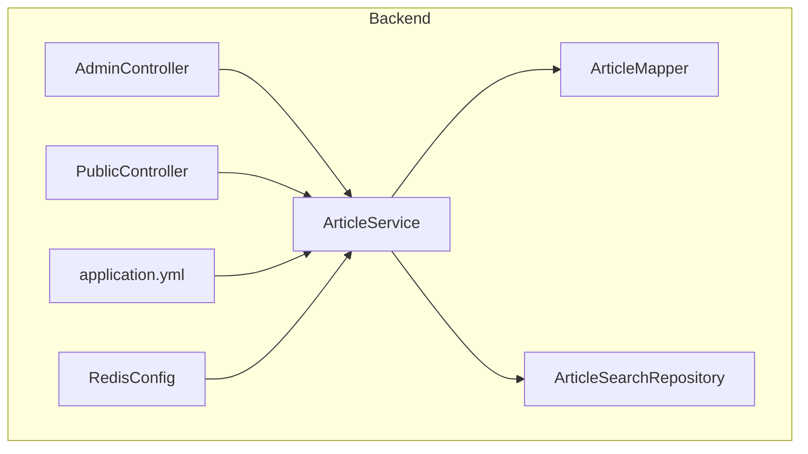
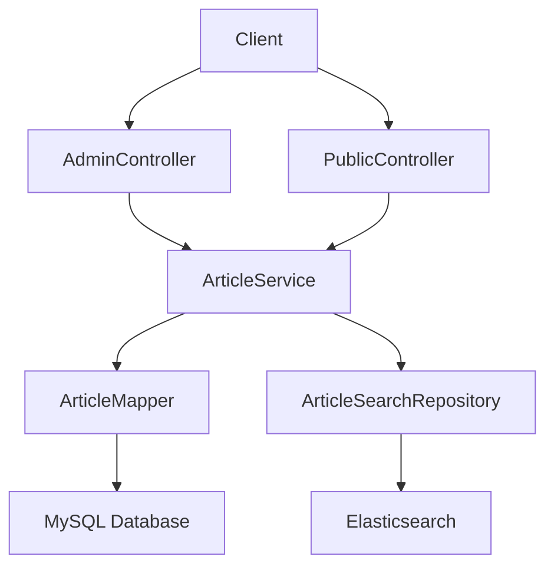
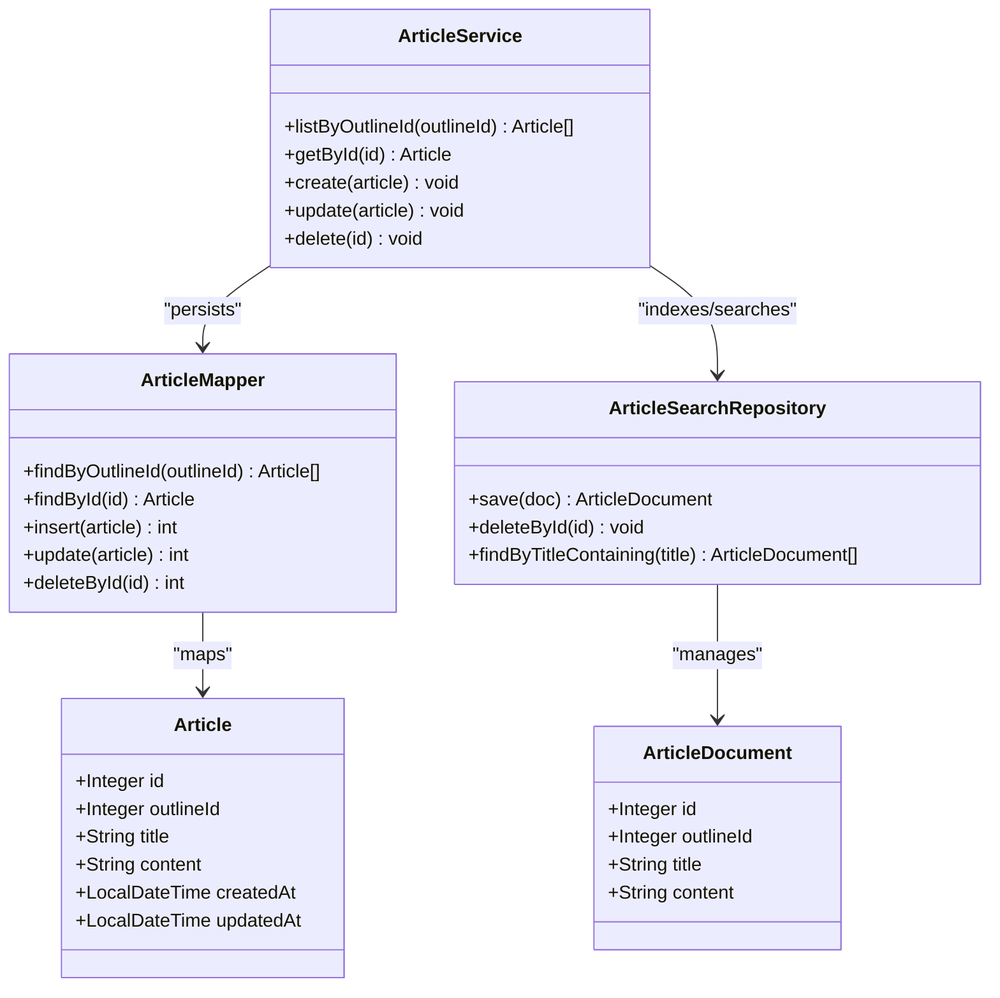
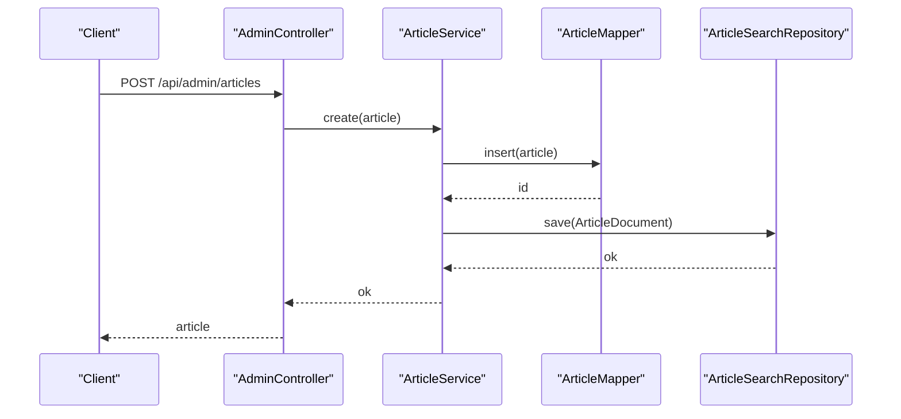
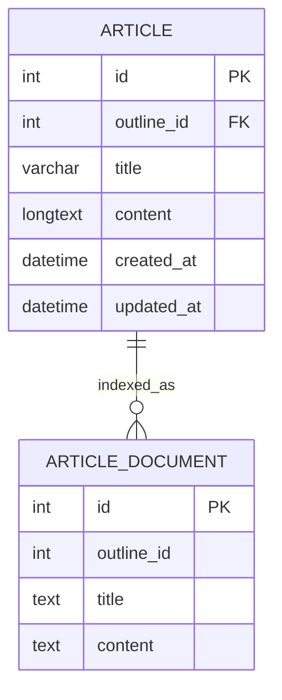
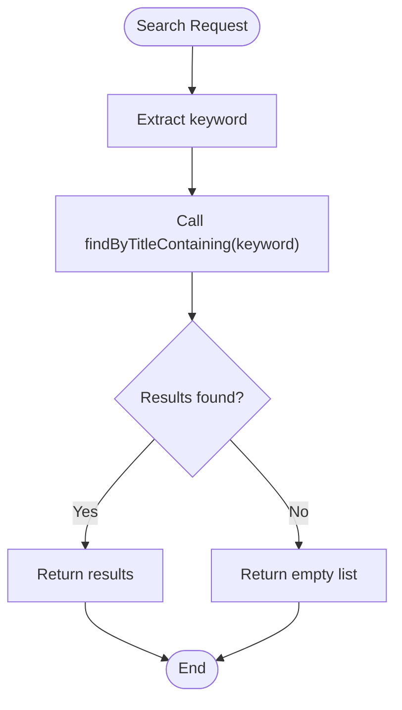
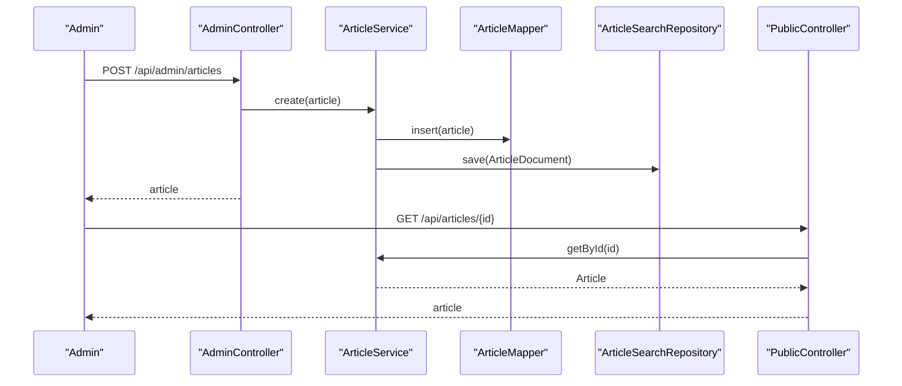
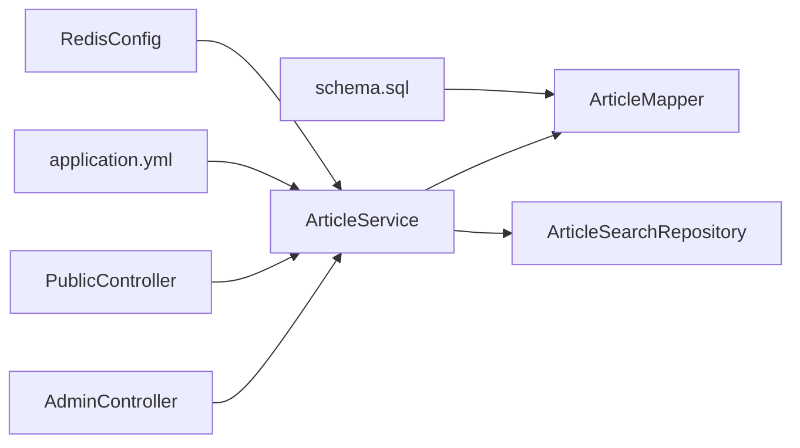

# Article Service - Content Management Operations

<cite>
**Referenced Files in This Document**
- [ArticleService.java](file://blog-backend/src/main/java/com/blog/service/ArticleService.java)
- [ArticleMapper.java](file://blog-backend/src/main/java/com/blog/mapper/ArticleMapper.java)
- [ArticleSearchRepository.java](file://blog-backend/src/main/java/com/blog/repository/ArticleSearchRepository.java)
- [Article.java](file://blog-backend/src/main/java/com/blog/entity/Article.java)
- [ArticleDocument.java](file://blog-backend/src/main/java/com/blog/entity/ArticleDocument.java)
- [AdminController.java](file://blog-backend/src/main/java/com/blog/controller/AdminController.java)
- [PublicController.java](file://blog-backend/src/main/java/com/blog/controller/PublicController.java)
- [application.yml](file://blog-backend/src/main/resources/application.yml)
- [schema.sql](file://blog-backend/src/main/resources/schema.sql)
- [RedisConfig.java](file://blog-backend/src/main/java/com/blog/config/RedisConfig.java)
</cite>

## Table of Contents
1. [Introduction](#introduction)
2. [Project Structure](#project-structure)
3. [Core Components](#core-components)
4. [Architecture Overview](#architecture-overview)
5. [Detailed Component Analysis](#detailed-component-analysis)
6. [Dependency Analysis](#dependency-analysis)
7. [Performance Considerations](#performance-considerations)
8. [Troubleshooting Guide](#troubleshooting-guide)
9. [Conclusion](#conclusion)

## Introduction
This document provides comprehensive documentation for the Article Service responsible for content management operations. It explains how the service handles article CRUD operations, integrates with Elasticsearch for search functionality, and coordinates with the database via MyBatis. The documentation covers service method responsibilities, data models, search integration patterns, error handling strategies, and performance considerations for large-scale content management.

## Project Structure
The Article Service resides in the backend module under the Java package com.blog.service. It interacts with:
- ArticleMapper for database operations
- ArticleSearchRepository for Elasticsearch indexing and queries
- Controllers for inbound requests and outbound responses
- Application configuration for database, Redis caching, and Elasticsearch connectivity

**Diagram sources**
- [ArticleService.java:1-72](file://blog-backend/src/main/java/com/blog/service/ArticleService.java#L1-L72)
- [ArticleMapper.java:1-27](file://blog-backend/src/main/java/com/blog/mapper/ArticleMapper.java#L1-L27)
- [ArticleSearchRepository.java:1-12](file://blog-backend/src/main/java/com/blog/repository/ArticleSearchRepository.java#L1-L12)
- [AdminController.java:1-121](file://blog-backend/src/main/java/com/blog/controller/AdminController.java#L1-L121)
- [PublicController.java:1-62](file://blog-backend/src/main/java/com/blog/controller/PublicController.java#L1-L62)
- [application.yml:1-33](file://blog-backend/src/main/resources/application.yml#L1-L33)
- [RedisConfig.java:1-27](file://blog-backend/src/main/java/com/blog/config/RedisConfig.java#L1-L27)

**Section sources**
- [ArticleService.java:1-72](file://blog-backend/src/main/java/com/blog/service/ArticleService.java#L1-L72)
- [ArticleMapper.java:1-27](file://blog-backend/src/main/java/com/blog/mapper/ArticleMapper.java#L1-L27)
- [ArticleSearchRepository.java:1-12](file://blog-backend/src/main/java/com/blog/repository/ArticleSearchRepository.java#L1-L12)
- [AdminController.java:1-121](file://blog-backend/src/main/java/com/blog/controller/AdminController.java#L1-L121)
- [PublicController.java:1-62](file://blog-backend/src/main/java/com/blog/controller/PublicController.java#L1-L62)
- [application.yml:1-33](file://blog-backend/src/main/resources/application.yml#L1-L33)
- [RedisConfig.java:1-27](file://blog-backend/src/main/java/com/blog/config/RedisConfig.java#L1-L27)

## Core Components
- ArticleService: Orchestrates article CRUD operations, manages caching, and synchronizes Elasticsearch indices.
- ArticleMapper: Defines SQL operations for article persistence using MyBatis annotations.
- ArticleSearchRepository: Extends Spring Data Elasticsearch to manage article documents and search queries.
- Article and ArticleDocument: Data models representing relational articles and Elasticsearch documents respectively.
- Controllers: Expose REST endpoints for administrative and public access to articles and search.

Key responsibilities:
- Retrieve articles by outline ID and by ID with caching.
- Create, update, and delete articles with Elasticsearch synchronization.
- Search articles by title using Elasticsearch.

**Section sources**
- [ArticleService.java:23-70](file://blog-backend/src/main/java/com/blog/service/ArticleService.java#L23-L70)
- [ArticleMapper.java:11-25](file://blog-backend/src/main/java/com/blog/mapper/ArticleMapper.java#L11-L25)
- [ArticleSearchRepository.java:8-11](file://blog-backend/src/main/java/com/blog/repository/ArticleSearchRepository.java#L8-L11)
- [Article.java:1-15](file://blog-backend/src/main/java/com/blog/entity/Article.java#L1-L15)
- [ArticleDocument.java:10-24](file://blog-backend/src/main/java/com/blog/entity/ArticleDocument.java#L10-L24)

## Architecture Overview
The Article Service follows a layered architecture:
- Presentation Layer: Controllers handle HTTP requests and responses.
- Application Layer: Services encapsulate business logic and orchestrate operations.
- Persistence Layer: MyBatis Mapper executes SQL against the relational database.
- Search Layer: Elasticsearch Repository manages article indexing and search.

**Diagram sources**
- [AdminController.java:102-119](file://blog-backend/src/main/java/com/blog/controller/AdminController.java#L102-L119)
- [PublicController.java:42-60](file://blog-backend/src/main/java/com/blog/controller/PublicController.java#L42-L60)
- [ArticleService.java:20-21](file://blog-backend/src/main/java/com/blog/service/ArticleService.java#L20-L21)
- [ArticleMapper.java:8-26](file://blog-backend/src/main/java/com/blog/mapper/ArticleMapper.java#L8-L26)
- [ArticleSearchRepository.java:8-11](file://blog-backend/src/main/java/com/blog/repository/ArticleSearchRepository.java#L8-L11)

## Detailed Component Analysis

### ArticleService
Responsibilities:
- Retrieve articles by outline ID.
- Retrieve a single article by ID with Redis caching.
- Create a new article and index it in Elasticsearch.
- Update an existing article and refresh its Elasticsearch index.
- Delete an article and remove it from Elasticsearch.
- Invalidate cache entries after write operations.

Caching behavior:
- Uses @Cacheable on getById with cache name "articles".
- Uses @CacheEvict on create, update, and delete to clear the "articles" cache.

Elasticsearch integration:
- Converts Article to ArticleDocument for indexing.
- Saves ArticleDocument on create/update.
- Deletes ArticleDocument by ID on delete.

Error handling:
- Wraps Elasticsearch operations in try/catch blocks and logs warnings on failure.

**Diagram sources**
- [ArticleService.java:18-71](file://blog-backend/src/main/java/com/blog/service/ArticleService.java#L18-L71)
- [ArticleMapper.java:9-26](file://blog-backend/src/main/java/com/blog/mapper/ArticleMapper.java#L9-L26)
- [ArticleSearchRepository.java:8-11](file://blog-backend/src/main/java/com/blog/repository/ArticleSearchRepository.java#L8-L11)
- [Article.java:7-14](file://blog-backend/src/main/java/com/blog/entity/Article.java#L7-L14)
- [ArticleDocument.java:11-24](file://blog-backend/src/main/java/com/blog/entity/ArticleDocument.java#L11-L24)

**Section sources**
- [ArticleService.java:23-70](file://blog-backend/src/main/java/com/blog/service/ArticleService.java#L23-L70)
- [RedisConfig.java:17-24](file://blog-backend/src/main/java/com/blog/config/RedisConfig.java#L17-L24)

### ArticleMapper
SQL operations:
- findByOutlineId: Lists articles by outline ID with ordering.
- findById: Retrieves a single article by ID.
- insert: Inserts a new article and returns generated ID.
- update: Updates an existing article and sets updated timestamp.
- deleteById: Removes an article by ID.

Complexity:
- Each operation maps to a single SQL statement; complexity is dependent on underlying database performance and indexing.

**Section sources**
- [ArticleMapper.java:11-25](file://blog-backend/src/main/java/com/blog/mapper/ArticleMapper.java#L11-L25)

### ArticleSearchRepository
Elasticsearch operations:
- save: Persists ArticleDocument.
- deleteById: Removes ArticleDocument by ID.
- findByTitleContaining: Searches documents by title substring.

Index configuration:
- Uses @Document(indexName = "article").
- Fields configured with analyzer "ik_max_word" for Chinese text processing.

**Section sources**
- [ArticleSearchRepository.java:8-11](file://blog-backend/src/main/java/com/blog/repository/ArticleSearchRepository.java#L8-L11)
- [ArticleDocument.java:10-24](file://blog-backend/src/main/java/com/blog/entity/ArticleDocument.java#L10-L24)

### Controllers Integration
- AdminController exposes endpoints for creating, updating, and deleting articles for administrative use.
- PublicController exposes endpoints for listing articles by outline, retrieving a single article by ID, and searching articles by title.

**Diagram sources**
- [AdminController.java:102-106](file://blog-backend/src/main/java/com/blog/controller/AdminController.java#L102-L106)
- [ArticleService.java:32-45](file://blog-backend/src/main/java/com/blog/service/ArticleService.java#L32-L45)
- [ArticleMapper.java:17-19](file://blog-backend/src/main/java/com/blog/mapper/ArticleMapper.java#L17-L19)
- [ArticleSearchRepository.java:8](file://blog-backend/src/main/java/com/blog/repository/ArticleSearchRepository.java#L8)

**Section sources**
- [AdminController.java:102-119](file://blog-backend/src/main/java/com/blog/controller/AdminController.java#L102-L119)
- [PublicController.java:42-60](file://blog-backend/src/main/java/com/blog/controller/PublicController.java#L42-L60)

### Data Models
- Article: Relational model with fields for identification, outline association, title, content, and timestamps.
- ArticleDocument: Elasticsearch model mapped to index "article" with fields for outlineId, title, and content using Chinese analyzer.

**Diagram sources**
- [Article.java:7-14](file://blog-backend/src/main/java/com/blog/entity/Article.java#L7-L14)
- [ArticleDocument.java:11-24](file://blog-backend/src/main/java/com/blog/entity/ArticleDocument.java#L11-L24)
- [schema.sql:17-25](file://blog-backend/src/main/resources/schema.sql#L17-L25)

**Section sources**
- [Article.java:1-15](file://blog-backend/src/main/java/com/blog/entity/Article.java#L1-L15)
- [ArticleDocument.java:1-25](file://blog-backend/src/main/java/com/blog/entity/ArticleDocument.java#L1-L25)
- [schema.sql:17-25](file://blog-backend/src/main/resources/schema.sql#L17-L25)

### Search Integration Patterns
- Title-based search: PublicController delegates to ArticleSearchRepository.findByTitleContaining for substring matching.
- Index synchronization: ArticleService converts Article to ArticleDocument and persists to Elasticsearch during create/update; deletes are performed on delete.

**Diagram sources**
- [PublicController.java:56-60](file://blog-backend/src/main/java/com/blog/controller/PublicController.java#L56-L60)
- [ArticleSearchRepository.java:10](file://blog-backend/src/main/java/com/blog/repository/ArticleSearchRepository.java#L10)

**Section sources**
- [PublicController.java:56-60](file://blog-backend/src/main/java/com/blog/controller/PublicController.java#L56-L60)
- [ArticleSearchRepository.java:10](file://blog-backend/src/main/java/com/blog/repository/ArticleSearchRepository.java#L10)

### Publishing Workflow Example
- An administrator creates an article via AdminController, which calls ArticleService.create.
- ArticleService persists the article via ArticleMapper and synchronizes Elasticsearch via ArticleSearchRepository.
- A client retrieves the article via PublicController and optionally searches by title.

**Diagram sources**
- [AdminController.java:102-106](file://blog-backend/src/main/java/com/blog/controller/AdminController.java#L102-L106)
- [ArticleService.java:32-35](file://blog-backend/src/main/java/com/blog/service/ArticleService.java#L32-L35)
- [ArticleMapper.java:17-19](file://blog-backend/src/main/java/com/blog/mapper/ArticleMapper.java#L17-L19)
- [ArticleSearchRepository.java:8](file://blog-backend/src/main/java/com/blog/repository/ArticleSearchRepository.java#L8)
- [PublicController.java:47-54](file://blog-backend/src/main/java/com/blog/controller/PublicController.java#L47-L54)

**Section sources**
- [AdminController.java:102-106](file://blog-backend/src/main/java/com/blog/controller/AdminController.java#L102-L106)
- [ArticleService.java:32-35](file://blog-backend/src/main/java/com/blog/service/ArticleService.java#L32-L35)
- [PublicController.java:47-54](file://blog-backend/src/main/java/com/blog/controller/PublicController.java#L47-L54)

## Dependency Analysis
- ArticleService depends on ArticleMapper for persistence and ArticleSearchRepository for search indexing.
- Controllers depend on ArticleService for business operations.
- Application configuration connects to MySQL, Redis, and Elasticsearch.
- Database schema defines foreign keys and cascading deletes for article relationships.

**Diagram sources**
- [AdminController.java:28](file://blog-backend/src/main/java/com/blog/controller/AdminController.java#L28)
- [PublicController.java:27](file://blog-backend/src/main/java/com/blog/controller/PublicController.java#L27)
- [ArticleService.java:20-21](file://blog-backend/src/main/java/com/blog/service/ArticleService.java#L20-L21)
- [application.yml:4-20](file://blog-backend/src/main/resources/application.yml#L4-L20)
- [RedisConfig.java:17-24](file://blog-backend/src/main/java/com/blog/config/RedisConfig.java#L17-L24)
- [schema.sql:17-25](file://blog-backend/src/main/resources/schema.sql#L17-L25)

**Section sources**
- [ArticleService.java:20-21](file://blog-backend/src/main/java/com/blog/service/ArticleService.java#L20-L21)
- [application.yml:4-20](file://blog-backend/src/main/resources/application.yml#L4-L20)
- [schema.sql:17-25](file://blog-backend/src/main/resources/schema.sql#L17-L25)

## Performance Considerations
- Caching: getById uses Redis caching to reduce database load. Configure TTL and serialization appropriately for hot reads.
- Batch operations: Consider batching Elasticsearch updates for bulk indexing scenarios.
- Indexing strategy: Use appropriate analyzers (e.g., "ik_max_word") for multilingual content to improve search relevance.
- Database tuning: Ensure proper indexing on foreign keys and frequently queried columns (outline_id, title).
- Asynchronous indexing: Offload Elasticsearch indexing to background tasks to avoid blocking write operations.
- Pagination: Implement pagination for listing articles to limit payload sizes.
- Connection pooling: Tune database and Elasticsearch connection pools according to workload.

[No sources needed since this section provides general guidance]

## Troubleshooting Guide
Common issues and resolutions:
- Elasticsearch indexing failures: ArticleService wraps indexing operations in try/catch and logs warnings. Verify Elasticsearch connectivity and index mapping.
- Cache invalidation: Write operations evict the "articles" cache; ensure Redis is reachable and properly configured.
- Upload and media: AdminController handles image uploads; confirm upload path exists and is writable.
- CORS and interceptors: WebConfig enables CORS and JWT interception for admin endpoints; verify interceptor configuration.

**Section sources**
- [ArticleService.java:35-44](file://blog-backend/src/main/java/com/blog/service/ArticleService.java#L35-L44)
- [ArticleService.java:49-59](file://blog-backend/src/main/java/com/blog/service/ArticleService.java#L49-L59)
- [ArticleService.java:64-69](file://blog-backend/src/main/java/com/blog/service/ArticleService.java#L64-L69)
- [RedisConfig.java:17-24](file://blog-backend/src/main/java/com/blog/config/RedisConfig.java#L17-L24)
- [WebConfig.java:18-22](file://blog-backend/src/main/java/com/blog/config/WebConfig.java#L18-L22)

## Conclusion
The Article Service provides a cohesive solution for article content management with integrated caching and Elasticsearch search. Its design cleanly separates concerns between persistence, search, and presentation layers, enabling scalable content operations. By leveraging Redis caching, structured Elasticsearch indexing, and robust error handling, the service supports efficient article CRUD and search workflows suitable for large-scale content management.