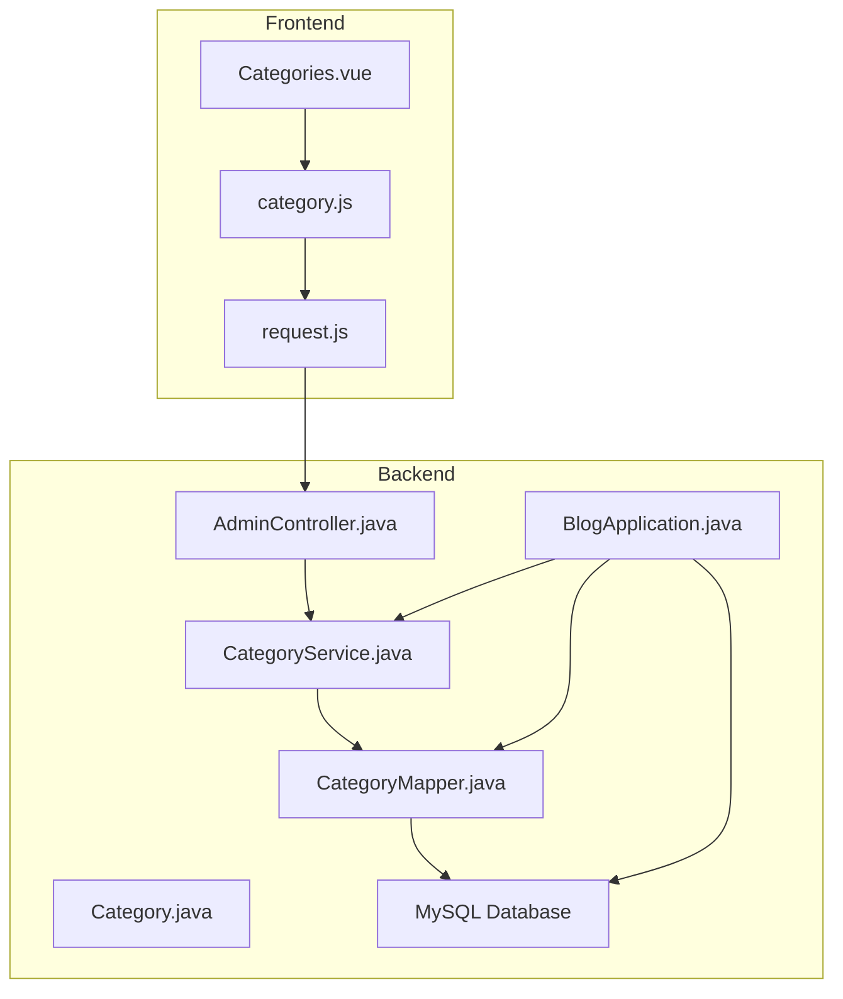
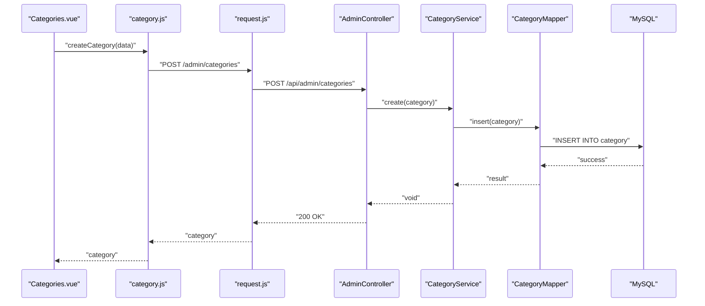
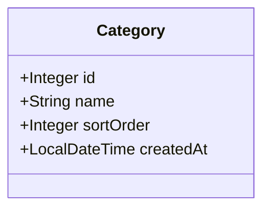
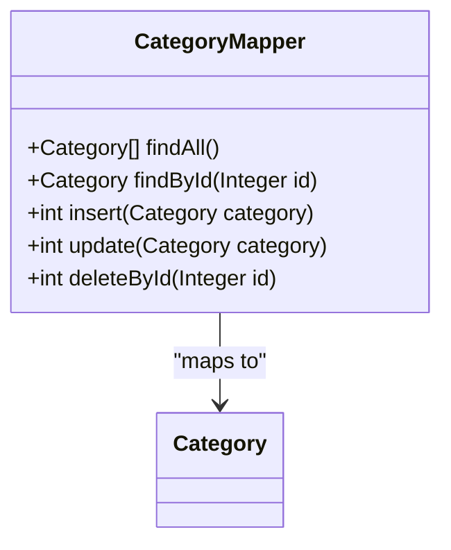
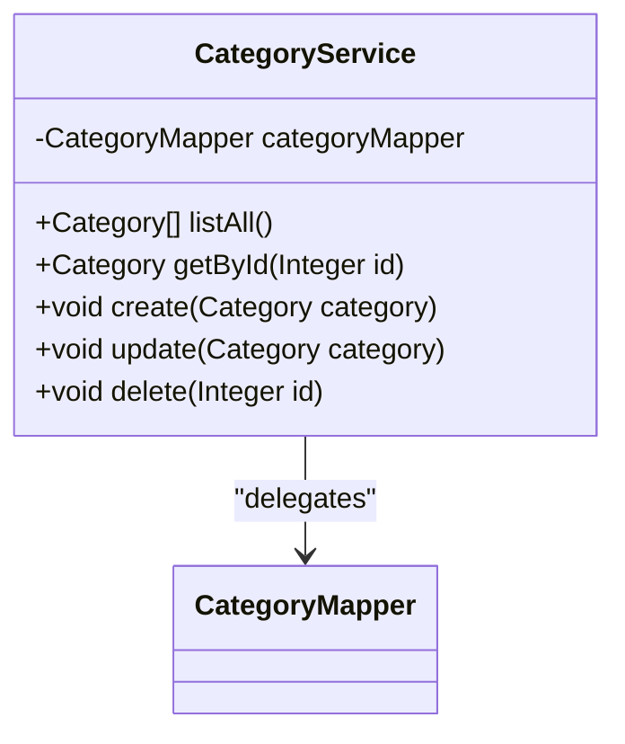
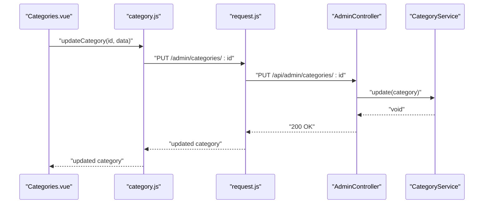
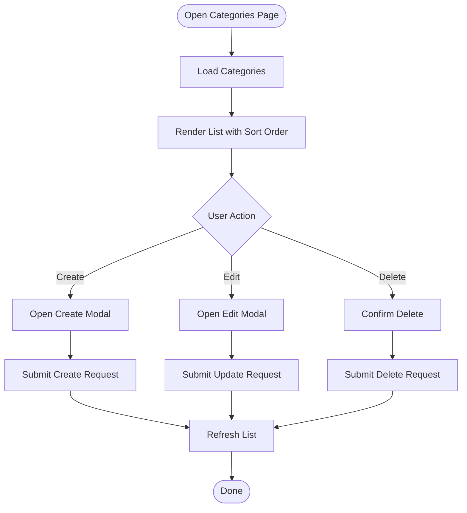
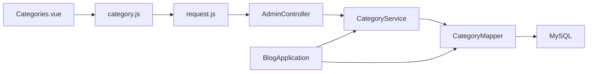

# Category Service - Hierarchical Content Organization

<cite>
**Referenced Files in This Document**
- [CategoryService.java](file://blog-backend/src/main/java/com/blog/service/CategoryService.java)
- [CategoryMapper.java](file://blog-backend/src/main/java/com/blog/mapper/CategoryMapper.java)
- [Category.java](file://blog-backend/src/main/java/com/blog/entity/Category.java)
- [AdminController.java](file://blog-backend/src/main/java/com/blog/controller/AdminController.java)
- [BlogApplication.java](file://blog-backend/src/main/java/com/blog/BlogApplication.java)
- [schema.sql](file://blog-backend/src/main/resources/schema.sql)
- [application.yml](file://blog-backend/src/main/resources/application.yml)
- [Categories.vue](file://blog-frontend/src/views/admin/Categories.vue)
- [category.js](file://blog-frontend/src/api/category.js)
- [request.js](file://blog-frontend/src/api/request.js)
</cite>

## Table of Contents
1. [Introduction](#introduction)
2. [Project Structure](#project-structure)
3. [Core Components](#core-components)
4. [Architecture Overview](#architecture-overview)
5. [Detailed Component Analysis](#detailed-component-analysis)
6. [Dependency Analysis](#dependency-analysis)
7. [Performance Considerations](#performance-considerations)
8. [Troubleshooting Guide](#troubleshooting-guide)
9. [Conclusion](#conclusion)

## Introduction
This document provides comprehensive documentation for the Category Service responsible for hierarchical content organization. It covers category CRUD operations, sorting mechanisms, and category hierarchy maintenance. The service integrates with CategoryMapper for database operations and applies caching for improved performance. Business rules for category validation and data consistency are outlined, along with practical workflows, sorting algorithms, and performance considerations for category-heavy applications.

## Project Structure
The Category Service spans backend and frontend components:
- Backend: Spring Boot application with MyBatis for persistence, exposing REST endpoints for administrative category management.
- Frontend: Vue.js admin panel for listing, creating, updating, and deleting categories with real-time updates.

**Diagram sources**
- [BlogApplication.java:1-16](file://blog-backend/src/main/java/com/blog/BlogApplication.java#L1-L16)
- [AdminController.java:61-79](file://blog-backend/src/main/java/com/blog/controller/AdminController.java#L61-L79)
- [CategoryService.java:12-41](file://blog-backend/src/main/java/com/blog/service/CategoryService.java#L12-L41)
- [CategoryMapper.java:8-26](file://blog-backend/src/main/java/com/blog/mapper/CategoryMapper.java#L8-L26)
- [Category.java:6-12](file://blog-backend/src/main/java/com/blog/entity/Category.java#L6-L12)
- [Categories.vue:43-81](file://blog-frontend/src/views/admin/Categories.vue#L43-L81)
- [category.js:1-10](file://blog-frontend/src/api/category.js#L1-L10)
- [request.js:1-33](file://blog-frontend/src/api/request.js#L1-L33)

**Section sources**
- [BlogApplication.java:1-16](file://blog-backend/src/main/java/com/blog/BlogApplication.java#L1-L16)
- [application.yml:1-33](file://blog-backend/src/main/resources/application.yml#L1-L33)

## Core Components
- Category entity: Defines category attributes including identifier, name, sort order, and creation timestamp.
- CategoryMapper: Provides SQL operations for category persistence with explicit ordering by sort_order and id.
- CategoryService: Orchestrates category operations with caching enabled for listing and cache invalidation on write operations.
- AdminController: Exposes REST endpoints for category management under the admin API.
- Frontend integration: Vue component and API module for category CRUD actions.

Key capabilities:
- Retrieve all categories with deterministic ordering.
- Fetch a single category by ID.
- Create, update, and delete categories.
- Automatic cache invalidation after modifications to maintain consistency.

**Section sources**
- [Category.java:6-12](file://blog-backend/src/main/java/com/blog/entity/Category.java#L6-L12)
- [CategoryMapper.java:11-25](file://blog-backend/src/main/java/com/blog/mapper/CategoryMapper.java#L11-L25)
- [CategoryService.java:18-40](file://blog-backend/src/main/java/com/blog/service/CategoryService.java#L18-L40)
- [AdminController.java:61-79](file://blog-backend/src/main/java/com/blog/controller/AdminController.java#L61-L79)

## Architecture Overview
The Category Service follows a layered architecture:
- Presentation: AdminController exposes admin endpoints.
- Application: CategoryService coordinates business operations.
- Persistence: CategoryMapper executes SQL queries and DML statements.
- Data Model: Category entity encapsulates category data.
- Caching: Spring caching annotations manage cache population and eviction.
- Frontend: Vue admin UI communicates via Axios to the backend.

**Diagram sources**
- [Categories.vue:66-74](file://blog-frontend/src/views/admin/Categories.vue#L66-L74)
- [category.js:5](file://blog-frontend/src/api/category.js#L5)
- [request.js:4-7](file://blog-frontend/src/api/request.js#L4-L7)
- [AdminController.java:62-66](file://blog-backend/src/main/java/com/blog/controller/AdminController.java#L62-L66)
- [CategoryService.java:28-30](file://blog-backend/src/main/java/com/blog/service/CategoryService.java#L28-L30)
- [CategoryMapper.java:17-19](file://blog-backend/src/main/java/com/blog/mapper/CategoryMapper.java#L17-L19)

## Detailed Component Analysis

### Category Entity
The Category entity defines the category model with:
- Identifier: Integer primary key.
- Name: Non-empty string for category display.
- Sort order: Integer used for ordering categories.
- Created at: Timestamp for audit and ordering fallback.

**Diagram sources**
- [Category.java:6-12](file://blog-backend/src/main/java/com/blog/entity/Category.java#L6-L12)

**Section sources**
- [Category.java:6-12](file://blog-backend/src/main/java/com/blog/entity/Category.java#L6-L12)

### Category Mapper
CategoryMapper implements:
- findAll: Retrieves all categories ordered by sort_order ascending, then by id ascending.
- findById: Retrieves a category by its identifier.
- insert: Inserts a new category with generated keys.
- update: Updates an existing category by identifier.
- deleteById: Removes a category by its identifier.

**Diagram sources**
- [CategoryMapper.java:8-26](file://blog-backend/src/main/java/com/blog/mapper/CategoryMapper.java#L8-L26)
- [Category.java:6-12](file://blog-backend/src/main/java/com/blog/entity/Category.java#L6-L12)

**Section sources**
- [CategoryMapper.java:11-25](file://blog-backend/src/main/java/com/blog/mapper/CategoryMapper.java#L11-L25)

### Category Service
CategoryService provides:
- listAll: Returns all categories with caching enabled.
- getById: Fetches a category by ID.
- create: Inserts a new category with cache eviction.
- update: Updates an existing category with cache eviction.
- delete: Removes a category by ID with cache eviction.

**Diagram sources**
- [CategoryService.java:12-41](file://blog-backend/src/main/java/com/blog/service/CategoryService.java#L12-L41)
- [CategoryMapper.java:8-26](file://blog-backend/src/main/java/com/blog/mapper/CategoryMapper.java#L8-L26)

**Section sources**
- [CategoryService.java:18-40](file://blog-backend/src/main/java/com/blog/service/CategoryService.java#L18-L40)

### Admin Controller Endpoints
Admin endpoints for category management:
- POST /api/admin/categories: Creates a new category.
- PUT /api/admin/categories/{id}: Updates an existing category.
- DELETE /api/admin/categories/{id}: Deletes a category.

**Diagram sources**
- [Categories.vue:66-74](file://blog-frontend/src/views/admin/Categories.vue#L66-L74)
- [category.js:7](file://blog-frontend/src/api/category.js#L7)
- [request.js:4-7](file://blog-frontend/src/api/request.js#L4-L7)
- [AdminController.java:68-73](file://blog-backend/src/main/java/com/blog/controller/AdminController.java#L68-L73)
- [CategoryService.java:32-35](file://blog-backend/src/main/java/com/blog/service/CategoryService.java#L32-L35)

**Section sources**
- [AdminController.java:61-79](file://blog-backend/src/main/java/com/blog/controller/AdminController.java#L61-L79)

### Frontend Integration
The frontend component manages category CRUD:
- Lists categories with sort order display.
- Opens modal forms for creation and editing.
- Submits requests to admin endpoints.
- Refreshes the list after successful operations.

**Diagram sources**
- [Categories.vue:55-80](file://blog-frontend/src/views/admin/Categories.vue#L55-L80)
- [category.js:3-9](file://blog-frontend/src/api/category.js#L3-L9)
- [request.js:4-7](file://blog-frontend/src/api/request.js#L4-L7)

**Section sources**
- [Categories.vue:43-81](file://blog-frontend/src/views/admin/Categories.vue#L43-L81)
- [category.js:1-10](file://blog-frontend/src/api/category.js#L1-L10)
- [request.js:1-33](file://blog-frontend/src/api/request.js#L1-L33)

## Dependency Analysis
- CategoryService depends on CategoryMapper for database operations.
- AdminController depends on CategoryService for business logic.
- CategoryMapper relies on MySQL via MyBatis annotations.
- Frontend depends on Axios for HTTP communication and on AdminController endpoints.
- BlogApplication enables caching and mapper scanning.

**Diagram sources**
- [BlogApplication.java:8-10](file://blog-backend/src/main/java/com/blog/BlogApplication.java#L8-L10)
- [CategoryService.java:16](file://blog-backend/src/main/java/com/blog/service/CategoryService.java#L16)
- [CategoryMapper.java:8](file://blog-backend/src/main/java/com/blog/mapper/CategoryMapper.java#L8)
- [AdminController.java:25-29](file://blog-backend/src/main/java/com/blog/controller/AdminController.java#L25-L29)
- [Categories.vue:44-45](file://blog-frontend/src/views/admin/Categories.vue#L44-L45)
- [category.js:1](file://blog-frontend/src/api/category.js#L1)
- [request.js:4](file://blog-frontend/src/api/request.js#L4)

**Section sources**
- [BlogApplication.java:8-10](file://blog-backend/src/main/java/com/blog/BlogApplication.java#L8-L10)
- [application.yml:21-25](file://blog-backend/src/main/resources/application.yml#L21-L25)

## Performance Considerations
- Caching: listAll is cached to reduce repeated database queries. Cache is evicted on create/update/delete to ensure freshness.
- Sorting: findAll orders by sort_order and id, minimizing client-side sorting overhead.
- Indexing: Consider adding an index on sort_order for frequent reordering scenarios.
- Batch operations: For bulk updates, batch SQL statements can reduce round-trips.
- Pagination: For large category sets, introduce pagination to limit result sizes.
- Connection pooling: Configure connection pool settings appropriately for concurrent access.

[No sources needed since this section provides general guidance]

## Troubleshooting Guide
Common issues and resolutions:
- Cache inconsistency after writes: Ensure cache eviction triggers on create/update/delete operations.
- Ordering anomalies: Verify sort_order values and fallback to id ordering in queries.
- Validation errors: Enforce non-empty names and integer sort_order values at the API boundary.
- Database connectivity: Confirm JDBC URL, credentials, and driver configuration.
- CORS and interceptors: Validate frontend base URL and interceptor configurations.

**Section sources**
- [CategoryService.java:18-40](file://blog-backend/src/main/java/com/blog/service/CategoryService.java#L18-L40)
- [CategoryMapper.java:11-25](file://blog-backend/src/main/java/com/blog/mapper/CategoryMapper.java#L11-L25)
- [application.yml:4-9](file://blog-backend/src/main/resources/application.yml#L4-L9)
- [request.js:9-18](file://blog-frontend/src/api/request.js#L9-L18)

## Conclusion
The Category Service provides a robust foundation for hierarchical content organization with clear separation of concerns, caching for performance, and explicit ordering via sort_order. Its integration with CategoryMapper ensures reliable persistence, while the admin controller and frontend components deliver a smooth management experience. By adhering to the outlined business rules and performance recommendations, applications can efficiently handle category-heavy workloads.