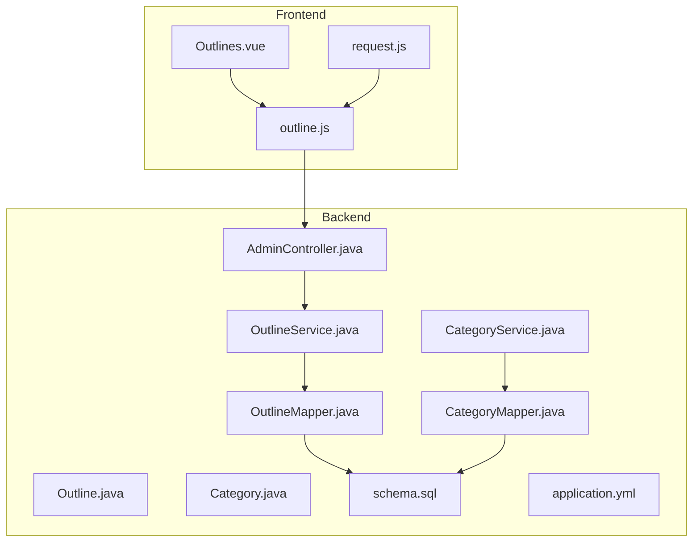
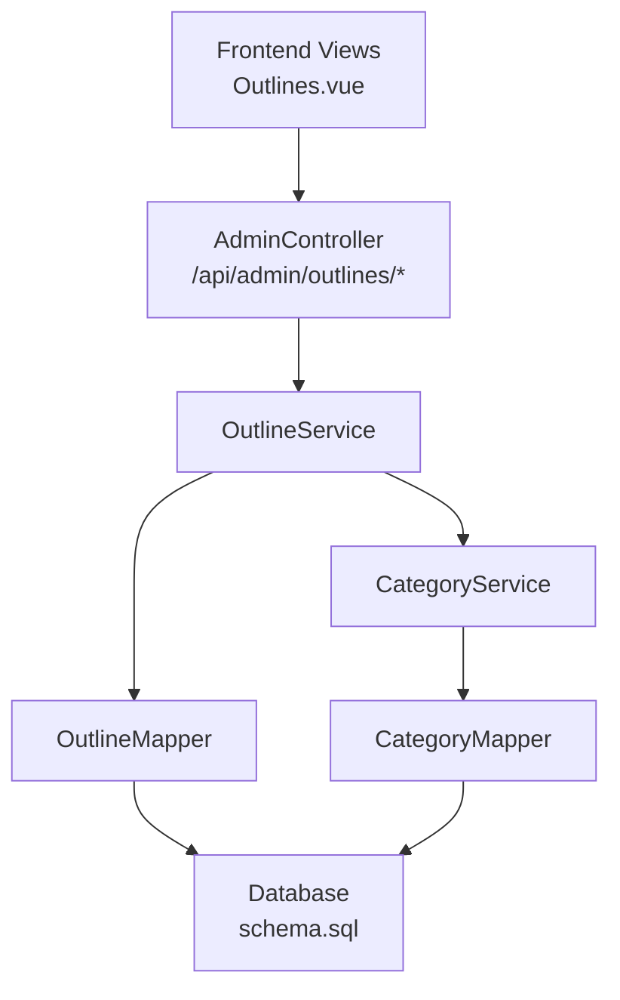
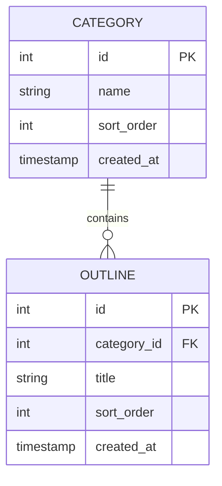
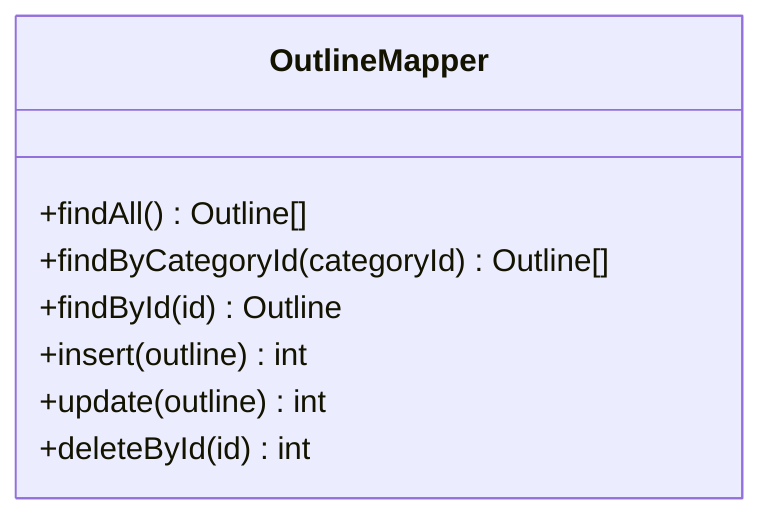
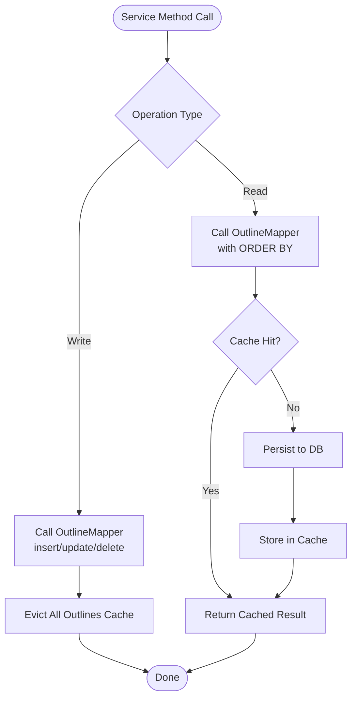
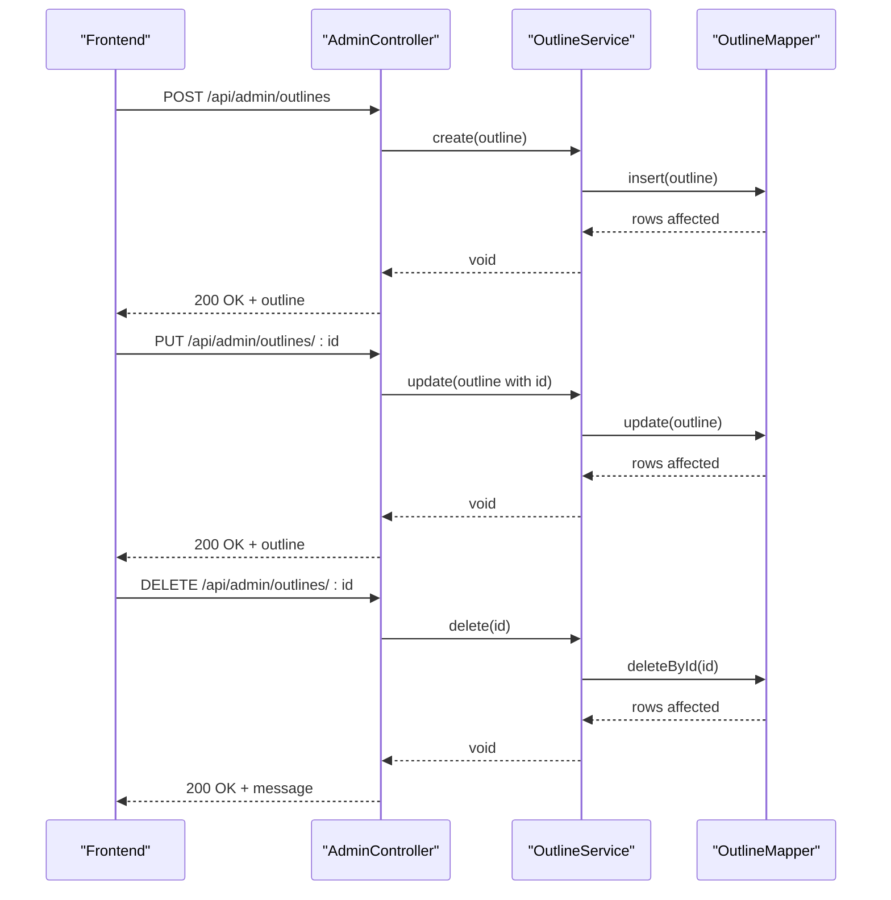
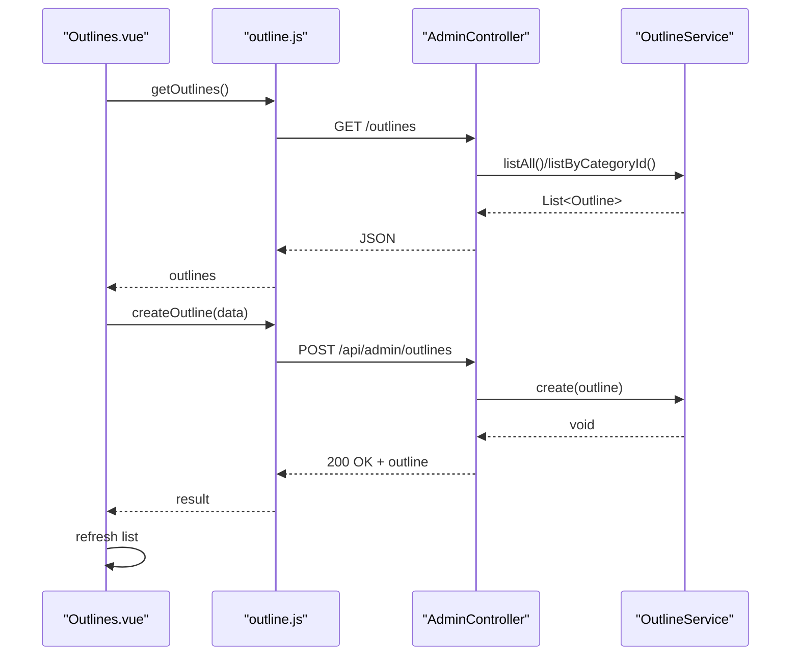
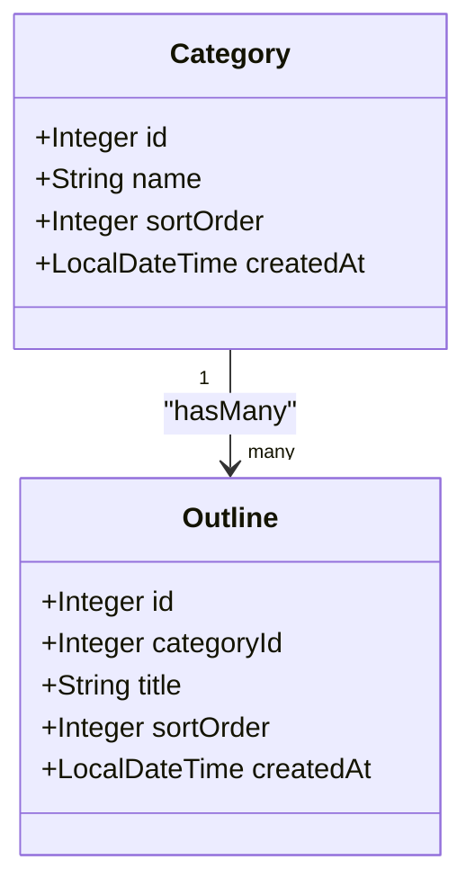
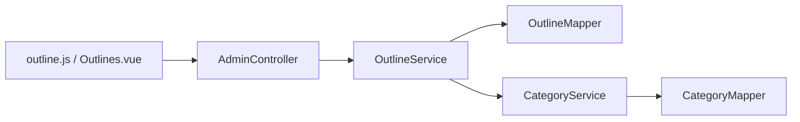

# Outline Service - Content Structure Management

<cite>
**Referenced Files in This Document**
- [OutlineService.java](file://blog-backend/src/main/java/com/blog/service/OutlineService.java)
- [OutlineMapper.java](file://blog-backend/src/main/java/com/blog/mapper/OutlineMapper.java)
- [Outline.java](file://blog-backend/src/main/java/com/blog/entity/Outline.java)
- [AdminController.java](file://blog-backend/src/main/java/com/blog/controller/AdminController.java)
- [CategoryService.java](file://blog-backend/src/main/java/com/blog/service/CategoryService.java)
- [CategoryMapper.java](file://blog-backend/src/main/java/com/blog/mapper/CategoryMapper.java)
- [Category.java](file://blog-backend/src/main/java/com/blog/entity/Category.java)
- [schema.sql](file://blog-backend/src/main/resources/schema.sql)
- [outline.js](file://blog-frontend/src/api/outline.js)
- [Outlines.vue](file://blog-frontend/src/views/admin/Outlines.vue)
- [request.js](file://blog-frontend/src/api/request.js)
- [application.yml](file://blog-backend/src/main/resources/application.yml)
</cite>

## Table of Contents
1. [Introduction](#introduction)
2. [Project Structure](#project-structure)
3. [Core Components](#core-components)
4. [Architecture Overview](#architecture-overview)
5. [Detailed Component Analysis](#detailed-component-analysis)
6. [Dependency Analysis](#dependency-analysis)
7. [Performance Considerations](#performance-considerations)
8. [Troubleshooting Guide](#troubleshooting-guide)
9. [Conclusion](#conclusion)

## Introduction
This document provides comprehensive documentation for the Outline Service responsible for content structure management. It explains the service's role in managing outline CRUD operations, hierarchical content organization, and its relationship with categories. The documentation covers service methods for outline creation, modification, deletion, and retrieval with proper sorting and ordering support, integration with OutlineMapper for database operations, and business logic for maintaining outline hierarchies. Examples of outline management workflows, category-outline relationships, and data integrity maintenance are included, along with validation rules, sorting mechanisms, and performance optimization strategies for complex content structures.

## Project Structure
The Outline Service resides in the backend Java module alongside related services, mappers, entities, controllers, and frontend components. The backend uses Spring Boot with MyBatis for persistence, while the frontend is a Vue.js application communicating via REST APIs.

**Diagram sources**
- [OutlineService.java:1-47](file://blog-backend/src/main/java/com/blog/service/OutlineService.java#L1-L47)
- [OutlineMapper.java:1-30](file://blog-backend/src/main/java/com/blog/mapper/OutlineMapper.java#L1-L30)
- [Outline.java:1-14](file://blog-backend/src/main/java/com/blog/entity/Outline.java#L1-L14)
- [AdminController.java:1-121](file://blog-backend/src/main/java/com/blog/controller/AdminController.java#L1-L121)
- [CategoryService.java:1-42](file://blog-backend/src/main/java/com/blog/service/CategoryService.java#L1-L42)
- [CategoryMapper.java:1-27](file://blog-backend/src/main/java/com/blog/mapper/CategoryMapper.java#L1-L27)
- [Category.java:1-13](file://blog-backend/src/main/java/com/blog/entity/Category.java#L1-L13)
- [schema.sql:1-33](file://blog-backend/src/main/resources/schema.sql#L1-L33)
- [application.yml:1-33](file://blog-backend/src/main/resources/application.yml#L1-L33)
- [outline.js:1-10](file://blog-frontend/src/api/outline.js#L1-L10)
- [Outlines.vue:1-172](file://blog-frontend/src/views/admin/Outlines.vue#L1-L172)
- [request.js:1-33](file://blog-frontend/src/api/request.js#L1-L33)

**Section sources**
- [OutlineService.java:1-47](file://blog-backend/src/main/java/com/blog/service/OutlineService.java#L1-L47)
- [OutlineMapper.java:1-30](file://blog-backend/src/main/java/com/blog/mapper/OutlineMapper.java#L1-L30)
- [Outline.java:1-14](file://blog-backend/src/main/java/com/blog/entity/Outline.java#L1-L14)
- [AdminController.java:1-121](file://blog-backend/src/main/java/com/blog/controller/AdminController.java#L1-L121)
- [CategoryService.java:1-42](file://blog-backend/src/main/java/com/blog/service/CategoryService.java#L1-L42)
- [CategoryMapper.java:1-27](file://blog-backend/src/main/java/com/blog/mapper/CategoryMapper.java#L1-L27)
- [Category.java:1-13](file://blog-backend/src/main/java/com/blog/entity/Category.java#L1-L13)
- [schema.sql:1-33](file://blog-backend/src/main/resources/schema.sql#L1-L33)
- [application.yml:1-33](file://blog-backend/src/main/resources/application.yml#L1-L33)
- [outline.js:1-10](file://blog-frontend/src/api/outline.js#L1-L10)
- [Outlines.vue:1-172](file://blog-frontend/src/views/admin/Outlines.vue#L1-L172)
- [request.js:1-33](file://blog-frontend/src/api/request.js#L1-L33)

## Core Components
- Outline entity defines the structure of outline records with fields for category association, title, sort order, and timestamps.
- OutlineMapper encapsulates SQL operations for outline persistence, including queries with deterministic ordering and CRUD statements.
- OutlineService orchestrates business logic for outline operations, applies caching policies, and delegates persistence to OutlineMapper.
- AdminController exposes administrative endpoints for outline management, delegating to OutlineService.
- CategoryService and CategoryMapper manage categories, which serve as parent containers for outlines.
- Frontend modules provide user interfaces and API bindings for outline CRUD operations.

Key responsibilities:
- Maintain outline hierarchy via category foreign key relationships.
- Enforce deterministic ordering through sort_order and id.
- Provide cached retrieval for improved performance.
- Ensure data integrity via database constraints and cascading deletes.

**Section sources**
- [Outline.java:1-14](file://blog-backend/src/main/java/com/blog/entity/Outline.java#L1-L14)
- [OutlineMapper.java:1-30](file://blog-backend/src/main/java/com/blog/mapper/OutlineMapper.java#L1-L30)
- [OutlineService.java:1-47](file://blog-backend/src/main/java/com/blog/service/OutlineService.java#L1-L47)
- [AdminController.java:81-99](file://blog-backend/src/main/java/com/blog/controller/AdminController.java#L81-L99)
- [CategoryService.java:1-42](file://blog-backend/src/main/java/com/blog/service/CategoryService.java#L1-L42)
- [CategoryMapper.java:1-27](file://blog-backend/src/main/java/com/blog/mapper/CategoryMapper.java#L1-L27)
- [schema.sql:8-15](file://blog-backend/src/main/resources/schema.sql#L8-L15)
- [outline.js:1-10](file://blog-frontend/src/api/outline.js#L1-L10)
- [Outlines.vue:1-172](file://blog-frontend/src/views/admin/Outlines.vue#L1-L172)

## Architecture Overview
The system follows a layered architecture:
- Presentation layer: AdminController handles HTTP requests for outline management.
- Application layer: OutlineService manages business logic and caching.
- Persistence layer: OutlineMapper executes SQL against the database with ordered queries.
- Data model: Entities represent domain objects with foreign key relationships to categories.

**Diagram sources**
- [AdminController.java:81-99](file://blog-backend/src/main/java/com/blog/controller/AdminController.java#L81-L99)
- [OutlineService.java:1-47](file://blog-backend/src/main/java/com/blog/service/OutlineService.java#L1-L47)
- [OutlineMapper.java:1-30](file://blog-backend/src/main/java/com/blog/mapper/OutlineMapper.java#L1-L30)
- [schema.sql:1-33](file://blog-backend/src/main/resources/schema.sql#L1-L33)
- [CategoryService.java:1-42](file://blog-backend/src/main/java/com/blog/service/CategoryService.java#L1-L42)
- [CategoryMapper.java:1-27](file://blog-backend/src/main/java/com/blog/mapper/CategoryMapper.java#L1-L27)
- [Outlines.vue:1-172](file://blog-frontend/src/views/admin/Outlines.vue#L1-L172)

## Detailed Component Analysis

### Outline Entity and Data Model
The Outline entity captures essential attributes for content structure:
- Fields: id, categoryId, title, sortOrder, createdAt.
- Relationship: belongs to a Category via categoryId.
- Ordering: sort_order combined with id ensures stable ordering.

**Diagram sources**
- [schema.sql:1-15](file://blog-backend/src/main/resources/schema.sql#L1-L15)
- [Outline.java:1-14](file://blog-backend/src/main/java/com/blog/entity/Outline.java#L1-L14)
- [Category.java:1-13](file://blog-backend/src/main/java/com/blog/entity/Category.java#L1-L13)

**Section sources**
- [Outline.java:1-14](file://blog-backend/src/main/java/com/blog/entity/Outline.java#L1-L14)
- [schema.sql:8-15](file://blog-backend/src/main/resources/schema.sql#L8-L15)

### Outline Mapper Implementation
OutlineMapper defines SQL operations with explicit ordering:
- findAll: retrieves all outlines sorted by sort_order, then id.
- findByCategoryId: filters outlines by category with the same ordering.
- findById: fetches a single outline by primary key.
- insert: persists a new outline with generated keys.
- update: modifies existing outline fields.
- deleteById: removes an outline by id.

**Diagram sources**
- [OutlineMapper.java:1-30](file://blog-backend/src/main/java/com/blog/mapper/OutlineMapper.java#L1-L30)

**Section sources**
- [OutlineMapper.java:11-28](file://blog-backend/src/main/java/com/blog/mapper/OutlineMapper.java#L11-L28)
- [schema.sql:8-15](file://blog-backend/src/main/resources/schema.sql#L8-L15)

### Outline Service Methods and Caching
OutlineService provides:
- listAll: returns all outlines with cache key "all".
- listByCategoryId: returns outlines filtered by categoryId with cache keyed by categoryId.
- getById: fetches a single outline by id without caching.
- create: inserts a new outline and evicts all outline cache entries.
- update: updates an existing outline and evicts all outline cache entries.
- delete: removes an outline by id and evicts all outline cache entries.

Caching strategy:
- Cache region: outlines.
- Cache eviction: allEntries=true on write operations to maintain consistency.
- Cache retrieval: listAll and listByCategoryId are cached.

**Diagram sources**
- [OutlineService.java:18-45](file://blog-backend/src/main/java/com/blog/service/OutlineService.java#L18-L45)
- [OutlineMapper.java:11-28](file://blog-backend/src/main/java/com/blog/mapper/OutlineMapper.java#L11-L28)

**Section sources**
- [OutlineService.java:18-45](file://blog-backend/src/main/java/com/blog/service/OutlineService.java#L18-L45)
- [application.yml:1-33](file://blog-backend/src/main/resources/application.yml#L1-L33)

### Administrative API Integration
Admin REST endpoints delegate to OutlineService:
- POST /api/admin/outlines: creates a new outline.
- PUT /api/admin/outlines/{id}: updates an existing outline.
- DELETE /api/admin/outlines/{id}: deletes an outline.

These endpoints are exposed in AdminController and consumed by the frontend.

**Diagram sources**
- [AdminController.java:81-99](file://blog-backend/src/main/java/com/blog/controller/AdminController.java#L81-L99)
- [OutlineService.java:32-45](file://blog-backend/src/main/java/com/blog/service/OutlineService.java#L32-L45)
- [OutlineMapper.java:20-28](file://blog-backend/src/main/java/com/blog/mapper/OutlineMapper.java#L20-L28)

**Section sources**
- [AdminController.java:81-99](file://blog-backend/src/main/java/com/blog/controller/AdminController.java#L81-L99)
- [outline.js:5-9](file://blog-frontend/src/api/outline.js#L5-L9)
- [Outlines.vue:84-98](file://blog-frontend/src/views/admin/Outlines.vue#L84-L98)

### Frontend Integration and Workflows
Frontend components:
- Outlines.vue: displays outlines, allows editing, creation, and deletion.
- outline.js: API helpers for outline CRUD.
- request.js: Axios instance with interceptors for auth and error handling.

Typical workflows:
- Load categories and outlines, render in Outlines.vue.
- Create: fill form, submit to create endpoint, refresh list.
- Edit: select item, populate form, submit to update endpoint, refresh list.
- Delete: confirm action, call delete endpoint, refresh list.

**Diagram sources**
- [Outlines.vue:61-98](file://blog-frontend/src/views/admin/Outlines.vue#L61-L98)
- [outline.js:3-9](file://blog-frontend/src/api/outline.js#L3-L9)
- [AdminController.java:81-99](file://blog-backend/src/main/java/com/blog/controller/AdminController.java#L81-L99)
- [OutlineService.java:18-26](file://blog-backend/src/main/java/com/blog/service/OutlineService.java#L18-L26)

**Section sources**
- [Outlines.vue:1-172](file://blog-frontend/src/views/admin/Outlines.vue#L1-L172)
- [outline.js:1-10](file://blog-frontend/src/api/outline.js#L1-L10)
- [request.js:1-33](file://blog-frontend/src/api/request.js#L1-L33)

### Sorting and Ordering Mechanisms
Sorting is enforced at the database level:
- Both findAll and findByCategoryId queries order results by sort_order, then id.
- This ensures consistent presentation regardless of insertion order.
- The entity includes sortOrder to support configurable ordering per outline.

Best practices:
- Always set sortOrder when creating or reordering outlines.
- Use batch updates to adjust multiple sortOrder values when reordering.

**Section sources**
- [OutlineMapper.java:11-15](file://blog-backend/src/main/java/com/blog/mapper/OutlineMapper.java#L11-L15)
- [Outline.java:10-11](file://blog-backend/src/main/java/com/blog/entity/Outline.java#L10-L11)

### Validation Rules and Data Integrity
Validation rules observed in the codebase:
- Outline requires title and category_id.
- sortOrder defaults to 0 if not provided.
- createdAt is automatically managed by the database.

Data integrity mechanisms:
- Foreign key constraint: outline.category_id references category.id with ON DELETE CASCADE.
- Cascading deletes ensure that deleting a category removes dependent outlines.
- Unique constraints and non-null checks are enforced by the schema.

**Section sources**
- [schema.sql:8-15](file://blog-backend/src/main/resources/schema.sql#L8-L15)
- [OutlineMapper.java:20-22](file://blog-backend/src/main/java/com/blog/mapper/OutlineMapper.java#L20-L22)
- [Outline.java:8-12](file://blog-backend/src/main/java/com/blog/entity/Outline.java#L8-L12)

### Category-Outline Relationship
Relationship details:
- One Category contains many Outlines (one-to-many).
- Deleting a Category triggers cascading deletion of its Outlines.
- Outlines are retrieved either globally or filtered by categoryId.

**Diagram sources**
- [schema.sql:1-15](file://blog-backend/src/main/resources/schema.sql#L1-L15)
- [Category.java:1-13](file://blog-backend/src/main/java/com/blog/entity/Category.java#L1-L13)
- [Outline.java:1-14](file://blog-backend/src/main/java/com/blog/entity/Outline.java#L1-L14)

**Section sources**
- [CategoryService.java:1-42](file://blog-backend/src/main/java/com/blog/service/CategoryService.java#L1-L42)
- [CategoryMapper.java:11-25](file://blog-backend/src/main/java/com/blog/mapper/CategoryMapper.java#L11-L25)
- [schema.sql:8-15](file://blog-backend/src/main/resources/schema.sql#L8-L15)

## Dependency Analysis
- OutlineService depends on OutlineMapper for persistence operations.
- AdminController depends on OutlineService for outline management endpoints.
- CategoryService and CategoryMapper provide category data used by the frontend and potentially by outline queries.
- Frontend modules depend on API endpoints exposed by AdminController.

Potential circular dependencies:
- None observed among the outlined components.

External dependencies:
- MyBatis for SQL mapping and configuration.
- Redis configured for caching (application.yml).
- MySQL for persistence (application.yml).

**Diagram sources**
- [AdminController.java:25-29](file://blog-backend/src/main/java/com/blog/controller/AdminController.java#L25-L29)
- [OutlineService.java:16-16](file://blog-backend/src/main/java/com/blog/service/OutlineService.java#L16-L16)
- [OutlineMapper.java:1-30](file://blog-backend/src/main/java/com/blog/mapper/OutlineMapper.java#L1-L30)
- [CategoryService.java:16-16](file://blog-backend/src/main/java/com/blog/service/CategoryService.java#L16-L16)
- [CategoryMapper.java:1-27](file://blog-backend/src/main/java/com/blog/mapper/CategoryMapper.java#L1-L27)
- [outline.js:1-10](file://blog-frontend/src/api/outline.js#L1-L10)
- [Outlines.vue:50-52](file://blog-frontend/src/views/admin/Outlines.vue#L50-L52)

**Section sources**
- [application.yml:14-17](file://blog-backend/src/main/resources/application.yml#L14-L17)
- [application.yml:21-25](file://blog-backend/src/main/resources/application.yml#L21-L25)

## Performance Considerations
- Caching: listAll and listByCategoryId are cached to reduce database load. Writes evict all outline cache entries to maintain consistency.
- Indexing: ORDER BY on sort_order and id is efficient when indexed. The schema does not declare explicit indexes; consider adding composite indexes on (sort_order, id) and (category_id, sort_order) for improved query performance.
- Batch operations: Reordering multiple outlines should be performed in a single transaction to minimize cache evictions and database round-trips.
- Pagination: For large datasets, introduce pagination in listAll and listByCategoryId to limit result sets.
- Concurrency: Use optimistic locking or row-level locks if concurrent updates are frequent to prevent race conditions in sort order adjustments.

[No sources needed since this section provides general guidance]

## Troubleshooting Guide
Common issues and resolutions:
- 401 Unauthorized: Frontend interceptor redirects to login when encountering 401 responses. Verify JWT token presence and validity.
- Cache inconsistencies: After bulk updates, ensure cache eviction occurs. Confirm @CacheEvict(allEntries = true) is triggered on write operations.
- Foreign key violations: Attempting to create an outline with a non-existent categoryId will fail. Validate categoryId against CategoryService.
- Sorting anomalies: If outlines appear out of order, verify sortOrder values and ensure consistent updates across items during reordering.

**Section sources**
- [request.js:20-29](file://blog-frontend/src/api/request.js#L20-L29)
- [OutlineService.java:32-45](file://blog-backend/src/main/java/com/blog/service/OutlineService.java#L32-L45)
- [schema.sql:14-14](file://blog-backend/src/main/resources/schema.sql#L14-L14)

## Conclusion
The Outline Service provides robust management of content structure with clear separation of concerns, deterministic ordering, and caching for performance. Its integration with OutlineMapper and Category-related services ensures consistent data integrity and efficient retrieval. By following the outlined validation rules, sorting mechanisms, and performance recommendations, administrators can effectively manage complex content hierarchies while maintaining system reliability and responsiveness.