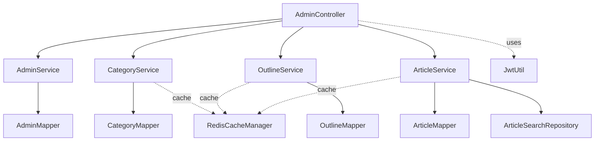
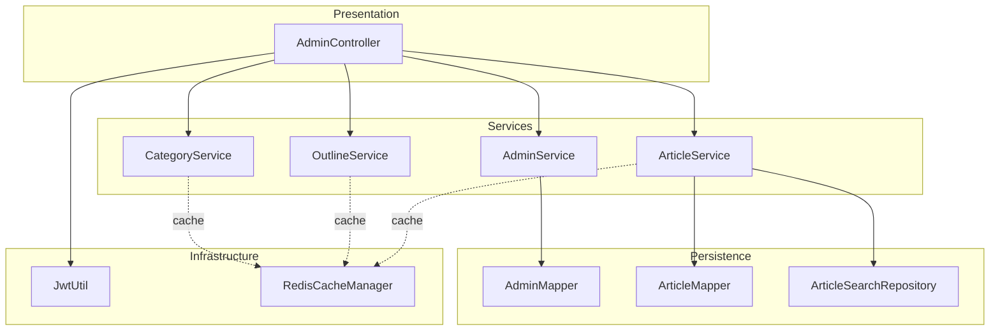
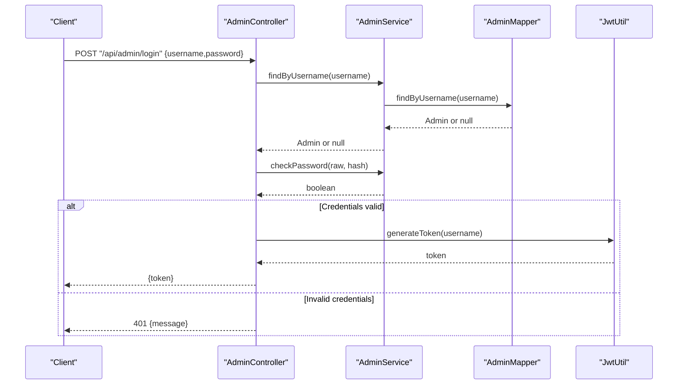
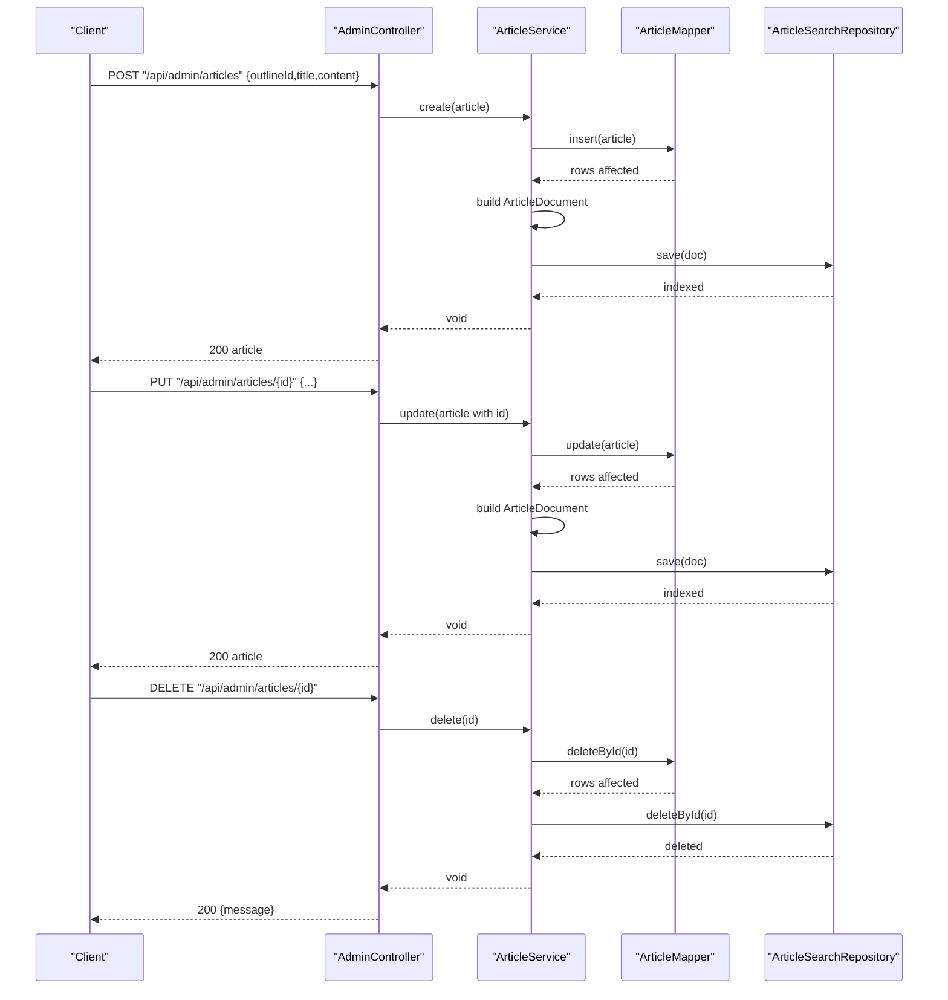
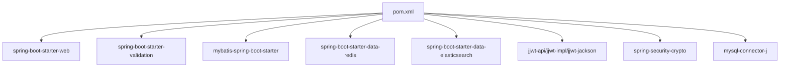

# Service Layer and Business Logic

<cite>
**Referenced Files in This Document**
- [AdminService.java](file://blog-backend/src/main/java/com/blog/service/AdminService.java)
- [ArticleService.java](file://blog-backend/src/main/java/com/blog/service/ArticleService.java)
- [CategoryService.java](file://blog-backend/src/main/java/com/blog/service/CategoryService.java)
- [OutlineService.java](file://blog-backend/src/main/java/com/blog/service/OutlineService.java)
- [AdminController.java](file://blog-backend/src/main/java/com/blog/controller/AdminController.java)
- [ArticleSearchRepository.java](file://blog-backend/src/main/java/com/blog/repository/ArticleSearchRepository.java)
- [AdminMapper.java](file://blog-backend/src/main/java/com/blog/mapper/AdminMapper.java)
- [ArticleMapper.java](file://blog-backend/src/main/java/com/blog/mapper/ArticleMapper.java)
- [JwtUtil.java](file://blog-backend/src/main/java/com/blog/util/JwtUtil.java)
- [RedisConfig.java](file://blog-backend/src/main/java/com/blog/config/RedisConfig.java)
- [application.yml](file://blog-backend/src/main/resources/application.yml)
- [Admin.java](file://blog-backend/src/main/java/com/blog/entity/Admin.java)
- [Article.java](file://blog-backend/src/main/java/com/blog/entity/Article.java)
- [ArticleDocument.java](file://blog-backend/src/main/java/com/blog/entity/ArticleDocument.java)
- [pom.xml](file://blog-backend/pom.xml)
</cite>

## Table of Contents
1. [Introduction](#introduction)
2. [Project Structure](#project-structure)
3. [Core Components](#core-components)
4. [Architecture Overview](#architecture-overview)
5. [Detailed Component Analysis](#detailed-component-analysis)
6. [Dependency Analysis](#dependency-analysis)
7. [Performance Considerations](#performance-considerations)
8. [Troubleshooting Guide](#troubleshooting-guide)
9. [Conclusion](#conclusion)

## Introduction
This document explains the service layer and business logic of the blog backend. It focuses on how services encapsulate business rules, coordinate between components, and manage side effects such as caching and search indexing. It also documents admin authentication, content management operations, and validation strategies, along with service-to-repository interaction patterns, error handling, and integration with Redis and Elasticsearch.

## Project Structure
The service layer is organized around domain-focused services:
- AdminService: manages administrative credentials and account initialization.
- CategoryService: CRUD for categories with caching.
- OutlineService: CRUD for outlines with caching.
- ArticleService: CRUD for articles with caching and Elasticsearch indexing.

Controllers orchestrate requests and delegate to services. Data access is handled via MyBatis mappers, while caching and search are integrated via Spring Cache and Spring Data Elasticsearch.

**Diagram sources**
- [AdminController.java:25-29](file://blog-backend/src/main/java/com/blog/controller/AdminController.java#L25-L29)
- [AdminService.java:13-14](file://blog-backend/src/main/java/com/blog/service/AdminService.java#L13-L14)
- [CategoryService.java:16](file://blog-backend/src/main/java/com/blog/service/CategoryService.java#L16)
- [OutlineService.java:16](file://blog-backend/src/main/java/com/blog/service/OutlineService.java#L16)
- [ArticleService.java:20-21](file://blog-backend/src/main/java/com/blog/service/ArticleService.java#L20-L21)
- [AdminMapper.java:9-14](file://blog-backend/src/main/java/com/blog/mapper/AdminMapper.java#L9-L14)
- [ArticleMapper.java:11-25](file://blog-backend/src/main/java/com/blog/mapper/ArticleMapper.java#L11-L25)
- [ArticleSearchRepository.java:8-11](file://blog-backend/src/main/java/com/blog/repository/ArticleSearchRepository.java#L8-L11)
- [JwtUtil.java:25-34](file://blog-backend/src/main/java/com/blog/util/JwtUtil.java#L25-L34)
- [RedisConfig.java:17-25](file://blog-backend/src/main/java/com/blog/config/RedisConfig.java#L17-L25)

**Section sources**
- [AdminController.java:19-121](file://blog-backend/src/main/java/com/blog/controller/AdminController.java#L19-L121)
- [AdminService.java:9-34](file://blog-backend/src/main/java/com/blog/service/AdminService.java#L9-L34)
- [CategoryService.java:12-42](file://blog-backend/src/main/java/com/blog/service/CategoryService.java#L12-L42)
- [OutlineService.java:12-47](file://blog-backend/src/main/java/com/blog/service/OutlineService.java#L12-L47)
- [ArticleService.java:15-72](file://blog-backend/src/main/java/com/blog/service/ArticleService.java#L15-L72)

## Core Components
- AdminService
  - Encapsulates admin credential lookup and verification using bcrypt.
  - Provides a bootstrap method to initialize an admin account if missing.
  - Uses AdminMapper for persistence.
  - Example reference: [AdminService.java:16-32](file://blog-backend/src/main/java/com/blog/service/AdminService.java#L16-L32)

- CategoryService
  - Lists and retrieves categories with caching.
  - Creates, updates, and deletes categories with cache invalidation.
  - Uses CategoryMapper for persistence.
  - Example reference: [CategoryService.java:18-40](file://blog-backend/src/main/java/com/blog/service/CategoryService.java#L18-L40)

- OutlineService
  - Lists all outlines and outlines filtered by category with caching.
  - Retrieves, creates, updates, and deletes outlines with cache invalidation.
  - Uses OutlineMapper for persistence.
  - Example reference: [OutlineService.java:18-45](file://blog-backend/src/main/java/com/blog/service/OutlineService.java#L18-L45)

- ArticleService
  - Lists articles by outline and retrieves by ID with caching.
  - Creates, updates, and deletes articles with cache invalidation.
  - Synchronizes Elasticsearch index on create/update/delete with guarded error handling.
  - Uses ArticleMapper for persistence and ArticleSearchRepository for search.
  - Example reference: [ArticleService.java:23-70](file://blog-backend/src/main/java/com/blog/service/ArticleService.java#L23-L70)

- AdminController
  - Exposes admin endpoints: login, image upload, and CRUD for categories, outlines, and articles.
  - Delegates to services and returns standardized JSON responses.
  - Uses JwtUtil for token generation and reads upload path from configuration.
  - Example reference: [AdminController.java:34-119](file://blog-backend/src/main/java/com/blog/controller/AdminController.java#L34-L119)

**Section sources**
- [AdminService.java:9-34](file://blog-backend/src/main/java/com/blog/service/AdminService.java#L9-L34)
- [CategoryService.java:12-42](file://blog-backend/src/main/java/com/blog/service/CategoryService.java#L12-L42)
- [OutlineService.java:12-47](file://blog-backend/src/main/java/com/blog/service/OutlineService.java#L12-L47)
- [ArticleService.java:15-72](file://blog-backend/src/main/java/com/blog/service/ArticleService.java#L15-L72)
- [AdminController.java:19-121](file://blog-backend/src/main/java/com/blog/controller/AdminController.java#L19-L121)

## Architecture Overview
The service layer follows a clean separation:
- Controllers handle HTTP concerns and request/response formatting.
- Services encapsulate business logic and cross-cutting concerns (caching, search index synchronization).
- Mappers abstract SQL operations.
- Repositories integrate with Elasticsearch.
- Utilities (JwtUtil) provide cross-cutting capabilities.
- Redis cache manager configures cache TTL and serialization.

**Diagram sources**
- [AdminController.java:25-29](file://blog-backend/src/main/java/com/blog/controller/AdminController.java#L25-L29)
- [AdminService.java:13-14](file://blog-backend/src/main/java/com/blog/service/AdminService.java#L13-L14)
- [ArticleService.java:20-21](file://blog-backend/src/main/java/com/blog/service/ArticleService.java#L20-L21)
- [ArticleSearchRepository.java:8-11](file://blog-backend/src/main/java/com/blog/repository/ArticleSearchRepository.java#L8-L11)
- [JwtUtil.java:25-34](file://blog-backend/src/main/java/com/blog/util/JwtUtil.java#L25-L34)
- [RedisConfig.java:17-25](file://blog-backend/src/main/java/com/blog/config/RedisConfig.java#L17-L25)

## Detailed Component Analysis

### Admin Authentication Flow
This sequence illustrates login validation, password verification, and token issuance.

**Diagram sources**
- [AdminController.java:34-44](file://blog-backend/src/main/java/com/blog/controller/AdminController.java#L34-L44)
- [AdminService.java:16-22](file://blog-backend/src/main/java/com/blog/service/AdminService.java#L16-L22)
- [AdminMapper.java:9-10](file://blog-backend/src/main/java/com/blog/mapper/AdminMapper.java#L9-L10)
- [JwtUtil.java:25-34](file://blog-backend/src/main/java/com/blog/util/JwtUtil.java#L25-L34)

**Section sources**
- [AdminController.java:34-44](file://blog-backend/src/main/java/com/blog/controller/AdminController.java#L34-L44)
- [AdminService.java:16-22](file://blog-backend/src/main/java/com/blog/service/AdminService.java#L16-L22)
- [AdminMapper.java:9-14](file://blog-backend/src/main/java/com/blog/mapper/AdminMapper.java#L9-L14)
- [JwtUtil.java:25-47](file://blog-backend/src/main/java/com/blog/util/JwtUtil.java#L25-L47)

### Content Management Operations
The ArticleService demonstrates CRUD with caching and Elasticsearch synchronization.

**Diagram sources**
- [ArticleService.java:32-70](file://blog-backend/src/main/java/com/blog/service/ArticleService.java#L32-L70)
- [ArticleMapper.java:17-25](file://blog-backend/src/main/java/com/blog/mapper/ArticleMapper.java#L17-L25)
- [ArticleSearchRepository.java:8-11](file://blog-backend/src/main/java/com/blog/repository/ArticleSearchRepository.java#L8-L11)
- [AdminController.java:102-119](file://blog-backend/src/main/java/com/blog/controller/AdminController.java#L102-L119)

**Section sources**
- [ArticleService.java:23-70](file://blog-backend/src/main/java/com/blog/service/ArticleService.java#L23-L70)
- [ArticleMapper.java:11-25](file://blog-backend/src/main/java/com/blog/mapper/ArticleMapper.java#L11-L25)
- [ArticleSearchRepository.java:8-11](file://blog-backend/src/main/java/com/blog/repository/ArticleSearchRepository.java#L8-L11)
- [AdminController.java:102-119](file://blog-backend/src/main/java/com/blog/controller/AdminController.java#L102-L119)

### Data Validation and Parameter Handling
- Controller-level validation
  - Login endpoint expects a JSON body with username and password keys.
  - Image upload endpoint expects a multipart file parameter named "file".
  - Category, outline, and article endpoints accept JSON bodies for creation and PUT requests set IDs from path variables.
  - Reference: [AdminController.java:34-119](file://blog-backend/src/main/java/com/blog/controller/AdminController.java#L34-L119)

- Service-level validation
  - AdminService does not enforce additional constraints beyond password matching against stored hash.
  - ArticleService does not perform explicit field validations; business rules are minimal (e.g., required fields in database).
  - CategoryService and OutlineService similarly rely on mapper-level constraints.
  - References:
    - [AdminService.java:16-22](file://blog-backend/src/main/java/com/blog/service/AdminService.java#L16-L22)
    - [ArticleService.java:32-70](file://blog-backend/src/main/java/com/blog/service/ArticleService.java#L32-L70)
    - [CategoryService.java:27-40](file://blog-backend/src/main/java/com/blog/service/CategoryService.java#L27-L40)
    - [OutlineService.java:32-45](file://blog-backend/src/main/java/com/blog/service/OutlineService.java#L32-L45)

- Entity models
  - Admin: username, passwordHash, createdAt.
  - Article: outlineId, title, content, timestamps.
  - ArticleDocument: id, outlineId, title, content (Elasticsearch document).
  - References:
    - [Admin.java:7-12](file://blog-backend/src/main/java/com/blog/entity/Admin.java#L7-L12)
    - [Article.java:7-14](file://blog-backend/src/main/java/com/blog/entity/Article.java#L7-L14)
    - [ArticleDocument.java:10-24](file://blog-backend/src/main/java/com/blog/entity/ArticleDocument.java#L10-L24)

**Section sources**
- [AdminController.java:34-119](file://blog-backend/src/main/java/com/blog/controller/AdminController.java#L34-L119)
- [AdminService.java:16-22](file://blog-backend/src/main/java/com/blog/service/AdminService.java#L16-L22)
- [ArticleService.java:32-70](file://blog-backend/src/main/java/com/blog/service/ArticleService.java#L32-L70)
- [CategoryService.java:27-40](file://blog-backend/src/main/java/com/blog/service/CategoryService.java#L27-L40)
- [OutlineService.java:32-45](file://blog-backend/src/main/java/com/blog/service/OutlineService.java#L32-L45)
- [Admin.java:7-12](file://blog-backend/src/main/java/com/blog/entity/Admin.java#L7-L12)
- [Article.java:7-14](file://blog-backend/src/main/java/com/blog/entity/Article.java#L7-L14)
- [ArticleDocument.java:10-24](file://blog-backend/src/main/java/com/blog/entity/ArticleDocument.java#L10-L24)

### Error Handling Strategies
- Admin login
  - Returns 401 Unauthorized with a message when credentials are invalid.
  - Reference: [AdminController.java:39-41](file://blog-backend/src/main/java/com/blog/controller/AdminController.java#L39-L41)

- File upload
  - On IOException during write, returns 400 Bad Request with a message.
  - Reference: [AdminController.java:56-58](file://blog-backend/src/main/java/com/blog/controller/AdminController.java#L56-L58)

- Elasticsearch operations
  - Article create/update/delete attempts to synchronize the index; failures are logged as warnings without propagating exceptions to the caller.
  - References:
    - [ArticleService.java:42-44](file://blog-backend/src/main/java/com/blog/service/ArticleService.java#L42-L44)
    - [ArticleService.java:57-59](file://blog-backend/src/main/java/com/blog/service/ArticleService.java#L57-L59)
    - [ArticleService.java:67-69](file://blog-backend/src/main/java/com/blog/service/ArticleService.java#L67-L69)

- Cache invalidation
  - Cache eviction occurs regardless of downstream index success/failure, ensuring eventual consistency.
  - Reference: [ArticleService.java:32-32](file://blog-backend/src/main/java/com/blog/service/ArticleService.java#L32-L32)

**Section sources**
- [AdminController.java:39-41](file://blog-backend/src/main/java/com/blog/controller/AdminController.java#L39-L41)
- [AdminController.java:56-58](file://blog-backend/src/main/java/com/blog/controller/AdminController.java#L56-L58)
- [ArticleService.java:42-44](file://blog-backend/src/main/java/com/blog/service/ArticleService.java#L42-L44)
- [ArticleService.java:57-59](file://blog-backend/src/main/java/com/blog/service/ArticleService.java#L57-L59)
- [ArticleService.java:67-69](file://blog-backend/src/main/java/com/blog/service/ArticleService.java#L67-L69)

### Transaction Management
- No explicit transaction boundaries are declared in services. The current implementation relies on:
  - Single mapper calls per operation.
  - No cross-service transactions.
  - Elasticsearch operations are outside the database transaction scope.
- Recommendations:
  - Annotate service methods that require atomicity with @Transactional.
  - Wrap Elasticsearch operations in transactions where feasible, or implement compensating actions on failure.
  - Reference for mapper usage: [ArticleService.java:33-34](file://blog-backend/src/main/java/com/blog/service/ArticleService.java#L33-L34)

**Section sources**
- [ArticleService.java:32-70](file://blog-backend/src/main/java/com/blog/service/ArticleService.java#L32-L70)

### Service-to-Repository Interaction Patterns
- ArticleService delegates to ArticleMapper for persistence and to ArticleSearchRepository for indexing.
- CategoryService and OutlineService expose list/getById methods without persistence dependencies in the service layer.
- References:
  - [ArticleService.java:20-21](file://blog-backend/src/main/java/com/blog/service/ArticleService.java#L20-L21)
  - [ArticleSearchRepository.java:8-11](file://blog-backend/src/main/java/com/blog/repository/ArticleSearchRepository.java#L8-L11)

**Section sources**
- [ArticleService.java:20-21](file://blog-backend/src/main/java/com/blog/service/ArticleService.java#L20-L21)
- [ArticleSearchRepository.java:8-11](file://blog-backend/src/main/java/com/blog/repository/ArticleSearchRepository.java#L8-L11)

### Integration with Redis and Elasticsearch
- Redis
  - Cache manager configured with JSON serialization and 10-minute TTL.
  - Used by CategoryService, OutlineService, and ArticleService via @Cacheable/@CacheEvict.
  - References:
    - [RedisConfig.java:17-25](file://blog-backend/src/main/java/com/blog/config/RedisConfig.java#L17-L25)
    - [CategoryService.java:18-20](file://blog-backend/src/main/java/com/blog/service/CategoryService.java#L18-L20)
    - [OutlineService.java:18-26](file://blog-backend/src/main/java/com/blog/service/OutlineService.java#L18-L26)
    - [ArticleService.java:27-30](file://blog-backend/src/main/java/com/blog/service/ArticleService.java#L27-L30)

- Elasticsearch
  - ArticleSearchRepository extends ElasticsearchRepository and defines a custom query method.
  - ArticleService synchronizes index on create/update/delete with guarded error logging.
  - References:
    - [ArticleSearchRepository.java:8-11](file://blog-backend/src/main/java/com/blog/repository/ArticleSearchRepository.java#L8-L11)
    - [ArticleService.java:35-44](file://blog-backend/src/main/java/com/blog/service/ArticleService.java#L35-L44)
    - [ArticleService.java:49-59](file://blog-backend/src/main/java/com/blog/service/ArticleService.java#L49-L59)
    - [ArticleService.java:63-70](file://blog-backend/src/main/java/com/blog/service/ArticleService.java#L63-L70)

**Section sources**
- [RedisConfig.java:17-25](file://blog-backend/src/main/java/com/blog/config/RedisConfig.java#L17-L25)
- [CategoryService.java:18-20](file://blog-backend/src/main/java/com/blog/service/CategoryService.java#L18-L20)
- [OutlineService.java:18-26](file://blog-backend/src/main/java/com/blog/service/OutlineService.java#L18-L26)
- [ArticleService.java:27-30](file://blog-backend/src/main/java/com/blog/service/ArticleService.java#L27-L30)
- [ArticleSearchRepository.java:8-11](file://blog-backend/src/main/java/com/blog/repository/ArticleSearchRepository.java#L8-L11)
- [ArticleService.java:35-44](file://blog-backend/src/main/java/com/blog/service/ArticleService.java#L35-L44)
- [ArticleService.java:49-59](file://blog-backend/src/main/java/com/blog/service/ArticleService.java#L49-L59)
- [ArticleService.java:63-70](file://blog-backend/src/main/java/com/blog/service/ArticleService.java#L63-L70)

### Best Practices Observed and Recommended
- Observed
  - Dependency Injection via constructor-based Lombok annotations (@RequiredArgsConstructor).
  - Minimal business logic in services; persistence delegated to mappers.
  - Caching applied consistently with @Cacheable/@CacheEvict.
  - Elasticsearch indexing performed alongside persistence with guarded error handling.
- Recommended
  - Add @Transactional to service methods requiring atomicity.
  - Introduce DTOs and validation annotations for richer input validation.
  - Centralize exception translation into domain-specific exceptions and global handlers.
  - Externalize sensitive configuration (JWT secret, upload path) via environment variables.

**Section sources**
- [AdminService.java:10-14](file://blog-backend/src/main/java/com/blog/service/AdminService.java#L10-L14)
- [CategoryService.java:12-42](file://blog-backend/src/main/java/com/blog/service/CategoryService.java#L12-L42)
- [OutlineService.java:12-47](file://blog-backend/src/main/java/com/blog/service/OutlineService.java#L12-L47)
- [ArticleService.java:15-72](file://blog-backend/src/main/java/com/blog/service/ArticleService.java#L15-L72)

## Dependency Analysis
External dependencies relevant to the service layer:
- Spring Boot starters for web, validation, MyBatis, Redis, and Elasticsearch.
- JWT library for token generation/validation.
- MySQL driver for database connectivity.
- Lombok for concise POJOs and constructors.

**Diagram sources**
- [pom.xml:25-91](file://blog-backend/pom.xml#L25-L91)

**Section sources**
- [pom.xml:25-91](file://blog-backend/pom.xml#L25-L91)

## Performance Considerations
- Caching
  - Redis cache manager serializes values as JSON with 10-minute TTL.
  - Use cache keys aligned with query parameters to avoid cache misses.
  - References:
    - [RedisConfig.java:17-25](file://blog-backend/src/main/java/com/blog/config/RedisConfig.java#L17-L25)
    - [CategoryService.java:18-20](file://blog-backend/src/main/java/com/blog/service/CategoryService.java#L18-L20)
    - [OutlineService.java:18-26](file://blog-backend/src/main/java/com/blog/service/OutlineService.java#L18-L26)
    - [ArticleService.java:27-30](file://blog-backend/src/main/java/com/blog/service/ArticleService.java#L27-L30)

- Elasticsearch indexing
  - Index operations are synchronous but guarded; consider asynchronous indexing for high throughput.
  - References:
    - [ArticleService.java:35-44](file://blog-backend/src/main/java/com/blog/service/ArticleService.java#L35-L44)
    - [ArticleService.java:49-59](file://blog-backend/src/main/java/com/blog/service/ArticleService.java#L49-L59)
    - [ArticleService.java:63-70](file://blog-backend/src/main/java/com/blog/service/ArticleService.java#L63-L70)

- Database queries
  - Article listing by outlineId orders by id descending; ensure appropriate indexing on outline_id.
  - References:
    - [ArticleMapper.java:11-12](file://blog-backend/src/main/java/com/blog/mapper/ArticleMapper.java#L11-L12)

[No sources needed since this section provides general guidance]

## Troubleshooting Guide
- Admin login fails
  - Verify username exists and password matches the stored hash.
  - Confirm JWT secret and expiration values in configuration.
  - References:
    - [AdminService.java:16-22](file://blog-backend/src/main/java/com/blog/service/AdminService.java#L16-L22)
    - [JwtUtil.java:25-47](file://blog-backend/src/main/java/com/blog/util/JwtUtil.java#L25-L47)
    - [application.yml:27-30](file://blog-backend/src/main/resources/application.yml#L27-L30)

- Upload endpoint returns 400
  - Check upload path existence and permissions; ensure file parameter name is "file".
  - References:
    - [AdminController.java:46-58](file://blog-backend/src/main/java/com/blog/controller/AdminController.java#L46-L58)
    - [application.yml:31-33](file://blog-backend/src/main/resources/application.yml#L31-L33)

- Elasticsearch indexing errors
  - Inspect logs for warnings; ensure Elasticsearch is reachable and index mapping is correct.
  - References:
    - [ArticleService.java:42-44](file://blog-backend/src/main/java/com/blog/service/ArticleService.java#L42-L44)
    - [ArticleService.java:57-59](file://blog-backend/src/main/java/com/blog/service/ArticleService.java#L57-L59)
    - [ArticleService.java:67-69](file://blog-backend/src/main/java/com/blog/service/ArticleService.java#L67-L69)

- Cache inconsistencies
  - Verify cache manager bean is active and TTL settings align with operational needs.
  - References:
    - [RedisConfig.java:17-25](file://blog-backend/src/main/java/com/blog/config/RedisConfig.java#L17-L25)
    - [CategoryService.java:27-40](file://blog-backend/src/main/java/com/blog/service/CategoryService.java#L27-L40)
    - [OutlineService.java:32-45](file://blog-backend/src/main/java/com/blog/service/OutlineService.java#L32-L45)
    - [ArticleService.java:32-32](file://blog-backend/src/main/java/com/blog/service/ArticleService.java#L32-L32)

**Section sources**
- [AdminService.java:16-22](file://blog-backend/src/main/java/com/blog/service/AdminService.java#L16-L22)
- [JwtUtil.java:25-47](file://blog-backend/src/main/java/com/blog/util/JwtUtil.java#L25-L47)
- [application.yml:27-33](file://blog-backend/src/main/resources/application.yml#L27-L33)
- [AdminController.java:46-58](file://blog-backend/src/main/java/com/blog/controller/AdminController.java#L46-L58)
- [ArticleService.java:42-44](file://blog-backend/src/main/java/com/blog/service/ArticleService.java#L42-L44)
- [ArticleService.java:57-59](file://blog-backend/src/main/java/com/blog/service/ArticleService.java#L57-L59)
- [ArticleService.java:67-69](file://blog-backend/src/main/java/com/blog/service/ArticleService.java#L67-L69)
- [RedisConfig.java:17-25](file://blog-backend/src/main/java/com/blog/config/RedisConfig.java#L17-L25)
- [CategoryService.java:27-40](file://blog-backend/src/main/java/com/blog/service/CategoryService.java#L27-L40)
- [OutlineService.java:32-45](file://blog-backend/src/main/java/com/blog/service/OutlineService.java#L32-L45)
- [ArticleService.java:32-32](file://blog-backend/src/main/java/com/blog/service/ArticleService.java#L32-L32)

## Conclusion
The service layer cleanly separates business logic from presentation and persistence. AdminService handles authentication with bcrypt and JWT. CategoryService, OutlineService, and ArticleService provide CRUD with caching and Elasticsearch synchronization. Controllers delegate to services and return structured responses. To strengthen the layer, consider adding explicit transaction boundaries, DTO validation, and centralized exception handling.