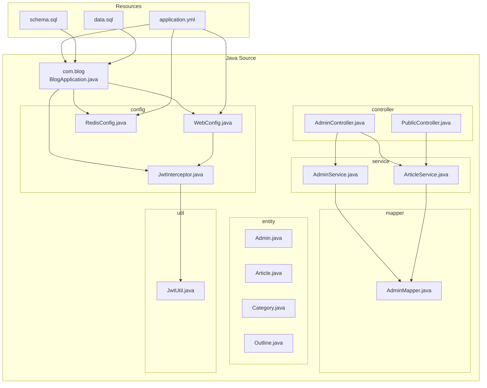
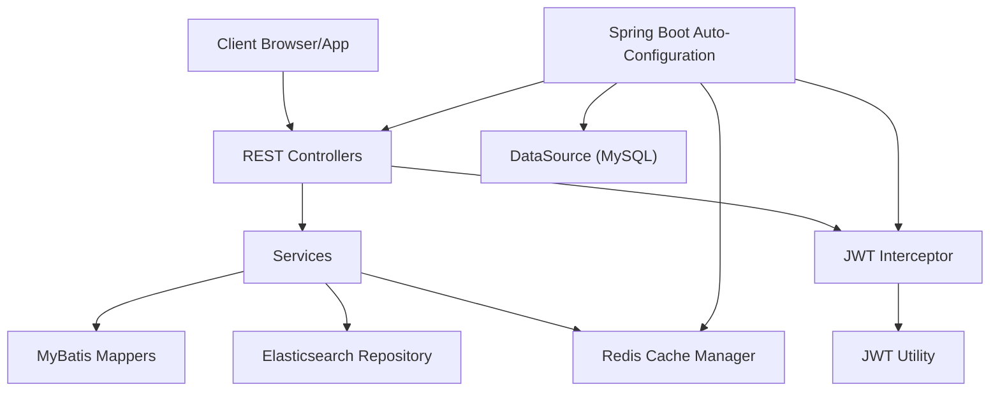
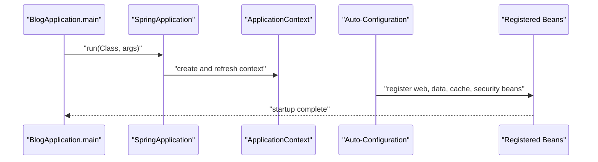
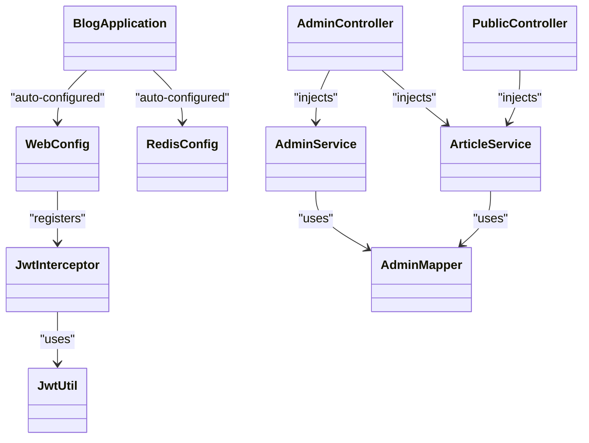
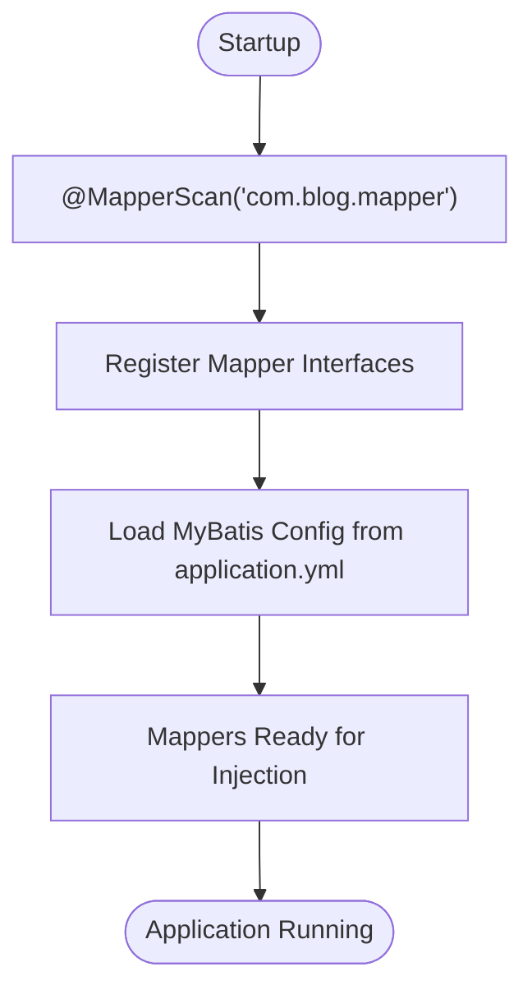
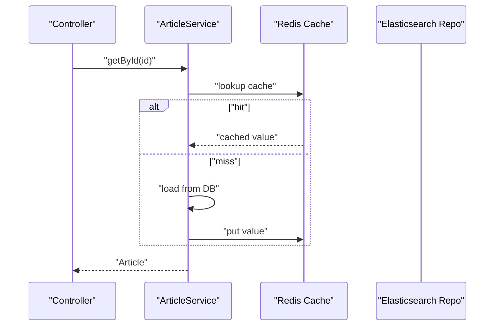
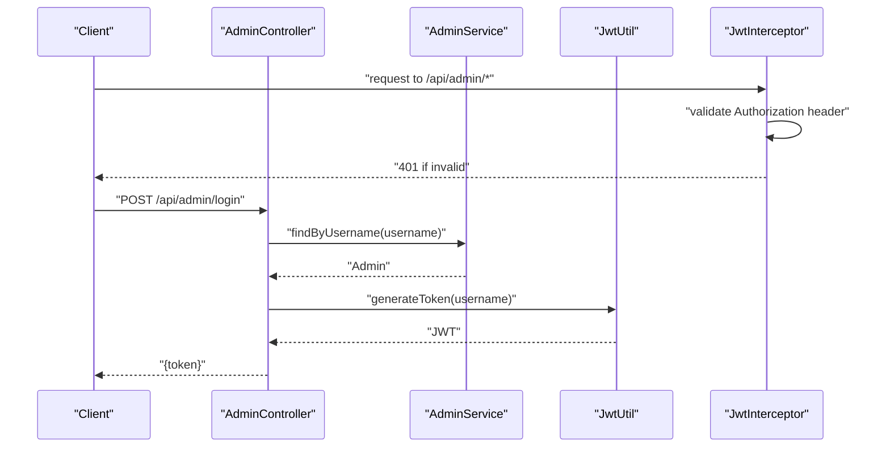
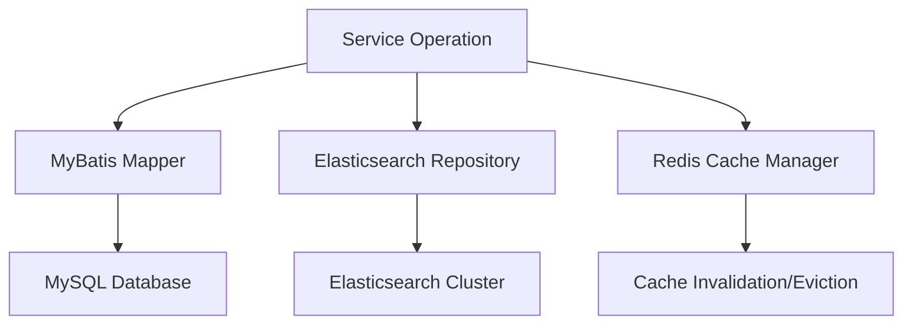
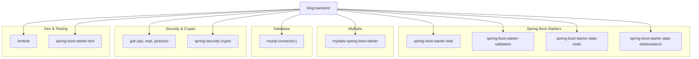

# Spring Boot Application Structure

<cite>
**Referenced Files in This Document**
- [BlogApplication.java](file://blog-backend/src/main/java/com/blog/BlogApplication.java)
- [pom.xml](file://blog-backend/pom.xml)
- [application.yml](file://blog-backend/src/main/resources/application.yml)
- [RedisConfig.java](file://blog-backend/src/main/java/com/blog/config/RedisConfig.java)
- [WebConfig.java](file://blog-backend/src/main/java/com/blog/config/WebConfig.java)
- [JwtInterceptor.java](file://blog-backend/src/main/java/com/blog/config/JwtInterceptor.java)
- [JwtUtil.java](file://blog-backend/src/main/java/com/blog/util/JwtUtil.java)
- [AdminController.java](file://blog-backend/src/main/java/com/blog/controller/AdminController.java)
- [PublicController.java](file://blog-backend/src/main/java/com/blog/controller/PublicController.java)
- [AdminService.java](file://blog-backend/src/main/java/com/blog/service/AdminService.java)
- [ArticleService.java](file://blog-backend/src/main/java/com/blog/service/ArticleService.java)
- [AdminMapper.java](file://blog-backend/src/main/java/com/blog/mapper/AdminMapper.java)
- [schema.sql](file://blog-backend/src/main/resources/schema.sql)
- [data.sql](file://blog-backend/src/main/resources/data.sql)
</cite>

## Table of Contents
1. [Introduction](#introduction)
2. [Project Structure](#project-structure)
3. [Core Components](#core-components)
4. [Architecture Overview](#architecture-overview)
5. [Detailed Component Analysis](#detailed-component-analysis)
6. [Dependency Analysis](#dependency-analysis)
7. [Performance Considerations](#performance-considerations)
8. [Troubleshooting Guide](#troubleshooting-guide)
9. [Conclusion](#conclusion)

## Introduction
This document explains the Spring Boot application structure and startup configuration for a blog backend. It covers the application entry point, auto-configuration, component scanning, MyBatis mapper scanning, caching enablement, Maven dependencies, and environment-specific configurations. Practical examples illustrate initialization, bean creation, and component registration patterns.

## Project Structure
The backend follows a layered structure organized by responsibility:
- Entry point and configuration: com.blog package with BlogApplication and configuration classes
- Controllers: com.blog.controller for REST endpoints
- Services: com.blog.service for business logic
- Mappers: com.blog.mapper for MyBatis DAOs
- Entities: com.blog.entity for domain models
- Utilities: com.blog.util for JWT utilities
- Resources: application.yml, SQL schema and data scripts

**Diagram sources**
- [BlogApplication.java:1-16](file://blog-backend/src/main/java/com/blog/BlogApplication.java#L1-L16)
- [WebConfig.java:1-39](file://blog-backend/src/main/java/com/blog/config/WebConfig.java#L1-L39)
- [RedisConfig.java:1-27](file://blog-backend/src/main/java/com/blog/config/RedisConfig.java#L1-L27)
- [JwtInterceptor.java:1-36](file://blog-backend/src/main/java/com/blog/config/JwtInterceptor.java#L1-L36)
- [AdminController.java:1-121](file://blog-backend/src/main/java/com/blog/controller/AdminController.java#L1-L121)
- [PublicController.java:1-62](file://blog-backend/src/main/java/com/blog/controller/PublicController.java#L1-L62)
- [AdminService.java:1-34](file://blog-backend/src/main/java/com/blog/service/AdminService.java#L1-L34)
- [ArticleService.java:1-72](file://blog-backend/src/main/java/com/blog/service/ArticleService.java#L1-L72)
- [AdminMapper.java:1-16](file://blog-backend/src/main/java/com/blog/mapper/AdminMapper.java#L1-L16)
- [JwtUtil.java:1-57](file://blog-backend/src/main/java/com/blog/util/JwtUtil.java#L1-L57)
- [application.yml:1-33](file://blog-backend/src/main/resources/application.yml#L1-L33)
- [schema.sql:1-33](file://blog-backend/src/main/resources/schema.sql#L1-L33)
- [data.sql:1-2](file://blog-backend/src/main/resources/data.sql#L1-L2)

**Section sources**
- [BlogApplication.java:1-16](file://blog-backend/src/main/java/com/blog/BlogApplication.java#L1-L16)
- [pom.xml:1-111](file://blog-backend/pom.xml#L1-L111)
- [application.yml:1-33](file://blog-backend/src/main/resources/application.yml#L1-L33)

## Core Components
- Application entry point: The main class annotated with Spring Boot annotations enables auto-configuration, component scanning, and MyBatis mapper scanning.
- Auto-configuration: Spring Boot automatically configures web, validation, data access, Redis, Elasticsearch, and security-related beans based on dependencies.
- Component scanning: Classes annotated with @Service, @Controller, @Configuration, @Component are discovered and registered as beans.
- MyBatis mapper scanning: Mapper interfaces under the configured package are scanned and registered as beans.
- Caching enablement: Caching is enabled globally; Redis cache manager is defined and cache annotations are used in services.

Practical startup flow:
- The main method launches the Spring application context.
- Auto-configuration activates web MVC, data sources, Redis, Elasticsearch, and security components.
- Component scanning registers controllers, services, mappers, interceptors, and configuration classes.
- Bean wiring connects controllers to services, services to mappers and repositories, and interceptors to utilities.

**Section sources**
- [BlogApplication.java:8-15](file://blog-backend/src/main/java/com/blog/BlogApplication.java#L8-L15)
- [pom.xml:25-91](file://blog-backend/pom.xml#L25-L91)
- [RedisConfig.java:16-25](file://blog-backend/src/main/java/com/blog/config/RedisConfig.java#L16-L25)
- [ArticleService.java:27-30](file://blog-backend/src/main/java/com/blog/service/ArticleService.java#L27-L30)

## Architecture Overview
The application follows a layered architecture:
- Presentation layer: REST controllers handle HTTP requests and responses.
- Application layer: Services encapsulate business logic and coordinate operations.
- Persistence layer: MyBatis mappers and Elasticsearch repositories manage data persistence and search indexing.
- Infrastructure layer: Configuration classes set up web, security, caching, and external integrations.

**Diagram sources**
- [BlogApplication.java:8-15](file://blog-backend/src/main/java/com/blog/BlogApplication.java#L8-L15)
- [WebConfig.java:17-37](file://blog-backend/src/main/java/com/blog/config/WebConfig.java#L17-L37)
- [JwtInterceptor.java:16-34](file://blog-backend/src/main/java/com/blog/config/JwtInterceptor.java#L16-L34)
- [JwtUtil.java:25-47](file://blog-backend/src/main/java/com/blog/util/JwtUtil.java#L25-L47)
- [RedisConfig.java:16-25](file://blog-backend/src/main/java/com/blog/config/RedisConfig.java#L16-L25)
- [ArticleService.java:32-45](file://blog-backend/src/main/java/com/blog/service/ArticleService.java#L32-L45)

## Detailed Component Analysis

### Application Entry Point and Auto-Configuration
- The main class is annotated to enable Spring Boot auto-configuration, component scanning, and MyBatis mapper scanning.
- The application context loads beans defined in configuration classes and discovered via component scanning.

**Diagram sources**
- [BlogApplication.java:12-14](file://blog-backend/src/main/java/com/blog/BlogApplication.java#L12-L14)
- [pom.xml:25-91](file://blog-backend/pom.xml#L25-L91)

**Section sources**
- [BlogApplication.java:8-15](file://blog-backend/src/main/java/com/blog/BlogApplication.java#L8-L15)

### Component Scanning and Bean Registration Patterns
- Controllers: Annotated with @RestController and registered automatically.
- Services: Annotated with @Service and injected with required dependencies.
- Mappers: Annotated with @Mapper and registered via @MapperScan.
- Configuration: Annotated with @Configuration and define beans such as RedisCacheManager.
- Interceptor: Annotated with @Component and registered via WebMvcConfigurer.

**Diagram sources**
- [BlogApplication.java:8-15](file://blog-backend/src/main/java/com/blog/BlogApplication.java#L8-L15)
- [WebConfig.java:10-38](file://blog-backend/src/main/java/com/blog/config/WebConfig.java#L10-L38)
- [RedisConfig.java:13-26](file://blog-backend/src/main/java/com/blog/config/RedisConfig.java#L13-L26)
- [JwtInterceptor.java:10-35](file://blog-backend/src/main/java/com/blog/config/JwtInterceptor.java#L10-L35)
- [JwtUtil.java:12-56](file://blog-backend/src/main/java/com/blog/util/JwtUtil.java#L12-L56)
- [AdminController.java:19-120](file://blog-backend/src/main/java/com/blog/controller/AdminController.java#L19-L120)
- [PublicController.java:18-61](file://blog-backend/src/main/java/com/blog/controller/PublicController.java#L18-L61)
- [AdminService.java:9-33](file://blog-backend/src/main/java/com/blog/service/AdminService.java#L9-L33)
- [ArticleService.java:15-71](file://blog-backend/src/main/java/com/blog/service/ArticleService.java#L15-L71)
- [AdminMapper.java:6-15](file://blog-backend/src/main/java/com/blog/mapper/AdminMapper.java#L6-L15)

**Section sources**
- [WebConfig.java:17-37](file://blog-backend/src/main/java/com/blog/config/WebConfig.java#L17-L37)
- [JwtInterceptor.java:16-34](file://blog-backend/src/main/java/com/blog/config/JwtInterceptor.java#L16-L34)
- [AdminController.java:34-44](file://blog-backend/src/main/java/com/blog/controller/AdminController.java#L34-L44)
- [PublicController.java:29-60](file://blog-backend/src/main/java/com/blog/controller/PublicController.java#L29-L60)

### MyBatis Mapper Scanning Setup
- The main class enables mapper scanning for the com.blog.mapper package.
- Mapper interfaces are annotated with @Mapper and define SQL operations.
- MyBatis configuration is loaded from application.yml, including mapper locations, type aliases, and underscore-to-camel case mapping.

**Diagram sources**
- [BlogApplication.java:9](file://blog-backend/src/main/java/com/blog/BlogApplication.java#L9)
- [AdminMapper.java:6-15](file://blog-backend/src/main/java/com/blog/mapper/AdminMapper.java#L6-L15)
- [application.yml:21-25](file://blog-backend/src/main/resources/application.yml#L21-L25)

**Section sources**
- [BlogApplication.java:9](file://blog-backend/src/main/java/com/blog/BlogApplication.java#L9)
- [AdminMapper.java:6-15](file://blog-backend/src/main/java/com/blog/mapper/AdminMapper.java#L6-L15)
- [application.yml:21-25](file://blog-backend/src/main/resources/application.yml#L21-L25)

### Caching Enablement and Configuration
- Global caching is enabled via @EnableCaching on the main class.
- A Redis-backed cache manager is defined with JSON serialization and TTL configuration.
- Service methods use @Cacheable and @CacheEvict to cache and invalidate data.

**Diagram sources**
- [BlogApplication.java:10](file://blog-backend/src/main/java/com/blog/BlogApplication.java#L10)
- [RedisConfig.java:16-25](file://blog-backend/src/main/java/com/blog/config/RedisConfig.java#L16-L25)
- [ArticleService.java:27-30](file://blog-backend/src/main/java/com/blog/service/ArticleService.java#L27-L30)

**Section sources**
- [BlogApplication.java:10](file://blog-backend/src/main/java/com/blog/BlogApplication.java#L10)
- [RedisConfig.java:16-25](file://blog-backend/src/main/java/com/blog/config/RedisConfig.java#L16-L25)
- [ArticleService.java:27-30](file://blog-backend/src/main/java/com/blog/service/ArticleService.java#L27-L30)

### Security and Authentication Flow
- A JWT interceptor enforces authentication for admin endpoints, excluding login.
- The JWT utility generates and validates tokens using a configured secret and expiration.
- The admin login endpoint authenticates credentials and issues a signed JWT.

**Diagram sources**
- [JwtInterceptor.java:16-34](file://blog-backend/src/main/java/com/blog/config/JwtInterceptor.java#L16-L34)
- [JwtUtil.java:25-47](file://blog-backend/src/main/java/com/blog/util/JwtUtil.java#L25-L47)
- [AdminController.java:34-44](file://blog-backend/src/main/java/com/blog/controller/AdminController.java#L34-L44)
- [AdminService.java:16-18](file://blog-backend/src/main/java/com/blog/service/AdminService.java#L16-L18)

**Section sources**
- [WebConfig.java:17-22](file://blog-backend/src/main/java/com/blog/config/WebConfig.java#L17-L22)
- [JwtInterceptor.java:16-34](file://blog-backend/src/main/java/com/blog/config/JwtInterceptor.java#L16-L34)
- [JwtUtil.java:25-47](file://blog-backend/src/main/java/com/blog/util/JwtUtil.java#L25-L47)
- [AdminController.java:34-44](file://blog-backend/src/main/java/com/blog/controller/AdminController.java#L34-L44)

### Data Access and Search Integration
- Services orchestrate data operations using MyBatis mappers and Elasticsearch repositories.
- On create/update operations, articles are indexed into Elasticsearch for fast search.
- Cache evictions ensure consistency after data mutations.

**Diagram sources**
- [ArticleService.java:32-70](file://blog-backend/src/main/java/com/blog/service/ArticleService.java#L32-L70)
- [AdminService.java:24-32](file://blog-backend/src/main/java/com/blog/service/AdminService.java#L24-L32)
- [RedisConfig.java:16-25](file://blog-backend/src/main/java/com/blog/config/RedisConfig.java#L16-L25)

**Section sources**
- [ArticleService.java:32-70](file://blog-backend/src/main/java/com/blog/service/ArticleService.java#L32-L70)
- [AdminService.java:24-32](file://blog-backend/src/main/java/com/blog/service/AdminService.java#L24-L32)

## Dependency Analysis
The application relies on Spring Boot starters and supporting libraries:
- Web and validation starters for REST APIs and bean validation
- MyBatis Spring Boot starter for ORM
- MySQL connector for database connectivity
- Redis starter for caching and session storage
- Elasticsearch starter for search capabilities
- JWT libraries for token generation and parsing
- Spring Security Crypto for password encoding
- Lombok for reducing boilerplate code

**Diagram sources**
- [pom.xml:25-91](file://blog-backend/pom.xml#L25-L91)

**Section sources**
- [pom.xml:25-91](file://blog-backend/pom.xml#L25-L91)

## Performance Considerations
- Caching: Use @Cacheable and @CacheEvict judiciously to reduce database load. Configure appropriate TTL and eviction policies.
- Indexing: Elasticsearch indexing failures are logged but do not block operations; monitor logs for reliability.
- Upload handling: Ensure upload directories exist and restrict file types as needed.
- Interceptor overhead: Keep JWT validation lightweight; consider token caching if necessary.

[No sources needed since this section provides general guidance]

## Troubleshooting Guide
Common issues and resolutions:
- Database initialization: Schema and data scripts are provided; ensure the database server is running and credentials match application.yml.
- CORS configuration: Cross-origin requests are permitted broadly; adjust origins and methods as needed for production.
- JWT secrets: Verify the JWT secret and expiration values in application.yml; regenerate tokens if validation fails.
- Upload path: Confirm the upload directory exists and is writable; adjust the upload path property accordingly.
- Elasticsearch connectivity: Ensure the Elasticsearch service is reachable at the configured URI.

**Section sources**
- [schema.sql:1-33](file://blog-backend/src/main/resources/schema.sql#L1-L33)
- [data.sql:1-2](file://blog-backend/src/main/resources/data.sql#L1-L2)
- [application.yml:14-19](file://blog-backend/src/main/resources/application.yml#L14-L19)
- [WebConfig.java:31-37](file://blog-backend/src/main/java/com/blog/config/WebConfig.java#L31-L37)
- [JwtUtil.java:15-19](file://blog-backend/src/main/java/com/blog/util/JwtUtil.java#L15-L19)
- [application.yml:32-32](file://blog-backend/src/main/resources/application.yml#L32-L32)

## Conclusion
The application leverages Spring Boot’s auto-configuration and component scanning to streamline startup and bean registration. MyBatis mapper scanning and caching enablement integrate seamlessly with Redis and Elasticsearch. The layered architecture separates concerns effectively, while configuration classes and properties support environment-specific setups. Following the documented patterns ensures reliable initialization, robust component wiring, and maintainable development practices.