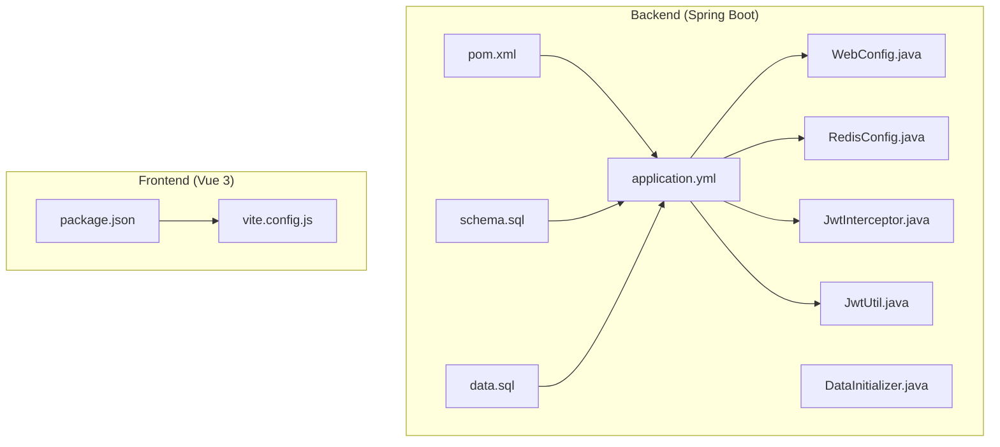
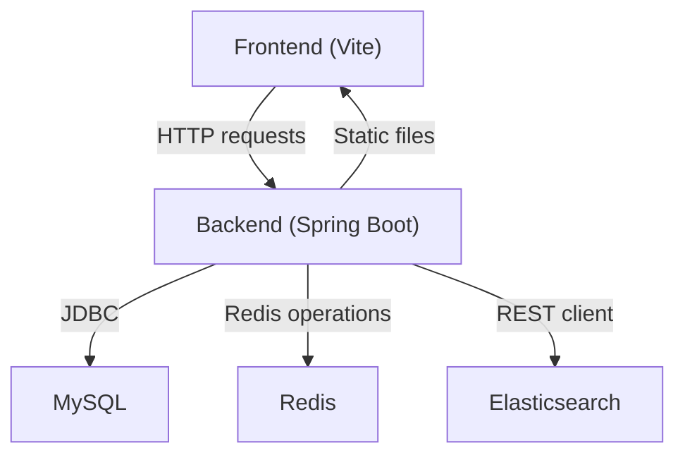
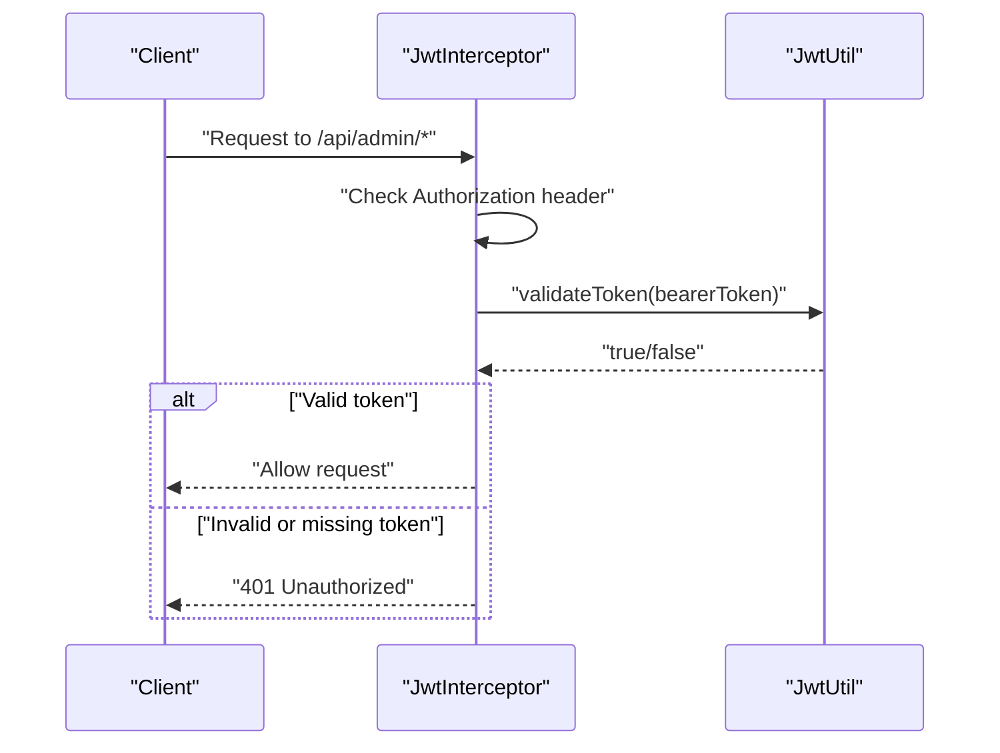
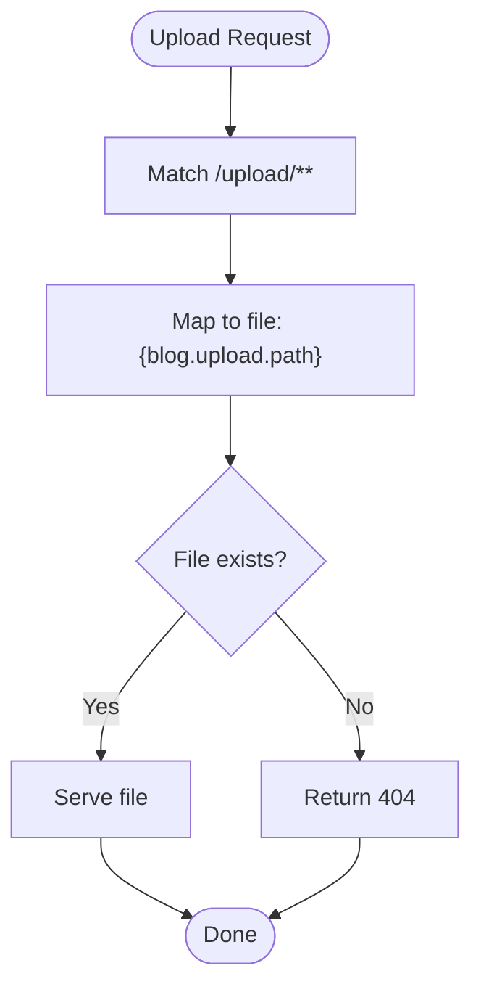
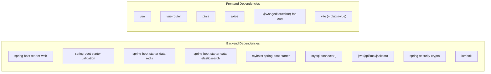

# Configuration & Environment

<cite>
**Referenced Files in This Document**
- [application.yml](file://blog-backend/src/main/resources/application.yml)
- [pom.xml](file://blog-backend/pom.xml)
- [WebConfig.java](file://blog-backend/src/main/java/com/blog/config/WebConfig.java)
- [RedisConfig.java](file://blog-backend/src/main/java/com/blog/config/RedisConfig.java)
- [JwtInterceptor.java](file://blog-backend/src/main/java/com/blog/config/JwtInterceptor.java)
- [JwtUtil.java](file://blog-backend/src/main/java/com/blog/util/JwtUtil.java)
- [DataInitializer.java](file://blog-backend/src/main/java/com/blog/config/DataInitializer.java)
- [schema.sql](file://blog-backend/src/main/resources/schema.sql)
- [data.sql](file://blog-backend/src/main/resources/data.sql)
- [package.json](file://blog-frontend/package.json)
- [vite.config.js](file://blog-frontend/vite.config.js)
</cite>

## Table of Contents
1. [Introduction](#introduction)
2. [Project Structure](#project-structure)
3. [Core Components](#core-components)
4. [Architecture Overview](#architecture-overview)
5. [Detailed Component Analysis](#detailed-component-analysis)
6. [Dependency Analysis](#dependency-analysis)
7. [Performance Considerations](#performance-considerations)
8. [Troubleshooting Guide](#troubleshooting-guide)
9. [Conclusion](#conclusion)
10. [Appendices](#appendices)

## Introduction
This document explains how the backend and frontend are configured and how to set up the environment for development and production. It covers:
- Backend configuration via application.yml (server, database, Redis, Elasticsearch, JWT, file uploads)
- Build configuration and dependency management with Maven
- Frontend configuration via package.json and Vite
- Environment-specific settings, production deployment considerations, and security recommendations
- Examples of configuration variations and troubleshooting guidance

## Project Structure
The project consists of two modules:
- Backend (Spring Boot): Java application with configuration, controllers, services, MyBatis mappers, and resource files
- Frontend (Vue 3): Vite-powered SPA with routing, state management, and API integration

**Diagram sources**
- [application.yml:1-33](file://blog-backend/src/main/resources/application.yml#L1-L33)
- [pom.xml:1-111](file://blog-backend/pom.xml#L1-L111)
- [WebConfig.java:1-39](file://blog-backend/src/main/java/com/blog/config/WebConfig.java#L1-L39)
- [RedisConfig.java:1-27](file://blog-backend/src/main/java/com/blog/config/RedisConfig.java#L1-L27)
- [JwtInterceptor.java:1-36](file://blog-backend/src/main/java/com/blog/config/JwtInterceptor.java#L1-L36)
- [JwtUtil.java:1-57](file://blog-backend/src/main/java/com/blog/util/JwtUtil.java#L1-L57)
- [DataInitializer.java:1-18](file://blog-backend/src/main/java/com/blog/config/DataInitializer.java#L1-L18)
- [schema.sql:1-33](file://blog-backend/src/main/resources/schema.sql#L1-L33)
- [data.sql:1-2](file://blog-backend/src/main/resources/data.sql#L1-L2)
- [package.json:1-24](file://blog-frontend/package.json#L1-L24)
- [vite.config.js:1-21](file://blog-frontend/vite.config.js#L1-L21)

**Section sources**
- [application.yml:1-33](file://blog-backend/src/main/resources/application.yml#L1-L33)
- [pom.xml:1-111](file://blog-backend/pom.xml#L1-L111)
- [WebConfig.java:1-39](file://blog-backend/src/main/java/com/blog/config/WebConfig.java#L1-L39)
- [RedisConfig.java:1-27](file://blog-backend/src/main/java/com/blog/config/RedisConfig.java#L1-L27)
- [JwtInterceptor.java:1-36](file://blog-backend/src/main/java/com/blog/config/JwtInterceptor.java#L1-L36)
- [JwtUtil.java:1-57](file://blog-backend/src/main/java/com/blog/util/JwtUtil.java#L1-L57)
- [DataInitializer.java:1-18](file://blog-backend/src/main/java/com/blog/config/DataInitializer.java#L1-L18)
- [schema.sql:1-33](file://blog-backend/src/main/resources/schema.sql#L1-L33)
- [data.sql:1-2](file://blog-backend/src/main/resources/data.sql#L1-L2)
- [package.json:1-24](file://blog-frontend/package.json#L1-L24)
- [vite.config.js:1-21](file://blog-frontend/vite.config.js#L1-L21)

## Core Components
This section documents the primary configuration areas and their roles.

- Server and database
  - Port, JDBC URL, credentials, driver, SQL initialization mode
  - MyBatis mapper locations, type aliases package, and underscore-to-camel mapping
  - Reference: [application.yml:1-33](file://blog-backend/src/main/resources/application.yml#L1-L33), [schema.sql:1-33](file://blog-backend/src/main/resources/schema.sql#L1-L33), [data.sql:1-2](file://blog-backend/src/main/resources/data.sql#L1-L2)

- Redis and Elasticsearch
  - Host, port, database index, and Elasticsearch URIs
  - Redis cache manager TTL and JSON serialization
  - Reference: [application.yml:14-19](file://blog-backend/src/main/resources/application.yml#L14-L19), [RedisConfig.java:17-25](file://blog-backend/src/main/java/com/blog/config/RedisConfig.java#L17-L25)

- JWT authentication
  - Secret key and expiration used by the JWT utility
  - Interceptor enforcing Authorization header and token validation for admin endpoints
  - Reference: [application.yml:27-30](file://blog-backend/src/main/resources/application.yml#L27-L30), [JwtUtil.java:15-19](file://blog-backend/src/main/java/com/blog/util/JwtUtil.java#L15-L19), [JwtInterceptor.java:17-34](file://blog-backend/src/main/java/com/blog/config/JwtInterceptor.java#L17-L34)

- File upload configuration
  - Upload path property bound in WebConfig and mapped as a static resource handler
  - Reference: [application.yml:31-32](file://blog-backend/src/main/resources/application.yml#L31-L32), [WebConfig.java:14-28](file://blog-backend/src/main/java/com/blog/config/WebConfig.java#L14-L28)

- Maven build and dependencies
  - Java 17, Spring Boot parent, starter web, validation, MyBatis, MySQL driver, Redis, Elasticsearch, JWT, Spring Security Crypto, Lombok, and test dependencies
  - Spring Boot Maven plugin excludes Lombok from the final artifact
  - Reference: [pom.xml:21-92](file://blog-backend/pom.xml#L21-L92), [pom.xml:94-109](file://blog-backend/pom.xml#L94-L109)

- Frontend dependencies and Vite
  - Vue 3, Vue Router, Pinia, Axios, WangEditor, Vite, and Vue plugin
  - Vite dev server with proxy for /api and /upload to the backend
  - Reference: [package.json:6-22](file://blog-frontend/package.json#L6-L22), [vite.config.js:6-19](file://blog-frontend/vite.config.js#L6-L19)

**Section sources**
- [application.yml:1-33](file://blog-backend/src/main/resources/application.yml#L1-L33)
- [RedisConfig.java:17-25](file://blog-backend/src/main/java/com/blog/config/RedisConfig.java#L17-L25)
- [JwtUtil.java:15-19](file://blog-backend/src/main/java/com/blog/util/JwtUtil.java#L15-L19)
- [JwtInterceptor.java:17-34](file://blog-backend/src/main/java/com/blog/config/JwtInterceptor.java#L17-L34)
- [WebConfig.java:14-28](file://blog-backend/src/main/java/com/blog/config/WebConfig.java#L14-L28)
- [pom.xml:21-92](file://blog-backend/pom.xml#L21-L92)
- [pom.xml:94-109](file://blog-backend/pom.xml#L94-L109)
- [package.json:6-22](file://blog-frontend/package.json#L6-L22)
- [vite.config.js:6-19](file://blog-frontend/vite.config.js#L6-L19)

## Architecture Overview
The runtime configuration ties together backend services, persistence, caching, search, and the frontend client.

**Diagram sources**
- [application.yml:4-19](file://blog-backend/src/main/resources/application.yml#L4-L19)
- [pom.xml:25-56](file://blog-backend/pom.xml#L25-L56)
- [vite.config.js:9-18](file://blog-frontend/vite.config.js#L9-L18)

## Detailed Component Analysis

### Backend Application Configuration (application.yml)
- Server
  - Port: 8080
  - Reference: [application.yml:1-2](file://blog-backend/src/main/resources/application.yml#L1-L2)

- Database (Spring DataSource)
  - JDBC URL, username, password, driver class
  - SQL initialization mode set to never
  - Reference: [application.yml:5-12](file://blog-backend/src/main/resources/application.yml#L5-L12), [schema.sql:1-33](file://blog-backend/src/main/resources/schema.sql#L1-L33), [data.sql:1-2](file://blog-backend/src/main/resources/data.sql#L1-L2)

- Redis
  - Host, port, database index
  - Reference: [application.yml:14-17](file://blog-backend/src/main/resources/application.yml#L14-L17), [RedisConfig.java:17-25](file://blog-backend/src/main/java/com/blog/config/RedisConfig.java#L17-L25)

- Elasticsearch
  - URIs list
  - Reference: [application.yml:18-19](file://blog-backend/src/main/resources/application.yml#L18-L19)

- MyBatis
  - Mapper locations, type aliases package, underscore-to-camel-case mapping
  - Reference: [application.yml:21-25](file://blog-backend/src/main/resources/application.yml#L21-L25)

- JWT
  - Secret key and expiration
  - Reference: [application.yml:27-30](file://blog-backend/src/main/resources/application.yml#L27-L30), [JwtUtil.java:15-19](file://blog-backend/src/main/java/com/blog/util/JwtUtil.java#L15-L19)

- File Upload
  - Upload path property and static resource mapping
  - Reference: [application.yml:31-32](file://blog-backend/src/main/resources/application.yml#L31-L32), [WebConfig.java:14-28](file://blog-backend/src/main/java/com/blog/config/WebConfig.java#L14-L28)

**Section sources**
- [application.yml:1-33](file://blog-backend/src/main/resources/application.yml#L1-L33)
- [schema.sql:1-33](file://blog-backend/src/main/resources/schema.sql#L1-L33)
- [data.sql:1-2](file://blog-backend/src/main/resources/data.sql#L1-L2)
- [RedisConfig.java:17-25](file://blog-backend/src/main/java/com/blog/config/RedisConfig.java#L17-L25)
- [JwtUtil.java:15-19](file://blog-backend/src/main/java/com/blog/util/JwtUtil.java#L15-L19)
- [WebConfig.java:14-28](file://blog-backend/src/main/java/com/blog/config/WebConfig.java#L14-L28)

### JWT Authentication Flow

**Diagram sources**
- [JwtInterceptor.java:17-34](file://blog-backend/src/main/java/com/blog/config/JwtInterceptor.java#L17-L34)
- [JwtUtil.java:40-47](file://blog-backend/src/main/java/com/blog/util/JwtUtil.java#L40-L47)

**Section sources**
- [JwtInterceptor.java:17-34](file://blog-backend/src/main/java/com/blog/config/JwtInterceptor.java#L17-L34)
- [JwtUtil.java:40-47](file://blog-backend/src/main/java/com/blog/util/JwtUtil.java#L40-L47)

### File Upload Resource Mapping

**Diagram sources**
- [WebConfig.java:25-28](file://blog-backend/src/main/java/com/blog/config/WebConfig.java#L25-L28)
- [application.yml:31-32](file://blog-backend/src/main/resources/application.yml#L31-L32)

**Section sources**
- [WebConfig.java:25-28](file://blog-backend/src/main/java/com/blog/config/WebConfig.java#L25-L28)
- [application.yml:31-32](file://blog-backend/src/main/resources/application.yml#L31-L32)

### CORS and Interceptor Setup
- CORS allows all origins and methods with headers and max age
- JWT interceptor applies to admin endpoints except login
- Reference: [WebConfig.java:31-37](file://blog-backend/src/main/java/com/blog/config/WebConfig.java#L31-L37), [WebConfig.java:18-22](file://blog-backend/src/main/java/com/blog/config/WebConfig.java#L18-L22)

**Section sources**
- [WebConfig.java:18-22](file://blog-backend/src/main/java/com/blog/config/WebConfig.java#L18-L22)
- [WebConfig.java:31-37](file://blog-backend/src/main/java/com/blog/config/WebConfig.java#L31-L37)

### Data Initialization
- CommandLineRunner ensures admin account creation at startup
- Reference: [DataInitializer.java:14-17](file://blog-backend/src/main/java/com/blog/config/DataInitializer.java#L14-L17)

**Section sources**
- [DataInitializer.java:14-17](file://blog-backend/src/main/java/com/blog/config/DataInitializer.java#L14-L17)

## Dependency Analysis
Backend dependency highlights:
- Spring Boot starters: web, validation, data-redis, data-elasticsearch
- Persistence: MyBatis Spring Boot Starter, MySQL Connector/J
- Security and tokens: JWT API/Impl/Jackson, Spring Security Crypto
- Utilities: Lombok, Test
- Reference: [pom.xml:25-92](file://blog-backend/pom.xml#L25-L92)

Frontend dependency highlights:
- Runtime: Vue 3, Vue Router, Pinia, Axios, WangEditor
- Dev/build: Vite, @vitejs/plugin-vue
- Reference: [package.json:11-22](file://blog-frontend/package.json#L11-L22)

**Diagram sources**
- [pom.xml:25-92](file://blog-backend/pom.xml#L25-L92)
- [package.json:11-22](file://blog-frontend/package.json#L11-L22)

**Section sources**
- [pom.xml:25-92](file://blog-backend/pom.xml#L25-L92)
- [package.json:11-22](file://blog-frontend/package.json#L11-L22)

## Performance Considerations
- Redis TTL: 10 minutes for cached entries; adjust based on workload and cache hit ratio
  - Reference: [RedisConfig.java:18-19](file://blog-backend/src/main/java/com/blog/config/RedisConfig.java#L18-L19)
- MyBatis camelCase mapping reduces manual field mapping overhead
  - Reference: [application.yml:24-25](file://blog-backend/src/main/resources/application.yml#L24-L25)
- Elasticsearch URIs should point to optimized cluster endpoints in production
  - Reference: [application.yml:18-19](file://blog-backend/src/main/resources/application.yml#L18-L19)
- JWT expiration impacts session duration; tune for security vs. usability
  - Reference: [application.yml:29-30](file://blog-backend/src/main/resources/application.yml#L29-L30), [JwtUtil.java:18-19](file://blog-backend/src/main/java/com/blog/util/JwtUtil.java#L18-L19)

[No sources needed since this section provides general guidance]

## Troubleshooting Guide
Common configuration issues and resolutions:

- Database connectivity
  - Verify JDBC URL, credentials, and driver class match your MySQL setup
  - Confirm SQL initialization mode and schema/data scripts align with your environment
  - References: [application.yml:5-12](file://blog-backend/src/main/resources/application.yml#L5-L12), [schema.sql:1-33](file://blog-backend/src/main/resources/schema.sql#L1-L33), [data.sql:1-2](file://blog-backend/src/main/resources/data.sql#L1-L2)

- Redis connectivity
  - Ensure host, port, and database index are reachable and correct
  - Confirm Redis cache manager configuration matches your needs
  - References: [application.yml:14-17](file://blog-backend/src/main/resources/application.yml#L14-L17), [RedisConfig.java:17-25](file://blog-backend/src/main/java/com/blog/config/RedisConfig.java#L17-L25)

- Elasticsearch connectivity
  - Validate URIs and network access to the cluster
  - References: [application.yml:18-19](file://blog-backend/src/main/resources/application.yml#L18-L19)

- JWT authentication failures
  - Check secret key and expiration values
  - Ensure Authorization header format is "Bearer <token>"
  - References: [application.yml:27-30](file://blog-backend/src/main/resources/application.yml#L27-L30), [JwtInterceptor.java:17-34](file://blog-backend/src/main/java/com/blog/config/JwtInterceptor.java#L17-L34), [JwtUtil.java:40-47](file://blog-backend/src/main/java/com/blog/util/JwtUtil.java#L40-L47)

- File upload not serving images
  - Confirm upload path property and static resource mapping
  - Ensure the upload directory exists and is readable
  - References: [application.yml:31-32](file://blog-backend/src/main/resources/application.yml#L31-L32), [WebConfig.java:25-28](file://blog-backend/src/main/java/com/blog/config/WebConfig.java#L25-L28)

- Frontend cannot reach backend APIs
  - Check Vite proxy configuration for /api and /upload targets
  - References: [vite.config.js:9-18](file://blog-frontend/vite.config.js#L9-L18)

**Section sources**
- [application.yml:5-19](file://blog-backend/src/main/resources/application.yml#L5-L19)
- [schema.sql:1-33](file://blog-backend/src/main/resources/schema.sql#L1-L33)
- [data.sql:1-2](file://blog-backend/src/main/resources/data.sql#L1-L2)
- [RedisConfig.java:17-25](file://blog-backend/src/main/java/com/blog/config/RedisConfig.java#L17-L25)
- [JwtInterceptor.java:17-34](file://blog-backend/src/main/java/com/blog/config/JwtInterceptor.java#L17-L34)
- [JwtUtil.java:40-47](file://blog-backend/src/main/java/com/blog/util/JwtUtil.java#L40-L47)
- [WebConfig.java:25-28](file://blog-backend/src/main/java/com/blog/config/WebConfig.java#L25-L28)
- [vite.config.js:9-18](file://blog-frontend/vite.config.js#L9-L18)

## Conclusion
The configuration establishes a clear separation of concerns:
- Backend uses centralized YAML for environment variables and framework settings
- Frontend proxies API calls to the backend during development
- Security is enforced via JWT for admin endpoints
- Persistence, caching, and search are configured via properties and beans
For production, harden secrets, enable SSL/TLS, and tune performance-related settings.

[No sources needed since this section summarizes without analyzing specific files]

## Appendices

### Environment-Specific Settings and Variants
- Local development
  - Default ports: backend 8080, frontend 5173
  - Local databases and services (MySQL, Redis, Elasticsearch) on localhost
  - References: [application.yml:1-3](file://blog-backend/src/main/resources/application.yml#L1-L3), [vite.config.js:6-19](file://blog-frontend/vite.config.js#L6-L19)

- Production deployment checklist
  - Set secure secrets for JWT and database
  - Configure HTTPS and reverse proxy
  - Tune JVM and container limits
  - Enable SSL/TLS for Elasticsearch and Redis if applicable
  - References: [application.yml:27-32](file://blog-backend/src/main/resources/application.yml#L27-L32), [pom.xml:94-109](file://blog-backend/pom.xml#L94-L109)

- Packaging and build
  - Maven builds a JAR with Spring Boot plugin
  - Frontend builds static assets for distribution
  - References: [pom.xml](file://blog-backend/pom.xml#L18), [pom.xml:94-109](file://blog-backend/pom.xml#L94-L109), [package.json:6-10](file://blog-frontend/package.json#L6-L10)

**Section sources**
- [application.yml:1-3](file://blog-backend/src/main/resources/application.yml#L1-L3)
- [vite.config.js:6-19](file://blog-frontend/vite.config.js#L6-L19)
- [pom.xml](file://blog-backend/pom.xml#L18)
- [pom.xml:94-109](file://blog-backend/pom.xml#L94-L109)
- [package.json:6-10](file://blog-frontend/package.json#L6-L10)