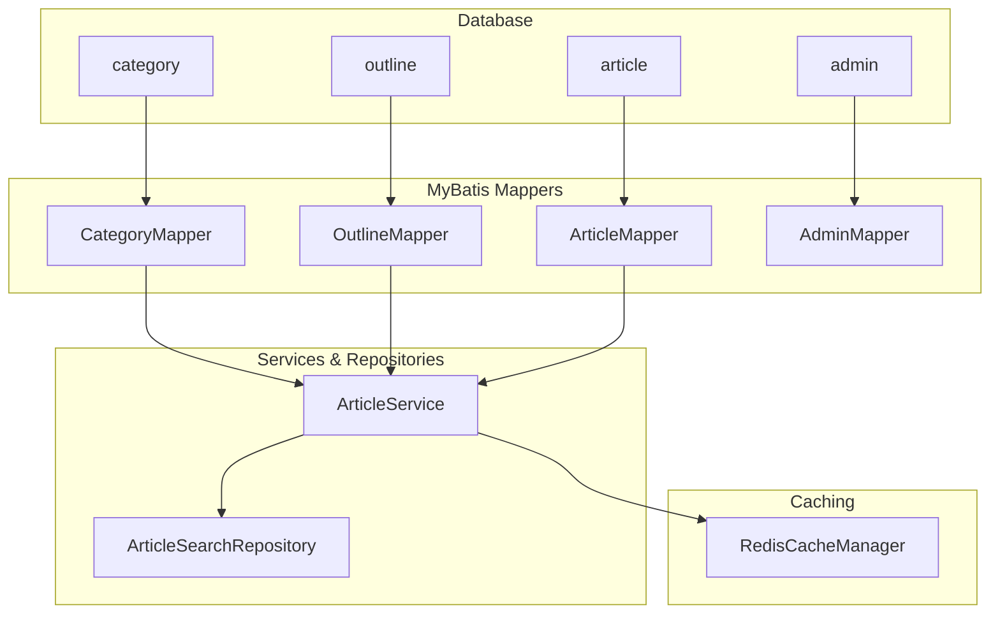
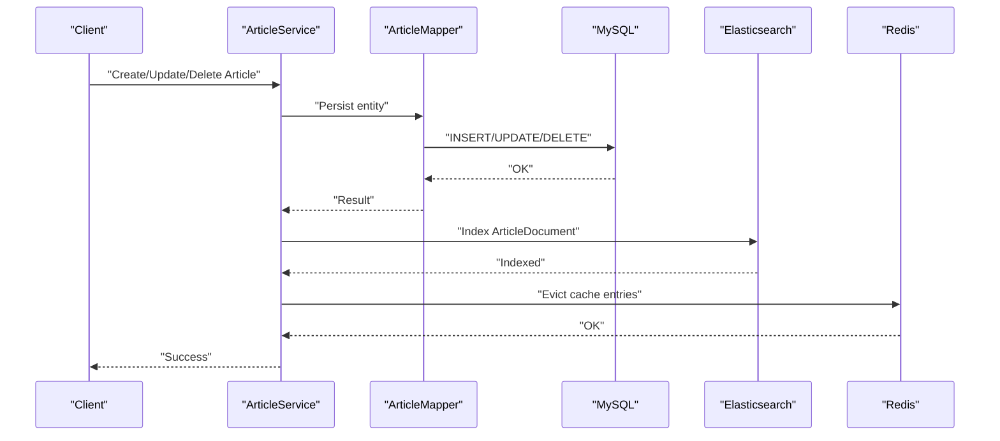
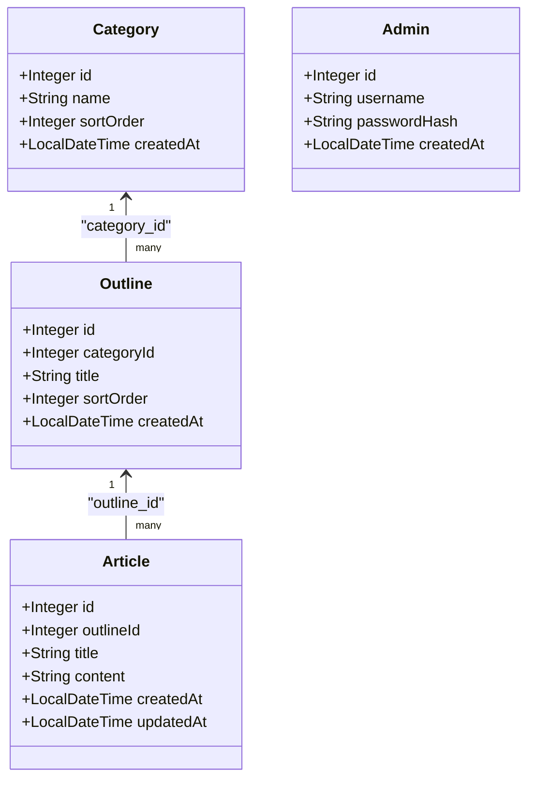
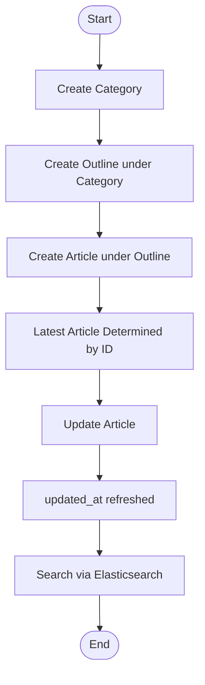
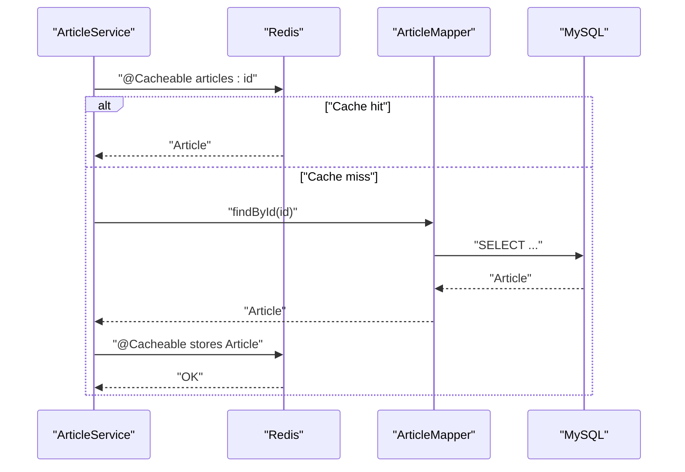
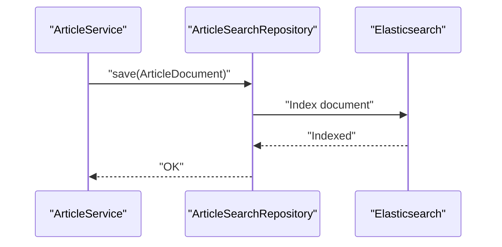
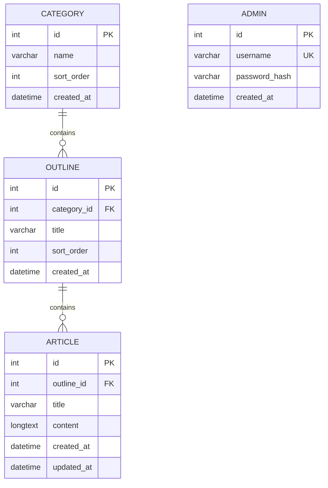

# Database Design

<cite>
**Referenced Files in This Document**
- [schema.sql](file://blog-backend/src/main/resources/schema.sql)
- [data.sql](file://blog-backend/src/main/resources/data.sql)
- [Category.java](file://blog-backend/src/main/java/com/blog/entity/Category.java)
- [Outline.java](file://blog-backend/src/main/java/com/blog/entity/Outline.java)
- [Article.java](file://blog-backend/src/main/java/com/blog/entity/Article.java)
- [Admin.java](file://blog-backend/src/main/java/com/blog/entity/Admin.java)
- [CategoryMapper.java](file://blog-backend/src/main/java/com/blog/mapper/CategoryMapper.java)
- [OutlineMapper.java](file://blog-backend/src/main/java/com/blog/mapper/OutlineMapper.java)
- [ArticleMapper.java](file://blog-backend/src/main/java/com/blog/mapper/ArticleMapper.java)
- [AdminMapper.java](file://blog-backend/src/main/java/com/blog/mapper/AdminMapper.java)
- [ArticleService.java](file://blog-backend/src/main/java/com/blog/service/ArticleService.java)
- [ArticleSearchRepository.java](file://blog-backend/src/main/java/com/blog/repository/ArticleSearchRepository.java)
- [RedisConfig.java](file://blog-backend/src/main/java/com/blog/config/RedisConfig.java)
- [DataInitializer.java](file://blog-backend/src/main/java/com/blog/config/DataInitializer.java)
</cite>

## Table of Contents
1. [Introduction](#introduction)
2. [Project Structure](#project-structure)
3. [Core Components](#core-components)
4. [Architecture Overview](#architecture-overview)
5. [Detailed Component Analysis](#detailed-component-analysis)
6. [Dependency Analysis](#dependency-analysis)
7. [Performance Considerations](#performance-considerations)
8. [Troubleshooting Guide](#troubleshooting-guide)
9. [Conclusion](#conclusion)
10. [Appendices](#appendices)

## Introduction
This document describes the blog database schema and related data access patterns. It covers entity definitions, primary and foreign keys, indexes and constraints, validation and business rules, and how data flows through MyBatis mappers, Redis caching, and Elasticsearch search. It also documents initialization data and outlines content management workflows.

## Project Structure
The backend defines the database schema and initial admin account, and exposes MyBatis mappers for CRUD operations. Caching is configured via Spring Redis, and search indexing is handled by an Elasticsearch repository. Initialization ensures a default admin user exists.

**Diagram sources**
- [schema.sql:1-33](file://blog-backend/src/main/resources/schema.sql#L1-L33)
- [CategoryMapper.java:1-27](file://blog-backend/src/main/java/com/blog/mapper/CategoryMapper.java#L1-L27)
- [OutlineMapper.java:1-30](file://blog-backend/src/main/java/com/blog/mapper/OutlineMapper.java#L1-L30)
- [ArticleMapper.java:1-27](file://blog-backend/src/main/java/com/blog/mapper/ArticleMapper.java#L1-L27)
- [AdminMapper.java:1-16](file://blog-backend/src/main/java/com/blog/mapper/AdminMapper.java#L1-L16)
- [ArticleService.java:1-72](file://blog-backend/src/main/java/com/blog/service/ArticleService.java#L1-L72)
- [ArticleSearchRepository.java:1-12](file://blog-backend/src/main/java/com/blog/repository/ArticleSearchRepository.java#L1-L12)
- [RedisConfig.java:1-27](file://blog-backend/src/main/java/com/blog/config/RedisConfig.java#L1-L27)

**Section sources**
- [schema.sql:1-33](file://blog-backend/src/main/resources/schema.sql#L1-L33)
- [data.sql:1-2](file://blog-backend/src/main/resources/data.sql#L1-L2)

## Core Components
- Entities represent persisted domain objects with Java types mapped to SQL columns.
- Mappers define SQL queries for CRUD operations and ordering.
- Services orchestrate data access, caching, and search indexing.
- Elasticsearch repository persists searchable documents.
- Redis cache manager configures TTL and serialization.

Key characteristics:
- Categories and outlines support configurable sort order for presentation.
- Articles belong to an outline and track creation/update timestamps.
- Admin accounts are unique by username and include a password hash.
- Search indexing is asynchronous and guarded against failures.

**Section sources**
- [Category.java:1-13](file://blog-backend/src/main/java/com/blog/entity/Category.java#L1-L13)
- [Outline.java:1-14](file://blog-backend/src/main/java/com/blog/entity/Outline.java#L1-L14)
- [Article.java:1-15](file://blog-backend/src/main/java/com/blog/entity/Article.java#L1-L15)
- [Admin.java:1-13](file://blog-backend/src/main/java/com/blog/entity/Admin.java#L1-L13)
- [CategoryMapper.java:11-25](file://blog-backend/src/main/java/com/blog/mapper/CategoryMapper.java#L11-L25)
- [OutlineMapper.java:11-28](file://blog-backend/src/main/java/com/blog/mapper/OutlineMapper.java#L11-L28)
- [ArticleMapper.java:11-25](file://blog-backend/src/main/java/com/blog/mapper/ArticleMapper.java#L11-L25)
- [AdminMapper.java:9-14](file://blog-backend/src/main/java/com/blog/mapper/AdminMapper.java#L9-L14)
- [ArticleService.java:27-70](file://blog-backend/src/main/java/com/blog/service/ArticleService.java#L27-L70)
- [ArticleSearchRepository.java:8-11](file://blog-backend/src/main/java/com/blog/repository/ArticleSearchRepository.java#L8-L11)
- [RedisConfig.java:17-25](file://blog-backend/src/main/java/com/blog/config/RedisConfig.java#L17-L25)

## Architecture Overview
The system follows a layered pattern:
- Database tables define the schema and referential integrity.
- MyBatis mappers encapsulate SQL operations.
- Services coordinate data access, caching, and search updates.
- Redis caches frequently accessed entities.
- Elasticsearch maintains a separate index for fast search.

**Diagram sources**
- [ArticleService.java:32-70](file://blog-backend/src/main/java/com/blog/service/ArticleService.java#L32-L70)
- [ArticleMapper.java:17-25](file://blog-backend/src/main/java/com/blog/mapper/ArticleMapper.java#L17-L25)
- [ArticleSearchRepository.java:8-11](file://blog-backend/src/main/java/com/blog/repository/ArticleSearchRepository.java#L8-L11)
- [RedisConfig.java:17-25](file://blog-backend/src/main/java/com/blog/config/RedisConfig.java#L17-L25)

## Detailed Component Analysis

### Database Schema and Constraints
- category
  - Columns: id (PK, auto-increment), name (non-null), sort_order (default 0), created_at (default current timestamp)
  - Indexes/constraints: PRIMARY KEY on id; no explicit unique index on name
- outline
  - Columns: id (PK, auto-increment), category_id (FK), title (non-null), sort_order (default 0), created_at (default current timestamp)
  - Indexes/constraints: PRIMARY KEY on id; FOREIGN KEY category_id -> category.id CASCADE
- article
  - Columns: id (PK, auto-increment), outline_id (FK), title (non-null), content (longtext), created_at (default current timestamp), updated_at (default current timestamp on update)
  - Indexes/constraints: PRIMARY KEY on id; FOREIGN KEY outline_id -> outline.id CASCADE
- admin
  - Columns: id (PK, auto-increment), username (non-null, unique), password_hash (non-null), created_at (default current timestamp)
  - Indexes/constraints: PRIMARY KEY on id; UNIQUE INDEX on username

Validation and business rules:
- Non-null constraints enforced by schema for name/title fields.
- Sort order fields enable configurable presentation ordering.
- Cascade deletes propagate outline deletions to articles and category deletions to outlines.
- Unique constraint on admin.username prevents duplicates.

**Section sources**
- [schema.sql:1-33](file://blog-backend/src/main/resources/schema.sql#L1-L33)

### Entity Model and Java Types
- Category: Integer id, String name, Integer sortOrder, LocalDateTime createdAt
- Outline: Integer id, Integer categoryId, String title, Integer sortOrder, LocalDateTime createdAt
- Article: Integer id, Integer outlineId, String title, String content, LocalDateTime createdAt, LocalDateTime updatedAt
- Admin: Integer id, String username, String passwordHash, LocalDateTime createdAt

Mapping notes:
- Java Integer maps to SQL INT; LocalDateTime maps to MySQL DATETIME.
- Sort order fields are integers enabling flexible ordering.

**Section sources**
- [Category.java:1-13](file://blog-backend/src/main/java/com/blog/entity/Category.java#L1-L13)
- [Outline.java:1-14](file://blog-backend/src/main/java/com/blog/entity/Outline.java#L1-L14)
- [Article.java:1-15](file://blog-backend/src/main/java/com/blog/entity/Article.java#L1-L15)
- [Admin.java:1-13](file://blog-backend/src/main/java/com/blog/entity/Admin.java#L1-L13)

### Data Access Patterns with MyBatis
- CategoryMapper
  - Queries: select all ordered by sort_order, id; select by id; insert with generated keys; update; delete by id
  - Ordering: consistent sort by sort_order and id for stable presentation
- OutlineMapper
  - Queries: select all ordered by sort_order, id; select by category_id; select by id; insert with generated keys; update; delete by id
  - Hierarchies: category_id enforces outline containment under a category
- ArticleMapper
  - Queries: select latest articles per outline by descending id; select by id; insert with generated keys; update with explicit updated_at; delete by id
  - Publishing workflow: latest article per outline is determined by id ordering; updates refresh updated_at
- AdminMapper
  - Queries: select by username; insert with generated keys

**Diagram sources**
- [Category.java:1-13](file://blog-backend/src/main/java/com/blog/entity/Category.java#L1-L13)
- [Outline.java:1-14](file://blog-backend/src/main/java/com/blog/entity/Outline.java#L1-L14)
- [Article.java:1-15](file://blog-backend/src/main/java/com/blog/entity/Article.java#L1-L15)
- [Admin.java:1-13](file://blog-backend/src/main/java/com/blog/entity/Admin.java#L1-L13)

**Section sources**
- [CategoryMapper.java:11-25](file://blog-backend/src/main/java/com/blog/mapper/CategoryMapper.java#L11-L25)
- [OutlineMapper.java:11-28](file://blog-backend/src/main/java/com/blog/mapper/OutlineMapper.java#L11-L28)
- [ArticleMapper.java:11-25](file://blog-backend/src/main/java/com/blog/mapper/ArticleMapper.java#L11-L25)
- [AdminMapper.java:9-14](file://blog-backend/src/main/java/com/blog/mapper/AdminMapper.java#L9-L14)

### Content Management Workflows
- Category management
  - Create: insert category with name and sort_order
  - Update: adjust name and/or sort_order
  - Delete: remove category; cascade deletes outlines and articles
- Outline management
  - Create: insert outline with category_id, title, sort_order
  - Update: modify category_id, title, or sort_order
  - Delete: remove outline; cascade deletes articles
- Article management
  - Create: insert article with outline_id, title, content
  - Update: modify outline_id, title, content; updated_at refreshed
  - Delete: remove article
- Publishing workflow
  - Latest article per outline is the most recent by id; updates refresh updated_at

**Diagram sources**
- [ArticleMapper.java:11-25](file://blog-backend/src/main/java/com/blog/mapper/ArticleMapper.java#L11-L25)
- [ArticleService.java:32-70](file://blog-backend/src/main/java/com/blog/service/ArticleService.java#L32-L70)

**Section sources**
- [CategoryMapper.java:17-22](file://blog-backend/src/main/java/com/blog/mapper/CategoryMapper.java#L17-L22)
- [OutlineMapper.java:20-25](file://blog-backend/src/main/java/com/blog/mapper/OutlineMapper.java#L20-L25)
- [ArticleMapper.java:17-22](file://blog-backend/src/main/java/com/blog/mapper/ArticleMapper.java#L17-L22)

### Caching Strategy with Redis
- Cache manager configuration
  - Default TTL: 10 minutes
  - Value serializer: JSON
- Cache usage
  - Article retrieval annotated with @Cacheable on article id
  - Cache eviction on article create/update/delete with @CacheEvict on all entries
- Impact
  - Reduces repeated reads of articles
  - Ensures eventual consistency after mutations

**Diagram sources**
- [ArticleService.java:27-30](file://blog-backend/src/main/java/com/blog/service/ArticleService.java#L27-L30)
- [RedisConfig.java:17-25](file://blog-backend/src/main/java/com/blog/config/RedisConfig.java#L17-L25)

**Section sources**
- [RedisConfig.java:17-25](file://blog-backend/src/main/java/com/blog/config/RedisConfig.java#L17-L25)
- [ArticleService.java:27-30](file://blog-backend/src/main/java/com/blog/service/ArticleService.java#L27-L30)
- [ArticleService.java:32-70](file://blog-backend/src/main/java/com/blog/service/ArticleService.java#L32-L70)

### Search Indexing with Elasticsearch
- Repository
  - ArticleSearchRepository extends ElasticsearchRepository for ArticleDocument
  - Provides text search by title substring
- Indexing pipeline
  - On create/update: convert Article to ArticleDocument and save to Elasticsearch
  - On delete: remove document by id
  - Failures are logged but do not block persistence
- Data lifecycle
  - Elasticsearch mirrors article content for fast search
  - Index operations occur after successful database writes

**Diagram sources**
- [ArticleService.java:35-44](file://blog-backend/src/main/java/com/blog/service/ArticleService.java#L35-L44)
- [ArticleService.java:47-60](file://blog-backend/src/main/java/com/blog/service/ArticleService.java#L47-L60)
- [ArticleService.java:62-70](file://blog-backend/src/main/java/com/blog/service/ArticleService.java#L62-L70)
- [ArticleSearchRepository.java:8-11](file://blog-backend/src/main/java/com/blog/repository/ArticleSearchRepository.java#L8-L11)

**Section sources**
- [ArticleSearchRepository.java:8-11](file://blog-backend/src/main/java/com/blog/repository/ArticleSearchRepository.java#L8-L11)
- [ArticleService.java:32-70](file://blog-backend/src/main/java/com/blog/service/ArticleService.java#L32-L70)

### Sample Data and Initialization
- Initial admin account
  - Username: admin
  - Password hash: stored securely
  - Insertion occurs during application startup if not present

**Section sources**
- [data.sql:1-2](file://blog-backend/src/main/resources/data.sql#L1-L2)
- [DataInitializer.java:14-17](file://blog-backend/src/main/java/com/blog/config/DataInitializer.java#L14-L17)

## Dependency Analysis
- Referential integrity
  - outline.category_id references category.id with ON DELETE CASCADE
  - article.outline_id references outline.id with ON DELETE CASCADE
- Coupling and cohesion
  - Mappers encapsulate SQL and are cohesive per entity
  - Services depend on mappers and repositories; low coupling via interfaces
  - Redis and Elasticsearch are external collaborators managed by Spring configuration
- Potential circular dependencies
  - None observed among mappers, services, and repositories

**Diagram sources**
- [schema.sql:1-33](file://blog-backend/src/main/resources/schema.sql#L1-L33)

**Section sources**
- [schema.sql:14-25](file://blog-backend/src/main/resources/schema.sql#L14-L25)

## Performance Considerations
- Sorting and ordering
  - Category and outline selects order by sort_order, id to ensure deterministic presentation
- Timestamp precision
  - created_at and updated_at use DATETIME; updated_at is refreshed on update
- Caching
  - 10-minute TTL reduces database load for hot article reads
  - Evicting all article entries after mutations ensures freshness
- Search scalability
  - Elasticsearch offloads text search from MySQL
  - Indexing failures are logged and do not block write paths
- Cascading deletes
  - Efficient cleanup of dependent records without application-level loops

[No sources needed since this section provides general guidance]

## Troubleshooting Guide
- Duplicate admin username
  - Symptom: insert failure due to unique constraint
  - Resolution: choose a different username
- Missing mappers
  - Symptom: file not found errors for XML mapper files
  - Resolution: mapper interfaces are used directly; no XML files required
- Elasticsearch indexing failures
  - Symptom: warnings logged when indexing fails
  - Resolution: verify Elasticsearch connectivity and retry indexing
- Cache misses
  - Symptom: high database load for article reads
  - Resolution: confirm Redis availability and TTL configuration

**Section sources**
- [AdminMapper.java:12-14](file://blog-backend/src/main/java/com/blog/mapper/AdminMapper.java#L12-L14)
- [ArticleService.java:42-44](file://blog-backend/src/main/java/com/blog/service/ArticleService.java#L42-L44)
- [ArticleService.java:57-59](file://blog-backend/src/main/java/com/blog/service/ArticleService.java#L57-L59)
- [RedisConfig.java:17-25](file://blog-backend/src/main/java/com/blog/config/RedisConfig.java#L17-L25)

## Conclusion
The blog database schema supports hierarchical content organization with categories, outlines, and articles, enforcing referential integrity and cascading deletes. MyBatis mappers provide straightforward CRUD operations with deterministic ordering. Redis caching improves read performance with short TTLs and targeted eviction on mutations. Elasticsearch indexing enables efficient search while maintaining resilience to transient failures. Initialization seeds a default admin account for immediate access.

[No sources needed since this section summarizes without analyzing specific files]

## Appendices

### Appendix A: Initialization Script References
- Admin seed data is inserted during startup if not present.

**Section sources**
- [data.sql:1-2](file://blog-backend/src/main/resources/data.sql#L1-L2)
- [DataInitializer.java:14-17](file://blog-backend/src/main/java/com/blog/config/DataInitializer.java#L14-L17)