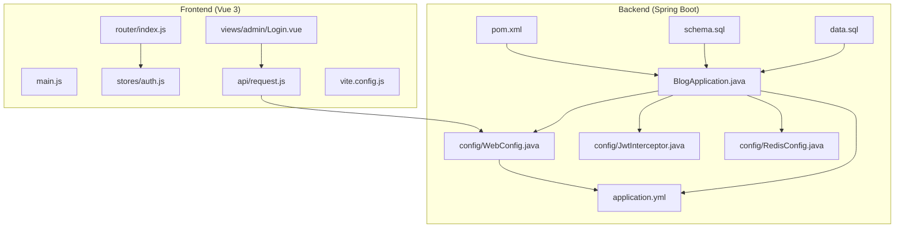
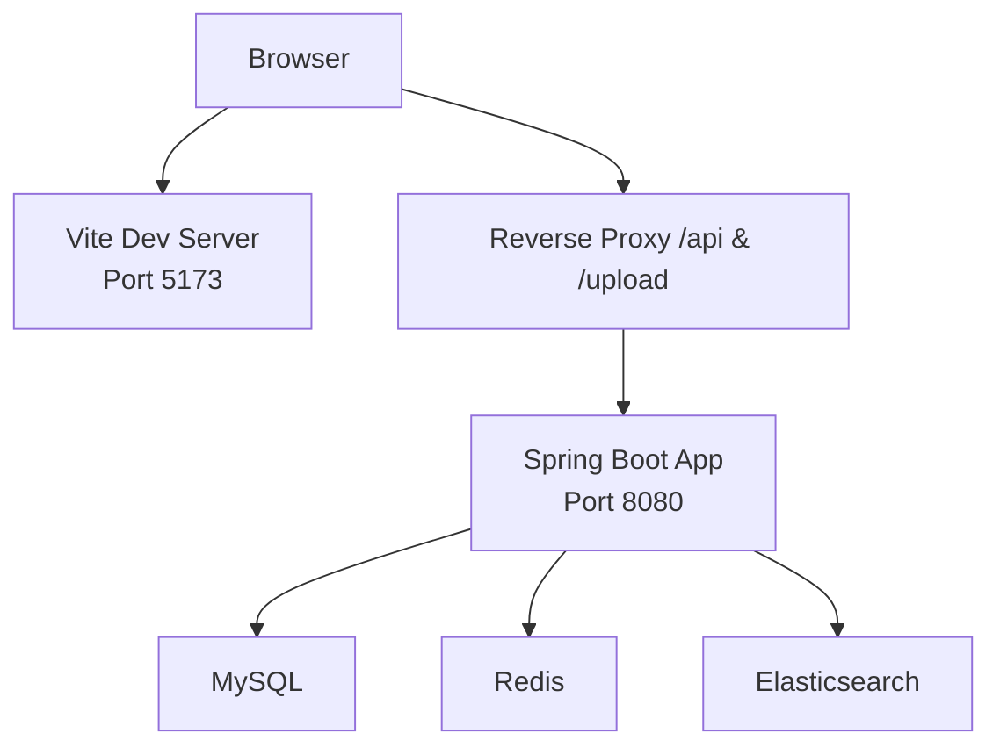
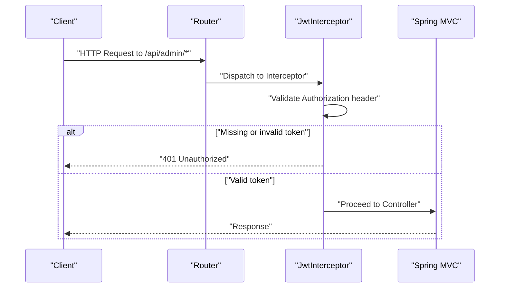
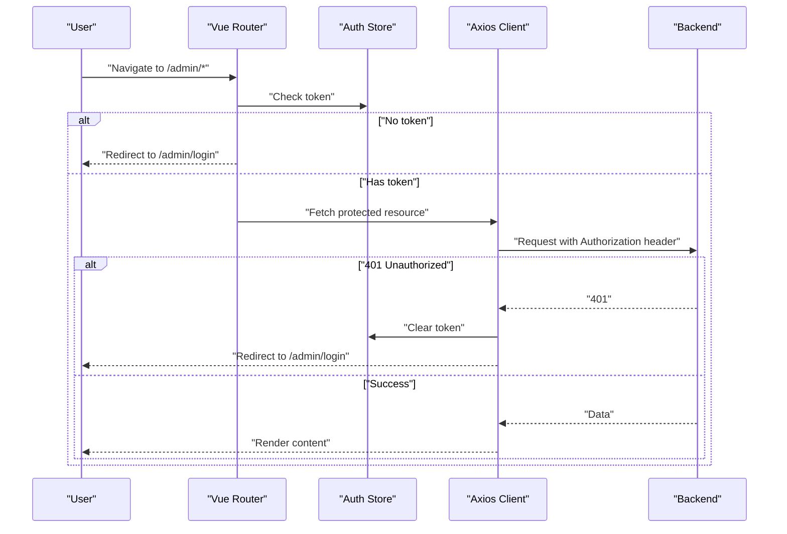
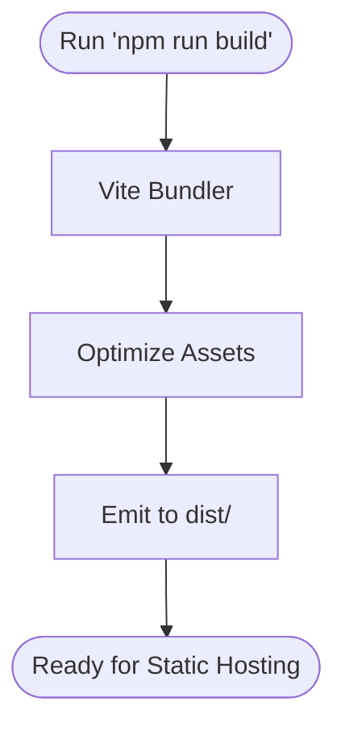
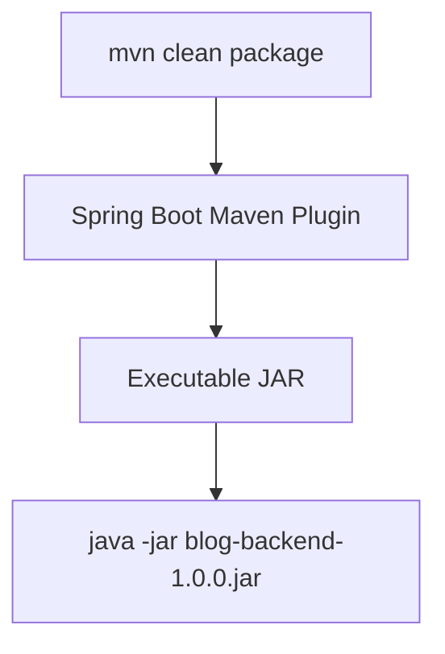
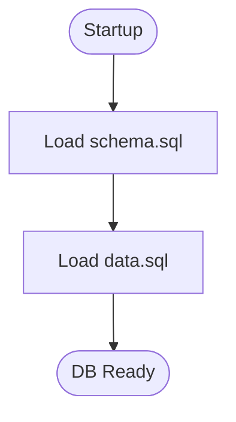
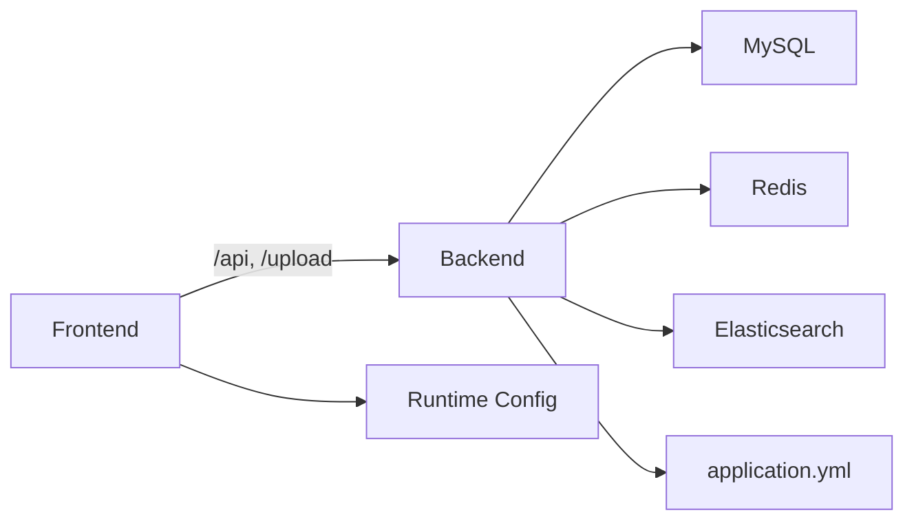

# Development & Deployment

<cite>
**Referenced Files in This Document**
- [pom.xml](file://blog-backend/pom.xml)
- [BlogApplication.java](file://blog-backend/src/main/java/com/blog/BlogApplication.java)
- [application.yml](file://blog-backend/src/main/resources/application.yml)
- [schema.sql](file://blog-backend/src/main/resources/schema.sql)
- [data.sql](file://blog-backend/src/main/resources/data.sql)
- [WebConfig.java](file://blog-backend/src/main/java/com/blog/config/WebConfig.java)
- [JwtInterceptor.java](file://blog-backend/src/main/java/com/blog/config/JwtInterceptor.java)
- [RedisConfig.java](file://blog-backend/src/main/java/com/blog/config/RedisConfig.java)
- [package.json](file://blog-frontend/package.json)
- [vite.config.js](file://blog-frontend/vite.config.js)
- [main.js](file://blog-frontend/src/main.js)
- [index.js](file://blog-frontend/src/router/index.js)
- [auth.js](file://blog-frontend/src/stores/auth.js)
- [Login.vue](file://blog-frontend/src/views/admin/Login.vue)
- [request.js](file://blog-frontend/src/api/request.js)
</cite>

## Table of Contents
1. [Introduction](#introduction)
2. [Project Structure](#project-structure)
3. [Core Components](#core-components)
4. [Architecture Overview](#architecture-overview)
5. [Detailed Component Analysis](#detailed-component-analysis)
6. [Dependency Analysis](#dependency-analysis)
7. [Performance Considerations](#performance-considerations)
8. [Troubleshooting Guide](#troubleshooting-guide)
9. [Conclusion](#conclusion)
10. [Appendices](#appendices)

## Introduction
This document provides end-to-end guidance for developing and deploying the blog platform. It covers setting up the development environment, enabling hot reload and debugging for both frontend and backend, building the Vue.js application with Vite, packaging the Spring Boot backend, and preparing artifacts for production. It also outlines production deployment strategies including containerization, environment configuration, database initialization, reverse proxy setup, performance optimization, monitoring, logging, maintenance, troubleshooting, and rollback procedures.

## Project Structure
The project consists of two primary modules:
- Backend: Spring Boot application built with Maven, exposing REST APIs and serving static uploads.
- Frontend: Vue 3 single-page application built with Vite, routing to admin and public pages, and integrating with backend APIs.

**Diagram sources**
- [main.js:1-9](file://blog-frontend/src/main.js#L1-L9)
- [index.js:1-74](file://blog-frontend/src/router/index.js#L1-L74)
- [auth.js:1-19](file://blog-frontend/src/stores/auth.js#L1-L19)
- [Login.vue:1-83](file://blog-frontend/src/views/admin/Login.vue#L1-L83)
- [request.js:1-33](file://blog-frontend/src/api/request.js#L1-L33)
- [vite.config.js:1-21](file://blog-frontend/vite.config.js#L1-L21)
- [BlogApplication.java:1-16](file://blog-backend/src/main/java/com/blog/BlogApplication.java#L1-L16)
- [application.yml:1-33](file://blog-backend/src/main/resources/application.yml#L1-L33)
- [WebConfig.java:1-39](file://blog-backend/src/main/java/com/blog/config/WebConfig.java#L1-L39)
- [JwtInterceptor.java:1-36](file://blog-backend/src/main/java/com/blog/config/JwtInterceptor.java#L1-L36)
- [RedisConfig.java:1-27](file://blog-backend/src/main/java/com/blog/config/RedisConfig.java#L1-L27)
- [pom.xml:1-111](file://blog-backend/pom.xml#L1-L111)
- [schema.sql:1-33](file://blog-backend/src/main/resources/schema.sql#L1-L33)
- [data.sql:1-2](file://blog-backend/src/main/resources/data.sql#L1-L2)

**Section sources**
- [pom.xml:1-111](file://blog-backend/pom.xml#L1-L111)
- [BlogApplication.java:1-16](file://blog-backend/src/main/java/com/blog/BlogApplication.java#L1-L16)
- [application.yml:1-33](file://blog-backend/src/main/resources/application.yml#L1-L33)
- [schema.sql:1-33](file://blog-backend/src/main/resources/schema.sql#L1-L33)
- [data.sql:1-2](file://blog-backend/src/main/resources/data.sql#L1-L2)
- [WebConfig.java:1-39](file://blog-backend/src/main/java/com/blog/config/WebConfig.java#L1-L39)
- [JwtInterceptor.java:1-36](file://blog-backend/src/main/java/com/blog/config/JwtInterceptor.java#L1-L36)
- [RedisConfig.java:1-27](file://blog-backend/src/main/java/com/blog/config/RedisConfig.java#L1-L27)
- [package.json:1-24](file://blog-frontend/package.json#L1-L24)
- [vite.config.js:1-21](file://blog-frontend/vite.config.js#L1-L21)
- [main.js:1-9](file://blog-frontend/src/main.js#L1-L9)
- [index.js:1-74](file://blog-frontend/src/router/index.js#L1-L74)
- [auth.js:1-19](file://blog-frontend/src/stores/auth.js#L1-L19)
- [Login.vue:1-83](file://blog-frontend/src/views/admin/Login.vue#L1-L83)
- [request.js:1-33](file://blog-frontend/src/api/request.js#L1-L33)

## Core Components
- Backend application bootstrap and scanning:
  - Application class enables Spring Boot auto-configuration, MyBatis mapper scanning, and caching.
  - Maven coordinates define Java 17, packaging as JAR, and plugin exclusions for Lombok.
- Environment configuration:
  - Database, Redis, Elasticsearch, MyBatis, JWT, and upload paths are configured via YAML.
- CORS, interceptors, and resource handling:
  - Global CORS policy, JWT interceptor for admin endpoints, and static upload resource mapping.
- Frontend application bootstrap and routing:
  - Vue app initialization with Pinia and Router; admin routes guarded by token presence.
- API client and authentication store:
  - Axios base URL targeting "/api", automatic Authorization header injection, and 401 handling.
- Build and dev server:
  - Vite scripts for dev, build, and preview; dev server proxying "/api" and "/upload" to backend.

**Section sources**
- [BlogApplication.java:1-16](file://blog-backend/src/main/java/com/blog/BlogApplication.java#L1-L16)
- [pom.xml:1-111](file://blog-backend/pom.xml#L1-L111)
- [application.yml:1-33](file://blog-backend/src/main/resources/application.yml#L1-L33)
- [WebConfig.java:1-39](file://blog-backend/src/main/java/com/blog/config/WebConfig.java#L1-L39)
- [JwtInterceptor.java:1-36](file://blog-backend/src/main/java/com/blog/config/JwtInterceptor.java#L1-L36)
- [RedisConfig.java:1-27](file://blog-backend/src/main/java/com/blog/config/RedisConfig.java#L1-L27)
- [main.js:1-9](file://blog-frontend/src/main.js#L1-L9)
- [index.js:1-74](file://blog-frontend/src/router/index.js#L1-L74)
- [auth.js:1-19](file://blog-frontend/src/stores/auth.js#L1-L19)
- [request.js:1-33](file://blog-frontend/src/api/request.js#L1-L33)
- [package.json:1-24](file://blog-frontend/package.json#L1-L24)
- [vite.config.js:1-21](file://blog-frontend/vite.config.js#L1-L21)

## Architecture Overview
The system follows a classic SPA plus REST API pattern:
- The frontend runs on Vite’s dev server during development and serves static assets after build.
- The backend exposes REST endpoints under "/api" and serves uploaded files under "/upload".
- Reverse proxy forwards frontend static assets and API requests to backend services.

**Diagram sources**
- [vite.config.js:1-21](file://blog-frontend/vite.config.js#L1-L21)
- [application.yml:1-33](file://blog-backend/src/main/resources/application.yml#L1-L33)
- [WebConfig.java:1-39](file://blog-backend/src/main/java/com/blog/config/WebConfig.java#L1-L39)

## Detailed Component Analysis

### Backend Development Workflow and Debugging
- Running the backend:
  - Use Maven to launch the Spring Boot application.
  - Configure JVM arguments and debug flags as needed in your IDE.
- Hot reload:
  - Spring Boot DevTools is not declared in the POM; consider adding it for faster restarts during development.
- Debugging:
  - Set breakpoints in controllers, services, and interceptors.
  - Inspect request/response headers and body in the IDE debugger.
- Interceptor and CORS:
  - The JWT interceptor enforces Authorization headers for admin endpoints.
  - CORS allows cross-origin requests from any origin for development convenience.

**Diagram sources**
- [JwtInterceptor.java:1-36](file://blog-backend/src/main/java/com/blog/config/JwtInterceptor.java#L1-L36)
- [WebConfig.java:1-39](file://blog-backend/src/main/java/com/blog/config/WebConfig.java#L1-L39)

**Section sources**
- [BlogApplication.java:1-16](file://blog-backend/src/main/java/com/blog/BlogApplication.java#L1-L16)
- [pom.xml:1-111](file://blog-backend/pom.xml#L1-L111)
- [JwtInterceptor.java:1-36](file://blog-backend/src/main/java/com/blog/config/JwtInterceptor.java#L1-L36)
- [WebConfig.java:1-39](file://blog-backend/src/main/java/com/blog/config/WebConfig.java#L1-L39)

### Frontend Development Workflow and Debugging
- Running the frontend:
  - Use Vite dev script to start the development server.
  - Enable browser devtools and Vue devtools for component inspection.
- Hot reload:
  - Vite provides instant module updates without full page reload.
- Debugging:
  - Use Vue devtools to inspect component state and Pinia store.
  - Add console logs and breakpoints in route guards and API handlers.
- Routing and authentication:
  - Admin routes require a stored token; otherwise redirect to login.
  - On 401 responses, the API client clears the token and navigates to login.

**Diagram sources**
- [index.js:1-74](file://blog-frontend/src/router/index.js#L1-L74)
- [auth.js:1-19](file://blog-frontend/src/stores/auth.js#L1-L19)
- [request.js:1-33](file://blog-frontend/src/api/request.js#L1-L33)

**Section sources**
- [package.json:1-24](file://blog-frontend/package.json#L1-L24)
- [vite.config.js:1-21](file://blog-frontend/vite.config.js#L1-L21)
- [main.js:1-9](file://blog-frontend/src/main.js#L1-L9)
- [index.js:1-74](file://blog-frontend/src/router/index.js#L1-L74)
- [auth.js:1-19](file://blog-frontend/src/stores/auth.js#L1-L19)
- [request.js:1-33](file://blog-frontend/src/api/request.js#L1-L33)
- [Login.vue:1-83](file://blog-frontend/src/views/admin/Login.vue#L1-L83)

### Build Process: Vue.js with Vite
- Scripts:
  - Development: start Vite dev server.
  - Production build: bundle and optimize assets.
  - Preview: serve built assets locally for testing.
- Proxy configuration:
  - "/api" and "/upload" are proxied to the backend running on localhost:8080 during development.
- Output:
  - Built assets are emitted to the dist directory by default.

**Diagram sources**
- [package.json:1-24](file://blog-frontend/package.json#L1-L24)
- [vite.config.js:1-21](file://blog-frontend/vite.config.js#L1-L21)

**Section sources**
- [package.json:1-24](file://blog-frontend/package.json#L1-L24)
- [vite.config.js:1-21](file://blog-frontend/vite.config.js#L1-L21)

### Packaging and Artifact Generation: Spring Boot
- Packaging:
  - Maven builds a JAR artifact using the Spring Boot Maven Plugin.
  - Lombok is excluded from the final artifact.
- Running the artifact:
  - Execute the generated JAR with Java 17.
- Dependencies:
  - Starter web, validation, MyBatis, MySQL driver, Redis, Elasticsearch, JWT, and test dependencies.

**Diagram sources**
- [pom.xml:1-111](file://blog-backend/pom.xml#L1-L111)
- [BlogApplication.java:1-16](file://blog-backend/src/main/java/com/blog/BlogApplication.java#L1-L16)

**Section sources**
- [pom.xml:1-111](file://blog-backend/pom.xml#L1-L111)
- [BlogApplication.java:1-16](file://blog-backend/src/main/java/com/blog/BlogApplication.java#L1-L16)

### Database Initialization and Migration
- Schema and seed:
  - SQL scripts define tables and seed initial admin credentials.
  - Initialization mode is configured to avoid repeated schema execution in development.
- Migration strategy:
  - For production, prefer a dedicated migration tool (e.g., Flyway or Liquibase) to manage schema evolution and data migrations.

**Diagram sources**
- [application.yml:1-33](file://blog-backend/src/main/resources/application.yml#L1-L33)
- [schema.sql:1-33](file://blog-backend/src/main/resources/schema.sql#L1-L33)
- [data.sql:1-2](file://blog-backend/src/main/resources/data.sql#L1-L2)

**Section sources**
- [application.yml:1-33](file://blog-backend/src/main/resources/application.yml#L1-L33)
- [schema.sql:1-33](file://blog-backend/src/main/resources/schema.sql#L1-L33)
- [data.sql:1-2](file://blog-backend/src/main/resources/data.sql#L1-L2)

### Reverse Proxy Setup (Nginx/Apache)
- Forwarding:
  - Route "/api" to the backend service.
  - Serve static assets from the frontend dist directory.
- Security:
  - Enforce HTTPS, rate limiting, and appropriate headers in production.
- Health checks:
  - Configure upstream health checks pointing to the backend.

[No sources needed since this section provides general guidance]

### Containerization (Docker)
- Multi-stage build:
  - Build frontend with Node, produce dist.
  - Build backend with Maven, produce JAR.
  - Serve frontend dist via Nginx or static file server; expose backend JAR on a container port.
- Orchestration:
  - Compose services for backend, database, Redis, Elasticsearch, and reverse proxy.
- Secrets and volumes:
  - Mount environment-specific configuration files and persistent volumes for uploads.

[No sources needed since this section provides general guidance]

### Environment Configuration
- Backend:
  - Externalize database, Redis, Elasticsearch, JWT, and upload paths via environment variables.
  - Use Spring profiles to switch between dev, staging, and prod configurations.
- Frontend:
  - Use environment variables for base URLs and feature flags during build.
  - Build-time variables are injected by Vite; runtime configuration can be fetched from backend.

[No sources needed since this section provides general guidance]

### Monitoring, Logging, and Maintenance
- Monitoring:
  - Expose metrics via Micrometer and integrate with Prometheus/Grafana.
- Logging:
  - Centralize logs using ELK/EFK stack or cloud-native solutions.
- Maintenance:
  - Schedule database backups, rotate secrets, and monitor disk usage for uploads.

[No sources needed since this section provides general guidance]

## Dependency Analysis
- Frontend-to-backend coupling:
  - The frontend communicates exclusively via "/api" and "/upload" endpoints.
  - Token-based authentication is enforced for admin endpoints.
- Backend subsystems:
  - Relational data via MySQL, caching via Redis, search via Elasticsearch, and JWT for auth.
- Build-time dependencies:
  - Vue 3, Vue Router, Pinia, Axios, WangEditor; Vite and Vue plugin for bundling.

**Diagram sources**
- [request.js:1-33](file://blog-frontend/src/api/request.js#L1-L33)
- [WebConfig.java:1-39](file://blog-backend/src/main/java/com/blog/config/WebConfig.java#L1-L39)
- [application.yml:1-33](file://blog-backend/src/main/resources/application.yml#L1-L33)

**Section sources**
- [request.js:1-33](file://blog-frontend/src/api/request.js#L1-L33)
- [WebConfig.java:1-39](file://blog-backend/src/main/java/com/blog/config/WebConfig.java#L1-L39)
- [application.yml:1-33](file://blog-backend/src/main/resources/application.yml#L1-L33)

## Performance Considerations
- Frontend:
  - Code-split routes and lazy-load heavy components.
  - Minimize payload sizes; enable gzip/brotli compression in the reverse proxy.
- Backend:
  - Enable Redis caching for frequently accessed data.
  - Use connection pooling for MySQL and Elasticsearch.
  - Tune JVM heap and GC settings for production workloads.
- Database:
  - Index frequently queried columns; avoid N+1 queries.
- CDN:
  - Serve static assets via CDN for global performance.

[No sources needed since this section provides general guidance]

## Troubleshooting Guide
- Frontend 401 errors:
  - Verify token storage and Authorization header injection.
  - Confirm route guards redirect to login on 401.
- CORS issues:
  - Ensure allowed origins and methods match frontend requests.
- Upload failures:
  - Confirm upload path exists and is writable; check resource mapping.
- Database connectivity:
  - Validate JDBC URL, credentials, and network reachability.
- Reverse proxy misconfiguration:
  - Ensure "/api" and "/upload" are proxied to the backend address and port.

**Section sources**
- [request.js:1-33](file://blog-frontend/src/api/request.js#L1-L33)
- [index.js:1-74](file://blog-frontend/src/router/index.js#L1-L74)
- [WebConfig.java:1-39](file://blog-backend/src/main/java/com/blog/config/WebConfig.java#L1-L39)
- [application.yml:1-33](file://blog-backend/src/main/resources/application.yml#L1-L33)

## Conclusion
This guide consolidates development practices, build pipelines, and production deployment strategies for the blog platform. By leveraging Vite for frontend development, Spring Boot for backend services, and a reverse proxy for routing, teams can achieve efficient local development and reliable production deployments. Adopting containerization, robust monitoring, and secure environment configuration ensures long-term maintainability and scalability.

## Appendices
- Development checklist:
  - Install JDK 17, Node.js LTS, MySQL, Redis, and Elasticsearch.
  - Start backend services, then frontend dev server.
  - Build and preview the frontend locally before deployment.
- Production checklist:
  - Package backend JAR and build frontend dist.
  - Configure environment variables and secrets.
  - Deploy containers behind a reverse proxy with SSL termination.
  - Set up database initialization and backups.
  - Configure monitoring, logging, and alerting.

[No sources needed since this section provides general guidance]