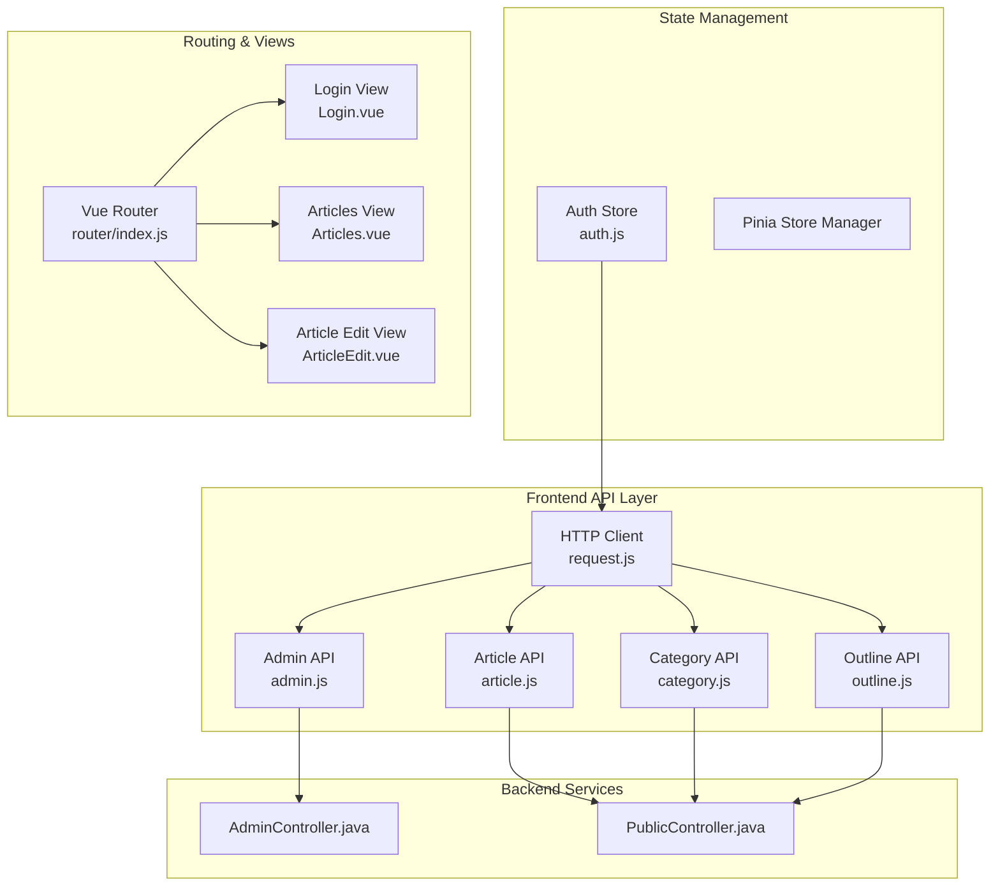
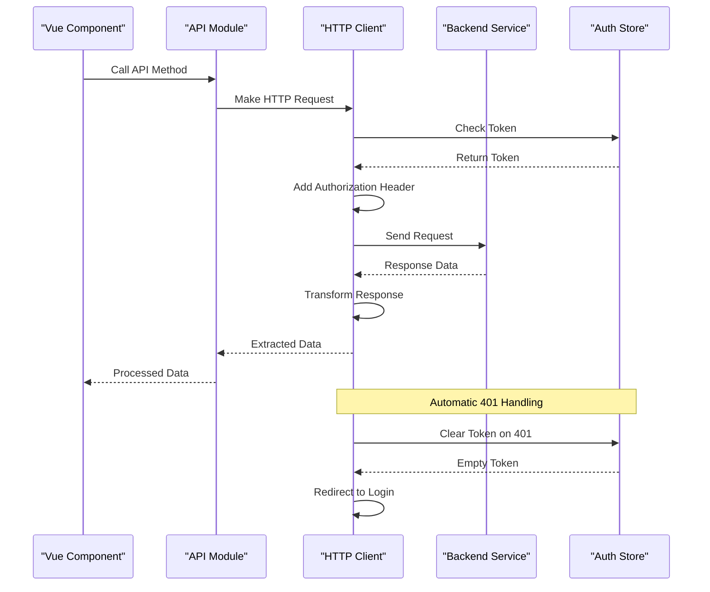
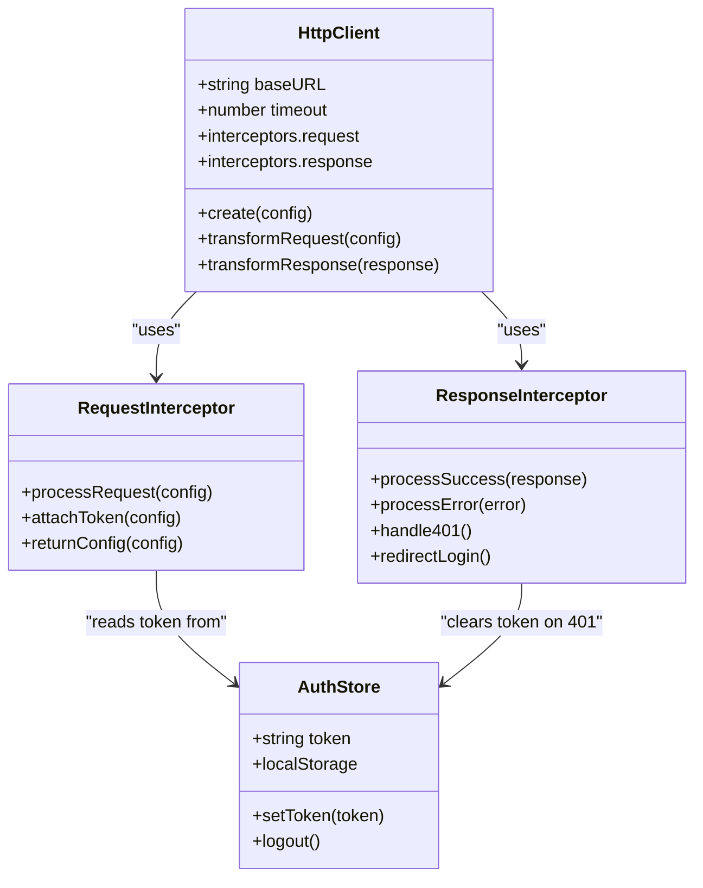
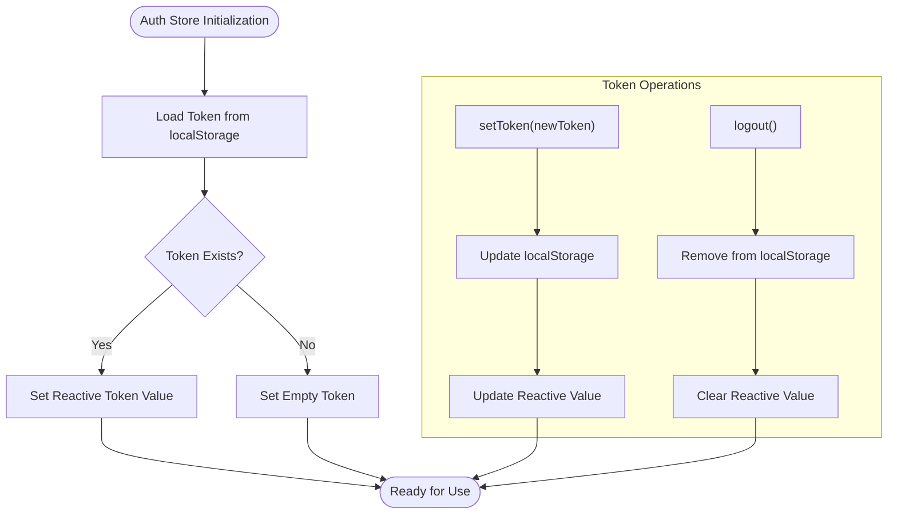
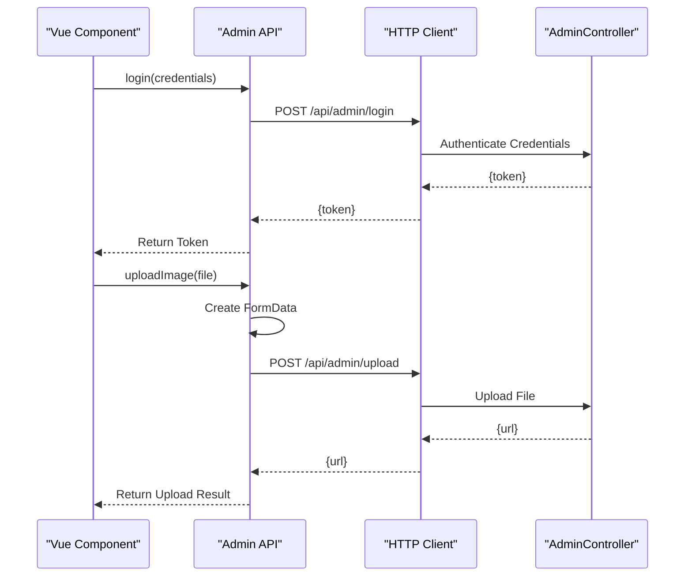
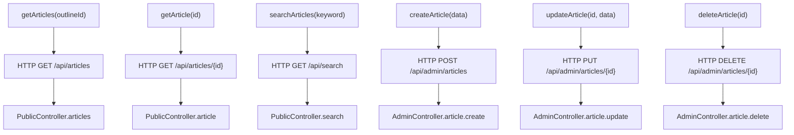
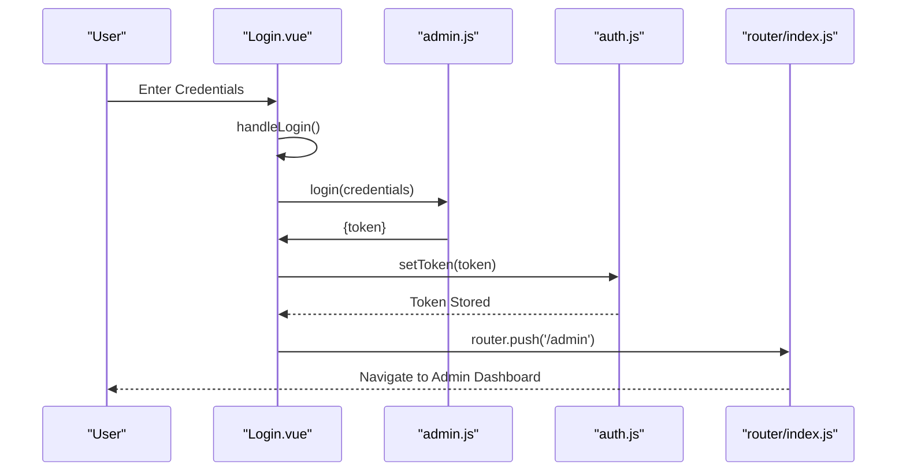
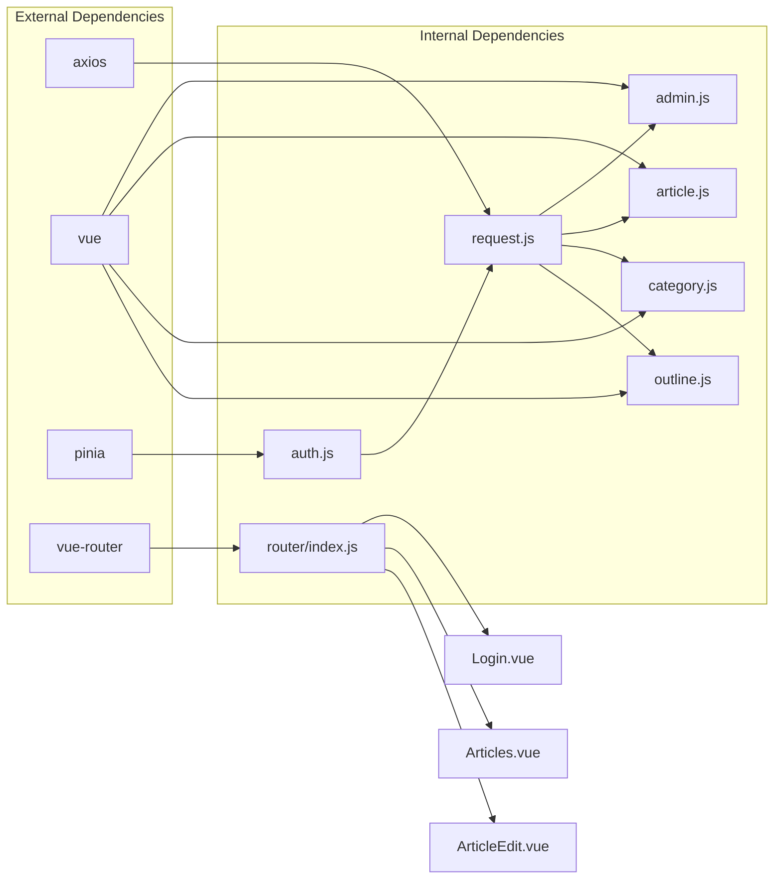

# API Integration Patterns

<cite>
**Referenced Files in This Document**
- [request.js](file://blog-frontend/src/api/request.js)
- [admin.js](file://blog-frontend/src/api/admin.js)
- [article.js](file://blog-frontend/src/api/article.js)
- [category.js](file://blog-frontend/src/api/category.js)
- [outline.js](file://blog-frontend/src/api/outline.js)
- [auth.js](file://blog-frontend/src/stores/auth.js)
- [main.js](file://blog-frontend/src/main.js)
- [router/index.js](file://blog-frontend/src/router/index.js)
- [Login.vue](file://blog-frontend/src/views/admin/Login.vue)
- [Articles.vue](file://blog-frontend/src/views/admin/Articles.vue)
- [ArticleEdit.vue](file://blog-frontend/src/views/admin/ArticleEdit.vue)
- [AdminController.java](file://blog-backend/src/main/java/com/blog/controller/AdminController.java)
- [PublicController.java](file://blog-backend/src/main/java/com/blog/controller/PublicController.java)
- [package.json](file://blog-frontend/package.json)
</cite>

## Table of Contents
1. [Introduction](#introduction)
2. [Project Structure](#project-structure)
3. [Core Components](#core-components)
4. [Architecture Overview](#architecture-overview)
5. [Detailed Component Analysis](#detailed-component-analysis)
6. [Dependency Analysis](#dependency-analysis)
7. [Performance Considerations](#performance-considerations)
8. [Testing Approaches](#testing-approaches)
9. [Troubleshooting Guide](#troubleshooting-guide)
10. [Conclusion](#conclusion)

## Introduction
This document provides comprehensive documentation for API integration patterns and HTTP client implementation in a Vue.js blog administration system. The project demonstrates modern API integration techniques including centralized HTTP client configuration, authentication token management, request/response transformation, and structured API module organization. The implementation follows Vue 3 Composition API patterns with Pinia for state management and axios for HTTP communication.

## Project Structure
The API integration is organized around a modular architecture with clear separation of concerns:

**Diagram sources**
- [request.js:1-33](file://blog-frontend/src/api/request.js#L1-L33)
- [admin.js:1-12](file://blog-frontend/src/api/admin.js#L1-L12)
- [article.js:1-14](file://blog-frontend/src/api/article.js#L1-L14)
- [category.js:1-10](file://blog-frontend/src/api/category.js#L1-L10)
- [outline.js:1-10](file://blog-frontend/src/api/outline.js#L1-L10)
- [auth.js:1-19](file://blog-frontend/src/stores/auth.js#L1-L19)
- [router/index.js:1-74](file://blog-frontend/src/router/index.js#L1-L74)

**Section sources**
- [request.js:1-33](file://blog-frontend/src/api/request.js#L1-L33)
- [admin.js:1-12](file://blog-frontend/src/api/admin.js#L1-L12)
- [article.js:1-14](file://blog-frontend/src/api/article.js#L1-L14)
- [category.js:1-10](file://blog-frontend/src/api/category.js#L1-L10)
- [outline.js:1-10](file://blog-frontend/src/api/outline.js#L1-L10)

## Core Components
The API integration is built around several core components that work together to provide a robust HTTP client implementation:

### Centralized HTTP Client
The HTTP client serves as the foundation for all API communications, providing:
- Base URL configuration pointing to `/api`
- Global timeout setting of 30 seconds
- Automatic token injection via request interceptors
- Centralized error handling with automatic authentication cleanup
- Response data normalization to extract payload automatically

### API Module Organization
The frontend API is organized into specialized modules:
- **Admin Module**: Handles authentication and media uploads
- **Article Module**: Manages CRUD operations for articles
- **Category Module**: Handles category management operations
- **Outline Module**: Manages content outline operations

### Authentication Token Management
The authentication system uses JWT tokens stored in localStorage with automatic cleanup on 401 errors. The token is automatically attached to all requests via axios interceptors.

**Section sources**
- [request.js:4-32](file://blog-frontend/src/api/request.js#L4-L32)
- [auth.js:4-18](file://blog-frontend/src/stores/auth.js#L4-L18)

## Architecture Overview
The API integration follows a layered architecture pattern with clear separation between presentation, API abstraction, and backend services:

**Diagram sources**
- [request.js:9-30](file://blog-frontend/src/api/request.js#L9-L30)
- [auth.js:12-15](file://blog-frontend/src/stores/auth.js#L12-L15)
- [Login.vue:32-41](file://blog-frontend/src/views/admin/Login.vue#L32-L41)

The architecture ensures:
- **Consistent Error Handling**: All 401 responses trigger automatic logout and navigation
- **Automatic Token Management**: Tokens are automatically attached to authenticated requests
- **Response Normalization**: API responses are automatically transformed to extract data payloads
- **Modular API Design**: Separate modules for different functional domains

## Detailed Component Analysis

### HTTP Client Implementation (`request.js`)
The HTTP client provides the foundation for all API communications:

**Diagram sources**
- [request.js:4-32](file://blog-frontend/src/api/request.js#L4-L32)
- [auth.js:4-18](file://blog-frontend/src/stores/auth.js#L4-L18)

Key features include:
- **Base Configuration**: Centralized baseURL and timeout settings
- **Request Interceptor**: Automatically attaches Bearer tokens from auth store
- **Response Interceptor**: Handles 401 errors with automatic logout and navigation
- **Response Transformation**: Extracts `.data` property from successful responses

**Section sources**
- [request.js:1-33](file://blog-frontend/src/api/request.js#L1-L33)

### Authentication Module (`auth.js`)
The authentication store manages JWT token lifecycle and provides reactive token state:

**Diagram sources**
- [auth.js:4-18](file://blog-frontend/src/stores/auth.js#L4-L18)

**Section sources**
- [auth.js:1-19](file://blog-frontend/src/stores/auth.js#L1-L19)

### Admin API Module (`admin.js`)
Handles administrative operations including authentication and media management:

**Diagram sources**
- [admin.js:3-11](file://blog-frontend/src/api/admin.js#L3-L11)
- [AdminController.java:34-59](file://blog-backend/src/main/java/com/blog/controller/AdminController.java#L34-L59)

**Section sources**
- [admin.js:1-12](file://blog-frontend/src/api/admin.js#L1-L12)

### Article Management API (`article.js`)
Provides comprehensive CRUD operations for articles with filtering capabilities:

**Diagram sources**
- [article.js:3-13](file://blog-frontend/src/api/article.js#L3-L13)
- [PublicController.java:42-54](file://blog-backend/src/main/java/com/blog/controller/PublicController.java#L42-L54)
- [AdminController.java:102-119](file://blog-backend/src/main/java/com/blog/controller/AdminController.java#L102-L119)

**Section sources**
- [article.js:1-14](file://blog-frontend/src/api/article.js#L1-L14)

### Category Management API (`category.js`)
Handles category CRUD operations for content organization:

**Section sources**
- [category.js:1-10](file://blog-frontend/src/api/category.js#L1-L10)

### Outline Management API (`outline.js`)
Manages content outlines with category-based filtering:

**Section sources**
- [outline.js:1-10](file://blog-frontend/src/api/outline.js#L1-L10)

### Frontend Integration Examples

#### Login Component Integration
The login component demonstrates complete authentication flow:

**Diagram sources**
- [Login.vue:32-41](file://blog-frontend/src/views/admin/Login.vue#L32-L41)
- [admin.js:3](file://blog-frontend/src/api/admin.js#L3)
- [auth.js:7-10](file://blog-frontend/src/stores/auth.js#L7-L10)
- [router/index.js:64-71](file://blog-frontend/src/router/index.js#L64-L71)

**Section sources**
- [Login.vue:1-83](file://blog-frontend/src/views/admin/Login.vue#L1-L83)

#### Articles Management Integration
The articles component showcases combined API usage:

**Section sources**
- [Articles.vue:35-78](file://blog-frontend/src/views/admin/Articles.vue#L35-L78)

#### Article Editing Integration
The article edit component demonstrates advanced API patterns:

**Section sources**
- [ArticleEdit.vue:34-80](file://blog-frontend/src/views/admin/ArticleEdit.vue#L34-L80)

## Dependency Analysis
The API integration demonstrates clean dependency relationships:

**Diagram sources**
- [package.json:11-22](file://blog-frontend/package.json#L11-L22)
- [request.js:1](file://blog-frontend/src/api/request.js#L1)
- [admin.js:1](file://blog-frontend/src/api/admin.js#L1)
- [article.js:1](file://blog-frontend/src/api/article.js#L1)
- [category.js:1](file://blog-frontend/src/api/category.js#L1)
- [outline.js:1](file://blog-frontend/src/api/outline.js#L1)

**Section sources**
- [package.json:1-24](file://blog-frontend/package.json#L1-L24)

## Performance Considerations
The API integration includes several performance optimizations:

### Request Timeout Configuration
- **30-second timeout** prevents hanging requests
- **Centralized timeout** ensures consistent behavior across all API calls

### Response Data Normalization
- **Automatic data extraction** eliminates repetitive `.data` access
- **Consistent response format** simplifies frontend data handling

### Authentication Efficiency
- **Single token storage** reduces authentication overhead
- **Automatic header injection** prevents redundant manual header setup

### Caching Strategies
While the current implementation focuses on real-time data, potential caching improvements include:
- **Response caching** for frequently accessed static data
- **Query result caching** for filtered article lists
- **Token caching** to reduce localStorage operations

## Testing Approaches
The modular API structure facilitates comprehensive testing:

### Unit Testing Strategies
- **API Module Testing**: Test individual API functions in isolation
- **HTTP Client Testing**: Mock axios interceptors and responses
- **Authentication Testing**: Verify token storage and cleanup behavior
- **Integration Testing**: Test complete request/response cycles

### Mock Data Handling
Recommended approaches for testing:
- **Axios Mock Adapter**: Intercept HTTP calls for unit tests
- **Test Store Setup**: Create isolated auth store instances for testing
- **Response Stubbing**: Mock backend responses with realistic data structures

### API Testing Scenarios
- **Successful Authentication**: Verify token receipt and storage
- **Authenticated Requests**: Test token attachment and authorization headers
- **Error Handling**: Validate 401 response handling and logout behavior
- **Data Transformation**: Confirm response data extraction and processing

## Troubleshooting Guide

### Common Issues and Solutions

#### Authentication Problems
- **Issue**: 401 Unauthorized errors
- **Cause**: Expired or invalid token
- **Solution**: Check token expiration and refresh mechanism

#### Network Connectivity Issues
- **Issue**: Request timeouts or network failures
- **Cause**: Slow network or server unavailability
- **Solution**: Implement retry logic and user feedback

#### CORS Configuration
- **Issue**: Cross-origin request failures
- **Cause**: Backend CORS policy restrictions
- **Solution**: Configure appropriate CORS headers on backend

#### Token Storage Issues
- **Issue**: Token not persisting between browser sessions
- **Cause**: localStorage accessibility problems
- **Solution**: Implement fallback storage mechanisms

**Section sources**
- [request.js:20-30](file://blog-frontend/src/api/request.js#L20-L30)
- [auth.js:5](file://blog-frontend/src/stores/auth.js#L5)

## Conclusion
The API integration patterns demonstrated in this Vue.js application provide a robust foundation for building scalable web applications. The implementation showcases best practices including centralized HTTP client configuration, modular API organization, automatic authentication handling, and clean separation of concerns. The architecture supports maintainable code while providing efficient data flow between frontend components and backend services.

Key strengths of the implementation include:
- **Clean Architecture**: Well-organized modules with clear responsibilities
- **Automatic Error Handling**: Centralized 401 response processing
- **Reactive Authentication**: Token management integrated with Vue's reactivity system
- **Consistent API Design**: Uniform patterns across all API modules
- **Extensible Structure**: Easy to add new API endpoints and functionality

The patterns established here serve as a solid foundation for building production-ready Vue.js applications with robust API integration capabilities.