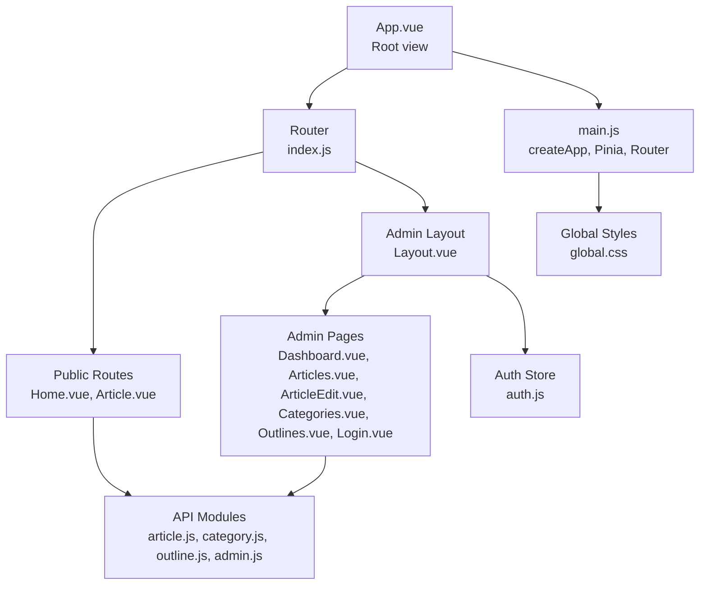
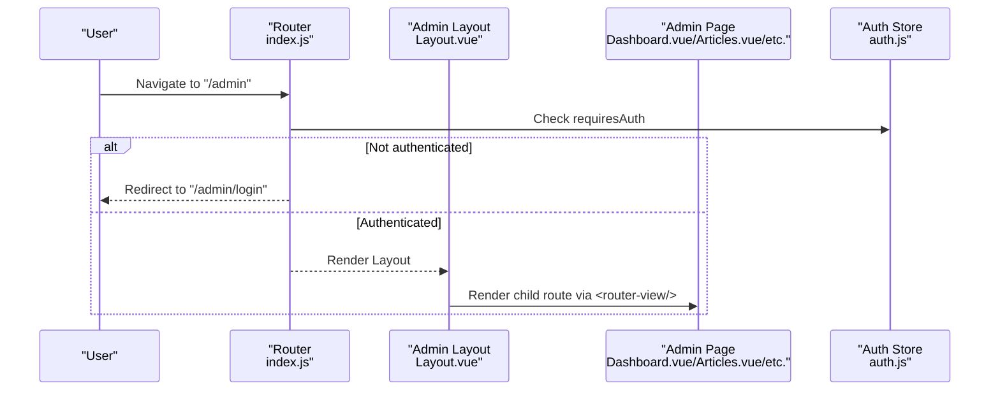
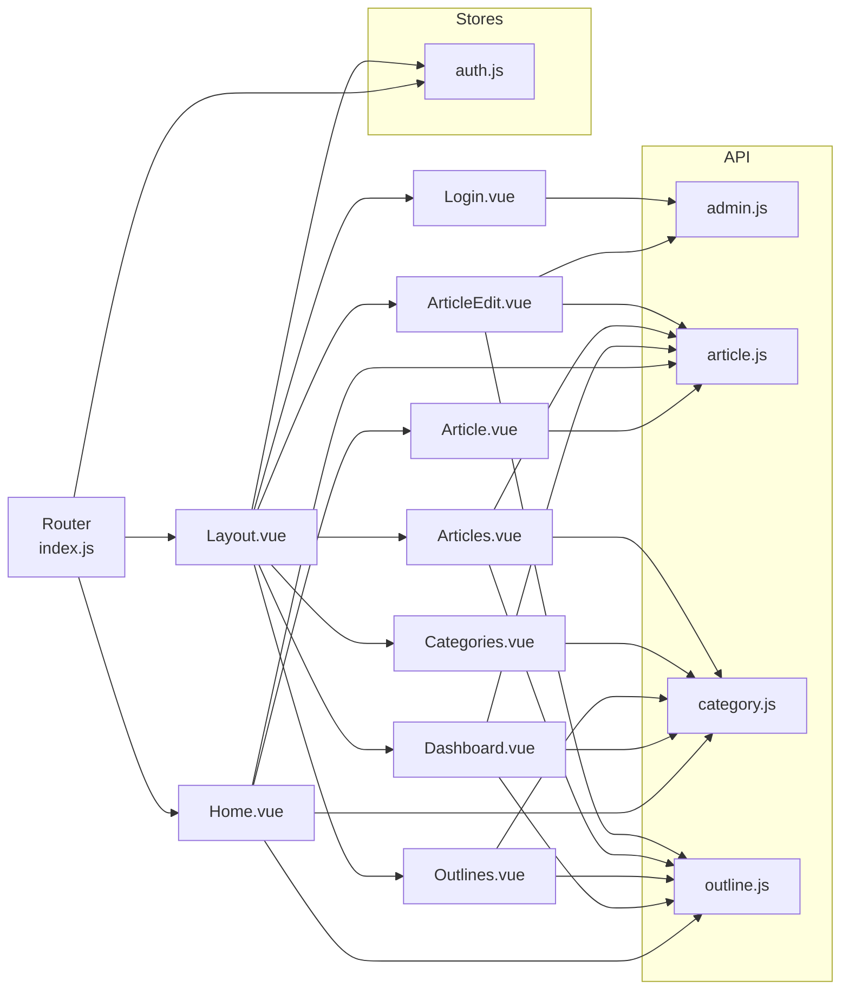

# Component System and UI Components

<cite>
**Referenced Files in This Document**
- [Layout.vue](file://blog-frontend/src/views/admin/Layout.vue)
- [Dashboard.vue](file://blog-frontend/src/views/admin/Dashboard.vue)
- [Articles.vue](file://blog-frontend/src/views/admin/Articles.vue)
- [ArticleEdit.vue](file://blog-frontend/src/views/admin/ArticleEdit.vue)
- [Categories.vue](file://blog-frontend/src/views/admin/Categories.vue)
- [Outlines.vue](file://blog-frontend/src/views/admin/Outlines.vue)
- [Login.vue](file://blog-frontend/src/views/admin/Login.vue)
- [Home.vue](file://blog-frontend/src/views/Home.vue)
- [Article.vue](file://blog-frontend/src/views/Article.vue)
- [App.vue](file://blog-frontend/src/App.vue)
- [main.js](file://blog-frontend/src/main.js)
- [index.js](file://blog-frontend/src/router/index.js)
- [auth.js](file://blog-frontend/src/stores/auth.js)
- [global.css](file://blog-frontend/src/assets/global.css)
- [admin.js](file://blog-frontend/src/api/admin.js)
- [article.js](file://blog-frontend/src/api/article.js)
- [category.js](file://blog-frontend/src/api/category.js)
- [outline.js](file://blog-frontend/src/api/outline.js)
</cite>

## Table of Contents
1. [Introduction](#introduction)
2. [Project Structure](#project-structure)
3. [Core Components](#core-components)
4. [Architecture Overview](#architecture-overview)
5. [Detailed Component Analysis](#detailed-component-analysis)
6. [Dependency Analysis](#dependency-analysis)
7. [Performance Considerations](#performance-considerations)
8. [Troubleshooting Guide](#troubleshooting-guide)
9. [Conclusion](#conclusion)
10. [Appendices](#appendices)

## Introduction
This document explains the Vue.js component system and UI components of the blog frontend. It focuses on the admin layout and pages, the public blog pages, and how they work together. Topics include component hierarchy, composition patterns, props and events, slots, lifecycle management, styling and responsive design, dark theme support, reusability, prop/event patterns, testing strategies, and performance optimizations.

## Project Structure
The frontend is organized around a single-page application with a router-driven layout. The admin area is protected and nested under a shared admin layout. Public pages (home and article) are accessible without authentication. Global styles and reusable UI tokens are centralized.

**Diagram sources**
- [App.vue:1-12](file://blog-frontend/src/App.vue#L1-L12)
- [index.js:1-74](file://blog-frontend/src/router/index.js#L1-L74)
- [Layout.vue:1-164](file://blog-frontend/src/views/admin/Layout.vue#L1-L164)
- [Dashboard.vue:1-73](file://blog-frontend/src/views/admin/Dashboard.vue#L1-L73)
- [Articles.vue:1-138](file://blog-frontend/src/views/admin/Articles.vue#L1-L138)
- [ArticleEdit.vue:1-111](file://blog-frontend/src/views/admin/ArticleEdit.vue#L1-L111)
- [Categories.vue:1-154](file://blog-frontend/src/views/admin/Categories.vue#L1-L154)
- [Outlines.vue:1-172](file://blog-frontend/src/views/admin/Outlines.vue#L1-L172)
- [Login.vue:1-83](file://blog-frontend/src/views/admin/Login.vue#L1-L83)
- [Home.vue:1-263](file://blog-frontend/src/views/Home.vue#L1-L263)
- [Article.vue:1-144](file://blog-frontend/src/views/Article.vue#L1-L144)
- [main.js:1-9](file://blog-frontend/src/main.js#L1-L9)
- [auth.js:1-19](file://blog-frontend/src/stores/auth.js#L1-L19)
- [global.css:1-76](file://blog-frontend/src/assets/global.css#L1-L76)
- [article.js:1-14](file://blog-frontend/src/api/article.js#L1-L14)
- [category.js:1-10](file://blog-frontend/src/api/category.js#L1-L10)
- [outline.js:1-10](file://blog-frontend/src/api/outline.js#L1-L10)
- [admin.js:1-12](file://blog-frontend/src/api/admin.js#L1-L12)

**Section sources**
- [App.vue:1-12](file://blog-frontend/src/App.vue#L1-L12)
- [main.js:1-9](file://blog-frontend/src/main.js#L1-L9)
- [index.js:1-74](file://blog-frontend/src/router/index.js#L1-L74)

## Core Components
- Root application and mounting: The app is created and mounted with Pinia and the router. Global styles and third-party editor styles are included.
- Router and navigation: Routes define public pages and admin nested routes with authentication guards.
- Authentication store: Provides token persistence and logout actions used by admin layout and login page.
- Global UI tokens: Shared styles for cards, buttons, inputs, and responsive adjustments.

Key implementation patterns:
- Composition API with script setup across most components.
- Scoped styles per component with global tokens for consistency.
- Responsive breakpoints and glass-morphism design.

**Section sources**
- [main.js:1-9](file://blog-frontend/src/main.js#L1-L9)
- [index.js:1-74](file://blog-frontend/src/router/index.js#L1-L74)
- [auth.js:1-19](file://blog-frontend/src/stores/auth.js#L1-L19)
- [global.css:1-76](file://blog-frontend/src/assets/global.css#L1-L76)

## Architecture Overview
The admin area is protected and navigated via a sidebar and topbar. Public pages are reachable from the home page and lead to article detail pages. Components communicate via props/events, lifecycle hooks, and shared stores.

**Diagram sources**
- [index.js:64-71](file://blog-frontend/src/router/index.js#L64-L71)
- [Layout.vue:21-25](file://blog-frontend/src/views/admin/Layout.vue#L21-L25)
- [auth.js:4-18](file://blog-frontend/src/stores/auth.js#L4-L18)

## Detailed Component Analysis

### Admin Layout (Main Container)
Responsibilities:
- Hosts sidebar navigation and topbar.
- Manages mobile menu state and logout flow.
- Renders child routes via router-view.

Composition patterns:
- Uses reactive state for menu visibility.
- Uses router-link for navigation and programmatic navigation for logout.
- Integrates with the auth store to clear credentials and redirect.

Styling and responsiveness:
- Fixed sidebar with overlay on small screens.
- Topbar visible on small screens; toggles sidebar.
- Glass card and gradient accents.

Lifecycle management:
- No special lifecycle hooks; relies on reactive refs and router integration.

Props and events:
- None declared; communicates via router and store.

Slots:
- Uses router-view as a slot outlet for child components.

Dark theme and styling:
- Dark theme with glass cards and subtle borders.
- Responsive adjustments for sidebar and topbar.

**Section sources**
- [Layout.vue:1-164](file://blog-frontend/src/views/admin/Layout.vue#L1-L164)
- [auth.js:4-18](file://blog-frontend/src/stores/auth.js#L4-L18)
- [index.js:21-56](file://blog-frontend/src/router/index.js#L21-L56)

### Admin Pages

#### Dashboard
Responsibilities:
- Displays summary statistics for categories, outlines, and articles.

Composition patterns:
- Reactive state for stats.
- Lifecycle hook to fetch data on mount.
- Computed aggregation across outlines and articles.

Styling:
- Grid-based stat cards with gradient text.

**Section sources**
- [Dashboard.vue:1-73](file://blog-frontend/src/views/admin/Dashboard.vue#L1-L73)
- [category.js:1-10](file://blog-frontend/src/api/category.js#L1-L10)
- [outline.js:1-10](file://blog-frontend/src/api/outline.js#L1-L10)
- [article.js:1-14](file://blog-frontend/src/api/article.js#L1-L14)

#### Articles
Responsibilities:
- Lists articles with filtering by category and outline.
- Supports creation and deletion of articles.

Composition patterns:
- Reactive lists for categories, outlines, and articles.
- Computed derived list for outline filtering.
- Event handlers for filters and deletion with confirm dialog.
- Formatting helpers for dates.

Styling:
- Flexible list layout with action buttons.
- Responsive card layout on small screens.

**Section sources**
- [Articles.vue:1-138](file://blog-frontend/src/views/admin/Articles.vue#L1-L138)
- [category.js:1-10](file://blog-frontend/src/api/category.js#L1-L10)
- [outline.js:1-10](file://blog-frontend/src/api/outline.js#L1-L10)
- [article.js:1-14](file://blog-frontend/src/api/article.js#L1-L14)

#### ArticleEdit
Responsibilities:
- Creates or edits an article with a rich text editor.
- Uploads images via admin API.

Composition patterns:
- Reactive form state with computed edit detection.
- Editor integration with custom image upload.
- Programmatic navigation after save.

Styling:
- Form layout with editor wrapper and action buttons.

**Section sources**
- [ArticleEdit.vue:1-111](file://blog-frontend/src/views/admin/ArticleEdit.vue#L1-L111)
- [admin.js:1-12](file://blog-frontend/src/api/admin.js#L1-L12)
- [outline.js:1-10](file://blog-frontend/src/api/outline.js#L1-L10)
- [article.js:1-14](file://blog-frontend/src/api/article.js#L1-L14)

#### Categories
Responsibilities:
- CRUD operations for categories with modal UI.
- Maintains local form state and syncs with backend.

Composition patterns:
- Modal visibility and editing mode flags.
- Local form state mapped to selected item.
- Save and delete operations with reload.

Styling:
- List items with inline actions and modal overlay.

**Section sources**
- [Categories.vue:1-154](file://blog-frontend/src/views/admin/Categories.vue#L1-L154)
- [category.js:1-10](file://blog-frontend/src/api/category.js#L1-L10)

#### Outlines
Responsibilities:
- CRUD operations for outlines with category association.
- Displays category name via lookup.

Composition patterns:
- Loads categories and outlines on mount.
- Modal form with category selection.
- Helper to resolve category name.

Styling:
- Similar modal and list patterns as categories.

**Section sources**
- [Outlines.vue:1-172](file://blog-frontend/src/views/admin/Outlines.vue#L1-L172)
- [category.js:1-10](file://blog-frontend/src/api/category.js#L1-L10)
- [outline.js:1-10](file://blog-frontend/src/api/outline.js#L1-L10)

#### Login
Responsibilities:
- Authenticates admin user and stores JWT token.
- Redirects to admin dashboard upon success.

Composition patterns:
- Reactive form state.
- Try/catch around login request.
- Uses auth store to persist token and router to navigate.

Styling:
- Centered card layout with error messaging.

**Section sources**
- [Login.vue:1-83](file://blog-frontend/src/views/admin/Login.vue#L1-L83)
- [admin.js:1-12](file://blog-frontend/src/api/admin.js#L1-L12)
- [auth.js:4-18](file://blog-frontend/src/stores/auth.js#L4-L18)

### Public Blog Pages

#### Home
Responsibilities:
- Displays categories, outlines, and lazy-loads articles on expand.
- Provides search functionality with debounced results.
- Navigates to article detail.

Composition patterns:
- Reactive maps and sets for outlines and articles.
- Computed helpers to filter outlines and articles.
- Lifecycle hook to fetch categories and outlines.
- Search handler with API call.

Styling:
- Glass cards, hover effects, and responsive layout.

**Section sources**
- [Home.vue:1-263](file://blog-frontend/src/views/Home.vue#L1-L263)
- [category.js:1-10](file://blog-frontend/src/api/category.js#L1-L10)
- [outline.js:1-10](file://blog-frontend/src/api/outline.js#L1-L10)
- [article.js:1-14](file://blog-frontend/src/api/article.js#L1-L14)

#### Article
Responsibilities:
- Renders a single article’s title, metadata, and content.
- Returns to home on back.

Composition patterns:
- Route parameter extraction and fetch on mount.
- Date formatting helper.

Styling:
- Content styling with deep selectors for rich text.

**Section sources**
- [Article.vue:1-144](file://blog-frontend/src/views/Article.vue#L1-L144)
- [article.js:1-14](file://blog-frontend/src/api/article.js#L1-L14)

## Dependency Analysis
Component dependencies and relationships:
- Router defines nested routes for admin and public pages.
- Admin layout depends on auth store for logout and guards.
- All pages depend on API modules for data fetching.
- Global CSS provides shared UI tokens and responsive adjustments.

**Diagram sources**
- [index.js:1-74](file://blog-frontend/src/router/index.js#L1-L74)
- [Layout.vue:1-164](file://blog-frontend/src/views/admin/Layout.vue#L1-L164)
- [Dashboard.vue:1-73](file://blog-frontend/src/views/admin/Dashboard.vue#L1-L73)
- [Articles.vue:1-138](file://blog-frontend/src/views/admin/Articles.vue#L1-L138)
- [ArticleEdit.vue:1-111](file://blog-frontend/src/views/admin/ArticleEdit.vue#L1-L111)
- [Categories.vue:1-154](file://blog-frontend/src/views/admin/Categories.vue#L1-L154)
- [Outlines.vue:1-172](file://blog-frontend/src/views/admin/Outlines.vue#L1-L172)
- [Login.vue:1-83](file://blog-frontend/src/views/admin/Login.vue#L1-L83)
- [Home.vue:1-263](file://blog-frontend/src/views/Home.vue#L1-L263)
- [Article.vue:1-144](file://blog-frontend/src/views/Article.vue#L1-L144)
- [auth.js:1-19](file://blog-frontend/src/stores/auth.js#L1-L19)
- [admin.js:1-12](file://blog-frontend/src/api/admin.js#L1-L12)
- [article.js:1-14](file://blog-frontend/src/api/article.js#L1-L14)
- [category.js:1-10](file://blog-frontend/src/api/category.js#L1-L10)
- [outline.js:1-10](file://blog-frontend/src/api/outline.js#L1-L10)

**Section sources**
- [index.js:1-74](file://blog-frontend/src/router/index.js#L1-L74)
- [auth.js:1-19](file://blog-frontend/src/stores/auth.js#L1-L19)
- [admin.js:1-12](file://blog-frontend/src/api/admin.js#L1-L12)
- [article.js:1-14](file://blog-frontend/src/api/article.js#L1-L14)
- [category.js:1-10](file://blog-frontend/src/api/category.js#L1-L10)
- [outline.js:1-10](file://blog-frontend/src/api/outline.js#L1-L10)

## Performance Considerations
- Lazy loading routes: Routes are loaded via dynamic imports to reduce initial bundle size.
- Conditional data loading: Outlines and articles are fetched on demand (e.g., expanding an outline).
- Minimal reactive state: Prefer refs/computed for small datasets; avoid unnecessary watchers.
- Efficient rendering: Use v-for keys and avoid deep reactivity for large lists.
- Image uploads: Use multipart/form-data for efficient media uploads.
- CSS scoping: Keep styles scoped to components to avoid global cascade overhead.

[No sources needed since this section provides general guidance]

## Troubleshooting Guide
Common issues and resolutions:
- Navigation guard blocks admin access: Ensure token exists in auth store; otherwise redirect to login.
- Logout does not clear session: Verify auth store logout clears token and local storage.
- Editor image upload fails: Confirm multipart headers and endpoint availability.
- Empty lists after filter: Ensure filtered lists are reset when changing filters.
- Search yields no results: Validate keyword length and backend search endpoint.

**Section sources**
- [index.js:64-71](file://blog-frontend/src/router/index.js#L64-L71)
- [auth.js:12-15](file://blog-frontend/src/stores/auth.js#L12-L15)
- [admin.js:5-11](file://blog-frontend/src/api/admin.js#L5-L11)
- [Articles.vue:57-78](file://blog-frontend/src/views/admin/Articles.vue#L57-L78)
- [Home.vue:110-117](file://blog-frontend/src/views/Home.vue#L110-L117)

## Conclusion
The component system follows a clear separation of concerns: a protected admin layout with nested pages, public blog pages, a centralized auth store, and modular API modules. Styling is consistent via global tokens and responsive design. Composition API patterns, lifecycle hooks, and scoped styles enable maintainable and reusable components. Performance is addressed through lazy loading and on-demand data fetching.

[No sources needed since this section summarizes without analyzing specific files]

## Appendices

### Props and Events Communication
- Admin Layout: Uses reactive refs and router navigation; no explicit props/events.
- Articles: Emits no events; uses local state and router-link.
- ArticleEdit: Emits no events; uses form submission and router navigation.
- Categories/Outlines: Emits no events; uses modal overlays and form submissions.
- Home: Emits no events; uses click handlers and router navigation.
- Article: Emits no events; uses click handlers and router navigation.

[No sources needed since this section summarizes communication patterns]

### Slots Usage
- Admin Layout: Uses router-view as a slot outlet for child components.
- Other components: Do not declare named slots; rely on default slot behavior.

**Section sources**
- [Layout.vue:22](file://blog-frontend/src/views/admin/Layout.vue#L22)

### Component Lifecycle Management
- onMounted: Used across admin and public pages to fetch initial data.
- Computed: Derived state for filtered outlines and edit detection.
- Watchers: Not used; reactive state updates trigger re-renders automatically.

**Section sources**
- [Dashboard.vue:29-40](file://blog-frontend/src/views/admin/Dashboard.vue#L29-L40)
- [Articles.vue:52-55](file://blog-frontend/src/views/admin/Articles.vue#L52-L55)
- [Home.vue:81-84](file://blog-frontend/src/views/Home.vue#L81-L84)
- [Article.vue:26-29](file://blog-frontend/src/views/Article.vue#L26-L29)

### Styling Approaches and Responsive Design
- Global tokens: Buttons, inputs, and glass cards defined once.
- Component-scoped styles: Tailored layouts with media queries.
- Dark theme: Consistent dark palette with glass effects and subtle borders.
- Responsive breakpoints: Sidebar transforms on small screens; cards stack vertically.

**Section sources**
- [global.css:14-76](file://blog-frontend/src/assets/global.css#L14-L76)
- [Layout.vue:142-162](file://blog-frontend/src/views/admin/Layout.vue#L142-L162)
- [Home.vue:253-261](file://blog-frontend/src/views/Home.vue#L253-L261)
- [Article.vue:130-142](file://blog-frontend/src/views/Article.vue#L130-L142)

### Dark Theme Support
- Dark base color in body and app container.
- Glass cards with backdrop blur and borders.
- Gradient accents for highlights and interactive elements.

**Section sources**
- [App.vue:5-11](file://blog-frontend/src/App.vue#L5-L11)
- [global.css:7-20](file://blog-frontend/src/assets/global.css#L7-L20)
- [Layout.vue:56-64](file://blog-frontend/src/views/admin/Layout.vue#L56-L64)

### Component Reusability Patterns
- Shared UI tokens via global.css.
- Modal pattern reused in Categories and Outlines.
- List and card patterns reused across admin pages.
- API modules encapsulate HTTP calls for reuse.

**Section sources**
- [global.css:14-76](file://blog-frontend/src/assets/global.css#L14-L76)
- [Categories.vue:21-39](file://blog-frontend/src/views/admin/Categories.vue#L21-L39)
- [Outlines.vue:21-45](file://blog-frontend/src/views/admin/Outlines.vue#L21-L45)
- [article.js:1-14](file://blog-frontend/src/api/article.js#L1-L14)
- [category.js:1-10](file://blog-frontend/src/api/category.js#L1-L10)
- [outline.js:1-10](file://blog-frontend/src/api/outline.js#L1-L10)
- [admin.js:1-12](file://blog-frontend/src/api/admin.js#L1-L12)

### Prop Validation and Event Handling
- Props: Not explicitly validated in script setup; rely on reactive refs and router params.
- Events: Minimal event emission; mostly DOM events and router navigation.
- Forms: Reactive forms with v-model bindings and submit handlers.

**Section sources**
- [ArticleEdit.vue:42-47](file://blog-frontend/src/views/admin/ArticleEdit.vue#L42-L47)
- [Articles.vue:41-46](file://blog-frontend/src/views/admin/Articles.vue#L41-L46)
- [Categories.vue:47-51](file://blog-frontend/src/views/admin/Categories.vue#L47-L51)
- [Outlines.vue:54-59](file://blog-frontend/src/views/admin/Outlines.vue#L54-L59)

### Testing Strategies
Recommended strategies (conceptual):
- Unit tests for composables and helpers (e.g., date formatting, API adapters).
- Component tests for render logic and user interactions (e.g., modals, forms).
- Router tests for guards and redirects.
- Store tests for token persistence and logout behavior.
- E2E tests for end-to-end flows (login, CRUD operations, navigation).

[No sources needed since this section provides general guidance]