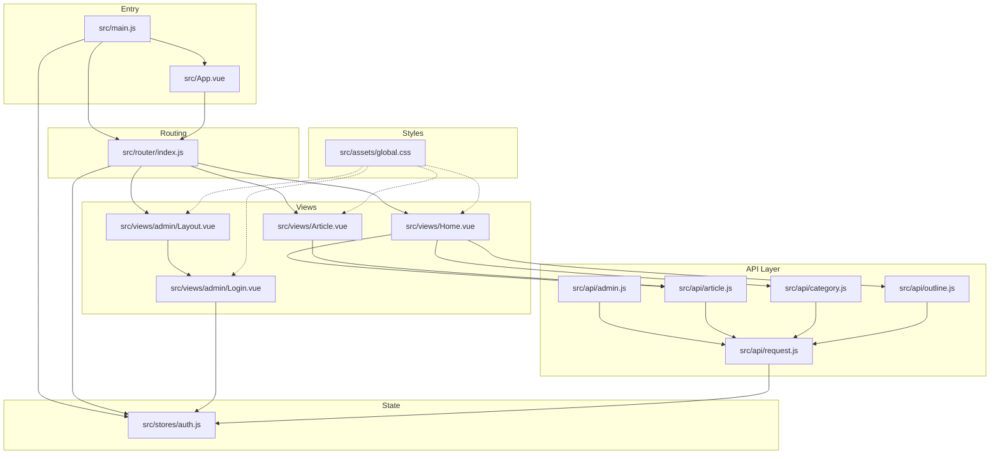
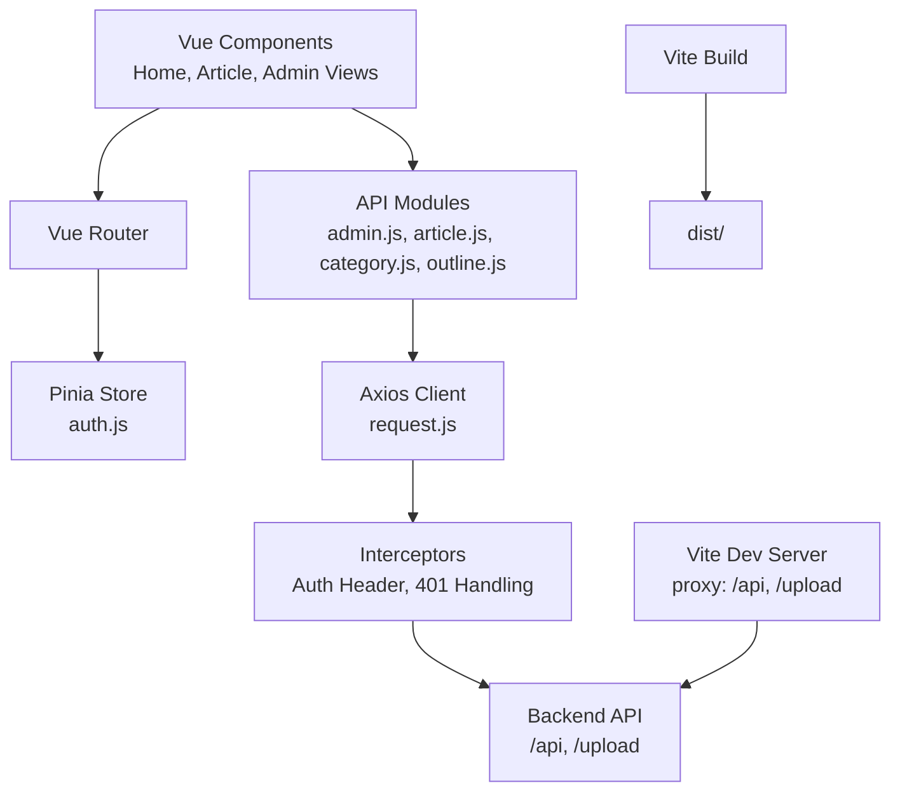
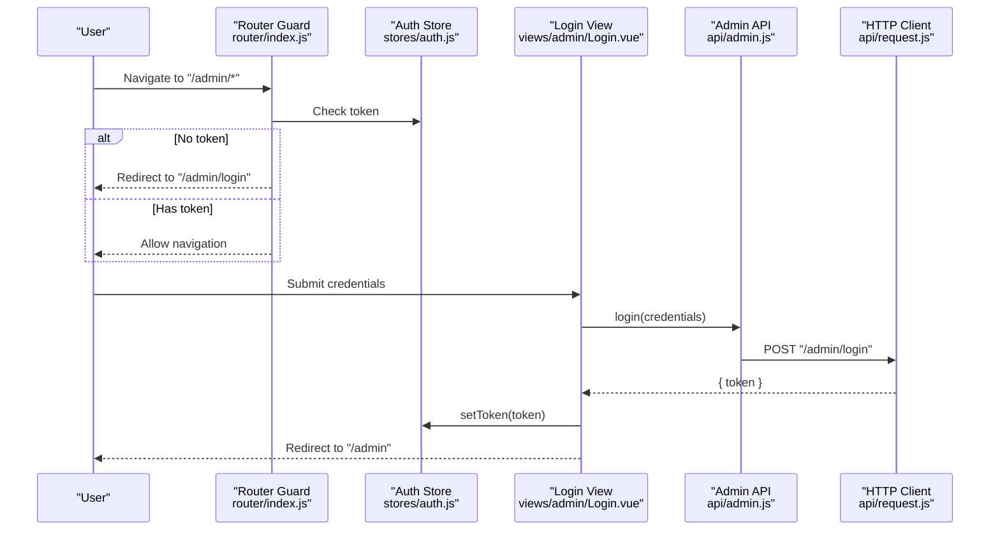
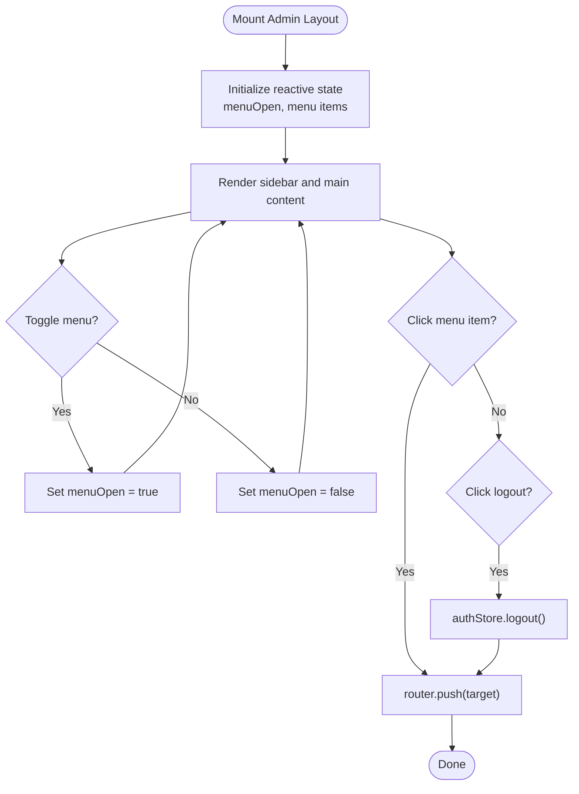
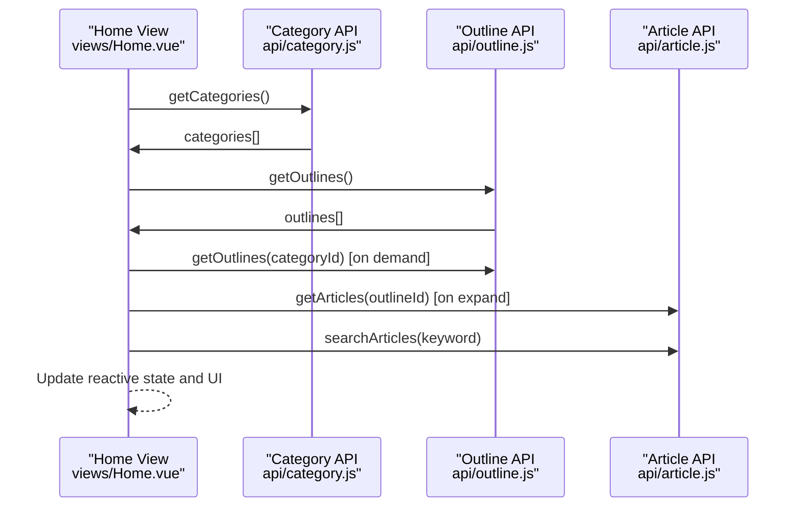
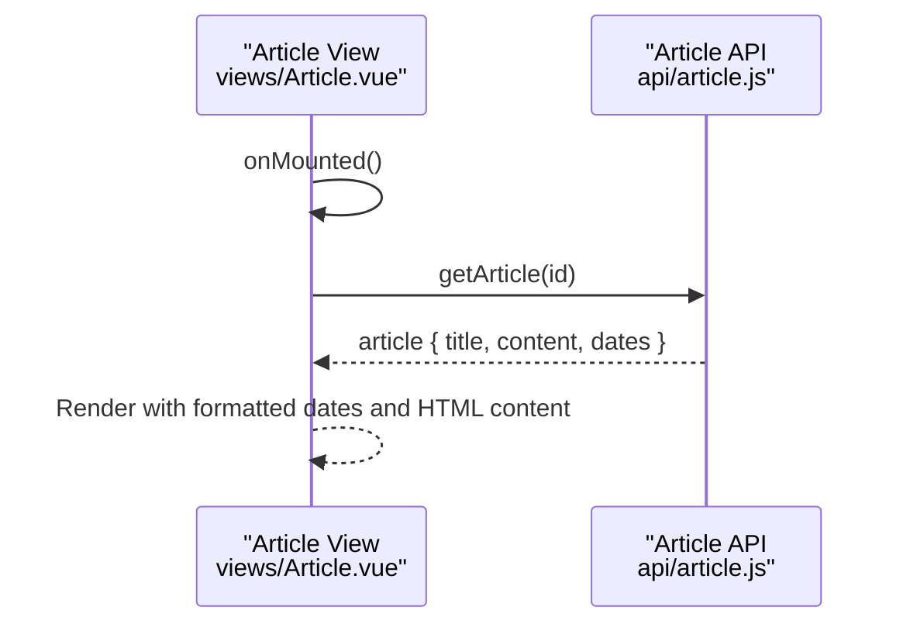
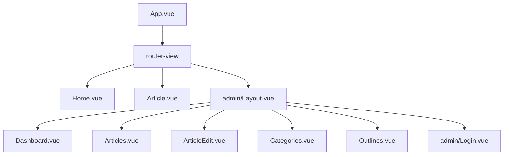
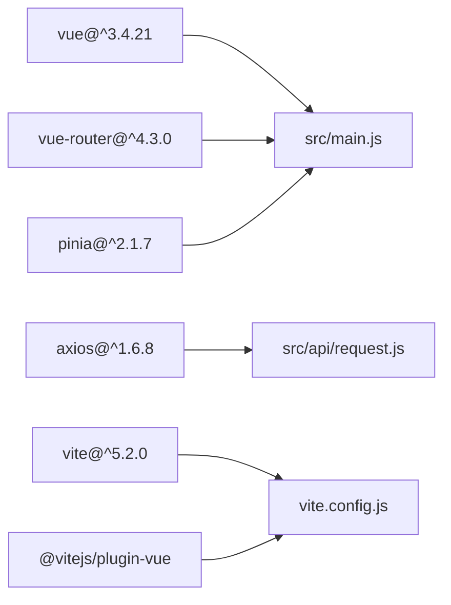

# Frontend Architecture

<cite>
**Referenced Files in This Document**
- [main.js](file://blog-frontend/src/main.js)
- [App.vue](file://blog-frontend/src/App.vue)
- [router/index.js](file://blog-frontend/src/router/index.js)
- [stores/auth.js](file://blog-frontend/src/stores/auth.js)
- [api/request.js](file://blog-frontend/src/api/request.js)
- [api/admin.js](file://blog-frontend/src/api/admin.js)
- [api/article.js](file://blog-frontend/src/api/article.js)
- [api/category.js](file://blog-frontend/src/api/category.js)
- [api/outline.js](file://blog-frontend/src/api/outline.js)
- [assets/global.css](file://blog-frontend/src/assets/global.css)
- [views/admin/Layout.vue](file://blog-frontend/src/views/admin/Layout.vue)
- [views/admin/Login.vue](file://blog-frontend/src/views/admin/Login.vue)
- [views/Home.vue](file://blog-frontend/src/views/Home.vue)
- [views/Article.vue](file://blog-frontend/src/views/Article.vue)
- [package.json](file://blog-frontend/package.json)
- [vite.config.js](file://blog-frontend/vite.config.js)
</cite>

## Table of Contents
1. [Introduction](#introduction)
2. [Project Structure](#project-structure)
3. [Core Components](#core-components)
4. [Architecture Overview](#architecture-overview)
5. [Detailed Component Analysis](#detailed-component-analysis)
6. [Dependency Analysis](#dependency-analysis)
7. [Performance Considerations](#performance-considerations)
8. [Troubleshooting Guide](#troubleshooting-guide)
9. [Conclusion](#conclusion)
10. [Appendices](#appendices)

## Introduction
This document describes the frontend architecture of the Vue.js application. It covers the component-based structure using Vue 3 Composition API, routing with Vue Router, state management via Pinia, and the build pipeline powered by Vite. It also documents the application entry point, root component, router configuration, store management, component hierarchy, API integration patterns, and responsive design implementation. Finally, it provides guidance on infrastructure requirements, build optimization, development workflow, cross-browser compatibility, performance optimization, and debugging techniques.

## Project Structure
The frontend follows a conventional Vue 3 project layout with feature-based organization:
- Entry point initializes the app, installs Pinia and Vue Router, and mounts to the DOM.
- Root component renders the active route via router-view.
- Router defines public and admin routes with nested children and navigation guards.
- Stores encapsulate authentication state persisted in localStorage.
- API modules centralize HTTP requests using Axios with interceptors for auth and error handling.
- Views implement the UI with scoped styles and responsive breakpoints.
- Global CSS provides shared design tokens and responsive utilities.

**Diagram sources**
- [main.js:1-9](file://blog-frontend/src/main.js#L1-L9)
- [App.vue:1-12](file://blog-frontend/src/App.vue#L1-L12)
- [router/index.js:1-74](file://blog-frontend/src/router/index.js#L1-L74)
- [stores/auth.js:1-19](file://blog-frontend/src/stores/auth.js#L1-L19)
- [api/request.js:1-33](file://blog-frontend/src/api/request.js#L1-L33)
- [api/admin.js:1-12](file://blog-frontend/src/api/admin.js#L1-L12)
- [api/article.js:1-14](file://blog-frontend/src/api/article.js#L1-L14)
- [api/category.js:1-10](file://blog-frontend/src/api/category.js#L1-L10)
- [api/outline.js:1-10](file://blog-frontend/src/api/outline.js#L1-L10)
- [views/Home.vue:1-263](file://blog-frontend/src/views/Home.vue#L1-L263)
- [views/Article.vue:1-144](file://blog-frontend/src/views/Article.vue#L1-L144)
- [views/admin/Layout.vue:1-164](file://blog-frontend/src/views/admin/Layout.vue#L1-L164)
- [views/admin/Login.vue:1-83](file://blog-frontend/src/views/admin/Login.vue#L1-L83)
- [assets/global.css:1-76](file://blog-frontend/src/assets/global.css#L1-L76)

**Section sources**
- [main.js:1-9](file://blog-frontend/src/main.js#L1-L9)
- [App.vue:1-12](file://blog-frontend/src/App.vue#L1-L12)
- [router/index.js:1-74](file://blog-frontend/src/router/index.js#L1-L74)
- [stores/auth.js:1-19](file://blog-frontend/src/stores/auth.js#L1-L19)
- [api/request.js:1-33](file://blog-frontend/src/api/request.js#L1-L33)
- [assets/global.css:1-76](file://blog-frontend/src/assets/global.css#L1-L76)

## Core Components
- Application bootstrap: Initializes Vue app, installs Pinia and Router, injects global styles, and mounts to the DOM.
- Root component: Minimal shell rendering router-view to render matched views.
- Router: Defines public routes (Home, Article) and admin routes (Login, nested Layout with Dashboard, Articles, Categories, Outlines). Implements a navigation guard requiring authentication for admin routes.
- Authentication store: Reactive token managed via Pinia Composable Store with localStorage persistence and logout cleanup.
- HTTP client: Axios instance configured with base URL and interceptors for injecting Authorization header and handling 401 responses by clearing token and redirecting to login.
- API modules: Thin wrappers around the HTTP client for admin, article, category, and outline operations.
- Views: Home page with search and hierarchical navigation; Article page for viewing content; Admin Layout with sidebar and topbar; Admin Login form with submission handling.

**Section sources**
- [main.js:1-9](file://blog-frontend/src/main.js#L1-L9)
- [App.vue:1-12](file://blog-frontend/src/App.vue#L1-L12)
- [router/index.js:1-74](file://blog-frontend/src/router/index.js#L1-L74)
- [stores/auth.js:1-19](file://blog-frontend/src/stores/auth.js#L1-L19)
- [api/request.js:1-33](file://blog-frontend/src/api/request.js#L1-L33)
- [api/admin.js:1-12](file://blog-frontend/src/api/admin.js#L1-L12)
- [api/article.js:1-14](file://blog-frontend/src/api/article.js#L1-L14)
- [api/category.js:1-10](file://blog-frontend/src/api/category.js#L1-L10)
- [api/outline.js:1-10](file://blog-frontend/src/api/outline.js#L1-L10)
- [views/Home.vue:1-263](file://blog-frontend/src/views/Home.vue#L1-L263)
- [views/Article.vue:1-144](file://blog-frontend/src/views/Article.vue#L1-L144)
- [views/admin/Layout.vue:1-164](file://blog-frontend/src/views/admin/Layout.vue#L1-L164)
- [views/admin/Login.vue:1-83](file://blog-frontend/src/views/admin/Login.vue#L1-L83)

## Architecture Overview
The application follows a layered architecture:
- Presentation layer: Vue components (views) using Composition API.
- Routing layer: Vue Router managing navigation and nested routes.
- State layer: Pinia stores for centralized reactive state.
- Data access layer: Axios-based HTTP client with interceptors.
- Infrastructure: Vite dev server with proxy and production build.

**Diagram sources**
- [router/index.js:1-74](file://blog-frontend/src/router/index.js#L1-L74)
- [stores/auth.js:1-19](file://blog-frontend/src/stores/auth.js#L1-L19)
- [api/request.js:1-33](file://blog-frontend/src/api/request.js#L1-L33)
- [api/admin.js:1-12](file://blog-frontend/src/api/admin.js#L1-L12)
- [api/article.js:1-14](file://blog-frontend/src/api/article.js#L1-L14)
- [api/category.js:1-10](file://blog-frontend/src/api/category.js#L1-L10)
- [api/outline.js:1-10](file://blog-frontend/src/api/outline.js#L1-L10)
- [vite.config.js:1-21](file://blog-frontend/vite.config.js#L1-L21)

## Detailed Component Analysis

### Authentication Flow
The authentication flow integrates the router guard, Pinia store, and HTTP interceptors to enforce protected routes and manage session state.

**Diagram sources**
- [router/index.js:64-71](file://blog-frontend/src/router/index.js#L64-L71)
- [stores/auth.js:4-18](file://blog-frontend/src/stores/auth.js#L4-L18)
- [views/admin/Login.vue:32-41](file://blog-frontend/src/views/admin/Login.vue#L32-L41)
- [api/admin.js:3](file://blog-frontend/src/api/admin.js#L3)
- [api/request.js:9-18](file://blog-frontend/src/api/request.js#L9-L18)

**Section sources**
- [router/index.js:64-71](file://blog-frontend/src/router/index.js#L64-L71)
- [stores/auth.js:4-18](file://blog-frontend/src/stores/auth.js#L4-L18)
- [views/admin/Login.vue:32-41](file://blog-frontend/src/views/admin/Login.vue#L32-L41)
- [api/admin.js:3](file://blog-frontend/src/api/admin.js#L3)
- [api/request.js:9-18](file://blog-frontend/src/api/request.js#L9-L18)

### Admin Layout and Navigation
The admin layout implements a responsive sidebar and topbar with programmatic menu items and logout handling.

**Diagram sources**
- [views/admin/Layout.vue:28-47](file://blog-frontend/src/views/admin/Layout.vue#L28-L47)

**Section sources**
- [views/admin/Layout.vue:1-164](file://blog-frontend/src/views/admin/Layout.vue#L1-L164)

### Home Page Data Flow
The home page fetches categories and outlines on mount, lazily loads articles per outline, supports search, and navigates to article pages.

**Diagram sources**
- [views/Home.vue:81-117](file://blog-frontend/src/views/Home.vue#L81-L117)
- [api/category.js:3](file://blog-frontend/src/api/category.js#L3)
- [api/outline.js:3](file://blog-frontend/src/api/outline.js#L3)
- [api/article.js:3](file://blog-frontend/src/api/article.js#L3)

**Section sources**
- [views/Home.vue:1-263](file://blog-frontend/src/views/Home.vue#L1-L263)
- [api/category.js:1-10](file://blog-frontend/src/api/category.js#L1-L10)
- [api/outline.js:1-10](file://blog-frontend/src/api/outline.js#L1-L10)
- [api/article.js:1-14](file://blog-frontend/src/api/article.js#L1-L14)

### Article Detail View
The article view fetches a single article by route param and displays formatted metadata and content.

**Diagram sources**
- [views/Article.vue:26-39](file://blog-frontend/src/views/Article.vue#L26-L39)
- [api/article.js:5](file://blog-frontend/src/api/article.js#L5)

**Section sources**
- [views/Article.vue:1-144](file://blog-frontend/src/views/Article.vue#L1-L144)
- [api/article.js:1-14](file://blog-frontend/src/api/article.js#L1-L14)

### Component Hierarchy
The component hierarchy centers around the root App.vue rendering router-view, with nested admin routes under a shared Layout component.

**Diagram sources**
- [App.vue:1-3](file://blog-frontend/src/App.vue#L1-L3)
- [router/index.js:4-56](file://blog-frontend/src/router/index.js#L4-L56)
- [views/admin/Layout.vue:1-25](file://blog-frontend/src/views/admin/Layout.vue#L1-L25)

**Section sources**
- [App.vue:1-12](file://blog-frontend/src/App.vue#L1-L12)
- [router/index.js:1-74](file://blog-frontend/src/router/index.js#L1-L74)
- [views/admin/Layout.vue:1-164](file://blog-frontend/src/views/admin/Layout.vue#L1-L164)

## Dependency Analysis
Key dependencies and their roles:
- Vue 3: Core framework for components and reactivity.
- Vue Router 4: Declarative routing with nested routes and guards.
- Pinia: Reactive state management with Composables.
- Axios: HTTP client with interceptors.
- Vite: Build tool and dev server with plugin support.

**Diagram sources**
- [package.json:11-22](file://blog-frontend/package.json#L11-L22)
- [main.js:1-9](file://blog-frontend/src/main.js#L1-L9)
- [api/request.js:1](file://blog-frontend/src/api/request.js#L1)
- [vite.config.js:1-21](file://blog-frontend/vite.config.js#L1-L21)

**Section sources**
- [package.json:1-24](file://blog-frontend/package.json#L1-L24)
- [main.js:1-9](file://blog-frontend/src/main.js#L1-L9)
- [api/request.js:1-33](file://blog-frontend/src/api/request.js#L1-L33)
- [vite.config.js:1-21](file://blog-frontend/vite.config.js#L1-L21)

## Performance Considerations
- Lazy loading routes: Dynamic imports are used for route components to split bundles.
- Conditional data fetching: Articles are fetched only when an outline expands, reducing initial payload.
- Interceptors: Centralized auth header injection and automatic 401 handling prevent unnecessary retries.
- Build optimization: Vite provides fast dev builds and optimized production bundles; consider enabling tree-shaking and code splitting as needed.
- CSS: Scoped styles and global design tokens minimize style overhead; media queries keep rendering efficient.

[No sources needed since this section provides general guidance]

## Troubleshooting Guide
Common issues and resolutions:
- Authentication redirects: If redirected to login after refresh, verify token presence in localStorage and interceptor logic.
- API errors: 401 responses trigger logout and redirect; check backend auth endpoint and CORS/proxy settings.
- Proxy configuration: Ensure Vite proxy targets match backend host/port and changeOrigin is enabled.
- Dev server port conflicts: Adjust server.port in Vite config if 5173 is in use.
- Hot module replacement: Verify @vitejs/plugin-vue is installed and configured.

**Section sources**
- [api/request.js:20-30](file://blog-frontend/src/api/request.js#L20-L30)
- [vite.config.js:6-19](file://blog-frontend/vite.config.js#L6-L19)

## Conclusion
The frontend employs a clean, modular architecture leveraging Vue 3 Composition API, Vue Router for navigation, Pinia for state, and Vite for building. The design emphasizes separation of concerns, lazy loading, and responsive UI. The API layer centralizes HTTP concerns with robust interceptors. Following the outlined practices ensures maintainability, performance, and a smooth developer experience.

[No sources needed since this section summarizes without analyzing specific files]

## Appendices

### Build and Development Workflow
- Development: Run the dev script to start Vite dev server with hot reload.
- Production build: Build command generates optimized static assets.
- Preview: Preview command serves built assets locally for testing.

**Section sources**
- [package.json:6-10](file://blog-frontend/package.json#L6-L10)
- [vite.config.js:1-21](file://blog-frontend/vite.config.js#L1-L21)

### Cross-Browser Compatibility
- Use modern JavaScript features supported by Vue 3 and Pinia.
- Ensure polyfills if targeting older browsers; otherwise rely on native browser support for latest APIs.
- Test responsive breakpoints and CSS features across devices.

[No sources needed since this section provides general guidance]

### Responsive Design Implementation
- Global design tokens and utility classes promote consistent styling.
- Media queries adjust spacing, typography, and layout for mobile screens.
- Admin layout adapts sidebar and topbar for smaller viewports.

**Section sources**
- [assets/global.css:14-76](file://blog-frontend/src/assets/global.css#L14-L76)
- [views/admin/Layout.vue:142-162](file://blog-frontend/src/views/admin/Layout.vue#L142-L162)
- [views/Home.vue:253-261](file://blog-frontend/src/views/Home.vue#L253-L261)
- [views/Article.vue:130-142](file://blog-frontend/src/views/Article.vue#L130-L142)