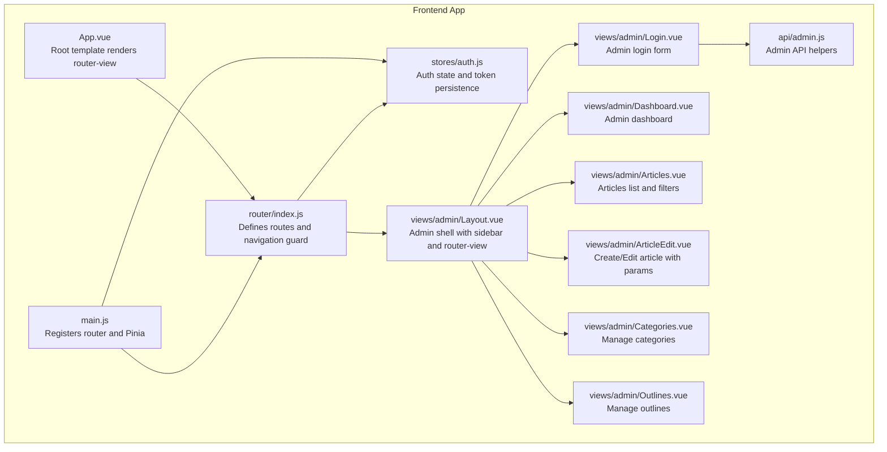
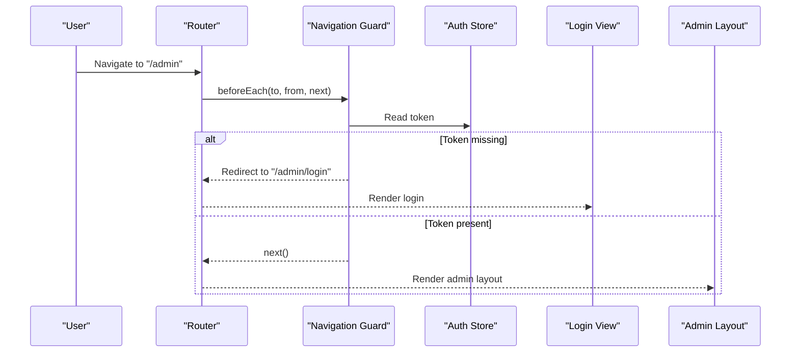
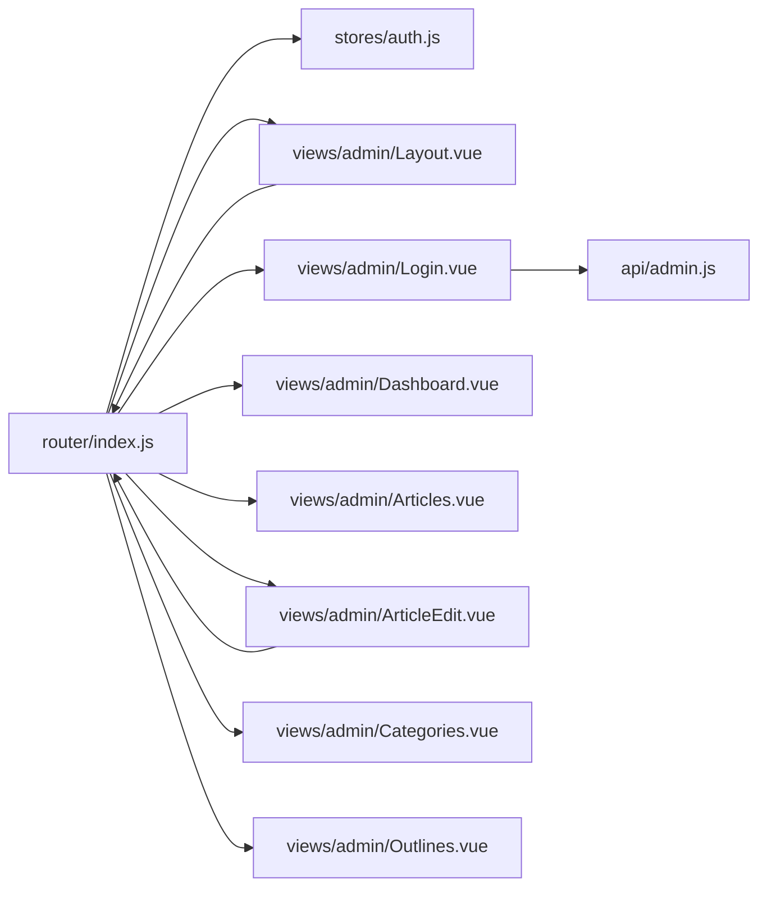

# Routing Configuration

<cite>
**Referenced Files in This Document**
- [index.js](file://blog-frontend/src/router/index.js)
- [main.js](file://blog-frontend/src/main.js)
- [auth.js](file://blog-frontend/src/stores/auth.js)
- [Layout.vue](file://blog-frontend/src/views/admin/Layout.vue)
- [Login.vue](file://blog-frontend/src/views/admin/Login.vue)
- [Dashboard.vue](file://blog-frontend/src/views/admin/Dashboard.vue)
- [Articles.vue](file://blog-frontend/src/views/admin/Articles.vue)
- [ArticleEdit.vue](file://blog-frontend/src/views/admin/ArticleEdit.vue)
- [Categories.vue](file://blog-frontend/src/views/admin/Categories.vue)
- [Outlines.vue](file://blog-frontend/src/views/admin/Outlines.vue)
- [App.vue](file://blog-frontend/src/App.vue)
- [admin.js](file://blog-frontend/src/api/admin.js)
- [package.json](file://blog-frontend/package.json)
- [vite.config.js](file://blog-frontend/vite.config.js)
</cite>

## Table of Contents
1. [Introduction](#introduction)
2. [Project Structure](#project-structure)
3. [Core Components](#core-components)
4. [Architecture Overview](#architecture-overview)
5. [Detailed Component Analysis](#detailed-component-analysis)
6. [Dependency Analysis](#dependency-analysis)
7. [Performance Considerations](#performance-considerations)
8. [Troubleshooting Guide](#troubleshooting-guide)
9. [Conclusion](#conclusion)

## Introduction
This document explains the Vue Router configuration and navigation setup for the blog administration interface. It covers router instance creation, route definitions for public and admin panels, navigation guards for authentication, route parameters handling, programmatic navigation, route meta properties, dynamic route generation, route-based code splitting and lazy loading, scroll restoration, and SEO considerations. It also documents integration with authentication state, protected route handling, and error page management.

## Project Structure
The routing system is centered around a single router configuration file that defines public routes and an admin layout with nested routes. Authentication state is managed via a Pinia store persisted in local storage. The admin layout composes child views and handles logout and navigation.

**Diagram sources**
- [App.vue:1-12](file://blog-frontend/src/App.vue#L1-L12)
- [main.js:1-9](file://blog-frontend/src/main.js#L1-L9)
- [index.js:1-74](file://blog-frontend/src/router/index.js#L1-L74)
- [auth.js:1-19](file://blog-frontend/src/stores/auth.js#L1-L19)
- [Layout.vue:1-164](file://blog-frontend/src/views/admin/Layout.vue#L1-L164)
- [Login.vue:1-83](file://blog-frontend/src/views/admin/Login.vue#L1-L83)
- [Dashboard.vue:1-73](file://blog-frontend/src/views/admin/Dashboard.vue#L1-L73)
- [Articles.vue:1-138](file://blog-frontend/src/views/admin/Articles.vue#L1-L138)
- [ArticleEdit.vue:1-111](file://blog-frontend/src/views/admin/ArticleEdit.vue#L1-L111)
- [Categories.vue:1-154](file://blog-frontend/src/views/admin/Categories.vue#L1-L154)
- [Outlines.vue:1-172](file://blog-frontend/src/views/admin/Outlines.vue#L1-L172)
- [admin.js:1-12](file://blog-frontend/src/api/admin.js#L1-L12)

**Section sources**
- [index.js:1-74](file://blog-frontend/src/router/index.js#L1-L74)
- [main.js:1-9](file://blog-frontend/src/main.js#L1-L9)
- [auth.js:1-19](file://blog-frontend/src/stores/auth.js#L1-L19)
- [App.vue:1-12](file://blog-frontend/src/App.vue#L1-L12)

## Core Components
- Router instance and routes: Defines public routes and admin layout with nested routes. Uses history mode and lazy-loaded components.
- Navigation guard: Protects admin routes using a meta flag and checks token presence in the auth store.
- Authentication store: Manages token state and persists it in local storage for session continuity.
- Admin layout: Provides sidebar navigation, responsive behavior, and logout flow that redirects to login.
- Programmatic navigation: Used in login, logout, and article edit flows to navigate after actions.

Key implementation references:
- Router creation and routes: [index.js:59-62](file://blog-frontend/src/router/index.js#L59-L62)
- Navigation guard: [index.js:64-71](file://blog-frontend/src/router/index.js#L64-L71)
- Auth store token and persistence: [auth.js:4-15](file://blog-frontend/src/stores/auth.js#L4-L15)
- Admin layout logout and navigation: [Layout.vue:44-47](file://blog-frontend/src/views/admin/Layout.vue#L44-L47)
- Login form submission and navigation: [Login.vue:32-41](file://blog-frontend/src/views/admin/Login.vue#L32-L41)
- Article edit save and navigation: [ArticleEdit.vue:73-80](file://blog-frontend/src/views/admin/ArticleEdit.vue#L73-L80)

**Section sources**
- [index.js:1-74](file://blog-frontend/src/router/index.js#L1-L74)
- [auth.js:1-19](file://blog-frontend/src/stores/auth.js#L1-L19)
- [Layout.vue:1-164](file://blog-frontend/src/views/admin/Layout.vue#L1-L164)
- [Login.vue:1-83](file://blog-frontend/src/views/admin/Login.vue#L1-L83)
- [ArticleEdit.vue:1-111](file://blog-frontend/src/views/admin/ArticleEdit.vue#L1-L111)

## Architecture Overview
The routing architecture separates public pages from the admin panel. The admin panel is a nested route under a shared layout. Navigation guards enforce authentication for admin routes. Lazy loading is achieved via dynamic imports in route definitions.

**Diagram sources**
- [index.js:64-71](file://blog-frontend/src/router/index.js#L64-L71)
- [auth.js:4-15](file://blog-frontend/src/stores/auth.js#L4-L15)
- [Login.vue:1-83](file://blog-frontend/src/views/admin/Login.vue#L1-L83)
- [Layout.vue:1-164](file://blog-frontend/src/views/admin/Layout.vue#L1-L164)

## Detailed Component Analysis

### Router Instance and Route Definitions
- Router creation: Uses history mode with a base history implementation.
- Public routes:
  - Root path renders the home page with lazy loading.
  - Article detail route with a numeric parameter for article ID.
- Admin routes:
  - Admin login route with lazy loading.
  - Admin layout with meta flag indicating authentication requirement.
  - Nested routes: dashboard, articles, categories, outlines, and article edit with optional ID parameter.

Route parameters handling:
- Article detail uses a required numeric parameter.
- Article edit uses an optional parameter for editing existing items.

Route-based code splitting and lazy loading:
- All route components are loaded lazily via dynamic imports, enabling chunk splitting by route.

Protected route handling:
- The admin layout sets a meta flag to require authentication.
- The navigation guard checks the meta flag and token presence to decide navigation.

Programmatic navigation:
- Login view navigates to admin after successful authentication.
- Logout in admin layout navigates to login.
- Article edit navigates back to articles after save.

SEO considerations:
- No explicit meta tags or head configuration is present in the router. Consider adding meta fields in route records for SEO if needed.

**Section sources**
- [index.js:4-57](file://blog-frontend/src/router/index.js#L4-L57)
- [index.js:59-62](file://blog-frontend/src/router/index.js#L59-L62)
- [index.js:64-71](file://blog-frontend/src/router/index.js#L64-L71)

### Navigation Guards Implementation
- Guard checks if the destination route requires authentication and if the token is present.
- If authentication is required and token is missing, redirects to the admin login route.
- Otherwise, proceeds to the destination route.

Integration with authentication state:
- Reads token from the auth store, which is initialized from local storage.

Potential improvements:
- Add a fallback to a general error page if redirection fails.
- Consider redirecting back to the intended route after successful login.

**Section sources**
- [index.js:64-71](file://blog-frontend/src/router/index.js#L64-L71)
- [auth.js:4-15](file://blog-frontend/src/stores/auth.js#L4-L15)

### Authentication Store and Token Persistence
- Token is stored in a Pinia store and synchronized with local storage.
- Provides methods to set token and to clear it during logout.
- Used by the navigation guard to determine access to admin routes.

**Section sources**
- [auth.js:1-19](file://blog-frontend/src/stores/auth.js#L1-L19)

### Admin Layout and Navigation
- Provides a responsive sidebar with links to admin sections.
- Uses router-link for declarative navigation.
- Implements logout by clearing token and navigating to login.

**Section sources**
- [Layout.vue:1-164](file://blog-frontend/src/views/admin/Layout.vue#L1-L164)

### Login Flow and Programmatic Navigation
- Collects credentials, submits to backend, and on success sets token in the store.
- Navigates to the admin root after successful login.

**Section sources**
- [Login.vue:1-83](file://blog-frontend/src/views/admin/Login.vue#L1-L83)
- [admin.js:1-12](file://blog-frontend/src/api/admin.js#L1-L12)

### Dynamic Route Generation and Parameter Handling
- Article edit route supports creating new items (no ID) and editing existing items (with ID).
- Uses route parameters to fetch and update article data.

**Section sources**
- [ArticleEdit.vue:1-111](file://blog-frontend/src/views/admin/ArticleEdit.vue#L1-L111)

### Programmatic Navigation Patterns
- Login view navigates to admin after successful authentication.
- Admin layout logout navigates to login.
- Article edit saves and navigates back to articles list.

**Section sources**
- [Login.vue:32-41](file://blog-frontend/src/views/admin/Login.vue#L32-L41)
- [Layout.vue:44-47](file://blog-frontend/src/views/admin/Layout.vue#L44-L47)
- [ArticleEdit.vue:73-80](file://blog-frontend/src/views/admin/ArticleEdit.vue#L73-L80)

### Route-Based Code Splitting and Lazy Loading
- All route components are loaded lazily via dynamic imports, enabling automatic code splitting by route.
- Build tool configuration supports Vue Single File Components and proxies API requests.

**Section sources**
- [index.js:8, 13, 18, 23, 33, 38, 43, 48, 53:8-54](file://blog-frontend/src/router/index.js#L8-L54)
- [package.json:1-24](file://blog-frontend/package.json#L1-L24)
- [vite.config.js:1-21](file://blog-frontend/vite.config.js#L1-L21)

### Scroll Restoration and Transitions
- No explicit scroll behavior or transition configuration is defined in the router.
- Consider adding scroll behavior configuration if needed for SPA navigation.

**Section sources**
- [index.js:59-62](file://blog-frontend/src/router/index.js#L59-L62)

### Error Page Management
- No dedicated error page route is defined in the router.
- Consider adding a catch-all route for 404 scenarios and integrating with global error handling.

**Section sources**
- [index.js:4-57](file://blog-frontend/src/router/index.js#L4-L57)

## Dependency Analysis
The routing system depends on Vue Router, Pinia for state management, and Vue’s composition APIs. The admin layout depends on the auth store and router APIs for navigation. The login view integrates with the admin API module.

**Diagram sources**
- [index.js:1-74](file://blog-frontend/src/router/index.js#L1-L74)
- [auth.js:1-19](file://blog-frontend/src/stores/auth.js#L1-L19)
- [Layout.vue:1-164](file://blog-frontend/src/views/admin/Layout.vue#L1-L164)
- [Login.vue:1-83](file://blog-frontend/src/views/admin/Login.vue#L1-L83)
- [Articles.vue:1-138](file://blog-frontend/src/views/admin/Articles.vue#L1-L138)
- [ArticleEdit.vue:1-111](file://blog-frontend/src/views/admin/ArticleEdit.vue#L1-L111)
- [Categories.vue:1-154](file://blog-frontend/src/views/admin/Categories.vue#L1-L154)
- [Outlines.vue:1-172](file://blog-frontend/src/views/admin/Outlines.vue#L1-L172)
- [admin.js:1-12](file://blog-frontend/src/api/admin.js#L1-L12)

**Section sources**
- [index.js:1-74](file://blog-frontend/src/router/index.js#L1-L74)
- [auth.js:1-19](file://blog-frontend/src/stores/auth.js#L1-L19)
- [admin.js:1-12](file://blog-frontend/src/api/admin.js#L1-L12)

## Performance Considerations
- Route-based lazy loading is already implemented via dynamic imports, which enables automatic code splitting and reduces initial bundle size.
- Consider adding route-level caching or preloading for frequently visited admin pages if needed.
- Keep route definitions minimal and grouped under a single router configuration to reduce complexity.

[No sources needed since this section provides general guidance]

## Troubleshooting Guide
Common issues and resolutions:
- Accessing admin routes without a token: The navigation guard redirects to login. Ensure the auth store token is set after login.
- Login failures: Verify the login API endpoint and error handling in the login view.
- Article edit parameter handling: Confirm that the route parameter is correctly passed and used to fetch article data.
- Logout not redirecting: Ensure the auth store logout clears the token and that the navigation guard triggers the redirect.

**Section sources**
- [index.js:64-71](file://blog-frontend/src/router/index.js#L64-L71)
- [auth.js:12-15](file://blog-frontend/src/stores/auth.js#L12-L15)
- [Login.vue:32-41](file://blog-frontend/src/views/admin/Login.vue#L32-L41)
- [ArticleEdit.vue:42-71](file://blog-frontend/src/views/admin/ArticleEdit.vue#L42-L71)
- [Layout.vue:44-47](file://blog-frontend/src/views/admin/Layout.vue#L44-L47)

## Conclusion
The routing configuration establishes a clean separation between public and admin routes, enforces authentication via a navigation guard, and leverages lazy loading for optimal performance. The admin layout provides a cohesive navigation experience, while programmatic navigation ensures smooth user flows. Enhancements such as scroll behavior configuration, SEO metadata, and a dedicated error page would further improve the user experience.