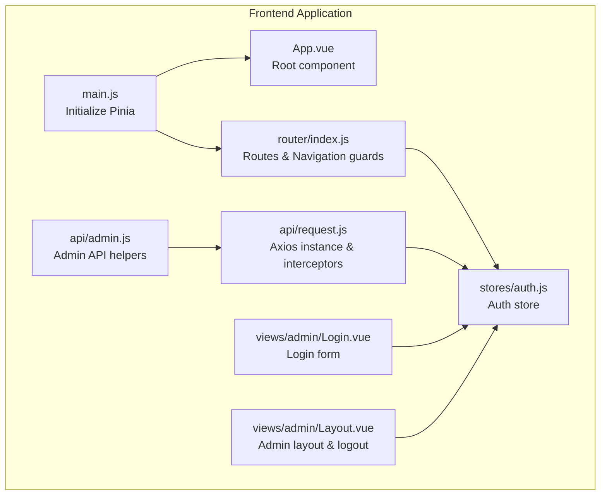
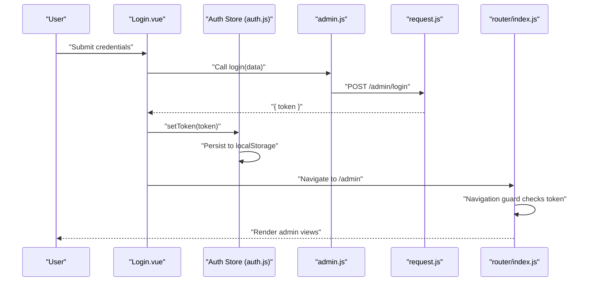
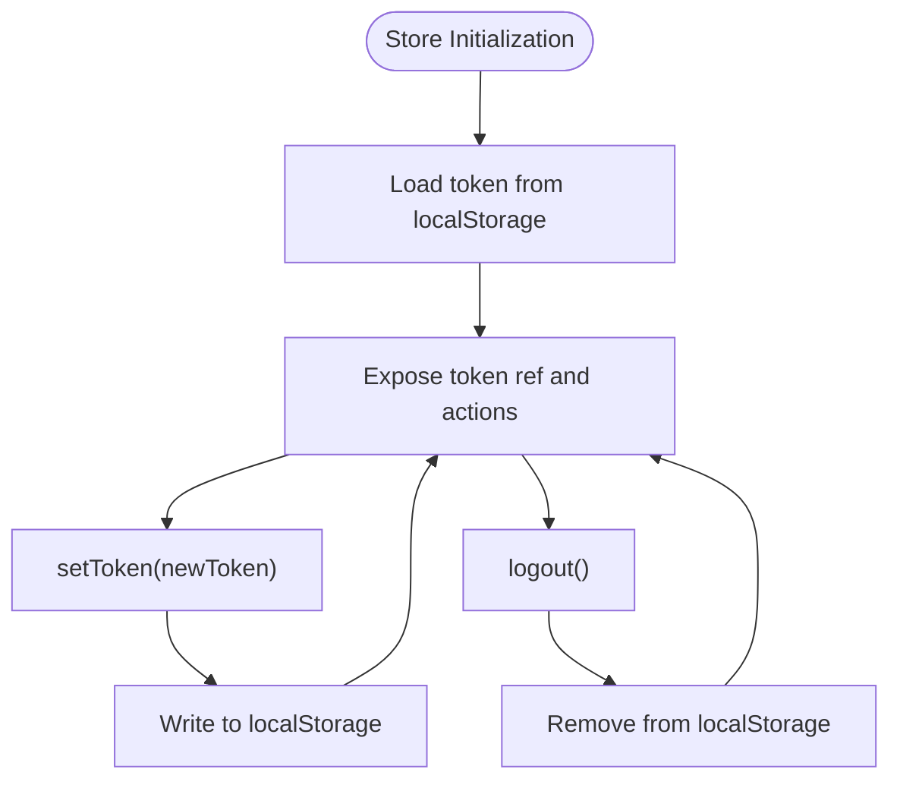
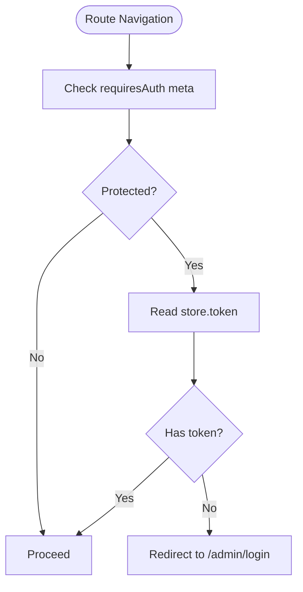
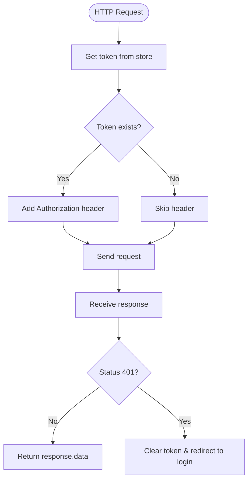
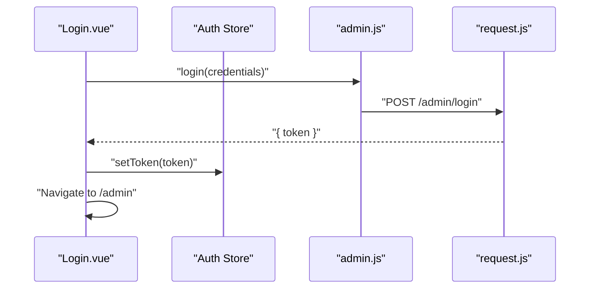
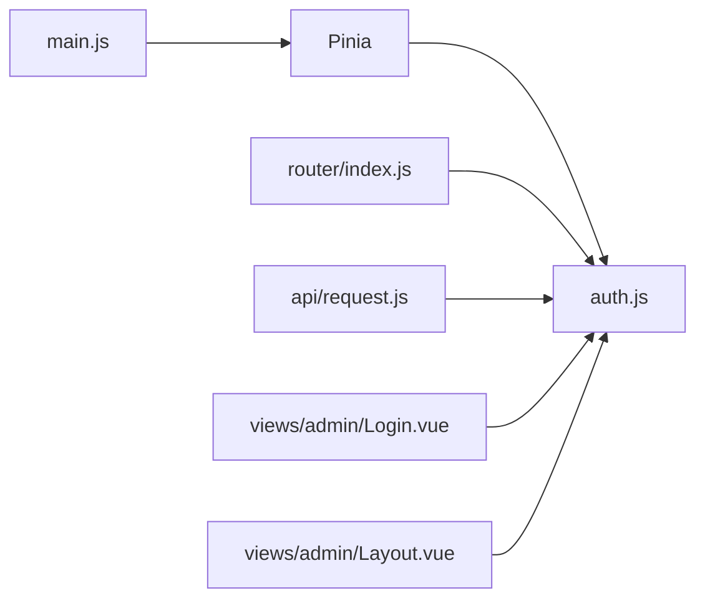

# State Management with Pinia

<cite>
**Referenced Files in This Document**
- [auth.js](file://blog-frontend/src/stores/auth.js)
- [main.js](file://blog-frontend/src/main.js)
- [index.js](file://blog-frontend/src/router/index.js)
- [request.js](file://blog-frontend/src/api/request.js)
- [admin.js](file://blog-frontend/src/api/admin.js)
- [Login.vue](file://blog-frontend/src/views/admin/Login.vue)
- [Layout.vue](file://blog-frontend/src/views/admin/Layout.vue)
- [package.json](file://blog-frontend/package.json)
</cite>

## Table of Contents
1. [Introduction](#introduction)
2. [Project Structure](#project-structure)
3. [Core Components](#core-components)
4. [Architecture Overview](#architecture-overview)
5. [Detailed Component Analysis](#detailed-component-analysis)
6. [Dependency Analysis](#dependency-analysis)
7. [Performance Considerations](#performance-considerations)
8. [Troubleshooting Guide](#troubleshooting-guide)
9. [Conclusion](#conclusion)

## Introduction
This document explains the Pinia-based state management implementation for the blog administration interface. It focuses on the authentication store, reactive state updates, persistence strategies, and integration with Vue components and routing. It also covers best practices for organizing stores, composing actions, normalizing state, testing, debugging, and performance considerations.

## Project Structure
The frontend uses Vue 3 with Pinia for state management and vue-router for navigation. The authentication state is centralized in a single composable-style store that persists the token to localStorage. Axios interceptors attach the token to outgoing requests and handle 401 responses by logging out the user.

**Diagram sources**
- [main.js:1-9](file://blog-frontend/src/main.js#L1-L9)
- [index.js:1-74](file://blog-frontend/src/router/index.js#L1-L74)
- [auth.js:1-19](file://blog-frontend/src/stores/auth.js#L1-L19)
- [request.js:1-33](file://blog-frontend/src/api/request.js#L1-L33)
- [admin.js:1-12](file://blog-frontend/src/api/admin.js#L1-L12)
- [Login.vue:1-83](file://blog-frontend/src/views/admin/Login.vue#L1-L83)
- [Layout.vue:1-164](file://blog-frontend/src/views/admin/Layout.vue#L1-L164)

**Section sources**
- [main.js:1-9](file://blog-frontend/src/main.js#L1-L9)
- [package.json:1-24](file://blog-frontend/package.json#L1-L24)

## Core Components
- Authentication Store (auth.js): Provides reactive token state and actions to update and clear the token, persisting to localStorage.
- Router: Defines protected routes and enforces authentication via a navigation guard that checks the store's token.
- API Layer: Centralized Axios instance with request/response interceptors that attach the Authorization header and handle 401 errors by clearing the token and redirecting to the login page.
- Views: Login.vue sets the token upon successful authentication; Layout.vue triggers logout and navigates to the login route.

Key integration points:
- The store is imported and used in router guards and API interceptors to enforce auth and propagate tokens.
- Components consume the store via the Composition API to drive UI behavior.

**Section sources**
- [auth.js:1-19](file://blog-frontend/src/stores/auth.js#L1-L19)
- [index.js:64-71](file://blog-frontend/src/router/index.js#L64-L71)
- [request.js:9-30](file://blog-frontend/src/api/request.js#L9-L30)
- [Login.vue:22-41](file://blog-frontend/src/views/admin/Login.vue#L22-L41)
- [Layout.vue:28-47](file://blog-frontend/src/views/admin/Layout.vue#L28-L47)

## Architecture Overview
The authentication lifecycle spans component interaction, store mutation, and API communication. The following sequence illustrates login flow and token propagation.

**Diagram sources**
- [Login.vue:32-41](file://blog-frontend/src/views/admin/Login.vue#L32-L41)
- [admin.js:3](file://blog-frontend/src/api/admin.js#L3)
- [request.js:1-33](file://blog-frontend/src/api/request.js#L1-L33)
- [auth.js:7-10](file://blog-frontend/src/stores/auth.js#L7-L10)
- [index.js:64-71](file://blog-frontend/src/router/index.js#L64-L71)

## Detailed Component Analysis

### Authentication Store (auth.js)
- Purpose: Centralize authentication state and provide actions to manage the token.
- State: Reactive token value initialized from localStorage.
- Actions:
  - setToken(newToken): Updates reactive token and persists to localStorage.
  - logout(): Clears token and removes it from localStorage.
- Composition pattern: Uses the Composables API style with defineStore, returning refs and functions directly.

**Diagram sources**
- [auth.js:4-18](file://blog-frontend/src/stores/auth.js#L4-L18)

**Section sources**
- [auth.js:1-19](file://blog-frontend/src/stores/auth.js#L1-L19)

### Router Integration and Navigation Guards
- Protected routes: The admin layout route is marked as requiring authentication.
- Guard logic: Before navigating to protected routes, the guard reads the store’s token and redirects unauthenticated users to the login page.
- Store usage: The guard imports and uses the auth store during navigation.

**Diagram sources**
- [index.js:24](file://blog-frontend/src/router/index.js#L24)
- [index.js:64-71](file://blog-frontend/src/router/index.js#L64-L71)

**Section sources**
- [index.js:1-74](file://blog-frontend/src/router/index.js#L1-L74)

### API Interceptors and Token Propagation
- Request interceptor: Attaches Authorization: Bearer <token> when present.
- Response interceptor: On 401 Unauthorized, clears the token and redirects to the login page.
- Centralization: The auth store is accessed inside interceptors to keep token state consistent across the app.

**Diagram sources**
- [request.js:9-30](file://blog-frontend/src/api/request.js#L9-L30)
- [auth.js:7-15](file://blog-frontend/src/stores/auth.js#L7-L15)

**Section sources**
- [request.js:1-33](file://blog-frontend/src/api/request.js#L1-L33)

### Component Integration Examples
- Login.vue: Imports the auth store, calls setToken after a successful login API call, and navigates to the admin area.
- Layout.vue: Imports the auth store and invokes logout, then navigates back to the login route.

**Diagram sources**
- [Login.vue:22-41](file://blog-frontend/src/views/admin/Login.vue#L22-L41)
- [admin.js:3](file://blog-frontend/src/api/admin.js#L3)
- [request.js:1-33](file://blog-frontend/src/api/request.js#L1-L33)
- [auth.js:7-10](file://blog-frontend/src/stores/auth.js#L7-L10)

**Section sources**
- [Login.vue:1-83](file://blog-frontend/src/views/admin/Login.vue#L1-L83)
- [Layout.vue:1-164](file://blog-frontend/src/views/admin/Layout.vue#L1-L164)

## Dependency Analysis
- Pinia initialization: The app installs Pinia globally so stores can be used anywhere.
- Store-to-router coupling: Navigation guards depend on the auth store to enforce access control.
- Store-to-API coupling: The auth store is accessed by interceptors to attach headers and react to 401 responses.
- Component-to-store coupling: Login and Layout components depend on the auth store for user session management.

**Diagram sources**
- [main.js:1-9](file://blog-frontend/src/main.js#L1-L9)
- [auth.js:1-19](file://blog-frontend/src/stores/auth.js#L1-L19)
- [index.js:1-74](file://blog-frontend/src/router/index.js#L1-L74)
- [request.js:1-33](file://blog-frontend/src/api/request.js#L1-L33)
- [Login.vue:1-83](file://blog-frontend/src/views/admin/Login.vue#L1-L83)
- [Layout.vue:1-164](file://blog-frontend/src/views/admin/Layout.vue#L1-L164)

**Section sources**
- [package.json:11-17](file://blog-frontend/package.json#L11-L17)

## Performance Considerations
- Minimize unnecessary re-renders: Keep the token as a shallow reactive ref; avoid wrapping it in complex nested structures.
- Avoid synchronous heavy work in interceptors: Keep interceptors lightweight to prevent blocking network requests.
- Debounce or batch UI updates: If extending the store with additional state, prefer derived getters for computed values.
- Persist efficiently: Using localStorage for the token is appropriate for this scope; avoid frequent writes by batching updates.
- Lazy loading: Continue using dynamic imports for route components to reduce initial bundle size.

## Troubleshooting Guide
Common issues and resolutions:
- Stale token in memory: Ensure logout clears both the store and localStorage. Verify the response interceptor handles 401 consistently.
- Missing Authorization header: Confirm the request interceptor reads the current token from the store and attaches the header before sending.
- Infinite redirect loops: Check the navigation guard logic and ensure the login route does not require authentication.
- Debugging state: Use browser devtools to inspect the Pinia store state and confirm token updates after login or logout.

Relevant implementation references:
- Token persistence and clearing: [auth.js:7-15](file://blog-frontend/src/stores/auth.js#L7-L15)
- Navigation guard: [index.js:64-71](file://blog-frontend/src/router/index.js#L64-L71)
- Request interceptor header: [request.js:11-14](file://blog-frontend/src/api/request.js#L11-L14)
- Response interceptor 401 handling: [request.js:20-29](file://blog-frontend/src/api/request.js#L20-L29)

**Section sources**
- [auth.js:7-15](file://blog-frontend/src/stores/auth.js#L7-L15)
- [index.js:64-71](file://blog-frontend/src/router/index.js#L64-L71)
- [request.js:9-30](file://blog-frontend/src/api/request.js#L9-L30)

## Conclusion
The application employs a clean, composable Pinia store for authentication, integrated tightly with the router and API layer. The design ensures reactive state updates, predictable persistence, and secure token handling through interceptors. Extending this pattern—by adding normalized state, derived getters, and modular store composition—will further improve maintainability and scalability.