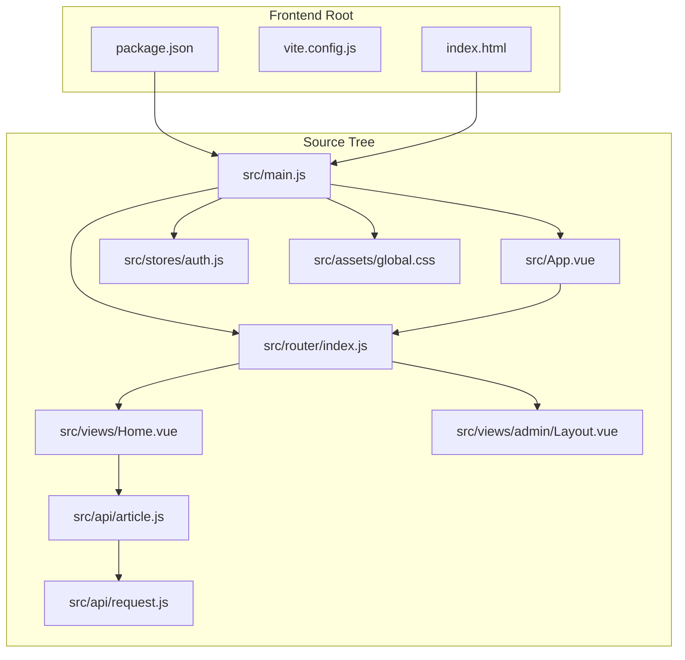
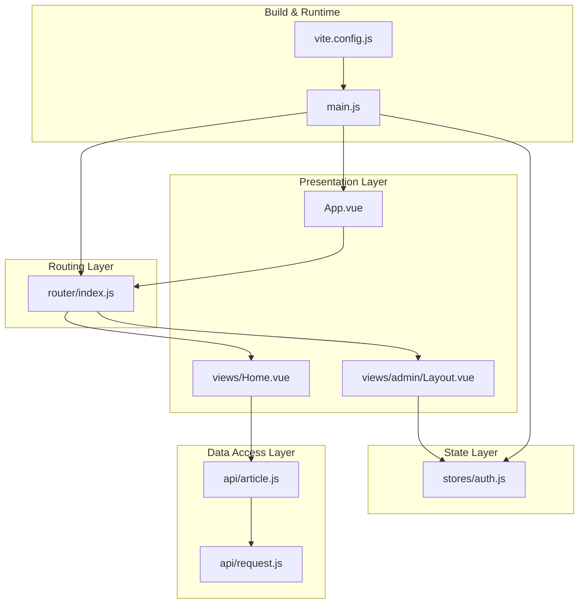
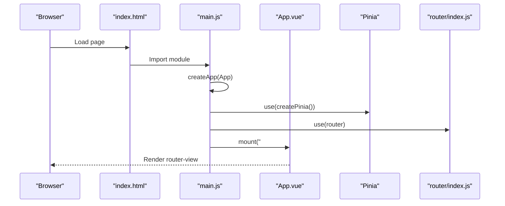
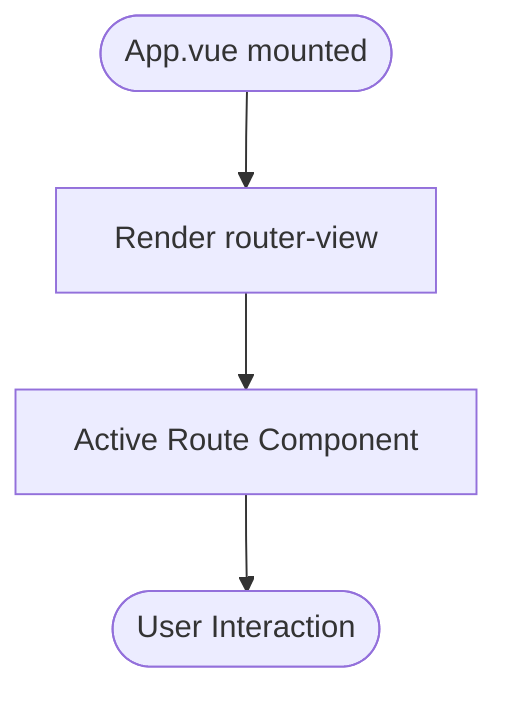
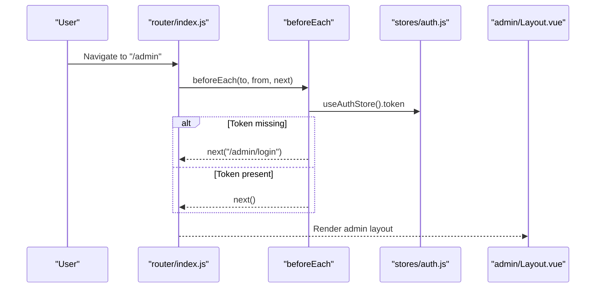
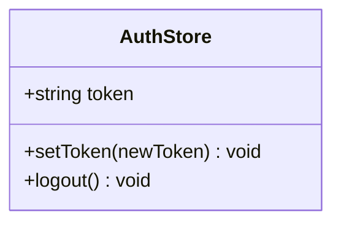
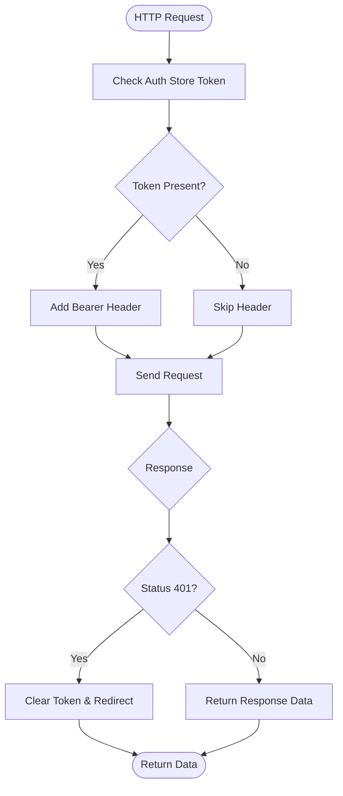
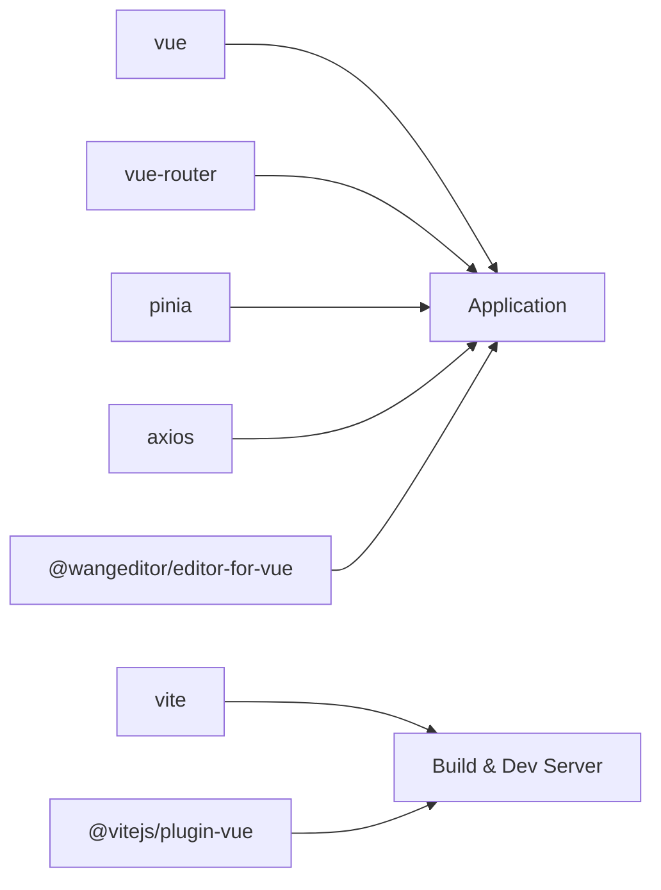

# Vue.js Application Structure

<cite>
**Referenced Files in This Document**
- [package.json](file://blog-frontend/package.json)
- [vite.config.js](file://blog-frontend/vite.config.js)
- [index.html](file://blog-frontend/index.html)
- [main.js](file://blog-frontend/src/main.js)
- [App.vue](file://blog-frontend/src/App.vue)
- [router/index.js](file://blog-frontend/src/router/index.js)
- [stores/auth.js](file://blog-frontend/src/stores/auth.js)
- [assets/global.css](file://blog-frontend/src/assets/global.css)
- [views/Home.vue](file://blog-frontend/src/views/Home.vue)
- [views/admin/Layout.vue](file://blog-frontend/src/views/admin/Layout.vue)
- [api/request.js](file://blog-frontend/src/api/request.js)
- [api/article.js](file://blog-frontend/src/api/article.js)
</cite>

## Table of Contents
1. [Introduction](#introduction)
2. [Project Structure](#project-structure)
3. [Core Components](#core-components)
4. [Architecture Overview](#architecture-overview)
5. [Detailed Component Analysis](#detailed-component-analysis)
6. [Dependency Analysis](#dependency-analysis)
7. [Performance Considerations](#performance-considerations)
8. [Troubleshooting Guide](#troubleshooting-guide)
9. [Conclusion](#conclusion)
10. [Appendices](#appendices)

## Introduction
This document explains the Vue.js application structure and initialization for a blog frontend. It covers the main entry point, root component, plugin registration, routing, state management, build configuration, and integration patterns. Practical guidance is included for extending the application with new plugins and components.

## Project Structure
The frontend is organized around a modern Vue 3 stack with Vite, Pinia for state management, and Vue Router for navigation. The application follows a feature-based structure under src, with dedicated folders for views, API clients, routers, and stores.

**Diagram sources**
- [package.json:1-24](file://blog-frontend/package.json#L1-L24)
- [vite.config.js:1-21](file://blog-frontend/vite.config.js#L1-L21)
- [index.html:1-14](file://blog-frontend/index.html#L1-L14)
- [main.js:1-9](file://blog-frontend/src/main.js#L1-L9)
- [App.vue:1-12](file://blog-frontend/src/App.vue#L1-L12)
- [router/index.js:1-74](file://blog-frontend/src/router/index.js#L1-L74)
- [stores/auth.js:1-19](file://blog-frontend/src/stores/auth.js#L1-L19)
- [assets/global.css:1-76](file://blog-frontend/src/assets/global.css#L1-L76)
- [views/Home.vue:1-263](file://blog-frontend/src/views/Home.vue#L1-L263)
- [views/admin/Layout.vue:1-164](file://blog-frontend/src/views/admin/Layout.vue#L1-L164)
- [api/request.js:1-33](file://blog-frontend/src/api/request.js#L1-L33)
- [api/article.js:1-14](file://blog-frontend/src/api/article.js#L1-L14)

**Section sources**
- [package.json:1-24](file://blog-frontend/package.json#L1-L24)
- [vite.config.js:1-21](file://blog-frontend/vite.config.js#L1-L21)
- [index.html:1-14](file://blog-frontend/index.html#L1-L14)

## Core Components
- Entry point and app bootstrap: The application starts from the main entry that creates the Vue app instance, registers plugins, and mounts to the DOM.
- Root component: The root component renders the active route via router-view and applies global styles.
- Routing: A hierarchical router with lazy-loaded views and a navigation guard enforcing admin authentication.
- State management: A Pinia store managing authentication state persisted in local storage.
- Global styles: Shared CSS utilities and theme variables.
- API client: Axios-based HTTP client with interceptors for auth and error handling.
- Views: Feature components for public home and admin panel layouts.

**Section sources**
- [main.js:1-9](file://blog-frontend/src/main.js#L1-L9)
- [App.vue:1-12](file://blog-frontend/src/App.vue#L1-L12)
- [router/index.js:1-74](file://blog-frontend/src/router/index.js#L1-L74)
- [stores/auth.js:1-19](file://blog-frontend/src/stores/auth.js#L1-L19)
- [assets/global.css:1-76](file://blog-frontend/src/assets/global.css#L1-L76)
- [api/request.js:1-33](file://blog-frontend/src/api/request.js#L1-L33)

## Architecture Overview
The application follows a layered architecture:
- Presentation layer: Vue components (views) and root component.
- Routing layer: Vue Router with guards and nested routes.
- State layer: Pinia stores for cross-component state sharing.
- Data access layer: Axios HTTP client with interceptors.
- Build tooling: Vite for dev server, hot module replacement, and production builds.

**Diagram sources**
- [main.js:1-9](file://blog-frontend/src/main.js#L1-L9)
- [App.vue:1-12](file://blog-frontend/src/App.vue#L1-L12)
- [router/index.js:1-74](file://blog-frontend/src/router/index.js#L1-L74)
- [stores/auth.js:1-19](file://blog-frontend/src/stores/auth.js#L1-L19)
- [api/request.js:1-33](file://blog-frontend/src/api/request.js#L1-L33)
- [api/article.js:1-14](file://blog-frontend/src/api/article.js#L1-L14)
- [vite.config.js:1-21](file://blog-frontend/vite.config.js#L1-L21)

## Detailed Component Analysis

### Entry Point and Initialization (main.js)
- Creates the Vue app instance.
- Registers Pinia for state management.
- Registers Vue Router for navigation.
- Imports global CSS and third-party editor styles.
- Mounts the app to the DOM element with id "app".

**Diagram sources**
- [index.html:10-11](file://blog-frontend/index.html#L10-L11)
- [main.js:1-9](file://blog-frontend/src/main.js#L1-L9)
- [App.vue:1-3](file://blog-frontend/src/App.vue#L1-L3)
- [router/index.js:1-74](file://blog-frontend/src/router/index.js#L1-L74)
- [stores/auth.js:1-19](file://blog-frontend/src/stores/auth.js#L1-L19)

**Section sources**
- [main.js:1-9](file://blog-frontend/src/main.js#L1-L9)
- [index.html:10-11](file://blog-frontend/index.html#L10-L11)

### Root Component (App.vue)
- Provides a single outlet for routed views.
- Applies global gradient background and typography.
- Serves as the container for all pages.

**Diagram sources**
- [App.vue:1-12](file://blog-frontend/src/App.vue#L1-L12)

**Section sources**
- [App.vue:1-12](file://blog-frontend/src/App.vue#L1-L12)

### Routing and Navigation (router/index.js)
- Defines routes for home, article detail, admin login, and admin nested layout.
- Uses lazy loading for route components.
- Implements a navigation guard checking authentication for protected routes.
- Redirects unauthenticated users to the admin login page.

**Diagram sources**
- [router/index.js:64-71](file://blog-frontend/src/router/index.js#L64-L71)
- [stores/auth.js:4-18](file://blog-frontend/src/stores/auth.js#L4-L18)
- [views/admin/Layout.vue:1-164](file://blog-frontend/src/views/admin/Layout.vue#L1-L164)

**Section sources**
- [router/index.js:1-74](file://blog-frontend/src/router/index.js#L1-L74)

### State Management (stores/auth.js)
- Pinia store encapsulating authentication state.
- Persists token in local storage.
- Exposes actions to set token and log out.

**Diagram sources**
- [stores/auth.js:1-19](file://blog-frontend/src/stores/auth.js#L1-L19)

**Section sources**
- [stores/auth.js:1-19](file://blog-frontend/src/stores/auth.js#L1-L19)

### Global Styles and Utilities (assets/global.css)
- Resets margins/paddings and sets base font and background.
- Provides reusable utility classes for cards, buttons, inputs, and responsive breakpoints.

**Section sources**
- [assets/global.css:1-76](file://blog-frontend/src/assets/global.css#L1-L76)

### API Client and Interceptors (api/request.js)
- Creates an Axios instance with a base URL pointing to the backend API.
- Adds an Authorization header when a token exists.
- Handles 401 responses by clearing auth state and redirecting to login.

**Diagram sources**
- [api/request.js:9-30](file://blog-frontend/src/api/request.js#L9-L30)
- [stores/auth.js:4-18](file://blog-frontend/src/stores/auth.js#L4-L18)

**Section sources**
- [api/request.js:1-33](file://blog-frontend/src/api/request.js#L1-L33)

### Example Views
- Home view: Implements search, category grouping, outline expansion, and article navigation using scoped styles and global utilities.
- Admin layout: Provides sidebar navigation, mobile-friendly topbar, and logout integration with the auth store.

**Section sources**
- [views/Home.vue:1-263](file://blog-frontend/src/views/Home.vue#L1-L263)
- [views/admin/Layout.vue:1-164](file://blog-frontend/src/views/admin/Layout.vue#L1-L164)

## Dependency Analysis
The application relies on the following runtime and build-time dependencies:
- Runtime: Vue 3, Vue Router 4, Pinia, Axios, WangEditor for Vue.
- Build tooling: Vite with the Vue plugin.
- Scripts: dev, build, and preview commands.

**Diagram sources**
- [package.json:11-22](file://blog-frontend/package.json#L11-L22)

**Section sources**
- [package.json:1-24](file://blog-frontend/package.json#L1-L24)

## Performance Considerations
- Lazy-load route components to reduce initial bundle size.
- Use scoped styles to minimize CSS specificity conflicts.
- Keep global CSS minimal and reuse utility classes.
- Leverage Vite’s native tree-shaking and fast dev server for iterative development.

## Troubleshooting Guide
- Authentication redirects: If navigation to admin routes fails, verify the token in local storage and ensure the interceptor is attaching the Authorization header.
- API connectivity: Confirm the Vite proxy targets the correct backend address and that the base URL in the Axios client matches the backend endpoint.
- Hot reload issues: Restart the Vite dev server if changes are not reflected.

**Section sources**
- [api/request.js:4-7](file://blog-frontend/src/api/request.js#L4-L7)
- [vite.config.js:9-18](file://blog-frontend/vite.config.js#L9-L18)
- [stores/auth.js:5-14](file://blog-frontend/src/stores/auth.js#L5-L14)

## Conclusion
The application is structured around a clean separation of concerns: a minimal entry point, a root component delegating to routes, a Pinia store for authentication, and an Axios client with interceptors. Vite provides efficient development and production builds. The modular design allows straightforward extension with new plugins, routes, and components.

## Appendices

### Build Configuration and Environment Setup
- Development server: Vite runs on port 5173 with host enabled and proxies API and upload requests to the backend.
- Production build: Generates optimized static assets to the dist folder.
- Preview: Serves the built assets locally for testing.

**Section sources**
- [vite.config.js:4-20](file://blog-frontend/vite.config.js#L4-L20)
- [package.json:6-10](file://blog-frontend/package.json#L6-L10)

### Extending the Application Structure
- Adding a new plugin:
  - Install the dependency via npm/yarn.
  - Register it in the main entry after Pinia and Router.
  - Import any required global styles in the main entry.
- Adding a new route:
  - Define the route in the router index file with lazy loading.
  - Create the view component under views and import it in the route.
  - Optionally add a navigation guard if the route requires authentication.
- Integrating a third-party library:
  - Install the package and import its styles globally in the main entry.
  - Use the library in components as needed, ensuring to handle SSR considerations if applicable.

**Section sources**
- [main.js:1-9](file://blog-frontend/src/main.js#L1-L9)
- [router/index.js:1-74](file://blog-frontend/src/router/index.js#L1-L74)