# Core Features

<cite>
**Referenced Files in This Document**
- [BlogApplication.java](file://blog-backend/src/main/java/com/blog/BlogApplication.java)
- [application.yml](file://blog-backend/src/main/resources/application.yml)
- [AdminController.java](file://blog-backend/src/main/java/com/blog/controller/AdminController.java)
- [PublicController.java](file://blog-backend/src/main/java/com/blog/controller/PublicController.java)
- [AdminService.java](file://blog-backend/src/main/java/com/blog/service/AdminService.java)
- [JwtUtil.java](file://blog-backend/src/main/java/com/blog/util/JwtUtil.java)
- [JwtInterceptor.java](file://blog-backend/src/main/java/com/blog/config/JwtInterceptor.java)
- [Article.java](file://blog-backend/src/main/java/com/blog/entity/Article.java)
- [Category.java](file://blog-backend/src/main/java/com/blog/entity/Category.java)
- [Outline.java](file://blog-backend/src/main/java/com/blog/entity/Outline.java)
- [Login.vue](file://blog-frontend/src/views/admin/Login.vue)
- [auth.js](file://blog-frontend/src/stores/auth.js)
- [admin.js](file://blog-frontend/src/api/admin.js)
- [article.js](file://blog-frontend/src/api/article.js)
- [index.js](file://blog-frontend/src/router/index.js)
</cite>

## Table of Contents
1. [Introduction](#introduction)
2. [Project Structure](#project-structure)
3. [Core Components](#core-components)
4. [Architecture Overview](#architecture-overview)
5. [Detailed Component Analysis](#detailed-component-analysis)
6. [Dependency Analysis](#dependency-analysis)
7. [Performance Considerations](#performance-considerations)
8. [Troubleshooting Guide](#troubleshooting-guide)
9. [Conclusion](#conclusion)
10. [Appendices](#appendices)

## Introduction
This document describes the core features of the my-Blob blog management system. It covers the admin panel’s content management capabilities (categories, outlines, articles), the file upload system, and dashboard analytics. It also documents the public blog interface, including category browsing, article reading, search functionality, and responsive design. The authentication system is explained with JWT-based admin login and session management. Workflow descriptions illustrate the admin content creation and publishing process, as well as the public user browsing experience. Practical usage examples and integration patterns between the admin and public interfaces are included.

## Project Structure
The system consists of:
- Backend: Spring Boot application exposing REST APIs for admin and public interfaces, with MyBatis for persistence and Redis/Elasticsearch for caching/search.
- Frontend: Vue 3 SPA with Pinia for state management, routing with guards, and API modules for admin/public operations.

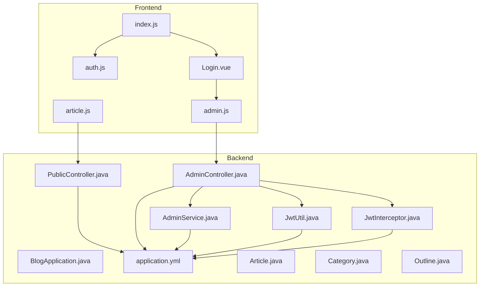

**Diagram sources**
- [BlogApplication.java:1-16](file://blog-backend/src/main/java/com/blog/BlogApplication.java#L1-L16)
- [application.yml:1-33](file://blog-backend/src/main/resources/application.yml#L1-L33)
- [AdminController.java:1-121](file://blog-backend/src/main/java/com/blog/controller/AdminController.java#L1-L121)
- [PublicController.java:1-62](file://blog-backend/src/main/java/com/blog/controller/PublicController.java#L1-L62)
- [AdminService.java:1-34](file://blog-backend/src/main/java/com/blog/service/AdminService.java#L1-L34)
- [JwtUtil.java:1-57](file://blog-backend/src/main/java/com/blog/util/JwtUtil.java#L1-L57)
- [JwtInterceptor.java:1-36](file://blog-backend/src/main/java/com/blog/config/JwtInterceptor.java#L1-L36)
- [Article.java:1-15](file://blog-backend/src/main/java/com/blog/entity/Article.java#L1-L15)
- [Category.java:1-13](file://blog-backend/src/main/java/com/blog/entity/Category.java#L1-L13)
- [Outline.java:1-14](file://blog-backend/src/main/java/com/blog/entity/Outline.java#L1-L14)
- [index.js:1-74](file://blog-frontend/src/router/index.js#L1-L74)
- [auth.js:1-19](file://blog-frontend/src/stores/auth.js#L1-L19)
- [admin.js:1-12](file://blog-frontend/src/api/admin.js#L1-L12)
- [article.js:1-14](file://blog-frontend/src/api/article.js#L1-L14)
- [Login.vue:1-83](file://blog-frontend/src/views/admin/Login.vue#L1-L83)

**Section sources**
- [BlogApplication.java:1-16](file://blog-backend/src/main/java/com/blog/BlogApplication.java#L1-L16)
- [application.yml:1-33](file://blog-backend/src/main/resources/application.yml#L1-L33)
- [index.js:1-74](file://blog-frontend/src/router/index.js#L1-L74)

## Core Components
- Admin REST endpoints for login, file uploads, categories, outlines, and articles.
- Public REST endpoints for categories, outlines, articles, and search.
- Authentication utilities and interceptor enforcing JWT validation for protected admin endpoints.
- Vue admin views and API modules for login, uploads, and CRUD operations.
- Entity models for content hierarchy and data transfer.

Key responsibilities:
- AdminController: Orchestrates admin operations and enforces JWT checks via JwtInterceptor.
- PublicController: Exposes read-only endpoints for public consumption.
- AdminService: Handles admin credential lookup and password verification.
- JwtUtil: Generates and validates JWT tokens.
- Frontend auth store and router guard: Manage session state and protect admin routes.

**Section sources**
- [AdminController.java:1-121](file://blog-backend/src/main/java/com/blog/controller/AdminController.java#L1-L121)
- [PublicController.java:1-62](file://blog-backend/src/main/java/com/blog/controller/PublicController.java#L1-L62)
- [AdminService.java:1-34](file://blog-backend/src/main/java/com/blog/service/AdminService.java#L1-L34)
- [JwtUtil.java:1-57](file://blog-backend/src/main/java/com/blog/util/JwtUtil.java#L1-L57)
- [JwtInterceptor.java:1-36](file://blog-backend/src/main/java/com/blog/config/JwtInterceptor.java#L1-L36)
- [Login.vue:1-83](file://blog-frontend/src/views/admin/Login.vue#L1-L83)
- [auth.js:1-19](file://blog-frontend/src/stores/auth.js#L1-L19)
- [admin.js:1-12](file://blog-frontend/src/api/admin.js#L1-L12)
- [article.js:1-14](file://blog-frontend/src/api/article.js#L1-L14)
- [Article.java:1-15](file://blog-backend/src/main/java/com/blog/entity/Article.java#L1-L15)
- [Category.java:1-13](file://blog-backend/src/main/java/com/blog/entity/Category.java#L1-L13)
- [Outline.java:1-14](file://blog-backend/src/main/java/com/blog/entity/Outline.java#L1-L14)

## Architecture Overview
High-level architecture:
- Backend exposes two API groups: /api/admin (protected) and /api (public).
- Admin requests require a valid Bearer JWT token.
- Public requests are unauthenticated and read-only.
- Frontend communicates with backend via Axios-like request module, storing JWT in local storage.

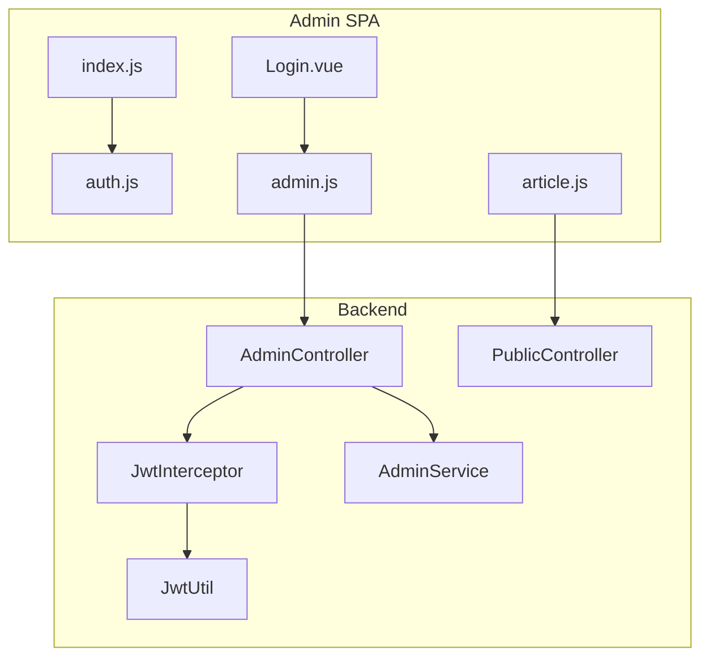

**Diagram sources**
- [Login.vue:1-83](file://blog-frontend/src/views/admin/Login.vue#L1-L83)
- [auth.js:1-19](file://blog-frontend/src/stores/auth.js#L1-L19)
- [index.js:1-74](file://blog-frontend/src/router/index.js#L1-L74)
- [admin.js:1-12](file://blog-frontend/src/api/admin.js#L1-L12)
- [article.js:1-14](file://blog-frontend/src/api/article.js#L1-L14)
- [AdminController.java:1-121](file://blog-backend/src/main/java/com/blog/controller/AdminController.java#L1-L121)
- [PublicController.java:1-62](file://blog-backend/src/main/java/com/blog/controller/PublicController.java#L1-L62)
- [JwtInterceptor.java:1-36](file://blog-backend/src/main/java/com/blog/config/JwtInterceptor.java#L1-L36)
- [JwtUtil.java:1-57](file://blog-backend/src/main/java/com/blog/util/JwtUtil.java#L1-L57)
- [AdminService.java:1-34](file://blog-backend/src/main/java/com/blog/service/AdminService.java#L1-L34)

## Detailed Component Analysis

### Admin Panel: Content Management
Admin endpoints support managing categories, outlines, and articles:
- Categories: create, update, delete
- Outlines: create, update, delete
- Articles: create, update, delete
- File upload: multipart upload to configured path, returning a public URL

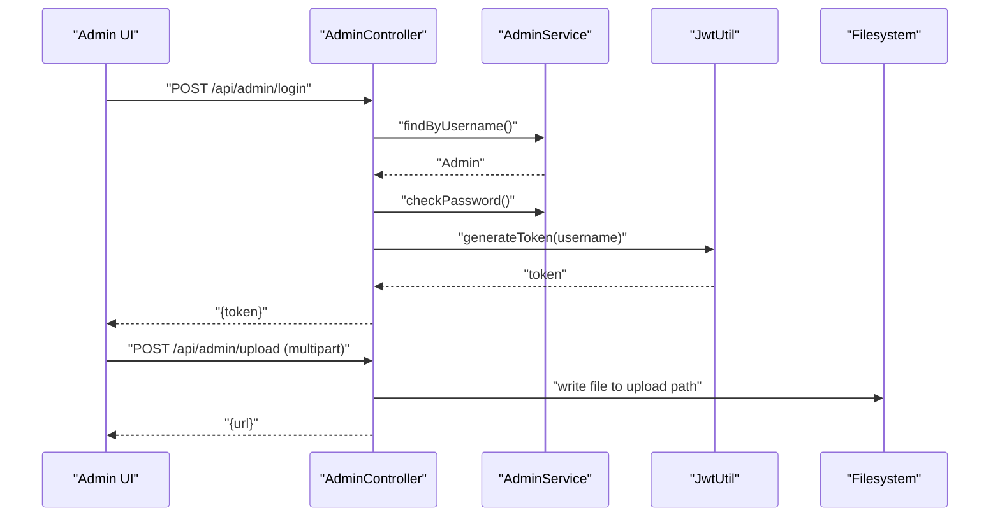

**Diagram sources**
- [AdminController.java:34-59](file://blog-backend/src/main/java/com/blog/controller/AdminController.java#L34-L59)
- [AdminService.java:16-22](file://blog-backend/src/main/java/com/blog/service/AdminService.java#L16-L22)
- [JwtUtil.java:25-34](file://blog-backend/src/main/java/com/blog/util/JwtUtil.java#L25-L34)

Admin content CRUD endpoints:
- Categories: POST/PUT/DELETE under /api/admin/categories
- Outlines: POST/PUT/DELETE under /api/admin/outlines
- Articles: POST/PUT/DELETE under /api/admin/articles

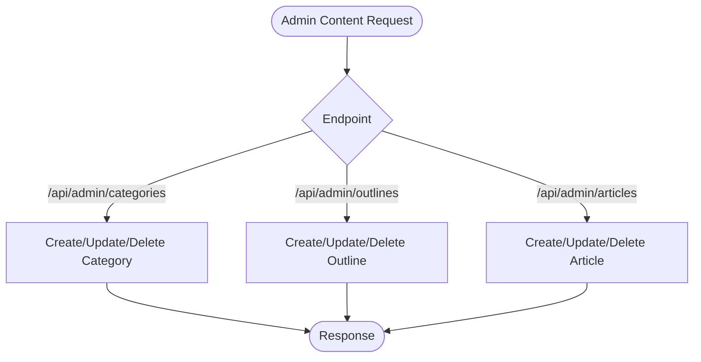

**Diagram sources**
- [AdminController.java:62-119](file://blog-backend/src/main/java/com/blog/controller/AdminController.java#L62-L119)

**Section sources**
- [AdminController.java:1-121](file://blog-backend/src/main/java/com/blog/controller/AdminController.java#L1-L121)
- [AdminService.java:1-34](file://blog-backend/src/main/java/com/blog/service/AdminService.java#L1-L34)
- [JwtUtil.java:1-57](file://blog-backend/src/main/java/com/blog/util/JwtUtil.java#L1-L57)

### File Upload System
- Endpoint: POST /api/admin/upload accepts multipart/form-data.
- Stores files under the configured upload path and returns a URL prefixed with /upload/.
- Directory is created automatically if missing.

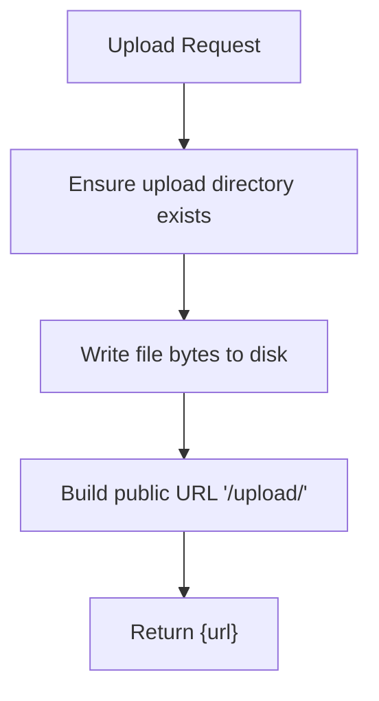

**Diagram sources**
- [AdminController.java:46-59](file://blog-backend/src/main/java/com/blog/controller/AdminController.java#L46-L59)
- [application.yml:31-33](file://blog-backend/src/main/resources/application.yml#L31-L33)

**Section sources**
- [AdminController.java:46-59](file://blog-backend/src/main/java/com/blog/controller/AdminController.java#L46-L59)
- [application.yml:31-33](file://blog-backend/src/main/resources/application.yml#L31-L33)

### Dashboard Analytics
- Admin dashboard route is defined in the frontend router and protected by authentication.
- The backend does not expose dedicated analytics endpoints; analytics would typically be derived from existing content and usage metrics (e.g., article counts per outline/category) computed client-side or via future backend endpoints.

**Section sources**
- [index.js:30-34](file://blog-frontend/src/router/index.js#L30-L34)

### Public Blog Interface
Public endpoints:
- GET /api/categories: list all categories
- GET /api/outlines: list all outlines or outlines filtered by categoryId
- GET /api/articles?outlineId=: list articles by outline
- GET /api/articles/:id: fetch a single article
- GET /api/search?keyword=: search articles by title

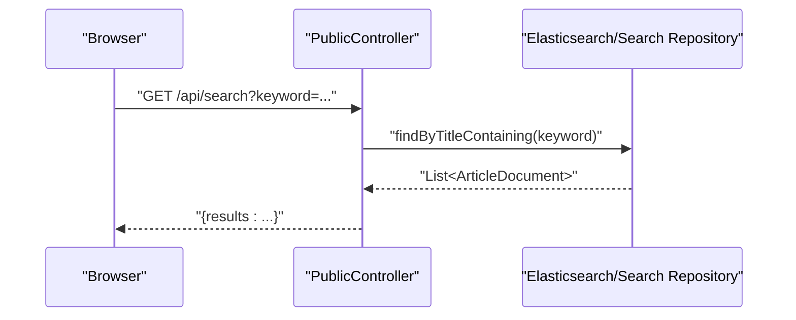

**Diagram sources**
- [PublicController.java:56-60](file://blog-backend/src/main/java/com/blog/controller/PublicController.java#L56-L60)

Frontend integration:
- Routes for home and article detail pages.
- API modules for fetching articles, individual articles, and search.

**Section sources**
- [PublicController.java:1-62](file://blog-backend/src/main/java/com/blog/controller/PublicController.java#L1-L62)
- [index.js:4-14](file://blog-frontend/src/router/index.js#L4-L14)
- [article.js:1-14](file://blog-frontend/src/api/article.js#L1-L14)

### Authentication System
- Admin login endpoint returns a signed JWT.
- JwtInterceptor enforces Authorization: Bearer token for /api/admin except /api/admin/login.
- Frontend stores the token in local storage and uses it to access protected admin routes.

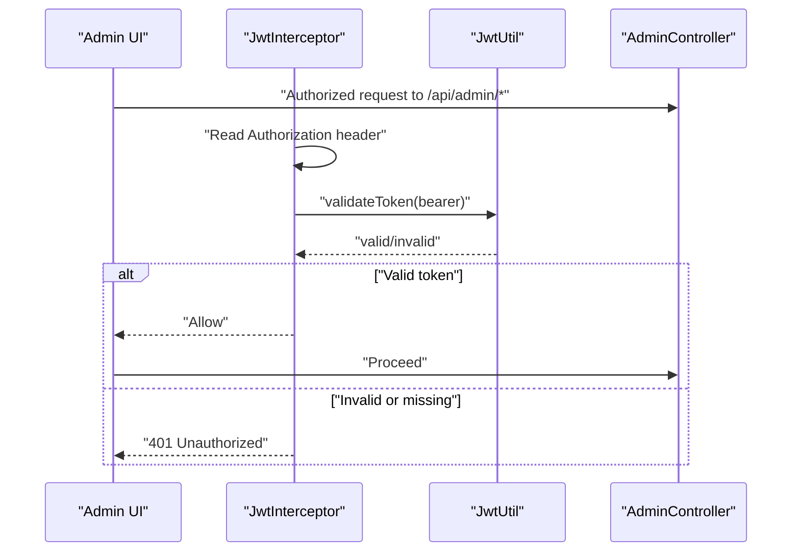

**Diagram sources**
- [JwtInterceptor.java:16-34](file://blog-backend/src/main/java/com/blog/config/JwtInterceptor.java#L16-L34)
- [JwtUtil.java:40-47](file://blog-backend/src/main/java/com/blog/util/JwtUtil.java#L40-L47)
- [AdminController.java:34-44](file://blog-backend/src/main/java/com/blog/controller/AdminController.java#L34-L44)
- [Login.vue:32-41](file://blog-frontend/src/views/admin/Login.vue#L32-L41)
- [auth.js:4-15](file://blog-frontend/src/stores/auth.js#L4-L15)

**Section sources**
- [AdminController.java:34-44](file://blog-backend/src/main/java/com/blog/controller/AdminController.java#L34-L44)
- [JwtInterceptor.java:1-36](file://blog-backend/src/main/java/com/blog/config/JwtInterceptor.java#L1-L36)
- [JwtUtil.java:1-57](file://blog-backend/src/main/java/com/blog/util/JwtUtil.java#L1-L57)
- [Login.vue:1-83](file://blog-frontend/src/views/admin/Login.vue#L1-L83)
- [auth.js:1-19](file://blog-frontend/src/stores/auth.js#L1-L19)

### Workflows

#### Admin Content Creation and Publishing
- Login: Admin logs in via the admin login page, receives a JWT, and is redirected to the admin dashboard.
- Upload media: Use the upload endpoint to store images; receive a public URL for embedding.
- Create content:
  - Create a Category.
  - Create an Outline under a Category.
  - Create Articles under an Outline.
- Publish: From the admin articles list, edit or update articles as needed; publish by ensuring proper outline association.

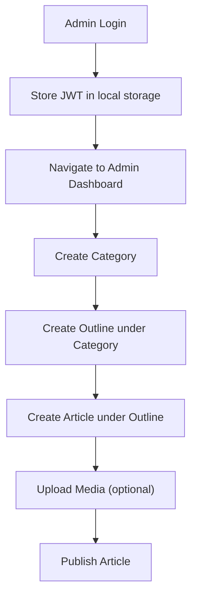

**Diagram sources**
- [Login.vue:32-41](file://blog-frontend/src/views/admin/Login.vue#L32-L41)
- [auth.js:7-10](file://blog-frontend/src/stores/auth.js#L7-L10)
- [AdminController.java:62-119](file://blog-backend/src/main/java/com/blog/controller/AdminController.java#L62-L119)
- [admin.js:3-11](file://blog-frontend/src/api/admin.js#L3-L11)

#### Public User Browsing Experience
- Browse categories and outlines to discover content.
- Select an outline to list articles.
- Open an article for reading.
- Search articles by keyword.

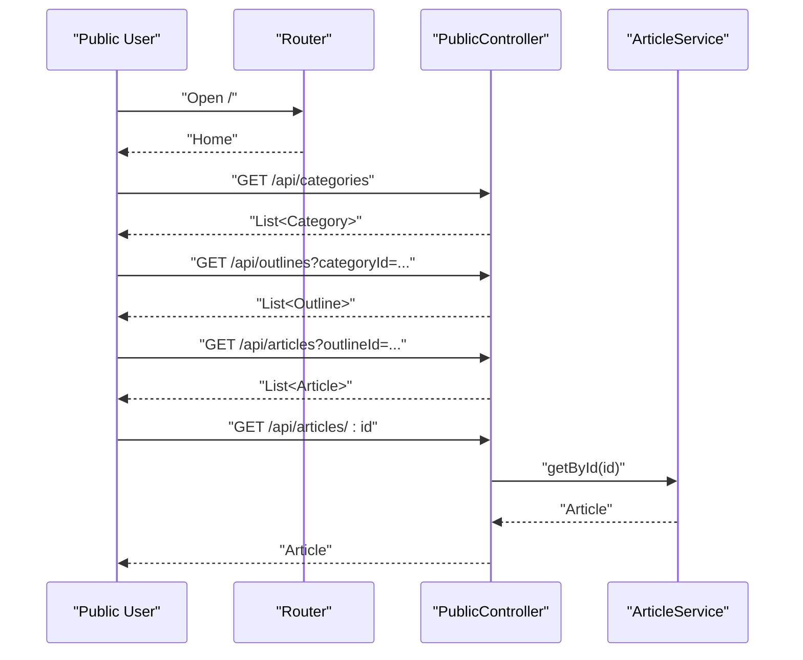

**Diagram sources**
- [PublicController.java:29-54](file://blog-backend/src/main/java/com/blog/controller/PublicController.java#L29-L54)
- [index.js:4-14](file://blog-frontend/src/router/index.js#L4-L14)
- [article.js:1-8](file://blog-frontend/src/api/article.js#L1-L8)

### Practical Examples and Integration Patterns
- Admin login and session management:
  - Submit credentials from the login view to the admin login API.
  - Store the returned token in local storage and navigate to the admin layout.
  - Protect admin routes using the router guard that checks for the presence of a token.

- Uploading images for articles:
  - Prepare a FormData with the selected file and call the upload API.
  - Use the returned URL to embed images in article content.

- Managing content hierarchy:
  - Create categories first, then outlines under those categories, and finally articles under those outlines.
  - Use PUT endpoints to update and DELETE endpoints to remove items.

- Public browsing:
  - Fetch categories and outlines to build navigation.
  - Filter outlines by category ID when needed.
  - Retrieve articles by outline ID and render article lists.
  - Implement search by keyword to surface relevant articles.

**Section sources**
- [Login.vue:32-41](file://blog-frontend/src/views/admin/Login.vue#L32-L41)
- [auth.js:4-15](file://blog-frontend/src/stores/auth.js#L4-L15)
- [index.js:64-71](file://blog-frontend/src/router/index.js#L64-L71)
- [admin.js:5-11](file://blog-frontend/src/api/admin.js#L5-L11)
- [article.js:1-14](file://blog-frontend/src/api/article.js#L1-L14)
- [AdminController.java:62-119](file://blog-backend/src/main/java/com/blog/controller/AdminController.java#L62-L119)
- [PublicController.java:29-54](file://blog-backend/src/main/java/com/blog/controller/PublicController.java#L29-L54)

## Dependency Analysis
- Backend:
  - Controllers depend on services and utilities.
  - JwtInterceptor depends on JwtUtil for token validation.
  - AdminService depends on AdminMapper and BCrypt for password hashing.
  - Application configuration defines datasource, Redis, Elasticsearch, and JWT settings.

- Frontend:
  - Views depend on Pinia stores and API modules.
  - Router guards depend on the auth store to enforce protection.

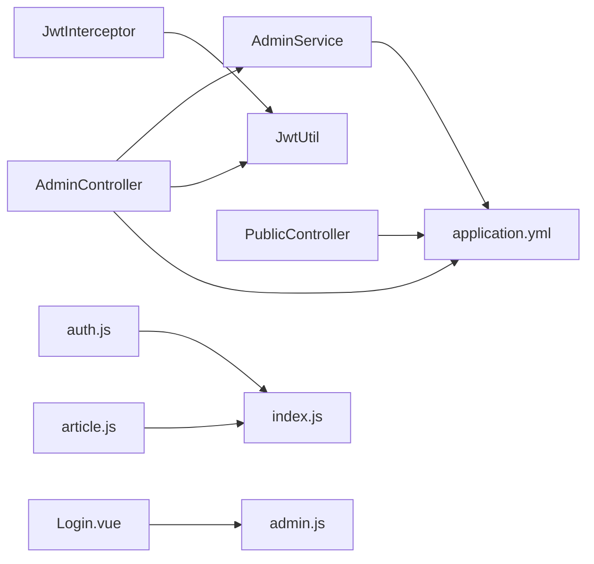

**Diagram sources**
- [AdminController.java:1-121](file://blog-backend/src/main/java/com/blog/controller/AdminController.java#L1-L121)
- [AdminService.java:1-34](file://blog-backend/src/main/java/com/blog/service/AdminService.java#L1-L34)
- [JwtUtil.java:1-57](file://blog-backend/src/main/java/com/blog/util/JwtUtil.java#L1-L57)
- [JwtInterceptor.java:1-36](file://blog-backend/src/main/java/com/blog/config/JwtInterceptor.java#L1-L36)
- [PublicController.java:1-62](file://blog-backend/src/main/java/com/blog/controller/PublicController.java#L1-L62)
- [application.yml:1-33](file://blog-backend/src/main/resources/application.yml#L1-L33)
- [auth.js:1-19](file://blog-frontend/src/stores/auth.js#L1-L19)
- [index.js:1-74](file://blog-frontend/src/router/index.js#L1-L74)
- [Login.vue:1-83](file://blog-frontend/src/views/admin/Login.vue#L1-L83)
- [admin.js:1-12](file://blog-frontend/src/api/admin.js#L1-L12)
- [article.js:1-14](file://blog-frontend/src/api/article.js#L1-L14)

**Section sources**
- [application.yml:1-33](file://blog-backend/src/main/resources/application.yml#L1-L33)
- [JwtInterceptor.java:1-36](file://blog-backend/src/main/java/com/blog/config/JwtInterceptor.java#L1-L36)
- [JwtUtil.java:1-57](file://blog-backend/src/main/java/com/blog/util/JwtUtil.java#L1-L57)
- [AdminController.java:1-121](file://blog-backend/src/main/java/com/blog/controller/AdminController.java#L1-L121)
- [PublicController.java:1-62](file://blog-backend/src/main/java/com/blog/controller/PublicController.java#L1-L62)
- [auth.js:1-19](file://blog-frontend/src/stores/auth.js#L1-L19)
- [index.js:1-74](file://blog-frontend/src/router/index.js#L1-L74)

## Performance Considerations
- Token expiration: JWT expiration is configured in application settings; ensure clients refresh or re-authenticate as needed.
- File storage: Upload path is configurable; ensure adequate disk space and consider CDN for public URLs.
- Search: Elasticsearch URIs are configurable; ensure cluster availability and index health for search performance.
- Caching: Application enables caching; leverage for repeated reads of categories/outlines/articles where appropriate.

[No sources needed since this section provides general guidance]

## Troubleshooting Guide
- Admin login fails:
  - Verify username/password against stored hash.
  - Confirm JWT secret and expiration settings.
- Unauthorized access to admin endpoints:
  - Ensure Authorization header with Bearer token is present.
  - Validate token signature and expiration.
- Upload failures:
  - Check upload directory permissions and existence.
  - Confirm multipart request format and file size limits.
- Public search returns empty:
  - Verify Elasticsearch connectivity and index population.
- Frontend route protection:
  - Confirm token presence in local storage and router guard logic.

**Section sources**
- [AdminService.java:16-22](file://blog-backend/src/main/java/com/blog/service/AdminService.java#L16-L22)
- [JwtUtil.java:40-47](file://blog-backend/src/main/java/com/blog/util/JwtUtil.java#L40-L47)
- [JwtInterceptor.java:16-34](file://blog-backend/src/main/java/com/blog/config/JwtInterceptor.java#L16-L34)
- [AdminController.java:46-59](file://blog-backend/src/main/java/com/blog/controller/AdminController.java#L46-L59)
- [application.yml:18-19](file://blog-backend/src/main/resources/application.yml#L18-L19)
- [auth.js:4-15](file://blog-frontend/src/stores/auth.js#L4-L15)
- [index.js:64-71](file://blog-frontend/src/router/index.js#L64-L71)

## Conclusion
The my-Blob blog management system provides a focused admin panel for content creation and management, a robust file upload mechanism, and a clean public interface for browsing and searching articles. JWT-based authentication secures admin operations, while frontend routing and state management deliver a responsive user experience. The modular backend and frontend enable straightforward extension and maintenance.

[No sources needed since this section summarizes without analyzing specific files]

## Appendices
- Data models overview:
  - Category: identifier, name, sort order, timestamps
  - Outline: identifier, category reference, title, sort order, timestamps
  - Article: identifier, outline reference, title, content, timestamps

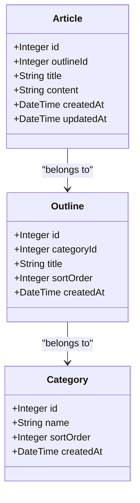

**Diagram sources**
- [Category.java:1-13](file://blog-backend/src/main/java/com/blog/entity/Category.java#L1-L13)
- [Outline.java:1-14](file://blog-backend/src/main/java/com/blog/entity/Outline.java#L1-L14)
- [Article.java:1-15](file://blog-backend/src/main/java/com/blog/entity/Article.java#L1-L15)