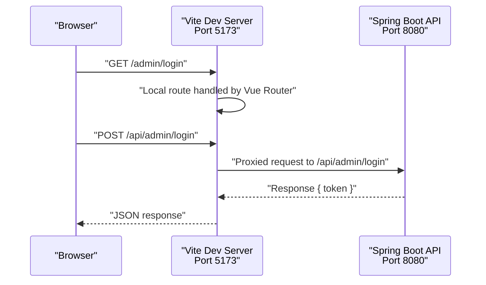
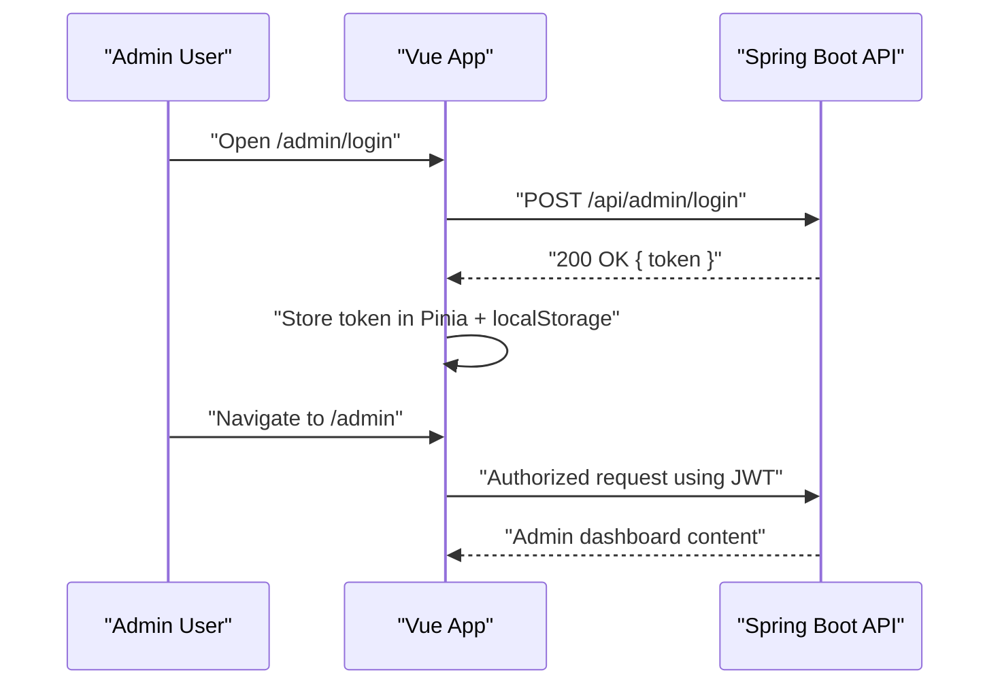

# Getting Started

<cite>
**Referenced Files in This Document**
- [application.yml](file://blog-backend/src/main/resources/application.yml)
- [pom.xml](file://blog-backend/pom.xml)
- [schema.sql](file://blog-backend/src/main/resources/schema.sql)
- [data.sql](file://blog-backend/src/main/resources/data.sql)
- [BlogApplication.java](file://blog-backend/src/main/java/com/blog/BlogApplication.java)
- [AdminController.java](file://blog-backend/src/main/java/com/blog/controller/AdminController.java)
- [AdminService.java](file://blog-backend/src/main/java/com/blog/service/AdminService.java)
- [JwtUtil.java](file://blog-backend/src/main/java/com/blog/util/JwtUtil.java)
- [DataInitializer.java](file://blog-backend/src/main/java/com/blog/config/DataInitializer.java)
- [vite.config.js](file://blog-frontend/vite.config.js)
- [package.json](file://blog-frontend/package.json)
- [main.js](file://blog-frontend/src/main.js)
- [router/index.js](file://blog-frontend/src/router/index.js)
- [stores/auth.js](file://blog-frontend/src/stores/auth.js)
</cite>

## Table of Contents
1. [Introduction](#introduction)
2. [Prerequisites](#prerequisites)
3. [Installation Overview](#installation-overview)
4. [Step-by-Step Installation](#step-by-step-installation)
5. [Database Setup](#database-setup)
6. [Environment Configuration](#environment-configuration)
7. [Running the Applications](#running-the-applications)
8. [Development Server Startup](#development-server-startup)
9. [Initial Admin Account](#initial-admin-account)
10. [Accessing the Systems](#accessing-the-systems)
11. [Troubleshooting Guide](#troubleshooting-guide)
12. [Verification Steps](#verification-steps)
13. [Conclusion](#conclusion)

## Introduction
This guide helps you install and run the my-Blob blog management system locally. It covers prerequisites, database setup, environment configuration, starting both backend and frontend applications, and verifying your installation. The system consists of:
- Backend: Spring Boot REST API with MySQL, Redis, and Elasticsearch integrations
- Frontend: Vue 3 SPA with Vite dev server and proxy to the backend

## Prerequisites
Ensure the following are installed and running on your machine:
- Java 17 or higher
- Maven
- Node.js and npm
- MySQL server
- Redis server
- Elasticsearch server

These requirements are reflected by the backend configuration and dependencies.

**Section sources**
- [pom.xml:21-23](file://blog-backend/pom.xml#L21-L23)
- [application.yml:4-19](file://blog-backend/src/main/resources/application.yml#L4-L19)

## Installation Overview
High-level steps:
1. Prepare the database with schema and initial data
2. Configure environment variables and connection settings
3. Build and run the backend service
4. Install frontend dependencies and start the development server
5. Access the admin panel and public blog interface

## Step-by-Step Installation
1. Clone or download the repository to your local machine.
2. Open a terminal in the repository root directory.

**Section sources**
- [BlogApplication.java:11-15](file://blog-backend/src/main/java/com/blog/BlogApplication.java#L11-L15)

## Database Setup
Create the database and tables, then seed initial admin data.

- Create the database and run the schema script to create tables.
- Run the data script to insert the initial admin record.

After running the scripts, the database will contain:
- category table
- outline table (with foreign key to category)
- article table (with foreign key to outline)
- admin table with an initial admin user

Notes:
- The schema defines primary keys, foreign keys, and timestamps.
- The data script inserts a default admin user with a pre-hashed password.

**Section sources**
- [schema.sql:1-33](file://blog-backend/src/main/resources/schema.sql#L1-L33)
- [data.sql:1-2](file://blog-backend/src/main/resources/data.sql#L1-L2)

## Environment Configuration
Configure the backend to connect to your services.

- Database connection: JDBC URL, username, password, and driver class are configured in the backend properties.
- Redis connection: host, port, and database index are configured.
- Elasticsearch connection: URI is configured.
- Upload path: absolute path for uploaded images is configured.
- JWT settings: secret key and expiration are configured.

Important ports:
- Backend server runs on port 8080.
- Frontend dev server runs on port 5173.

Proxy configuration:
- The frontend proxies API calls to the backend on port 8080.
- File uploads are proxied to the backend for handling.

**Section sources**
- [application.yml:1-33](file://blog-backend/src/main/resources/application.yml#L1-L33)
- [vite.config.js:6-19](file://blog-frontend/vite.config.js#L6-L19)

## Running the Applications
Start the backend and frontend applications.

Backend:
- Use Maven to build and run the Spring Boot application.
- The main class initializes the application context and starts the embedded server.

Frontend:
- Install dependencies using npm.
- Start the Vite development server.

Ports:
- Backend: 8080
- Frontend: 5173

**Section sources**
- [BlogApplication.java:12-14](file://blog-backend/src/main/java/com/blog/BlogApplication.java#L12-L14)
- [package.json:6-10](file://blog-frontend/package.json#L6-L10)

## Development Server Startup
Follow these steps to start both servers:

1. Backend
- Navigate to the backend directory.
- Build and run the Spring Boot application using Maven.

2. Frontend
- Navigate to the frontend directory.
- Install dependencies with npm.
- Start the Vite dev server.

3. Proxy Behavior
- The frontend dev server proxies requests under /api and /upload to the backend at http://localhost:8080.

**Diagram sources**
- [vite.config.js:9-17](file://blog-frontend/vite.config.js#L9-L17)
- [AdminController.java:34-44](file://blog-backend/src/main/java/com/blog/controller/AdminController.java#L34-L44)

**Section sources**
- [vite.config.js:4-20](file://blog-frontend/vite.config.js#L4-L20)
- [package.json:6-10](file://blog-frontend/package.json#L6-L10)

## Initial Admin Account
There are two ways the initial admin account is handled:

Option A: Seed data
- The data script inserts an admin user with a predefined username and hashed password.

Option B: Automatic creation
- On startup, the backend checks for an existing admin user. If none exists, it creates one with a default password.

Security note:
- The default password is generated and stored during automatic creation. Change it immediately after first login.

**Section sources**
- [data.sql:1](file://blog-backend/src/main/resources/data.sql#L1)
- [AdminService.java:24-32](file://blog-backend/src/main/java/com/blog/service/AdminService.java#L24-L32)
- [DataInitializer.java:14-17](file://blog-backend/src/main/java/com/blog/config/DataInitializer.java#L14-L17)

## Accessing the Systems
Once both servers are running:

- Public blog interface: Visit the frontend base URL.
- Admin panel: Navigate to the admin login page and sign in with your admin credentials.

Authentication flow:
- Submit admin credentials to the backend login endpoint.
- On success, the backend returns a JWT token.
- The frontend stores the token and uses it for protected admin routes.

**Diagram sources**
- [AdminController.java:34-44](file://blog-backend/src/main/java/com/blog/controller/AdminController.java#L34-L44)
- [JwtUtil.java:25-34](file://blog-backend/src/main/java/com/blog/util/JwtUtil.java#L25-L34)
- [router/index.js:64-71](file://blog-frontend/src/router/index.js#L64-L71)
- [stores/auth.js:4-15](file://blog-frontend/src/stores/auth.js#L4-L15)

**Section sources**
- [router/index.js:16-56](file://blog-frontend/src/router/index.js#L16-L56)
- [AdminController.java:34-44](file://blog-backend/src/main/java/com/blog/controller/AdminController.java#L34-L44)

## Troubleshooting Guide
Common setup issues and resolutions:

- Backend fails to start due to missing Java 17+
  - Ensure your JAVA_HOME and PATH point to a Java 17+ JDK.

- Maven build errors
  - Verify Maven is installed and can resolve dependencies.
  - Check network connectivity for downloading dependencies.

- Database connection failures
  - Confirm MySQL is running and accessible.
  - Verify JDBC URL, username, and password match your environment.
  - Ensure the database and tables exist.

- Redis connection failures
  - Confirm Redis is running and reachable on the configured host/port.
  - Adjust host/port in the backend configuration if needed.

- Elasticsearch connection failures
  - Confirm Elasticsearch is running and reachable.
  - Adjust the configured URI if needed.

- Frontend dev server cannot reach backend
  - Ensure the backend is running on port 8080.
  - Verify the proxy configuration in the frontend dev server.

- Admin login fails
  - Use the seeded credentials if present.
  - If auto-created, log in with the default password and change it immediately.

**Section sources**
- [application.yml:4-19](file://blog-backend/src/main/resources/application.yml#L4-L19)
- [vite.config.js:9-17](file://blog-frontend/vite.config.js#L9-L17)
- [data.sql:1](file://blog-backend/src/main/resources/data.sql#L1)
- [AdminService.java:24-32](file://blog-backend/src/main/java/com/blog/service/AdminService.java#L24-L32)

## Verification Steps
Confirm your installation is working:

- Backend health
  - Access the backend base URL to ensure the server responds.
  - Try the admin login endpoint to confirm authentication works.

- Database
  - Connect to MySQL and verify tables and seed data exist.

- Frontend
  - Load the frontend in a browser.
  - Navigate to the admin login page and log in.
  - Access the admin dashboard and public home page.

- Uploads
  - Use the admin upload endpoint to verify file storage and retrieval.

**Section sources**
- [AdminController.java:46-59](file://blog-backend/src/main/java/com/blog/controller/AdminController.java#L46-L59)
- [schema.sql:1-33](file://blog-backend/src/main/resources/schema.sql#L1-L33)

## Conclusion
You have successfully installed and verified the my-Blob blog management system. You can now manage categories, outlines, and articles via the admin panel and publish content for visitors through the public interface. For ongoing development, keep the backend and frontend servers running with their respective dev servers and proxies configured as described.