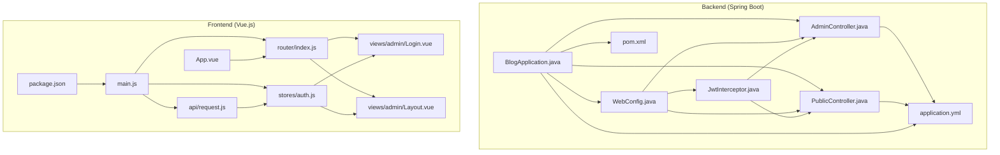
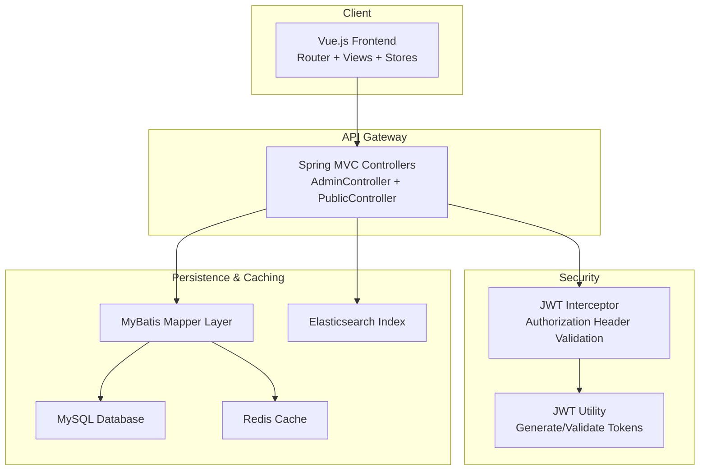
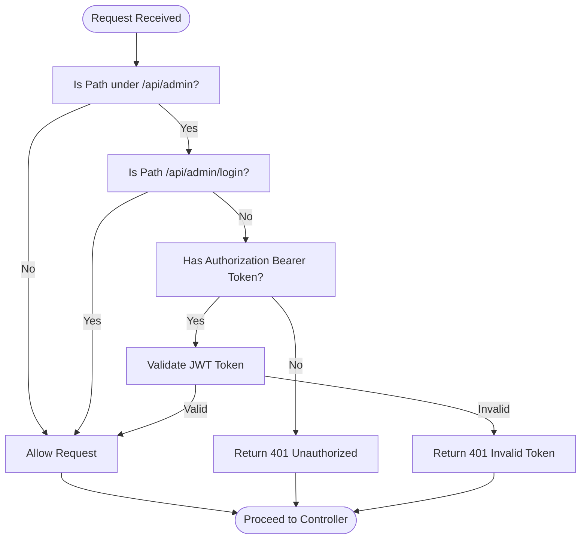
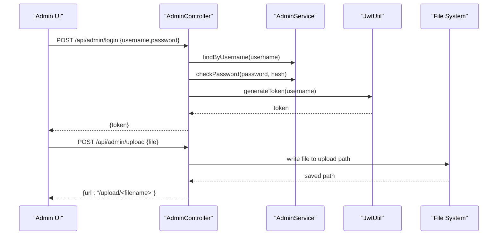
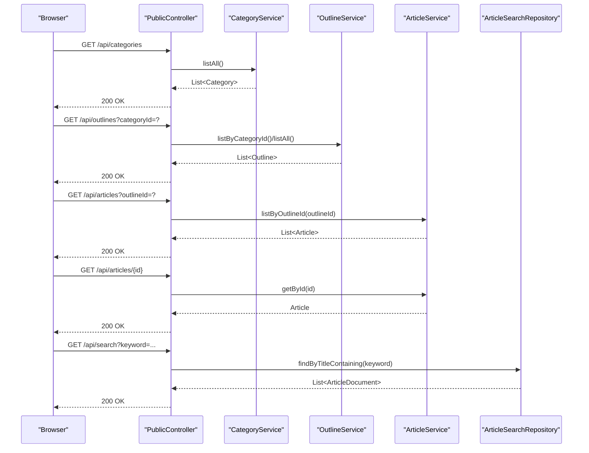
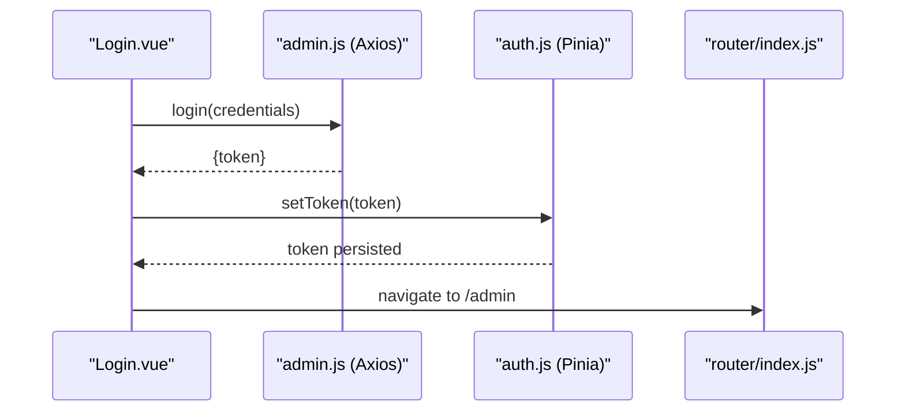
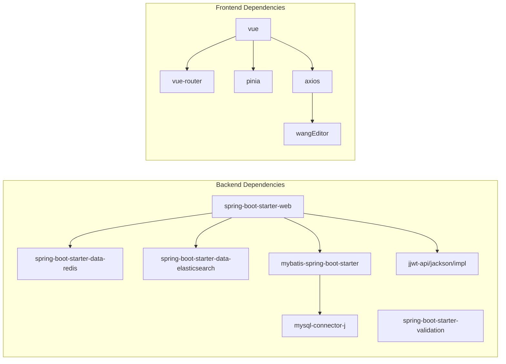

# Project Overview

<cite>
**Referenced Files in This Document**
- [BlogApplication.java](file://blog-backend/src/main/java/com/blog/BlogApplication.java)
- [application.yml](file://blog-backend/src/main/resources/application.yml)
- [pom.xml](file://blog-backend/pom.xml)
- [WebConfig.java](file://blog-backend/src/main/java/com/blog/config/WebConfig.java)
- [JwtInterceptor.java](file://blog-backend/src/main/java/com/blog/config/JwtInterceptor.java)
- [AdminController.java](file://blog-backend/src/main/java/com/blog/controller/AdminController.java)
- [PublicController.java](file://blog-backend/src/main/java/com/blog/controller/PublicController.java)
- [JwtUtil.java](file://blog-backend/src/main/java/com/blog/util/JwtUtil.java)
- [main.js](file://blog-frontend/src/main.js)
- [package.json](file://blog-frontend/package.json)
- [index.js](file://blog-frontend/src/router/index.js)
- [request.js](file://blog-frontend/src/api/request.js)
- [auth.js](file://blog-frontend/src/stores/auth.js)
- [Login.vue](file://blog-frontend/src/views/admin/Login.vue)
- [Layout.vue](file://blog-frontend/src/views/admin/Layout.vue)
- [App.vue](file://blog-frontend/src/App.vue)
</cite>

## Table of Contents
1. [Introduction](#introduction)
2. [Project Structure](#project-structure)
3. [Core Components](#core-components)
4. [Architecture Overview](#architecture-overview)
5. [Detailed Component Analysis](#detailed-component-analysis)
6. [Dependency Analysis](#dependency-analysis)
7. [Performance Considerations](#performance-considerations)
8. [Troubleshooting Guide](#troubleshooting-guide)
9. [Conclusion](#conclusion)

## Introduction
my-Blob is a full-stack blog management system designed to serve both administrators and public visitors. It provides a modern admin panel for content creators and a responsive public interface for readers. The backend is built with Spring Boot 3.2.5 and Java 17+, while the frontend leverages Vue.js 3 with Vue Router and Pinia for state management. The system integrates MyBatis for persistence, MySQL for relational data storage, Redis for caching, Elasticsearch for search capabilities, and JWT-based authentication for secure admin access.

Key features include:
- Content management: categories, outlines, and articles
- File upload and serving via configurable upload path
- Full-text search powered by Elasticsearch
- Responsive admin dashboard with navigation and CRUD operations
- Public browsing: categories, outlines, article lists, and individual article pages

## Project Structure
The repository is organized into two primary modules:
- blog-backend: Spring Boot application containing controllers, services, mappers, entities, configuration, and resources
- blog-frontend: Vue.js single-page application with routing, API clients, stores, and admin/public views

**Diagram sources**
- [BlogApplication.java:1-16](file://blog-backend/src/main/java/com/blog/BlogApplication.java#L1-L16)
- [WebConfig.java:1-39](file://blog-backend/src/main/java/com/blog/config/WebConfig.java#L1-L39)
- [JwtInterceptor.java:1-36](file://blog-backend/src/main/java/com/blog/config/JwtInterceptor.java#L1-L36)
- [AdminController.java:1-121](file://blog-backend/src/main/java/com/blog/controller/AdminController.java#L1-L121)
- [PublicController.java:1-62](file://blog-backend/src/main/java/com/blog/controller/PublicController.java#L1-L62)
- [application.yml:1-33](file://blog-backend/src/main/resources/application.yml#L1-L33)
- [pom.xml:1-111](file://blog-backend/pom.xml#L1-L111)
- [main.js:1-9](file://blog-frontend/src/main.js#L1-L9)
- [index.js:1-74](file://blog-frontend/src/router/index.js#L1-L74)
- [auth.js:1-19](file://blog-frontend/src/stores/auth.js#L1-L19)
- [request.js:1-33](file://blog-frontend/src/api/request.js#L1-L33)
- [Login.vue:1-83](file://blog-frontend/src/views/admin/Login.vue#L1-L83)
- [Layout.vue:1-164](file://blog-frontend/src/views/admin/Layout.vue#L1-L164)
- [App.vue:1-12](file://blog-frontend/src/App.vue#L1-L12)
- [package.json:1-24](file://blog-frontend/package.json#L1-L24)

**Section sources**
- [BlogApplication.java:1-16](file://blog-backend/src/main/java/com/blog/BlogApplication.java#L1-L16)
- [application.yml:1-33](file://blog-backend/src/main/resources/application.yml#L1-L33)
- [pom.xml:1-111](file://blog-backend/pom.xml#L1-L111)
- [main.js:1-9](file://blog-frontend/src/main.js#L1-L9)
- [package.json:1-24](file://blog-frontend/package.json#L1-L24)

## Core Components
- Backend Application Entry Point: Initializes Spring Boot, enables MyBatis mappers, and activates caching.
- Configuration Layer: CORS setup, resource handlers for uploads, and JWT interceptor registration.
- Controllers:
  - AdminController: Handles admin authentication, file uploads, and CRUD operations for categories, outlines, and articles.
  - PublicController: Exposes read-only endpoints for categories, outlines, articles, article retrieval, and search.
- Authentication Utilities: JWT utility for token generation and validation.
- Frontend Application Entry Point: Initializes Vue app, Pinia, and Vue Router.
- Routing: Admin routes guarded by authentication; public routes for home and article viewing.
- State Management: Pinia store for JWT token persistence and logout actions.
- HTTP Client: Axios instance configured with base URL, Authorization header injection, and automatic 401 handling.

**Section sources**
- [BlogApplication.java:1-16](file://blog-backend/src/main/java/com/blog/BlogApplication.java#L1-L16)
- [WebConfig.java:1-39](file://blog-backend/src/main/java/com/blog/config/WebConfig.java#L1-L39)
- [JwtInterceptor.java:1-36](file://blog-backend/src/main/java/com/blog/config/JwtInterceptor.java#L1-L36)
- [AdminController.java:1-121](file://blog-backend/src/main/java/com/blog/controller/AdminController.java#L1-L121)
- [PublicController.java:1-62](file://blog-backend/src/main/java/com/blog/controller/PublicController.java#L1-L62)
- [JwtUtil.java](file://blog-backend/src/main/java/com/blog/util/JwtUtil.java)
- [main.js:1-9](file://blog-frontend/src/main.js#L1-L9)
- [index.js:1-74](file://blog-frontend/src/router/index.js#L1-L74)
- [auth.js:1-19](file://blog-frontend/src/stores/auth.js#L1-L19)
- [request.js:1-33](file://blog-frontend/src/api/request.js#L1-L33)

## Architecture Overview
The system follows a classic layered architecture with clear separation between presentation, business logic, and data access layers. The backend exposes REST APIs consumed by the Vue.js frontend. Security is enforced via a JWT interceptor for admin endpoints, while public endpoints remain unauthenticated. Data persistence uses MyBatis with MySQL, caching is handled by Redis, and search is powered by Elasticsearch.

**Diagram sources**
- [AdminController.java:1-121](file://blog-backend/src/main/java/com/blog/controller/AdminController.java#L1-L121)
- [PublicController.java:1-62](file://blog-backend/src/main/java/com/blog/controller/PublicController.java#L1-L62)
- [JwtInterceptor.java:1-36](file://blog-backend/src/main/java/com/blog/config/JwtInterceptor.java#L1-L36)
- [JwtUtil.java](file://blog-backend/src/main/java/com/blog/util/JwtUtil.java)
- [WebConfig.java:1-39](file://blog-backend/src/main/java/com/blog/config/WebConfig.java#L1-L39)
- [application.yml:1-33](file://blog-backend/src/main/resources/application.yml#L1-L33)

## Detailed Component Analysis

### Backend Application Initialization
- Enables MyBatis mappers under the com.blog.mapper package and activates caching support.
- Serves as the bootstrap entry point for the Spring Boot application.

**Section sources**
- [BlogApplication.java:1-16](file://blog-backend/src/main/java/com/blog/BlogApplication.java#L1-L16)

### Configuration and CORS/Upload Handling
- Registers a JWT interceptor for admin endpoints, excluding the login endpoint.
- Adds a resource handler to serve uploaded files from a configurable upload path.
- Configures CORS globally to allow cross-origin requests from any origin.

**Diagram sources**
- [WebConfig.java:17-22](file://blog-backend/src/main/java/com/blog/config/WebConfig.java#L17-L22)
- [JwtInterceptor.java:16-34](file://blog-backend/src/main/java/com/blog/config/JwtInterceptor.java#L16-L34)

**Section sources**
- [WebConfig.java:1-39](file://blog-backend/src/main/java/com/blog/config/WebConfig.java#L1-L39)
- [JwtInterceptor.java:1-36](file://blog-backend/src/main/java/com/blog/config/JwtInterceptor.java#L1-L36)

### Admin Workflow: Authentication and Upload
- Admin login validates credentials against stored hash and issues a JWT token.
- File upload saves images to the configured upload directory and returns a public URL.
- CRUD endpoints for categories, outlines, and articles are exposed under /api/admin.

**Diagram sources**
- [AdminController.java:34-59](file://blog-backend/src/main/java/com/blog/controller/AdminController.java#L34-L59)
- [JwtUtil.java](file://blog-backend/src/main/java/com/blog/util/JwtUtil.java)

**Section sources**
- [AdminController.java:1-121](file://blog-backend/src/main/java/com/blog/controller/AdminController.java#L1-L121)

### Public Blog Browsing
- PublicController exposes endpoints for categories, outlines, articles, and article retrieval by ID.
- Search endpoint queries Elasticsearch for matching article documents by title.

**Diagram sources**
- [PublicController.java:29-60](file://blog-backend/src/main/java/com/blog/controller/PublicController.java#L29-L60)

**Section sources**
- [PublicController.java:1-62](file://blog-backend/src/main/java/com/blog/controller/PublicController.java#L1-L62)

### Frontend Application and Admin Authentication Flow
- The Vue app initializes Pinia and Vue Router, and mounts to the DOM.
- Axios client injects Authorization header when a token exists and handles 401 responses by clearing the token and redirecting to login.
- Admin login page posts credentials to the backend and stores the returned JWT token in local storage.
- Admin layout enforces route guards using the auth store’s token presence.

**Diagram sources**
- [Login.vue:32-41](file://blog-frontend/src/views/admin/Login.vue#L32-L41)
- [request.js:9-18](file://blog-frontend/src/api/request.js#L9-L18)
- [auth.js:4-15](file://blog-frontend/src/stores/auth.js#L4-L15)
- [index.js:64-71](file://blog-frontend/src/router/index.js#L64-L71)

**Section sources**
- [main.js:1-9](file://blog-frontend/src/main.js#L1-L9)
- [request.js:1-33](file://blog-frontend/src/api/request.js#L1-L33)
- [auth.js:1-19](file://blog-frontend/src/stores/auth.js#L1-L19)
- [index.js:1-74](file://blog-frontend/src/router/index.js#L1-L74)
- [Login.vue:1-83](file://blog-frontend/src/views/admin/Login.vue#L1-L83)
- [Layout.vue:1-164](file://blog-frontend/src/views/admin/Layout.vue#L1-L164)

### Technology Stack Details
- Backend
  - Java 17+ and Spring Boot 3.2.5
  - MyBatis for ORM and SQL mapping
  - MySQL for relational data
  - Redis for caching
  - Elasticsearch for search indexing and queries
  - JWT (jjwt) for authentication tokens
- Frontend
  - Vue.js 3 with Composition API
  - Vue Router 4 for client-side routing
  - Pinia for state management
  - Axios for HTTP requests
  - WangWang Editor for rich text editing

**Section sources**
- [pom.xml:21-91](file://blog-backend/pom.xml#L21-L91)
- [application.yml:1-33](file://blog-backend/src/main/resources/application.yml#L1-L33)
- [package.json:1-24](file://blog-frontend/package.json#L1-L24)

## Dependency Analysis
The backend depends on Spring Boot starters for web, validation, Redis, and Elasticsearch, along with MyBatis and JWT libraries. The frontend depends on Vue 3, Vue Router, Pinia, Axios, and WangWang Editor. The frontend Axios instance communicates with the backend via /api, while the backend serves static uploads from a configured path.

**Diagram sources**
- [pom.xml:25-91](file://blog-backend/pom.xml#L25-L91)
- [package.json:11-22](file://blog-frontend/package.json#L11-L22)

**Section sources**
- [pom.xml:1-111](file://blog-backend/pom.xml#L1-L111)
- [package.json:1-24](file://blog-frontend/package.json#L1-L24)

## Performance Considerations
- Caching: Enable Redis-backed caching for frequently accessed categories and outlines to reduce database load.
- Search: Ensure Elasticsearch indices are optimized and periodically refreshed to maintain fast query performance.
- Uploads: Store uploaded files on a high-performance filesystem or cloud storage to minimize latency.
- Database: Use connection pooling and appropriate indexes on article and category tables to improve query performance.
- Frontend: Lazy-load route components and editor assets to reduce initial bundle size.

## Troubleshooting Guide
- Authentication failures:
  - Verify JWT interceptor is registered and configured to exclude /api/admin/login.
  - Confirm Authorization header format is "Bearer <token>".
  - Check token validity and expiration settings.
- Upload issues:
  - Ensure the upload directory exists and is writable.
  - Confirm the resource handler path matches the configured upload path.
- CORS errors:
  - Review CORS configuration allowing required origins, methods, and headers.
- Elasticsearch search:
  - Validate Elasticsearch URIs and index mappings.
  - Confirm search queries are correctly targeting indexed fields.
- Frontend 401 handling:
  - Ensure the Axios interceptor clears the token and redirects to /admin/login on 401 responses.

**Section sources**
- [WebConfig.java:17-37](file://blog-backend/src/main/java/com/blog/config/WebConfig.java#L17-L37)
- [JwtInterceptor.java:16-34](file://blog-backend/src/main/java/com/blog/config/JwtInterceptor.java#L16-L34)
- [request.js:20-29](file://blog-frontend/src/api/request.js#L20-L29)

## Conclusion
my-Blob delivers a robust, full-stack blogging solution with a modern admin panel and a responsive public interface. Its architecture cleanly separates concerns between backend and frontend, leveraging proven technologies for scalability and maintainability. Administrators benefit from streamlined content management and secure authentication, while readers enjoy a fast, searchable, and visually appealing experience. The modular design and clear component boundaries facilitate future enhancements and customization.