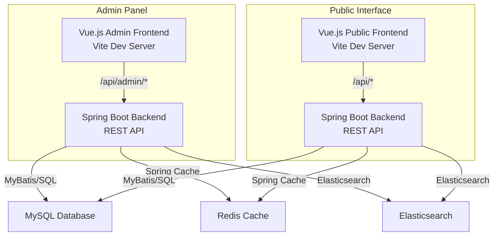
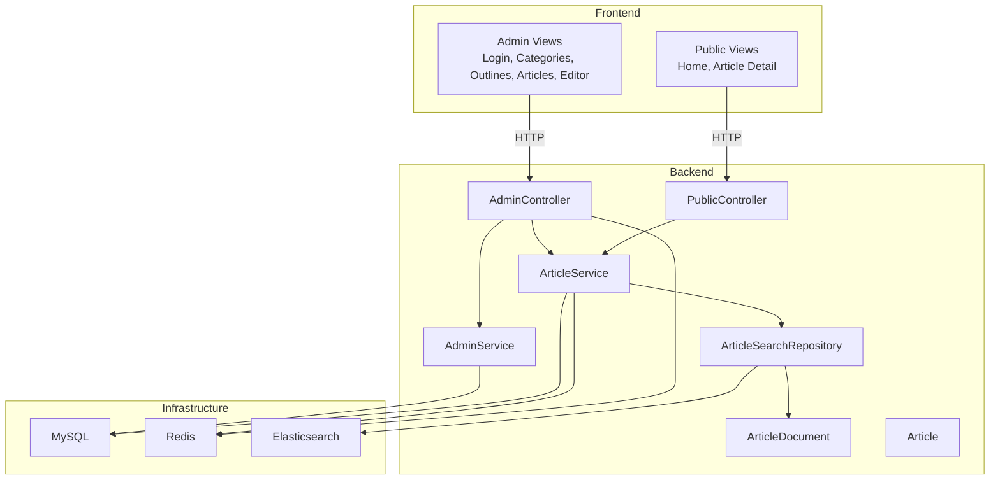
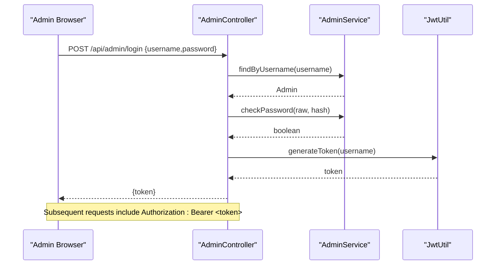
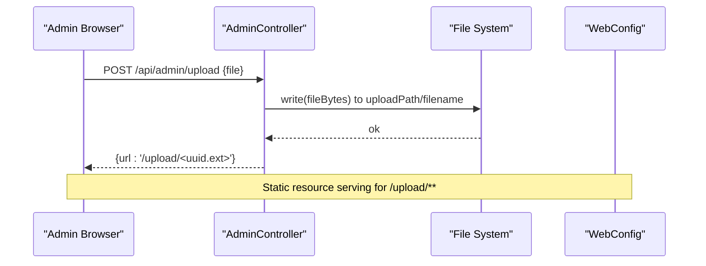
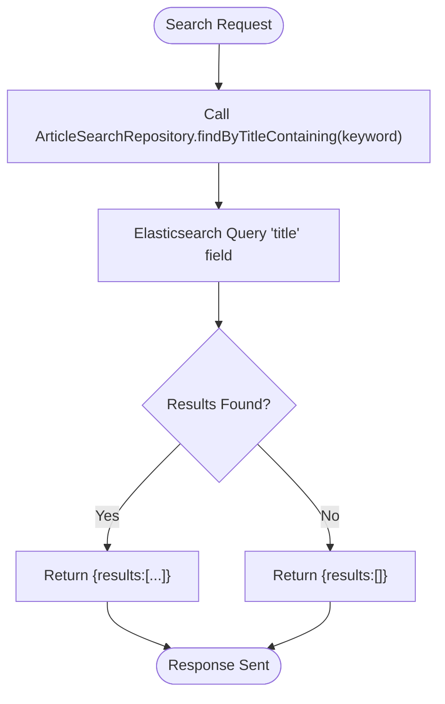
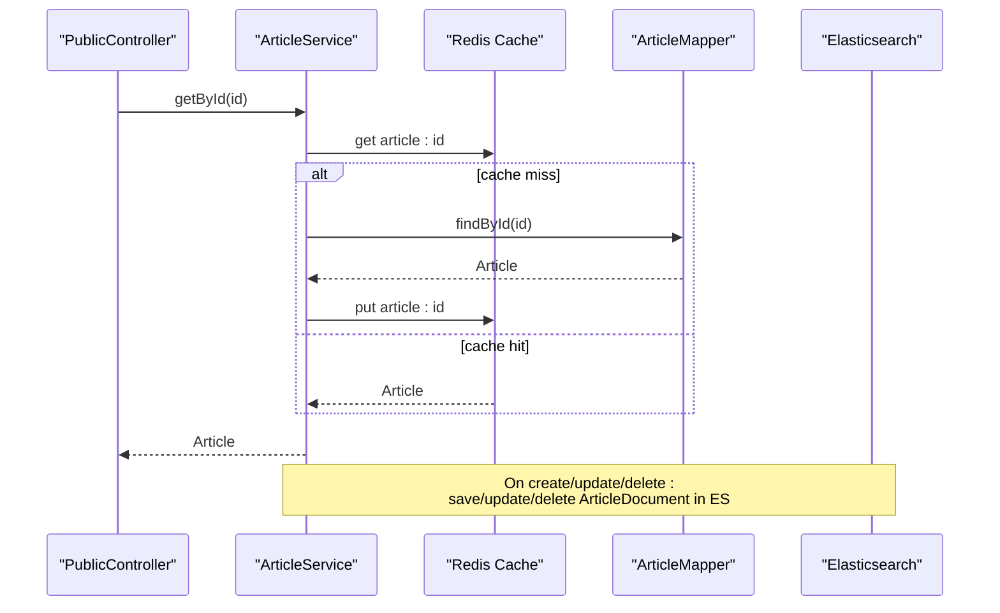
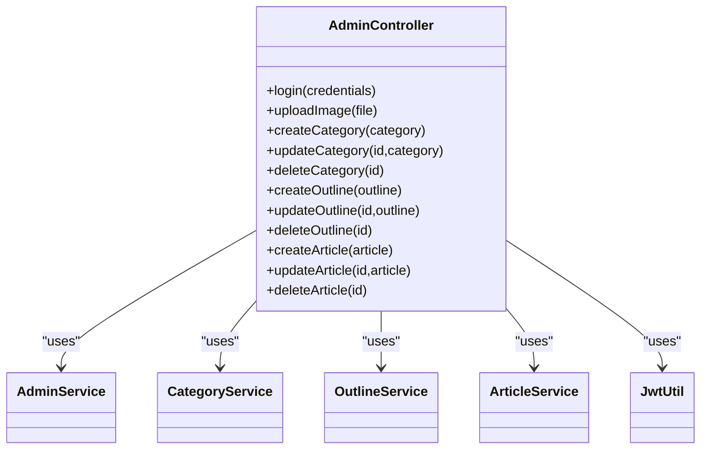
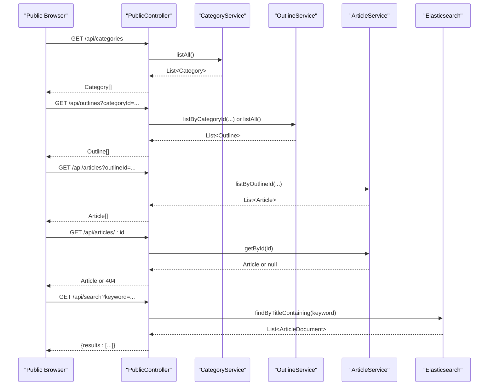
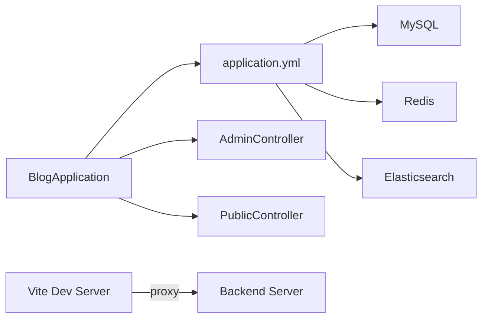

# System Architecture

<cite>
**Referenced Files in This Document**
- [BlogApplication.java](file://blog-backend/src/main/java/com/blog/BlogApplication.java)
- [application.yml](file://blog-backend/src/main/resources/application.yml)
- [WebConfig.java](file://blog-backend/src/main/java/com/blog/config/WebConfig.java)
- [JwtInterceptor.java](file://blog-backend/src/main/java/com/blog/config/JwtInterceptor.java)
- [JwtUtil.java](file://blog-backend/src/main/java/com/blog/util/JwtUtil.java)
- [AdminController.java](file://blog-backend/src/main/java/com/blog/controller/AdminController.java)
- [PublicController.java](file://blog-backend/src/main/java/com/blog/controller/PublicController.java)
- [AdminService.java](file://blog-backend/src/main/java/com/blog/service/AdminService.java)
- [ArticleService.java](file://blog-backend/src/main/java/com/blog/service/ArticleService.java)
- [ArticleSearchRepository.java](file://blog-backend/src/main/java/com/blog/repository/ArticleSearchRepository.java)
- [Article.java](file://blog-backend/src/main/java/com/blog/entity/Article.java)
- [ArticleDocument.java](file://blog-backend/src/main/java/com/blog/entity/ArticleDocument.java)
- [main.js](file://blog-frontend/src/main.js)
- [vite.config.js](file://blog-frontend/vite.config.js)
- [package.json](file://blog-frontend/package.json)
</cite>

## Table of Contents
1. [Introduction](#introduction)
2. [Project Structure](#project-structure)
3. [Core Components](#core-components)
4. [Architecture Overview](#architecture-overview)
5. [Detailed Component Analysis](#detailed-component-analysis)
6. [Dependency Analysis](#dependency-analysis)
7. [Performance Considerations](#performance-considerations)
8. [Troubleshooting Guide](#troubleshooting-guide)
9. [Conclusion](#conclusion)

## Introduction
This document describes the system architecture of the my-Blob blog management system. The system comprises two primary surfaces:
- Admin panel: a backend REST API with a Vue.js frontend for content management.
- Public blog interface: a backend REST API consumed by the Vue.js frontend for end-user browsing.

The backend follows a layered architecture aligned with Model-View-Control (MVC) principles:
- Controllers expose REST endpoints.
- Services encapsulate business logic and orchestrate persistence/search operations.
- Data access uses MyBatis mappers and Spring Data repositories.
- Entities represent domain models, including dedicated documents for search indexing.

The frontend is component-based with Vue 3, Pinia for state, and Vue Router for navigation. It proxies API requests to the backend during development via Vite’s dev server.

External systems integrated include MySQL for relational data, Redis for caching, and Elasticsearch for full-text search.

## Project Structure
The repository is split into two major parts:
- blog-backend: Spring Boot application with Java, MyBatis, Spring Data Elasticsearch, and configuration for Redis and MySQL.
- blog-frontend: Vue 3 application with routing, state management, and editor components.

**Diagram sources**
- [main.js:1-9](file://blog-frontend/src/main.js#L1-L9)
- [vite.config.js:1-21](file://blog-frontend/vite.config.js#L1-L21)
- [BlogApplication.java:1-16](file://blog-backend/src/main/java/com/blog/BlogApplication.java#L1-L16)
- [application.yml:1-33](file://blog-backend/src/main/resources/application.yml#L1-L33)
- [AdminController.java:1-121](file://blog-backend/src/main/java/com/blog/controller/AdminController.java#L1-L121)
- [PublicController.java:1-62](file://blog-backend/src/main/java/com/blog/controller/PublicController.java#L1-L62)

**Section sources**
- [BlogApplication.java:1-16](file://blog-backend/src/main/java/com/blog/BlogApplication.java#L1-L16)
- [application.yml:1-33](file://blog-backend/src/main/resources/application.yml#L1-L33)
- [main.js:1-9](file://blog-frontend/src/main.js#L1-L9)
- [vite.config.js:1-21](file://blog-frontend/vite.config.js#L1-L21)

## Core Components
- Backend application bootstrap and scanning:
  - Application class enables caching and mapper scanning.
- Configuration:
  - CORS enabled globally.
  - Resource handler serves uploaded files from a configured path.
  - Interceptor enforces JWT for admin endpoints except login.
  - YAML config defines datasource, Redis, Elasticsearch URIs, MyBatis settings, JWT secret and expiration, and upload path.
- Controllers:
  - AdminController: login, image upload, CRUD for categories/outlines/articles.
  - PublicController: browse categories, outlines, articles, and search.
- Services:
  - AdminService: admin lookup and password verification.
  - ArticleService: caching and Elasticsearch indexing for articles.
- Repositories and Documents:
  - ArticleSearchRepository: Elasticsearch repository with a custom query method.
  - ArticleDocument: ES document mapped to index “article” with analyzers.
- Entities:
  - Article: core content model.
  - Additional entities (Category, Outline) support the domain but are not further detailed here.

**Section sources**
- [BlogApplication.java:1-16](file://blog-backend/src/main/java/com/blog/BlogApplication.java#L1-L16)
- [WebConfig.java:1-39](file://blog-backend/src/main/java/com/blog/config/WebConfig.java#L1-L39)
- [JwtInterceptor.java:1-36](file://blog-backend/src/main/java/com/blog/config/JwtInterceptor.java#L1-L36)
- [JwtUtil.java:1-57](file://blog-backend/src/main/java/com/blog/util/JwtUtil.java#L1-L57)
- [AdminController.java:1-121](file://blog-backend/src/main/java/com/blog/controller/AdminController.java#L1-L121)
- [PublicController.java:1-62](file://blog-backend/src/main/java/com/blog/controller/PublicController.java#L1-L62)
- [AdminService.java:1-34](file://blog-backend/src/main/java/com/blog/service/AdminService.java#L1-L34)
- [ArticleService.java:1-72](file://blog-backend/src/main/java/com/blog/service/ArticleService.java#L1-L72)
- [ArticleSearchRepository.java:1-12](file://blog-backend/src/main/java/com/blog/repository/ArticleSearchRepository.java#L1-L12)
- [ArticleDocument.java:1-25](file://blog-backend/src/main/java/com/blog/entity/ArticleDocument.java#L1-L25)
- [Article.java:1-15](file://blog-backend/src/main/java/com/blog/entity/Article.java#L1-L15)
- [application.yml:1-33](file://blog-backend/src/main/resources/application.yml#L1-L33)

## Architecture Overview
The system separates concerns across admin and public interfaces while sharing a common backend layer. The admin side requires authentication and supports media uploads and content CRUD. The public side exposes read-only endpoints and integrates search.

**Diagram sources**
- [AdminController.java:1-121](file://blog-backend/src/main/java/com/blog/controller/AdminController.java#L1-L121)
- [PublicController.java:1-62](file://blog-backend/src/main/java/com/blog/controller/PublicController.java#L1-L62)
- [AdminService.java:1-34](file://blog-backend/src/main/java/com/blog/service/AdminService.java#L1-L34)
- [ArticleService.java:1-72](file://blog-backend/src/main/java/com/blog/service/ArticleService.java#L1-L72)
- [ArticleSearchRepository.java:1-12](file://blog-backend/src/main/java/com/blog/repository/ArticleSearchRepository.java#L1-L12)
- [ArticleDocument.java:1-25](file://blog-backend/src/main/java/com/blog/entity/ArticleDocument.java#L1-L25)
- [Article.java:1-15](file://blog-backend/src/main/java/com/blog/entity/Article.java#L1-L15)
- [application.yml:1-33](file://blog-backend/src/main/resources/application.yml#L1-L33)

## Detailed Component Analysis

### Authentication and Authorization (JWT)
The admin endpoints are protected by a JWT interceptor that validates tokens for all paths under /api/admin except login. Tokens are issued by the admin login endpoint and validated using a shared secret and expiration policy.

**Diagram sources**
- [AdminController.java:34-44](file://blog-backend/src/main/java/com/blog/controller/AdminController.java#L34-L44)
- [AdminService.java:16-22](file://blog-backend/src/main/java/com/blog/service/AdminService.java#L16-L22)
- [JwtUtil.java:25-34](file://blog-backend/src/main/java/com/blog/util/JwtUtil.java#L25-L34)
- [JwtInterceptor.java:17-34](file://blog-backend/src/main/java/com/blog/config/JwtInterceptor.java#L17-L34)

**Section sources**
- [WebConfig.java:18-22](file://blog-backend/src/main/java/com/blog/config/WebConfig.java#L18-L22)
- [JwtInterceptor.java:1-36](file://blog-backend/src/main/java/com/blog/config/JwtInterceptor.java#L1-L36)
- [JwtUtil.java:1-57](file://blog-backend/src/main/java/com/blog/util/JwtUtil.java#L1-L57)
- [AdminController.java:34-44](file://blog-backend/src/main/java/com/blog/controller/AdminController.java#L34-L44)
- [AdminService.java:1-34](file://blog-backend/src/main/java/com/blog/service/AdminService.java#L1-L34)

### File Upload Handling
The admin upload endpoint accepts multipart form data, writes the file to a configured disk path, and returns a URL under /upload/. The resource handler maps /upload/** to serve these files.

**Diagram sources**
- [AdminController.java:46-59](file://blog-backend/src/main/java/com/blog/controller/AdminController.java#L46-L59)
- [WebConfig.java:24-28](file://blog-backend/src/main/java/com/blog/config/WebConfig.java#L24-L28)

**Section sources**
- [AdminController.java:46-59](file://blog-backend/src/main/java/com/blog/controller/AdminController.java#L46-L59)
- [WebConfig.java:24-28](file://blog-backend/src/main/java/com/blog/config/WebConfig.java#L24-L28)
- [application.yml:31-33](file://blog-backend/src/main/resources/application.yml#L31-L33)

### Search Functionality
The public search endpoint queries Elasticsearch via a custom repository method. Articles are indexed into Elasticsearch upon create/update/delete operations in the service layer. Indexing failures are logged and do not block the main operation.

**Diagram sources**
- [PublicController.java:56-60](file://blog-backend/src/main/java/com/blog/controller/PublicController.java#L56-L60)
- [ArticleSearchRepository.java:8-11](file://blog-backend/src/main/java/com/blog/repository/ArticleSearchRepository.java#L8-L11)
- [ArticleService.java:32-70](file://blog-backend/src/main/java/com/blog/service/ArticleService.java#L32-L70)

**Section sources**
- [PublicController.java:56-60](file://blog-backend/src/main/java/com/blog/controller/PublicController.java#L56-L60)
- [ArticleSearchRepository.java:1-12](file://blog-backend/src/main/java/com/blog/repository/ArticleSearchRepository.java#L1-L12)
- [ArticleService.java:32-70](file://blog-backend/src/main/java/com/blog/service/ArticleService.java#L32-L70)
- [ArticleDocument.java:19-23](file://blog-backend/src/main/java/com/blog/entity/ArticleDocument.java#L19-L23)

### Data Access and Caching
Article retrieval is cached by ID. On create/update/delete, cache entries are evicted to keep data fresh. Elasticsearch is updated alongside SQL operations.

**Diagram sources**
- [PublicController.java:47-54](file://blog-backend/src/main/java/com/blog/controller/PublicController.java#L47-L54)
- [ArticleService.java:27-30](file://blog-backend/src/main/java/com/blog/service/ArticleService.java#L27-L30)
- [ArticleService.java:32-70](file://blog-backend/src/main/java/com/blog/service/ArticleService.java#L32-L70)
- [application.yml:14-18](file://blog-backend/src/main/resources/application.yml#L14-L18)

**Section sources**
- [BlogApplication.java:6-10](file://blog-backend/src/main/java/com/blog/BlogApplication.java#L6-L10)
- [ArticleService.java:9-11](file://blog-backend/src/main/java/com/blog/service/ArticleService.java#L9-L11)
- [ArticleService.java:27-30](file://blog-backend/src/main/java/com/blog/service/ArticleService.java#L27-L30)
- [ArticleService.java:32-70](file://blog-backend/src/main/java/com/blog/service/ArticleService.java#L32-L70)
- [application.yml:14-18](file://blog-backend/src/main/resources/application.yml#L14-L18)

### Admin CRUD Endpoints
The admin controller exposes endpoints for categories, outlines, and articles, delegating to respective services. It also handles login and image upload.

**Diagram sources**
- [AdminController.java:1-121](file://blog-backend/src/main/java/com/blog/controller/AdminController.java#L1-L121)
- [AdminService.java:1-34](file://blog-backend/src/main/java/com/blog/service/AdminService.java#L1-L34)

**Section sources**
- [AdminController.java:1-121](file://blog-backend/src/main/java/com/blog/controller/AdminController.java#L1-L121)

### Public API Endpoints
The public controller exposes read-only endpoints for categories, outlines, articles, and search.

**Diagram sources**
- [PublicController.java:1-62](file://blog-backend/src/main/java/com/blog/controller/PublicController.java#L1-L62)
- [ArticleSearchRepository.java:8-11](file://blog-backend/src/main/java/com/blog/repository/ArticleSearchRepository.java#L8-L11)

**Section sources**
- [PublicController.java:1-62](file://blog-backend/src/main/java/com/blog/controller/PublicController.java#L1-L62)

## Dependency Analysis
- Backend startup and configuration:
  - Application class enables caching and mapper scanning.
  - YAML config centralizes database, Redis, Elasticsearch, JWT, and upload settings.
- Frontend integration:
  - Vite proxy routes /api and /upload to the backend server.
  - Vue app initializes Pinia and Router.
- Cross-cutting integrations:
  - CORS configured globally.
  - Resource handler for static uploads.
  - Interceptor for admin auth.

**Diagram sources**
- [BlogApplication.java:1-16](file://blog-backend/src/main/java/com/blog/BlogApplication.java#L1-L16)
- [application.yml:1-33](file://blog-backend/src/main/resources/application.yml#L1-L33)
- [vite.config.js:9-18](file://blog-frontend/vite.config.js#L9-L18)

**Section sources**
- [BlogApplication.java:1-16](file://blog-backend/src/main/java/com/blog/BlogApplication.java#L1-L16)
- [application.yml:1-33](file://blog-backend/src/main/resources/application.yml#L1-L33)
- [WebConfig.java:30-37](file://blog-backend/src/main/java/com/blog/config/WebConfig.java#L30-L37)
- [vite.config.js:1-21](file://blog-frontend/vite.config.js#L1-L21)

## Performance Considerations
- Caching:
  - Article reads are cached by ID to reduce database load. Evict on write operations to maintain consistency.
- Search:
  - Elasticsearch indexing occurs on create/update/delete. Failures are logged but do not block the main transaction.
- Uploads:
  - Files are stored on disk under a configured path. Consider moving to cloud storage for scalability and high availability.
- CORS:
  - Permissive CORS configuration is convenient for development but should be restricted in production.
- Database:
  - Ensure proper indexing on frequently queried columns (e.g., outlineId, title) to optimize search and listing performance.

[No sources needed since this section provides general guidance]

## Troubleshooting Guide
- Authentication failures:
  - Verify Authorization header format and token validity. Confirm JWT secret and expiration align with backend configuration.
- Upload errors:
  - Check upload path permissions and existence. Ensure the configured path matches the resource handler mapping.
- Search not returning results:
  - Confirm Elasticsearch is reachable and the index exists. Review indexing logs for exceptions.
- CORS issues:
  - Validate allowed origins/methods/headers in the CORS configuration.
- Database connectivity:
  - Confirm JDBC URL, credentials, and driver class in the configuration.

**Section sources**
- [JwtInterceptor.java:17-34](file://blog-backend/src/main/java/com/blog/config/JwtInterceptor.java#L17-L34)
- [JwtUtil.java:40-47](file://blog-backend/src/main/java/com/blog/util/JwtUtil.java#L40-L47)
- [WebConfig.java:30-37](file://blog-backend/src/main/java/com/blog/config/WebConfig.java#L30-L37)
- [application.yml:5-19](file://blog-backend/src/main/resources/application.yml#L5-L19)
- [ArticleService.java:42-44](file://blog-backend/src/main/java/com/blog/service/ArticleService.java#L42-L44)

## Conclusion
The my-Blob system cleanly separates admin and public interfaces behind a shared Spring Boot backend. The admin panel leverages JWT authentication, file upload, and CRUD endpoints, while the public interface focuses on browsing and search. The backend employs caching, SQL persistence, and Elasticsearch for scalable read operations. The frontend integrates seamlessly with the backend via a development proxy and standard HTTP APIs.

[No sources needed since this section summarizes without analyzing specific files]