# Technology Stack

<cite>
**Referenced Files in This Document**
- [pom.xml](file://blog-backend/pom.xml)
- [BlogApplication.java](file://blog-backend/src/main/java/com/blog/BlogApplication.java)
- [application.yml](file://blog-backend/src/main/resources/application.yml)
- [JwtInterceptor.java](file://blog-backend/src/main/java/com/blog/config/JwtInterceptor.java)
- [JwtUtil.java](file://blog-backend/src/main/java/com/blog/util/JwtUtil.java)
- [RedisConfig.java](file://blog-backend/src/main/java/com/blog/config/RedisConfig.java)
- [ArticleSearchRepository.java](file://blog-backend/src/main/java/com/blog/repository/ArticleSearchRepository.java)
- [package.json](file://blog-frontend/package.json)
- [vite.config.js](file://blog-frontend/vite.config.js)
- [main.js](file://blog-frontend/src/main.js)
- [auth.js](file://blog-frontend/src/stores/auth.js)
- [index.js](file://blog-frontend/src/router/index.js)
- [request.js](file://blog-frontend/src/api/request.js)
- [Login.vue](file://blog-frontend/src/views/admin/Login.vue)
</cite>

## Table of Contents
1. [Introduction](#introduction)
2. [Project Structure](#project-structure)
3. [Core Components](#core-components)
4. [Architecture Overview](#architecture-overview)
5. [Detailed Component Analysis](#detailed-component-analysis)
6. [Dependency Analysis](#dependency-analysis)
7. [Performance Considerations](#performance-considerations)
8. [Troubleshooting Guide](#troubleshooting-guide)
9. [Conclusion](#conclusion)

## Introduction
This document provides a comprehensive technology stack overview for the my-Blob blog management system. It covers the backend technologies (Spring Boot 3.2.5, Java 17+, MyBatis ORM, MySQL, Redis, Elasticsearch, and JWT authentication) and the frontend technologies (Vue.js 3.4.21, Vue Router 4.3.0, Pinia 2.1.7, Axios 1.6.8, and WangEditor 5.1.23). For each technology, we explain its purpose, benefits, version compatibility, and integration patterns with other components. We also present architectural rationales for technology choices and how they collectively support the blog management functionality.

## Project Structure
The project is organized into two primary modules:
- Backend (Java/Spring Boot): Provides REST APIs, persistence, caching, search, and authentication.
- Frontend (Vue.js): Implements the admin dashboard UI, routing, state management, and editor components.

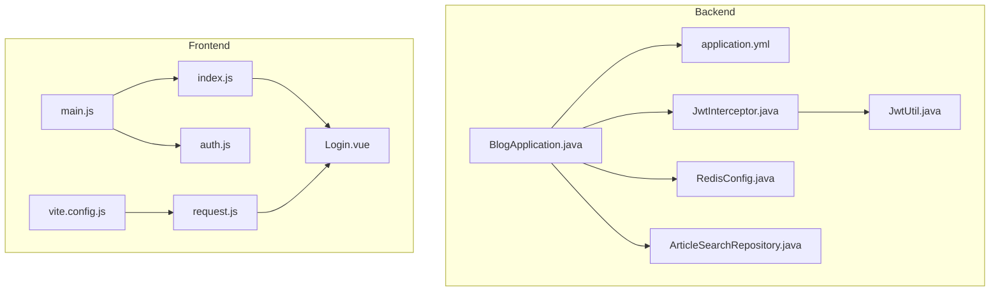

**Diagram sources**
- [BlogApplication.java:1-16](file://blog-backend/src/main/java/com/blog/BlogApplication.java#L1-L16)
- [application.yml:1-33](file://blog-backend/src/main/resources/application.yml#L1-L33)
- [JwtInterceptor.java:1-36](file://blog-backend/src/main/java/com/blog/config/JwtInterceptor.java#L1-L36)
- [JwtUtil.java:1-57](file://blog-backend/src/main/java/com/blog/util/JwtUtil.java#L1-L57)
- [RedisConfig.java:1-27](file://blog-backend/src/main/java/com/blog/config/RedisConfig.java#L1-L27)
- [ArticleSearchRepository.java:1-12](file://blog-backend/src/main/java/com/blog/repository/ArticleSearchRepository.java#L1-L12)
- [vite.config.js:1-21](file://blog-frontend/vite.config.js#L1-L21)
- [main.js:1-9](file://blog-frontend/src/main.js#L1-L9)
- [auth.js:1-19](file://blog-frontend/src/stores/auth.js#L1-L19)
- [index.js:1-74](file://blog-frontend/src/router/index.js#L1-L74)
- [request.js:1-33](file://blog-frontend/src/api/request.js#L1-L33)
- [Login.vue:1-83](file://blog-frontend/src/views/admin/Login.vue#L1-L83)

**Section sources**
- [pom.xml:1-111](file://blog-backend/pom.xml#L1-L111)
- [package.json:1-24](file://blog-frontend/package.json#L1-L24)

## Core Components
This section outlines the core technologies and their roles in the system.

- Backend
  - Spring Boot 3.2.5: Application framework providing auto-configuration, embedded server, and modular starters.
  - Java 17+: Language and runtime baseline ensuring modern features and performance.
  - MyBatis 3.0.3: SQL mapping and ORM for database interactions.
  - MySQL: Relational database for persistent storage.
  - Redis: Caching and session-like storage for performance and scalability.
  - Elasticsearch: Full-text search capabilities for articles.
  - JWT: Stateless authentication for admin endpoints.
  - Lombok: Reduces boilerplate code for entities and DTOs.
  - jjwt 0.12.5: JWT library for signing and validating tokens.
  - Spring Security Crypto: Cryptographic utilities for secure operations.

- Frontend
  - Vue.js 3.4.21: Progressive framework for building user interfaces.
  - Vue Router 4.3.0: Declarative routing for single-page navigation.
  - Pinia 2.1.7: Intuitive state management aligned with Vue 3.
  - Axios 1.6.8: HTTP client for API communication with interceptors.
  - WangEditor 5.1.23: Rich text editor for article composition.
  - Vite 5.2.0: Fast build tool and dev server with HMR.

Benefits and Compatibility
- Spring Boot 3.2.5 + Java 17+ ensures modern dependency management, performance, and security updates.
- MyBatis simplifies SQL-centric data access with XML/annotations.
- MySQL provides ACID compliance and mature tooling.
- Redis improves latency-sensitive operations via caching.
- Elasticsearch enables scalable full-text search.
- JWT enables secure, stateless admin authentication.
- Vue ecosystem components offer a cohesive developer experience with strong TypeScript interoperability.

Integration Patterns
- Frontend Axios requests are proxied to the backend API server.
- Authentication tokens are stored in local storage and attached to requests via interceptors.
- Admin routes are protected by route guards and backend JWT validation.
- Search queries leverage Elasticsearch repositories for fast retrieval.

**Section sources**
- [pom.xml:21-91](file://blog-backend/pom.xml#L21-L91)
- [application.yml:4-33](file://blog-backend/src/main/resources/application.yml#L4-L33)
- [package.json:11-22](file://blog-frontend/package.json#L11-L22)

## Architecture Overview
The system follows a classic web architecture:
- Frontend (Vue SPA) communicates with the backend via REST APIs.
- Backend exposes admin and public endpoints, secured by JWT.
- Data persistence uses MySQL with MyBatis mappers.
- Caching leverages Redis for performance.
- Search is powered by Elasticsearch.
- Development uses Vite with a proxy to the backend API server.

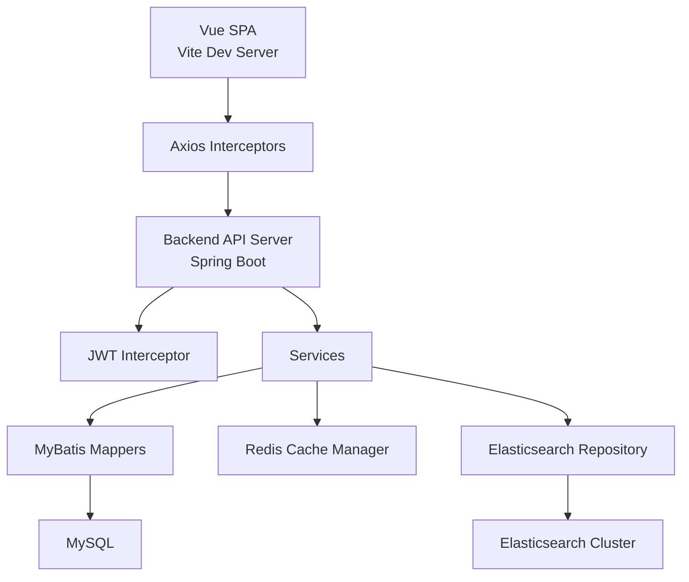

**Diagram sources**
- [vite.config.js:6-19](file://blog-frontend/vite.config.js#L6-L19)
- [request.js:4-18](file://blog-frontend/src/api/request.js#L4-L18)
- [JwtInterceptor.java:16-34](file://blog-backend/src/main/java/com/blog/config/JwtInterceptor.java#L16-L34)
- [BlogApplication.java:8-10](file://blog-backend/src/main/java/com/blog/BlogApplication.java#L8-L10)
- [RedisConfig.java:17-25](file://blog-backend/src/main/java/com/blog/config/RedisConfig.java#L17-L25)
- [ArticleSearchRepository.java:8-11](file://blog-backend/src/main/java/com/blog/repository/ArticleSearchRepository.java#L8-L11)
- [application.yml:6-19](file://blog-backend/src/main/resources/application.yml#L6-L19)

## Detailed Component Analysis

### Backend Technologies

#### Spring Boot Application Bootstrap
- Purpose: Initializes the Spring application context, enables MyBatis mappers scanning, and activates caching.
- Integration: Central entry point for the backend lifecycle.

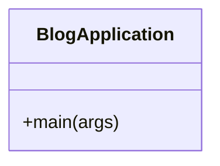

**Diagram sources**
- [BlogApplication.java:11-15](file://blog-backend/src/main/java/com/blog/BlogApplication.java#L11-L15)

**Section sources**
- [BlogApplication.java:1-16](file://blog-backend/src/main/java/com/blog/BlogApplication.java#L1-L16)

#### JWT Authentication Pipeline
- Purpose: Secure admin endpoints with bearer tokens.
- Components:
  - JwtInterceptor validates Authorization headers and delegates token verification to JwtUtil.
  - JwtUtil generates and validates tokens using HMAC-SHA with a configured secret and expiration.

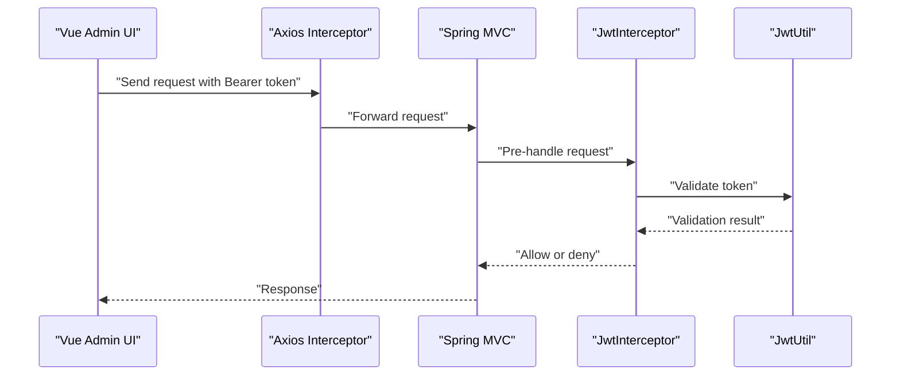

**Diagram sources**
- [JwtInterceptor.java:17-34](file://blog-backend/src/main/java/com/blog/config/JwtInterceptor.java#L17-L34)
- [JwtUtil.java:25-47](file://blog-backend/src/main/java/com/blog/util/JwtUtil.java#L25-L47)
- [request.js:12-14](file://blog-frontend/src/api/request.js#L12-L14)

**Section sources**
- [JwtInterceptor.java:1-36](file://blog-backend/src/main/java/com/blog/config/JwtInterceptor.java#L1-L36)
- [JwtUtil.java:1-57](file://blog-backend/src/main/java/com/blog/util/JwtUtil.java#L1-L57)
- [application.yml:27-30](file://blog-backend/src/main/resources/application.yml#L27-L30)

#### Redis Caching Configuration
- Purpose: Provide application-level caching with JSON serialization and TTL.
- Integration: Enables caching annotations and cache manager bean for improved read performance.

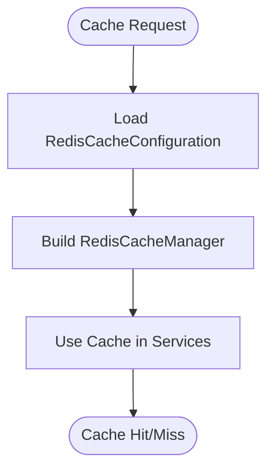

**Diagram sources**
- [RedisConfig.java:17-25](file://blog-backend/src/main/java/com/blog/config/RedisConfig.java#L17-L25)

**Section sources**
- [RedisConfig.java:1-27](file://blog-backend/src/main/java/com/blog/config/RedisConfig.java#L1-L27)
- [BlogApplication.java:6](file://blog-backend/src/main/java/com/blog/BlogApplication.java#L6)

#### Elasticsearch Search Repository
- Purpose: Enable full-text search on article titles and content.
- Integration: Provides method-level search queries backed by Elasticsearch indices.

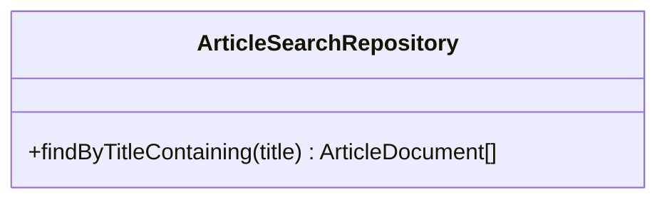

**Diagram sources**
- [ArticleSearchRepository.java:8-11](file://blog-backend/src/main/java/com/blog/repository/ArticleSearchRepository.java#L8-L11)

**Section sources**
- [ArticleSearchRepository.java:1-12](file://blog-backend/src/main/java/com/blog/repository/ArticleSearchRepository.java#L1-L12)
- [application.yml:18-19](file://blog-backend/src/main/resources/application.yml#L18-L19)

#### Database and ORM Configuration
- Purpose: Configure JDBC data source, MyBatis mapper locations, and naming strategy.
- Integration: Maps SQL statements to Java interfaces and entities for CRUD operations.

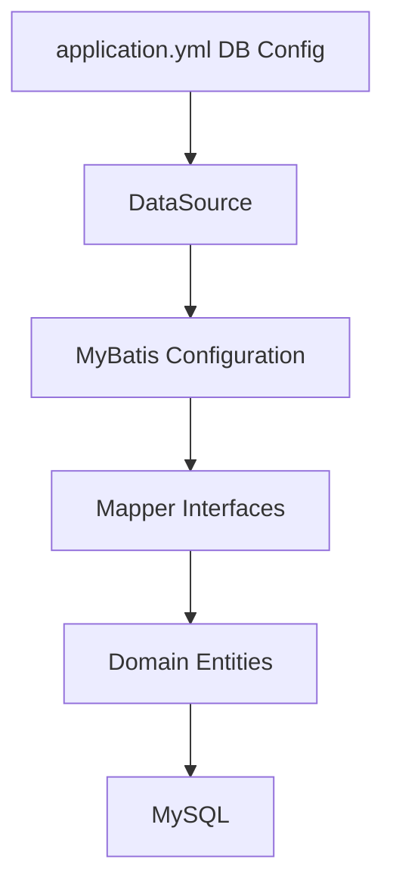

**Diagram sources**
- [application.yml:6-25](file://blog-backend/src/main/resources/application.yml#L6-L25)

**Section sources**
- [application.yml:1-33](file://blog-backend/src/main/resources/application.yml#L1-L33)

### Frontend Technologies

#### Application Bootstrap and Plugins
- Purpose: Initialize Vue app, register Pinia, and install Vue Router.
- Integration: Sets up global styles and editor CSS for proper rendering.

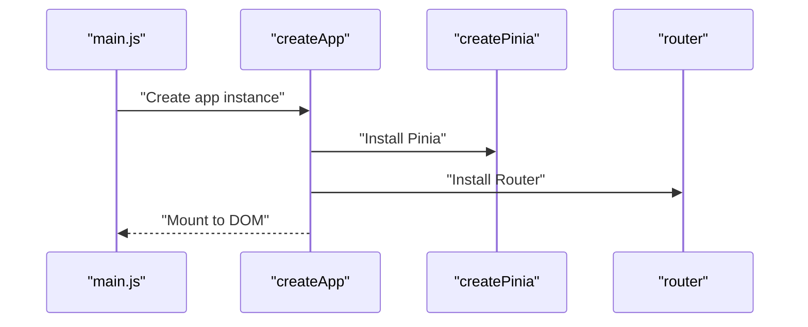

**Diagram sources**
- [main.js:1-9](file://blog-frontend/src/main.js#L1-L9)

**Section sources**
- [main.js:1-9](file://blog-frontend/src/main.js#L1-L9)

#### Authentication Store (Pinia)
- Purpose: Manage JWT token lifecycle using localStorage.
- Integration: Provides token getter/setter/logout actions consumed by components and interceptors.

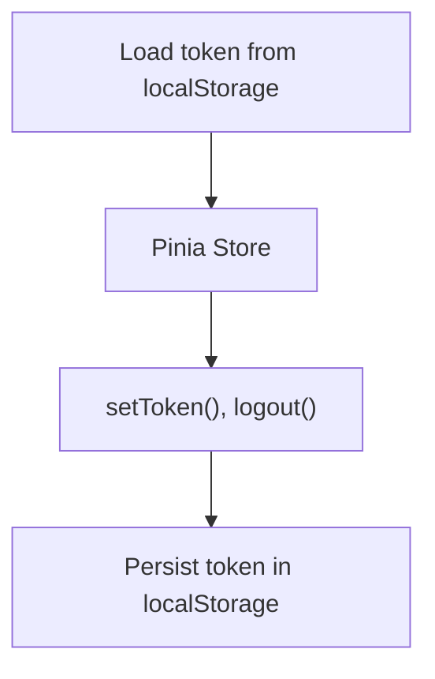

**Diagram sources**
- [auth.js:5-15](file://blog-frontend/src/stores/auth.js#L5-L15)

**Section sources**
- [auth.js:1-19](file://blog-frontend/src/stores/auth.js#L1-L19)

#### Router Guards and Admin Routes
- Purpose: Protect admin routes and redirect unauthenticated users to login.
- Integration: Uses Pinia store to check token presence before navigation.

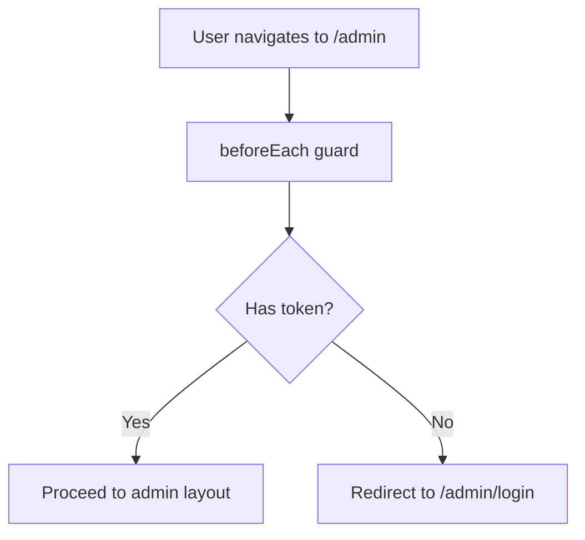

**Diagram sources**
- [index.js:64-71](file://blog-frontend/src/router/index.js#L64-L71)

**Section sources**
- [index.js:1-74](file://blog-frontend/src/router/index.js#L1-L74)

#### HTTP Client and Interceptors
- Purpose: Centralize API base URL, attach Authorization headers, and handle 401 responses.
- Integration: Axios instance shared across API modules; interceptor reads token from Pinia store.

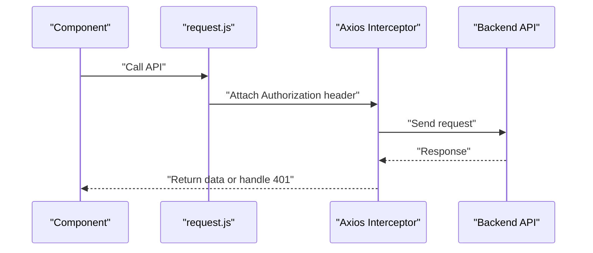

**Diagram sources**
- [request.js:4-18](file://blog-frontend/src/api/request.js#L4-L18)
- [request.js:20-30](file://blog-frontend/src/api/request.js#L20-L30)

**Section sources**
- [request.js:1-33](file://blog-frontend/src/api/request.js#L1-L33)

#### Admin Login Flow
- Purpose: Authenticate admin user and persist token.
- Integration: Calls admin login API, sets token in store, and navigates to admin dashboard.

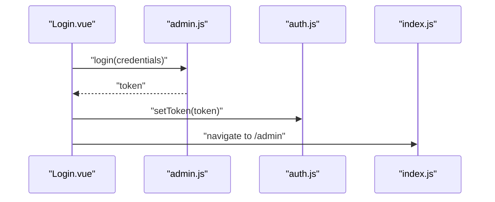

**Diagram sources**
- [Login.vue:32-41](file://blog-frontend/src/views/admin/Login.vue#L32-L41)
- [auth.js:7-10](file://blog-frontend/src/stores/auth.js#L7-L10)
- [index.js:36-38](file://blog-frontend/src/router/index.js#L36-L38)

**Section sources**
- [Login.vue:1-83](file://blog-frontend/src/views/admin/Login.vue#L1-L83)

#### Editor Integration (WangEditor)
- Purpose: Rich text editing for composing articles.
- Integration: Editor components are integrated into article edit pages and styled globally.

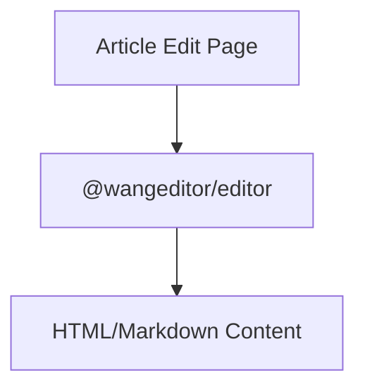

**Diagram sources**
- [main.js:6](file://blog-frontend/src/main.js#L6)
- [package.json:16-17](file://blog-frontend/package.json#L16-L17)

**Section sources**
- [main.js:1-9](file://blog-frontend/src/main.js#L1-L9)
- [package.json:11-22](file://blog-frontend/package.json#L11-L22)

## Dependency Analysis
This section maps the major dependencies and their relationships.

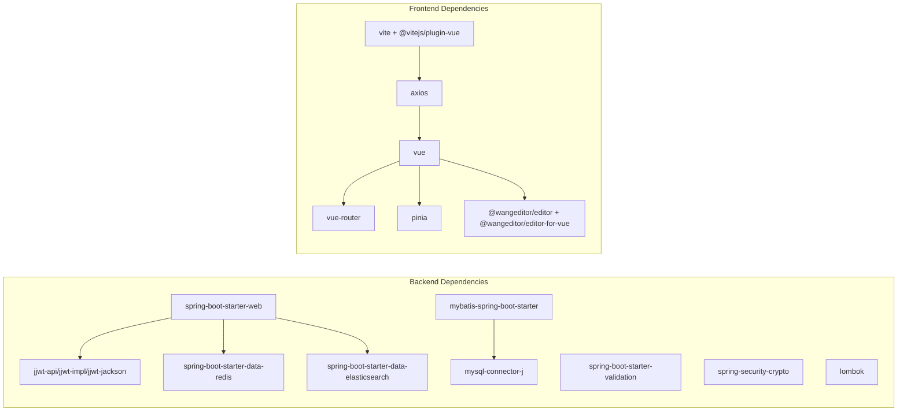

**Diagram sources**
- [pom.xml:25-91](file://blog-backend/pom.xml#L25-L91)
- [package.json:11-22](file://blog-frontend/package.json#L11-L22)

**Section sources**
- [pom.xml:1-111](file://blog-backend/pom.xml#L1-L111)
- [package.json:1-24](file://blog-frontend/package.json#L1-L24)

## Performance Considerations
- Caching: Redis cache manager is configured with a TTL and JSON serialization to reduce database load and improve response times.
- Database Naming: MyBatis camelCase mapping reduces manual field mapping overhead.
- Search: Elasticsearch repository provides efficient full-text search queries.
- Frontend Proxy: Vite proxy avoids CORS complexities during development and centralizes API routing.
- Token Validation: JWT validation occurs early in the request pipeline to fail fast on invalid tokens.

[No sources needed since this section provides general guidance]

## Troubleshooting Guide
Common issues and resolutions:
- Unauthorized Access
  - Symptom: 401 responses on admin routes.
  - Cause: Missing or invalid Authorization header.
  - Resolution: Ensure token is present in interceptors and valid via JwtUtil; verify backend JwtInterceptor configuration.

- JWT Token Expiration
  - Symptom: Requests fail after token expiration.
  - Cause: Token validation fails.
  - Resolution: Regenerate token using JwtUtil with current secret and expiration settings.

- Redis Connectivity
  - Symptom: Cache operations fail.
  - Cause: Redis server unreachable or misconfigured.
  - Resolution: Verify host, port, and database settings in application.yml; confirm RedisConfig bean initialization.

- Elasticsearch Connectivity
  - Symptom: Search queries fail.
  - Cause: Elasticsearch server unreachable or incorrect URIs.
  - Resolution: Confirm application.yml Elasticsearch URIs and cluster availability.

- Frontend Authentication Redirect Loop
  - Symptom: Navigating to admin routes redirects to login.
  - Cause: Missing token in Pinia store or localStorage.
  - Resolution: Ensure login flow sets token in auth store and localStorage; verify router beforeEach guard logic.

**Section sources**
- [JwtInterceptor.java:17-34](file://blog-backend/src/main/java/com/blog/config/JwtInterceptor.java#L17-L34)
- [JwtUtil.java:40-47](file://blog-backend/src/main/java/com/blog/util/JwtUtil.java#L40-L47)
- [application.yml:14-19](file://blog-backend/src/main/resources/application.yml#L14-L19)
- [RedisConfig.java:17-25](file://blog-backend/src/main/java/com/blog/config/RedisConfig.java#L17-L25)
- [application.yml:18-19](file://blog-backend/src/main/resources/application.yml#L18-L19)
- [auth.js:5-15](file://blog-frontend/src/stores/auth.js#L5-L15)
- [index.js:64-71](file://blog-frontend/src/router/index.js#L64-L71)

## Conclusion
The my-Blob blog management system leverages a modern, cohesive stack:
- Backend: Spring Boot 3.2.5 with Java 17+ provides a robust foundation; MyBatis, Redis, and Elasticsearch deliver efficient persistence, caching, and search; JWT secures admin workflows.
- Frontend: Vue 3 with Vue Router, Pinia, Axios, and WangEditor creates a responsive admin experience with strong developer ergonomics.
Together, these technologies enable scalable, maintainable, and user-friendly blog management functionality.

[No sources needed since this section summarizes without analyzing specific files]