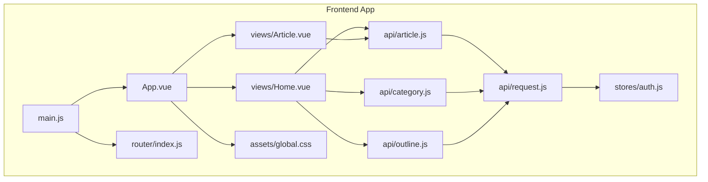
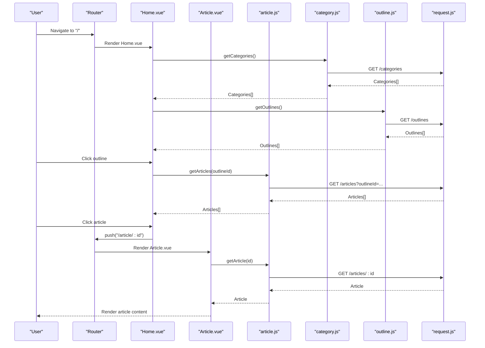
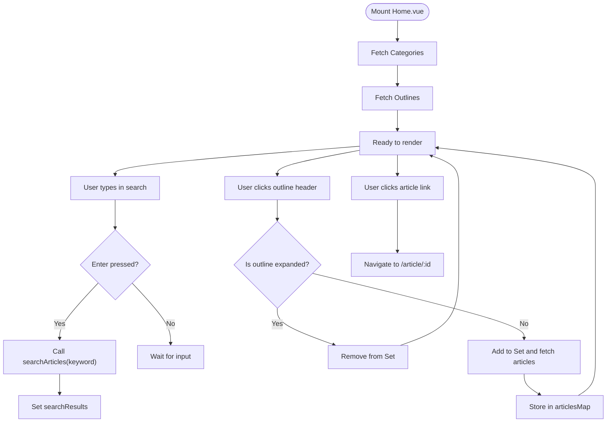
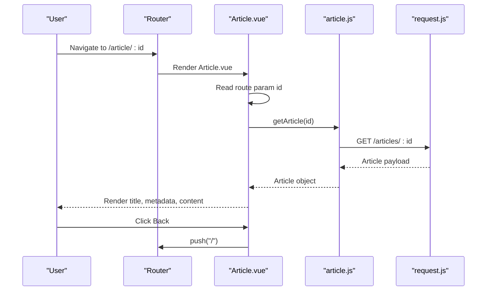
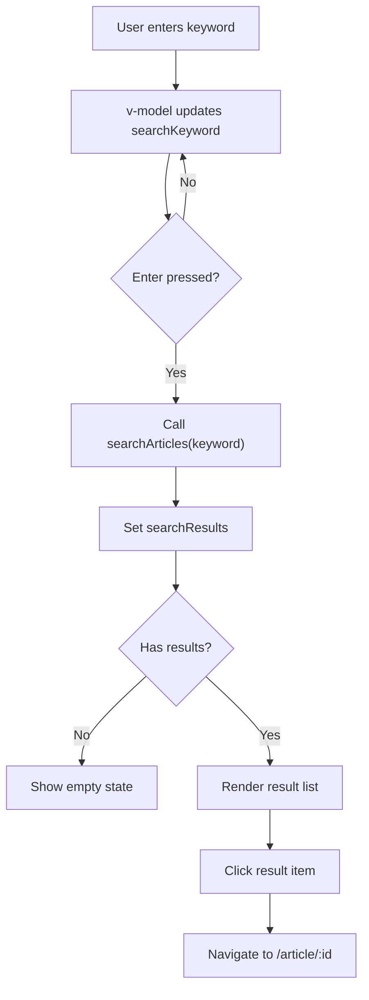
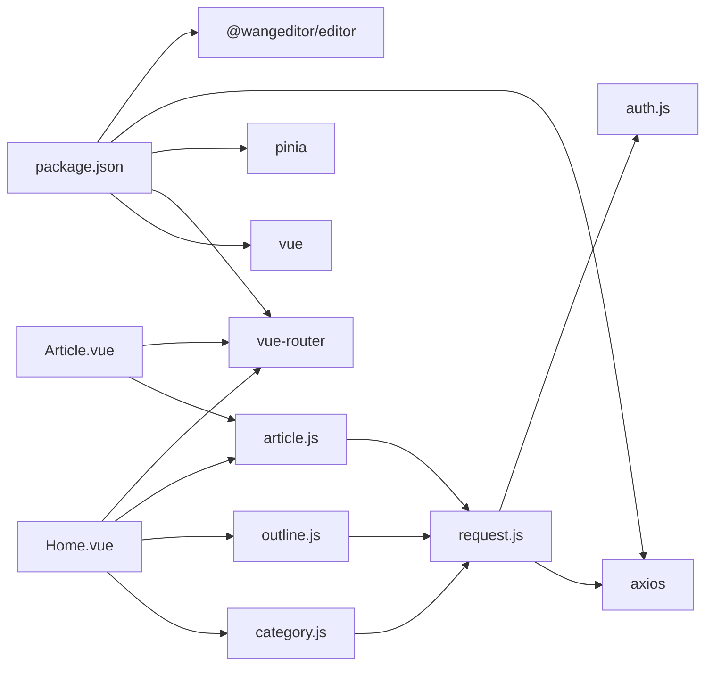

# Public Blog Interface

<cite>
**Referenced Files in This Document**
- [Home.vue](file://blog-frontend/src/views/Home.vue)
- [Article.vue](file://blog-frontend/src/views/Article.vue)
- [article.js](file://blog-frontend/src/api/article.js)
- [category.js](file://blog-frontend/src/api/category.js)
- [outline.js](file://blog-frontend/src/api/outline.js)
- [request.js](file://blog-frontend/src/api/request.js)
- [index.js](file://blog-frontend/src/router/index.js)
- [auth.js](file://blog-frontend/src/stores/auth.js)
- [App.vue](file://blog-frontend/src/App.vue)
- [main.js](file://blog-frontend/src/main.js)
- [global.css](file://blog-frontend/src/assets/global.css)
- [package.json](file://blog-frontend/package.json)
</cite>

## Table of Contents
1. [Introduction](#introduction)
2. [Project Structure](#project-structure)
3. [Core Components](#core-components)
4. [Architecture Overview](#architecture-overview)
5. [Detailed Component Analysis](#detailed-component-analysis)
6. [Dependency Analysis](#dependency-analysis)
7. [Performance Considerations](#performance-considerations)
8. [Troubleshooting Guide](#troubleshooting-guide)
9. [Conclusion](#conclusion)
10. [Appendices](#appendices)

## Introduction
This document describes the public blog interface built with Vue.js. It focuses on three primary components:
- Home page component with category listings and article previews
- Article view component with rich content display
- Search functionality implementation

It documents component props, data fetching patterns, user interaction flows, API integration, responsive design, and UX optimization guidelines. The goal is to help developers understand how to extend, maintain, and optimize the public-facing blog interface.

## Project Structure
The public blog interface resides in the blog-frontend directory and is structured around:
- Views: Home.vue and Article.vue implement the public pages
- API layer: article.js, category.js, outline.js wrap HTTP requests via request.js
- Routing: index.js defines public routes and admin guards
- State: auth.js manages authentication tokens via Pinia
- Application bootstrap: main.js wires up Vue, Pinia, and Router
- Global styles: global.css provides shared UI primitives and responsive design

**Diagram sources**
- [main.js:1-9](file://blog-frontend/src/main.js#L1-L9)
- [App.vue:1-12](file://blog-frontend/src/App.vue#L1-L12)
- [index.js:1-74](file://blog-frontend/src/router/index.js#L1-L74)
- [Home.vue:1-263](file://blog-frontend/src/views/Home.vue#L1-L263)
- [Article.vue:1-144](file://blog-frontend/src/views/Article.vue#L1-L144)
- [article.js:1-14](file://blog-frontend/src/api/article.js#L1-L14)
- [category.js:1-10](file://blog-frontend/src/api/category.js#L1-L10)
- [outline.js:1-10](file://blog-frontend/src/api/outline.js#L1-L10)
- [request.js:1-33](file://blog-frontend/src/api/request.js#L1-L33)
- [auth.js:1-19](file://blog-frontend/src/stores/auth.js#L1-L19)
- [global.css:1-76](file://blog-frontend/src/assets/global.css#L1-L76)

**Section sources**
- [main.js:1-9](file://blog-frontend/src/main.js#L1-L9)
- [App.vue:1-12](file://blog-frontend/src/App.vue#L1-L12)
- [index.js:1-74](file://blog-frontend/src/router/index.js#L1-L74)
- [Home.vue:1-263](file://blog-frontend/src/views/Home.vue#L1-L263)
- [Article.vue:1-144](file://blog-frontend/src/views/Article.vue#L1-L144)
- [article.js:1-14](file://blog-frontend/src/api/article.js#L1-L14)
- [category.js:1-10](file://blog-frontend/src/api/category.js#L1-L10)
- [outline.js:1-10](file://blog-frontend/src/api/outline.js#L1-L10)
- [request.js:1-33](file://blog-frontend/src/api/request.js#L1-L33)
- [auth.js:1-19](file://blog-frontend/src/stores/auth.js#L1-L19)
- [global.css:1-76](file://blog-frontend/src/assets/global.css#L1-L76)

## Core Components
This section summarizes the responsibilities and key behaviors of the public components.

- Home.vue
  - Renders the public homepage with a header, search bar, category sections, and outline-based article lists
  - Implements lazy loading of articles per outline and expandable/collapsible outlines
  - Provides search results and navigates to article pages
  - Uses scoped styles and responsive breakpoints

- Article.vue
  - Displays a single article with title, metadata, and rendered HTML content
  - Provides a back navigation to the home page
  - Applies deep selectors for rich content styling

- API Layer
  - article.js: exposes getArticles(outlineId), getArticle(id), searchArticles(keyword)
  - category.js: exposes getCategories()
  - outline.js: exposes getOutlines(categoryId)
  - request.js: centralizes HTTP client with base URL and auth interceptor

- Router
  - index.js: defines public routes for Home and Article, plus admin routes with authentication guard

- State Management
  - auth.js: Pinia store managing JWT token persistence and logout

**Section sources**
- [Home.vue:1-263](file://blog-frontend/src/views/Home.vue#L1-L263)
- [Article.vue:1-144](file://blog-frontend/src/views/Article.vue#L1-L144)
- [article.js:1-14](file://blog-frontend/src/api/article.js#L1-L14)
- [category.js:1-10](file://blog-frontend/src/api/category.js#L1-L10)
- [outline.js:1-10](file://blog-frontend/src/api/outline.js#L1-L10)
- [request.js:1-33](file://blog-frontend/src/api/request.js#L1-L33)
- [index.js:1-74](file://blog-frontend/src/router/index.js#L1-L74)
- [auth.js:1-19](file://blog-frontend/src/stores/auth.js#L1-L19)

## Architecture Overview
The public blog interface follows a layered architecture:
- Presentation layer: Vue components (Home.vue, Article.vue)
- API abstraction: request.js wraps axios with interceptors
- Data access: article.js, category.js, outline.js export functions that call request.js
- Navigation: vue-router routes to components
- State: Pinia store for authentication token

**Diagram sources**
- [index.js:1-74](file://blog-frontend/src/router/index.js#L1-L74)
- [Home.vue:66-118](file://blog-frontend/src/views/Home.vue#L66-L118)
- [Article.vue:17-40](file://blog-frontend/src/views/Article.vue#L17-L40)
- [article.js:1-14](file://blog-frontend/src/api/article.js#L1-L14)
- [category.js:1-10](file://blog-frontend/src/api/category.js#L1-L10)
- [outline.js:1-10](file://blog-frontend/src/api/outline.js#L1-L10)
- [request.js:1-33](file://blog-frontend/src/api/request.js#L1-L33)

## Detailed Component Analysis

### Home.vue
Responsibilities:
- Load categories and outlines on mount
- Manage search input and results
- Expand/collapse outlines and lazily load articles
- Navigate to article view

Key reactive state:
- categories: Array of categories
- outlines: Array of outlines
- articlesMap: Map<outlineId, Article[]>
- expandedOutlines: Set<outlineId>
- searchKeyword: String
- searchResults: Array of search result items

Data fetching patterns:
- onMounted: fetch categories and outlines
- toggleOutline: conditionally fetch articles for an outline and cache them in articlesMap
- handleSearch: call searchArticles and update searchResults

User interactions:
- Enter key in search input triggers search
- Clicking a result item navigates to the article route
- Clicking outline header toggles visibility and loads articles if needed
- Clicking an article link navigates to the article route

Props:
- None (no props are defined)

API integration:
- getCategories -> GET /categories
- getOutlines -> GET /outlines
- getArticles(outlineId) -> GET /articles?outlineId=...
- searchArticles(keyword) -> GET /search?keyword=...

Responsive design:
- Media query adjusts padding and typography for mobile screens

**Diagram sources**
- [Home.vue:81-118](file://blog-frontend/src/views/Home.vue#L81-L118)
- [article.js:3-7](file://blog-frontend/src/api/article.js#L3-L7)
- [category.js:3](file://blog-frontend/src/api/category.js#L3)
- [outline.js:3](file://blog-frontend/src/api/outline.js#L3)

**Section sources**
- [Home.vue:1-263](file://blog-frontend/src/views/Home.vue#L1-L263)
- [article.js:1-14](file://blog-frontend/src/api/article.js#L1-L14)
- [category.js:1-10](file://blog-frontend/src/api/category.js#L1-L10)
- [outline.js:1-10](file://blog-frontend/src/api/outline.js#L1-L10)

### Article.vue
Responsibilities:
- Fetch and display a single article by ID from route params
- Render formatted dates and rich HTML content
- Provide a back button to return to the home page

Key reactive state:
- article: Object representing the fetched article

Data fetching patterns:
- onMounted: read route param id and call getArticle(id)

User interactions:
- Back button navigates to home route

Props:
- None (no props are defined)

API integration:
- getArticle(id) -> GET /articles/:id

Rich content rendering:
- Uses v-html to render article content
- Deep selectors style headings, paragraphs, images, code blocks, and blockquotes

Responsive design:
- Adjusts container padding and title size on smaller screens

**Diagram sources**
- [index.js:10-14](file://blog-frontend/src/router/index.js#L10-L14)
- [Article.vue:17-40](file://blog-frontend/src/views/Article.vue#L17-L40)
- [article.js:5](file://blog-frontend/src/api/article.js#L5)
- [request.js:1-33](file://blog-frontend/src/api/request.js#L1-L33)

**Section sources**
- [Article.vue:1-144](file://blog-frontend/src/views/Article.vue#L1-L144)
- [article.js:1-14](file://blog-frontend/src/api/article.js#L1-L14)
- [request.js:1-33](file://blog-frontend/src/api/request.js#L1-L33)

### Search Functionality
Implementation highlights:
- Two-way binding on searchKeyword
- Enter key triggers search
- searchArticles(keyword) returns results with a results array property
- Clicking a result navigates to the article route

Integration points:
- Home.vue handles input and results
- article.js provides searchArticles
- request.js applies base URL and auth headers

**Diagram sources**
- [Home.vue:8-28](file://blog-frontend/src/views/Home.vue#L8-L28)
- [article.js:7](file://blog-frontend/src/api/article.js#L7)

**Section sources**
- [Home.vue:8-28](file://blog-frontend/src/views/Home.vue#L8-L28)
- [article.js:7](file://blog-frontend/src/api/article.js#L7)

## Dependency Analysis
External libraries and their roles:
- vue: framework runtime and composition API
- vue-router: routing and navigation
- pinia: state management for auth token
- axios: HTTP client
- @wangeditor/editor: editor styles (loaded globally)

Internal dependencies:
- Home.vue depends on category.js, outline.js, article.js, and vue-router
- Article.vue depends on article.js and vue-router
- request.js depends on axios and auth.js
- index.js depends on auth store for admin route protection

**Diagram sources**
- [package.json:11-22](file://blog-frontend/package.json#L11-L22)
- [Home.vue:66-71](file://blog-frontend/src/views/Home.vue#L66-L71)
- [Article.vue:18-20](file://blog-frontend/src/views/Article.vue#L18-L20)
- [article.js:1](file://blog-frontend/src/api/article.js#L1)
- [category.js:1](file://blog-frontend/src/api/category.js#L1)
- [outline.js:1](file://blog-frontend/src/api/outline.js#L1)
- [request.js:1](file://blog-frontend/src/api/request.js#L1)
- [auth.js:1](file://blog-frontend/src/stores/auth.js#L1)

**Section sources**
- [package.json:11-22](file://blog-frontend/package.json#L11-L22)
- [Home.vue:66-71](file://blog-frontend/src/views/Home.vue#L66-L71)
- [Article.vue:18-20](file://blog-frontend/src/views/Article.vue#L18-L20)
- [article.js:1](file://blog-frontend/src/api/article.js#L1)
- [category.js:1](file://blog-frontend/src/api/category.js#L1)
- [outline.js:1](file://blog-frontend/src/api/outline.js#L1)
- [request.js:1](file://blog-frontend/src/api/request.js#L1)
- [auth.js:1](file://blog-frontend/src/stores/auth.js#L1)

## Performance Considerations
- Lazy loading of articles per outline
  - Benefit: reduces initial payload and improves perceived performance
  - Implementation: fetch articles only when an outline is expanded and cache them in articlesMap
  - Reference: [Home.vue:90-104](file://blog-frontend/src/views/Home.vue#L90-L104)

- Minimal reactivity churn
  - Use Set for expanded outlines and Map for cached articles to avoid unnecessary renders
  - Reference: [Home.vue:74-79](file://blog-frontend/src/views/Home.vue#L74-L79)

- Efficient DOM updates
  - Conditional rendering with v-if for search results and outline content prevents rendering unused nodes
  - Reference: [Home.vue:18-28](file://blog-frontend/src/views/Home.vue#L18-L28), [Home.vue:48-58](file://blog-frontend/src/views/Home.vue#L48-L58)

- Responsive design
  - Media queries reduce padding and adjust typography for mobile devices
  - Reference: [Home.vue:253-261](file://blog-frontend/src/views/Home.vue#L253-L261), [Article.vue:130-142](file://blog-frontend/src/views/Article.vue#L130-L142)

- HTTP client configuration
  - Centralized baseURL and timeout in request.js
  - Reference: [request.js:4-7](file://blog-frontend/src/api/request.js#L4-L7)

- Authentication caching
  - Token persisted in localStorage via auth store
  - Reference: [auth.js:5](file://blog-frontend/src/stores/auth.js#L5)

[No sources needed since this section provides general guidance]

## Troubleshooting Guide
Common issues and resolutions:
- 401 Unauthorized during admin requests
  - Symptom: Requests fail with 401
  - Cause: Missing or expired token
  - Resolution: request.js clears token and redirects to admin login
  - Reference: [request.js:20-29](file://blog-frontend/src/api/request.js#L20-L29)

- Empty search results
  - Symptom: Search returns no results
  - Cause: Empty keyword or backend returning empty results
  - Resolution: Ensure keyword is trimmed and backend search endpoint returns results array
  - Reference: [Home.vue:110-117](file://blog-frontend/src/views/Home.vue#L110-L117), [article.js:7](file://blog-frontend/src/api/article.js#L7)

- Article not found
  - Symptom: Navigating to /article/:id fails
  - Cause: Backend does not serve article by ID
  - Resolution: Verify backend route and data availability
  - Reference: [index.js:10-14](file://blog-frontend/src/router/index.js#L10-L14), [article.js:5](file://blog-frontend/src/api/article.js#L5)

- Route guard blocking admin access
  - Symptom: Accessing admin routes redirects to login
  - Cause: requiresAuth meta and missing token
  - Resolution: Authenticate and store token in auth store
  - Reference: [index.js:64-71](file://blog-frontend/src/router/index.js#L64-L71), [auth.js:5](file://blog-frontend/src/stores/auth.js#L5)

**Section sources**
- [request.js:20-29](file://blog-frontend/src/api/request.js#L20-L29)
- [Home.vue:110-117](file://blog-frontend/src/views/Home.vue#L110-L117)
- [article.js:5-7](file://blog-frontend/src/api/article.js#L5-L7)
- [index.js:10-14](file://blog-frontend/src/router/index.js#L10-L14)
- [index.js:64-71](file://blog-frontend/src/router/index.js#L64-L71)
- [auth.js:5](file://blog-frontend/src/stores/auth.js#L5)

## Conclusion
The public blog interface is a modular, performance-conscious Vue.js application. The Home.vue component efficiently organizes content by categories and outlines, defers article loading until needed, and integrates search seamlessly. The Article.vue component delivers rich content with thoughtful styling and responsive adjustments. The API layer centralizes HTTP concerns and authentication, while the router enforces admin access control. Together, these components provide a solid foundation for content discovery and consumption.

[No sources needed since this section summarizes without analyzing specific files]

## Appendices

### API Integration Patterns
- Base URL and interceptors
  - baseURL: "/api"
  - Authorization header injection when token exists
  - 401 handling clears token and redirects to admin login
  - Reference: [request.js:4-30](file://blog-frontend/src/api/request.js#L4-L30)

- Public endpoints used by components
  - GET /categories
  - GET /outlines
  - GET /articles?outlineId=...
  - GET /articles/:id
  - GET /search?keyword=...
  - Reference: [category.js:3](file://blog-frontend/src/api/category.js#L3), [outline.js:3](file://blog-frontend/src/api/outline.js#L3), [article.js:3-7](file://blog-frontend/src/api/article.js#L3-L7)

**Section sources**
- [request.js:4-30](file://blog-frontend/src/api/request.js#L4-L30)
- [category.js:3](file://blog-frontend/src/api/category.js#L3)
- [outline.js:3](file://blog-frontend/src/api/outline.js#L3)
- [article.js:3-7](file://blog-frontend/src/api/article.js#L3-L7)

### Usage Examples and Best Practices
- Navigating from home to article
  - Use router.push with the article route pattern
  - Reference: [Home.vue:106-108](file://blog-frontend/src/views/Home.vue#L106-L108)

- Back navigation in article view
  - Use router.push to return to home
  - Reference: [Article.vue:31-33](file://blog-frontend/src/views/Article.vue#L31-L33)

- Content presentation guidelines
  - Use deep selectors for rich content styling
  - Reference: [Article.vue:91-128](file://blog-frontend/src/views/Article.vue#L91-L128)

- Responsive design guidelines
  - Apply media queries for mobile-first adjustments
  - Reference: [Home.vue:253-261](file://blog-frontend/src/views/Home.vue#L253-L261), [Article.vue:130-142](file://blog-frontend/src/views/Article.vue#L130-L142)

- Component composition tips
  - Keep components focused: Home for listing, Article for display
  - Share UI primitives via global.css
  - Reference: [global.css:14-75](file://blog-frontend/src/assets/global.css#L14-L75)

**Section sources**
- [Home.vue:106-108](file://blog-frontend/src/views/Home.vue#L106-L108)
- [Article.vue:31-33](file://blog-frontend/src/views/Article.vue#L31-L33)
- [Article.vue:91-128](file://blog-frontend/src/views/Article.vue#L91-L128)
- [Home.vue:253-261](file://blog-frontend/src/views/Home.vue#L253-L261)
- [Article.vue:130-142](file://blog-frontend/src/views/Article.vue#L130-L142)
- [global.css:14-75](file://blog-frontend/src/assets/global.css#L14-L75)