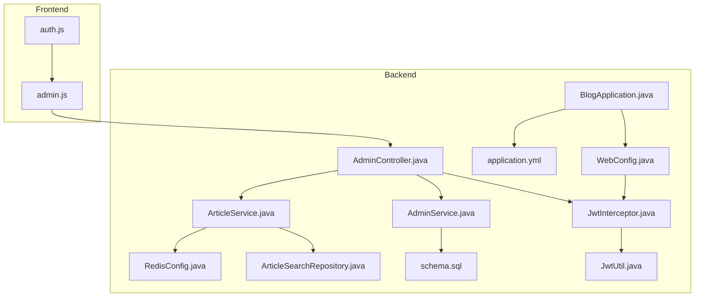
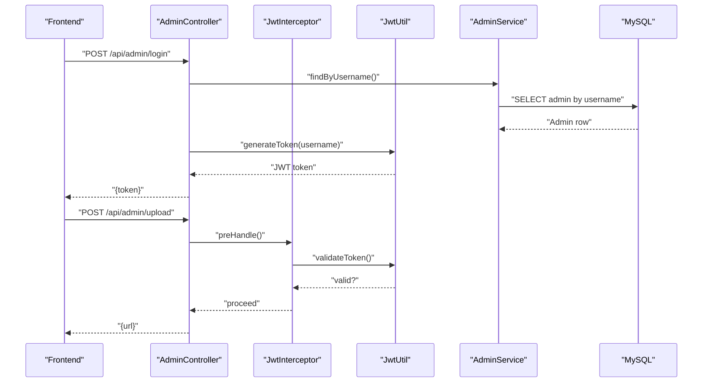
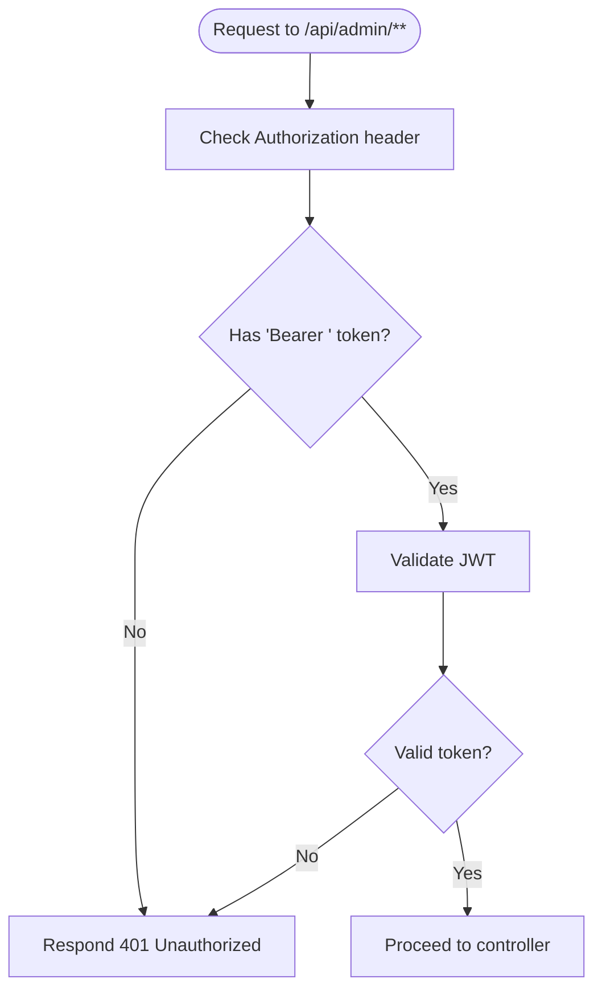
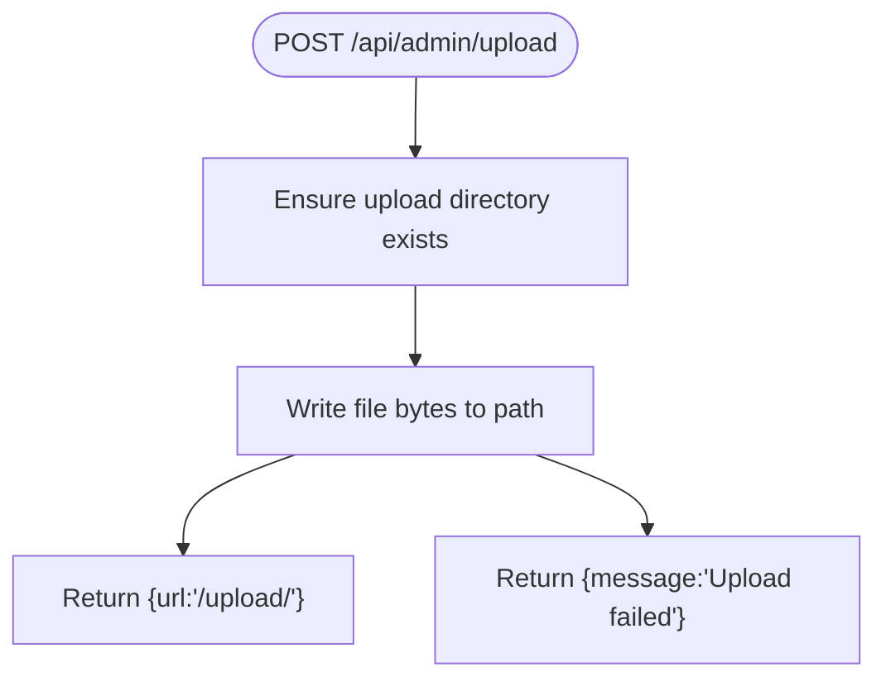
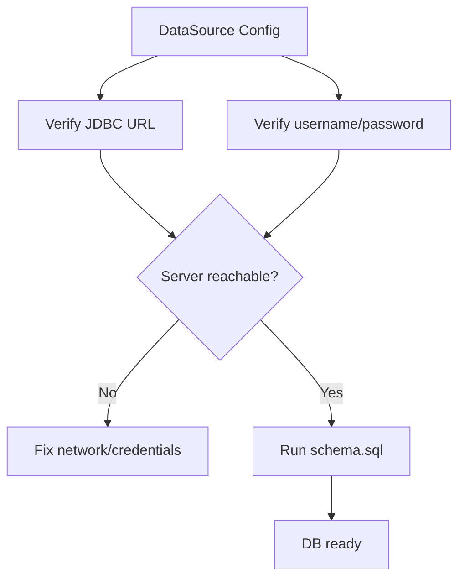
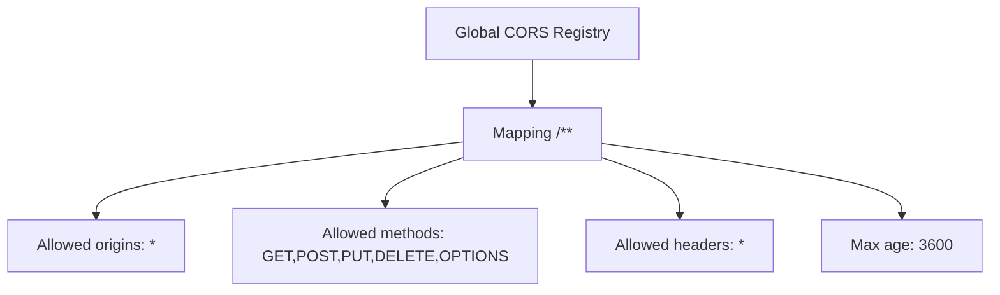
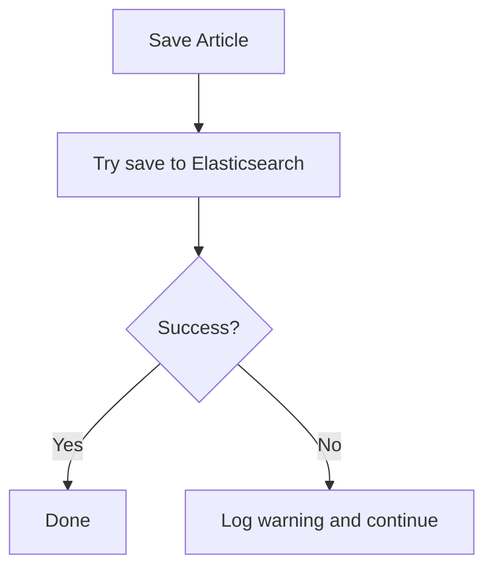
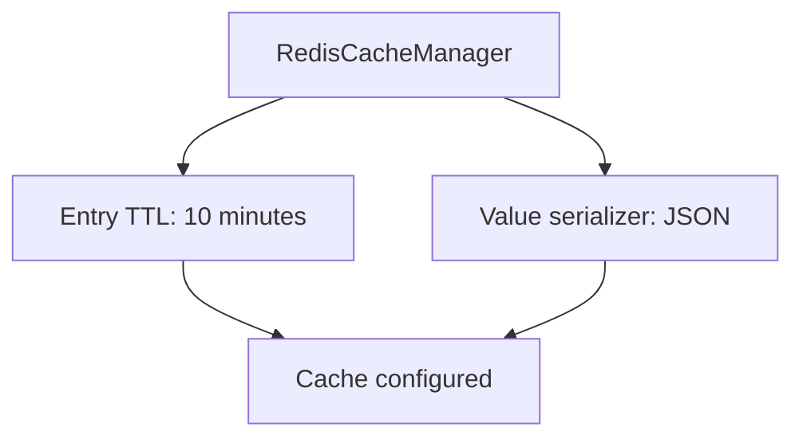
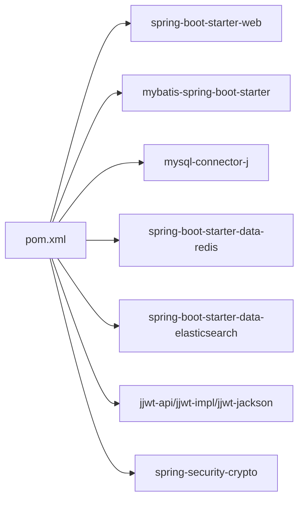

# Troubleshooting & FAQ

<cite>
**Referenced Files in This Document**
- [application.yml](file://blog-backend/src/main/resources/application.yml)
- [BlogApplication.java](file://blog-backend/src/main/java/com/blog/BlogApplication.java)
- [WebConfig.java](file://blog-backend/src/main/java/com/blog/config/WebConfig.java)
- [JwtInterceptor.java](file://blog-backend/src/main/java/com/blog/config/JwtInterceptor.java)
- [JwtUtil.java](file://blog-backend/src/main/java/com/blog/util/JwtUtil.java)
- [AdminController.java](file://blog-backend/src/main/java/com/blog/controller/AdminController.java)
- [AdminService.java](file://blog-backend/src/main/java/com/blog/service/AdminService.java)
- [ArticleService.java](file://blog-backend/src/main/java/com/blog/service/ArticleService.java)
- [ArticleSearchRepository.java](file://blog-backend/src/main/java/com/blog/repository/ArticleSearchRepository.java)
- [RedisConfig.java](file://blog-backend/src/main/java/com/blog/config/RedisConfig.java)
- [schema.sql](file://blog-backend/src/main/resources/schema.sql)
- [pom.xml](file://blog-backend/pom.xml)
- [auth.js](file://blog-frontend/src/stores/auth.js)
- [admin.js](file://blog-frontend/src/api/admin.js)
</cite>

## Table of Contents
1. [Introduction](#introduction)
2. [Project Structure](#project-structure)
3. [Core Components](#core-components)
4. [Architecture Overview](#architecture-overview)
5. [Detailed Component Analysis](#detailed-component-analysis)
6. [Dependency Analysis](#dependency-analysis)
7. [Performance Considerations](#performance-considerations)
8. [Troubleshooting Guide](#troubleshooting-guide)
9. [FAQ](#faq)
10. [Conclusion](#conclusion)

## Introduction
This document provides comprehensive troubleshooting guidance and frequently asked questions for the my-Blob blog system. It focuses on diagnosing and resolving common issues such as authentication failures, database connectivity errors, file upload problems, and CORS misconfigurations. It also covers logging and diagnostics, performance tuning, memory optimization, scaling considerations, and escalation procedures.

## Project Structure
The system consists of:
- A Spring Boot backend exposing administrative APIs, JWT-based authentication, file upload handling, caching via Redis, and Elasticsearch-backed article indexing.
- A Vue-based frontend that authenticates administrators and uploads media.

**Diagram sources**
- [BlogApplication.java:1-16](file://blog-backend/src/main/java/com/blog/BlogApplication.java#L1-L16)
- [WebConfig.java:1-39](file://blog-backend/src/main/java/com/blog/config/WebConfig.java#L1-L39)
- [JwtInterceptor.java:1-36](file://blog-backend/src/main/java/com/blog/config/JwtInterceptor.java#L1-L36)
- [JwtUtil.java:1-57](file://blog-backend/src/main/java/com/blog/util/JwtUtil.java#L1-L57)
- [AdminController.java:1-121](file://blog-backend/src/main/java/com/blog/controller/AdminController.java#L1-L121)
- [AdminService.java:1-34](file://blog-backend/src/main/java/com/blog/service/AdminService.java#L1-L34)
- [ArticleService.java:1-72](file://blog-backend/src/main/java/com/blog/service/ArticleService.java#L1-L72)
- [ArticleSearchRepository.java:1-12](file://blog-backend/src/main/java/com/blog/repository/ArticleSearchRepository.java#L1-L12)
- [RedisConfig.java:1-27](file://blog-backend/src/main/java/com/blog/config/RedisConfig.java#L1-L27)
- [schema.sql:1-33](file://blog-backend/src/main/resources/schema.sql#L1-L33)
- [application.yml:1-33](file://blog-backend/src/main/resources/application.yml#L1-L33)
- [auth.js:1-19](file://blog-frontend/src/stores/auth.js#L1-L19)
- [admin.js:1-12](file://blog-frontend/src/api/admin.js#L1-L12)

**Section sources**
- [BlogApplication.java:1-16](file://blog-backend/src/main/java/com/blog/BlogApplication.java#L1-L16)
- [application.yml:1-33](file://blog-backend/src/main/resources/application.yml#L1-L33)

## Core Components
- Authentication and Authorization
  - JWT interceptor enforces bearer token validation for admin endpoints except login.
  - Token generation and validation utilities use HMAC keys configured in application properties.
- Content Management
  - Administrative endpoints for categories, outlines, and articles.
  - File upload endpoint writes images to a configured local path and serves them via resource handlers.
- Caching and Search
  - Redis cache manager configured with JSON serialization and TTL.
  - Elasticsearch repository for article indexing and search queries.
- Persistence
  - MySQL schema defines category, outline, article, and admin tables.

**Section sources**
- [JwtInterceptor.java:1-36](file://blog-backend/src/main/java/com/blog/config/JwtInterceptor.java#L1-L36)
- [JwtUtil.java:1-57](file://blog-backend/src/main/java/com/blog/util/JwtUtil.java#L1-L57)
- [WebConfig.java:1-39](file://blog-backend/src/main/java/com/blog/config/WebConfig.java#L1-L39)
- [AdminController.java:1-121](file://blog-backend/src/main/java/com/blog/controller/AdminController.java#L1-L121)
- [AdminService.java:1-34](file://blog-backend/src/main/java/com/blog/service/AdminService.java#L1-L34)
- [ArticleService.java:1-72](file://blog-backend/src/main/java/com/blog/service/ArticleService.java#L1-L72)
- [ArticleSearchRepository.java:1-12](file://blog-backend/src/main/java/com/blog/repository/ArticleSearchRepository.java#L1-L12)
- [RedisConfig.java:1-27](file://blog-backend/src/main/java/com/blog/config/RedisConfig.java#L1-L27)
- [schema.sql:1-33](file://blog-backend/src/main/resources/schema.sql#L1-L33)

## Architecture Overview
The backend uses Spring MVC with interceptors, Spring Data Redis for caching, and Spring Data Elasticsearch for search. The frontend communicates with the backend using Axios-style requests and stores tokens in localStorage.

**Diagram sources**
- [AdminController.java:34-59](file://blog-backend/src/main/java/com/blog/controller/AdminController.java#L34-L59)
- [JwtInterceptor.java:16-34](file://blog-backend/src/main/java/com/blog/config/JwtInterceptor.java#L16-L34)
- [JwtUtil.java:25-47](file://blog-backend/src/main/java/com/blog/util/JwtUtil.java#L25-L47)
- [AdminService.java:16-22](file://blog-backend/src/main/java/com/blog/service/AdminService.java#L16-L22)
- [schema.sql:27-32](file://blog-backend/src/main/resources/schema.sql#L27-L32)

## Detailed Component Analysis

### Authentication and Authorization
Common symptoms:
- 401 Unauthorized on admin endpoints.
- Invalid token responses.
- Login failures despite correct credentials.

Root causes and checks:
- Verify Authorization header presence and Bearer scheme.
- Confirm JWT secret and expiration values match configuration.
- Ensure the admin account exists and password hash matches.

**Diagram sources**
- [JwtInterceptor.java:16-34](file://blog-backend/src/main/java/com/blog/config/JwtInterceptor.java#L16-L34)
- [JwtUtil.java:40-47](file://blog-backend/src/main/java/com/blog/util/JwtUtil.java#L40-L47)

**Section sources**
- [JwtInterceptor.java:1-36](file://blog-backend/src/main/java/com/blog/config/JwtInterceptor.java#L1-L36)
- [JwtUtil.java:1-57](file://blog-backend/src/main/java/com/blog/util/JwtUtil.java#L1-L57)
- [application.yml:27-30](file://blog-backend/src/main/resources/application.yml#L27-L30)
- [AdminService.java:24-32](file://blog-backend/src/main/java/com/blog/service/AdminService.java#L24-L32)
- [schema.sql:27-32](file://blog-backend/src/main/resources/schema.sql#L27-L32)

### File Upload Handling
Symptoms:
- Upload endpoint returns 400 Bad Request.
- Uploaded files not served under /upload/.

Checks:
- Ensure upload directory exists and is writable.
- Confirm upload path property is correctly resolved.
- Validate multipart request and file extension handling.

**Diagram sources**
- [AdminController.java:46-59](file://blog-backend/src/main/java/com/blog/controller/AdminController.java#L46-L59)
- [WebConfig.java:24-28](file://blog-backend/src/main/java/com/blog/config/WebConfig.java#L24-L28)
- [application.yml:31-33](file://blog-backend/src/main/resources/application.yml#L31-L33)

**Section sources**
- [AdminController.java:46-59](file://blog-backend/src/main/java/com/blog/controller/AdminController.java#L46-L59)
- [WebConfig.java:24-28](file://blog-backend/src/main/java/com/blog/config/WebConfig.java#L24-L28)
- [application.yml:31-33](file://blog-backend/src/main/resources/application.yml#L31-L33)

### Database Connectivity
Symptoms:
- Application fails to start or throws SQL-related exceptions.
- Queries fail with connection errors.

Checks:
- Validate JDBC URL, username, and password.
- Confirm MySQL server is reachable and accepting connections.
- Ensure required drivers and schema initialization are present.

**Diagram sources**
- [application.yml:5-9](file://blog-backend/src/main/resources/application.yml#L5-L9)
- [schema.sql:1-33](file://blog-backend/src/main/resources/schema.sql#L1-L33)

**Section sources**
- [application.yml:5-9](file://blog-backend/src/main/resources/application.yml#L5-L9)
- [schema.sql:1-33](file://blog-backend/src/main/resources/schema.sql#L1-L33)

### CORS Configuration
Symptoms:
- Browser blocks cross-origin requests.
- Frontend cannot reach backend endpoints.

Checks:
- Confirm CORS mapping allows expected origins/methods/headers.
- Ensure wildcard origins are acceptable for your deployment.

**Diagram sources**
- [WebConfig.java:30-37](file://blog-backend/src/main/java/com/blog/config/WebConfig.java#L30-L37)

**Section sources**
- [WebConfig.java:30-37](file://blog-backend/src/main/java/com/blog/config/WebConfig.java#L30-L37)

### Elasticsearch Indexing and Search
Symptoms:
- Article create/update does not index.
- Search returns empty results.

Checks:
- Verify Elasticsearch URI configuration.
- Confirm index operations are attempted and logged warnings are reviewed.
- Ensure document model matches repository entity.

**Diagram sources**
- [ArticleService.java:32-45](file://blog-backend/src/main/java/com/blog/service/ArticleService.java#L32-L45)
- [ArticleSearchRepository.java:1-12](file://blog-backend/src/main/java/com/blog/repository/ArticleSearchRepository.java#L1-L12)
- [application.yml:18-19](file://blog-backend/src/main/resources/application.yml#L18-L19)

**Section sources**
- [ArticleService.java:32-45](file://blog-backend/src/main/java/com/blog/service/ArticleService.java#L32-L45)
- [ArticleSearchRepository.java:1-12](file://blog-backend/src/main/java/com/blog/repository/ArticleSearchRepository.java#L1-L12)
- [application.yml:18-19](file://blog-backend/src/main/resources/application.yml#L18-L19)

### Redis Caching
Symptoms:
- Cache misses frequently or TTL issues.
- Serialization errors.

Checks:
- Confirm Redis host/port/database configured.
- Validate JSON serializer and TTL settings.

**Diagram sources**
- [RedisConfig.java:16-25](file://blog-backend/src/main/java/com/blog/config/RedisConfig.java#L16-L25)
- [application.yml:14-17](file://blog-backend/src/main/resources/application.yml#L14-L17)

**Section sources**
- [RedisConfig.java:1-27](file://blog-backend/src/main/java/com/blog/config/RedisConfig.java#L1-L27)
- [application.yml:14-17](file://blog-backend/src/main/resources/application.yml#L14-L17)

## Dependency Analysis
External dependencies include Spring Web, MyBatis, MySQL Connector, Redis, Elasticsearch, and JWT libraries. Ensure versions are compatible with Java 17 and Spring Boot 3.2.5.

**Diagram sources**
- [pom.xml:25-91](file://blog-backend/pom.xml#L25-L91)

**Section sources**
- [pom.xml:25-91](file://blog-backend/pom.xml#L25-L91)

## Performance Considerations
- Caching
  - Enable and tune Redis cache TTL and serialization for hot data.
  - Monitor cache hit rates and adjust TTL accordingly.
- Elasticsearch
  - Index only when necessary; handle transient failures gracefully.
  - Consider bulk operations for high-volume updates.
- Database
  - Use prepared statements and limit result sets.
  - Add indexes on frequently filtered columns.
- File Uploads
  - Limit file sizes and enforce MIME types.
  - Store files on fast disks or cloud storage for scalability.
- Logging
  - Reduce log verbosity in production.
  - Use structured logs for easier analysis.

[No sources needed since this section provides general guidance]

## Troubleshooting Guide

### Authentication Problems
Step-by-step:
1. Verify login endpoint returns a token.
2. Confirm Authorization header includes "Bearer <token>".
3. Validate JWT secret and expiration in configuration.
4. Check that the admin record exists and password hash matches.

Diagnostic commands:
- Inspect stored token in browser localStorage.
- Send a protected request and capture response status and body.

Resolution strategies:
- Recreate admin account if missing.
- Rotate JWT secret carefully and update all clients.
- Ensure clock synchronization for token validation.

**Section sources**
- [AdminController.java:34-44](file://blog-backend/src/main/java/com/blog/controller/AdminController.java#L34-L44)
- [JwtInterceptor.java:16-34](file://blog-backend/src/main/java/com/blog/config/JwtInterceptor.java#L16-L34)
- [JwtUtil.java:25-47](file://blog-backend/src/main/java/com/blog/util/JwtUtil.java#L25-L47)
- [AdminService.java:24-32](file://blog-backend/src/main/java/com/blog/service/AdminService.java#L24-L32)
- [auth.js:1-19](file://blog-frontend/src/stores/auth.js#L1-L19)

### Database Connectivity Errors
Step-by-step:
1. Confirm JDBC URL, username, and password in configuration.
2. Test connectivity using a MySQL client.
3. Apply schema.sql to initialize tables.
4. Review startup logs for SQL exceptions.

Diagnostic commands:
- curl to health endpoints if available.
- Check container/service status for MySQL.

Resolution strategies:
- Fix credentials and firewall rules.
- Initialize schema and verify foreign key constraints.
- Use connection pooling configuration if needed.

**Section sources**
- [application.yml:5-9](file://blog-backend/src/main/resources/application.yml#L5-L9)
- [schema.sql:1-33](file://blog-backend/src/main/resources/schema.sql#L1-L33)

### File Upload Failures
Step-by-step:
1. Ensure upload directory exists and is writable.
2. Verify upload path property resolution.
3. Check multipart request and file extension handling.
4. Confirm resource handler mapping for /upload/**.

Diagnostic commands:
- Test upload endpoint with small image files.
- Inspect filesystem permissions and disk space.

Resolution strategies:
- Create directory and fix permissions.
- Adjust upload path to absolute location.
- Limit file size and types in controller.

**Section sources**
- [AdminController.java:46-59](file://blog-backend/src/main/java/com/blog/controller/AdminController.java#L46-L59)
- [WebConfig.java:24-28](file://blog-backend/src/main/java/com/blog/config/WebConfig.java#L24-L28)
- [application.yml:31-33](file://blog-backend/src/main/resources/application.yml#L31-L33)

### CORS Configuration Issues
Step-by-step:
1. Confirm global CORS mapping allows expected origins/methods/headers.
2. Validate wildcard origins policy.
3. Test preflight OPTIONS requests.

Diagnostic commands:
- Use browser dev tools Network tab to inspect CORS headers.
- Send manual OPTIONS request to affected endpoints.

Resolution strategies:
- Tighten allowed origins for production.
- Align allowed methods/headers with frontend requests.

**Section sources**
- [WebConfig.java:30-37](file://blog-backend/src/main/java/com/blog/config/WebConfig.java#L30-L37)

### Elasticsearch Indexing Failures
Step-by-step:
1. Verify Elasticsearch URI configuration.
2. Check logs for warnings during index/save/delete.
3. Confirm document ID consistency.

Diagnostic commands:
- Query Elasticsearch indices for article documents.
- Attempt manual index operation.

Resolution strategies:
- Start/restart Elasticsearch service.
- Retry failed operations and monitor logs.

**Section sources**
- [ArticleService.java:32-45](file://blog-backend/src/main/java/com/blog/service/ArticleService.java#L32-L45)
- [ArticleSearchRepository.java:1-12](file://blog-backend/src/main/java/com/blog/repository/ArticleSearchRepository.java#L1-L12)
- [application.yml:18-19](file://blog-backend/src/main/resources/application.yml#L18-L19)

### Redis Cache Issues
Step-by-step:
1. Confirm Redis host/port/database configuration.
2. Validate JSON serializer and TTL settings.
3. Check cache miss rates and TTLs.

Diagnostic commands:
- Connect to Redis CLI and inspect keyspace.
- Monitor cache hit ratio metrics if available.

Resolution strategies:
- Adjust TTL and serializer for hot keys.
- Scale Redis instance or shard caches.

**Section sources**
- [RedisConfig.java:16-25](file://blog-backend/src/main/java/com/blog/config/RedisConfig.java#L16-L25)
- [application.yml:14-17](file://blog-backend/src/main/resources/application.yml#L14-L17)

### Log Analysis Techniques
- Filter backend logs by package and level.
- Correlate timestamps with frontend request IDs.
- Look for stack traces and WARN entries indicating transient failures.

**Section sources**
- [ArticleService.java:42-43](file://blog-backend/src/main/java/com/blog/service/ArticleService.java#L42-L43)

### Configuration Validation Steps
- Validate application.yml sections for server, datasource, redis, elasticsearch, jwt, and upload.
- Compare frontend API base URL with backend port and CORS settings.
- Confirm environment variables override only intended properties.

**Section sources**
- [application.yml:1-33](file://blog-backend/src/main/resources/application.yml#L1-L33)
- [WebConfig.java:30-37](file://blog-backend/src/main/java/com/blog/config/WebConfig.java#L30-L37)

### Escalation Procedures for Complex Issues
- Capture full backend logs and database transaction logs.
- Provide reproducible test cases with request payloads.
- Coordinate frontend and backend teams for cross-cutting issues.

[No sources needed since this section provides general guidance]

## FAQ

Q1: How do I reset the administrator password?
- The backend creates an initial admin account if none exists. Use the admin service creation routine to seed the admin user.

Q2: Why am I getting “Invalid credentials” on login?
- Ensure the username exists and the password matches the stored hash. Check the admin service lookup and password encoder usage.

Q3: Why is my uploaded image not appearing?
- Confirm the upload directory exists and is writable. Verify the upload path property and resource handler mapping.

Q4: How do I enable CORS for my domain?
- Modify the allowed origins in the CORS configuration to include your domain instead of wildcard.

Q5: Why is search not working?
- Check Elasticsearch connectivity and review warnings logged during index operations.

Q6: How can I improve performance?
- Tune Redis TTL and serializers, optimize database queries, and consider scaling Elasticsearch and Redis.

Q7: What ports and services are used?
- Backend runs on the configured server port. MySQL, Redis, and Elasticsearch are configured via application properties.

Q8: How do I validate my configuration?
- Review application.yml sections and ensure all external service URIs are reachable.

**Section sources**
- [AdminService.java:24-32](file://blog-backend/src/main/java/com/blog/service/AdminService.java#L24-L32)
- [AdminController.java:46-59](file://blog-backend/src/main/java/com/blog/controller/AdminController.java#L46-L59)
- [WebConfig.java:30-37](file://blog-backend/src/main/java/com/blog/config/WebConfig.java#L30-L37)
- [ArticleService.java:42-43](file://blog-backend/src/main/java/com/blog/service/ArticleService.java#L42-L43)
- [application.yml:1-33](file://blog-backend/src/main/resources/application.yml#L1-L33)

## Conclusion
This guide consolidates actionable troubleshooting steps, diagnostic techniques, and operational best practices for the my-Blob blog system. By validating configurations, monitoring logs, and following the escalation procedures, most issues can be resolved quickly and efficiently.